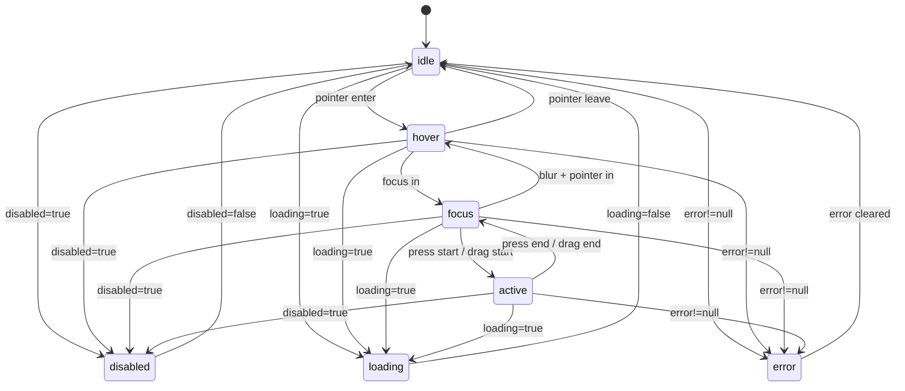
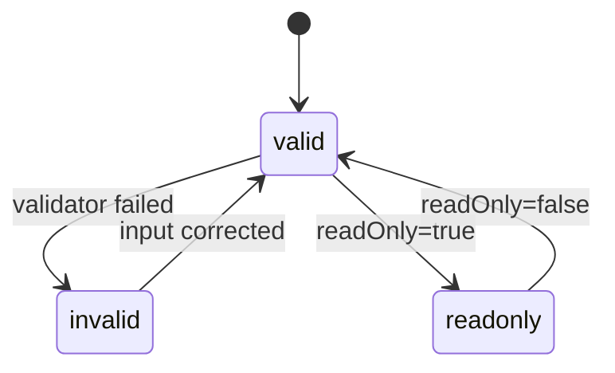
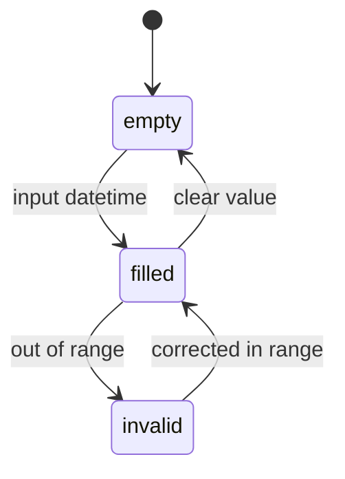
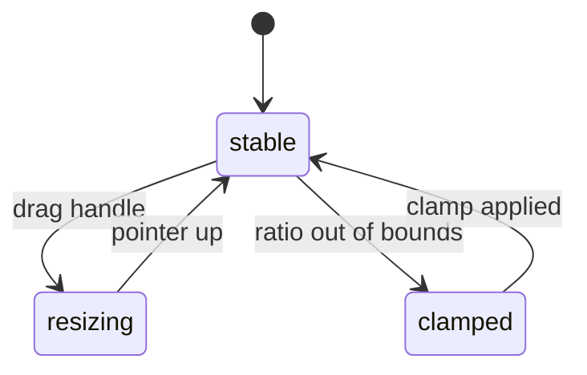
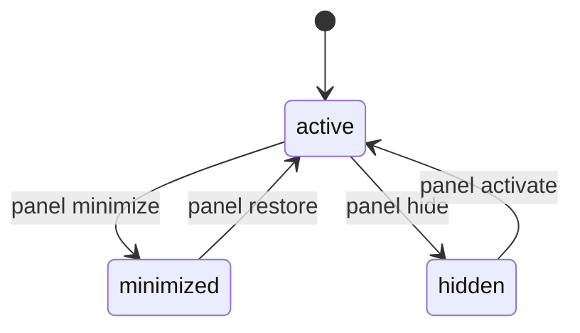
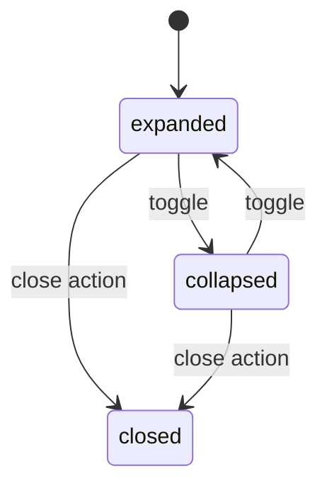
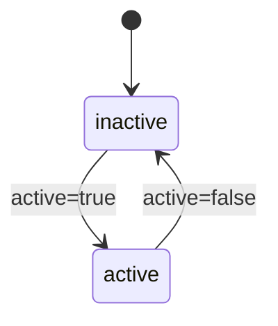
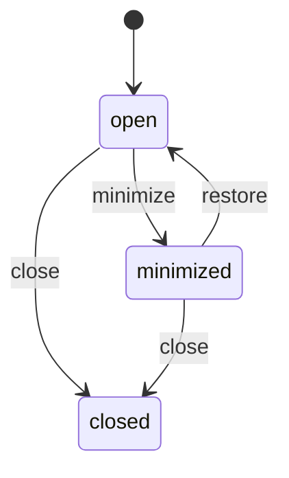

# 阶段七交互状态图与键盘清单

## 1. 适用范围

本文件覆盖阶段七全部 13 个组件：

- Data-Form：`ChipsFormField`、`ChipsFormGroup`、`ChipsVirtualList`、`ChipsDataGrid`、`ChipsTree`、`ChipsDateTime`、`ChipsCommandPalette`
- Workbench：`ChipsSplitPane`、`ChipsDockPanel`、`ChipsInspector`、`ChipsPanelHeader`、`ChipsCardShell`、`ChipsToolWindow`

状态优先级统一遵循：

`disabled > loading > error > active > focus > hover > idle`

## 2. 统一交互状态图（所有组件通用）



说明：每个组件除上述交互态外，还包含自身业务态（如 open/selected/expanded/minimized）。以下按组件给出业务态图和键盘清单。

## 3. Data-Form 组件

### 3.1 ChipsFormField



键盘清单：

| 按键 | 行为 |
|---|---|
| `Tab` / `Shift+Tab` | 进入/离开字段 |
| `Enter` | 触发表单提交链路（由宿主表单决定） |
| `Escape` | 取消当前输入（由宿主决定） |

### 3.2 ChipsFormGroup

```mermaid
stateDiagram-v2
  [*] --> normal
  normal --> has-error: any child invalid
  has-error --> normal: all child valid
  normal --> disabled-group: disabled=true
  disabled-group --> normal: disabled=false
```

键盘清单：

| 按键 | 行为 |
|---|---|
| `Tab` / `Shift+Tab` | 在组内字段间切换 |
| `Enter` | 透传到当前激活字段 |

### 3.3 ChipsVirtualList

```mermaid
stateDiagram-v2
  [*] --> ready
  ready --> scrolling: wheel/drag/key scroll
  scrolling --> ready: scroll idle
  ready --> item-active: row focused/selected
  item-active --> ready: focus leave
```

键盘清单：

| 按键 | 行为 |
|---|---|
| `ArrowDown` / `ArrowUp` | 按可见窗口移动活动项 |
| `Home` / `End` | 跳至首/尾可聚焦项 |
| `Enter` / `Space` | 激活当前项 |

### 3.4 ChipsDataGrid

```mermaid
stateDiagram-v2
  [*] --> grid-idle
  grid-idle --> row-active: pointer/key focus row
  row-active --> row-selected: select action
  row-selected --> row-active: deselect action
  grid-idle --> sorted: header sort
  sorted --> sorted: switch asc/desc
```

键盘清单：

| 按键 | 行为 |
|---|---|
| `ArrowDown` / `ArrowUp` | 行导航 |
| `Home` / `End` | 跳转首/尾行 |
| `Enter` / `Space` | 选择/取消选择当前行 |
| `ArrowLeft` / `ArrowRight` | 表头场景切换列焦点（宿主可扩展） |

### 3.5 ChipsTree

```mermaid
stateDiagram-v2
  [*] --> tree-idle
  tree-idle --> node-active: focus node
  node-active --> node-selected: activation
  node-active --> node-expanded: ArrowRight
  node-expanded --> node-collapsed: ArrowLeft
  node-collapsed --> node-expanded: ArrowRight
```

键盘清单：

| 按键 | 行为 |
|---|---|
| `ArrowDown` / `ArrowUp` | 上下节点导航 |
| `ArrowRight` | 展开当前父节点 |
| `ArrowLeft` | 折叠当前父节点或聚焦父节点 |
| `Home` / `End` | 跳至首/尾可用节点 |
| `Enter` / `Space` | 选择当前节点 |

### 3.6 ChipsDateTime



键盘清单：

| 按键 | 行为 |
|---|---|
| `Tab` / `Shift+Tab` | 聚焦/离开输入框 |
| `ArrowUp` / `ArrowDown` | 浏览器原生时间步进 |
| `Enter` | 确认输入 |

### 3.7 ChipsCommandPalette

```mermaid
stateDiagram-v2
  [*] --> closed
  closed --> open: trigger click
  open --> filtering: input query
  filtering --> open: query empty
  open --> item-selected: Enter
  item-selected --> closed: onSelect done
  open --> closed: Escape
```

键盘清单：

| 按键 | 行为 |
|---|---|
| `ArrowDown` / `ArrowUp` | 候选项高亮导航 |
| `Home` / `End` | 跳至首/尾可用候选项 |
| `Enter` | 选择高亮项并关闭面板 |
| `Escape` | 关闭面板 |

## 4. Workbench 组件

### 4.1 ChipsSplitPane



键盘清单：

| 按键 | 行为 |
|---|---|
| `ArrowLeft` / `ArrowRight` | 按步进调整分栏比例 |
| `Home` | 跳到最小比例 |
| `End` | 跳到最大比例 |
| `Enter` / `Space` | 激活分隔条控制 |

### 4.2 ChipsDockPanel



键盘清单：

| 按键 | 行为 |
|---|---|
| `ArrowLeft` / `ArrowRight` | Tab 头部导航 |
| `Home` / `End` | 跳至首/尾标签 |
| `Enter` / `Space` | 激活当前面板 |

### 4.3 ChipsInspector

```mermaid
stateDiagram-v2
  [*] --> all-collapsed
  all-collapsed --> section-open: toggle section
  section-open --> section-open: switch active section
  section-open --> all-collapsed: close all
```

键盘清单：

| 按键 | 行为 |
|---|---|
| `ArrowDown` / `ArrowUp` | 在 section header 间导航 |
| `Home` / `End` | 跳至首/尾 section |
| `Enter` / `Space` | 折叠/展开当前 section |

### 4.4 ChipsPanelHeader



键盘清单：

| 按键 | 行为 |
|---|---|
| `Tab` / `Shift+Tab` | 在标题操作区元素间移动 |
| `Enter` / `Space` | 触发折叠或关闭按钮 |

### 4.5 ChipsCardShell



键盘清单：

| 按键 | 行为 |
|---|---|
| `Tab` / `Shift+Tab` | 在 header/toolbar/content/footer 内部焦点流转 |
| `Enter` / `Space` | 透传到内部操作控件 |

### 4.6 ChipsToolWindow



键盘清单：

| 按键 | 行为 |
|---|---|
| `Tab` / `Shift+Tab` | 在窗口控件与内容区切换焦点 |
| `Enter` / `Space` | 触发最小化/恢复/关闭控制 |
| `Escape` | 由宿主策略决定是否关闭 |

## 5. 验收映射

- 对齐 `技术文档/07-组件契约与状态模型规范.md` 中状态模型与键盘基线要求。
- 对齐 `开发计划/07-阶段七-Data-Form与Workbench组件开发.md` 第 4 节“每组件提供交互状态图与键盘清单”。
