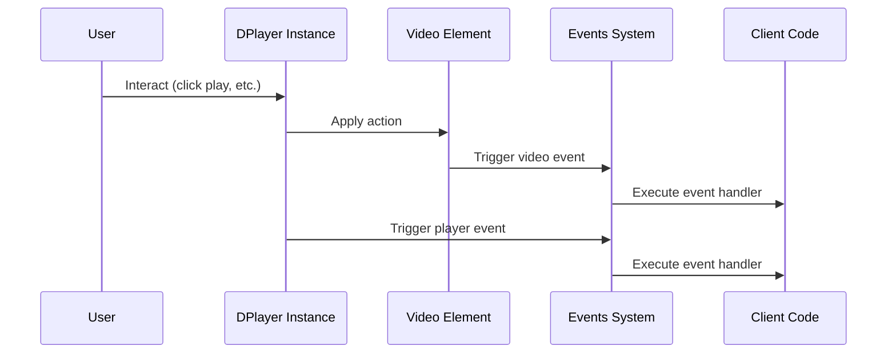
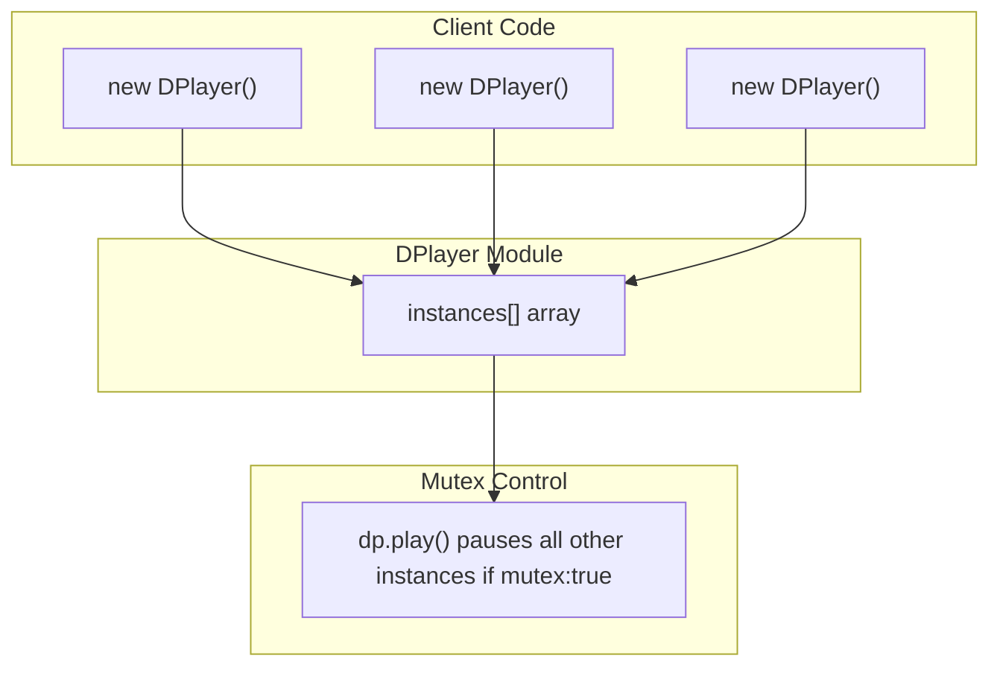
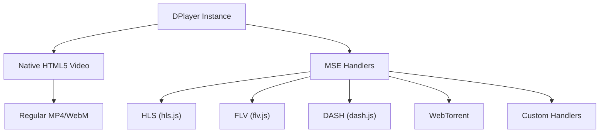
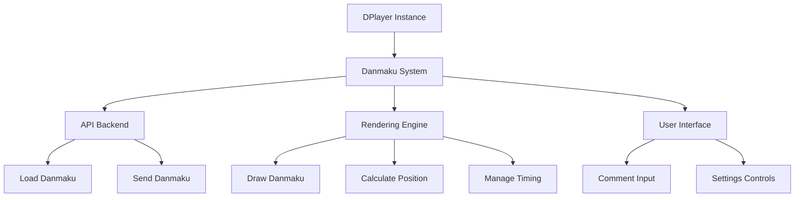

# API Reference

> **Relevant source files**
> * [docs/guide.md](https://github.com/DIYgod/DPlayer/blob/f00e304c/docs/guide.md?plain=1)
> * [docs/zh/guide.md](https://github.com/DIYgod/DPlayer/blob/f00e304c/docs/zh/guide.md?plain=1)
> * [src/js/controller.js](https://github.com/DIYgod/DPlayer/blob/f00e304c/src/js/controller.js)
> * [src/js/options.js](https://github.com/DIYgod/DPlayer/blob/f00e304c/src/js/options.js)
> * [src/js/player.js](https://github.com/DIYgod/DPlayer/blob/f00e304c/src/js/player.js)

This document provides a comprehensive reference for the DPlayer JavaScript API. It covers all the methods, properties, events, and options available for controlling and interacting with the DPlayer video player. For general usage information, see [Overview](/DIYgod/DPlayer/1-overview).

## 1. Initialization

The DPlayer instance is created by calling the constructor with a configuration object.

```javascript
const dp = new DPlayer({    container: document.getElementById('dplayer'),    video: {        url: 'video.mp4',    }});
```

### Initialization Flow

```mermaid
sequenceDiagram
  participant Client Code
  participant DPlayer Class
  participant Template
  participant Controller
  participant Video Element
  participant Features (Danmaku,HotKey,etc)

  Client Code->>DPlayer Class: new DPlayer(options)
  DPlayer Class->>DPlayer Class: Process options
  DPlayer Class->>Template: Create UI structure
  DPlayer Class->>Controller: Initialize controls
  DPlayer Class->>Video Element: Set up video element
  DPlayer Class->>Features (Danmaku,HotKey,etc): Initialize features
  DPlayer Class-->>Client Code: Return DPlayer instance
```

Sources: [src/js/player.js L28-L189](https://github.com/DIYgod/DPlayer/blob/f00e304c/src/js/player.js#L28-L189)

 [src/js/options.js L4-L71](https://github.com/DIYgod/DPlayer/blob/f00e304c/src/js/options.js#L4-L71)

### Configuration Options

The following table lists all available options when initializing DPlayer:

| Option | Type | Default | Description |
| --- | --- | --- | --- |
| container | Element | document.getElementsByClassName('dplayer')[0] | DOM element to contain the player |
| live | Boolean | false | Enable live mode |
| autoplay | Boolean | false | Enable video autoplay |
| theme | String | '#b7daff' | Theme color |
| loop | Boolean | false | Enable video loop |
| lang | String | Navigator language | Player language, supports 'en', 'zh-cn', 'zh-tw' |
| screenshot | Boolean | false | Enable screenshot function |
| airplay | Boolean | true | Enable AirPlay in Safari |
| chromecast | Boolean | false | Enable Chromecast |
| hotkey | Boolean | true | Enable keyboard shortcuts |
| preload | String | 'metadata' | Video preload, options: 'none', 'metadata', 'auto' |
| volume | Number | 0.7 | Default volume (0-1) |
| playbackSpeed | Array | [0.5, 0.75, 1, 1.25, 1.5, 2] | Available playback speeds |
| logo | String | - | URL for logo displayed in player |
| apiBackend | Object | defaultApiBackend | Custom API for danmaku |
| preventClickToggle | Boolean | false | Prevent toggling play/pause when clicking player |
| mutex | Boolean | true | Prevent multiple players playing simultaneously |
| video | Object | {} | Video source configuration (see below) |
| subtitle | Object | - | Subtitle configuration |
| danmaku | Object | - | Danmaku (comment overlay) configuration |
| contextmenu | Array | [] | Custom context menu items |
| highlight | Array | [] | Custom time markers on progress bar |

#### Video Object Options

| Option | Type | Description |
| --- | --- | --- |
| url | String | Video URL |
| pic | String | Video poster image URL |
| thumbnails | String | Video thumbnails image URL |
| type | String | Video type ('auto', 'hls', 'flv', 'dash', 'webtorrent', 'normal') |
| customType | Object | Custom type handlers |
| quality | Array | Quality levels array with name, url and type |
| defaultQuality | Number | Default quality index |

Sources: [src/js/options.js L4-L71](https://github.com/DIYgod/DPlayer/blob/f00e304c/src/js/options.js#L4-L71)

## 2. Player Methods

```

```

### Core Playback Control

| Method | Parameters | Return | Description |
| --- | --- | --- | --- |
| play() | - | - | Start video playback |
| pause() | - | - | Pause video playback |
| seek(time) | time: Number | - | Seek to a specific time in seconds |
| toggle() | - | - | Toggle between play and pause |
| speed(rate) | rate: Number | - | Set playback speed rate |
| volume(percentage, nostorage, nonotice) | percentage: Number, nostorage: Boolean, nonotice: Boolean | Number | Set volume and return current volume |

Sources: [src/js/player.js L194-L321](https://github.com/DIYgod/DPlayer/blob/f00e304c/src/js/player.js#L194-L321)

 [src/js/player.js L691-L693](https://github.com/DIYgod/DPlayer/blob/f00e304c/src/js/player.js#L691-L693)

 [src/js/player.js L287-L310](https://github.com/DIYgod/DPlayer/blob/f00e304c/src/js/player.js#L287-L310)

### Player Management

| Method | Parameters | Return | Description |
| --- | --- | --- | --- |
| on(event, handler) | event: String, handler: Function | - | Bind event listener |
| switchVideo(video, danmaku) | video: Object, danmaku: Object | - | Switch to a new video |
| switchQuality(index) | index: Number | - | Switch to a different quality |
| notice(text, time, opacity, id) | text: String, time: Number, opacity: Number, id: String | - | Display notification |
| resize() | - | - | Resize player (call after container size changes) |
| destroy() | - | - | Destroy player instance and release resources |

Sources: [src/js/player.js L326-L328](https://github.com/DIYgod/DPlayer/blob/f00e304c/src/js/player.js#L326-L328)

 [src/js/player.js L336-L358](https://github.com/DIYgod/DPlayer/blob/f00e304c/src/js/player.js#L336-L358)

 [src/js/player.js L572-L642](https://github.com/DIYgod/DPlayer/blob/f00e304c/src/js/player.js#L572-L642)

 [src/js/player.js L644-L679](https://github.com/DIYgod/DPlayer/blob/f00e304c/src/js/player.js#L644-L679)

 [src/js/player.js L681-L689](https://github.com/DIYgod/DPlayer/blob/f00e304c/src/js/player.js#L681-L689)

 [src/js/player.js L695-L708](https://github.com/DIYgod/DPlayer/blob/f00e304c/src/js/player.js#L695-L708)

## 3. Player Properties

DPlayer exposes several properties that allow you to access internal components:

### video

The `video` property provides direct access to the native HTML5 video element. This allows you to use all standard HTML5 video properties and methods.

Common video properties:

* `dp.video.currentTime` - Current playback position in seconds
* `dp.video.duration` - Total duration of the video in seconds
* `dp.video.paused` - Boolean indicating if the video is paused
* `dp.video.volume` - Current volume (0-1)

Sources: [src/js/player.js L109](https://github.com/DIYgod/DPlayer/blob/f00e304c/src/js/player.js#L109-L109)

### danmaku

The `danmaku` property provides access to the danmaku (comment overlay) subsystem:

| Method | Parameters | Description |
| --- | --- | --- |
| send(danmaku, callback) | danmaku: Object, callback: Function | Send a new danmaku to the backend |
| draw(danmaku) | danmaku: Object | Draw a danmaku on screen without sending to backend |
| opacity(percentage) | percentage: Number | Set danmaku opacity (0-1) |
| clear() | - | Clear all danmaku from screen |
| hide() | - | Hide danmaku display |
| show() | - | Show danmaku display |

Danmaku object format:

```css
{    text: 'Danmaku text content',    color: '#FFFFFF',     // Color in hex format    type: 'right'         // 'right', 'top', or 'bottom'}
```

Sources: [src/js/player.js L119-L155](https://github.com/DIYgod/DPlayer/blob/f00e304c/src/js/player.js#L119-L155)

### fullScreen

The `fullScreen` property provides methods to control the fullscreen behavior:

| Method | Parameters | Description |
| --- | --- | --- |
| request(type) | type: String | Request fullscreen mode ('web' or 'browser') |
| cancel(type) | type: String | Exit fullscreen mode ('web' or 'browser') |

Sources: [src/js/player.js L115](https://github.com/DIYgod/DPlayer/blob/f00e304c/src/js/player.js#L115-L115)

## 4. Event Binding

DPlayer uses an event system that allows you to respond to player and video events:

```javascript
dp.on('play', function() {    console.log('Video started playing');});
```

### Video Events

These events are standard HTML5 video events that are proxied through the DPlayer API:

* abort
* canplay
* canplaythrough
* durationchange
* emptied
* ended
* error
* loadeddata
* loadedmetadata
* loadstart
* mozaudioavailable
* pause
* play
* playing
* progress
* ratechange
* seeked
* seeking
* stalled
* suspend
* timeupdate
* volumechange
* waiting

### Player Events

These events are specific to DPlayer features:

* screenshot
* thumbnails_show
* thumbnails_hide
* danmaku_show
* danmaku_hide
* danmaku_clear
* danmaku_loaded
* danmaku_send
* danmaku_opacity
* contextmenu_show
* contextmenu_hide
* notice_show
* notice_hide
* quality_start
* quality_end
* destroy
* resize
* fullscreen
* fullscreen_cancel
* webfullscreen
* webfullscreen_cancel
* subtitle_show
* subtitle_hide
* subtitle_change



Sources: [src/js/player.js L326-L328](https://github.com/DIYgod/DPlayer/blob/f00e304c/src/js/player.js#L326-L328)

 [src/js/player.js L492-L549](https://github.com/DIYgod/DPlayer/blob/f00e304c/src/js/player.js#L492-L549)

## 5. Player Instance Management

DPlayer keeps track of all player instances created on the page:



When a player's `play()` method is called and the `mutex` option is set to `true` (default), all other player instances will be paused automatically.

Sources: [src/js/player.js L25-L26](https://github.com/DIYgod/DPlayer/blob/f00e304c/src/js/player.js#L25-L26)

 [src/js/player.js L241-L247](https://github.com/DIYgod/DPlayer/blob/f00e304c/src/js/player.js#L241-L247)

## 6. Quality Switching

DPlayer supports multiple quality levels for the same video:

```javascript
const dp = new DPlayer({    container: document.getElementById('dplayer'),    video: {        quality: [            {                name: 'HD',                url: 'video.m3u8',                type: 'hls'            },            {                name: 'SD',                url: 'video.mp4',                type: 'normal'            }        ],        defaultQuality: 0,        // other video options    }}); // Later, switch qualitydp.switchQuality(1); // Switch to SD
```

The `switchQuality` method handles:

1. Saving current playback position
2. Loading the new quality source
3. Restoring playback from the previous position
4. Maintaining play/pause state

Sources: [src/js/player.js L572-L642](https://github.com/DIYgod/DPlayer/blob/f00e304c/src/js/player.js#L572-L642)

## 7. Media Source Extensions Support

DPlayer supports various streaming formats through Media Source Extensions (MSE):



To use these formats, you need to:

1. Load the appropriate library (hls.js, flv.js, etc.) before DPlayer
2. Specify the correct type in the video configuration
3. Optionally provide format-specific configuration via `pluginOptions`

MSE support is initialized automatically based on the video URL and specified type.

Sources: [src/js/player.js L360-L484](https://github.com/DIYgod/DPlayer/blob/f00e304c/src/js/player.js#L360-L484)

## 8. Danmaku System

The danmaku system provides real-time comment overlays on the video:



To access the danmaku system:

* `dp.danmaku.send()` - Send a new comment
* `dp.danmaku.draw()` - Draw a comment without sending to backend
* `dp.danmaku.opacity()` - Adjust opacity
* `dp.danmaku.clear()` - Clear all comments
* `dp.danmaku.hide()` - Hide comments
* `dp.danmaku.show()` - Show comments

Sources: [src/js/player.js L119-L155](https://github.com/DIYgod/DPlayer/blob/f00e304c/src/js/player.js#L119-L155)

## 9. API Version

You can access the DPlayer version with the static property:

```javascript
console.log(DPlayer.version);
```

Sources: [src/js/player.js L710-L713](https://github.com/DIYgod/DPlayer/blob/f00e304c/src/js/player.js#L710-L713)