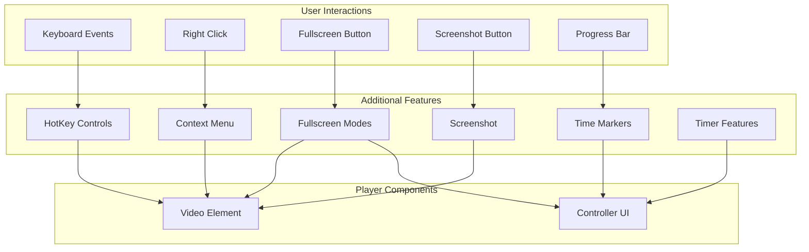
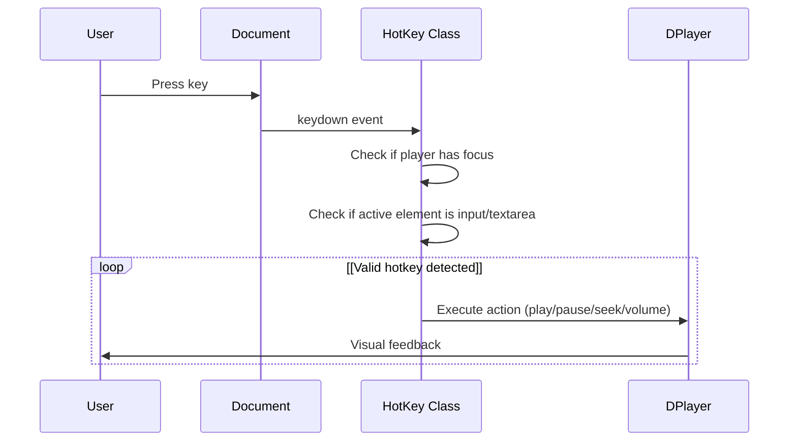
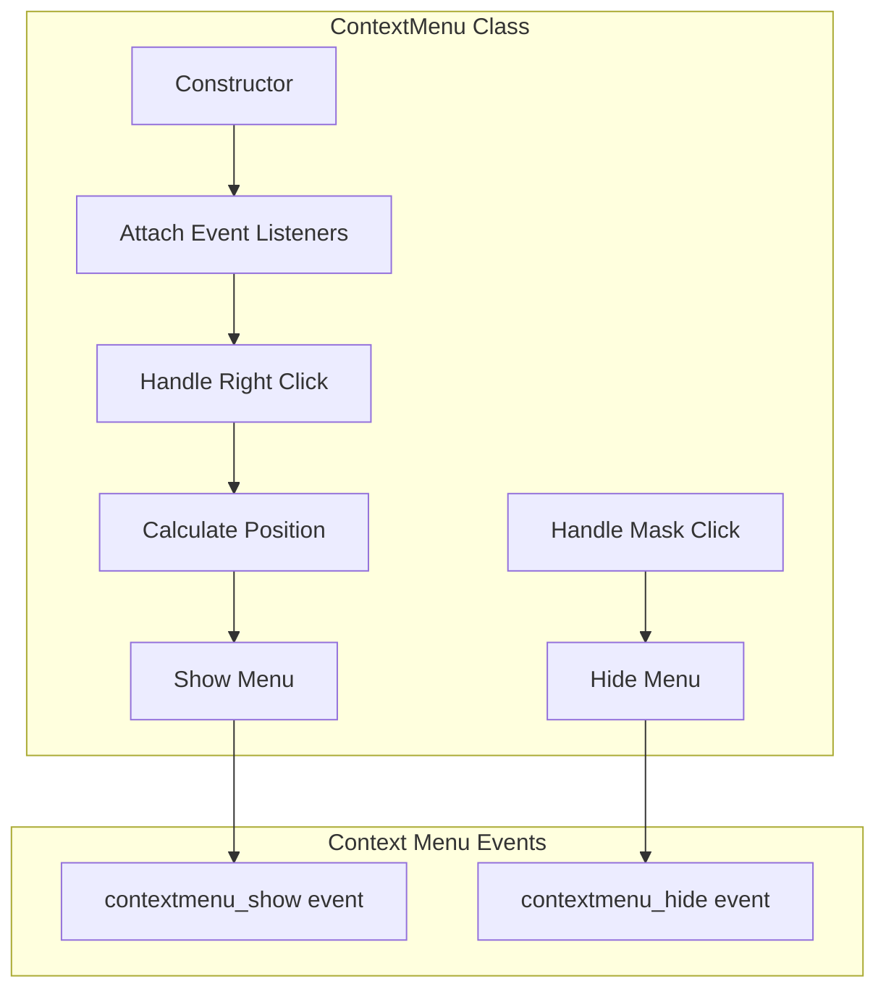
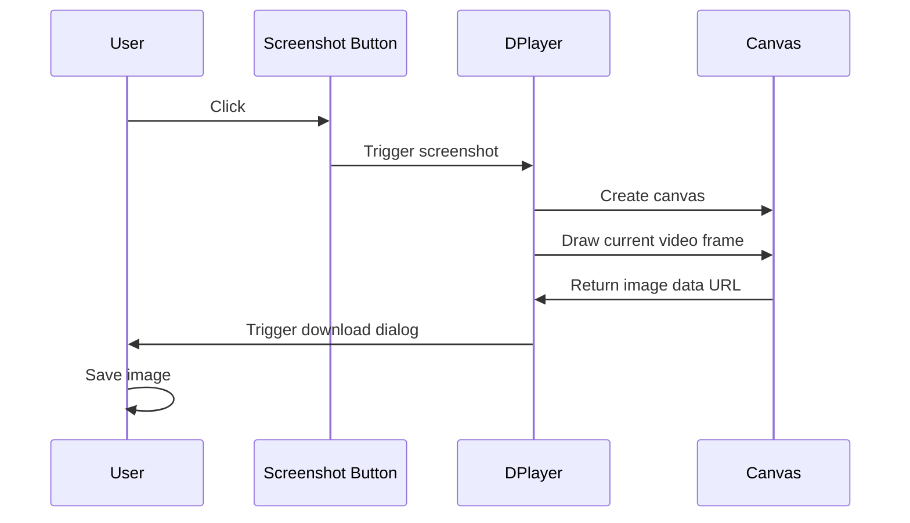
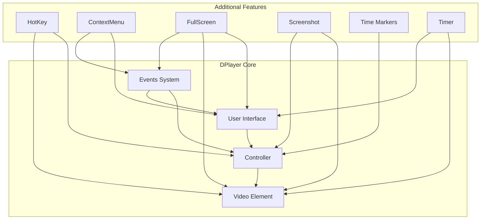

# Additional Features

> **Relevant source files**
> * [docs/guide.md](https://github.com/DIYgod/DPlayer/blob/f00e304c/docs/guide.md?plain=1)
> * [docs/zh/guide.md](https://github.com/DIYgod/DPlayer/blob/f00e304c/docs/zh/guide.md?plain=1)
> * [src/js/contextmenu.js](https://github.com/DIYgod/DPlayer/blob/f00e304c/src/js/contextmenu.js)
> * [src/js/fullscreen.js](https://github.com/DIYgod/DPlayer/blob/f00e304c/src/js/fullscreen.js)
> * [src/js/hotkey.js](https://github.com/DIYgod/DPlayer/blob/f00e304c/src/js/hotkey.js)
> * [src/js/timer.js](https://github.com/DIYgod/DPlayer/blob/f00e304c/src/js/timer.js)

This page documents the supplementary features provided by DPlayer that enhance user experience beyond basic video playback. These include keyboard controls, custom right-click menu, fullscreen modes, screenshot capability, and other utility features. For information about the core video playback system, see [Core Architecture](/DIYgod/DPlayer/2-core-architecture), and for information about the specialized danmaku and subtitle systems, see [Danmaku System](/DIYgod/DPlayer/3.1-danmaku-system) and [Subtitle System](/DIYgod/DPlayer/3.3-subtitle-system) respectively.

## Feature Overview

DPlayer includes several additional features that make it more than just a basic video player:

| Feature | Description | Configuration Option |
| --- | --- | --- |
| Hotkeys | Keyboard shortcuts for common player controls | `hotkey: true` |
| Context Menu | Customizable right-click menu | `contextmenu: []` |
| Fullscreen | Both browser and web fullscreen modes | `fullScreen.request()` API |
| Screenshot | Take screenshots of the current frame | `screenshot: true` |
| Time Markers | Custom markers on the progress bar | `highlight: []` |
| Info Panel | Display technical information about playback | Internal API |



Sources: [docs/guide.md L83-L129](https://github.com/DIYgod/DPlayer/blob/f00e304c/docs/guide.md?plain=1#L83-L129)

 [docs/zh/guide.md L75-L119](https://github.com/DIYgod/DPlayer/blob/f00e304c/docs/zh/guide.md?plain=1#L75-L119)

## Hotkey Controls

DPlayer offers keyboard shortcuts that allow users to control playback without using the mouse. This feature is enabled by default but can be disabled by setting `hotkey: false` in the player options.

### Supported Hotkeys

| Key | Action |
| --- | --- |
| Space | Toggle play/pause |
| Left Arrow | Seek backward 5 seconds |
| Right Arrow | Seek forward 5 seconds |
| Up Arrow | Increase volume |
| Down Arrow | Decrease volume |
| Escape | Exit web fullscreen mode |

### Implementation

The hotkey system works by attaching event listeners to keyboard events and checking if the player has focus before taking action. It also intelligently ignores hotkeys when the user is typing in form elements.



Sources: [src/js/hotkey.js L1-L76](https://github.com/DIYgod/DPlayer/blob/f00e304c/src/js/hotkey.js#L1-L76)

The hotkey implementation includes special handling for live streams, where seeking is disabled:

```
// Prevent seeking in live streamsif (this.player.options.live) {    break;}
```

Sources: [src/js/hotkey.js L27-L29](https://github.com/DIYgod/DPlayer/blob/f00e304c/src/js/hotkey.js#L27-L29)

 [src/js/hotkey.js L35-L37](https://github.com/DIYgod/DPlayer/blob/f00e304c/src/js/hotkey.js#L35-L37)

## Context Menu

DPlayer allows for a customizable right-click menu, replacing the browser's default context menu. This provides a way to add custom actions or information to the player.

### Configuration

The context menu is configured through the `contextmenu` option when initializing the player:

```javascript
const dp = new DPlayer({    container: document.getElementById('dplayer'),    contextmenu: [        {            text: 'Custom Option',            link: 'https://github.com/DIYgod/DPlayer',        },        {            text: 'Another Option',            click: (player) => {                player.notice('Clicked on custom option');            },        },    ],});
```

### Implementation

The context menu system handles positioning of the menu within the player container, ensuring it remains visible even when triggered near edges. It also includes a mask that closes the menu when clicked elsewhere.



Sources: [src/js/contextmenu.js L1-L72](https://github.com/DIYgod/DPlayer/blob/f00e304c/src/js/contextmenu.js#L1-L72)

The context menu positioning logic ensures the menu stays within the player's boundaries:

```
// Position menu horizontallyif (x + this.player.template.menu.offsetWidth >= clientRect.width) {    this.player.template.menu.style.right = clientRect.width - x + 'px';    this.player.template.menu.style.left = 'initial';} else {    this.player.template.menu.style.left = x + 'px';    this.player.template.menu.style.right = 'initial';} // Position menu verticallyif (y + this.player.template.menu.offsetHeight >= clientRect.height) {    this.player.template.menu.style.bottom = clientRect.height - y + 'px';    this.player.template.menu.style.top = 'initial';} else {    this.player.template.menu.style.top = y + 'px';    this.player.template.menu.style.bottom = 'initial';}
```

Sources: [src/js/contextmenu.js L37-L51](https://github.com/DIYgod/DPlayer/blob/f00e304c/src/js/contextmenu.js#L37-L51)

## Fullscreen

DPlayer supports two types of fullscreen modes:

1. **Browser Fullscreen**: Uses the browser's native Fullscreen API
2. **Web Fullscreen**: Expands the player to fill the browser window without using the Fullscreen API

### Fullscreen API

Fullscreen functionality can be accessed through the player's API:

```
// Request browser fullscreendp.fullScreen.request('browser'); // Request web fullscreendp.fullScreen.request('web'); // Toggle fullscreendp.fullScreen.toggle('browser'); // Exit fullscreendp.fullScreen.cancel('browser');
```

### Implementation

The fullscreen system accounts for browser compatibility issues by supporting multiple vendor-prefixed versions of the Fullscreen API. It also handles scroll position preservation when entering and exiting fullscreen.

```

```

Sources: [src/js/fullscreen.js L1-L140](https://github.com/DIYgod/DPlayer/blob/f00e304c/src/js/fullscreen.js#L1-L140)

The fullscreen implementation includes a significant amount of code for browser compatibility:

```
// Request fullscreen with various browser prefixesif (this.player.container.requestFullscreen) {    this.player.container.requestFullscreen();} else if (this.player.container.mozRequestFullScreen) {    this.player.container.mozRequestFullScreen();} else if (this.player.container.webkitRequestFullscreen) {    this.player.container.webkitRequestFullscreen();} else if (this.player.video.webkitEnterFullscreen) {    // Safari for iOS    this.player.video.webkitEnterFullscreen();} else if (this.player.video.webkitEnterFullScreen) {    this.player.video.webkitEnterFullScreen();} else if (this.player.container.msRequestFullscreen) {    this.player.container.msRequestFullscreen();}
```

Sources: [src/js/fullscreen.js L66-L79](https://github.com/DIYgod/DPlayer/blob/f00e304c/src/js/fullscreen.js#L66-L79)

## Screenshot Feature

DPlayer includes a screenshot feature that allows users to capture the current frame of the video. This feature must be explicitly enabled in the player options.

### Configuration

To enable screenshots:

```javascript
const dp = new DPlayer({    container: document.getElementById('dplayer'),    screenshot: true,    video: {        url: 'video.mp4',        pic: 'poster.jpg'    }});
```

**Important Note**: When using the screenshot feature, both the video and video poster must have Cross-Origin Resource Sharing (CORS) enabled.

### Implementation

When the screenshot button is clicked, the player:

1. Creates a canvas element
2. Draws the current video frame on the canvas
3. Converts the canvas to a data URL
4. Creates a download link with the image data
5. Triggers a download of the image

This process happens entirely on the client side without server interaction.



Sources: [docs/guide.md L93](https://github.com/DIYgod/DPlayer/blob/f00e304c/docs/guide.md?plain=1#L93-L93)

 [docs/zh/guide.md L83](https://github.com/DIYgod/DPlayer/blob/f00e304c/docs/zh/guide.md?plain=1#L83-L83)

## Time Markers (Highlights)

DPlayer supports adding custom time markers on the progress bar, which can be used to highlight important moments in the video.

### Configuration

Time markers are configured through the `highlight` option:

```javascript
const dp = new DPlayer({    container: document.getElementById('dplayer'),    highlight: [        {            time: 20,            text: 'Marker at 20 seconds'        },        {            time: 120,            text: 'Marker at 2 minutes'        }    ],    video: {        url: 'video.mp4'    }});
```

Each highlight item requires a `time` value (in seconds) and a `text` value for the tooltip.

Sources: [docs/guide.md L180-L189](https://github.com/DIYgod/DPlayer/blob/f00e304c/docs/guide.md?plain=1#L180-L189)

 [docs/zh/guide.md L170-L179](https://github.com/DIYgod/DPlayer/blob/f00e304c/docs/zh/guide.md?plain=1#L170-L179)

## Timer Features

DPlayer includes a Timer module that handles various timing-related functionality:

1. **Loading Checker**: Detects when the video is buffering
2. **FPS Checker**: Calculates and displays the current playback frames per second
3. **Info Panel Updater**: Updates the technical information display

### Implementation

The Timer module creates and manages separate interval checkers for different features:

```

```

Sources: [src/js/timer.js L1-L103](https://github.com/DIYgod/DPlayer/blob/f00e304c/src/js/timer.js#L1-L103)

The loading checker works by monitoring the current playback position to detect when the video is stuck buffering:

```
// Check if playback position is not advancingcurrentPlayPos = this.player.video.currentTime;if (!bufferingDetected && currentPlayPos === lastPlayPos && !this.player.video.paused) {    this.player.container.classList.add('dplayer-loading');    bufferingDetected = true;} // Check if buffering has endedif (bufferingDetected && currentPlayPos > lastPlayPos && !this.player.video.paused) {    this.player.container.classList.remove('dplayer-loading');    bufferingDetected = false;}
```

Sources: [src/js/timer.js L37-L44](https://github.com/DIYgod/DPlayer/blob/f00e304c/src/js/timer.js#L37-L44)

The FPS checker uses `requestAnimationFrame` to calculate the frame rate:

```javascript
this.fpsIndex++;const fpsCurrent = new Date();if (fpsCurrent - this.fpsStart > 1000) {    this.player.infoPanel.fps((this.fpsIndex / (fpsCurrent - this.fpsStart)) * 1000);    this.fpsStart = new Date();    this.fpsIndex = 0;}
```

Sources: [src/js/timer.js L58-L64](https://github.com/DIYgod/DPlayer/blob/f00e304c/src/js/timer.js#L58-L64)

## Feature Relationships and Integration

The additional features are integrated with the core player functionality and often work together to enhance the user experience. The following diagram illustrates how these features interact:



Sources: [docs/guide.md L293-L369](https://github.com/DIYgod/DPlayer/blob/f00e304c/docs/guide.md?plain=1#L293-L369)

 [docs/zh/guide.md L294-L353](https://github.com/DIYgod/DPlayer/blob/f00e304c/docs/zh/guide.md?plain=1#L294-L353)

## Conclusion

DPlayer's additional features significantly enhance the basic video playback functionality, providing a comprehensive user experience. These features are designed to be modular, allowing developers to enable or disable them as needed for their specific use cases.

Most features can be configured through the player options during initialization, and many can also be controlled programmatically through the player's API. This flexibility makes DPlayer suitable for a wide range of applications, from simple video playback to complex interactive media experiences.