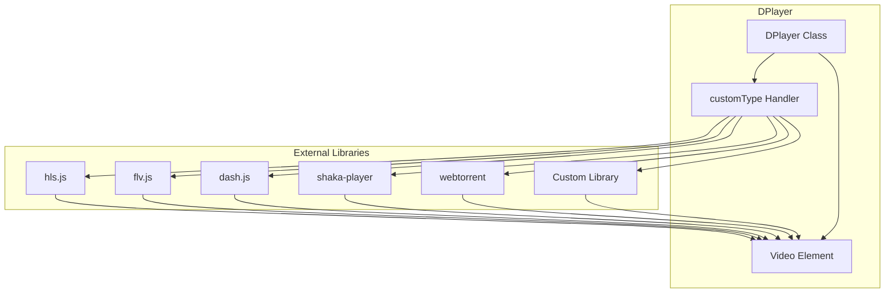
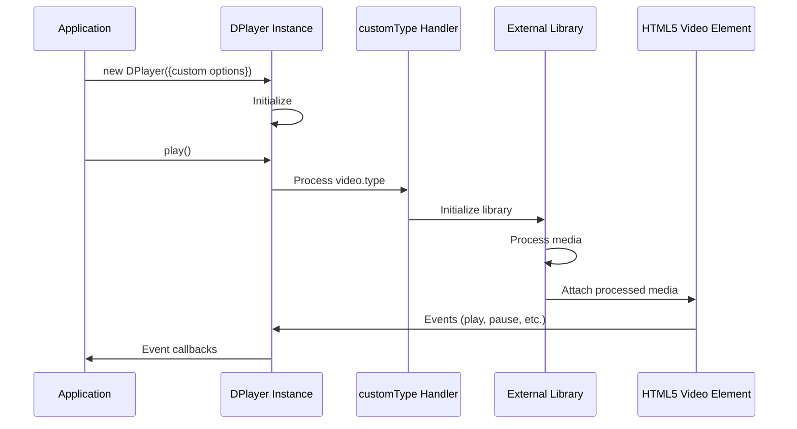
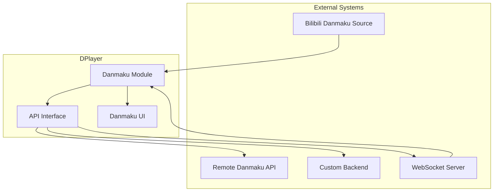

# Advanced Examples

> **Relevant source files**
> * [demo/demo.js](https://github.com/DIYgod/DPlayer/blob/f00e304c/demo/demo.js)
> * [docs/guide.md](https://github.com/DIYgod/DPlayer/blob/f00e304c/docs/guide.md?plain=1)
> * [docs/zh/guide.md](https://github.com/DIYgod/DPlayer/blob/f00e304c/docs/zh/guide.md?plain=1)
> * [src/template/player.art](https://github.com/DIYgod/DPlayer/blob/f00e304c/src/template/player.art)

This page provides detailed examples of advanced DPlayer implementation scenarios. It demonstrates complex configurations, custom integrations, and specialized features that go beyond basic player setup. For basic DPlayer usage, see [Basic Usage](/DIYgod/DPlayer/5.1-basic-usage).

## 1. Advanced Player Configuration

DPlayer supports extensive configuration options that enable complex customization. The following example shows a comprehensive player setup with multiple advanced features enabled.

```javascript
const dp = new DPlayer({    container: document.getElementById('dplayer'),    autoplay: false,    theme: '#FADFA3',    loop: true,    lang: 'zh-cn',    screenshot: true,    hotkey: true,    preload: 'auto',    logo: 'logo.png',    volume: 0.7,    mutex: true,    video: {        quality: [            {                name: 'HD',                url: 'demo.m3u8',                type: 'hls',            },            {                name: 'SD',                url: 'demo.mp4',                type: 'normal',            },        ],        defaultQuality: 0,        pic: 'demo.png',        thumbnails: 'thumbnails.jpg',    },    subtitle: {        url: 'demo.vtt',        type: 'webvtt',        fontSize: '25px',        bottom: '10%',        color: '#b7daff',    },    danmaku: {        id: '9E2E3368B56CDBB4',        api: 'https://api.prprpr.me/dplayer/',        token: 'tokendemo',        maximum: 1000,        addition: ['https://api.prprpr.me/dplayer/v3/bilibili?aid=4157142'],        user: 'DIYgod',        bottom: '15%',        unlimited: true,        speedRate: 0.5,    },    contextmenu: [        {            text: 'Custom menu item',            link: 'https://github.com/DIYgod/DPlayer',        },        {            text: 'Another custom item',            click: (player) => {                console.log(player);            },        },    ],    highlight: [        {            time: 20,            text: 'This is at 20 seconds',        },        {            time: 120,            text: 'This is at 2 minutes',        },    ],});
```

This configuration demonstrates:

* Multiple quality options with HLS and normal formats
* Custom subtitles with styling
* Danmaku with custom settings and external sources
* Custom context menu items
* Timeline highlights
* Appearance customization

Sources: [docs/guide.md L130-L190](https://github.com/DIYgod/DPlayer/blob/f00e304c/docs/guide.md?plain=1#L130-L190)

 [docs/zh/guide.md L121-L180](https://github.com/DIYgod/DPlayer/blob/f00e304c/docs/zh/guide.md?plain=1#L121-L180)

## 2. Custom Media Format Handling

### 2.1 Media Source Extensions (MSE) Integration

DPlayer supports various media formats through MSE. The diagram below illustrates how DPlayer integrates with different media format libraries:



Sources: [docs/guide.md L446-L690](https://github.com/DIYgod/DPlayer/blob/f00e304c/docs/guide.md?plain=1#L446-L690)

 [docs/zh/guide.md L431-L675](https://github.com/DIYgod/DPlayer/blob/f00e304c/docs/zh/guide.md?plain=1#L431-L675)

### 2.2 HLS Implementation

```javascript
// Method 1: Using built-in pluginconst dp = new DPlayer({    container: document.getElementById('dplayer'),    video: {        url: 'demo.m3u8',        type: 'hls',    },    pluginOptions: {        hls: {            // hls.js configuration options        },    },}); // Method 2: Using customTypeconst dp = new DPlayer({    container: document.getElementById('dplayer'),    video: {        url: 'demo.m3u8',        type: 'customHls',        customType: {            customHls: function (video, player) {                const hls = new Hls();                hls.loadSource(video.src);                hls.attachMedia(video);            },        },    },});
```

Sources: [docs/guide.md L449-L497](https://github.com/DIYgod/DPlayer/blob/f00e304c/docs/guide.md?plain=1#L449-L497)

 [docs/zh/guide.md L434-L481](https://github.com/DIYgod/DPlayer/blob/f00e304c/docs/zh/guide.md?plain=1#L434-L481)

### 2.3 FLV Implementation

```javascript
// Method 1: Using built-in pluginconst dp = new DPlayer({    container: document.getElementById('dplayer'),    video: {        url: 'demo.flv',        type: 'flv',    },    pluginOptions: {        flv: {            mediaDataSource: {                // mediaDataSource config            },            config: {                // flv.js config            },        },    },}); // Method 2: Using customTypeconst dp = new DPlayer({    container: document.getElementById('dplayer'),    video: {        url: 'demo.flv',        type: 'customFlv',        customType: {            customFlv: function (video, player) {                const flvPlayer = flvjs.createPlayer({                    type: 'flv',                    url: video.src,                });                flvPlayer.attachMediaElement(video);                flvPlayer.load();            },        },    },});
```

Sources: [docs/guide.md L569-L626](https://github.com/DIYgod/DPlayer/blob/f00e304c/docs/guide.md?plain=1#L569-L626)

 [docs/zh/guide.md L553-L609](https://github.com/DIYgod/DPlayer/blob/f00e304c/docs/zh/guide.md?plain=1#L553-L609)

### 2.4 WebTorrent Implementation

```javascript
const dp = new DPlayer({    container: document.getElementById('dplayer'),    video: {        url: 'magnet:?xt=urn:btih:08ada5a7a6183aae1e09d831df6748d566095a10&dn=Sintel...',        type: 'customWebTorrent',        customType: {            customWebTorrent: function (video, player) {                player.container.classList.add('dplayer-loading');                const client = new WebTorrent();                const torrentId = video.src;                client.add(torrentId, (torrent) => {                    const file = torrent.files.find((file) => file.name.endsWith('.mp4'));                    file.renderTo(                        video,                        {                            autoplay: player.options.autoplay,                        },                        () => {                            player.container.classList.remove('dplayer-loading');                        }                    );                });            },        },    },});
```

Sources: [docs/guide.md L662-L689](https://github.com/DIYgod/DPlayer/blob/f00e304c/docs/guide.md?plain=1#L662-L689)

 [docs/zh/guide.md L646-L673](https://github.com/DIYgod/DPlayer/blob/f00e304c/docs/zh/guide.md?plain=1#L646-L673)

### 2.5 Custom P2P Integration

DPlayer can be integrated with P2P libraries to enhance streaming capabilities:

```typescript
var type = 'normal';if (Hls.isSupported() && Hls.WEBRTC_SUPPORT) {    type = 'customHls';}const dp = new DPlayer({    container: document.getElementById('dplayer'),    video: {        url: 'demo.m3u8',        type: type,        customType: {            customHls: function (video, player) {                const hls = new Hls({                    debug: false,                    p2pConfig: {                        live: false,                        // Additional P2P configuration options                    },                });                hls.loadSource(video.src);                hls.attachMedia(video);            },        },    },});
```

Sources: [docs/guide.md L695-L728](https://github.com/DIYgod/DPlayer/blob/f00e304c/docs/guide.md?plain=1#L695-L728)

 [docs/zh/guide.md L678-L711](https://github.com/DIYgod/DPlayer/blob/f00e304c/docs/zh/guide.md?plain=1#L678-L711)

## 3. Custom Media Format Processing Flow

The following diagram illustrates the flow of processing a custom media format in DPlayer:



Sources: [docs/guide.md L466-L497](https://github.com/DIYgod/DPlayer/blob/f00e304c/docs/guide.md?plain=1#L466-L497)

 [docs/guide.md L599-L626](https://github.com/DIYgod/DPlayer/blob/f00e304c/docs/guide.md?plain=1#L599-L626)

 [docs/guide.md L662-L689](https://github.com/DIYgod/DPlayer/blob/f00e304c/docs/guide.md?plain=1#L662-L689)

## 4. Quality Switching

DPlayer supports multiple video qualities with seamless switching capability:

```javascript
const dp = new DPlayer({    container: document.getElementById('dplayer'),    video: {        quality: [            {                name: 'HD',                url: 'demo.m3u8',                type: 'hls',            },            {                name: 'SD',                url: 'demo.mp4',                type: 'normal',            },        ],        defaultQuality: 0,        pic: 'demo.png',        thumbnails: 'thumbnails.jpg',    },}); // Later, switch quality programmaticallydp.switchQuality(1); // Switch to SD
```

The video quality selector appears in the control bar when multiple qualities are defined. Users can switch qualities manually, or you can switch programmatically using the API.

Sources: [docs/guide.md L371-L412](https://github.com/DIYgod/DPlayer/blob/f00e304c/docs/guide.md?plain=1#L371-L412)

 [docs/zh/guide.md L355-L396](https://github.com/DIYgod/DPlayer/blob/f00e304c/docs/zh/guide.md?plain=1#L355-L396)

 [demo/demo.js L166-L182](https://github.com/DIYgod/DPlayer/blob/f00e304c/demo/demo.js#L166-L182)

## 5. Advanced Event Handling

DPlayer provides a comprehensive event system for monitoring and responding to player states and user interactions:

```

```

Example of comprehensive event handling:

```javascript
// Register event handlers for all eventsconst events = [    'abort', 'canplay', 'canplaythrough', 'durationchange', 'emptied', 'ended', 'error',    'loadeddata', 'loadedmetadata', 'loadstart', 'mozaudioavailable', 'pause', 'play',    'playing', 'ratechange', 'seeked', 'seeking', 'stalled',    'volumechange', 'waiting',    'screenshot',    'thumbnails_show', 'thumbnails_hide',    'danmaku_show', 'danmaku_hide', 'danmaku_clear',    'danmaku_loaded', 'danmaku_send', 'danmaku_opacity',    'contextmenu_show', 'contextmenu_hide',    'notice_show', 'notice_hide',    'quality_start', 'quality_end',    'destroy',    'resize',    'fullscreen', 'fullscreen_cancel', 'webfullscreen', 'webfullscreen_cancel',    'subtitle_show', 'subtitle_hide', 'subtitle_change']; // Register handlers for all eventsfor (let i = 0; i < events.length; i++) {    dp.on(events[i], (info) => {        console.log(`Event: ${events[i]}`, info);    });}
```

Sources: [docs/guide.md L308-L369](https://github.com/DIYgod/DPlayer/blob/f00e304c/docs/guide.md?plain=1#L308-L369)

 [docs/zh/guide.md L294-L353](https://github.com/DIYgod/DPlayer/blob/f00e304c/docs/zh/guide.md?plain=1#L294-L353)

 [demo/demo.js L140-L163](https://github.com/DIYgod/DPlayer/blob/f00e304c/demo/demo.js#L140-L163)

## 6. Advanced Danmaku Usage

### 6.1 Danmaku System Integration

DPlayer's danmaku system allows for both integration with external APIs and real-time danmaku generation:



Sources: [docs/guide.md L415-L444](https://github.com/DIYgod/DPlayer/blob/f00e304c/docs/guide.md?plain=1#L415-L444)

 [docs/zh/guide.md L399-L428](https://github.com/DIYgod/DPlayer/blob/f00e304c/docs/zh/guide.md?plain=1#L399-L428)

### 6.2 Custom Danmaku Backend

For specialized needs, you can implement a custom danmaku backend:

```javascript
const dp = new DPlayer({    container: document.getElementById('dplayer'),    danmaku: true,    apiBackend: {        read: function (options) {            // Custom logic to retrieve danmaku            // Example: fetch from your server, parse from file, etc.            console.log('Reading danmaku with options:', options);            const danmakuData = [                {                    text: 'Custom danmaku 1',                    time: 5,                    color: '#fff',                    type: 'right',                },                {                    text: 'Custom danmaku 2',                    time: 10,                    color: '#ff0',                    type: 'top',                },            ];            options.success(danmakuData);        },        send: function (options) {            // Custom logic to send danmaku            // Example: send to your server, save to file, etc.            console.log('Sending danmaku:', options.data);            options.success();        },    },    video: {        url: 'demo.mp4',    },});
```

Sources: [docs/guide.md L746-L758](https://github.com/DIYgod/DPlayer/blob/f00e304c/docs/guide.md?plain=1#L746-L758)

 [docs/zh/guide.md L729-L741](https://github.com/DIYgod/DPlayer/blob/f00e304c/docs/zh/guide.md?plain=1#L729-L741)

### 6.3 Real-time Danmaku Generation

You can dynamically generate danmaku in real-time:

```javascript
// Draw a danmaku directlydp.danmaku.draw({    text: 'Dynamic danmaku example',    color: '#fff',    type: 'top', // 'top', 'bottom', or 'right'}); // Send a danmaku (gets stored in backend)dp.danmaku.send(    {        text: 'Sent to backend',        color: '#b7daff',        type: 'right',    },    function () {        console.log('Danmaku sent successfully');    });
```

Sources: [docs/guide.md L272-L280](https://github.com/DIYgod/DPlayer/blob/f00e304c/docs/guide.md?plain=1#L272-L280)

 [docs/zh/guide.md L258-L266](https://github.com/DIYgod/DPlayer/blob/f00e304c/docs/zh/guide.md?plain=1#L258-L266)

 [docs/guide.md L257-L270](https://github.com/DIYgod/DPlayer/blob/f00e304c/docs/guide.md?plain=1#L257-L270)

 [docs/zh/guide.md L243-L256](https://github.com/DIYgod/DPlayer/blob/f00e304c/docs/zh/guide.md?plain=1#L243-L256)

## 7. Live Streaming Implementation

DPlayer supports live streaming with specialized features:

```javascript
const dp = new DPlayer({    container: document.getElementById('dplayer'),    live: true,    danmaku: true,    apiBackend: {        read: function (options) {            // Connect to WebSocket for live danmaku            console.log('Establishing WebSocket connection');            options.success([]);        },        send: function (options) {            // Send danmaku via WebSocket            console.log('Sending via WebSocket:', options.data);            options.success();        },    },    video: {        url: 'livestream.m3u8',        type: 'hls',    },}); // After receiving danmaku from WebSocket:const newDanmaku = {    text: 'Live comment received via WebSocket',    color: '#fff',    type: 'right',};dp.danmaku.draw(newDanmaku);
```

When the `live` option is set to `true`, DPlayer shows a live indicator and modifies the progress bar behavior to suit live streaming.

Sources: [docs/guide.md L730-L775](https://github.com/DIYgod/DPlayer/blob/f00e304c/docs/guide.md?plain=1#L730-L775)

 [docs/zh/guide.md L714-L759](https://github.com/DIYgod/DPlayer/blob/f00e304c/docs/zh/guide.md?plain=1#L714-L759)

 [src/template/player.art L96-L98](https://github.com/DIYgod/DPlayer/blob/f00e304c/src/template/player.art#L96-L98)

## 8. Custom UI and Interaction

### 8.1 Custom Context Menu

```javascript
const dp = new DPlayer({    container: document.getElementById('dplayer'),    contextmenu: [        {            text: 'Custom menu item',            link: 'https://example.com',        },        {            text: 'Menu with click handler',            click: (player) => {                player.notice('Custom action executed');            },        },        {            key: 'custom-key',  // Uses translation from language file            click: (player) => {                console.log(player);            },        },    ],    video: {        url: 'demo.mp4',    },});
```

Sources: [docs/guide.md L168-L179](https://github.com/DIYgod/DPlayer/blob/f00e304c/docs/guide.md?plain=1#L168-L179)

 [docs/zh/guide.md L158-L169](https://github.com/DIYgod/DPlayer/blob/f00e304c/docs/zh/guide.md?plain=1#L158-L169)

 [src/template/player.art L270-L276](https://github.com/DIYgod/DPlayer/blob/f00e304c/src/template/player.art#L270-L276)

### 8.2 Custom Time Markers (Highlights)

```javascript
const dp = new DPlayer({    container: document.getElementById('dplayer'),    highlight: [        {            time: 20,            text: 'Chapter 1',        },        {            time: 120,            text: 'Chapter 2',        },        {            time: 180,            text: 'Credits',        },    ],    video: {        url: 'demo.mp4',    },});
```

Sources: [docs/guide.md L180-L188](https://github.com/DIYgod/DPlayer/blob/f00e304c/docs/guide.md?plain=1#L180-L188)

 [docs/zh/guide.md L170-L178](https://github.com/DIYgod/DPlayer/blob/f00e304c/docs/zh/guide.md?plain=1#L170-L178)

### 8.3 Player UI Structure

The following diagram illustrates the component hierarchy of DPlayer's UI:

```mermaid
flowchart TD

DPlayerContainer["DPlayer Container"]
Mask["dplayer-mask"]
VideoWrap["dplayer-video-wrap"]
ControllerMask["dplayer-controller-mask"]
Controller["dplayer-controller"]
InfoPanel["dplayer-info-panel"]
Menu["dplayer-menu"]
NoticeList["dplayer-notice-list"]
MobilePlay["dplayer-mobile-play"]
Video["video element"]
Logo["dplayer-logo"]
DanmakuLayer["dplayer-danmaku"]
SubtitleLayer["dplayer-subtitle"]
Bezel["dplayer-bezel"]
IconsLeft["dplayer-icons-left"]
IconsRight["dplayer-icons-right"]
BarWrap["dplayer-bar-wrap"]
CommentBox["dplayer-comment-box"]
PlayButton["dplayer-play-icon"]
VolumeControl["dplayer-volume"]
TimeDisplay["dplayer-time"]
LiveBadge["dplayer-live-badge"]
QualitySelector["dplayer-quality"]
ScreenshotBtn["dplayer-camera-icon"]
AirplayBtn["dplayer-airplay-icon"]
ChromecastBtn["dplayer-chromecast-icon"]
CommentBtn["dplayer-comment"]
SubtitleBtn["dplayer-subtitle-btn"]
SettingBtn["dplayer-setting"]
FullscreenBtn["dplayer-full"]
BarTime["dplayer-bar-time"]
BarPreview["dplayer-bar-preview"]
Bar["dplayer-bar"]
Loaded["dplayer-loaded"]
Played["dplayer-played"]
Thumb["dplayer-thumb"]

DPlayerContainer --> Mask
DPlayerContainer --> VideoWrap
DPlayerContainer --> ControllerMask
DPlayerContainer --> Controller
DPlayerContainer --> InfoPanel
DPlayerContainer --> Menu
DPlayerContainer --> NoticeList
DPlayerContainer --> MobilePlay
VideoWrap --> Video
VideoWrap --> Logo
VideoWrap --> DanmakuLayer
VideoWrap --> SubtitleLayer
VideoWrap --> Bezel
Controller --> IconsLeft
Controller --> IconsRight
Controller --> BarWrap
Controller --> CommentBox
IconsLeft --> PlayButton
IconsLeft --> VolumeControl
IconsLeft --> TimeDisplay
IconsLeft --> LiveBadge
IconsRight --> QualitySelector
IconsRight --> ScreenshotBtn
IconsRight --> AirplayBtn
IconsRight --> ChromecastBtn
IconsRight --> CommentBtn
IconsRight --> SubtitleBtn
IconsRight --> SettingBtn
IconsRight --> FullscreenBtn
BarWrap --> BarTime
BarWrap --> BarPreview
BarWrap --> Bar
Bar --> Loaded
Bar --> Played
Played --> Thumb
```



Sources: [src/template/player.art L1-L280](https://github.com/DIYgod/DPlayer/blob/f00e304c/src/template/player.art#L1-L280)

## 9. Advanced API Usage Examples

### 9.1 Player Control and Manipulation

```javascript
// Initialize playerconst dp = new DPlayer({    container: document.getElementById('dplayer'),    video: {        url: 'video1.mp4',        pic: 'poster1.jpg',    },}); // Control playbackdp.play();dp.pause();dp.seek(60); // Seek to 60 secondsdp.toggle(); // Toggle play/pause // Volume controldp.volume(0.5, false, false); // Set volume to 50% // Playback speeddp.speed(1.5); // Set playback rate to 1.5x // Display notificationsdp.notice('This is a notification', 2000, 0.8); // Message, duration, opacity // Switch to another video entirelydp.switchVideo(    {        url: 'video2.mp4',        pic: 'poster2.jpg',        thumbnails: 'thumbnails2.jpg',    },    {        id: 'new-danmaku-id',        api: 'https://api.example.com/danmaku/',        maximum: 3000,        user: 'username',    }); // Fullscreen controldp.fullScreen.request('web'); // Web fullscreendp.fullScreen.cancel('web');dp.fullScreen.request('browser'); // Browser fullscreendp.fullScreen.cancel('browser'); // Destroy playerdp.destroy();
```

Sources: [docs/guide.md L193-L306](https://github.com/DIYgod/DPlayer/blob/f00e304c/docs/guide.md?plain=1#L193-L306)

 [docs/zh/guide.md L183-L292](https://github.com/DIYgod/DPlayer/blob/f00e304c/docs/zh/guide.md?plain=1#L183-L292)

 [demo/demo.js L265-L290](https://github.com/DIYgod/DPlayer/blob/f00e304c/demo/demo.js#L265-L290)

### 9.2 Danmaku Control

```javascript
// Toggle danmaku displaydp.danmaku.show();dp.danmaku.hide(); // Clear all danmakudp.danmaku.clear(); // Set danmaku opacitydp.danmaku.opacity(0.7); // 70% opacity // Get direct access to the video elementconsole.log(dp.video.currentTime);console.log(dp.video.duration);console.log(dp.video.paused);
```

Sources: [docs/guide.md L255-L292](https://github.com/DIYgod/DPlayer/blob/f00e304c/docs/guide.md?plain=1#L255-L292)

 [docs/zh/guide.md L241-L278](https://github.com/DIYgod/DPlayer/blob/f00e304c/docs/zh/guide.md?plain=1#L241-L278)

## 10. Integration with Other Libraries

The following example demonstrates how to create a custom implementation that integrates DPlayer with other libraries:

```javascript
// Define a custom handler for a third-party libraryconst dp = new DPlayer({    container: document.getElementById('dplayer'),    video: {        url: 'video-url',        type: 'customLibrary',        customType: {            customLibrary: function (video, player) {                // Use any third-party library here                const myLibrary = new ThirdPartyLibrary({                    // Library-specific configuration                    source: video.src,                    autoplay: player.options.autoplay,                    // Other options                });                                // Handle library events                myLibrary.on('ready', () => {                    console.log('Third-party library ready');                    player.container.classList.remove('dplayer-loading');                });                                myLibrary.on('error', (err) => {                    console.error('Library error:', err);                    player.notice('Error: ' + err.message);                });                                // Start playback                myLibrary.attachTo(video);                myLibrary.initialize();            },        },    },});
```

This pattern can be applied to integrate any media processing library with DPlayer.

Sources: [docs/guide.md L695-L728](https://github.com/DIYgod/DPlayer/blob/f00e304c/docs/guide.md?plain=1#L695-L728)

 [docs/zh/guide.md L678-L711](https://github.com/DIYgod/DPlayer/blob/f00e304c/docs/zh/guide.md?plain=1#L678-L711)

## 11. Multi-Instance Management

When using multiple DPlayer instances on a single page, the `mutex` option can prevent simultaneous playback:

```javascript
// Player 1 with mutex enabledconst dp1 = new DPlayer({    container: document.getElementById('dplayer1'),    mutex: true,    video: {        url: 'video1.mp4',    },}); // Player 2 with mutex enabledconst dp2 = new DPlayer({    container: document.getElementById('dplayer2'),    mutex: true,    video: {        url: 'video2.mp4',    },}); // When dp1 starts playing, dp2 will automatically pause// and vice versa
```

Source: [docs/guide.md L129](https://github.com/DIYgod/DPlayer/blob/f00e304c/docs/guide.md?plain=1#L129-L129)

 [docs/zh/guide.md L119](https://github.com/DIYgod/DPlayer/blob/f00e304c/docs/zh/guide.md?plain=1#L119-L119)

 [demo/demo.js L57-L91](https://github.com/DIYgod/DPlayer/blob/f00e304c/demo/demo.js#L57-L91)