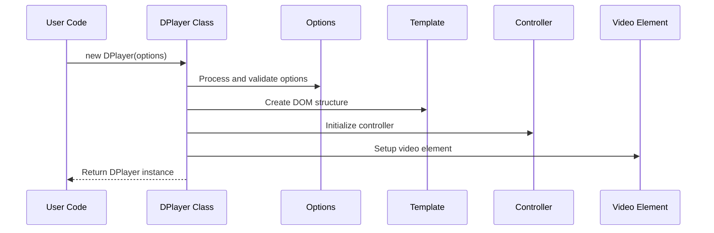
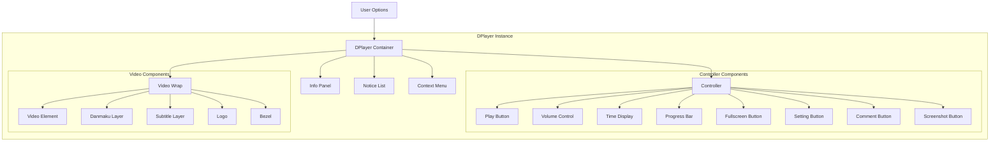
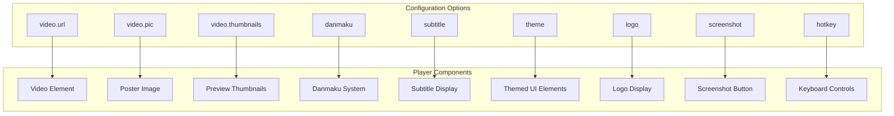
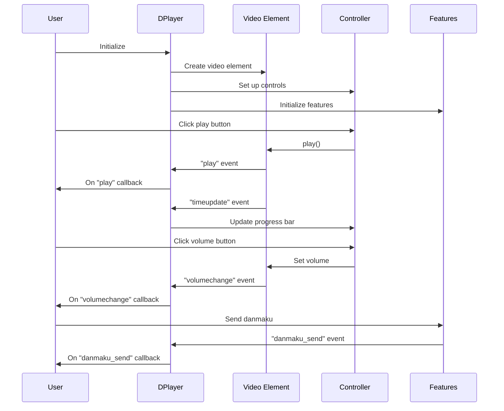

# Basic Usage

> **Relevant source files**
> * [README.md](https://github.com/DIYgod/DPlayer/blob/f00e304c/README.md?plain=1)
> * [demo/demo.js](https://github.com/DIYgod/DPlayer/blob/f00e304c/demo/demo.js)
> * [src/template/player.art](https://github.com/DIYgod/DPlayer/blob/f00e304c/src/template/player.art)

This document explains how to set up and use the DPlayer video player in your web projects with basic configuration. DPlayer is an HTML5 danmaku video player that supports multiple streaming formats, including HLS, FLV, MPEG DASH, and WebTorrent. For advanced examples and custom configurations, see [Advanced Examples](/DIYgod/DPlayer/5.2-advanced-examples).

## Installation

DPlayer can be added to your project in two ways:

### Using npm

```
npm install dplayer --save
```

Then import it in your project:

```javascript
import DPlayer from 'dplayer';
```

### Using CDN

```xml
<link rel="stylesheet" href="https://cdn.jsdelivr.net/npm/dplayer/dist/DPlayer.min.css"><script src="https://cdn.jsdelivr.net/npm/dplayer/dist/DPlayer.min.js"></script>
```

Sources: [README.md L1-L40](https://github.com/DIYgod/DPlayer/blob/f00e304c/README.md?plain=1#L1-L40)

## Basic Player Setup

### HTML Structure

Create a container element in your HTML that will hold the player:

```html
<div id="dplayer"></div>
```

### Initializing the Player

Create a new DPlayer instance with minimal configuration:

```javascript
const dp = new DPlayer({    container: document.getElementById('dplayer'),    video: {        url: 'video-url.mp4',    },});
```

Sources: [demo/demo.js L38-L56](https://github.com/DIYgod/DPlayer/blob/f00e304c/demo/demo.js#L38-L56)

## Initialization Flow

The diagram below shows the basic initialization flow when creating a new DPlayer instance:



Sources: [demo/demo.js L38-L56](https://github.com/DIYgod/DPlayer/blob/f00e304c/demo/demo.js#L38-L56)

## Configuration Options

DPlayer supports various configuration options to customize the player behavior and appearance.

### Core Options

| Option | Type | Default | Description |
| --- | --- | --- | --- |
| container | Element | - | DOM element to contain the player |
| live | Boolean | false | Whether is a live video |
| autoplay | Boolean | false | Whether to autoplay when initialized |
| theme | String | '#b7daff' | Theme color |
| loop | Boolean | false | Whether to loop the video |
| lang | String | 'zh-cn' | Language, 'zh-cn' or 'en' |
| screenshot | Boolean | false | Whether to enable screenshot functionality |
| hotkey | Boolean | true | Whether to enable hotkey |
| preload | String | 'auto' | Preload for video element: 'none', 'metadata', 'auto' |
| volume | Number | 0.7 | Default volume, between 0 and 1 |
| logo | String | - | URL for player logo |

### Video Options

| Option | Type | Description |
| --- | --- | --- |
| url | String | Video URL |
| pic | String | Video poster URL |
| thumbnails | String | Video thumbnails URL |
| type | String | Video type, 'auto', 'hls', 'flv', 'dash', 'webtorrent', or 'normal' |
| quality | Array | Video quality support |
| defaultQuality | Number | Default quality index |

### Danmaku Options

| Option | Type | Description |
| --- | --- | --- |
| id | String | Danmaku pool id |
| api | String | Danmaku API URL |
| token | String | Danmaku pool token |
| maximum | Number | Max Danmaku number showing at the same time |
| addition | Array | Additional danmaku sources |
| user | String | Username for danmaku |
| bottom | String | Bottom margin for danmaku |
| unlimited | Boolean | Whether to enable unlimited mode |
| speedRate | Number | Rate of danmaku speed |

Sources: [demo/demo.js L38-L138](https://github.com/DIYgod/DPlayer/blob/f00e304c/demo/demo.js#L38-L138)

 [src/template/player.art L1-L280](https://github.com/DIYgod/DPlayer/blob/f00e304c/src/template/player.art#L1-L280)

## Player Structure

The diagram below illustrates the structure of the DPlayer DOM elements and how they relate to configuration options:



Sources: [src/template/player.art L1-L280](https://github.com/DIYgod/DPlayer/blob/f00e304c/src/template/player.art#L1-L280)

## Basic Example Configurations

### Standard Video Player

```javascript
const dp = new DPlayer({    container: document.getElementById('dplayer'),    video: {        url: 'https://example.com/video.mp4',        pic: 'https://example.com/poster.jpg',        thumbnails: 'https://example.com/thumbnails.jpg'    }});
```

### Player with Danmaku

```javascript
const dp = new DPlayer({    container: document.getElementById('dplayer'),    danmaku: {        id: 'uniqueVideoId',        api: 'https://api.example.com/dplayer/'    },    video: {        url: 'https://example.com/video.mp4',        pic: 'https://example.com/poster.jpg'    }});
```

### Player with Custom Controls and Features

```javascript
const dp = new DPlayer({    container: document.getElementById('dplayer'),    autoplay: false,    theme: '#FADFA3',    loop: true,    screenshot: true,    hotkey: true,    logo: 'https://example.com/logo.png',    volume: 0.7,    video: {        url: 'https://example.com/video.mp4',        pic: 'https://example.com/poster.jpg',        type: 'auto'    },    subtitle: {        url: 'https://example.com/subtitle.vtt',        type: 'webvtt',        fontSize: '25px',        bottom: '10%',        color: '#b7daff'    }});
```

Sources: [demo/demo.js L38-L138](https://github.com/DIYgod/DPlayer/blob/f00e304c/demo/demo.js#L38-L138)

## Configuration to Player Components Mapping

The following diagram shows how configuration options relate to specific player components:



Sources: [demo/demo.js L38-L138](https://github.com/DIYgod/DPlayer/blob/f00e304c/demo/demo.js#L38-L138)

 [src/template/player.art L1-L280](https://github.com/DIYgod/DPlayer/blob/f00e304c/src/template/player.art#L1-L280)

## Basic API Usage

After initializing the player, you can control it using the following API methods:

### Playback Control

```
// Play the videodp.play(); // Pause the videodp.pause(); // Toggle between play and pausedp.toggle(); // Seek to a specific time (in seconds)dp.seek(30); // Set the volume (0-1)dp.volume(0.5);
```

### Video Information

```javascript
// Get current playback timeconst currentTime = dp.video.currentTime; // Get video durationconst duration = dp.video.duration; // Check if the video is playingconst isPlaying = !dp.video.paused;
```

### Danmaku Control

```css
// Show danmakudp.danmaku.show(); // Hide danmakudp.danmaku.hide(); // Send a danmaku messagedp.danmaku.send({    text: 'Hello world',    color: '#fff',    type: 'right' // 'right', 'top', 'bottom'});
```

### Full Screen

```
// Enter browser fullscreendp.fullScreen.request(); // Exit browser fullscreendp.fullScreen.cancel(); // Enter web fullscreen (fills the page)dp.fullScreen.requestWeb(); // Exit web fullscreendp.fullScreen.cancelWeb();
```

Sources: [demo/demo.js L140-L156](https://github.com/DIYgod/DPlayer/blob/f00e304c/demo/demo.js#L140-L156)

## Event Handling

DPlayer emits various events that you can listen for:

```javascript
dp.on('play', () => {    console.log('Video started playing');}); dp.on('pause', () => {    console.log('Video paused');}); dp.on('ended', () => {    console.log('Video ended');}); dp.on('loadeddata', () => {    console.log('Video data loaded');}); dp.on('subtitle_show', () => {    console.log('Subtitle shown');}); dp.on('danmaku_send', (data) => {    console.log('Danmaku sent:', data);});
```

A list of available events includes standard HTML5 video events (`play`, `pause`, `ended`, etc.) and DPlayer-specific events (`danmaku_send`, `subtitle_show`, `fullscreen`, etc.).

Sources: [demo/demo.js L140-L163](https://github.com/DIYgod/DPlayer/blob/f00e304c/demo/demo.js#L140-L163)

## Player Event Flow Diagram

The following diagram illustrates the flow of events in DPlayer:



Sources: [demo/demo.js L140-L163](https://github.com/DIYgod/DPlayer/blob/f00e304c/demo/demo.js#L140-L163)

## Support for Media Formats

DPlayer supports various media formats through different handlers:

| Format | Type Value | Requirements |
| --- | --- | --- |
| MP4/WebM/Ogg | 'normal' or 'auto' | Native browser support |
| HLS | 'hls' | hls.js library |
| FLV | 'flv' | flv.js library |
| DASH | 'dash' | dash.js library |
| WebTorrent | 'webtorrent' | webtorrent library |
| Custom | any string | Requires customType handler |

### Using HLS Format Example

```javascript
const dp = new DPlayer({    container: document.getElementById('dplayer'),    video: {        url: 'https://example.com/video.m3u8',        type: 'hls'    }});
```

### Using Custom Format Handler Example

```javascript
const dp = new DPlayer({    container: document.getElementById('dplayer'),    video: {        url: 'https://example.com/custom-video',        type: 'customType',        customType: {            'customType': function(video, player) {                // Custom handler for the video                // Initialize custom player here            }        }    }});
```

Sources: [README.md L19-L37](https://github.com/DIYgod/DPlayer/blob/f00e304c/README.md?plain=1#L19-L37)

 [demo/demo.js L166-L256](https://github.com/DIYgod/DPlayer/blob/f00e304c/demo/demo.js#L166-L256)