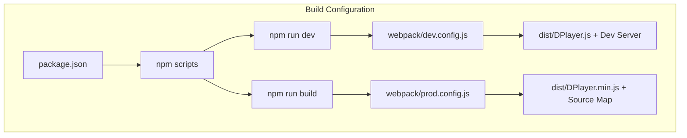
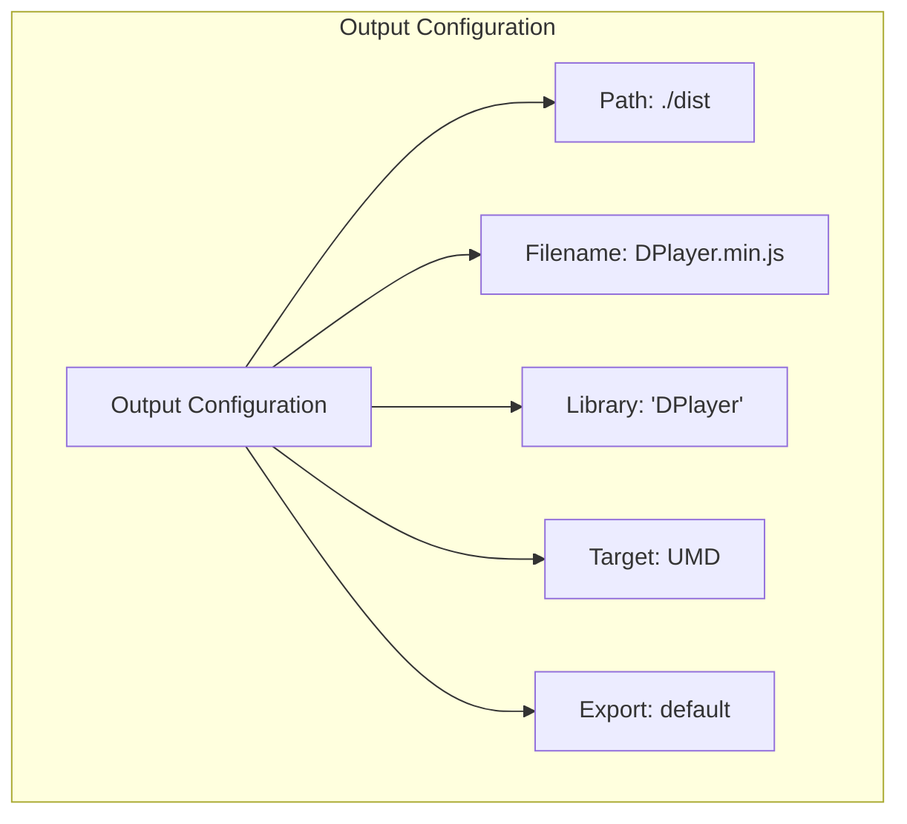

# Build System

> **Relevant source files**
> * [package.json](https://github.com/DIYgod/DPlayer/blob/f00e304c/package.json)
> * [webpack/dev.config.js](https://github.com/DIYgod/DPlayer/blob/f00e304c/webpack/dev.config.js)
> * [webpack/prod.config.js](https://github.com/DIYgod/DPlayer/blob/f00e304c/webpack/prod.config.js)

This page documents the build system used in DPlayer, which converts source code into distributed JavaScript files. It covers the build configuration, dependencies, and workflow processes. For information about using the built files in your own projects, see [Basic Usage](/DIYgod/DPlayer/5.1-basic-usage).

## Overview

DPlayer uses Webpack as its primary build tool, with support for both development and production workflows. The build system processes JavaScript, CSS/LESS, templates, and assets, outputting a UMD (Universal Module Definition) library that works in browsers and with module systems.

```

```

Sources: [package.json L1-L78](https://github.com/DIYgod/DPlayer/blob/f00e304c/package.json#L1-L78)

 [webpack/prod.config.js L1-L99](https://github.com/DIYgod/DPlayer/blob/f00e304c/webpack/prod.config.js#L1-L99)

 [webpack/dev.config.js L1-L108](https://github.com/DIYgod/DPlayer/blob/f00e304c/webpack/dev.config.js#L1-L108)

## Build Dependencies

DPlayer's build system relies on several key dependencies to transform source code into the final distributed files:

| Category | Dependencies | Purpose |
| --- | --- | --- |
| **Core Build Tools** | webpack, webpack-cli, webpack-dev-server | Bundle and serve the application |
| **JavaScript Processing** | babel-loader, @babel/core, @babel/preset-env | Transpile modern JavaScript |
| **Style Processing** | less, less-loader, postcss, postcss-loader, css-loader, style-loader | Process LESS to CSS |
| **Template Processing** | art-template, art-template-loader | Process ART templates |
| **Asset Processing** | url-loader, svg-inline-loader, file-loader | Handle images and SVGs |
| **Optimization** | template-string-optimize-loader | Optimize template strings |
| **Utilities** | cross-env, prettier, git-revision-webpack-plugin | Build utilities |

Sources: [package.json L38-L71](https://github.com/DIYgod/DPlayer/blob/f00e304c/package.json#L38-L71)

## Build Configuration

DPlayer maintains separate webpack configurations for development and production environments, each optimized for its specific purpose.



Sources: [package.json L6-L14](https://github.com/DIYgod/DPlayer/blob/f00e304c/package.json#L6-L14)

 [webpack/dev.config.js L6-L108](https://github.com/DIYgod/DPlayer/blob/f00e304c/webpack/dev.config.js#L6-L108)

 [webpack/prod.config.js L6-L99](https://github.com/DIYgod/DPlayer/blob/f00e304c/webpack/prod.config.js#L6-L99)

### Development Configuration

The development configuration (`webpack/dev.config.js`) is optimized for faster builds and better debugging:

* Generates non-minified code with source maps
* Sets up a development server with hot reloading
* Points to demo files for testing
* Uses development-friendly build settings

Key configurations include:

```yaml
mode: 'development'
devtool: 'cheap-module-source-map'
devServer: {
  static: { directory: path.join(__dirname, '..', 'demo') },
  compress: true,
  open: true
}
```

Sources: [webpack/dev.config.js L6-L108](https://github.com/DIYgod/DPlayer/blob/f00e304c/webpack/dev.config.js#L6-L108)

### Production Configuration

The production configuration (`webpack/prod.config.js`) is optimized for deployment:

* Creates minified code with source maps
* Enables additional optimizations like template string optimization
* Configured for maximum performance and smallest file size

Key configurations include:

```yaml
mode: 'production'
bail: true
devtool: 'source-map'
```

Sources: [webpack/prod.config.js L6-L99](https://github.com/DIYgod/DPlayer/blob/f00e304c/webpack/prod.config.js#L6-L99)

## File Processing Pipeline

The build system processes different file types through specific loader chains to transform them into the final bundle.

```

```

Sources: [webpack/prod.config.js L38-L91](https://github.com/DIYgod/DPlayer/blob/f00e304c/webpack/prod.config.js#L38-L91)

 [webpack/dev.config.js L36-L88](https://github.com/DIYgod/DPlayer/blob/f00e304c/webpack/dev.config.js#L36-L88)

### JavaScript Processing

JavaScript files go through these transformations:

1. In production, template string optimization with `template-string-optimize-loader`
2. Babel transpilation with `@babel/preset-env` to ensure browser compatibility
3. Caching for improved build performance

Sources: [webpack/prod.config.js L41-L53](https://github.com/DIYgod/DPlayer/blob/f00e304c/webpack/prod.config.js#L41-L53)

 [webpack/dev.config.js L39-L50](https://github.com/DIYgod/DPlayer/blob/f00e304c/webpack/dev.config.js#L39-L50)

### Style Processing

LESS files are processed through:

1. `less-loader` to convert LESS to CSS
2. `postcss-loader` with `postcss-preset-env` for vendor prefixing and modern CSS features
3. `css-loader` to handle CSS imports and URLs
4. `style-loader` to inject styles into the document

Sources: [webpack/prod.config.js L54-L74](https://github.com/DIYgod/DPlayer/blob/f00e304c/webpack/prod.config.js#L54-L74)

 [webpack/dev.config.js L52-L70](https://github.com/DIYgod/DPlayer/blob/f00e304c/webpack/dev.config.js#L52-L70)

### Asset and Template Processing

* Images (PNG/JPG): Processed with `url-loader`, which converts small images to data URIs
* SVG files: Processed with `svg-inline-loader` to inline SVG content
* ART templates: Compiled using `art-template-loader`

Sources: [webpack/prod.config.js L75-L90](https://github.com/DIYgod/DPlayer/blob/f00e304c/webpack/prod.config.js#L75-L90)

 [webpack/dev.config.js L72-L86](https://github.com/DIYgod/DPlayer/blob/f00e304c/webpack/dev.config.js#L72-L86)

## Build Scripts and Workflow

DPlayer provides several npm scripts for common build tasks:

| Script | Command | Purpose |
| --- | --- | --- |
| `npm run dev` | Start development server | Local development with hot reloading |
| `npm run build` | Generate production build | Create minified distribution files |
| `npm start` | Alias for `npm run dev` | Quick start for development |
| `npm run format` | Run Prettier | Format code according to project standards |
| `npm run docs:dev` | Run VuePress development server | Local documentation development |
| `npm run docs:build` | Build VuePress documentation | Generate static documentation site |

The typical development workflow involves:

1. Clone the repository
2. Install dependencies with `npm install`
3. Run `npm run dev` to start the development server
4. Make changes to source code
5. Test changes in the demo
6. Build for production with `npm run build`

Sources: [package.json L6-L14](https://github.com/DIYgod/DPlayer/blob/f00e304c/package.json#L6-L14)

## Output and Distribution

The build system generates these primary output files:

* `dist/DPlayer.min.js`: Minified production build
* `dist/DPlayer.min.js.map`: Source map for debugging the production build
* In development mode: `dist/DPlayer.js` (non-minified)

The output is configured as a UMD module, which makes it compatible with:

* Direct browser usage via `<script>` tag
* AMD module loaders
* CommonJS environments
* ES modules via import



Sources: [webpack/prod.config.js L17-L25](https://github.com/DIYgod/DPlayer/blob/f00e304c/webpack/prod.config.js#L17-L25)

 [webpack/dev.config.js L15-L23](https://github.com/DIYgod/DPlayer/blob/f00e304c/webpack/dev.config.js#L15-L23)

## Version and Environment Information

The build system injects version information into the built files:

* `DPLAYER_VERSION`: Version from package.json
* `GIT_HASH`: Git commit hash via git-revision-webpack-plugin

This allows the player to report its version and helps with debugging specific builds.

Sources: [webpack/prod.config.js L93-L98](https://github.com/DIYgod/DPlayer/blob/f00e304c/webpack/prod.config.js#L93-L98)

 [webpack/dev.config.js L98-L102](https://github.com/DIYgod/DPlayer/blob/f00e304c/webpack/dev.config.js#L98-L102)

## Related Pages

* For details on the webpack configuration, see [Webpack Configuration](/DIYgod/DPlayer/4.1-webpack-configuration)
* For development workflow information, see [Development Workflow](/DIYgod/DPlayer/4.2-development-workflow)
* For documentation system information, see [Documentation System](/DIYgod/DPlayer/6.2-documentation-system)