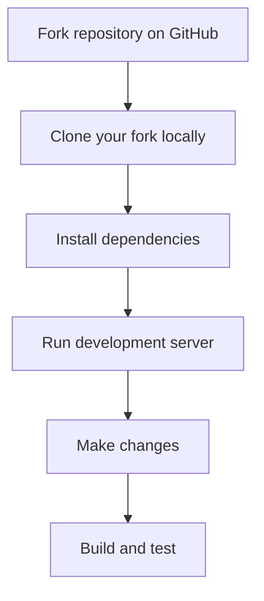
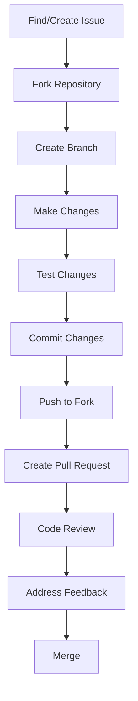
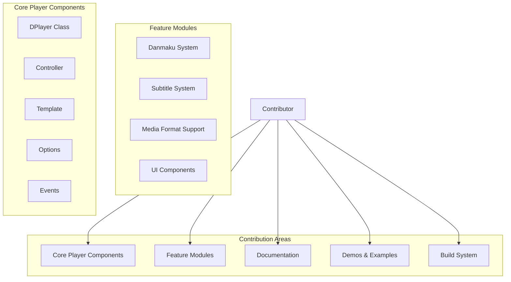
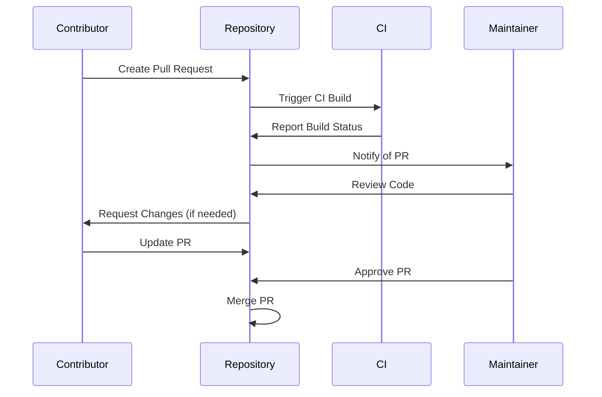
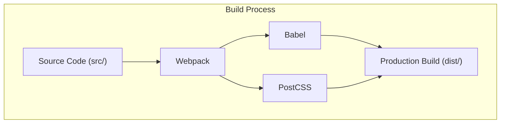
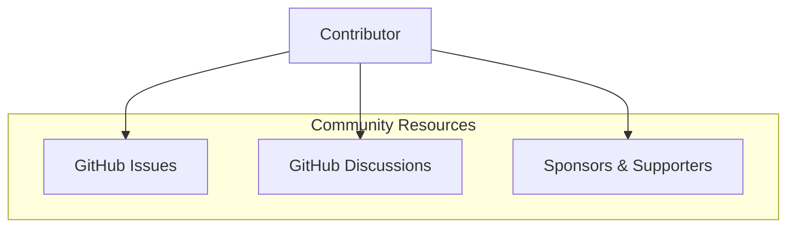

# Contributing

> **Relevant source files**
> * [.github/ISSUE_TEMPLATE.md](https://github.com/DIYgod/DPlayer/blob/f00e304c/.github/ISSUE_TEMPLATE.md?plain=1)
> * [.gitignore](https://github.com/DIYgod/DPlayer/blob/f00e304c/.gitignore)
> * [.travis.yml](https://github.com/DIYgod/DPlayer/blob/f00e304c/.travis.yml)
> * [docs/.vuepress/styles/index.styl](https://github.com/DIYgod/DPlayer/blob/f00e304c/docs/.vuepress/styles/index.styl)
> * [docs/.vuepress/styles/palette.styl](https://github.com/DIYgod/DPlayer/blob/f00e304c/docs/.vuepress/styles/palette.styl)
> * [docs/support.md](https://github.com/DIYgod/DPlayer/blob/f00e304c/docs/support.md?plain=1)
> * [docs/zh/ecosystem.md](https://github.com/DIYgod/DPlayer/blob/f00e304c/docs/zh/ecosystem.md?plain=1)
> * [docs/zh/support.md](https://github.com/DIYgod/DPlayer/blob/f00e304c/docs/zh/support.md?plain=1)

This page provides comprehensive guidance for developers who wish to contribute to the DPlayer project. It covers setting up your development environment, understanding the contribution workflow, coding standards, and the pull request process. For information about the DPlayer ecosystem and plugins, see [Ecosystem](/DIYgod/DPlayer/6.3-ecosystem).

## Development Environment Setup

Before you can contribute to DPlayer, you need to set up your development environment properly.

### Prerequisites

* [Node.js](https://nodejs.org/) (LTS version recommended)
* [npm](https://www.npmjs.com/) or [yarn](https://yarnpkg.com/)
* Git

### Clone and Install



1. Fork the [DPlayer repository](https://github.com/DIYgod/DPlayer/blob/f00e304c/DPlayer repository)  on GitHub
2. Clone your fork locally: ``` git clone https://github.com/YOUR_USERNAME/DPlayer.gitcd DPlayer ```
3. Install dependencies: ``` npm install ```
4. Run development server: ``` npm run dev ```

Sources: `.travis.yml`, `.gitignore`

## Contribution Workflow

The following diagram illustrates the typical workflow for contributing to DPlayer:



### Issues

Before working on a contribution, make sure there's an open issue or open one yourself. This ensures that:

1. The maintainers know what you're working on
2. You don't duplicate efforts with other contributors
3. You can get early feedback on your approach

### Branch Strategy

* Create a new branch for each feature or bugfix
* Use descriptive branch names (e.g., `fix-video-controls`, `add-subtitle-support`)
* Branch from the `master` branch

### Commit Guidelines

* Write clear, concise commit messages
* Reference issue numbers in commit messages (e.g., "Fix video playback issue #123")
* Break large changes into smaller, logical commits

Sources: `.github/ISSUE_TEMPLATE.md`

## Code Structure and Components

When contributing to DPlayer, it's important to understand how your changes relate to the overall architecture:



This diagram shows the main areas where you can contribute to DPlayer. Understanding which component your changes affect will help you make targeted, efficient contributions.

## Issue Reporting Guidelines

When reporting bugs or requesting features, please follow these guidelines:

1. Use the issue template provided
2. Write in English when possible to reach the maximum number of contributors
3. For bugs, include: * Steps to reproduce * Expected vs. actual behavior * Browser/OS versions * A minimal reproduction case (JSFiddle/CodePen) if possible
4. For feature requests, include: * Clear description of the feature * Rationale for why it would be valuable * Example use cases

Sources: `.github/ISSUE_TEMPLATE.md`

## Pull Request Process



1. Ensure your code builds and tests pass locally
2. Push your changes to your fork
3. Create a pull request to the main repository's `master` branch
4. Fill in the pull request template with: * Description of changes * Issue references * Any breaking changes
5. The continuous integration system will automatically verify your changes
6. Wait for code review and address any feedback
7. Once approved, a maintainer will merge your pull request

Sources: `.travis.yml`

## Building and Testing

DPlayer uses webpack for building and various tools for testing. Understanding this process is essential for contributors.

### Build Commands

* `npm run dev` - Run development server with hot reloading
* `npm run build` - Build production version
* `npm run docs:dev` - Run documentation development server
* `npm run docs:build` - Build documentation site

The build process is configured via webpack and outputs to the `dist/` directory. The documentation site is built using VuePress.



Sources: `.travis.yml`

## Documentation Contributions

Documentation is a crucial part of DPlayer and contributions to improve it are highly valued.

### Documentation Structure

The documentation uses VuePress and is located in the `docs/` directory. When contributing to documentation:

1. Run `npm run docs:dev` to preview changes locally
2. Ensure your documentation is clear and follows the existing style
3. Include examples where appropriate
4. Update both English and Chinese documentation if possible

Sources: `docs/.vuepress/styles/index.styl`, `docs/.vuepress/styles/palette.styl`

## Code Style and Standards

While there isn't an explicit style guide in the provided files, follow these general principles:

1. Match the existing code style
2. Use ES6+ features appropriately
3. Keep code modular and maintainable
4. Add comments for complex logic
5. Write clear, descriptive variable and function names

## Community and Support



DPlayer has an active community that can help with questions and provide guidance:

* GitHub Issues: For bug reports and feature requests
* GitHub Discussions: For general questions and discussions
* Sponsorship: If you find DPlayer valuable, consider supporting the project

Sources: `docs/support.md`, `docs/zh/support.md`

## Ecosystem Contributions

The DPlayer ecosystem includes various plugins, tools, and integrations. You can contribute to these projects as well or create new ones:

1. Tools: Like `DPlayer-thumbnails` for generating video thumbnails
2. Backends: Server implementations for the danmaku system
3. Plugins: Integrations with content management systems and frameworks
4. Core improvements: Enhancements to the main DPlayer codebase

See the [Ecosystem](/DIYgod/DPlayer/6.3-ecosystem) page for more details on existing projects.

Sources: `docs/zh/ecosystem.md`

## Troubleshooting Common Issues

When contributing, you might encounter some common issues:

| Issue | Solution |
| --- | --- |
| Build errors | Ensure all dependencies are installed with `npm install` |
| Documentation build fails | Check VuePress configuration and markdown syntax |
| Tests failing | Run tests locally to identify the specific failure |
| Merge conflicts | Rebase your branch on the latest master and resolve conflicts |

## Recognition for Contributors

DPlayer acknowledges all contributors to the project:

* Contributors are listed in the GitHub repository
* Significant contributions may be highlighted in release notes
* All contributions, including documentation, bug fixes, and new features, are valuable

Sources: `docs/support.md`