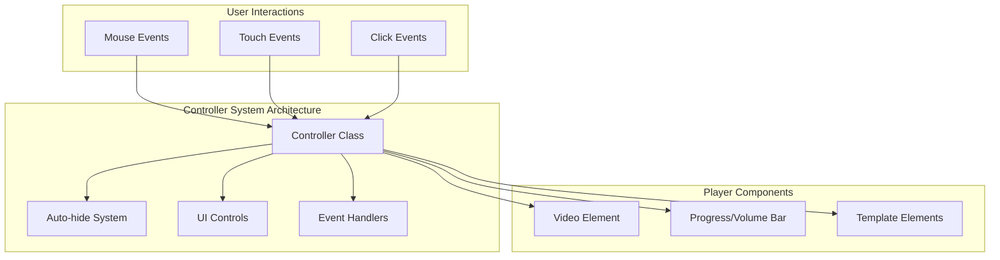
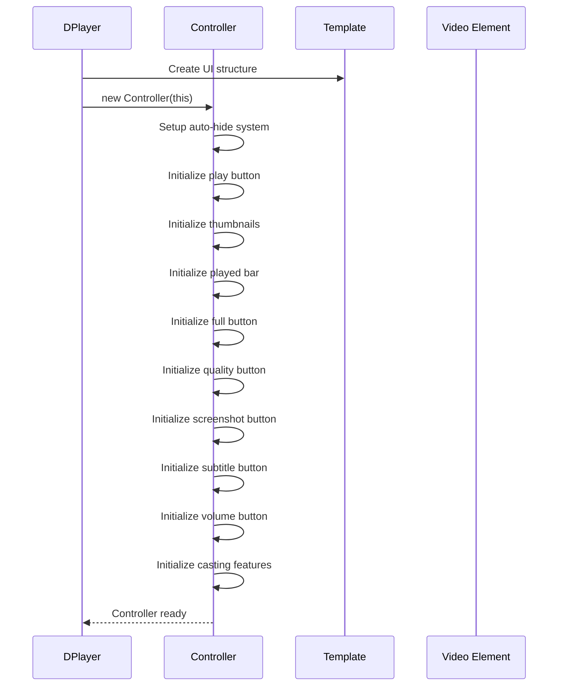
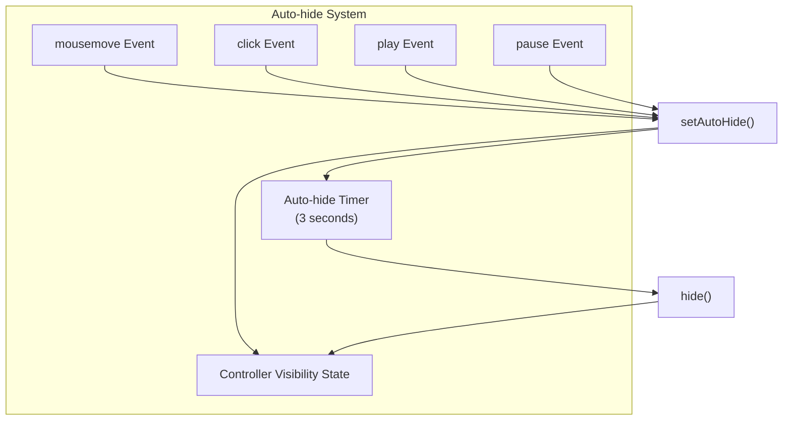
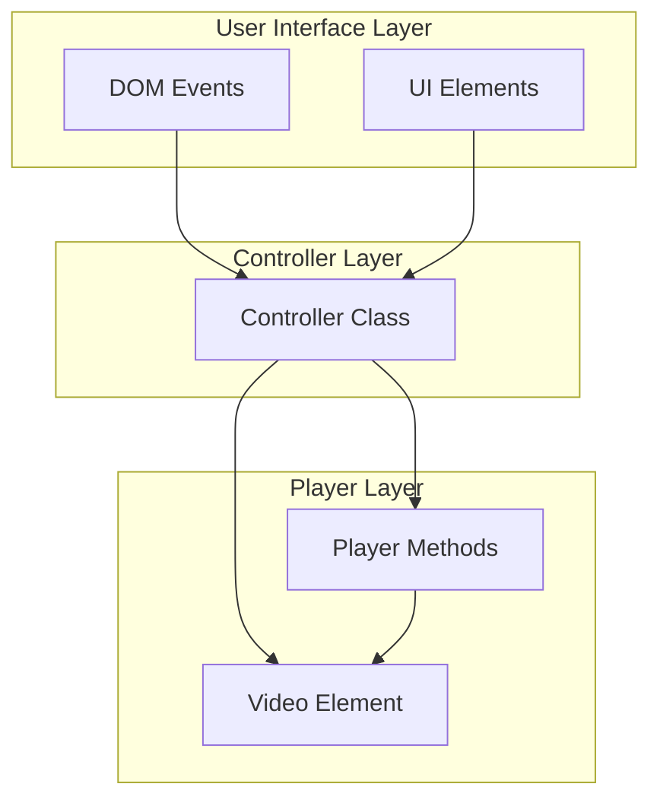
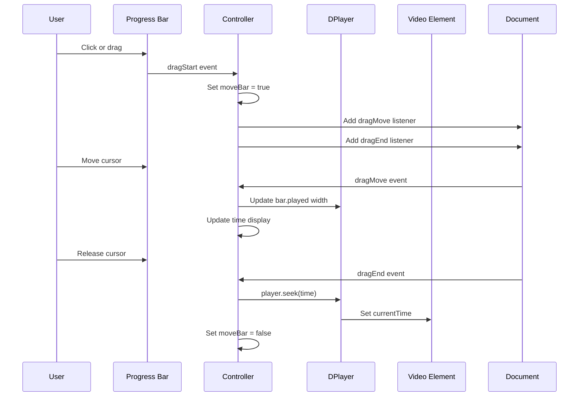

# Controller System

> **Relevant source files**
> * [src/js/controller.js](https://github.com/DIYgod/DPlayer/blob/f00e304c/src/js/controller.js)
> * [src/js/options.js](https://github.com/DIYgod/DPlayer/blob/f00e304c/src/js/options.js)
> * [src/js/player.js](https://github.com/DIYgod/DPlayer/blob/f00e304c/src/js/player.js)
> * [src/js/subtitles.js](https://github.com/DIYgod/DPlayer/blob/f00e304c/src/js/subtitles.js)

The Controller System is responsible for managing user interactions with the DPlayer video player. It handles the player's control interface, processes user inputs, and translates them into actions affecting video playback. This document details the architecture and functionality of the controller system, showing how it connects user interaction with the core player functionality.

For information about the template UI structure that the controller interacts with, see [Template and UI Components](/DIYgod/DPlayer/2.2-template-and-ui-components).

## Overview

The Controller system manages several aspects of user interaction:

1. Control bar visibility and auto-hiding
2. Playback controls (play/pause, seek, volume)
3. Progress bar and thumbnail preview
4. Advanced controls (quality switching, screenshot, fullscreen)
5. Special features (subtitles, Airplay, Chromecast)



Sources: [src/js/controller.js L9-L422](https://github.com/DIYgod/DPlayer/blob/f00e304c/src/js/controller.js#L9-L422)

 [src/js/player.js L117](https://github.com/DIYgod/DPlayer/blob/f00e304c/src/js/player.js#L117-L117)

## Controller Initialization

The Controller is initialized in the DPlayer constructor and receives a reference to the main player instance. This allows the controller to access all player functionality and UI elements.



Sources: [src/js/player.js L117](https://github.com/DIYgod/DPlayer/blob/f00e304c/src/js/player.js#L117-L117)

 [src/js/controller.js L9-L39](https://github.com/DIYgod/DPlayer/blob/f00e304c/src/js/controller.js#L9-L39)

## Core Controller Components

The Controller initializes and manages multiple UI components that enable user interaction with the player. Each component is initialized in the constructor with its own event listeners.

### Play/Pause Button

The play button toggles playback state by calling the player's `toggle()` method. On mobile devices, tapping the video also toggles play/pause state.

Sources: [src/js/controller.js L42-L67](https://github.com/DIYgod/DPlayer/blob/f00e304c/src/js/controller.js#L42-L67)

### Progress Bar

The progress bar allows users to seek through the video by dragging or clicking on a specific point. The controller tracks various events like drag start, move, and end to update the video position and display thumbnail previews.

Sources: [src/js/controller.js L108-L172](https://github.com/DIYgod/DPlayer/blob/f00e304c/src/js/controller.js#L108-L172)

### Volume Control

For non-mobile devices, the controller implements volume control through a slider and mute button. It handles drag events on the volume bar and updates the volume icon based on the current volume level.

Sources: [src/js/controller.js L185-L220](https://github.com/DIYgod/DPlayer/blob/f00e304c/src/js/controller.js#L185-L220)

### Fullscreen Controls

The controller manages two types of fullscreen modes:

* Browser fullscreen (standard fullscreen API)
* Web fullscreen (fills the browser window without using the fullscreen API)

Sources: [src/js/controller.js L175-L183](https://github.com/DIYgod/DPlayer/blob/f00e304c/src/js/controller.js#L175-L183)

### Quality Selection

If the player is configured with multiple quality options, the controller manages the quality selection interface, allowing users to switch between quality levels.

Sources: [src/js/controller.js L222-L230](https://github.com/DIYgod/DPlayer/blob/f00e304c/src/js/controller.js#L222-L230)

### Screenshot Button

When enabled, the screenshot feature allows users to capture the current video frame and download it as a PNG image.

Sources: [src/js/controller.js L232-L255](https://github.com/DIYgod/DPlayer/blob/f00e304c/src/js/controller.js#L232-L255)

### Subtitle Controls

For players with subtitle support, the controller manages the subtitle toggle button and subtitle selection interface.

Sources: [src/js/controller.js L366-L381](https://github.com/DIYgod/DPlayer/blob/f00e304c/src/js/controller.js#L366-L381)

 [src/js/subtitles.js L1-L77](https://github.com/DIYgod/DPlayer/blob/f00e304c/src/js/subtitles.js#L1-L77)

### Casting Features

The controller implements support for:

* AirPlay (for Apple devices)
* Chromecast (for Google Cast compatible devices)

Sources: [src/js/controller.js L257-L364](https://github.com/DIYgod/DPlayer/blob/f00e304c/src/js/controller.js#L257-L364)

## Control Bar Auto-hide System

A key feature of the Controller is the automatic hiding of the control bar during playback. This provides an unobstructed view of the video while maintaining easy access to controls when needed.



The auto-hide system works through these key methods:

1. `setAutoHide()`: Shows the controls and resets the auto-hide timer
2. `show()`: Makes the controller visible
3. `hide()`: Hides the controller and also hides settings and comments
4. `toggle()`: Toggles between shown and hidden states

Sources: [src/js/controller.js L14-L20](https://github.com/DIYgod/DPlayer/blob/f00e304c/src/js/controller.js#L14-L20)

 [src/js/controller.js L383-L413](https://github.com/DIYgod/DPlayer/blob/f00e304c/src/js/controller.js#L383-L413)

## Controller Relationships

The Controller serves as a bridge between user interactions and the underlying video player functionality.



Key connections include:

| Controller Method | Player/Component Interaction |
| --- | --- |
| `initPlayButton()` | Calls `player.toggle()` |
| `initPlayedBar()` | Calls `player.bar.set()` and `player.seek()` |
| `initVolumeButton()` | Calls `player.volume()` |
| `initFullButton()` | Calls `player.fullScreen.toggle()` |
| `initQualityButton()` | Calls `player.switchQuality()` |
| `initSubtitleButton()` | Calls `player.subtitle.toggle()` |
| `setAutoHide()` | Manages controller visibility timer |

Sources: [src/js/controller.js L9-L422](https://github.com/DIYgod/DPlayer/blob/f00e304c/src/js/controller.js#L9-L422)

 [src/js/player.js L117](https://github.com/DIYgod/DPlayer/blob/f00e304c/src/js/player.js#L117-L117)

## Code Structure

The Controller system is implemented primarily in the `controller.js` file, with initialization and integration points in the `player.js` file. The structure follows a modular design where each control element has its own initialization method:

```
Controller
├── constructor(player)
├── initPlayButton()
├── initThumbnails() 
├── initPlayedBar()
├── initFullButton()
├── initVolumeButton()
├── initQualityButton()
├── initScreenshotButton()
├── initSubtitleButton()
├── initHighlights()
├── initAirplayButton()
├── initChromecastButton()
├── setAutoHide()
├── show()
├── hide()
├── isShow()
├── toggle()
└── destroy()
```

Sources: [src/js/controller.js L9-L422](https://github.com/DIYgod/DPlayer/blob/f00e304c/src/js/controller.js#L9-L422)

## Configuration Options

Several player configuration options directly affect the Controller's behavior:

| Option | Default | Description |
| --- | --- | --- |
| `hotkey` | `true` | Enables keyboard shortcuts |
| `autoplay` | `false` | Starts playback automatically |
| `screenshot` | `false` | Enables screenshot button |
| `loop` | `false` | Enables video looping |
| `subtitle` | - | Enables subtitle controls |
| `volume` | `0.7` | Sets default volume |
| `preventClickToggle` | `false` | Prevents clicking video to toggle play/pause |
| `airplay` | `true` | Enables AirPlay button |
| `chromecast` | `false` | Enables Chromecast button |

Sources: [src/js/options.js L4-L71](https://github.com/DIYgod/DPlayer/blob/f00e304c/src/js/options.js#L4-L71)

## Event Flow

When users interact with the control elements, events flow through the Controller to affect the player state. This diagram illustrates the event handling flow for a seek operation:



Sources: [src/js/controller.js L108-L132](https://github.com/DIYgod/DPlayer/blob/f00e304c/src/js/controller.js#L108-L132)

## Controller Cleanup

When the player is destroyed, the Controller's `destroy()` method is called to:

1. Remove event listeners
2. Clear the auto-hide timer
3. Prevent memory leaks

Sources: [src/js/controller.js L415-L421](https://github.com/DIYgod/DPlayer/blob/f00e304c/src/js/controller.js#L415-L421)

 [src/js/player.js L703](https://github.com/DIYgod/DPlayer/blob/f00e304c/src/js/player.js#L703-L703)

## Integration with Other Systems

The Controller interacts with several other systems in the DPlayer:

1. **Template System**: Accesses UI elements created by the Template
2. **Bar System**: Updates progress and volume bars
3. **Fullscreen System**: Toggles fullscreen modes
4. **Subtitle System**: Controls subtitle display
5. **Thumbnails System**: Manages preview thumbnails when hovering over the progress bar
6. **Events System**: Listens to and triggers player events

Sources: [src/js/controller.js L9-L422](https://github.com/DIYgod/DPlayer/blob/f00e304c/src/js/controller.js#L9-L422)

 [src/js/player.js L117](https://github.com/DIYgod/DPlayer/blob/f00e304c/src/js/player.js#L117-L117)