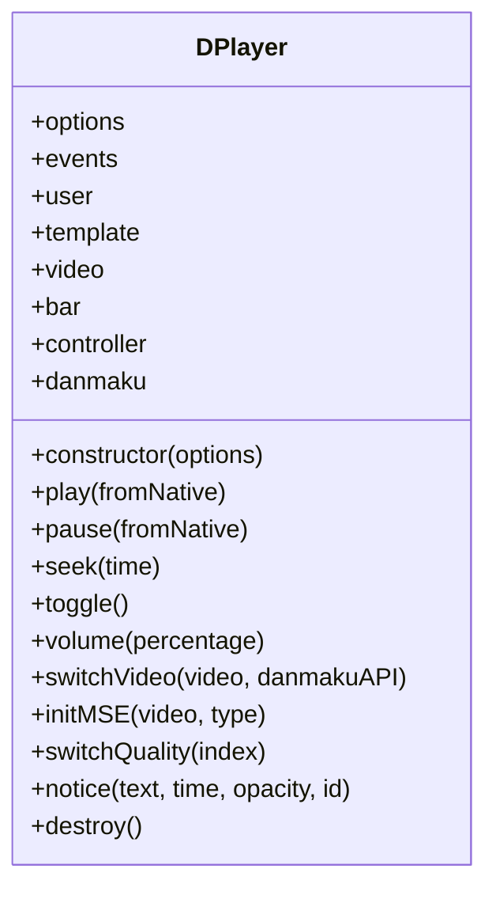
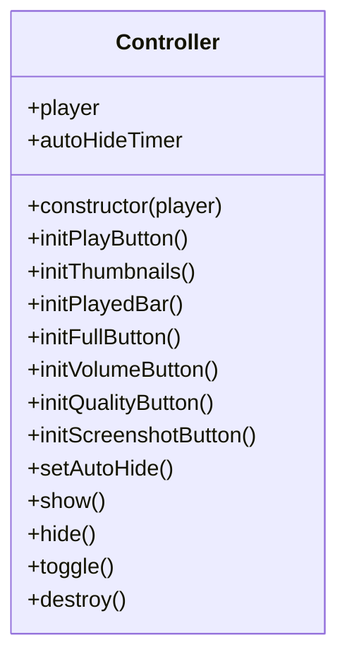
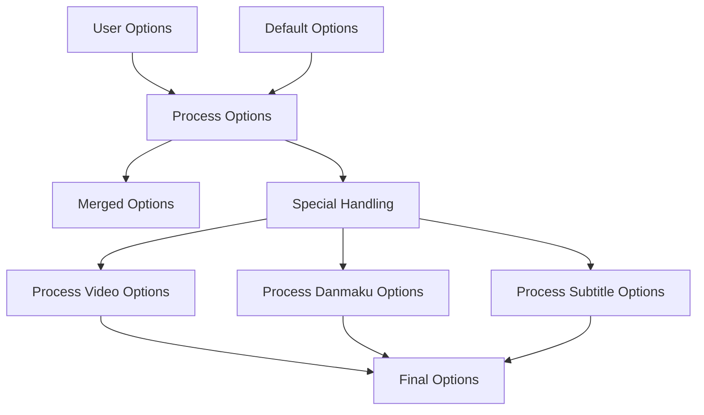
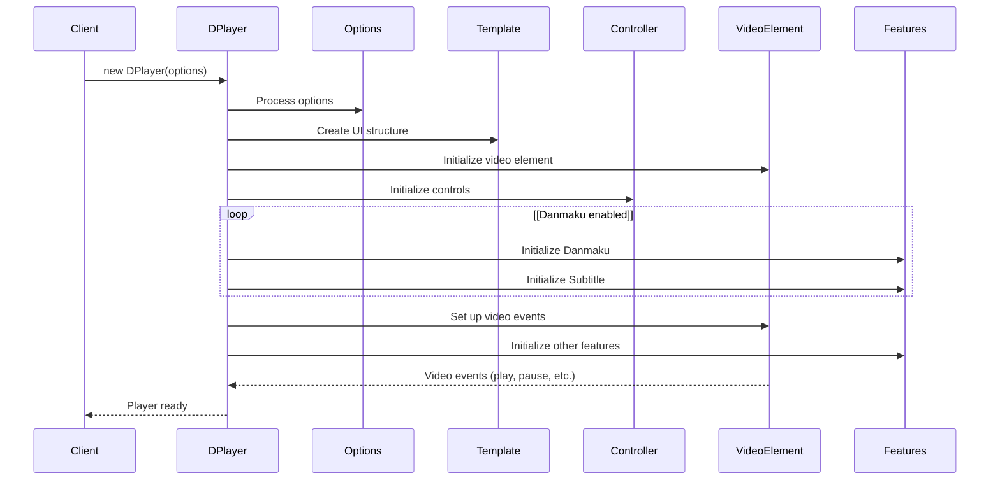
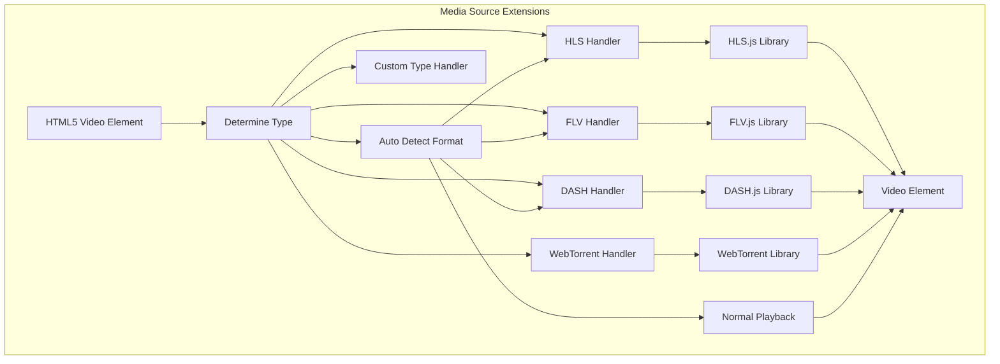
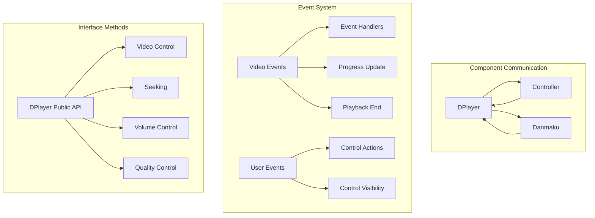
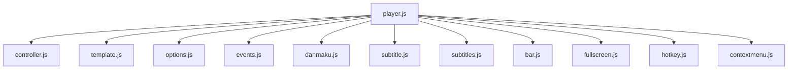
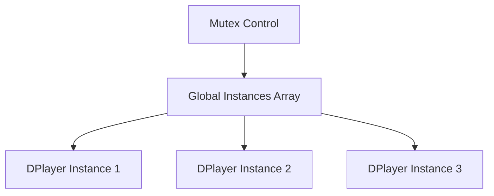

# Core Architecture

> **Relevant source files**
> * [dist/DPlayer.min.js](https://github.com/DIYgod/DPlayer/blob/f00e304c/dist/DPlayer.min.js)
> * [dist/DPlayer.min.js.map](https://github.com/DIYgod/DPlayer/blob/f00e304c/dist/DPlayer.min.js.map)
> * [src/js/controller.js](https://github.com/DIYgod/DPlayer/blob/f00e304c/src/js/controller.js)
> * [src/js/options.js](https://github.com/DIYgod/DPlayer/blob/f00e304c/src/js/options.js)
> * [src/js/player.js](https://github.com/DIYgod/DPlayer/blob/f00e304c/src/js/player.js)

This document describes the core architecture of DPlayer, a feature-rich HTML5 video player that supports various media formats, danmaku (floating comments), and other advanced features. It outlines the main components, their relationships, and the overall system design. For specific feature implementations, see the [Features](/DIYgod/DPlayer/3-features) page.

## Component Overview

DPlayer follows a modular architecture with a central `DPlayer` class that orchestrates various specialized components. Each component handles a specific aspect of the player's functionality, making the system maintainable and extensible.

```mermaid
flowchart TD

DPlayer["DPlayer Class"]
Controller["Controller"]
Template["Template"]
Options["Options"]
Events["Events"]
MSE["Media Source Extensions"]
HLS["HLS Support"]
FLV["FLV Support"]
DASH["DASH Support"]
WebTorrent["WebTorrent Support"]
CustomType["Custom Type Handler"]
Danmaku["Danmaku System"]
Subtitle["Subtitle System"]
ContextMenu["Context Menu"]
HotKey["Hotkey Controls"]
Bar["Progress Bar"]
Timer["Timer"]
InfoPanel["Info Panel"]

DPlayer --> MSE
DPlayer --> Danmaku
DPlayer --> Subtitle
DPlayer --> ContextMenu
DPlayer --> HotKey
DPlayer --> Bar
DPlayer --> Timer
DPlayer --> InfoPanel

subgraph subGraph2 ["Feature Modules"]
    Danmaku
    Subtitle
    ContextMenu
    HotKey
    Bar
    Timer
    InfoPanel
end

subgraph subGraph1 ["Media Handling"]
    MSE
    HLS
    FLV
    DASH
    WebTorrent
    CustomType
    MSE --> HLS
    MSE --> FLV
    MSE --> DASH
    MSE --> WebTorrent
    MSE --> CustomType
end

subgraph subGraph0 ["Core Components"]
    DPlayer
    Controller
    Template
    Options
    Events
    DPlayer --> Controller
    DPlayer --> Template
    DPlayer --> Options
    DPlayer --> Events
end
```

Sources: [src/js/player.js L28-L714](https://github.com/DIYgod/DPlayer/blob/f00e304c/src/js/player.js#L28-L714)

## Main Components and Responsibilities

### DPlayer Class

The `DPlayer` class serves as the central orchestrator of the entire player. It:

1. Initializes all other components
2. Provides the public API for controlling the player
3. Manages the video element and media playback
4. Coordinates interactions between components
5. Handles events and event delegation

Sources: [src/js/player.js L28-L715](https://github.com/DIYgod/DPlayer/blob/f00e304c/src/js/player.js#L28-L715)

### Template System

The Template system is responsible for creating and managing the DOM structure of the player. It:

1. Renders the HTML structure of the player
2. Provides references to DOM elements for other components
3. Manages the video element and its container

Sources: [src/js/player.js L102-L109](https://github.com/DIYgod/DPlayer/blob/f00e304c/src/js/player.js#L102-L109)

### Controller System

The Controller manages user interactions with the player interface. It:

1. Handles UI controls (play/pause, volume, seek, etc.)
2. Manages control visibility (auto-hide behavior)
3. Initializes UI components like thumbnails, quality selector, etc.
4. Handles special features like screenshots, airplay, chromecast

Sources: [src/js/controller.js L9-L422](https://github.com/DIYgod/DPlayer/blob/f00e304c/src/js/controller.js#L9-L422)

### Options and Configuration

The Options system handles player configuration. It:

1. Merges user options with default options
2. Validates and normalizes configuration values
3. Sets up special configurations (video quality, subtitle, etc.)
4. Provides default values for required settings

Sources: [src/js/options.js L4-L71](https://github.com/DIYgod/DPlayer/blob/f00e304c/src/js/options.js#L4-L71)

 [src/js/player.js L36-L100](https://github.com/DIYgod/DPlayer/blob/f00e304c/src/js/player.js#L36-L100)

### Events System

The Events system facilitates communication between components. It:

1. Implements a publish-subscribe pattern
2. Allows components to register event handlers
3. Handles event triggering and propagation
4. Manages video element events

Sources: [src/js/player.js L43](https://github.com/DIYgod/DPlayer/blob/f00e304c/src/js/player.js#L43-L43)

 [src/js/player.js L326-L328](https://github.com/DIYgod/DPlayer/blob/f00e304c/src/js/player.js#L326-L328)

## Initialization and Lifecycle

DPlayer follows a specific initialization sequence that creates and connects all components:

The initialization process begins when a new `DPlayer` instance is created. The constructor:

1. Processes options using the `handleOption` function
2. Sets up i18n for translations
3. Initializes the events system
4. Creates the user instance for storing preferences
5. Sets up the container element and adds necessary classes
6. Initializes the template system
7. Gets the video element from the template
8. Initializes various UI components (bar, bezel, fullscreen)
9. Initializes the controller
10. If enabled, initializes danmaku and comment systems
11. Initializes settings, hotkeys, and context menu
12. Initializes video with the appropriate media source extensions
13. Sets up video event listeners

Sources: [src/js/player.js L35-L189](https://github.com/DIYgod/DPlayer/blob/f00e304c/src/js/player.js#L35-L189)

## Media Handling Architecture

DPlayer supports various media formats through Media Source Extensions (MSE) and format-specific libraries:

The media handling process:

1. The `initMSE` method determines the video type (auto, hls, flv, dash, webtorrent, or custom)
2. If "auto", it detects the type based on the URL extension
3. It initializes the appropriate library (HLS.js, FLV.js, DASH.js, WebTorrent)
4. The library processes the media source and attaches to the video element
5. For custom types, it calls the user-provided handler function

Sources: [src/js/player.js L360-L484](https://github.com/DIYgod/DPlayer/blob/f00e304c/src/js/player.js#L360-L484)

## Component Interaction Model

DPlayer components interact through a combination of direct method calls and the events system:

Key interaction patterns:

1. **Direct Method Calls**: The `DPlayer` instance holds references to other components and calls their methods directly
2. **Event System**: Components emit and listen for events through the events system
3. **DOM Events**: UI components listen for DOM events (click, mousemove, etc.) and trigger appropriate actions
4. **Video Events**: The video element emits events that are captured and processed by DPlayer

Sources: [src/js/player.js L491-L555](https://github.com/DIYgod/DPlayer/blob/f00e304c/src/js/player.js#L491-L555)

 [src/js/controller.js L42-L381](https://github.com/DIYgod/DPlayer/blob/f00e304c/src/js/controller.js#L42-L381)

## Project Structure

The project follows a modular structure with separate files for each component:

Sources: [src/js/player.js L1-L24](https://github.com/DIYgod/DPlayer/blob/f00e304c/src/js/player.js#L1-L24)

## Instance Management

DPlayer manages multiple player instances using a global array:

When a new DPlayer instance is created:

1. It's assigned a unique index
2. It's added to the global instances array
3. If mutex is enabled, playing one instance will pause others

Sources: [src/js/player.js L25-L27](https://github.com/DIYgod/DPlayer/blob/f00e304c/src/js/player.js#L25-L27)

 [src/js/player.js L187-L189](https://github.com/DIYgod/DPlayer/blob/f00e304c/src/js/player.js#L187-L189)

 [src/js/player.js L241-L247](https://github.com/DIYgod/DPlayer/blob/f00e304c/src/js/player.js#L241-L247)

## Conclusion

DPlayer's architecture follows a modular, component-based design that separates concerns and makes the system maintainable and extensible. The central `DPlayer` class orchestrates various specialized components that handle different aspects of the player's functionality. This design allows for easy addition of new features and customization of existing ones.

The event-based communication system enables loose coupling between components, while direct method calls provide efficient control flow. The media handling architecture supports various formats through specialized libraries, with a unified interface for controlling playback.