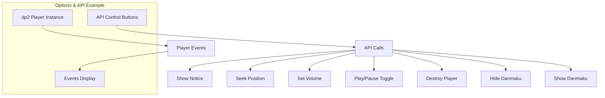
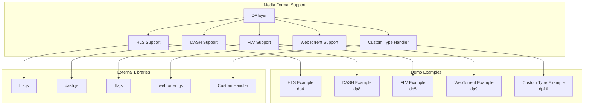
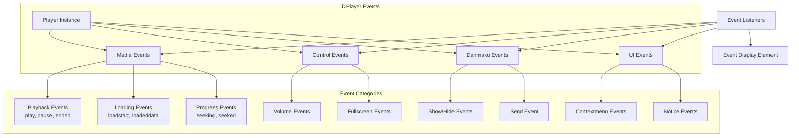

# Demos and Examples

> **Relevant source files**
> * [demo/demo.js](https://github.com/DIYgod/DPlayer/blob/f00e304c/demo/demo.js)
> * [demo/index.html](https://github.com/DIYgod/DPlayer/blob/f00e304c/demo/index.html)
> * [src/template/player.art](https://github.com/DIYgod/DPlayer/blob/f00e304c/src/template/player.art)

This page provides a comprehensive overview of the demo implementations and usage examples for DPlayer. The examples demonstrate how to implement and configure the player in various scenarios, showcasing its features and customization options. For detailed API references, please see [API Reference](/DIYgod/DPlayer/6.1-api-reference).

## Demo Structure Overview

The DPlayer repository includes a demo system that showcases various features and implementation approaches. The demo system consists of examples ranging from basic initialization to advanced features like custom media types and live streaming.

```mermaid
flowchart TD

demoHTML["demo/index.html"]
demoJS["demo/demo.js"]
demoCSS["demo/demo.css"]
DPlayerJS["DPlayer.js"]
basicExamples["Basic Examples"]
mediaFormatExamples["Media Format Examples"]
advancedExamples["Advanced Examples"]
playerInstances["Player Instances"]
eventHandlers["Event Handlers"]
quickStart["Quick Start"]
options["Options & API"]
dialog["Dialog Container"]
qualitySwitching["Quality Switching"]
hlsSupport["HLS Support"]
flvSupport["FLV Support"]
dashSupport["DASH Support"]
webtorrent["WebTorrent"]
liveStreaming["Live Streaming"]
customType["Custom Video Type"]
eventDemo["Event Handling"]

demoHTML --> basicExamples
demoHTML --> mediaFormatExamples
demoHTML --> advancedExamples
demoJS --> playerInstances
demoJS --> eventHandlers
DPlayerJS --> playerInstances
basicExamples --> quickStart
basicExamples --> options
basicExamples --> dialog
mediaFormatExamples --> qualitySwitching
mediaFormatExamples --> hlsSupport
mediaFormatExamples --> flvSupport
mediaFormatExamples --> dashSupport
mediaFormatExamples --> webtorrent
advancedExamples --> liveStreaming
advancedExamples --> customType
advancedExamples --> eventDemo

subgraph subGraph1 ["Example Categories"]
    basicExamples
    mediaFormatExamples
    advancedExamples
end

subgraph subGraph0 ["DPlayer Demo Structure"]
    demoHTML
    demoJS
    demoCSS
    DPlayerJS
end
```



Sources: [demo/index.html](https://github.com/DIYgod/DPlayer/blob/f00e304c/demo/index.html)

 [demo/demo.js](https://github.com/DIYgod/DPlayer/blob/f00e304c/demo/demo.js)

## Basic Examples

### Quick Start Example

The quick start example demonstrates the minimal configuration required to initialize a DPlayer instance with standard video playback and danmaku functionality.

```javascript
// Quick Start Exampleconst dp = new DPlayer({    container: document.getElementById('dplayer1'),    video: {        url: 'video-url.mp4',        pic: 'video-thumbnail.jpg'    },    danmaku: {        id: 'danmaku-id',        api: 'danmaku-api-endpoint'    }});
```

This example is implemented in the demo at:

Sources: [demo/index.html L26-L29](https://github.com/DIYgod/DPlayer/blob/f00e304c/demo/index.html#L26-L29)

 [demo/demo.js L57-L91](https://github.com/DIYgod/DPlayer/blob/f00e304c/demo/demo.js#L57-L91)

### Options and API Usage Example

The options and API example demonstrates configurable parameters and methods. It includes buttons to interact with the player API.



The example demonstrates these key configuration options:

* Theme customization
* Playback controls (loop, autoplay)
* Screenshot capability
* Volume control
* Custom contextmenu
* Danmaku settings

Sources: [demo/index.html L31-L43](https://github.com/DIYgod/DPlayer/blob/f00e304c/demo/index.html#L31-L43)

 [demo/demo.js L94-L138](https://github.com/DIYgod/DPlayer/blob/f00e304c/demo/demo.js#L94-L138)

### Dialog Container Example

The dialog container example demonstrates how to implement DPlayer within a dialog or modal that can be shown and hidden.

```javascript
// Dialog handling codedocument.getElementById('dplayer-dialog').addEventListener('click', (e) => {    const $clickDom = e.currentTarget;    const isShowStatus = $clickDom.getAttribute('data-show');     if (isShowStatus) {        document.getElementById('float-dplayer').style.display = 'none';    } else {        $clickDom.setAttribute('data-show', 1);        document.getElementById('float-dplayer').style.display = 'block';    }});
```

Sources: [demo/index.html L19-L24](https://github.com/DIYgod/DPlayer/blob/f00e304c/demo/index.html#L19-L24)

 [demo/demo.js L17-L36](https://github.com/DIYgod/DPlayer/blob/f00e304c/demo/demo.js#L17-L36)

 [demo/demo.js L40-L56](https://github.com/DIYgod/DPlayer/blob/f00e304c/demo/demo.js#L40-L56)

## Media Format Examples

DPlayer supports various media formats through specialized players and libraries. The demos showcase integration with different formats.



Sources: [demo/index.html L51-L80](https://github.com/DIYgod/DPlayer/blob/f00e304c/demo/index.html#L51-L80)

 [demo/demo.js L184-L256](https://github.com/DIYgod/DPlayer/blob/f00e304c/demo/demo.js#L184-L256)

### Quality Switching Example

This example demonstrates how to implement quality switching in DPlayer by providing multiple video sources with different quality levels.

```javascript
// Quality switching exampleconst dp3 = new DPlayer({    container: document.getElementById('dplayer3'),    video: {        quality: [{            name: 'HD',            url: 'video-hd.m3u8',            type: 'hls'        }, {            name: 'SD',            url: 'video-sd.mp4',            type: 'normal'        }],        defaultQuality: 0,        pic: 'video-thumbnail.jpg'    }});
```

Sources: [demo/index.html L45-L49](https://github.com/DIYgod/DPlayer/blob/f00e304c/demo/index.html#L45-L49)

 [demo/demo.js L166-L182](https://github.com/DIYgod/DPlayer/blob/f00e304c/demo/demo.js#L166-L182)

### Media Format Support Examples

The demo includes examples for various media formats:

| Format | Example ID | Required Library | Implementation Notes |
| --- | --- | --- | --- |
| HLS | dp4 | hls.js | Streaming format with adaptive bitrate |
| DASH | dp8 | dash.js | MPEG-DASH format with adaptive streaming |
| FLV | dp5 | flv.js | Flash Video format for live streaming |
| WebTorrent | dp9 | webtorrent.js | P2P streaming via WebTorrent |
| Custom | dp10 | PearPlayer | Example of custom type implementation |

Sample code for HLS implementation:

```javascript
// HLS implementation exampleconst dp4 = new DPlayer({    container: document.getElementById('dplayer4'),    video: {        url: 'video.m3u8',        type: 'hls'    }});
```

Sources: [demo/index.html L51-L69](https://github.com/DIYgod/DPlayer/blob/f00e304c/demo/index.html#L51-L69)

 [demo/demo.js L184-L219](https://github.com/DIYgod/DPlayer/blob/f00e304c/demo/demo.js#L184-L219)

## Advanced Examples

### Live Streaming Example

The live streaming example demonstrates how to implement DPlayer for live video streams, including custom WebSocket integration for real-time danmaku.

```javascript
// Live streaming exampleconst dp6 = new DPlayer({    container: document.getElementById('dplayer6'),    live: true,    danmaku: true,    apiBackend: {        read: function (endpoint, callback) {            console.log('WebSocket connection established');            callback();        },        send: function (endpoint, danmakuData, callback) {            console.log('Sending data via WebSocket', danmakuData);            callback();        }    },    video: {        url: 'live-stream.m3u8',        type: 'hls'    }});
```

Sources: [demo/index.html L71-L75](https://github.com/DIYgod/DPlayer/blob/f00e304c/demo/index.html#L71-L75)

 [demo/demo.js L221-L240](https://github.com/DIYgod/DPlayer/blob/f00e304c/demo/demo.js#L221-L240)

### Custom Video Type Example

This example shows how to extend DPlayer with custom video types by implementing a handler for a specific format.

```typescript
// Custom video type exampleconst dp10 = new DPlayer({    container: document.getElementById('dplayer10'),    video: {        url: 'custom-video-url.mp4',        type: 'pearplayer',        customType: {            'pearplayer': function (video, player) {                new PearPlayer(video, {                    src: video.src,                    autoplay: player.options.autoplay                });            }        }    }});
```

Sources: [demo/index.html L77-L80](https://github.com/DIYgod/DPlayer/blob/f00e304c/demo/index.html#L77-L80)

 [demo/demo.js L242-L256](https://github.com/DIYgod/DPlayer/blob/f00e304c/demo/demo.js#L242-L256)

### Event Handling Example

The demo includes comprehensive event handling examples that showcase how to listen for and respond to player events.



The events example monitors and displays various player events:

```javascript
// Event handling setupconst events = [    'play', 'pause', 'ended', 'error',    'loadeddata', 'loadedmetadata',    'seeking', 'seeked',    'danmaku_send', 'danmaku_show', 'danmaku_hide',    'fullscreen', 'fullscreen_cancel',    // ...more events]; for (let i = 0; i < events.length; i++) {    dp2.on(events[i], (info) => {        // Display event information        eventsEle.innerHTML += `<p>Event: ${events[i]} ${info?`Data: <span>${JSON.stringify(info)}</span>`:''}</p>`;    });}
```

Sources: [demo/demo.js L140-L163](https://github.com/DIYgod/DPlayer/blob/f00e304c/demo/demo.js#L140-L163)

## Switch Video Example

The demo also includes an example of how to dynamically switch videos in the same DPlayer instance using the `switchVideo()` API.

```javascript
// Switch video examplefunction switchDPlayer() {    if (dp2.options.danmaku.id !== '5rGf5Y2X55qu6Z2p') {        dp2.switchVideo({            url: 'http://static.smartisanos.cn/common/video/t1-ui.mp4',            pic: 'http://static.smartisanos.cn/pr/img/video/video_03_cc87ce5bdb.jpg',            type: 'auto',        }, {            id: '5rGf5Y2X55qu6Z2p',            api: 'https://api.prprpr.me/dplayer/',            maximum: 3000,            user: 'DIYgod'        });    } else {        // Switch back to original video        // ...    }}
```

Sources: [demo/index.html L33](https://github.com/DIYgod/DPlayer/blob/f00e304c/demo/index.html#L33-L33)

 [demo/demo.js L266-L291](https://github.com/DIYgod/DPlayer/blob/f00e304c/demo/demo.js#L266-L291)

## Running the Demo

To run the demo locally, you need to:

1. Clone the DPlayer repository
2. Install dependencies with npm
3. Build DPlayer with webpack
4. Open the demo/index.html file in a browser

The demo relies on several external libraries for different media formats:

```xml
<script src="https://cdn.jsdelivr.net/npm/flv.js/dist/flv.min.js"></script><script src="https://cdn.jsdelivr.net/npm/hls.js/dist/hls.min.js"></script><script src="https://cdn.jsdelivr.net/npm/dashjs/dist/dash.all.min.js"></script><script src="https://cdn.jsdelivr.net/webtorrent/latest/webtorrent.min.js"></script><script src="https://cdn.jsdelivr.net/npm/pearplayer"></script>
```

Sources: [demo/index.html L10-L14](https://github.com/DIYgod/DPlayer/blob/f00e304c/demo/index.html#L10-L14)

## Statistics and Performance Monitoring

The demo includes statistics.js for performance monitoring, which provides real-time FPS information while running the examples.

```javascript
// stats.js initializationconst stats = new Stats();stats.showPanel(0); // 0: fps, 1: ms, 2: mb, 3+: customdocument.body.appendChild(stats.dom);function animate() {    stats.begin();    // monitored code goes here    stats.end();    requestAnimationFrame(animate);}requestAnimationFrame(animate);
```

Sources: [demo/demo.js L1-L12](https://github.com/DIYgod/DPlayer/blob/f00e304c/demo/demo.js#L1-L12)

This performance monitoring helps developers understand the impact of different features and configurations on player performance.