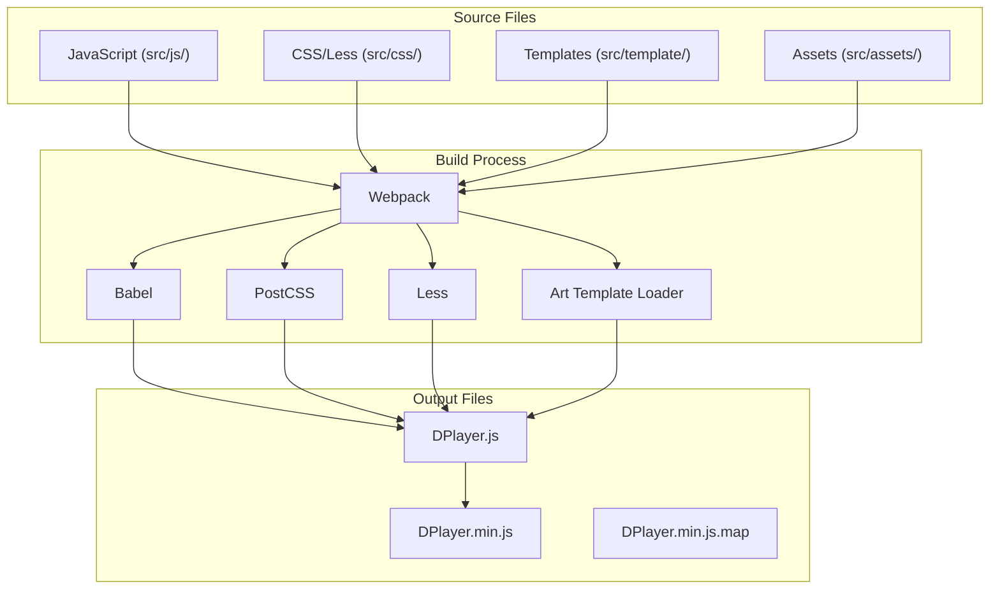
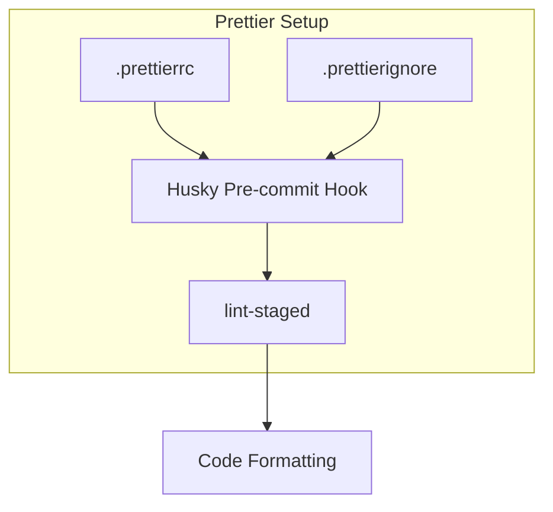
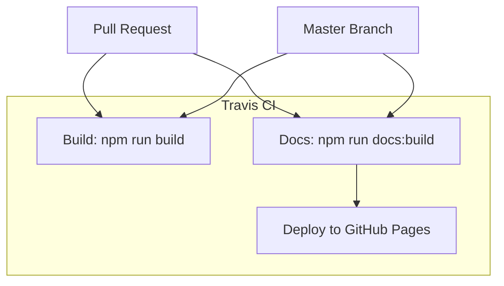
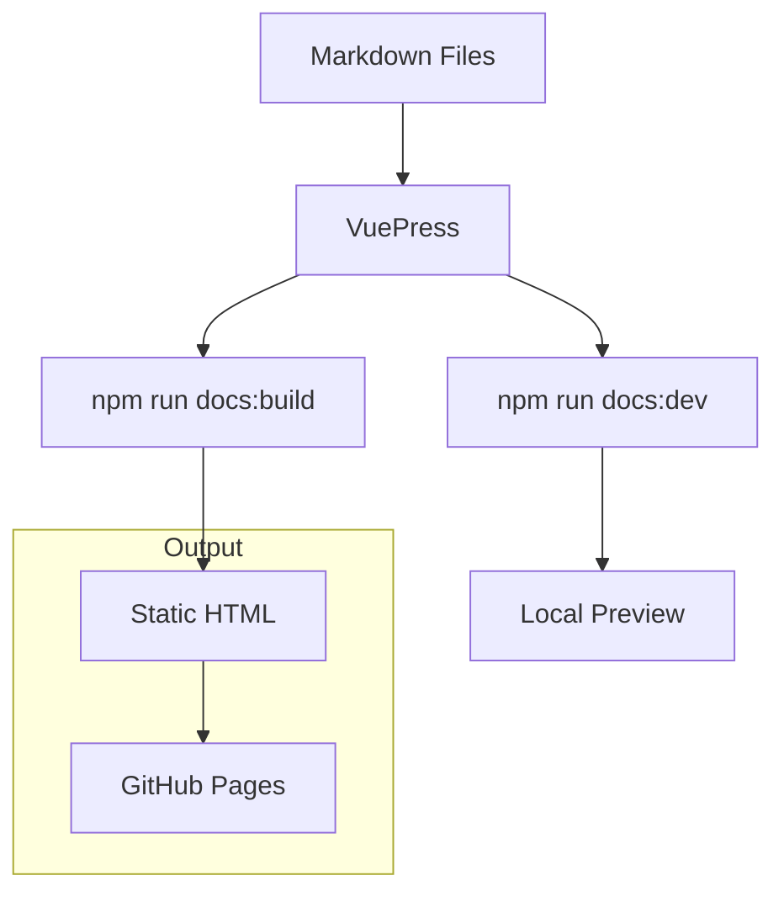
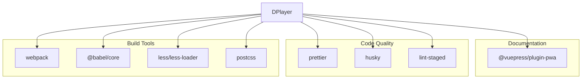
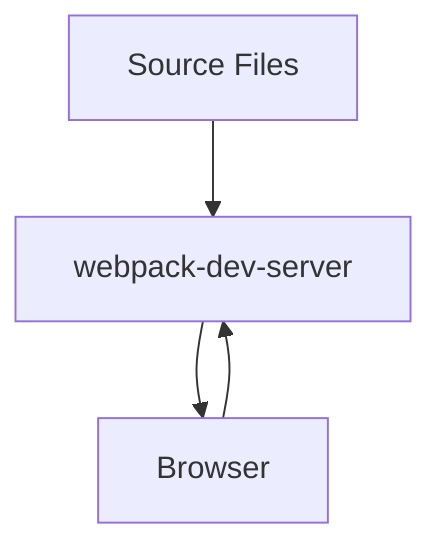

# Development Workflow

> **Relevant source files**
> * [.gitignore](https://github.com/DIYgod/DPlayer/blob/f00e304c/.gitignore)
> * [.husky/pre-commit](https://github.com/DIYgod/DPlayer/blob/f00e304c/.husky/pre-commit)
> * [.prettierignore](https://github.com/DIYgod/DPlayer/blob/f00e304c/.prettierignore)
> * [.prettierrc](https://github.com/DIYgod/DPlayer/blob/f00e304c/.prettierrc)
> * [.travis.yml](https://github.com/DIYgod/DPlayer/blob/f00e304c/.travis.yml)
> * [docs/.vuepress/styles/index.styl](https://github.com/DIYgod/DPlayer/blob/f00e304c/docs/.vuepress/styles/index.styl)
> * [docs/.vuepress/styles/palette.styl](https://github.com/DIYgod/DPlayer/blob/f00e304c/docs/.vuepress/styles/palette.styl)
> * [pnpm-lock.yaml](https://github.com/DIYgod/DPlayer/blob/f00e304c/pnpm-lock.yaml)

This page describes the development workflow for the DPlayer project, including setting up the development environment, building the project, code quality tools, and contributing to the codebase. For information about the webpack configuration, see [Webpack Configuration](/DIYgod/DPlayer/4.1-webpack-configuration).

## Environment Setup

### Prerequisites

Before you begin development on DPlayer, you'll need the following tools installed:

* **Node.js** (LTS version recommended)
* **pnpm** (preferred package manager for this project)

### Setting Up the Development Environment

1. **Clone the repository** ``` git clone https://github.com/DIYgod/DPlayer.gitcd DPlayer ```
2. **Install dependencies** ``` pnpm install ```

Sources: [pnpm-lock.yaml L1-L118](https://github.com/DIYgod/DPlayer/blob/f00e304c/pnpm-lock.yaml#L1-L118)

## Development Build System

DPlayer uses Webpack as its build system, with a comprehensive setup for development and production environments.

### Build Workflow



Sources: [pnpm-lock.yaml L18-L117](https://github.com/DIYgod/DPlayer/blob/f00e304c/pnpm-lock.yaml#L18-L117)

### Build Commands

DPlayer provides several npm scripts for different build scenarios:

| Command | Description |
| --- | --- |
| `pnpm build` | Builds production-ready files |
| `pnpm dev` | Builds development version and watches for changes |
| `pnpm demo` | Starts development server with demo page |

Sources: [.travis.yml L4-L6](https://github.com/DIYgod/DPlayer/blob/f00e304c/.travis.yml#L4-L6)

## Code Quality Tools

DPlayer maintains code quality through automated tools and pre-commit hooks.

### Prettier Configuration

Code formatting is enforced using Prettier with the following configuration:



Sources: [.prettierrc L1-L7](https://github.com/DIYgod/DPlayer/blob/f00e304c/.prettierrc#L1-L7)

 [.prettierignore L1-L2](https://github.com/DIYgod/DPlayer/blob/f00e304c/.prettierignore#L1-L2)

 [.husky/pre-commit L1-L5](https://github.com/DIYgod/DPlayer/blob/f00e304c/.husky/pre-commit#L1-L5)

The project uses the following Prettier settings:

| Setting | Value |
| --- | --- |
| Print Width | 233 characters |
| Tab Width | 4 spaces |
| Quote Style | Single quotes |
| Trailing Comma | ES5 |
| Arrow Parentheses | Always |

Sources: [.prettierrc L1-L7](https://github.com/DIYgod/DPlayer/blob/f00e304c/.prettierrc#L1-L7)

## Continuous Integration

DPlayer uses Travis CI for continuous integration and automated deployment of documentation.

### CI/CD Pipeline



Sources: [.travis.yml L1-L14](https://github.com/DIYgod/DPlayer/blob/f00e304c/.travis.yml#L1-L14)

Travis CI configuration includes:

* Building the project with `npm run build`
* Building documentation with `npm run docs:build`
* Deploying documentation to GitHub Pages when merging to master

## Documentation Development

DPlayer uses VuePress for documentation, which allows for easy writing and maintenance of docs.

### Documentation Workflow



Sources: [docs/.vuepress/styles/index.styl L1-L48](https://github.com/DIYgod/DPlayer/blob/f00e304c/docs/.vuepress/styles/index.styl#L1-L48)

 [docs/.vuepress/styles/palette.styl L1-L2](https://github.com/DIYgod/DPlayer/blob/f00e304c/docs/.vuepress/styles/palette.styl#L1-L2)

 [.travis.yml L6-L13](https://github.com/DIYgod/DPlayer/blob/f00e304c/.travis.yml#L6-L13)

The documentation can be customized via:

* Custom styles in `docs/.vuepress/styles/index.styl`
* Color palette in `docs/.vuepress/styles/palette.styl`

## Dependency Management

DPlayer uses pnpm for dependency management, which provides faster installation and better disk space efficiency.

### Key Dependencies



Sources: [pnpm-lock.yaml L7-L117](https://github.com/DIYgod/DPlayer/blob/f00e304c/pnpm-lock.yaml#L7-L117)

## Git Workflow

### Git Configuration

The repository includes configurations to ignore certain files and directories:

* `.idea` (IntelliJ IDE files)
* `node_modules` (dependencies)
* Build artifacts and logs
* VS Code settings (`.vscode`)
* Generated documentation (`docs/.vuepress/dist`)

Sources: [.gitignore L1-L10](https://github.com/DIYgod/DPlayer/blob/f00e304c/.gitignore#L1-L10)

### Pre-commit Hooks

Pre-commit hooks are managed by Husky and lint-staged to ensure code quality:

1. Staged files are checked using lint-staged
2. Code formatting is applied with Prettier

Sources: [.husky/pre-commit L1-L5](https://github.com/DIYgod/DPlayer/blob/f00e304c/.husky/pre-commit#L1-L5)

## Release Process

When releasing a new version of DPlayer:

1. Update version number in package files
2. Build the production version
3. Build documentation
4. Commit and tag the release
5. Push to GitHub (which triggers CI/CD)

The CI/CD process will automatically deploy the updated documentation to GitHub Pages.

Sources: [.travis.yml L1-L14](https://github.com/DIYgod/DPlayer/blob/f00e304c/.travis.yml#L1-L14)

## Development Server

For local development and testing, DPlayer includes a webpack-dev-server configuration that serves the demo page.



The development server:

* Watches for file changes and rebuilds automatically
* Provides hot module replacement for faster development
* Serves the demo pages for testing

Sources: [pnpm-lock.yaml L110-L117](https://github.com/DIYgod/DPlayer/blob/f00e304c/pnpm-lock.yaml#L110-L117)