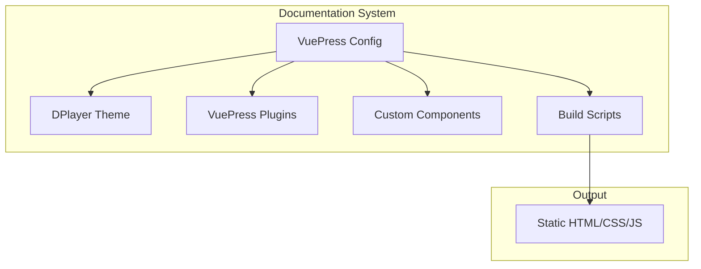
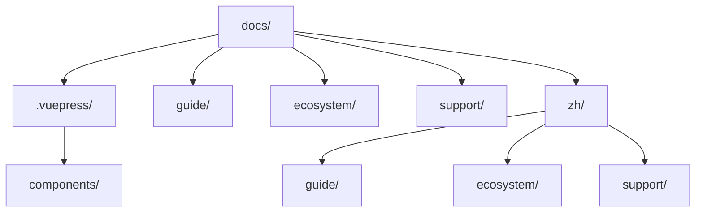
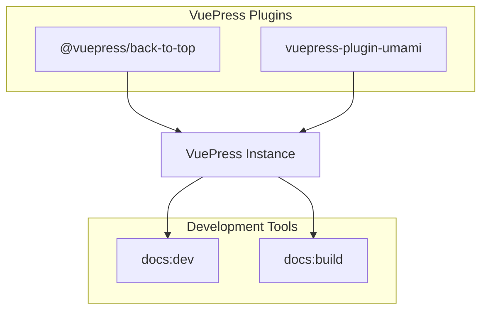
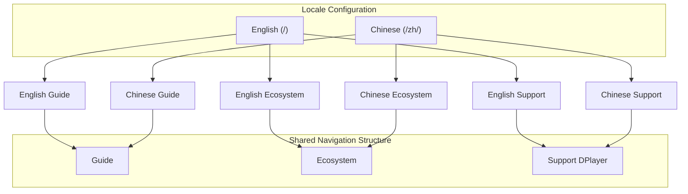
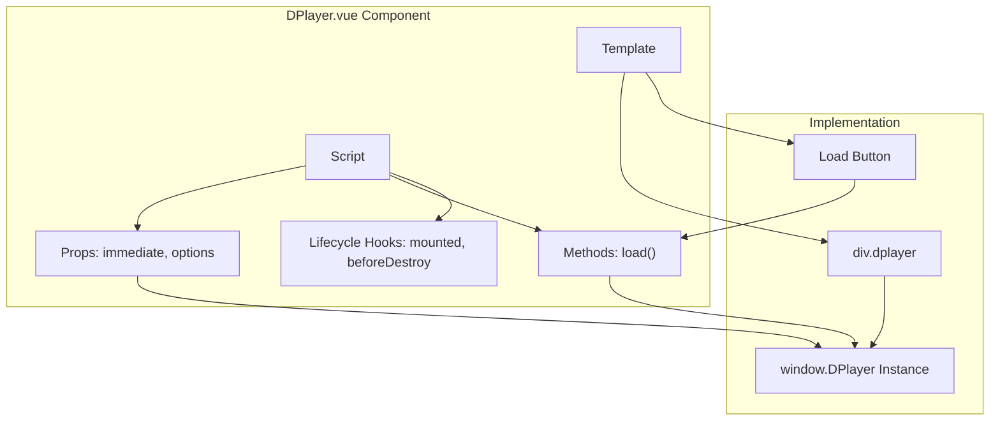
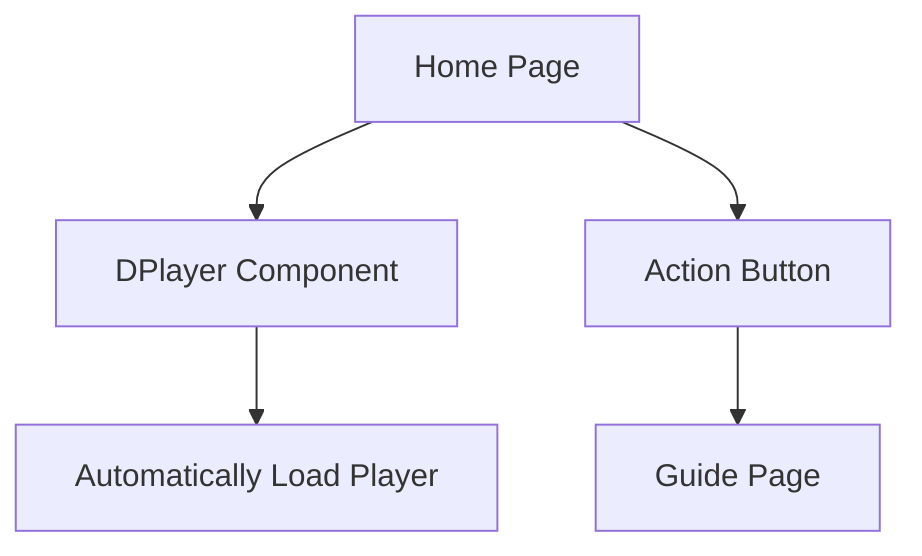
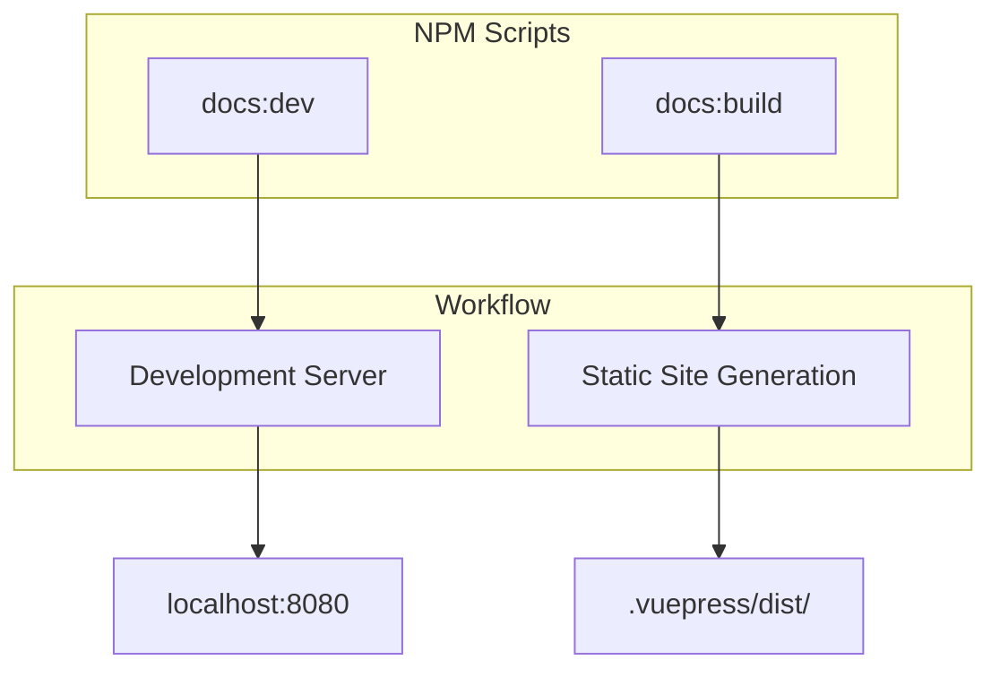
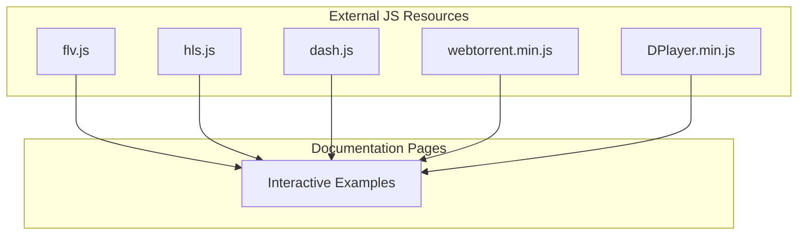
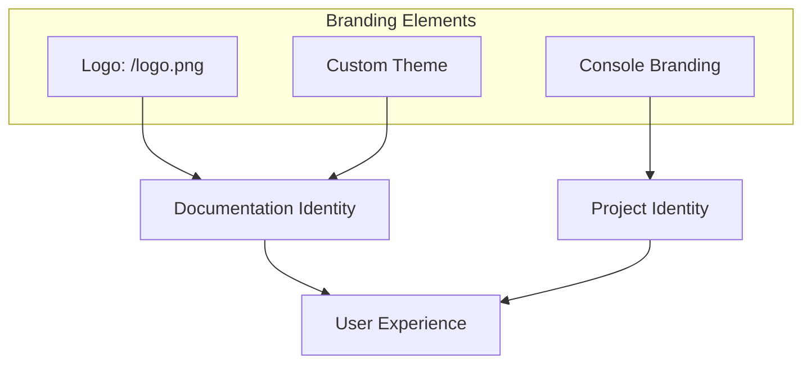
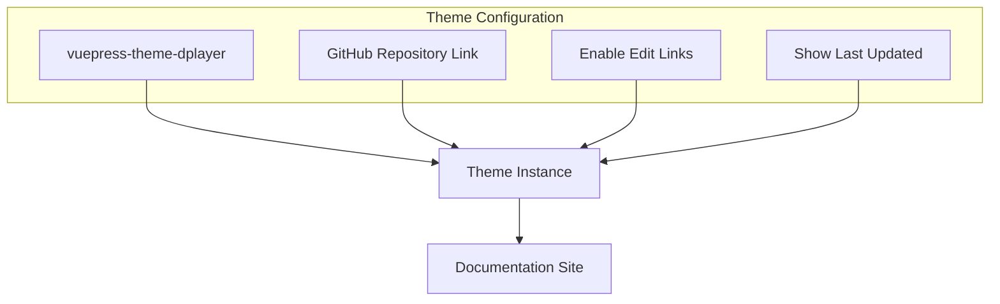

# Documentation System

> **Relevant source files**
> * [docs/.vuepress/components/DPlayer.vue](https://github.com/DIYgod/DPlayer/blob/f00e304c/docs/.vuepress/components/DPlayer.vue)
> * [docs/.vuepress/config.js](https://github.com/DIYgod/DPlayer/blob/f00e304c/docs/.vuepress/config.js)
> * [docs/package.json](https://github.com/DIYgod/DPlayer/blob/f00e304c/docs/package.json)
> * [docs/pnpm-lock.yaml](https://github.com/DIYgod/DPlayer/blob/f00e304c/docs/pnpm-lock.yaml)
> * [docs/zh/README.md](https://github.com/DIYgod/DPlayer/blob/f00e304c/docs/zh/README.md?plain=1)
> * [src/js/index.js](https://github.com/DIYgod/DPlayer/blob/f00e304c/src/js/index.js)

This document explains how the DPlayer project documentation is structured, built, and deployed using the VuePress documentation framework. The documentation system provides a comprehensive web-based resource for users, contributors, and developers interested in learning about and using DPlayer. For information on the API reference, see [API Reference](/DIYgod/DPlayer/6.1-api-reference). For details about the broader project ecosystem, see [Ecosystem](/DIYgod/DPlayer/6.3-ecosystem).

## Documentation Framework Overview

DPlayer uses [VuePress](https://vuepress.vuejs.org/) (v1.x) for its documentation, which is a static site generator powered by Vue.js. The documentation is available in both English and Chinese, with a shared navigation structure and theme.

Sources: [docs/package.json L1-L15](https://github.com/DIYgod/DPlayer/blob/f00e304c/docs/package.json#L1-L15)

 [docs/.vuepress/config.js L1-L79](https://github.com/DIYgod/DPlayer/blob/f00e304c/docs/.vuepress/config.js#L1-L79)

## Project Structure

The documentation system follows a specific folder structure to organize content and configuration files.

Sources: [docs/.vuepress/config.js L9-L76](https://github.com/DIYgod/DPlayer/blob/f00e304c/docs/.vuepress/config.js#L9-L76)

## VuePress Configuration

The VuePress configuration is defined in `docs/.vuepress/config.js` and includes settings for plugins, locale configuration, global components, and navigation.

### Main Configuration Elements

| Configuration Element | Purpose |
| --- | --- |
| `plugins` | Enhances VuePress functionality (back-to-top, analytics) |
| `locales` | Defines multi-language support (EN and ZH) |
| `head` | Configures HTML head elements, including external scripts |
| `theme` | Sets the custom theme for the documentation |
| `themeConfig` | Configures theme-specific options (nav, repo links, etc.) |

Sources: [docs/.vuepress/config.js L1-L79](https://github.com/DIYgod/DPlayer/blob/f00e304c/docs/.vuepress/config.js#L1-L79)

### Plugins

The documentation uses several VuePress plugins to enhance functionality:

Sources: [docs/package.json L1-L15](https://github.com/DIYgod/DPlayer/blob/f00e304c/docs/package.json#L1-L15)

 [docs/.vuepress/config.js L1-L8](https://github.com/DIYgod/DPlayer/blob/f00e304c/docs/.vuepress/config.js#L1-L8)

## Localization Support

DPlayer documentation supports multiple languages with a consistent navigation structure across different language versions.

Sources: [docs/.vuepress/config.js L9-L76](https://github.com/DIYgod/DPlayer/blob/f00e304c/docs/.vuepress/config.js#L9-L76)

## Custom Components

The documentation includes custom Vue components to create interactive examples of DPlayer functionality directly within the documentation.

### DPlayer Component

A Vue component (`docs/.vuepress/components/DPlayer.vue`) is used to embed interactive DPlayer instances in the documentation.

Sources: [docs/.vuepress/components/DPlayer.vue L1-L93](https://github.com/DIYgod/DPlayer/blob/f00e304c/docs/.vuepress/components/DPlayer.vue#L1-L93)

The component manages a DPlayer instance and provides methods to load the player with configurable options. This allows documentation pages to include live, interactive examples.

## Documentation Homepage

The documentation homepage uses the custom DPlayer component to showcase the player functionality immediately to visitors.

Sources: [docs/zh/README.md L1-L13](https://github.com/DIYgod/DPlayer/blob/f00e304c/docs/zh/README.md?plain=1#L1-L13)

## Build and Development Process

The documentation system includes NPM scripts for development and building of the documentation site.

Sources: [docs/package.json L3-L6](https://github.com/DIYgod/DPlayer/blob/f00e304c/docs/package.json#L3-L6)

## Dependency Management

The documentation relies on several dependencies to function properly:

| Package | Version | Purpose |
| --- | --- | --- |
| vuepress | ^1.9.10 | Core documentation engine |
| @vuepress/plugin-back-to-top | ^1.9.10 | Adds a back-to-top button |
| vuepress-plugin-umami | ^0.0.4 | Analytics integration |

Sources: [docs/package.json L9-L14](https://github.com/DIYgod/DPlayer/blob/f00e304c/docs/package.json#L9-L14)

## External Resources Integration

The documentation includes external JavaScript resources to enable full functionality of embedded DPlayer examples:

Sources: [docs/.vuepress/config.js L21-L27](https://github.com/DIYgod/DPlayer/blob/f00e304c/docs/.vuepress/config.js#L21-L27)

These external resources are loaded in the document head to ensure that all media format support is available when DPlayer examples are loaded within the documentation.

## Branding and Identity

The documentation maintains consistent branding with the main DPlayer project, using the same logo, color scheme, and styling to provide a cohesive user experience.

Sources: [docs/.vuepress/config.js L21-L22](https://github.com/DIYgod/DPlayer/blob/f00e304c/docs/.vuepress/config.js#L21-L22)

 [src/js/index.js L4-L5](https://github.com/DIYgod/DPlayer/blob/f00e304c/src/js/index.js#L4-L5)

## Theme Customization

The documentation uses a custom VuePress theme designed specifically for DPlayer documentation:

Sources: [docs/.vuepress/config.js L29-L77](https://github.com/DIYgod/DPlayer/blob/f00e304c/docs/.vuepress/config.js#L29-L77)

This custom theme ensures that the documentation has a consistent look and feel that aligns with the DPlayer project identity.