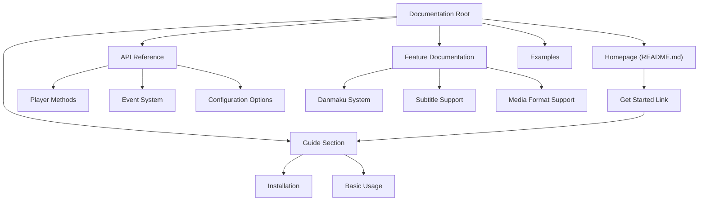
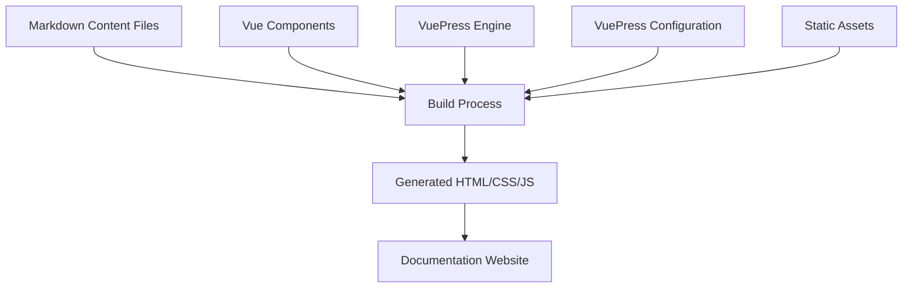
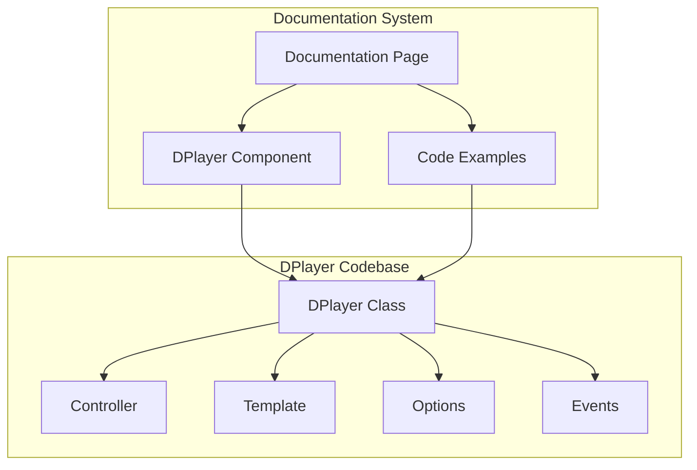
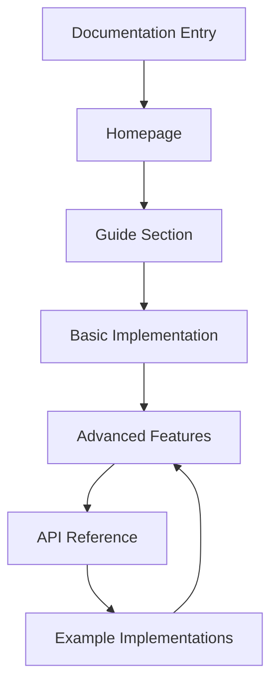

# Documentation

> **Relevant source files**
> * [docs/README.md](https://github.com/DIYgod/DPlayer/blob/f00e304c/docs/README.md?plain=1)

## Purpose and Scope

The DPlayer documentation system serves as a comprehensive resource for developers looking to understand, implement, and extend the DPlayer video player. This page provides an overview of the documentation structure, build system, and organization.

For specific API references, see [API Reference](/DIYgod/DPlayer/6.1-api-reference). For details on how the documentation itself is built and maintained, see [Documentation System](/DIYgod/DPlayer/6.2-documentation-system). For information on the broader ecosystem, see [Ecosystem](/DIYgod/DPlayer/6.3-ecosystem). For contribution guidelines, see [Contributing](/DIYgod/DPlayer/6.4-contributing).

## Documentation Structure

The DPlayer documentation follows a structured approach designed to accommodate both new users and experienced developers. Based on the documentation entry point, the structure includes:

* A homepage featuring an interactive DPlayer example
* A "Get Started" guide as the primary entry point for new users
* API reference documentation
* Feature explanations and implementation details
* Usage examples and code snippets

### Diagram: Documentation Organization



Sources: [docs/README.md](https://github.com/DIYgod/DPlayer/blob/f00e304c/docs/README.md?plain=1)

## Documentation Build System

The DPlayer documentation is built using VuePress, a Vue.js-powered static site generator that transforms markdown files into a responsive documentation website. The system supports both standard markdown and embedded Vue components, enabling interactive examples directly within the documentation pages.

### Diagram: Documentation Build Architecture



Sources: [docs/README.md](https://github.com/DIYgod/DPlayer/blob/f00e304c/docs/README.md?plain=1)

## Interactive Documentation Features

A key strength of the DPlayer documentation is its integration of interactive player instances directly within documentation pages. The homepage demonstrates this approach by embedding a functional DPlayer component:

```html
<div>  <DPlayer :immediate="true"></DPlayer></div>
```

This integration allows users to:

* See the player in action directly in the documentation
* Interact with player controls and features
* Understand visual aspects of the player that text alone cannot convey
* Connect conceptual explanations with practical implementation

### Diagram: Documentation-Code Integration



Sources: [docs/README.md L8-L10](https://github.com/DIYgod/DPlayer/blob/f00e304c/docs/README.md?plain=1#L8-L10)

## Documentation Navigation Flow

The documentation is designed with a logical progression that guides users from basic concepts to advanced topics. The homepage prominently features a "Get Started" button that serves as the primary entry point, directing users to introductory material before they explore more complex features.

### Diagram: User Documentation Journey



Sources: [docs/README.md L3-L12](https://github.com/DIYgod/DPlayer/blob/f00e304c/docs/README.md?plain=1#L3-L12)

## Documentation Component Reference Table

| Component Type | Purpose | Implementation |
| --- | --- | --- |
| Markdown Files | Core documentation content | Standard markdown with YAML frontmatter |
| Vue Components | Interactive examples | Vue components embedded in markdown |
| Code Snippets | Implementation examples | Syntax-highlighted code blocks |
| Navigation Links | Documentation structure | Internal linking between pages |
| Live DPlayer | Interactive demonstration | Embedded functional player instance |

## Related Documentation Resources

For more specific aspects of the DPlayer documentation:

* For comprehensive API details and method references, see [API Reference](/DIYgod/DPlayer/6.1-api-reference)
* For information about the documentation system implementation and maintenance, see [Documentation System](/DIYgod/DPlayer/6.2-documentation-system)
* For details on the DPlayer ecosystem, plugins, and extensions, see [Ecosystem](/DIYgod/DPlayer/6.3-ecosystem)
* For guidelines on contributing to DPlayer documentation and code, see [Contributing](/DIYgod/DPlayer/6.4-contributing)