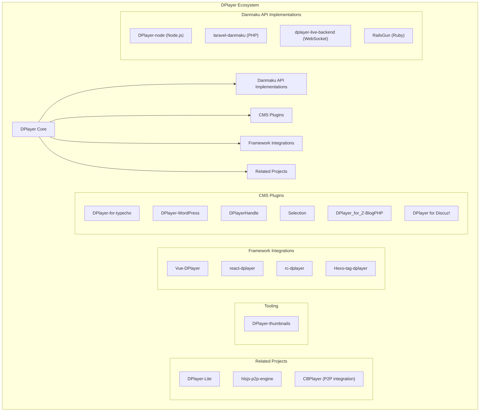
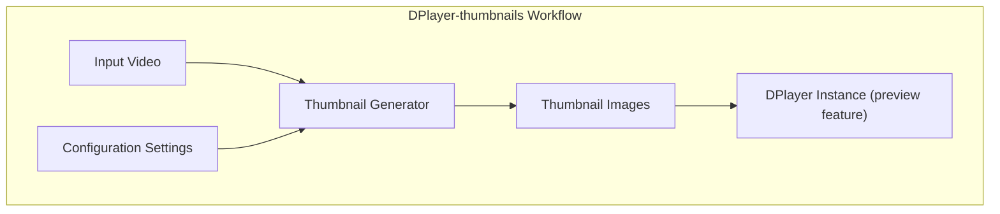
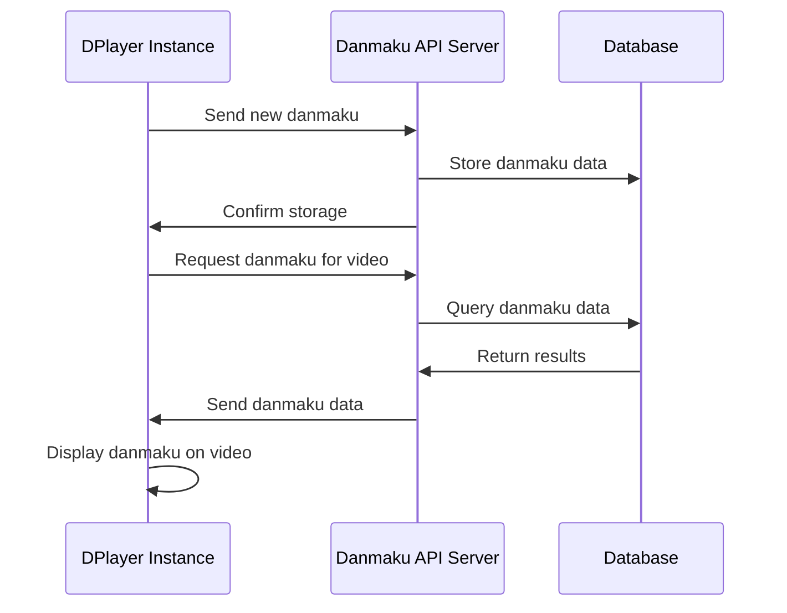
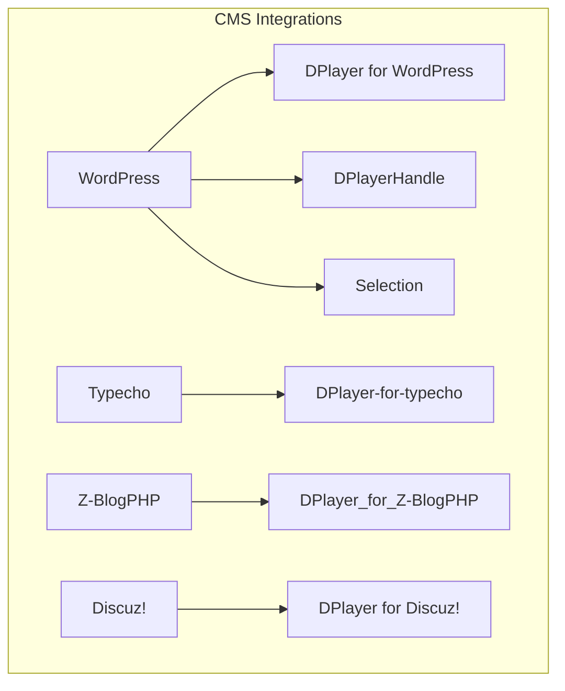
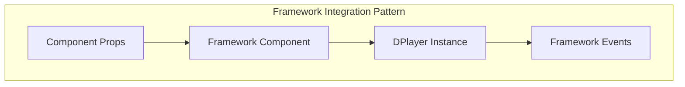
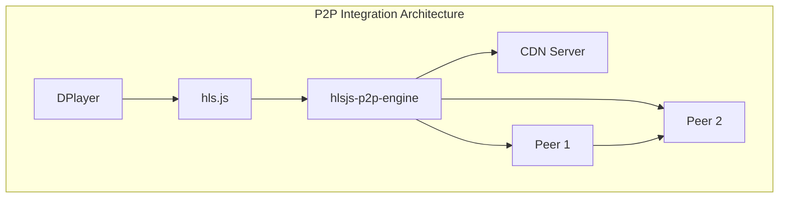
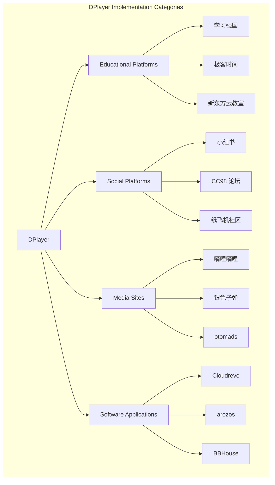
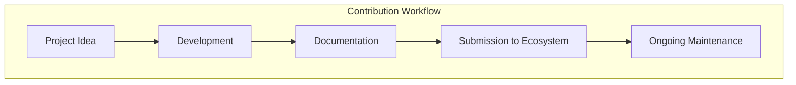

# Ecosystem

> **Relevant source files**
> * [README.md](https://github.com/DIYgod/DPlayer/blob/f00e304c/README.md?plain=1)
> * [docs/ecosystem.md](https://github.com/DIYgod/DPlayer/blob/f00e304c/docs/ecosystem.md?plain=1)

## Purpose and Scope

This document provides a comprehensive overview of the DPlayer ecosystem, including related tools, plugins, API implementations, and integrations. It covers the broader environment surrounding the DPlayer core functionality, illustrating how DPlayer can be extended, integrated with other systems, and implemented in various applications. This page focuses on the third-party projects and tools that enhance or build upon DPlayer, rather than the internal components of DPlayer itself.

For information about the core DPlayer architecture, refer to [Core Architecture](/DIYgod/DPlayer/2-core-architecture). For details about the specific features of DPlayer, see [Features](/DIYgod/DPlayer/3-features).

## Ecosystem Overview

DPlayer has developed a rich ecosystem of supporting tools, plugins, and integrations that extend its functionality across various platforms and use cases. The ecosystem consists of several key categories, as illustrated below:

Sources: [README.md L63-L92](https://github.com/DIYgod/DPlayer/blob/f00e304c/README.md?plain=1#L63-L92)

 [docs/ecosystem.md L16-L44](https://github.com/DIYgod/DPlayer/blob/f00e304c/docs/ecosystem.md?plain=1#L16-L44)

## Tooling

The tooling category consists of utilities that enhance DPlayer's functionality or help developers work with DPlayer more effectively.

### DPlayer-thumbnails

This is a utility for generating video thumbnails that can be used with DPlayer's video preview feature. Thumbnails allow users to see a preview of the video content when hovering over the progress bar, enhancing the user experience.

Sources: [README.md L65-L66](https://github.com/DIYgod/DPlayer/blob/f00e304c/README.md?plain=1#L65-L66)

 [docs/ecosystem.md L19-L20](https://github.com/DIYgod/DPlayer/blob/f00e304c/docs/ecosystem.md?plain=1#L19-L20)

## Danmaku API Implementations

Danmaku (scrolling comments) is a key feature of DPlayer. These backend implementations provide server-side support for storing, retrieving, and managing danmaku comments.

### Available Implementations

| Implementation | Language/Platform | Description |
| --- | --- | --- |
| DPlayer-node | Node.js | A Node.js-based danmaku API backend |
| laravel-danmaku | PHP/Laravel | A Laravel-based implementation for PHP applications |
| dplayer-live-backend | Node.js/WebSocket | Specialized for live streaming with WebSocket support |
| RailsGun | Ruby/Rails | A Ruby on Rails implementation |

Sources: [README.md L69-L73](https://github.com/DIYgod/DPlayer/blob/f00e304c/README.md?plain=1#L69-L73)

 [docs/ecosystem.md L22-L26](https://github.com/DIYgod/DPlayer/blob/f00e304c/docs/ecosystem.md?plain=1#L22-L26)

## Plugins and Integrations

DPlayer has been integrated with various content management systems (CMS) and frontend frameworks, making it accessible to developers in different environments.

### CMS Plugins

These plugins integrate DPlayer into popular content management systems, allowing site administrators to easily add DPlayer to their websites without extensive coding.

Sources: [README.md L76-L82](https://github.com/DIYgod/DPlayer/blob/f00e304c/README.md?plain=1#L76-L82)

 [docs/ecosystem.md L30-L36](https://github.com/DIYgod/DPlayer/blob/f00e304c/docs/ecosystem.md?plain=1#L30-L36)

### Framework Integrations

These packages provide ready-to-use DPlayer components for popular JavaScript frameworks.

| Integration | Framework | Description |
| --- | --- | --- |
| Vue-DPlayer | Vue.js | Vue component wrapping DPlayer |
| react-dplayer | React | React component for DPlayer |
| rc-dplayer | React | Alternative React implementation |
| Hexo-tag-dplayer | Hexo | Plugin for the Hexo static site generator |

Sources: [README.md L83-L86](https://github.com/DIYgod/DPlayer/blob/f00e304c/README.md?plain=1#L83-L86)

 [docs/ecosystem.md L37-L39](https://github.com/DIYgod/DPlayer/blob/f00e304c/docs/ecosystem.md?plain=1#L37-L39)

## Related Projects

Several projects have been developed that are related to but distinct from the core DPlayer implementation.

### DPlayer-Lite

A lightweight version of DPlayer with reduced features but smaller footprint, suitable for simpler use cases or performance-constrained environments.

### P2P Streaming Integrations

| Project | Description |
| --- | --- |
| hlsjs-p2p-engine | Adds peer-to-peer capabilities to HLS streaming in DPlayer |
| CBPlayer | Pre-integrated DPlayer with P2P plugin supporting HLS, MP4, and MPEG-DASH |

Sources: [README.md L89-L92](https://github.com/DIYgod/DPlayer/blob/f00e304c/README.md?plain=1#L89-L92)

 [docs/ecosystem.md L42-L44](https://github.com/DIYgod/DPlayer/blob/f00e304c/docs/ecosystem.md?plain=1#L42-L44)

## Implementations and Users

DPlayer has been adopted by various websites and applications across different sectors, demonstrating its versatility and reliability.

### Notable Implementations

* Educational platforms: 学习强国, 极客时间, 新东方云教室
* Social platforms: 小红书, 浙江大学 CC98 论坛, 纸飞机南航青年网络社区
* Media sites: 嘀哩嘀哩, 银色子弹, otomads
* Software applications: Cloudreve, arozos, BBHouse, Tampermonkey 阿里云盘

Sources: [README.md L94-L112](https://github.com/DIYgod/DPlayer/blob/f00e304c/README.md?plain=1#L94-L112)

 [docs/ecosystem.md L46-L63](https://github.com/DIYgod/DPlayer/blob/f00e304c/docs/ecosystem.md?plain=1#L46-L63)

## Contributing to the Ecosystem

DPlayer welcomes contributions to its ecosystem. Developers can create new tools, plugins, or integrations to extend DPlayer's functionality.

### How to Contribute

1. Develop your DPlayer extension, following the existing patterns in similar projects
2. Document your project thoroughly
3. Submit your project in the <FileRef file-url="[https://github.com/DIYgod/DPlayer/blob/f00e304c/\"Let](https://github.com/DIYgod/DPlayer/blob/f00e304c/%5C%22Let) me know!"" undefined  file-path=""Let me know!"">Hii issue on GitHub
4. Consider contributing to the core DPlayer repository if your extension could benefit from closer integration

Sources: [README.md L61](https://github.com/DIYgod/DPlayer/blob/f00e304c/README.md?plain=1#L61-L61)

 [docs/ecosystem.md L7](https://github.com/DIYgod/DPlayer/blob/f00e304c/docs/ecosystem.md?plain=1#L7-L7)

## Ecosystem Growth and Support

The DPlayer ecosystem continues to grow through community contributions. The diverse range of implementations across different languages, frameworks, and platforms demonstrates the flexibility and extensibility of DPlayer's design.

For developers looking to extend DPlayer or integrate it into their projects, the existing ecosystem provides valuable examples and patterns to follow. The variety of danmaku API implementations allows developers to choose the backend technology that best fits their technology stack.

Sources: [README.md L55-L58](https://github.com/DIYgod/DPlayer/blob/f00e304c/README.md?plain=1#L55-L58)

 [docs/ecosystem.md L65-L69](https://github.com/DIYgod/DPlayer/blob/f00e304c/docs/ecosystem.md?plain=1#L65-L69)