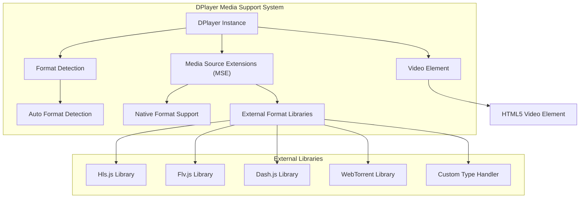
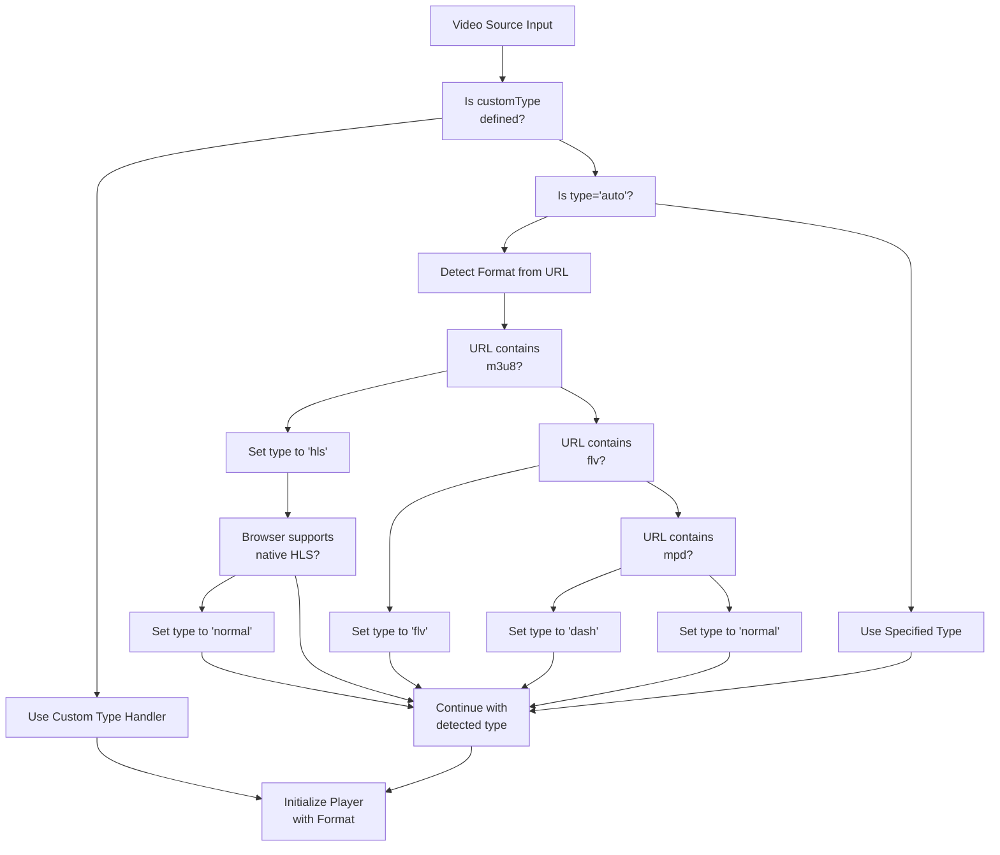
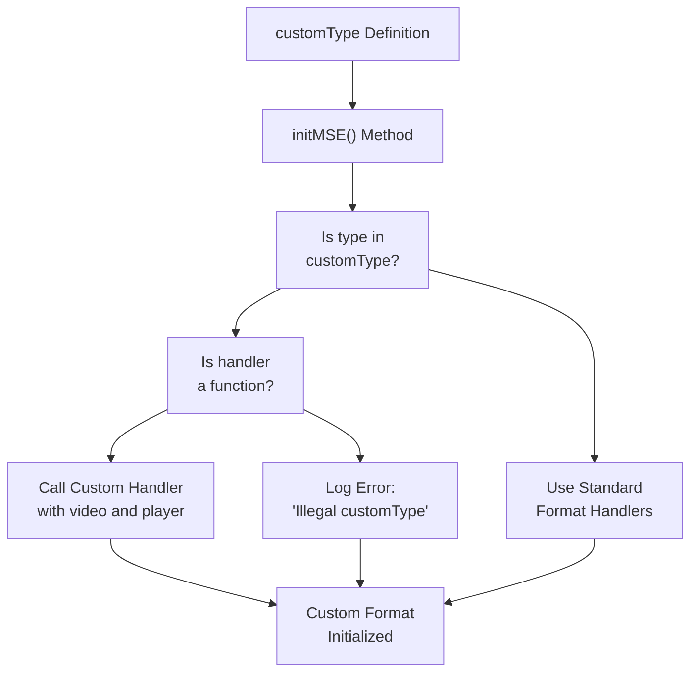
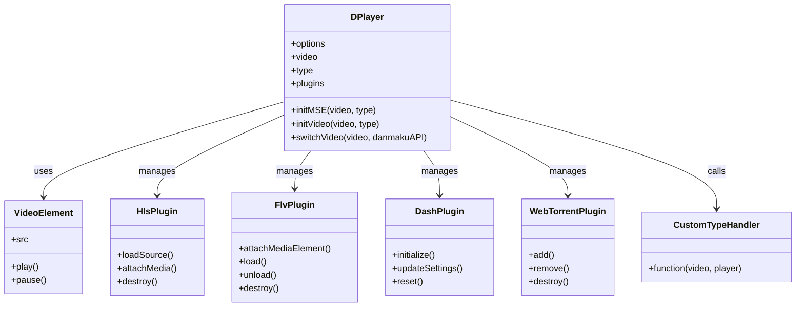
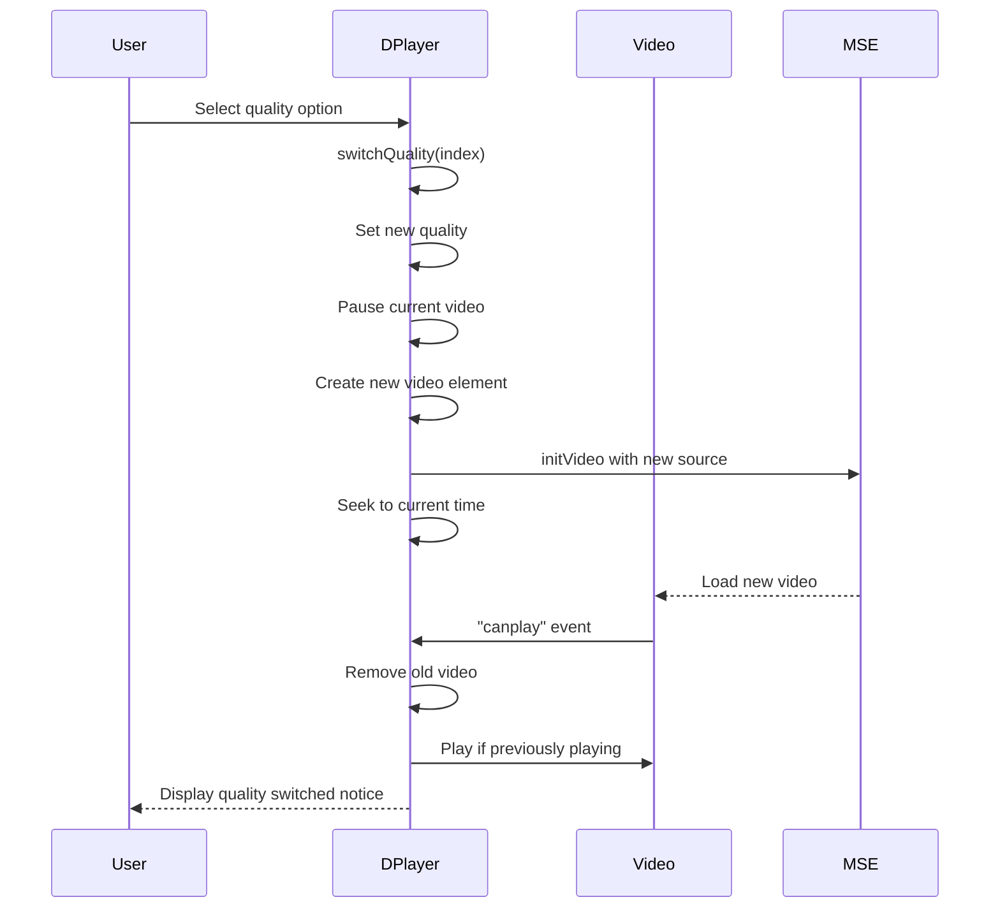

# Media Format Support

> **Relevant source files**
> * [demo/index.html](https://github.com/DIYgod/DPlayer/blob/f00e304c/demo/index.html)
> * [src/js/controller.js](https://github.com/DIYgod/DPlayer/blob/f00e304c/src/js/controller.js)
> * [src/js/options.js](https://github.com/DIYgod/DPlayer/blob/f00e304c/src/js/options.js)
> * [src/js/player.js](https://github.com/DIYgod/DPlayer/blob/f00e304c/src/js/player.js)

This document details the media formats supported by DPlayer and how the player handles different video types. DPlayer provides comprehensive support for various video formats through both native HTML5 video capabilities and integration with external libraries for specialized formats.

## Overview of Format Support

DPlayer supports multiple video formats through a flexible architecture that combines native browser capabilities with specialized format-specific libraries.



Sources: [src/js/player.js L360-L484](https://github.com/DIYgod/DPlayer/blob/f00e304c/src/js/player.js#L360-L484)

## Supported Media Formats

DPlayer supports the following media formats:

| Format | File Extension | Library | Description |
| --- | --- | --- | --- |
| Native | .mp4, .webm, etc. | None (Browser native) | Standard formats directly supported by browsers |
| HLS | .m3u8 | hls.js | HTTP Live Streaming protocol |
| FLV | .flv | flv.js | Flash Video format |
| DASH | .mpd | dash.js | Dynamic Adaptive Streaming over HTTP |
| WebTorrent | magnet links, .torrent | webtorrent | Streaming via WebTorrent protocol |
| Custom | any | User-defined | User-defined format handlers |

### Format Detection Process

DPlayer includes automatic format detection based on the video URL:



Sources: [src/js/player.js L360-L379](https://github.com/DIYgod/DPlayer/blob/f00e304c/src/js/player.js#L360-L379)

## Media Format Initialization

When a video is loaded, DPlayer initializes its media support through the `initMSE` method:

### HLS (HTTP Live Streaming) Support

For HLS streams (.m3u8 files), DPlayer uses the hls.js library when native browser support is not available:

```mermaid
sequenceDiagram
  participant DPlayer Instance
  participant initMSE() HLS Handler
  participant Hls.js Library
  participant Video Element

  DPlayer Instance->>initMSE() HLS Handler: detect .m3u8 format
  initMSE() HLS Handler->>Hls.js Library: check if Hls.js exists
  Hls.js Library->>Hls.js Library: isSupported()?
  Hls.js Library-->>initMSE() HLS Handler: supported
  initMSE() HLS Handler->>Hls.js Library: new Hls(options)
  initMSE() HLS Handler->>Hls.js Library: loadSource(video.src)
  initMSE() HLS Handler->>Hls.js Library: attachMedia(video)
  Hls.js Library-->>Video Element: handle media playback
  DPlayer Instance->>DPlayer Instance: register destroy event
```

Sources: [src/js/player.js L387-L405](https://github.com/DIYgod/DPlayer/blob/f00e304c/src/js/player.js#L387-L405)

### FLV Support

For Flash Video (.flv files), DPlayer integrates with flv.js:

```mermaid
sequenceDiagram
  participant DPlayer Instance
  participant initMSE() FLV Handler
  participant flv.js Library
  participant Video Element

  DPlayer Instance->>initMSE() FLV Handler: detect .flv format
  initMSE() FLV Handler->>flv.js Library: check if flv.js exists
  flv.js Library->>flv.js Library: isSupported()?
  flv.js Library-->>initMSE() FLV Handler: supported
  initMSE() FLV Handler->>flv.js Library: createPlayer(mediaDataSource, config)
  initMSE() FLV Handler->>flv.js Library: attachMediaElement(video)
  initMSE() FLV Handler->>flv.js Library: load()
  flv.js Library-->>Video Element: handle media playback
  DPlayer Instance->>DPlayer Instance: register destroy event
```

Sources: [src/js/player.js L408-L432](https://github.com/DIYgod/DPlayer/blob/f00e304c/src/js/player.js#L408-L432)

### DASH Support

For MPEG-DASH streams (.mpd files), DPlayer uses dash.js:

```mermaid
sequenceDiagram
  participant DPlayer Instance
  participant initMSE() DASH Handler
  participant dash.js Library
  participant Video Element

  DPlayer Instance->>initMSE() DASH Handler: detect .mpd format
  initMSE() DASH Handler->>dash.js Library: check if dash.js exists
  initMSE() DASH Handler->>dash.js Library: MediaPlayer().create()
  initMSE() DASH Handler->>dash.js Library: initialize(video, video.src, false)
  initMSE() DASH Handler->>dash.js Library: updateSettings(options)
  dash.js Library-->>Video Element: handle media playback
  DPlayer Instance->>DPlayer Instance: register destroy event
```

Sources: [src/js/player.js L435-L449](https://github.com/DIYgod/DPlayer/blob/f00e304c/src/js/player.js#L435-L449)

### WebTorrent Support

For torrent-based streaming, DPlayer integrates with WebTorrent:

```mermaid
sequenceDiagram
  participant DPlayer Instance
  participant initMSE() WebTorrent Handler
  participant WebTorrent Library
  participant Video Element

  DPlayer Instance->>initMSE() WebTorrent Handler: set type to 'webtorrent'
  initMSE() WebTorrent Handler->>WebTorrent Library: check if WebTorrent exists
  WebTorrent Library->>WebTorrent Library: WEBRTC_SUPPORT?
  WebTorrent Library-->>initMSE() WebTorrent Handler: supported
  initMSE() WebTorrent Handler->>WebTorrent Library: new WebTorrent(options)
  initMSE() WebTorrent Handler->>Video Element: clear src and set preload='metadata'
  initMSE() WebTorrent Handler->>WebTorrent Library: add(torrentId, callback)
  WebTorrent Library->>WebTorrent Library: find .mp4 file
  WebTorrent Library->>Video Element: renderTo(video)
  DPlayer Instance->>DPlayer Instance: register destroy event
```

Sources: [src/js/player.js L452-L481](https://github.com/DIYgod/DPlayer/blob/f00e304c/src/js/player.js#L452-L481)

## Custom Media Types

DPlayer provides a flexible interface for supporting custom media types through the `customType` option:



Sources: [src/js/player.js L362-L368](https://github.com/DIYgod/DPlayer/blob/f00e304c/src/js/player.js#L362-L368)

## Configuration Options

Media format support can be configured via the DPlayer options:

| Option | Default | Description |
| --- | --- | --- |
| `video.type` | 'auto' | Type of the video ('auto', 'hls', 'flv', 'dash', 'webtorrent', or custom) |
| `preload` | 'metadata' | Video preload attribute (auto, metadata, none) |
| `pluginOptions.hls` | {} | Options passed to hls.js |
| `pluginOptions.flv` | {} | Options passed to flv.js, including mediaDataSource and config |
| `pluginOptions.dash` | {} | Options passed to dash.js |
| `pluginOptions.webtorrent` | {} | Options passed to WebTorrent |

DPlayer automatically adjusts the `preload` setting to 'none' for WebTorrent videos to prevent unnecessary data usage.

Sources: [src/js/options.js L6-L25](https://github.com/DIYgod/DPlayer/blob/f00e304c/src/js/options.js#L6-L25)

 [src/js/player.js L36](https://github.com/DIYgod/DPlayer/blob/f00e304c/src/js/player.js#L36-L36)

## Media Format Integration Architecture

DPlayer's media format support is structured as follows:



Sources: [src/js/player.js L360-L484](https://github.com/DIYgod/DPlayer/blob/f00e304c/src/js/player.js#L360-L484)

## Usage Examples

To specify a particular media format in DPlayer:

```typescript
// Example for HLS streamconst dp = new DPlayer({    container: document.getElementById('player'),    video: {        url: 'https://example.com/video.m3u8',        type: 'hls',  // Explicitly set format        // Optional hls.js configuration        pluginOptions: {            hls: {                // hls.js options            }        }    }}); // Example for a custom type handlerconst dp = new DPlayer({    container: document.getElementById('player'),    video: {        url: 'https://example.com/custom-format-video',        type: 'customFormat',        customType: {            customFormat: function(video, player) {                // Custom implementation to handle the video playback                // Example: using a third-party library                someLibrary.play({                    video: video,                    url: video.src                });            }        }    }});
```

Sources: [demo/index.html L51-L69](https://github.com/DIYgod/DPlayer/blob/f00e304c/demo/index.html#L51-L69)

 [src/js/player.js L362-L368](https://github.com/DIYgod/DPlayer/blob/f00e304c/src/js/player.js#L362-L368)

## Quality Switching Support

DPlayer supports quality switching for adaptive streaming formats through the `switchQuality` method:



Sources: [src/js/player.js L572-L642](https://github.com/DIYgod/DPlayer/blob/f00e304c/src/js/player.js#L572-L642)

## Potential Issues and Error Handling

DPlayer implements error handling for various media format issues:

1. For HLS: Checks if Hls.js is available and supported
2. For FLV: Verifies flv.js existence and browser support
3. For DASH: Ensures dash.js is available
4. For WebTorrent: Checks WebRTC support
5. For all formats: Handles video load errors with appropriate user notifications

Sources: [src/js/player.js L399-L403](https://github.com/DIYgod/DPlayer/blob/f00e304c/src/js/player.js#L399-L403)

 [src/js/player.js L427-L431](https://github.com/DIYgod/DPlayer/blob/f00e304c/src/js/player.js#L427-L431)

 [src/js/player.js L446-L448](https://github.com/DIYgod/DPlayer/blob/f00e304c/src/js/player.js#L446-L448)

 [src/js/player.js L475-L479](https://github.com/DIYgod/DPlayer/blob/f00e304c/src/js/player.js#L475-L479)

 [src/js/player.js L507-L513](https://github.com/DIYgod/DPlayer/blob/f00e304c/src/js/player.js#L507-L513)

## Related Documentation

For information about the player's core architecture, see [Core Architecture](/DIYgod/DPlayer/2-core-architecture).
For details about subtitle support, see [Subtitle System](/DIYgod/DPlayer/3.3-subtitle-system).