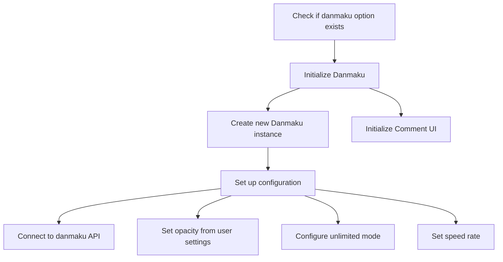
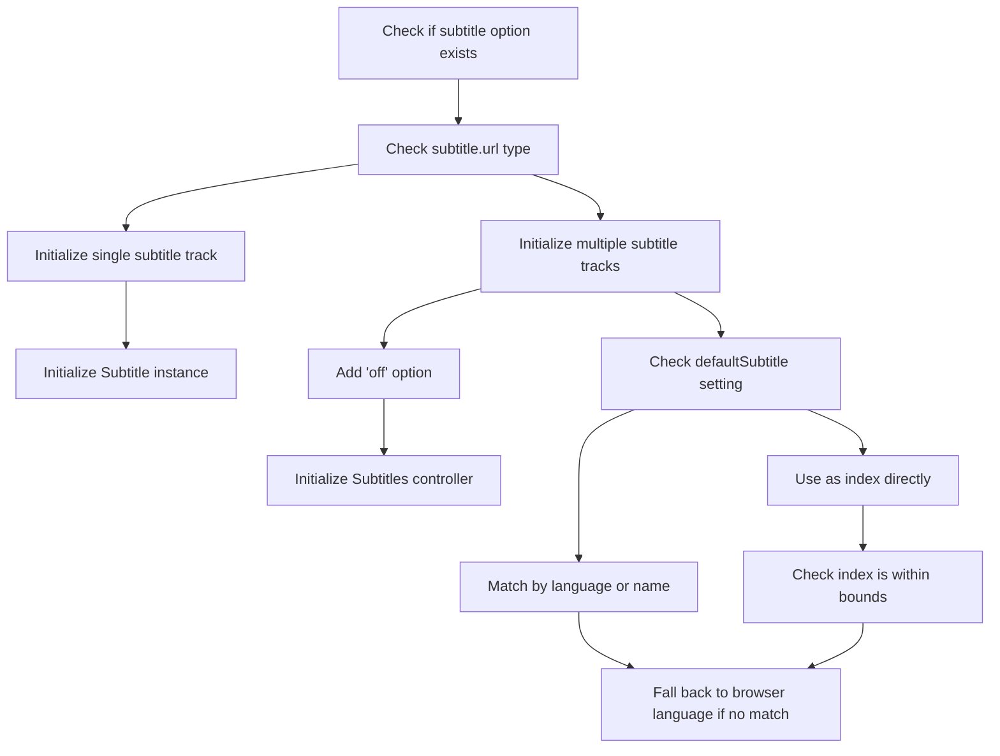
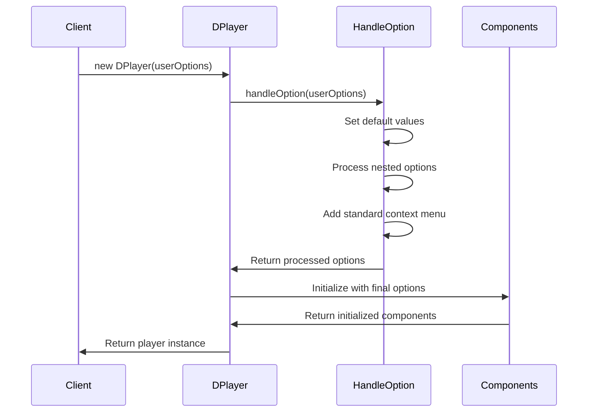

# Options and Configuration

> **Relevant source files**
> * [docs/guide.md](https://github.com/DIYgod/DPlayer/blob/f00e304c/docs/guide.md?plain=1)
> * [docs/zh/guide.md](https://github.com/DIYgod/DPlayer/blob/f00e304c/docs/zh/guide.md?plain=1)
> * [src/js/controller.js](https://github.com/DIYgod/DPlayer/blob/f00e304c/src/js/controller.js)
> * [src/js/options.js](https://github.com/DIYgod/DPlayer/blob/f00e304c/src/js/options.js)
> * [src/js/player.js](https://github.com/DIYgod/DPlayer/blob/f00e304c/src/js/player.js)

This page documents the configuration options available in DPlayer and how they're processed in the system. It explains how to customize the player through its comprehensive options system.

DPlayer offers a rich set of configuration options that control everything from basic player functionality to advanced features like danmaku (scrolling comments), subtitles, and media format support. For information about the DPlayer API and event system, see [API Reference](/DIYgod/DPlayer/6.1-api-reference).

## Options Processing Flow

When a new DPlayer instance is created, the provided options are processed through a handling system that merges them with defaults and ensures proper configuration.

```

```

Sources: [src/js/player.js L35-L36](https://github.com/DIYgod/DPlayer/blob/f00e304c/src/js/player.js#L35-L36)

 [src/js/options.js L4-L70](https://github.com/DIYgod/DPlayer/blob/f00e304c/src/js/options.js#L4-L70)

## Default Options

DPlayer comes with sensible defaults that can be overridden by user-provided options. The following table shows the primary default options:

| Option | Default Value | Description |
| --- | --- | --- |
| container | `.dplayer` element or options.element | DOM element to contain the player |
| live | false | Enable live mode |
| autoplay | false | Autoplay video when player loads |
| theme | '#b7daff' | Theme color for player UI |
| loop | false | Loop video playback |
| lang | Browser language | Player language (en, zh-cn, zh-tw) |
| screenshot | false | Enable screenshot functionality |
| hotkey | true | Enable keyboard shortcuts |
| preload | 'metadata' | Video preload attribute |
| volume | 0.7 | Default volume level (0-1) |
| playbackSpeed | [0.5, 0.75, 1, 1.25, 1.5, 2] | Available playback speeds |
| mutex | true | Prevent multiple players playing simultaneously |

Sources: [src/js/options.js L6-L26](https://github.com/DIYgod/DPlayer/blob/f00e304c/src/js/options.js#L6-L26)

## Option Categories

DPlayer's options can be organized into several functional categories to help understand their purpose and relationships.

```mermaid
flowchart TD

core["Core Player Options"]
video["Video Options"]
ui["UI Options"]
features["Feature Options"]
media["Media Format Options"]
external["External Services"]
container["container"]
autoplay["autoplay"]
loop["loop"]
lang["lang"]
preload["preload"]
mutex["mutex"]
videoUrl["video.url"]
videoPic["video.pic"]
videoType["video.type"]
videoQuality["video.quality"]
thumbnails["video.thumbnails"]
theme["theme"]
logo["logo"]
contextmenu["contextmenu"]
highlight["highlight"]
danmaku["danmaku"]
screenshot["screenshot"]
subtitle["subtitle"]
hotkey["hotkey"]
hls["HLS Support"]
flv["FLV Support"]
dash["DASH Support"]
webtorrent["WebTorrent Support"]
customType["customType Handlers"]
airplay["airplay"]
chromecast["chromecast"]
apiBackend["apiBackend"]

core --> container
core --> autoplay
core --> loop
core --> lang
core --> preload
core --> mutex
video --> videoUrl
video --> videoPic
video --> videoType
video --> videoQuality
video --> thumbnails
ui --> theme
ui --> logo
ui --> contextmenu
ui --> highlight
features --> danmaku
features --> screenshot
features --> subtitle
features --> hotkey
media --> hls
media --> flv
media --> dash
media --> webtorrent
media --> customType
external --> airplay
external --> chromecast
external --> apiBackend

subgraph subGraph0 ["DPlayer Options"]
    core
    video
    ui
    features
    media
    external
end
```



Sources: [src/js/options.js L6-L26](https://github.com/DIYgod/DPlayer/blob/f00e304c/src/js/options.js#L6-L26)

 [src/js/player.js L35-L100](https://github.com/DIYgod/DPlayer/blob/f00e304c/src/js/player.js#L35-L100)

## Core Player Options

These options affect the fundamental behavior of the player.

| Option | Description | Type | Default |
| --- | --- | --- | --- |
| container | DOM element where player will be mounted | HTMLElement | First .dplayer element |
| live | Enables live streaming mode | Boolean | false |
| autoplay | Automatically play video on load | Boolean | false |
| loop | Loop video playback | Boolean | false |
| preload | Video preload strategy | String | 'metadata' |
| lang | UI language | String | Browser language |
| mutex | Prevent multiple players playing simultaneously | Boolean | true |
| hotkey | Enable keyboard controls | Boolean | true |
| preventClickToggle | Prevent play/pause toggle on player click | Boolean | false |

Sources: [src/js/options.js L6-L26](https://github.com/DIYgod/DPlayer/blob/f00e304c/src/js/options.js#L6-L26)

 [src/js/player.js L47-L68](https://github.com/DIYgod/DPlayer/blob/f00e304c/src/js/player.js#L47-L68)

## Video Options

Options related to the video source and display.

| Option | Description | Type | Default |
| --- | --- | --- | --- |
| video.url | Video URL | String | - |
| video.pic | Poster image URL | String | - |
| video.thumbnails | Video preview thumbnails URL | String | - |
| video.type | Video type ('auto', 'hls', 'flv', etc.) | String | 'auto' |
| video.quality | Array of quality options | Array | - |
| video.defaultQuality | Default quality index | Number | 0 |
| video.customType | Custom type handlers | Object | - |

When the `video.quality` option is provided, DPlayer automatically initializes with the specified default quality:

```
// From options.jsif (options.video.quality) {    options.video.url = options.video.quality[options.video.defaultQuality].url;}
```

Sources: [src/js/options.js L32-L34](https://github.com/DIYgod/DPlayer/blob/f00e304c/src/js/options.js#L32-L34)

 [src/js/options.js L45-L47](https://github.com/DIYgod/DPlayer/blob/f00e304c/src/js/options.js#L45-L47)

 [src/js/player.js L38-L41](https://github.com/DIYgod/DPlayer/blob/f00e304c/src/js/player.js#L38-L41)

## Feature Options

### Danmaku Configuration

Danmaku (scrolling comments) is one of DPlayer's key features. These options configure the danmaku system.

| Option | Description | Type | Default |
| --- | --- | --- | --- |
| danmaku.id | Danmaku pool ID (required) | String | - |
| danmaku.api | API endpoint for danmaku (required) | String | - |
| danmaku.token | Authentication token | String | - |
| danmaku.maximum | Maximum number of danmaku | Number | - |
| danmaku.addition | Additional danmaku sources | Array | - |
| danmaku.user | User name | String | 'DIYgod' |
| danmaku.bottom | Bottom margin (e.g., '10px') | String | - |
| danmaku.unlimited | Show all danmaku without limit | Boolean | false |
| danmaku.speedRate | Danmaku speed multiplier | Number | 1 |

When the danmaku system is enabled, it's initialized in the player constructor:



Sources: [src/js/player.js L119-L156](https://github.com/DIYgod/DPlayer/blob/f00e304c/src/js/player.js#L119-L156)

 [src/js/options.js L35-L37](https://github.com/DIYgod/DPlayer/blob/f00e304c/src/js/options.js#L35-L37)

### Subtitle Configuration

Options for configuring video subtitles.

| Option | Description | Type | Default |
| --- | --- | --- | --- |
| subtitle.url | Subtitle file URL or array of subtitle sources | String/Array | - |
| subtitle.type | Subtitle format | String | 'webvtt' |
| subtitle.fontSize | Font size | String | '20px' |
| subtitle.bottom | Bottom margin | String | '40px' |
| subtitle.color | Text color | String | '#fff' |
| subtitle.defaultSubtitle | Default subtitle selection | String/Number | - |

DPlayer supports both single subtitle tracks and multiple subtitle options (added in array format).



Sources: [src/js/player.js L65-L100](https://github.com/DIYgod/DPlayer/blob/f00e304c/src/js/player.js#L65-L100)

 [src/js/options.js L38-L43](https://github.com/DIYgod/DPlayer/blob/f00e304c/src/js/options.js#L38-L43)

 [src/js/player.js L559-L568](https://github.com/DIYgod/DPlayer/blob/f00e304c/src/js/player.js#L559-L568)

### Other Feature Options

| Option | Description | Type | Default |
| --- | --- | --- | --- |
| screenshot | Enable screenshot functionality | Boolean | false |
| airplay | Enable AirPlay in Safari | Boolean | true |
| chromecast | Enable Chromecast support | Boolean | false |
| contextmenu | Custom context menu items | Array | [] |
| highlight | Time markers on progress bar | Array | - |

Sources: [src/js/options.js L6-L26](https://github.com/DIYgod/DPlayer/blob/f00e304c/src/js/options.js#L6-L26)

 [src/js/controller.js L232-L254](https://github.com/DIYgod/DPlayer/blob/f00e304c/src/js/controller.js#L232-L254)

## Media Format Support

DPlayer supports various media formats through plugins or custom handlers.

| Option | Description |
| --- | --- |
| pluginOptions.hls | Configuration for HLS.js |
| pluginOptions.flv | Configuration for FLV.js |
| pluginOptions.dash | Configuration for DASH.js |
| pluginOptions.webtorrent | Configuration for WebTorrent |

Custom video types can be handled through the `video.customType` option, which allows defining handlers for specific formats:

```javascript
const dp = new DPlayer({    // ...    video: {        url: 'video.m3u8',        type: 'customHls',        customType: {            customHls: function(video, player) {                // Custom handling code            }        }    }});
```

Sources: [src/js/player.js L360-L484](https://github.com/DIYgod/DPlayer/blob/f00e304c/src/js/player.js#L360-L484)

 [src/js/options.js L24](https://github.com/DIYgod/DPlayer/blob/f00e304c/src/js/options.js#L24-L24)

## Initialization Process

When a DPlayer instance is created, options flow through several processing steps:



The configuration flow ensures that:

1. Required options have default values if not provided
2. Nested options (like subtitle, danmaku) have proper structure
3. Special cases (like WebTorrent preload) are handled
4. Standard context menu items are added
5. All components receive their appropriate configuration

Sources: [src/js/player.js L35-L190](https://github.com/DIYgod/DPlayer/blob/f00e304c/src/js/player.js#L35-L190)

 [src/js/options.js L4-L70](https://github.com/DIYgod/DPlayer/blob/f00e304c/src/js/options.js#L4-L70)

## Usage Examples

### Basic Configuration

```javascript
const dp = new DPlayer({    container: document.getElementById('player'),    video: {        url: 'video.mp4',        pic: 'poster.jpg'    }});
```

### Advanced Configuration with Multiple Features

```javascript
const dp = new DPlayer({    container: document.getElementById('player'),    autoplay: false,    theme: '#FADFA3',    loop: true,    lang: 'zh-cn',    screenshot: true,    hotkey: true,    preload: 'auto',    logo: 'logo.png',    volume: 0.7,    mutex: true,    video: {        url: 'video.mp4',        pic: 'poster.png',        thumbnails: 'thumbnails.jpg',        type: 'auto',    },    subtitle: {        url: 'subtitle.vtt',        type: 'webvtt',        fontSize: '25px',        bottom: '10%',        color: '#b7daff',    },    danmaku: {        id: '9E2E3368B56CDBB4',        api: 'https://api.example.com/dplayer/',        token: 'token',        maximum: 1000,        addition: ['https://api.example.com/v3/bilibili?aid=4157142'],        user: 'Username',        bottom: '15%',        unlimited: true,        speedRate: 0.5,    },    contextmenu: [        {            text: 'Custom Option',            link: 'https://example.com',        },        {            text: 'Another Option',            click: (player) => {                console.log(player);            },        },    ],    highlight: [        {            time: 20,            text: 'Highlight at 20s',        },        {            time: 120,            text: 'Highlight at 2min',        },    ],});
```

### Quality Switching Configuration

```javascript
const dp = new DPlayer({    container: document.getElementById('player'),    video: {        quality: [            {                name: 'HD',                url: 'video-hd.m3u8',                type: 'hls',            },            {                name: 'SD',                url: 'video-sd.mp4',                type: 'normal',            },        ],        defaultQuality: 0,        pic: 'poster.png',        thumbnails: 'thumbnails.jpg',    },});
```

Sources: [docs/guide.md L131-L190](https://github.com/DIYgod/DPlayer/blob/f00e304c/docs/guide.md?plain=1#L131-L190)

 [docs/zh/guide.md L122-L180](https://github.com/DIYgod/DPlayer/blob/f00e304c/docs/zh/guide.md?plain=1#L122-L180)

## Best Practices

1. **Always provide a container element** - While DPlayer will attempt to find a default container, explicitly providing one ensures reliable initialization.
2. **Set appropriate preload value** - Use 'metadata' (default) for normal videos and 'none' for special formats like WebTorrent to optimize loading.
3. **Consider User Storage** - Some options like volume and danmaku settings are remembered by the player between sessions, so default values will only apply until a user changes them.
4. **Mind Mobile Compatibility** - Features like autoplay and hotkeys may behave differently on mobile devices due to browser restrictions.
5. **Video Type Detection** - When using 'auto' type, DPlayer will attempt to detect the correct type based on the URL. For more reliable playback, specify the type explicitly.

Sources: [src/js/player.js L36](https://github.com/DIYgod/DPlayer/blob/f00e304c/src/js/player.js#L36-L36)

 [src/js/options.js L17-L18](https://github.com/DIYgod/DPlayer/blob/f00e304c/src/js/options.js#L17-L18)