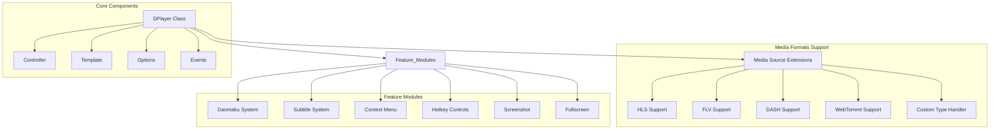
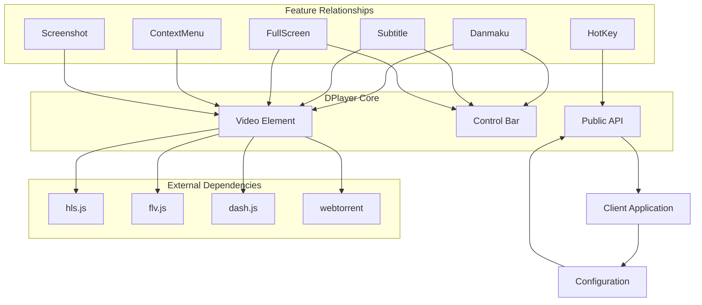
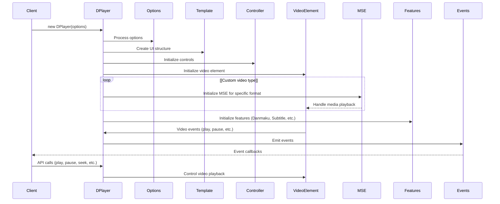
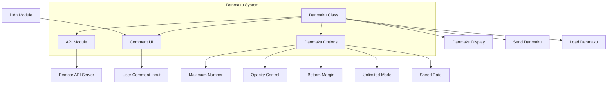
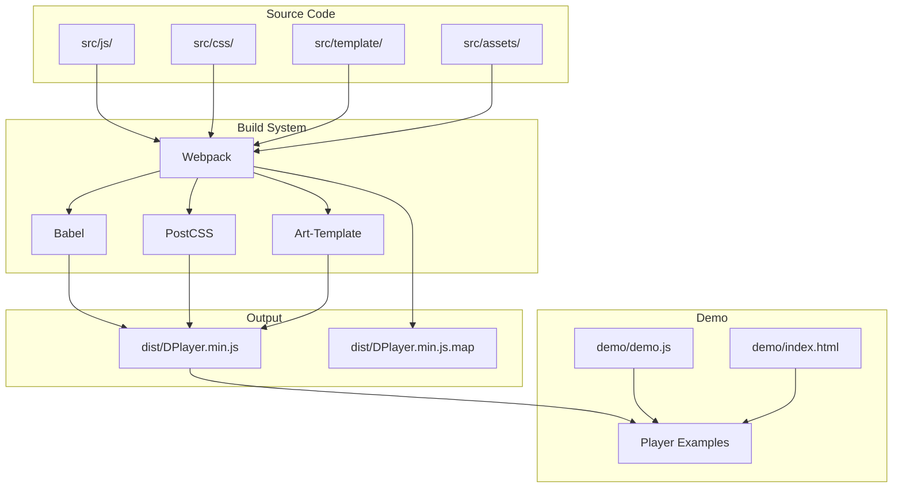

# Overview

> **Relevant source files**
> * [README.md](https://github.com/DIYgod/DPlayer/blob/f00e304c/README.md?plain=1)
> * [dist/DPlayer.min.js](https://github.com/DIYgod/DPlayer/blob/f00e304c/dist/DPlayer.min.js)
> * [dist/DPlayer.min.js.map](https://github.com/DIYgod/DPlayer/blob/f00e304c/dist/DPlayer.min.js.map)

DPlayer is an HTML5 danmaku video player that allows developers to easily integrate video playback with danmaku (scrolling comments) functionality into their web applications. This document provides a technical overview of the DPlayer system architecture, core components, and how they interact with each other.

For detailed information on how to use DPlayer in your projects, see [Getting Started](/DIYgod/DPlayer/2.1-player-class), and for details on configuration options, see [Options and Configuration](/DIYgod/DPlayer/2.4-options-and-configuration).

## Core Architecture

DPlayer follows a modular architecture that separates concerns between different components. Here's a high-level overview of the system:



Sources: [dist/DPlayer.min.js L1-L100](https://github.com/DIYgod/DPlayer/blob/f00e304c/dist/DPlayer.min.js#L1-L100)

### Core Components

1. **DPlayer Class**: The main entry point and central coordinator for the player. It initializes all other components and handles the player lifecycle.
2. **Controller**: Manages user interactions with the player interface, handling click events, hover events, and other UI interactions.
3. **Template**: Handles the rendering of the player UI using HTML templates.
4. **Options**: Stores and manages player configuration options, providing defaults and validation.
5. **Events**: Manages event handling and communication between components.

### Media Format Support

DPlayer supports various media formats through the Media Source Extensions (MSE) interface:

| Format | Implementation | Description |
| --- | --- | --- |
| HLS | hls.js | HTTP Live Streaming support |
| FLV | flv.js | Flash Video support |
| DASH | dash.js | MPEG DASH support |
| WebTorrent | webtorrent | P2P streaming support |
| Custom | User-defined | Custom format handlers |

### Feature Modules

DPlayer includes several feature modules that provide additional functionality:

1. **Danmaku System**: Manages scrolling comments overlaid on the video
2. **Subtitle System**: Handles subtitle display and synchronization
3. **Context Menu**: Provides a customizable right-click menu
4. **Hotkey Controls**: Enables keyboard shortcuts for player control
5. **Screenshot**: Allows users to capture video frames
6. **Fullscreen**: Manages various fullscreen modes (browser and web)

## Component Relationships

The following diagram illustrates the relationships between the different components of DPlayer:



Sources: [dist/DPlayer.min.js L100-L200](https://github.com/DIYgod/DPlayer/blob/f00e304c/dist/DPlayer.min.js#L100-L200)

### Initialization Flow

The following sequence diagram shows how DPlayer is initialized and how events flow through the system:



Sources: [dist/DPlayer.min.js L200-L300](https://github.com/DIYgod/DPlayer/blob/f00e304c/dist/DPlayer.min.js#L200-L300)

The initialization process typically follows these steps:

1. Client creates a new DPlayer instance with configuration options
2. DPlayer processes the options and merges with defaults
3. DPlayer creates the UI structure using the Template component
4. Controls are initialized through the Controller component
5. The video element is created and initialized
6. If custom media formats are used, the appropriate MSE handler is initialized
7. Feature modules like Danmaku and Subtitle are initialized
8. Event listeners are set up for video events and user interactions
9. DPlayer is ready for API calls from the client application

## Danmaku System

The Danmaku System is a key feature of DPlayer that allows users to send and display scrolling comments over the video. Here's a detailed look at its architecture:



Sources: [dist/DPlayer.min.js L300-L400](https://github.com/DIYgod/DPlayer/blob/f00e304c/dist/DPlayer.min.js#L300-L400)

The Danmaku system consists of several components:

1. **Danmaku Class**: The main class that manages danmaku comments
2. **API Module**: Handles communication with the remote danmaku server
3. **Comment UI**: Provides the UI for sending comments
4. **Danmaku Options**: Configuration for danmaku behavior

DPlayer implements three types of danmaku:

* **Rolling (type 0)**: Comments that scroll horizontally across the screen
* **Top (type 1)**: Comments that appear at the top of the screen and remain static
* **Bottom (type 2)**: Comments that appear at the bottom of the screen and remain static

## UI Component Hierarchy

DPlayer's UI follows a hierarchical structure as shown in the following diagram:

```mermaid
flowchart TD

DPlayer["DPlayer Instance"]
VideoWrap["Video Wrap"]
Controller["Controller"]
InfoPanel["Info Panel"]
Bezel["Bezel"]
Video["Video Element"]
Logo["Logo"]
DanmakuLayer["Danmaku Layer"]
SubtitleLayer["Subtitle Layer"]
PlayButton["Play/Pause"]
VolumeBar["Volume"]
ProgressBar["Progress Bar"]
Time["Time Display"]
QualitySelector["Quality Selector"]
ScreenshotBtn["Screenshot"]
FullscreenBtn["Fullscreen"]
CommentBtn["Comment Button"]
SettingsBtn["Settings"]
FPS["FPS Display"]
Version["Version Info"]
LoadingIcon["Loading"]
PlayIcon["Big Play Icon"]

DPlayer --> VideoWrap
DPlayer --> Controller
DPlayer --> InfoPanel
DPlayer --> Bezel
VideoWrap --> Video
VideoWrap --> Logo
VideoWrap --> DanmakuLayer
VideoWrap --> SubtitleLayer
Controller --> PlayButton
Controller --> VolumeBar
Controller --> ProgressBar
Controller --> Time
Controller --> QualitySelector
Controller --> ScreenshotBtn
Controller --> FullscreenBtn
Controller --> CommentBtn
Controller --> SettingsBtn
InfoPanel --> FPS
InfoPanel --> Version
Bezel --> LoadingIcon
Bezel --> PlayIcon
```



Sources: [dist/DPlayer.min.js L400-L500](https://github.com/DIYgod/DPlayer/blob/f00e304c/dist/DPlayer.min.js#L400-L500)

 [dist/DPlayer.min.js.map L1-L100](https://github.com/DIYgod/DPlayer/blob/f00e304c/dist/DPlayer.min.js.map#L1-L100)

The UI structure consists of:

1. **Video Wrap**: Contains the video element and overlay layers * Video Element: The HTML5 video element * Logo: Optional logo overlay * Danmaku Layer: Container for danmaku comments * Subtitle Layer: Container for subtitles
2. **Controller**: The control bar with playback controls * Play/Pause Button * Volume Bar * Progress Bar * Time Display * Quality Selector (when multiple qualities are available) * Screenshot Button * Fullscreen Button * Comment Button (to show/hide the comment input) * Settings Button
3. **Info Panel**: Displays technical information about the player and video * FPS Display * Version Info * Video Type * Video Resolution * Danmaku Statistics (when enabled)
4. **Bezel**: Center overlay for status indicators * Loading Icon * Play Icon (shown briefly when play/pause is toggled)

## Project Structure and Build System

DPlayer's codebase is organized as follows:



Sources: [README.md L1-L50](https://github.com/DIYgod/DPlayer/blob/f00e304c/README.md?plain=1#L1-L50)

### Source Code Organization

The source code is organized into several directories:

* **src/js/**: JavaScript source files * Core player implementation * Feature modules * Utility functions
* **src/css/**: Stylesheets for the player
* **src/template/**: HTML templates for UI components
* **src/assets/**: Static assets (icons, images)

### Build Process

DPlayer uses Webpack as its build system, with several key technologies:

* **Babel**: Transpiles modern JavaScript to ensure browser compatibility
* **PostCSS**: Processes CSS with plugins for optimization
* **Art-Template**: Template engine for HTML generation
* **Webpack**: Bundles everything into the final distributable files

The build process produces minified JavaScript files in the `dist` directory that are ready for use in production environments.

## Features Overview

DPlayer supports a rich set of features:

### Media Format Support

* **Streaming Formats**: HLS, FLV, MPEG DASH, WebTorrent, and custom formats
* **Media Formats**: MP4 H.264, WebM, Ogg Theora Vorbis

### Core Features

* **Danmaku**: Scrolling comments system with customization options
* **Screenshot**: Capture frames from the video
* **Hotkeys**: Keyboard shortcuts for player control
* **Quality Switching**: Switch between different quality versions of the same video
* **Thumbnails**: Preview thumbnails when hovering over the progress bar
* **Subtitles**: Support for WebVTT subtitles

### Customization

* **Themes**: Custom color themes for the player
* **Context Menu**: Customizable right-click menu
* **Events API**: Rich event system for integration with applications
* **Plugins**: Extensible architecture for adding custom functionality

Sources: [README.md L50-L100](https://github.com/DIYgod/DPlayer/blob/f00e304c/README.md?plain=1#L50-L100)

## Usage and Integration

DPlayer can be integrated into web applications in several ways:

1. **Script Tag**: Include the minified script in your HTML
2. **NPM/Yarn**: Install as a dependency in your JavaScript project
3. **CDN**: Use a hosted version from a CDN like jsDelivr

The basic initialization process typically looks like this:

```javascript
const dp = new DPlayer({    container: document.getElementById('player'),    video: {        url: 'video.mp4',        type: 'auto'    },    danmaku: {        id: 'unique-id',        api: 'https://api.danmaku.server'    }});
```

DPlayer exposes a rich API for controlling playback and interacting with features:

* `dp.play()`: Start playback
* `dp.pause()`: Pause playback
* `dp.seek(time)`: Seek to a specific time
* `dp.toggle()`: Toggle play/pause
* `dp.on(event, callback)`: Listen for events

Sources: [README.md L100-L141](https://github.com/DIYgod/DPlayer/blob/f00e304c/README.md?plain=1#L100-L141)

## Conclusion

DPlayer is a feature-rich HTML5 video player with a focus on danmaku functionality. Its modular architecture makes it highly extensible and customizable, while its comprehensive feature set provides everything needed for a modern video playback experience. The player is particularly well-suited for applications that require interactive viewing experiences, where viewers can engage with content through scrolling comments.