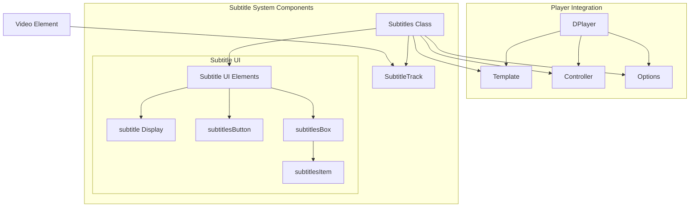
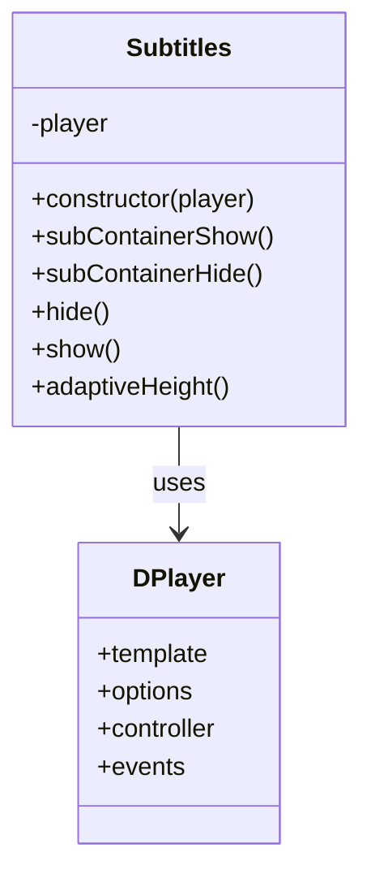
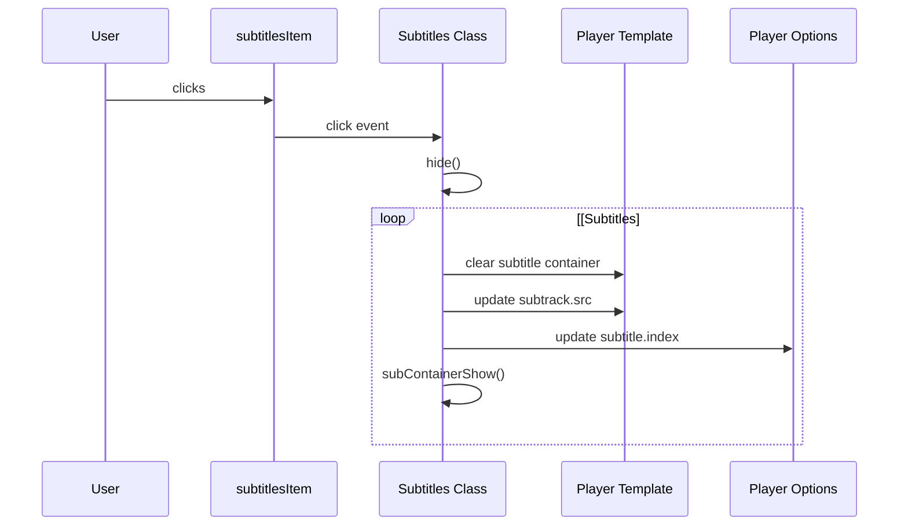
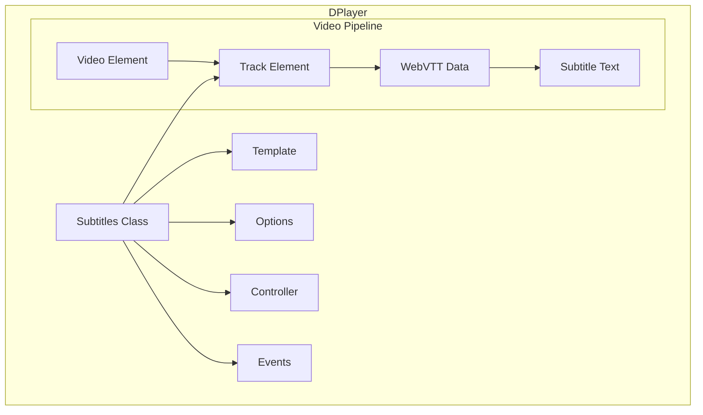

# Subtitle System

> **Relevant source files**
> * [dist/DPlayer.min.js](https://github.com/DIYgod/DPlayer/blob/f00e304c/dist/DPlayer.min.js)
> * [dist/DPlayer.min.js.map](https://github.com/DIYgod/DPlayer/blob/f00e304c/dist/DPlayer.min.js.map)
> * [src/js/subtitles.js](https://github.com/DIYgod/DPlayer/blob/f00e304c/src/js/subtitles.js)

The Subtitle System is a core feature module of DPlayer that enables the display and control of subtitles/captions for video content. This document covers the implementation, architecture, and usage of the subtitle functionality within DPlayer.

For information about the Danmaku (comment) system, see [Danmaku System](/DIYgod/DPlayer/3.1-danmaku-system).

## Overview

The Subtitle System provides functionality for displaying, toggling, and selecting subtitle tracks during video playback. It supports WebVTT format subtitles and allows users to switch between multiple subtitle tracks or turn subtitles off. The system includes both the rendering of subtitle text and the UI controls for subtitle selection.



Sources: [src/js/subtitles.js L1-L79](https://github.com/DIYgod/DPlayer/blob/f00e304c/src/js/subtitles.js#L1-L79)

## Core Components

### Subtitles Class

The `Subtitles` class is the central component that manages all subtitle-related functionality. It initializes the subtitle UI, handles subtitle selection, and controls the visibility of subtitles.

Key responsibilities:

* Managing subtitle track selection
* Showing/hiding subtitle container
* Controlling subtitle selection UI
* Handling subtitle-related events



Sources: [src/js/subtitles.js L1-L42](https://github.com/DIYgod/DPlayer/blob/f00e304c/src/js/subtitles.js#L1-L42)

 [src/js/subtitles.js L44-L77](https://github.com/DIYgod/DPlayer/blob/f00e304c/src/js/subtitles.js#L44-L77)

### Subtitle UI Components

The subtitle system uses several UI components that are defined in the player's template:

| Component | Description | Purpose |
| --- | --- | --- |
| `subtitle` | Subtitle display container | Shows the actual subtitle text |
| `subtitlesButton` | Button in control bar | Toggles subtitle selection menu |
| `subtitlesBox` | Dropdown menu | Contains available subtitle options |
| `subtitlesItem` | Menu items | Individual subtitle track options |
| `subtrack` | HTML `<track>` element | Connects to WebVTT subtitle source |
| `mask` | Overlay | Background for subtitle menu |

Sources: [src/js/subtitles.js L5-L41](https://github.com/DIYgod/DPlayer/blob/f00e304c/src/js/subtitles.js#L5-L41)

## Functionality

### Subtitle Selection

The Subtitle System allows users to select from multiple subtitle tracks or turn subtitles off. When a subtitle track is selected:

1. The subtitle container is cleared
2. The track source is updated
3. The subtitle index is stored in player options
4. The subtitle container visibility is updated



Sources: [src/js/subtitles.js L14-L41](https://github.com/DIYgod/DPlayer/blob/f00e304c/src/js/subtitles.js#L14-L41)

### Subtitle Display Toggle

The system provides methods to show and hide the subtitle container:

* `subContainerShow()`: Removes the 'dplayer-subtitle-hide' class and triggers a 'subtitle_show' event
* `subContainerHide()`: Adds the 'dplayer-subtitle-hide' class and triggers a 'subtitle_hide' event

The subtitle selection panel can also be shown and hidden:

* `show()`: Shows the subtitle selection panel
* `hide()`: Hides the subtitle selection panel

Sources: [src/js/subtitles.js L44-L64](https://github.com/DIYgod/DPlayer/blob/f00e304c/src/js/subtitles.js#L44-L64)

### Adaptive Height

The `adaptiveHeight()` method dynamically adjusts the height of the subtitle selection box based on the number of subtitles and the player size. This ensures the subtitle selection menu remains usable on various screen sizes.

The method:

1. Calculates required height based on number of subtitle options
2. Compares with available space in the video container
3. Adjusts position and maximum height accordingly

Sources: [src/js/subtitles.js L66-L76](https://github.com/DIYgod/DPlayer/blob/f00e304c/src/js/subtitles.js#L66-L76)

## Implementation Details

### Event Handling

The Subtitle System sets up several event listeners to interact with user actions:

1. Click on mask: Hides the subtitle selection panel
2. Click on subtitles button: Shows the subtitle selection panel
3. Click on subtitle item: Selects a subtitle track
4. Click on "off" option: Disables subtitles

```javascript
// Event listener for subtitle button clickthis.player.template.subtitlesButton.addEventListener('click', () => {    this.adaptiveHeight();    this.show();}); // Event listener for subtitle item clickthis.player.template.subtitlesItem[i].addEventListener('click', () => {    this.hide();    if (this.player.options.subtitle.index !== i) {        // Implementation details    }});
```

Sources: [src/js/subtitles.js L5-L41](https://github.com/DIYgod/DPlayer/blob/f00e304c/src/js/subtitles.js#L5-L41)

### CSS Classes

The Subtitle System uses CSS classes to control visibility and styling:

| CSS Class | Purpose |
| --- | --- |
| `dplayer-subtitle-hide` | Hides the subtitle text container |
| `dplayer-subtitles-box-open` | Shows the subtitle selection panel |
| `dplayer-mask-show` | Shows the background mask |

Sources: [src/js/subtitles.js L44-L64](https://github.com/DIYgod/DPlayer/blob/f00e304c/src/js/subtitles.js#L44-L64)

## Integration with DPlayer

The Subtitle System interacts with several other components of DPlayer:

1. **Template**: Accesses DOM elements for subtitle display and control
2. **Options**: Updates the subtitle configuration
3. **Controller**: Coordinates with the auto-hide behavior of controls
4. **Events**: Triggers events when subtitle state changes



Sources: [src/js/subtitles.js L1-L79](https://github.com/DIYgod/DPlayer/blob/f00e304c/src/js/subtitles.js#L1-L79)

## Configuration

The Subtitle System can be configured through the DPlayer options. The subtitle configuration accepts an object with the following properties:

| Property | Type | Description |
| --- | --- | --- |
| `url` | String or Array | URL to subtitle file(s) |
| `type` | String | Subtitle format (default: 'webvtt') |
| `fontSize` | String | Font size for subtitles |
| `bottom` | String | Bottom position offset |
| `color` | String | Text color |
| `index` | Number | Default subtitle index |

Example configuration:

```javascript
const dp = new DPlayer({    container: document.getElementById('player'),    video: {        url: 'video.mp4'    },    subtitle: {        url: 'subtitle.vtt',        type: 'webvtt',        fontSize: '25px',        bottom: '10%',        color: '#b7daff'    }});
```

Multiple subtitle tracks can be provided as an array:

```
subtitle: {    url: [        {            url: 'subtitle-en.vtt',            lang: 'en',            name: 'English'        },        {            url: 'subtitle-fr.vtt',            lang: 'fr',            name: 'Français'        }    ],    type: 'webvtt',    fontSize: '25px',    bottom: '10%'}
```

Sources: [dist/DPlayer.min.js](https://github.com/DIYgod/DPlayer/blob/f00e304c/dist/DPlayer.min.js)

## WebVTT Format Support

The Subtitle System supports the WebVTT (Web Video Text Tracks) format for subtitles. WebVTT files are plain text files with a `.vtt` extension that contain cue timings and text content.

Basic WebVTT format:

```yaml
WEBVTT

00:00:01.000 --> 00:00:04.000
This is the first subtitle

00:00:05.000 --> 00:00:09.000
This is the second subtitle
```

The DPlayer Subtitle System correctly parses and displays these subtitles at the appropriate timestamps during video playback.

Sources: [dist/DPlayer.min.js](https://github.com/DIYgod/DPlayer/blob/f00e304c/dist/DPlayer.min.js)