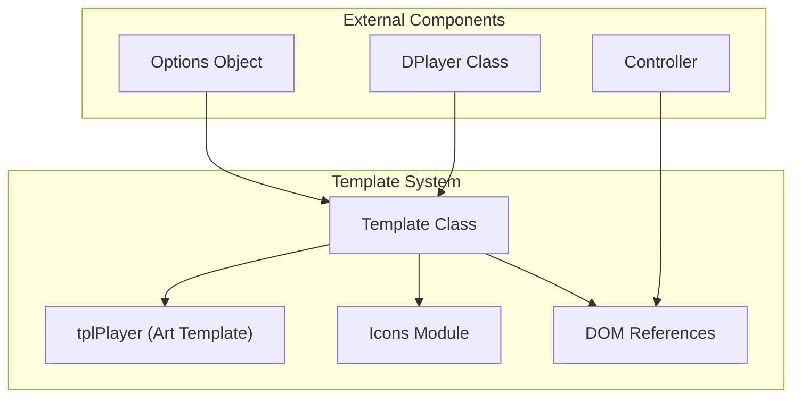
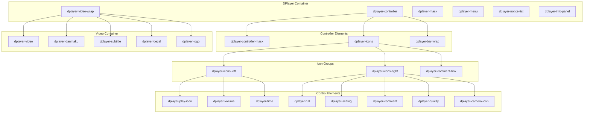
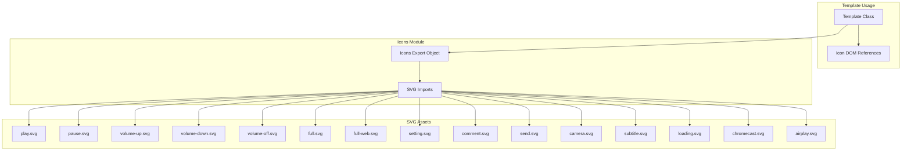
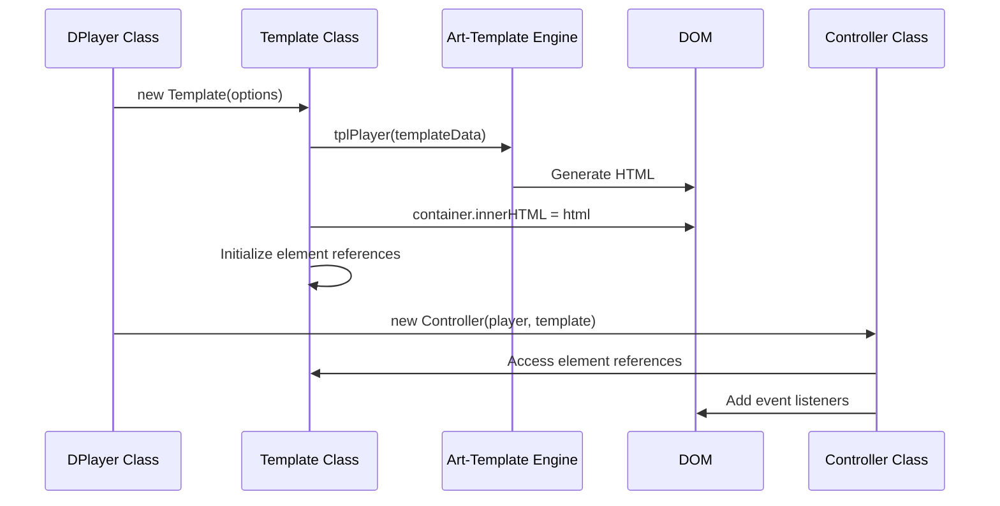

# Template and UI Components

> **Relevant source files**
> * [dist/DPlayer.min.js](https://github.com/DIYgod/DPlayer/blob/f00e304c/dist/DPlayer.min.js)
> * [dist/DPlayer.min.js.map](https://github.com/DIYgod/DPlayer/blob/f00e304c/dist/DPlayer.min.js.map)
> * [src/assets/chromecast.svg](https://github.com/DIYgod/DPlayer/blob/f00e304c/src/assets/chromecast.svg)
> * [src/js/icons.js](https://github.com/DIYgod/DPlayer/blob/f00e304c/src/js/icons.js)
> * [src/js/template.js](https://github.com/DIYgod/DPlayer/blob/f00e304c/src/js/template.js)

This page explains the template system and UI component hierarchy in DPlayer. The Template class is responsible for rendering the player's user interface and maintaining references to all UI elements. For information about handling user interactions with these UI components, see [Controller System](/DIYgod/DPlayer/2.3-controller-system).

## Overview

The Template system creates the player's DOM structure based on configuration options. It uses the art-template engine to render the UI and then provides references to UI elements for the Controller and other components to manipulate.



Sources:

* [src/js/template.js L1-L121](https://github.com/DIYgod/DPlayer/blob/f00e304c/src/js/template.js#L1-L121)
* [src/js/icons.js L1-L42](https://github.com/DIYgod/DPlayer/blob/f00e304c/src/js/icons.js#L1-L42)

## Template Class

The Template class is responsible for rendering the player's UI and providing references to DOM elements.

### Initialization

The Template class is initialized with:

* A container element to render the player into
* Options for configuring the player
* An index for identifying the player instance
* A translation function for internationalization

```
constructor(options) {    this.container = options.container;    this.options = options.options;    this.index = options.index;    this.tran = options.tran;    this.init();}
```

Sources:

* [src/js/template.js L5-L12](https://github.com/DIYgod/DPlayer/blob/f00e304c/src/js/template.js#L5-L12)

### Template Rendering

The `init()` method renders the player template into the container element using the art-template engine through the `tplPlayer` function:

```
init() {    this.container.innerHTML = tplPlayer({        options: this.options,        index: this.index,        tran: this.tran,        icons: Icons,        mobile: utils.isMobile,        video: {            current: true,            pic: this.options.video.pic,            screenshot: this.options.screenshot,            airplay: utils.isSafari && !utils.isChrome ? this.options.airplay : false,            chromecast: this.options.chromecast,            preload: this.options.preload,            url: this.options.video.url,            subtitle: this.options.subtitle,        },    });        // Initialize UI component references...}
```

After rendering, the method initializes references to all UI elements by querying the DOM. These references are stored as properties of the Template instance for use by other components.

Sources:

* [src/js/template.js L14-L107](https://github.com/DIYgod/DPlayer/blob/f00e304c/src/js/template.js#L14-L107)

### Utility Methods

The Template class provides a static method for creating notification elements:

```javascript
static NewNotice(text, opacity, id) {    const notice = document.createElement('div');    notice.classList.add('dplayer-notice');    notice.style.opacity = opacity;    notice.innerText = text;    if (id) {        notice.id = `dplayer-notice-${id}`;    }    return notice;}
```

Sources:

* [src/js/template.js L109-L118](https://github.com/DIYgod/DPlayer/blob/f00e304c/src/js/template.js#L109-L118)

## UI Component Hierarchy

DPlayer's UI structure follows a hierarchical pattern with nested components. The main components and their relationships are shown in the diagram below:



Sources:

* [src/js/template.js L33-L106](https://github.com/DIYgod/DPlayer/blob/f00e304c/src/js/template.js#L33-L106)
* [dist/DPlayer.min.js L1](https://github.com/DIYgod/DPlayer/blob/f00e304c/dist/DPlayer.min.js#L1-L1)

## Component Reference Initialization

After rendering the template, the Template class initializes references to all UI components. These references are used by the Controller and other components to manipulate the UI.

The Template class stores references to over 60 UI elements as properties of the Template instance. Below is a table of some key component references:

| Property Name | Element Selector | Description |
| --- | --- | --- |
| `video` | `.dplayer-video-current` | The main video element |
| `playButton` | `.dplayer-play-icon` | Play/pause button |
| `volumeBar` | `.dplayer-volume-bar-inner` | Volume control bar |
| `playedBar` | `.dplayer-played` | Playback progress bar |
| `danmaku` | `.dplayer-danmaku` | Danmaku container |
| `controller` | `.dplayer-controller` | Control panel container |
| `settingBox` | `.dplayer-setting-box` | Settings menu |
| `menu` | `.dplayer-menu` | Context menu |
| `infoPanel` | `.dplayer-info-panel` | Information panel |

Sources:

* [src/js/template.js L33-L106](https://github.com/DIYgod/DPlayer/blob/f00e304c/src/js/template.js#L33-L106)

## Icons System

DPlayer uses SVG icons for various UI elements. The icons are defined in the `Icons` module and imported into the Template class.



The Icons module exports an object containing all the SVG icons. These icons are then passed to the template renderer and used in the UI.

Sources:

* [src/js/icons.js L1-L42](https://github.com/DIYgod/DPlayer/blob/f00e304c/src/js/icons.js#L1-L42)
* [src/assets/chromecast.svg L1](https://github.com/DIYgod/DPlayer/blob/f00e304c/src/assets/chromecast.svg#L1-L1)

## Template Rendering Process

The template rendering process involves several steps:

1. The DPlayer class initializes the Template class with options
2. The Template class renders the UI using the art-template engine
3. The Template class initializes references to all UI elements
4. The Controller class is initialized with the Template instance
5. The Controller uses the Template's element references to set up event handlers



Sources:

* [src/js/template.js L14-L31](https://github.com/DIYgod/DPlayer/blob/f00e304c/src/js/template.js#L14-L31)

## Notices and Notifications

The Template class provides a static method `NewNotice` for creating notification elements that can be displayed to the user.

```javascript
static NewNotice(text, opacity, id) {    const notice = document.createElement('div');    notice.classList.add('dplayer-notice');    notice.style.opacity = opacity;    notice.innerText = text;    if (id) {        notice.id = `dplayer-notice-${id}`;    }    return notice;}
```

These notices are added to the `noticeList` element in the DOM and are typically used to display messages to the user, such as error messages or information about the player's status.

Sources:

* [src/js/template.js L109-L118](https://github.com/DIYgod/DPlayer/blob/f00e304c/src/js/template.js#L109-L118)

## Conclusion

The Template and UI Components form the foundation of DPlayer's user interface. The Template class is responsible for rendering the player UI and providing references to all UI elements, while the Controller class (covered in [Controller System](/DIYgod/DPlayer/2.3-controller-system)) uses these references to handle user interactions.

The UI follows a hierarchical structure with clear organization of components, making it easy to understand and maintain. The use of art-template for rendering and the Icons module for SVG icons provides a clean separation of concerns and makes the code more maintainable.