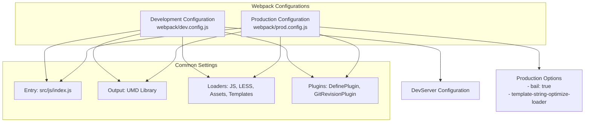
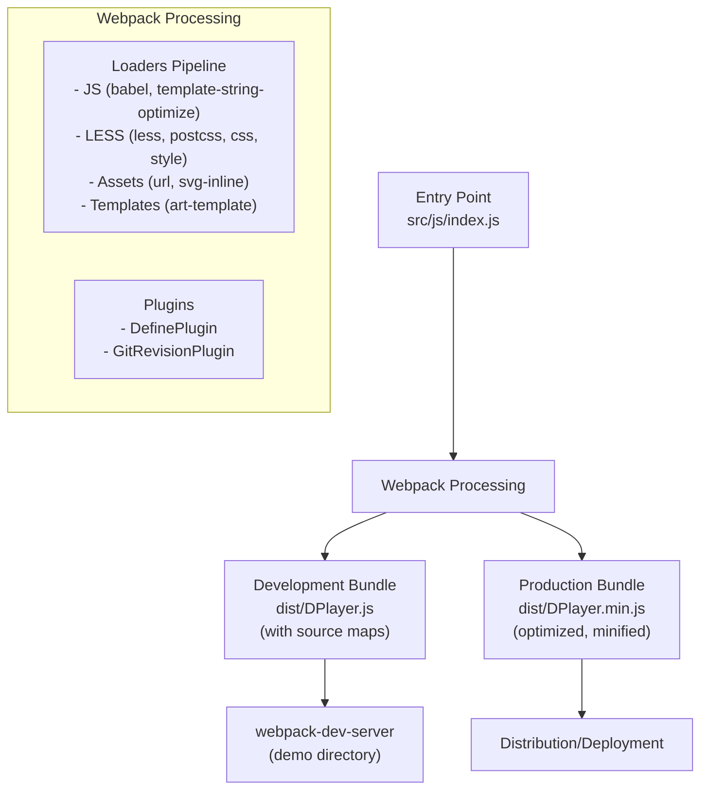

# Webpack Configuration

> **Relevant source files**
> * [.husky/pre-commit](https://github.com/DIYgod/DPlayer/blob/f00e304c/.husky/pre-commit)
> * [.prettierignore](https://github.com/DIYgod/DPlayer/blob/f00e304c/.prettierignore)
> * [.prettierrc](https://github.com/DIYgod/DPlayer/blob/f00e304c/.prettierrc)
> * [pnpm-lock.yaml](https://github.com/DIYgod/DPlayer/blob/f00e304c/pnpm-lock.yaml)
> * [webpack/dev.config.js](https://github.com/DIYgod/DPlayer/blob/f00e304c/webpack/dev.config.js)
> * [webpack/prod.config.js](https://github.com/DIYgod/DPlayer/blob/f00e304c/webpack/prod.config.js)

This document provides a detailed overview of the webpack configuration used in the DPlayer project. It covers both development and production build configurations, loaders, plugins, and the overall build process.

## Overview

DPlayer uses webpack as its primary build tool to bundle, transpile, and optimize source code. The webpack configuration is split between development and production environments to optimize for different use cases:

* Development configuration prioritizes debugging and rapid iteration
* Production configuration prioritizes optimization and minimization

Both configurations share common patterns but differ in specific optimizations.

Sources: [webpack/dev.config.js L1-L108](https://github.com/DIYgod/DPlayer/blob/f00e304c/webpack/dev.config.js#L1-L108)

 [webpack/prod.config.js L1-L99](https://github.com/DIYgod/DPlayer/blob/f00e304c/webpack/prod.config.js#L1-L99)

## Configuration Structure

DPlayer maintains separate webpack configuration files for development and production builds:



Sources: [webpack/dev.config.js L6-L108](https://github.com/DIYgod/DPlayer/blob/f00e304c/webpack/dev.config.js#L6-L108)

 [webpack/prod.config.js L6-L99](https://github.com/DIYgod/DPlayer/blob/f00e304c/webpack/prod.config.js#L6-L99)

## Entry and Output Configuration

### Entry Point

Both configurations use the same entry point:

```
entry: {    DPlayer: './src/js/index.js',},
```

This specifies that the DPlayer bundle starts from the `index.js` file in the `src/js` directory.

### Output Configuration

The output configuration defines how the bundled files are generated:

| Configuration | Development | Production |
| --- | --- | --- |
| Filename | `DPlayer.js` | `DPlayer.min.js` |
| Library type | UMD | UMD |
| Library export | default | default |
| Source maps | cheap-module-source-map | source-map |

Both configurations export the bundle as a Universal Module Definition (UMD) library, which makes it compatible with various module systems:

```
output: {    path: path.resolve(__dirname, '..', 'dist'),    filename: '[name].min.js', // or [name].js for development    library: '[name]',    libraryTarget: 'umd',    libraryExport: 'default',    umdNamedDefine: true,    publicPath: '/',},
```

This configuration allows DPlayer to be:

* Imported as a module in Node.js/CommonJS environments
* Imported using AMD loaders like RequireJS
* Used directly in the browser as a global variable

Sources: [webpack/dev.config.js L11-L23](https://github.com/DIYgod/DPlayer/blob/f00e304c/webpack/dev.config.js#L11-L23)

 [webpack/prod.config.js L13-L25](https://github.com/DIYgod/DPlayer/blob/f00e304c/webpack/prod.config.js#L13-L25)

## Module Resolution and Loaders

### Resolve Configuration

Both configurations use identical resolve settings:

```
resolve: {    modules: ['node_modules'],    extensions: ['.js', '.less'],    fallback: {        dgram: false,        fs: false,        net: false,        tls: false,    },},
```

This configuration:

* Looks for modules in `node_modules`
* Automatically resolves `.js` and `.less` file extensions
* Disables Node.js core modules in the browser environment

### Loaders Configuration

The following diagram shows the loader processing pipeline for different file types:

```mermaid
flowchart TD

ArtTemplates["ART Template Files"]
ArtTemplateLoader["art-template-loader"]
CompiledTemplates["Compiled Templates"]
ImageFiles["PNG/JPG Files"]
URLLoader["url-loader<br>(limit: 40000)"]
ImageOutput["Base64/URLs"]
SVGFiles["SVG Files"]
SVGInlineLoader["svg-inline-loader"]
SVGOutput["Inline SVG"]
LessFiles["LESS Files"]
LessLoader["less-loader"]
PostCSSLoader["postcss-loader<br>(postcss-preset-env)"]
CSSLoader["css-loader"]
StyleLoader["style-loader"]
CSSOutput["Processed CSS"]
JSFiles["JS Files"]
BabelLoader["babel-loader<br>(transpilation)"]
JSOutput["Transpiled JS"]
TSOptimizer["template-string-optimize-loader"]

subgraph subGraph3 ["Templates Processing"]
    ArtTemplates
    ArtTemplateLoader
    CompiledTemplates
    ArtTemplates --> ArtTemplateLoader
    ArtTemplateLoader --> CompiledTemplates
end

subgraph subGraph2 ["Assets Processing"]
    ImageFiles
    URLLoader
    ImageOutput
    SVGFiles
    SVGInlineLoader
    SVGOutput
    ImageFiles --> URLLoader
    URLLoader --> ImageOutput
    SVGFiles --> SVGInlineLoader
    SVGInlineLoader --> SVGOutput
end

subgraph subGraph1 ["Styles Processing"]
    LessFiles
    LessLoader
    PostCSSLoader
    CSSLoader
    StyleLoader
    CSSOutput
    LessFiles --> LessLoader
    LessLoader --> PostCSSLoader
    PostCSSLoader --> CSSLoader
    CSSLoader --> StyleLoader
    StyleLoader --> CSSOutput
end

subgraph subGraph0 ["JavaScript Processing"]
    JSFiles
    BabelLoader
    JSOutput
    TSOptimizer
    JSFiles --> BabelLoader
    BabelLoader --> JSOutput
    JSFiles --> TSOptimizer
    TSOptimizer --> BabelLoader
end
```



Key loaders include:

#### JavaScript Processing

Both configurations use Babel to transpile JavaScript with `@babel/preset-env`. Production adds template string optimization:

```
// Production JavaScript processing{    test: /\.js$/,    use: [        'template-string-optimize-loader',        {            loader: 'babel-loader',            options: {                cacheDirectory: true,                presets: ['@babel/preset-env'],            },        },    ],}
```

#### Styles Processing

LESS files are processed with a chain of loaders:

```
{    test: /\.less$/,    use: [        'style-loader',        {            loader: 'css-loader',            options: {                importLoaders: 1,            },        },        {            loader: 'postcss-loader',            options: {                postcssOptions: {                    plugins: ['postcss-preset-env'],                },            },        },        'less-loader',    ],}
```

This processes LESS files through:

1. `less-loader` - Compiles LESS to CSS
2. `postcss-loader` - Adds vendor prefixes and modern CSS features
3. `css-loader` - Resolves CSS imports and modules
4. `style-loader` - Injects styles into the DOM

#### Asset Processing

Images and SVG files are handled by dedicated loaders:

```
{    test: /\.(png|jpg)$/,    loader: 'url-loader',    options: {        limit: 40000, // Convert images < 40kb to base64    },},{    test: /\.svg$/,    loader: 'svg-inline-loader',}
```

#### Template Processing

Art templates use a specific loader:

```
{    test: /\.art$/,    loader: 'art-template-loader',}
```

Sources: [webpack/dev.config.js L36-L87](https://github.com/DIYgod/DPlayer/blob/f00e304c/webpack/dev.config.js#L36-L87)

 [webpack/prod.config.js L38-L91](https://github.com/DIYgod/DPlayer/blob/f00e304c/webpack/prod.config.js#L38-L91)

## Development Server Configuration

The development configuration includes webpack-dev-server settings:

```
devServer: {    static: {        directory: path.join(__dirname, '..', 'demo'),    },    compress: true,    open: true,},
```

This configuration:

* Serves static files from the `demo` directory
* Enables gzip compression for faster loading
* Automatically opens the browser when the server starts

Sources: [webpack/dev.config.js L90-L96](https://github.com/DIYgod/DPlayer/blob/f00e304c/webpack/dev.config.js#L90-L96)

## Plugins and Optimizations

### Common Plugins

Both configurations use webpack.DefinePlugin to inject constants:

```javascript
plugins: [    new webpack.DefinePlugin({        DPLAYER_VERSION: `"${require('../package.json').version}"`,        GIT_HASH: JSON.stringify(gitRevisionPlugin.version()),    }),],
```

This makes the following constants available in the code:

* `DPLAYER_VERSION`: The version from package.json
* `GIT_HASH`: The current git commit hash via GitRevisionPlugin

### Environment-specific Settings

| Setting | Development | Production |
| --- | --- | --- |
| `mode` | development | production |
| `bail` | Not set (false) | true (exit on first error) |
| `devtool` | cheap-module-source-map | source-map |
| Performance hints | Disabled | Not specified (enabled) |

Sources: [webpack/dev.config.js L98-L107](https://github.com/DIYgod/DPlayer/blob/f00e304c/webpack/dev.config.js#L98-L107)

 [webpack/prod.config.js L93-L98](https://github.com/DIYgod/DPlayer/blob/f00e304c/webpack/prod.config.js#L93-L98)

## Build Process Flow

The following diagram illustrates the overall build process flow:



Sources: [webpack/dev.config.js L1-L108](https://github.com/DIYgod/DPlayer/blob/f00e304c/webpack/dev.config.js#L1-L108)

 [webpack/prod.config.js L1-L99](https://github.com/DIYgod/DPlayer/blob/f00e304c/webpack/prod.config.js#L1-L99)

## Development Workflow Integration

The webpack configuration is integrated with the development workflow through:

* Husky pre-commit hooks that run lint-staged before commits
* Prettier configuration for consistent code formatting

```
// .husky/pre-commit#!/usr/bin/env sh. "$(dirname -- "$0")/_/husky.sh" pnpm exec lint-staged
```

This ensures code quality by running linters and formatters on staged files before committing.

Sources: [.husky/pre-commit L1-L4](https://github.com/DIYgod/DPlayer/blob/f00e304c/.husky/pre-commit#L1-L4)

 [.prettierrc L1-L7](https://github.com/DIYgod/DPlayer/blob/f00e304c/.prettierrc#L1-L7)

 [.prettierignore L1-L2](https://github.com/DIYgod/DPlayer/blob/f00e304c/.prettierignore#L1-L2)

## Related Wiki Pages

* For information about the general build system, see [Build System](/DIYgod/DPlayer/4-build-system)
* For details about the development workflow, see [Development Workflow](/DIYgod/DPlayer/4.2-development-workflow)