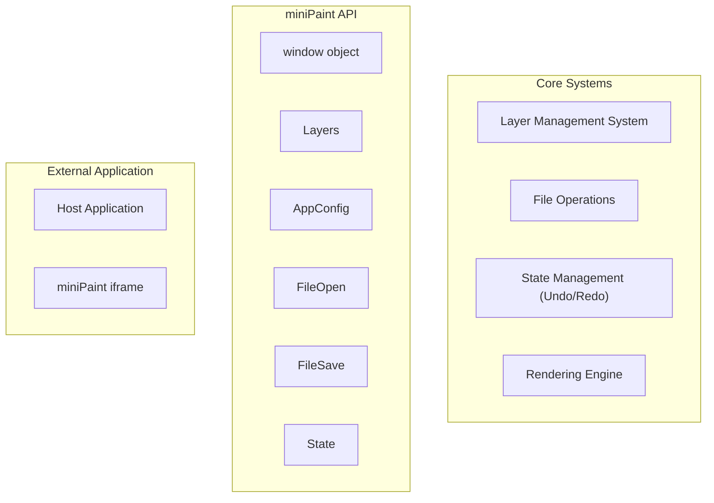
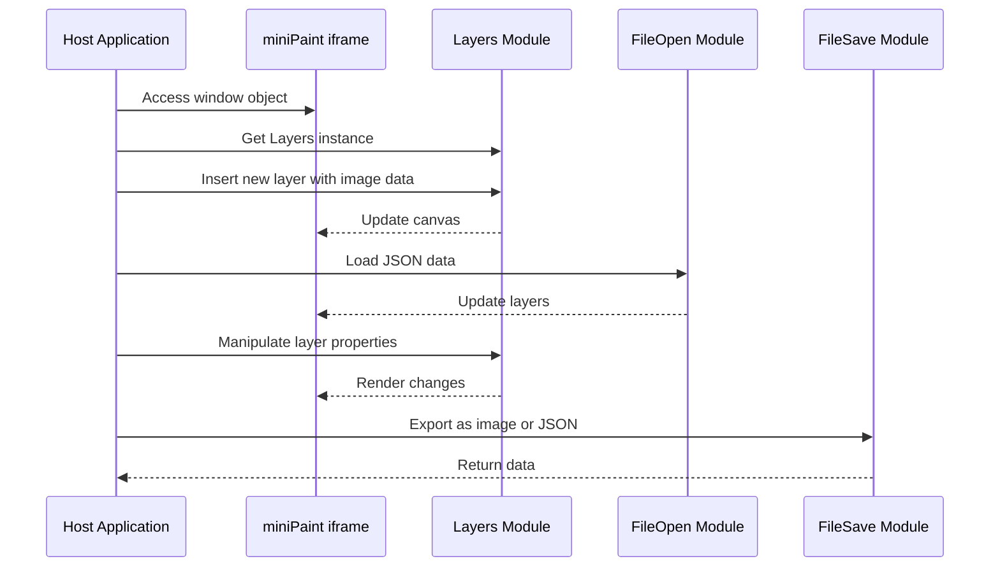

# Advanced Topics

> **Relevant source files**
> * [examples/add-edit-imgData.html](https://github.com/viliusle/miniPaint/blob/6d0b95e5/examples/add-edit-imgData.html)
> * [examples/open-edit-save.html](https://github.com/viliusle/miniPaint/blob/6d0b95e5/examples/open-edit-save.html)
> * [examples/zoom.html](https://github.com/viliusle/miniPaint/blob/6d0b95e5/examples/zoom.html)
> * [src/js/languages/de.json](https://github.com/viliusle/miniPaint/blob/6d0b95e5/src/js/languages/de.json)
> * [src/js/languages/es.json](https://github.com/viliusle/miniPaint/blob/6d0b95e5/src/js/languages/es.json)
> * [src/js/languages/fr.json](https://github.com/viliusle/miniPaint/blob/6d0b95e5/src/js/languages/fr.json)
> * [src/js/languages/it.json](https://github.com/viliusle/miniPaint/blob/6d0b95e5/src/js/languages/it.json)
> * [src/js/languages/ja.json](https://github.com/viliusle/miniPaint/blob/6d0b95e5/src/js/languages/ja.json)
> * [src/js/languages/ko.json](https://github.com/viliusle/miniPaint/blob/6d0b95e5/src/js/languages/ko.json)
> * [src/js/languages/lt.json](https://github.com/viliusle/miniPaint/blob/6d0b95e5/src/js/languages/lt.json)
> * [src/js/languages/pt.json](https://github.com/viliusle/miniPaint/blob/6d0b95e5/src/js/languages/pt.json)
> * [src/js/languages/ru.json](https://github.com/viliusle/miniPaint/blob/6d0b95e5/src/js/languages/ru.json)
> * [src/js/languages/tr.json](https://github.com/viliusle/miniPaint/blob/6d0b95e5/src/js/languages/tr.json)
> * [src/js/main.js](https://github.com/viliusle/miniPaint/blob/6d0b95e5/src/js/main.js)

This section covers advanced aspects of miniPaint for developers and power users who want to extend, customize, or integrate the application into their own projects. For information about basic usage of miniPaint, see [Overview](/viliusle/miniPaint/1-overview).

## Localization

miniPaint provides a robust internationalization system that allows the user interface to be translated into different languages. Currently, the application supports multiple languages including Russian, Japanese, German, Spanish, Portuguese, and more.

### Translation System Architecture

Title: miniPaint Translation System

```mermaid
flowchart TD

mermaid-89suyn17xpp-flowchart-UI["User Interface"]
mermaid-89suyn17xpp-flowchart-LangSelect["Language Selection"]
mermaid-89suyn17xpp-flowchart-TransModule["Translation System"]
mermaid-89suyn17xpp-flowchart-LangFiles["Language JSON Files"]
mermaid-89suyn17xpp-flowchart-en["en.json (English)"]
mermaid-89suyn17xpp-flowchart-ru["ru.json (Russian)"]
mermaid-89suyn17xpp-flowchart-ja["ja.json (Japanese)"]
mermaid-89suyn17xpp-flowchart-others["Other Languages..."]
mermaid-89suyn17xpp-flowchart-TransText["Translated UI Text"]
```



Sources: src/js/languages/ru.json, src/js/languages/ja.json, src/js/languages/pt.json, src/js/languages/de.json

### Language File Structure

Each language is defined in a JSON file located in the `src/js/languages/` directory. These files follow a simple key-value structure where the keys are English strings and the values are their translations:

```json
{    "About": "О проекте",    "Active": "Активный",    "All": "Все",    "Alpha": "Альфа"}
```

### Adding a New Language

To add support for a new language:

1. Create a new JSON file in the `src/js/languages/` directory (e.g., `new-language.json`)
2. Copy the structure from an existing language file like `en.json`
3. Translate all values to the new language
4. Update the language selection component to include the new option

The language files are comprehensive, containing translations for all UI elements, error messages, and tooltips throughout the application.

Sources: src/js/languages/ru.json, src/js/languages/ja.json, src/js/languages/pt.json, src/js/languages/de.json

## API Usage

miniPaint provides a JavaScript API that enables programmatic control and integration with other applications. This allows developers to embed miniPaint into their own websites or web applications and control it through JavaScript.

### Embedding miniPaint

The most common way to use miniPaint programmatically is to embed it in an iframe:

```xml
<iframe id="myFrame" style="width:100%;height:70vh;border:0;" src="path/to/miniPaint" allow="camera"></iframe>
```

Once embedded, you can access the miniPaint API through the iframe's window object:

```javascript
var Layers = document.getElementById('myFrame').contentWindow.Layers;var AppConfig = document.getElementById('myFrame').contentWindow.AppConfig;var FileOpen = document.getElementById('myFrame').contentWindow.FileOpen;var FileSave = document.getElementById('myFrame').contentWindow.FileSave;
```

### Core API Objects

The main API objects exposed by miniPaint are:

| Object | Description | Example Methods |
| --- | --- | --- |
| `Layers` | Manages image layers | `insert()`, `delete()`, `convert_layers_to_canvas()` |
| `AppConfig` | Configuration settings | Various properties for app settings |
| `FileOpen` | Handles file opening | `load_json()`, `load_image()` |
| `FileSave` | Handles file saving | `export_as_json()`, `export_as_image()` |
| `State` | State management | Handles undo/redo operations |

These objects are initialized in [src/js/main.js L27-L45](https://github.com/viliusle/miniPaint/blob/6d0b95e5/src/js/main.js#L27-L45)

 and registered as globals for external access.

### API Architecture

Title: miniPaint External API Architecture



Sources: src/js/main.js, examples/open-edit-save.html

### API Usage Examples

#### Opening an Image

The following example demonstrates how to open an image in miniPaint programmatically:

```javascript
function open_image(image) {    var Layers = document.getElementById('myFrame').contentWindow.Layers;    var new_layer = {        name: image.src.replace(/^.*[\\\/]/, ''),        type: 'image',        data: image,        width: image.naturalWidth || image.width,        height: image.naturalHeight || image.height,        width_original: image.naturalWidth || image.width,        height_original: image.naturalHeight || image.height,    };    Layers.insert(new_layer);}
```

#### Opening a JSON File

miniPaint can load project files stored in JSON format:

```javascript
function open_json() {    var miniPaint = document.getElementById('myFrame').contentWindow;    var miniPaint_FileOpen = miniPaint.FileOpen;     window.fetch("path/to/file.json").then(function(response) {        return response.json();    }).then(function(json) {        miniPaint_FileOpen.load_json(json, false);    });}
```

#### Saving an Image

To extract the canvas content as an image:

```javascript
function save_image() {    var Layers = document.getElementById('myFrame').contentWindow.Layers;    var tempCanvas = document.createElement("canvas");    var tempCtx = tempCanvas.getContext("2d");    var dim = Layers.get_dimensions();    tempCanvas.width = dim.width;    tempCanvas.height = dim.height;    Layers.convert_layers_to_canvas(tempCtx);        // Get data URL    var dataURL = tempCanvas.toDataURL("image/png");        // Or get a Blob    tempCanvas.toBlob(function(blob) {        // Use the blob        console.log(blob);    }, 'image/png');}
```

#### Controlling Zoom and View

You can programmatically control the zoom level and view position:

```javascript
// Set canvas sizeLayers.Base_gui.set_size(800, 600); // Zoom to specific level (percentage)Layers.Base_gui.GUI_preview.zoom(500); // 500% // Move visible area to specific positionLayers.Base_gui.GUI_preview.zoom_to_position(x, y); // Get visible area dimensionsvar visibleArea = Layers.Base_gui.get_visible_area_size();
```

Sources: examples/open-edit-save.html, examples/zoom.html

### API Interaction Flow

Title: miniPaint API Interaction Sequence



Sources: examples/open-edit-save.html, examples/add-edit-imgData.html

## Building and Deployment

This section covers how to build and deploy miniPaint for production or development purposes.

### Project Structure

The miniPaint project has a modular architecture organized into various components:

```
miniPaint/
├── src/
│   ├── css/         - Stylesheets
│   ├── js/          - JavaScript source
│   │   ├── actions/ - Actions for state management
│   │   ├── core/    - Core functionality classes
│   │   ├── languages/ - Translation files
│   │   ├── modules/ - Feature modules
│   │   ├── tools/   - Drawing and editing tools
│   │   ├── app.js   - Application singleton
│   │   ├── config.js - Configuration
│   │   └── main.js  - Entry point
├── examples/        - API usage examples
└── index.html       - Main HTML file
```

### Application Initialization Flow

Title: miniPaint Initialization Process

```mermaid
flowchart TD

mermaid-mz80p7j6uet-flowchart-WindowLoad["Window Load Event"]
mermaid-mz80p7j6uet-flowchart-InitApp["Initialize Application"]
mermaid-mz80p7j6uet-flowchart-CreateLayers["Initialize Layers"]
mermaid-mz80p7j6uet-flowchart-CreateTools["Initialize Tools"]
mermaid-mz80p7j6uet-flowchart-CreateGUI["Initialize GUI"]
mermaid-mz80p7j6uet-flowchart-CreateState["Initialize State"]
mermaid-mz80p7j6uet-flowchart-CreateFileOps["Initialize File Operations"]
mermaid-mz80p7j6uet-flowchart-RegisterModules["Register Modules in app"]
mermaid-mz80p7j6uet-flowchart-ExposeGlobals["Expose Global Objects"]
mermaid-mz80p7j6uet-flowchart-RenderUI["Render User Interface"]
mermaid-mz80p7j6uet-flowchart-Layers["Layers"]
mermaid-mz80p7j6uet-flowchart-Tools["Tools"]
mermaid-mz80p7j6uet-flowchart-GUI["GUI"]
mermaid-mz80p7j6uet-flowchart-State["State"]
mermaid-mz80p7j6uet-flowchart-FileOpen["FileOpen"]
mermaid-mz80p7j6uet-flowchart-FileSave["FileSave"]
```



Sources: src/js/main.js

### Deployment Options

miniPaint can be deployed in several ways:

1. **Static Web Server**: Deploy the built files to any web server
2. **CDN (Content Delivery Network)**: Distribute the static files through a CDN for better performance
3. **Embedding**: Include miniPaint in another web application via iframe

### Self-Hosting Process

To self-host miniPaint:

1. Clone the repository: `git clone https://github.com/viliusle/miniPaint.git`
2. Install dependencies (if needed)
3. Build the project (if needed)
4. Serve the files using a web server
5. Access the application through a web browser

This approach allows for customizations and extensions to the base application.

Sources: examples/open-edit-save.html, examples/zoom.html

## Custom Integration Examples

The examples directory contains several sample implementations showing how to integrate miniPaint into your own applications:

1. **Basic embed**: Simple iframe embedding of miniPaint
2. **Open, edit, save**: Load images into miniPaint, edit them, and save the results
3. **Programmatic zoom**: Control zoom level and view position programmatically
4. **Image data manipulation**: Add and edit image data directly

These examples demonstrate the flexibility of the miniPaint API for various integration scenarios.

Sources: examples/open-edit-save.html, examples/zoom.html, examples/add-edit-imgData.html