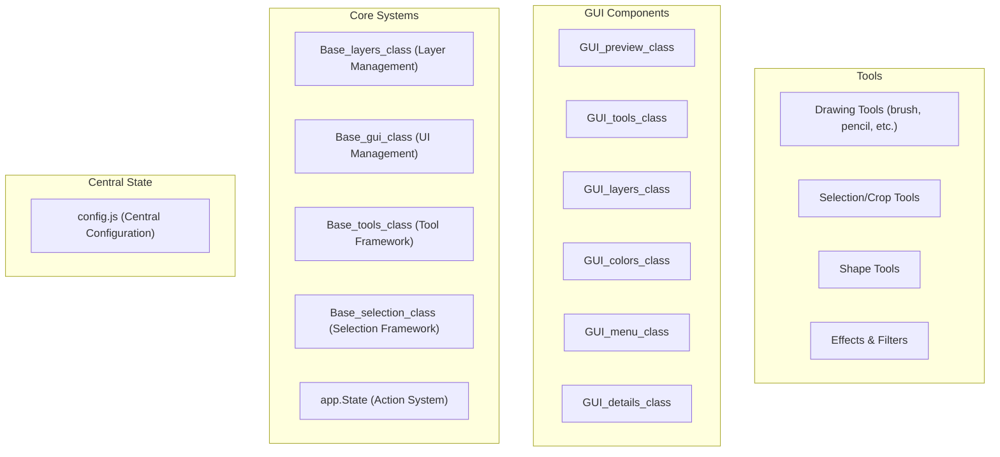
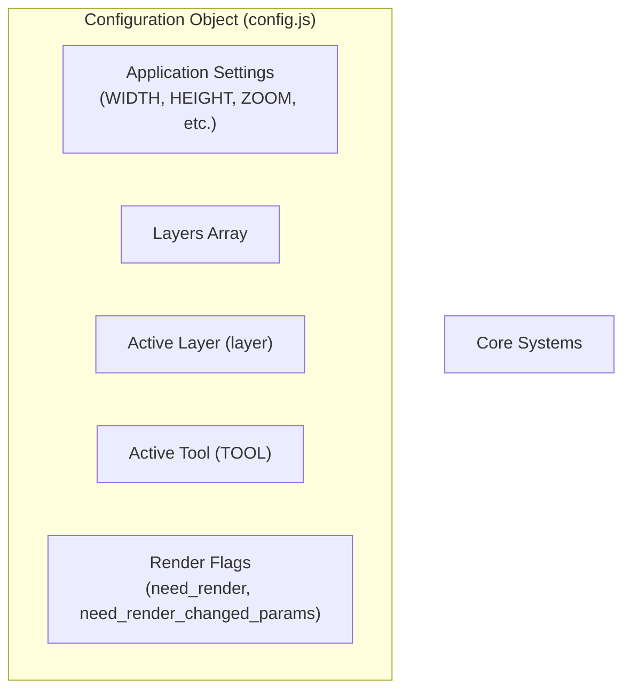
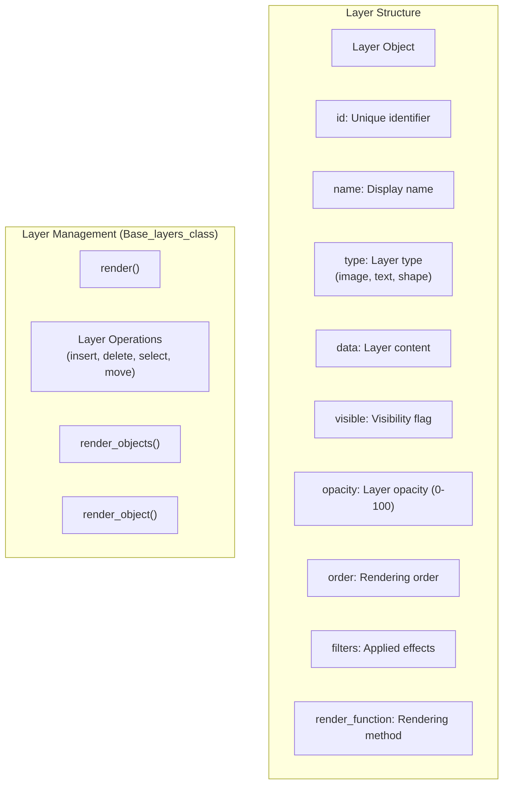
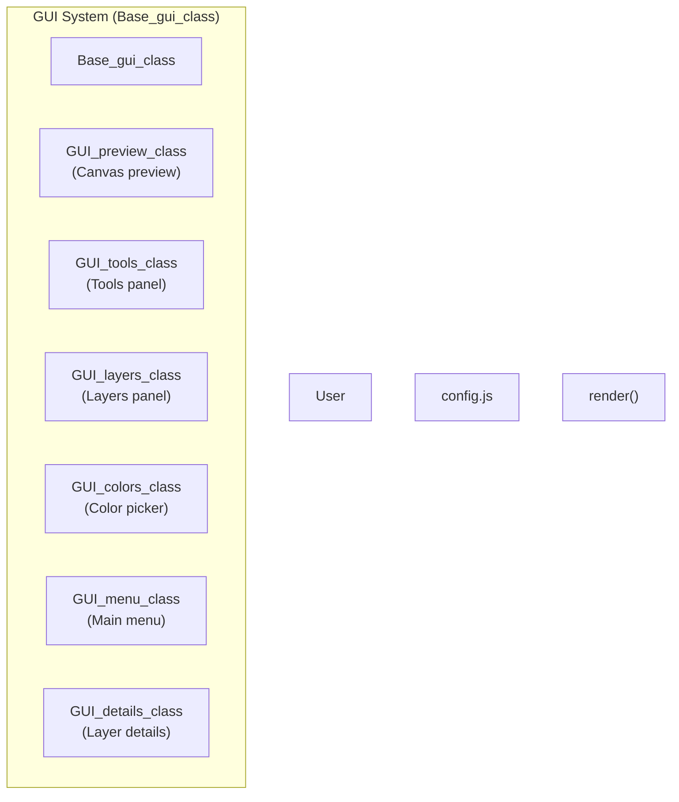
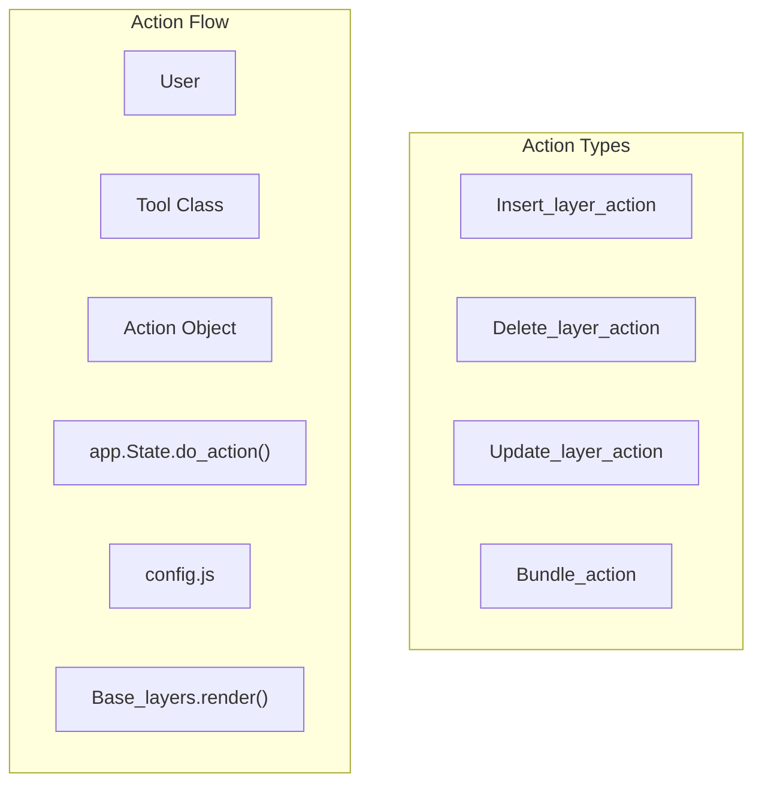
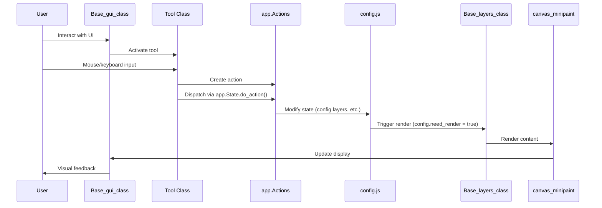

# Architecture

> **Relevant source files**
> * [dist/bundle.js](https://github.com/viliusle/miniPaint/blob/6d0b95e5/dist/bundle.js)
> * [dist/bundle.js.LICENSE.txt](https://github.com/viliusle/miniPaint/blob/6d0b95e5/dist/bundle.js.LICENSE.txt)
> * [dist/bundle.js.map](https://github.com/viliusle/miniPaint/blob/6d0b95e5/dist/bundle.js.map)
> * [images/test-collection.json](https://github.com/viliusle/miniPaint/blob/6d0b95e5/images/test-collection.json)
> * [manifest-disabled.json](https://github.com/viliusle/miniPaint/blob/6d0b95e5/manifest-disabled.json)
> * [package-lock.json](https://github.com/viliusle/miniPaint/blob/6d0b95e5/package-lock.json)
> * [package.json](https://github.com/viliusle/miniPaint/blob/6d0b95e5/package.json)
> * [src/css/layout.css](https://github.com/viliusle/miniPaint/blob/6d0b95e5/src/css/layout.css)
> * [src/js/config-menu.js](https://github.com/viliusle/miniPaint/blob/6d0b95e5/src/js/config-menu.js)
> * [src/js/config.js](https://github.com/viliusle/miniPaint/blob/6d0b95e5/src/js/config.js)
> * [src/js/core/base-gui.js](https://github.com/viliusle/miniPaint/blob/6d0b95e5/src/js/core/base-gui.js)
> * [src/js/core/base-layers.js](https://github.com/viliusle/miniPaint/blob/6d0b95e5/src/js/core/base-layers.js)
> * [src/js/core/gui/gui-preview.js](https://github.com/viliusle/miniPaint/blob/6d0b95e5/src/js/core/gui/gui-preview.js)
> * [src/js/modules/file/open.js](https://github.com/viliusle/miniPaint/blob/6d0b95e5/src/js/modules/file/open.js)
> * [src/js/modules/image/palette.js](https://github.com/viliusle/miniPaint/blob/6d0b95e5/src/js/modules/image/palette.js)
> * [src/js/tools/pick_color.js](https://github.com/viliusle/miniPaint/blob/6d0b95e5/src/js/tools/pick_color.js)
> * [src/js/tools/shapes/bezier_curve.js](https://github.com/viliusle/miniPaint/blob/6d0b95e5/src/js/tools/shapes/bezier_curve.js)
> * [src/js/tools/shapes/polygon.js](https://github.com/viliusle/miniPaint/blob/6d0b95e5/src/js/tools/shapes/polygon.js)
> * [webpack.config.js](https://github.com/viliusle/miniPaint/blob/6d0b95e5/webpack.config.js)

This document describes the high-level architecture of miniPaint, explaining the core components and their interactions. It provides developers with a technical understanding of how the image editing system is designed and how data flows through the application.

## Core Architectural Components

miniPaint follows a component-based architecture built around a central configuration object. The system consists of several key components, each with specific responsibilities.



Sources: [src/js/config.js L1-L512](https://github.com/viliusle/miniPaint/blob/6d0b95e5/src/js/config.js#L1-L512)

 [src/js/core/base-layers.js L1-L36](https://github.com/viliusle/miniPaint/blob/6d0b95e5/src/js/core/base-layers.js#L1-L36)

 [src/js/core/base-gui.js L1-L26](https://github.com/viliusle/miniPaint/blob/6d0b95e5/src/js/core/base-gui.js#L1-L26)

### Configuration System

The heart of miniPaint is the centralized configuration system in `config.js`. It serves as a shared state repository for the entire application, managing everything from canvas dimensions to active tools and layers.

Key properties in the configuration object include:

* `WIDTH` and `HEIGHT`: Canvas dimensions
* `ZOOM`: Current zoom level
* `layers`: Array of all image layers
* `layer`: Currently active layer
* `TOOL`: Currently active tool
* `need_render`: Flag indicating whether rendering is needed

All components access this central configuration to maintain a consistent application state.



Sources: [src/js/config.js L1-L33](https://github.com/viliusle/miniPaint/blob/6d0b95e5/src/js/config.js#L1-L33)

 [src/js/app.js L7-L10](https://github.com/viliusle/miniPaint/blob/6d0b95e5/src/js/app.js#L7-L10)

### Layer Management System

The layer management system, implemented in `Base_layers_class`, is responsible for managing and rendering layers to the canvas. It's a singleton class that handles layer creation, deletion, modification, and rendering.



Sources: [src/js/core/base-layers.js L19-L44](https://github.com/viliusle/miniPaint/blob/6d0b95e5/src/js/core/base-layers.js#L19-L44)

 [src/js/core/base-layers.js L127-L214](https://github.com/viliusle/miniPaint/blob/6d0b95e5/src/js/core/base-layers.js#L127-L214)

 [src/js/core/base-layers.js L370-L411](https://github.com/viliusle/miniPaint/blob/6d0b95e5/src/js/core/base-layers.js#L370-L411)

The rendering process follows these steps:

1. Check if rendering is needed (`config.need_render`)
2. Prepare the canvas with `pre_render()`
3. Get sorted layers with `get_sorted_layers()`
4. Render each visible layer with `render_objects()`
5. Apply filters with `pre_render_object()` and `after_render_object()`
6. Render UI elements like grid, guides, and selection
7. Clean up with `after_render()`

Sources: [src/js/core/base-layers.js L127-L214](https://github.com/viliusle/miniPaint/blob/6d0b95e5/src/js/core/base-layers.js#L127-L214)

 [src/js/core/base-layers.js L278-L341](https://github.com/viliusle/miniPaint/blob/6d0b95e5/src/js/core/base-layers.js#L278-L341)

### Tools System

The tools system is built around the `Base_tools_class` framework, which provides a common interface for all tools. Each tool (brush, pencil, selection, etc.) inherits from this base class and implements specific behaviors.

```sql
#mermaid-x8fueyg9b4k{font-family:ui-sans-serif,-apple-system,system-ui,Segoe UI,Helvetica;font-size:16px;fill:#333;}@keyframes edge-animation-frame{from{stroke-dashoffset:0;}}@keyframes dash{to{stroke-dashoffset:0;}}#mermaid-x8fueyg9b4k .edge-animation-slow{stroke-dasharray:9,5!important;stroke-dashoffset:900;animation:dash 50s linear infinite;stroke-linecap:round;}#mermaid-x8fueyg9b4k .edge-animation-fast{stroke-dasharray:9,5!important;stroke-dashoffset:900;animation:dash 20s linear infinite;stroke-linecap:round;}#mermaid-x8fueyg9b4k .error-icon{fill:#dddddd;}#mermaid-x8fueyg9b4k .error-text{fill:#222222;stroke:#222222;}#mermaid-x8fueyg9b4k .edge-thickness-normal{stroke-width:1px;}#mermaid-x8fueyg9b4k .edge-thickness-thick{stroke-width:3.5px;}#mermaid-x8fueyg9b4k .edge-pattern-solid{stroke-dasharray:0;}#mermaid-x8fueyg9b4k .edge-thickness-invisible{stroke-width:0;fill:none;}#mermaid-x8fueyg9b4k .edge-pattern-dashed{stroke-dasharray:3;}#mermaid-x8fueyg9b4k .edge-pattern-dotted{stroke-dasharray:2;}#mermaid-x8fueyg9b4k .marker{fill:#999;stroke:#999;}#mermaid-x8fueyg9b4k .marker.cross{stroke:#999;}#mermaid-x8fueyg9b4k svg{font-family:ui-sans-serif,-apple-system,system-ui,Segoe UI,Helvetica;font-size:16px;}#mermaid-x8fueyg9b4k p{margin:0;}#mermaid-x8fueyg9b4k g.classGroup text{fill:#dddddd;stroke:none;font-family:ui-sans-serif,-apple-system,system-ui,Segoe UI,Helvetica;font-size:10px;}#mermaid-x8fueyg9b4k g.classGroup text .title{font-weight:bolder;}#mermaid-x8fueyg9b4k .cluster-label text{fill:#444;}#mermaid-x8fueyg9b4k .cluster-label span{color:#444;}#mermaid-x8fueyg9b4k .cluster-label span p{background-color:transparent;}#mermaid-x8fueyg9b4k .cluster rect{fill:#f8f8f8;stroke:#dddddd;stroke-width:1px;}#mermaid-x8fueyg9b4k .cluster text{fill:#444;}#mermaid-x8fueyg9b4k .cluster span{color:#444;}#mermaid-x8fueyg9b4k .nodeLabel,#mermaid-x8fueyg9b4k .edgeLabel{color:#333333;}#mermaid-x8fueyg9b4k .noteLabel .nodeLabel,#mermaid-x8fueyg9b4k .noteLabel .edgeLabel{color:#333;}#mermaid-x8fueyg9b4k .edgeLabel .label rect{fill:#ffffff;}#mermaid-x8fueyg9b4k .label text{fill:#333333;}#mermaid-x8fueyg9b4k .labelBkg{background:#ffffff;}#mermaid-x8fueyg9b4k .edgeLabel .label span{background:#ffffff;}#mermaid-x8fueyg9b4k .classTitle{font-weight:bolder;}#mermaid-x8fueyg9b4k .node rect,#mermaid-x8fueyg9b4k .node circle,#mermaid-x8fueyg9b4k .node ellipse,#mermaid-x8fueyg9b4k .node polygon,#mermaid-x8fueyg9b4k .node path{fill:#ffffff;stroke:#dddddd;stroke-width:1;}#mermaid-x8fueyg9b4k .divider{stroke:#dddddd;stroke-width:1;}#mermaid-x8fueyg9b4k g.clickable{cursor:pointer;}#mermaid-x8fueyg9b4k g.classGroup rect{fill:#ffffff;stroke:#dddddd;}#mermaid-x8fueyg9b4k g.classGroup line{stroke:#dddddd;stroke-width:1;}#mermaid-x8fueyg9b4k .classLabel .box{stroke:none;stroke-width:0;fill:#ffffff;opacity:0.5;}#mermaid-x8fueyg9b4k .classLabel .label{fill:#dddddd;font-size:10px;}#mermaid-x8fueyg9b4k .relation{stroke:#999;stroke-width:1;fill:none;}#mermaid-x8fueyg9b4k .dashed-line{stroke-dasharray:3;}#mermaid-x8fueyg9b4k .dotted-line{stroke-dasharray:1 2;}#mermaid-x8fueyg9b4k [id$="-compositionStart"],#mermaid-x8fueyg9b4k .composition{fill:#999!important;stroke:#999!important;stroke-width:1;}#mermaid-x8fueyg9b4k [id$="-compositionEnd"],#mermaid-x8fueyg9b4k .composition{fill:#999!important;stroke:#999!important;stroke-width:1;}#mermaid-x8fueyg9b4k [id$="-dependencyStart"],#mermaid-x8fueyg9b4k .dependency{fill:#999!important;stroke:#999!important;stroke-width:1;}#mermaid-x8fueyg9b4k [id$="-dependencyEnd"],#mermaid-x8fueyg9b4k .dependency{fill:#999!important;stroke:#999!important;stroke-width:1;}#mermaid-x8fueyg9b4k [id$="-extensionStart"],#mermaid-x8fueyg9b4k .extension{fill:transparent!important;stroke:#999!important;stroke-width:1;}#mermaid-x8fueyg9b4k [id$="-extensionEnd"],#mermaid-x8fueyg9b4k .extension{fill:transparent!important;stroke:#999!important;stroke-width:1;}#mermaid-x8fueyg9b4k [id$="-aggregationStart"],#mermaid-x8fueyg9b4k .aggregation{fill:transparent!important;stroke:#999!important;stroke-width:1;}#mermaid-x8fueyg9b4k [id$="-aggregationEnd"],#mermaid-x8fueyg9b4k .aggregation{fill:transparent!important;stroke:#999!important;stroke-width:1;}#mermaid-x8fueyg9b4k [id$="-lollipopStart"],#mermaid-x8fueyg9b4k .lollipop{fill:#ffffff!important;stroke:#999!important;stroke-width:1;}#mermaid-x8fueyg9b4k [id$="-lollipopEnd"],#mermaid-x8fueyg9b4k .lollipop{fill:#ffffff!important;stroke:#999!important;stroke-width:1;}#mermaid-x8fueyg9b4k .edgeTerminals{font-size:11px;line-height:initial;}#mermaid-x8fueyg9b4k .classTitleText{text-anchor:middle;font-size:18px;fill:#333;}#mermaid-x8fueyg9b4k .edgeLabel[data-look="neo"]{background-color:#ffffff;text-align:center;}#mermaid-x8fueyg9b4k .edgeLabel[data-look="neo"] p{background-color:#ffffff;}#mermaid-x8fueyg9b4k .edgeLabel[data-look="neo"] rect{opacity:0.5;background-color:#ffffff;fill:#ffffff;}#mermaid-x8fueyg9b4k .label-icon{display:inline-block;height:1em;overflow:visible;vertical-align:-0.125em;}#mermaid-x8fueyg9b4k .node .label-icon path{fill:currentColor;stroke:revert;stroke-width:revert;}#mermaid-x8fueyg9b4k .node .neo-node{stroke:#dddddd;}#mermaid-x8fueyg9b4k [data-look="neo"].node rect,#mermaid-x8fueyg9b4k [data-look="neo"].cluster rect,#mermaid-x8fueyg9b4k [data-look="neo"].node polygon{stroke:url(#mermaid-x8fueyg9b4k-gradient);filter:drop-shadow( 1px 2px 2px rgba(185,185,185,1));}#mermaid-x8fueyg9b4k [data-look="neo"].node path{stroke:url(#mermaid-x8fueyg9b4k-gradient);stroke-width:1px;}#mermaid-x8fueyg9b4k [data-look="neo"].node .outer-path{filter:drop-shadow( 1px 2px 2px rgba(185,185,185,1));}#mermaid-x8fueyg9b4k [data-look="neo"].node .neo-line path{stroke:#dddddd;filter:none;}#mermaid-x8fueyg9b4k [data-look="neo"].node circle{stroke:url(#mermaid-x8fueyg9b4k-gradient);filter:drop-shadow( 1px 2px 2px rgba(185,185,185,1));}#mermaid-x8fueyg9b4k [data-look="neo"].node circle .state-start{fill:#000000;}#mermaid-x8fueyg9b4k [data-look="neo"].icon-shape .icon{fill:url(#mermaid-x8fueyg9b4k-gradient);filter:drop-shadow( 1px 2px 2px rgba(185,185,185,1));}#mermaid-x8fueyg9b4k [data-look="neo"].icon-shape .icon-neo path{stroke:url(#mermaid-x8fueyg9b4k-gradient);filter:drop-shadow( 1px 2px 2px rgba(185,185,185,1));}#mermaid-x8fueyg9b4k :root{--mermaid-font-family:"trebuchet ms",verdana,arial,sans-serif;}definesimplementsBase_tools_class+load()+mousedown()+mousemove()+mouseup()+render_overlay()Brush_class+mousedown()+mousemove()+mouseup()Pencil_classSelection_classShape_classText_classTool_Instancename: Stringattributes: Objecton_update: Functionon_leave: Functionconfig_TOOLS
```

Sources: [src/js/config.js L82-L508](https://github.com/viliusle/miniPaint/blob/6d0b95e5/src/js/config.js#L82-L508)

 [src/js/tools/pick_color.js L7-L106](https://github.com/viliusle/miniPaint/blob/6d0b95e5/src/js/tools/pick_color.js#L7-L106)

Tools typically override these methods to implement specific behavior:

* `load()`: Called when the tool is activated
* `mousedown()`, `mousemove()`, `mouseup()`: Handle mouse interactions
* `render_overlay()`: Draw tool-specific UI elements

When a tool is used, it may create or modify layers through the action system, maintaining a clean separation between user interaction and state changes.

Sources: [src/js/tools/pick_color.js L32-L75](https://github.com/viliusle/miniPaint/blob/6d0b95e5/src/js/tools/pick_color.js#L32-L75)

 [src/js/tools/shapes/bezier_curve.js L27-L64](https://github.com/viliusle/miniPaint/blob/6d0b95e5/src/js/tools/shapes/bezier_curve.js#L27-L64)

### GUI System

The GUI system, managed by `Base_gui_class` and various subcomponents, handles the user interface. It's responsible for rendering UI elements, handling user interactions, and updating the display in response to state changes.



Sources: [src/js/core/base-gui.js L25-L69](https://github.com/viliusle/miniPaint/blob/6d0b95e5/src/js/core/base-gui.js#L25-L69)

 [src/js/core/base-gui.js L136-L147](https://github.com/viliusle/miniPaint/blob/6d0b95e5/src/js/core/base-gui.js#L136-L147)

 [src/js/core/gui/gui-preview.js L30-L66](https://github.com/viliusle/miniPaint/blob/6d0b95e5/src/js/core/gui/gui-preview.js#L30-L66)

The GUI components include:

* `GUI_preview_class`: Shows a small preview of the entire canvas
* `GUI_tools_class`: Displays and manages the tools panel
* `GUI_layers_class`: Shows and manages the layers panel
* `GUI_colors_class`: Handles color selection
* `GUI_menu_class`: Manages the main menu
* `GUI_details_class`: Shows details for the selected layer or tool

Sources: [src/js/core/gui/gui-preview.js L30-L66](https://github.com/viliusle/miniPaint/blob/6d0b95e5/src/js/core/gui/gui-preview.js#L30-L66)

 [src/js/core/base-gui.js L60-L68](https://github.com/viliusle/miniPaint/blob/6d0b95e5/src/js/core/base-gui.js#L60-L68)

### State Management and Action System

miniPaint uses an action-based state management system. Instead of directly modifying the application state, changes are encapsulated in action objects that can be executed, undone, and redone.



Sources: [src/js/core/base-layers.js L488-L491](https://github.com/viliusle/miniPaint/blob/6d0b95e5/src/js/core/base-layers.js#L488-L491)

 [src/js/core/base-layers.js L537-L548](https://github.com/viliusle/miniPaint/blob/6d0b95e5/src/js/core/base-layers.js#L537-L548)

 [src/js/modules/file/open.js L145-L150](https://github.com/viliusle/miniPaint/blob/6d0b95e5/src/js/modules/file/open.js#L145-L150)

The action system provides several benefits:

1. **Undo/Redo Support**: Actions can be undone and redone
2. **Atomic Changes**: Complex operations can be grouped into atomic units
3. **State Consistency**: All state changes follow a consistent pattern
4. **Debugging**: State changes are explicit and traceable

Actions are dispatched using `app.State.do_action()`, which executes the action and records it for undo/redo functionality.

Sources: [src/js/core/base-layers.js L488-L491](https://github.com/viliusle/miniPaint/blob/6d0b95e5/src/js/core/base-layers.js#L488-L491)

 [src/js/core/base-layers.js L537-L548](https://github.com/viliusle/miniPaint/blob/6d0b95e5/src/js/core/base-layers.js#L537-L548)

## Data Flow

The overall data flow in miniPaint follows this pattern:



Sources: [src/js/core/base-layers.js L127-L214](https://github.com/viliusle/miniPaint/blob/6d0b95e5/src/js/core/base-layers.js#L127-L214)

 [src/js/tools/pick_color.js L58-L74](https://github.com/viliusle/miniPaint/blob/6d0b95e5/src/js/tools/pick_color.js#L58-L74)

 [src/js/modules/file/open.js L145-L150](https://github.com/viliusle/miniPaint/blob/6d0b95e5/src/js/modules/file/open.js#L145-L150)

This data flow ensures that:

1. All state changes are properly tracked
2. The UI stays in sync with the underlying data
3. The rendering system efficiently updates the canvas when needed

## Rendering Pipeline

The rendering process is a critical part of miniPaint, responsible for converting layer data into pixels on the canvas:


Sources: [src/js/core/base-layers.js L127-L214](https://github.com/viliusle/miniPaint/blob/6d0b95e5/src/js/core/base-layers.js#L127-L214)

 [src/js/core/base-layers.js L278-L341](https://github.com/viliusle/miniPaint/blob/6d0b95e5/src/js/core/base-layers.js#L278-L341)

 [src/js/core/base-layers.js L370-L411](https://github.com/viliusle/miniPaint/blob/6d0b95e5/src/js/core/base-layers.js#L370-L411)

The rendering pipeline includes these key steps:

1. Check if rendering is needed (`config.need_render`)
2. Prepare the canvas (`pre_render()`)
3. Get layers in the correct order (`get_sorted_layers()`)
4. For each visible layer: * Apply pre-render filters (`pre_render_object()`) * Render the layer content (`render_object()`) * Apply post-render filters (`after_render_object()`)
5. Render UI elements (grid, selection, tool overlay)
6. Update the preview panel
7. Clean up (`after_render()`)
8. Request the next animation frame

Sources: [src/js/core/base-layers.js L127-L214](https://github.com/viliusle/miniPaint/blob/6d0b95e5/src/js/core/base-layers.js#L127-L214)

 [src/js/core/base-layers.js L344-L361](https://github.com/viliusle/miniPaint/blob/6d0b95e5/src/js/core/base-layers.js#L344-L361)

## Layer Structure

Layers are the fundamental building blocks of miniPaint. Each layer is an object with specific properties that determine its appearance and behavior:

| Property | Description | Example |
| --- | --- | --- |
| `id` | Unique identifier | `1`, `2`, `3` |
| `name` | Display name | `"Background"`, `"Text Layer"` |
| `type` | Layer type | `"image"`, `"text"`, `"shape"` |
| `data` | Layer content (varies by type) | Image data, text content, shape points |
| `x`, `y` | Position | `0`, `100` |
| `width`, `height` | Dimensions | `800`, `600` |
| `visible` | Visibility flag | `true`, `false` |
| `opacity` | Transparency (0-100) | `100`, `50` |
| `order` | Rendering order | `1`, `2` |
| `composition` | Blend mode | `"source-over"`, `"multiply"` |
| `filters` | Applied effects | Array of filter objects |
| `render_function` | Rendering method | `["text", "render"]` |

Sources: [src/js/core/base-layers.js L19-L44](https://github.com/viliusle/miniPaint/blob/6d0b95e5/src/js/core/base-layers.js#L19-L44)

 [images/test-collection.json L16-L164](https://github.com/viliusle/miniPaint/blob/6d0b95e5/images/test-collection.json#L16-L164)

Different layer types have different data structures. For example:

* **Image layers** store image data or a link to an image
* **Text layers** store text content and formatting properties
* **Shape layers** store points and shape-specific properties

Sources: [images/test-collection.json L16-L59](https://github.com/viliusle/miniPaint/blob/6d0b95e5/images/test-collection.json#L16-L59)

 [images/test-collection.json L53-L107](https://github.com/viliusle/miniPaint/blob/6d0b95e5/images/test-collection.json#L53-L107)

## Initialization Process

When miniPaint starts, it follows this initialization sequence:


Sources: [src/js/core/base-gui.js L72-L77](https://github.com/viliusle/miniPaint/blob/6d0b95e5/src/js/core/base-gui.js#L72-L77)

 [src/js/core/base-gui.js L136-L152](https://github.com/viliusle/miniPaint/blob/6d0b95e5/src/js/core/base-gui.js#L136-L152)

 [src/js/core/base-layers.js L74-L96](https://github.com/viliusle/miniPaint/blob/6d0b95e5/src/js/core/base-layers.js#L74-L96)

During initialization:

1. Modules are dynamically loaded
2. Default configuration values are established
3. The main GUI components are rendered
4. The canvas is prepared
5. The layer system is initialized
6. Event handlers are set up
7. Translations are loaded

Sources: [src/js/core/base-gui.js L79-L89](https://github.com/viliusle/miniPaint/blob/6d0b95e5/src/js/core/base-gui.js#L79-L89)

 [src/js/core/base-gui.js L91-L133](https://github.com/viliusle/miniPaint/blob/6d0b95e5/src/js/core/base-gui.js#L91-L133)

 [src/js/core/base-gui.js L164-L229](https://github.com/viliusle/miniPaint/blob/6d0b95e5/src/js/core/base-gui.js#L164-L229)

## Conclusion

miniPaint's architecture follows a component-based design with a central configuration object, a sophisticated layer system, a flexible tools framework, and a comprehensive GUI system. The action-based state management supports undo/redo functionality and maintains a clean separation between user interaction and state changes.

This architecture provides a solid foundation for rich image editing capabilities within a web browser, with a clear separation of concerns and a well-defined data flow.

Sources: [src/js/config.js L1-L512](https://github.com/viliusle/miniPaint/blob/6d0b95e5/src/js/config.js#L1-L512)

 [src/js/core/base-layers.js L1-L884](https://github.com/viliusle/miniPaint/blob/6d0b95e5/src/js/core/base-layers.js#L1-L884)

 [src/js/core/base-gui.js L1-L600](https://github.com/viliusle/miniPaint/blob/6d0b95e5/src/js/core/base-gui.js#L1-L600)