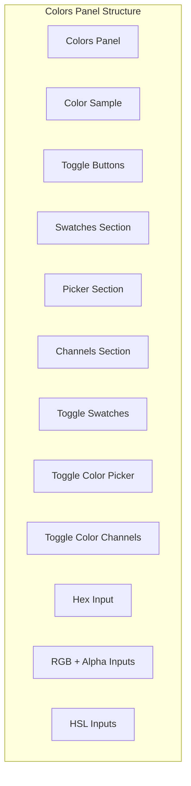
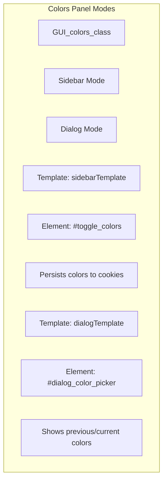
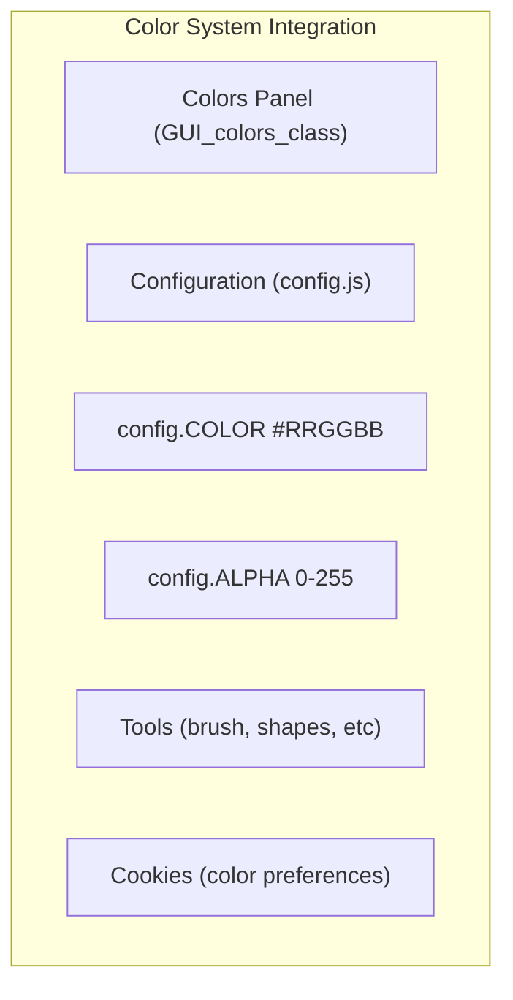

# Colors Panel

> **Relevant source files**
> * [src/css/component.css](https://github.com/viliusle/miniPaint/blob/6d0b95e5/src/css/component.css)
> * [src/js/core/gui/gui-colors.js](https://github.com/viliusle/miniPaint/blob/6d0b95e5/src/js/core/gui/gui-colors.js)
> * [src/js/core/gui/gui-tools.js](https://github.com/viliusle/miniPaint/blob/6d0b95e5/src/js/core/gui/gui-tools.js)

The Colors Panel in miniPaint provides a comprehensive interface for selecting and managing colors. This panel offers multiple ways to define colors, including color swatches, a visual color picker, and precise numerical inputs for RGB, HSL, and hexadecimal values. The panel is accessible through the main interface's right sidebar and can also appear in dialog form for specific color-related operations.

Sources: [src/js/core/gui/gui-colors.js L166-L169](https://github.com/viliusle/miniPaint/blob/6d0b95e5/src/js/core/gui/gui-colors.js#L166-L169)

## Panel Structure and Components

The Colors Panel consists of several collapsible sections that allow users to work with colors in different ways:

1. **Color Sample** - Shows a preview of the currently selected color
2. **Color Swatches** - A grid of color presets that can be clicked to select a color
3. **Color Picker** - A gradient-based visual color picker
4. **Color Channels** - Input fields for RGB, HSL values and hexadecimal color code

Each section can be toggled on/off using dedicated buttons in the panel header.



Sources: [src/js/core/gui/gui-colors.js L12-L96](https://github.com/viliusle/miniPaint/blob/6d0b95e5/src/js/core/gui/gui-colors.js#L12-L96)

 [src/js/core/gui/gui-colors.js L202-L324](https://github.com/viliusle/miniPaint/blob/6d0b95e5/src/js/core/gui/gui-colors.js#L202-L324)

## Panel Modes

The Colors Panel operates in two modes:

1. **Sidebar Mode** - The default mode, integrated into the right sidebar of the application
2. **Dialog Mode** - A popup version used when a specific color selection is required

The implementation supports both modes through common code with mode-specific differences handled through the `uiType` property.



Sources: [src/js/core/gui/gui-colors.js L171-L176](https://github.com/viliusle/miniPaint/blob/6d0b95e5/src/js/core/gui/gui-colors.js#L171-L176)

 [src/js/core/gui/gui-colors.js L184-L194](https://github.com/viliusle/miniPaint/blob/6d0b95e5/src/js/core/gui/gui-colors.js#L184-L194)

## Color Selection Workflow

The Colors Panel provides multiple ways to select and define colors. When a user interacts with any color input method, the following sequence occurs:

1. User interacts with a color input (swatch, picker, RGB/HSL sliders, or hex input)
2. The `set_color()` method is called with the relevant color information
3. Color format conversion occurs if needed (e.g., HSL to RGB)
4. The `config.COLOR` and `config.ALPHA` values are updated
5. All UI components are refreshed to reflect the new color
6. If in sidebar mode, the color is saved to cookies for persistence

```mermaid
sequenceDiagram
  participant User
  participant Color Input (Swatches/Picker/Sliders)
  participant set_color() Method
  participant Config Object
  participant UI Components

  User->>Color Input (Swatches/Picker/Sliders): Interacts with input
  Color Input (Swatches/Picker/Sliders)->>set_color() Method: Calls with color definition
  set_color() Method->>set_color() Method: Converts color formats if needed
  set_color() Method->>Config Object: Updates COLOR and ALPHA
  set_color() Method->>UI Components: Calls render_selected_color()
  UI Components->>UI Components: Updates all input components
  note over UI Components: render_ui_deferred() updates
  loop [is sidebar mode]
    set_color() Method->>Config Object: Saves to cookies
  end
```

Sources: [src/js/core/gui/gui-colors.js L326-L383](https://github.com/viliusle/miniPaint/blob/6d0b95e5/src/js/core/gui/gui-colors.js#L326-L383)

 [src/js/core/gui/gui-colors.js L400-L470](https://github.com/viliusle/miniPaint/blob/6d0b95e5/src/js/core/gui/gui-colors.js#L400-L470)

## Color Format Handling

The Colors Panel works with multiple color formats and provides conversion between them:

* **Hexadecimal** (#RRGGBB)
* **RGB** (Red, Green, Blue values from 0-255)
* **Alpha** (Transparency value from 0-255)
* **HSL** (Hue from 0-360°, Saturation/Luminosity from 0-100%)
* **HSV** (Hue from 0-360°, Saturation/Value from 0-100%)

When a color is selected using any input method, the `set_color()` method handles the conversion to all other formats as needed.

### Input Types and Properties

| Input Method | Format | Range | Properties |
| --- | --- | --- | --- |
| Hex Input | #RRGGBB | N/A | Direct hexadecimal code entry |
| RGB Sliders | Individual R,G,B values | 0-255 | Separate control of each channel |
| Alpha Slider | Alpha value | 0-255 | Controls transparency |
| HSL Sliders | Individual H,S,L values | H: 0-360, S/L: 0-100 | Intuitive color adjustment |
| Color Picker | HSV representation | H: 0-360, S/V: 0-100 | Visual gradient selection |
| Swatches | Saved hex colors | N/A | Quick selection of saved colors |

Sources: [src/js/core/gui/gui-colors.js L389-L515](https://github.com/viliusle/miniPaint/blob/6d0b95e5/src/js/core/gui/gui-colors.js#L389-L515)

 [src/js/core/gui/gui-colors.js L400-L470](https://github.com/viliusle/miniPaint/blob/6d0b95e5/src/js/core/gui/gui-colors.js#L400-L470)

## UI Components Implementation

### Color Swatches

The swatches section implements a grid of color samples that can be selected. The implementation:

* Uses a jQuery plugin (`uiSwatches`)
* Supports varying grid sizes (rows/columns)
* Allows saving/loading of colors
* Has read-only mode for dialog usage

### Color Picker Gradient

The gradient color picker provides an HSV-based visual color selection:

* Implements a two-dimensional gradient for selecting saturation and value
* Manages a handle that can be dragged to select a color visually
* Uses the jQuery plugin `uiColorPickerGradient`

### Color Channels

The color channels section provides precise input methods for defining colors:

* Hex input with validation
* RGB sliders and number inputs
* Alpha channel control
* HSL sliders and number inputs
* Each slider shows a gradient preview based on the current color

```sql
#mermaid-ccgkvccpb7a{font-family:ui-sans-serif,-apple-system,system-ui,Segoe UI,Helvetica;font-size:16px;fill:#333;}@keyframes edge-animation-frame{from{stroke-dashoffset:0;}}@keyframes dash{to{stroke-dashoffset:0;}}#mermaid-ccgkvccpb7a .edge-animation-slow{stroke-dasharray:9,5!important;stroke-dashoffset:900;animation:dash 50s linear infinite;stroke-linecap:round;}#mermaid-ccgkvccpb7a .edge-animation-fast{stroke-dasharray:9,5!important;stroke-dashoffset:900;animation:dash 20s linear infinite;stroke-linecap:round;}#mermaid-ccgkvccpb7a .error-icon{fill:#dddddd;}#mermaid-ccgkvccpb7a .error-text{fill:#222222;stroke:#222222;}#mermaid-ccgkvccpb7a .edge-thickness-normal{stroke-width:1px;}#mermaid-ccgkvccpb7a .edge-thickness-thick{stroke-width:3.5px;}#mermaid-ccgkvccpb7a .edge-pattern-solid{stroke-dasharray:0;}#mermaid-ccgkvccpb7a .edge-thickness-invisible{stroke-width:0;fill:none;}#mermaid-ccgkvccpb7a .edge-pattern-dashed{stroke-dasharray:3;}#mermaid-ccgkvccpb7a .edge-pattern-dotted{stroke-dasharray:2;}#mermaid-ccgkvccpb7a .marker{fill:#999;stroke:#999;}#mermaid-ccgkvccpb7a .marker.cross{stroke:#999;}#mermaid-ccgkvccpb7a svg{font-family:ui-sans-serif,-apple-system,system-ui,Segoe UI,Helvetica;font-size:16px;}#mermaid-ccgkvccpb7a p{margin:0;}#mermaid-ccgkvccpb7a g.classGroup text{fill:#dddddd;stroke:none;font-family:ui-sans-serif,-apple-system,system-ui,Segoe UI,Helvetica;font-size:10px;}#mermaid-ccgkvccpb7a g.classGroup text .title{font-weight:bolder;}#mermaid-ccgkvccpb7a .cluster-label text{fill:#444;}#mermaid-ccgkvccpb7a .cluster-label span{color:#444;}#mermaid-ccgkvccpb7a .cluster-label span p{background-color:transparent;}#mermaid-ccgkvccpb7a .cluster rect{fill:#f8f8f8;stroke:#dddddd;stroke-width:1px;}#mermaid-ccgkvccpb7a .cluster text{fill:#444;}#mermaid-ccgkvccpb7a .cluster span{color:#444;}#mermaid-ccgkvccpb7a .nodeLabel,#mermaid-ccgkvccpb7a .edgeLabel{color:#333333;}#mermaid-ccgkvccpb7a .noteLabel .nodeLabel,#mermaid-ccgkvccpb7a .noteLabel .edgeLabel{color:#333;}#mermaid-ccgkvccpb7a .edgeLabel .label rect{fill:#ffffff;}#mermaid-ccgkvccpb7a .label text{fill:#333333;}#mermaid-ccgkvccpb7a .labelBkg{background:#ffffff;}#mermaid-ccgkvccpb7a .edgeLabel .label span{background:#ffffff;}#mermaid-ccgkvccpb7a .classTitle{font-weight:bolder;}#mermaid-ccgkvccpb7a .node rect,#mermaid-ccgkvccpb7a .node circle,#mermaid-ccgkvccpb7a .node ellipse,#mermaid-ccgkvccpb7a .node polygon,#mermaid-ccgkvccpb7a .node path{fill:#ffffff;stroke:#dddddd;stroke-width:1;}#mermaid-ccgkvccpb7a .divider{stroke:#dddddd;stroke-width:1;}#mermaid-ccgkvccpb7a g.clickable{cursor:pointer;}#mermaid-ccgkvccpb7a g.classGroup rect{fill:#ffffff;stroke:#dddddd;}#mermaid-ccgkvccpb7a g.classGroup line{stroke:#dddddd;stroke-width:1;}#mermaid-ccgkvccpb7a .classLabel .box{stroke:none;stroke-width:0;fill:#ffffff;opacity:0.5;}#mermaid-ccgkvccpb7a .classLabel .label{fill:#dddddd;font-size:10px;}#mermaid-ccgkvccpb7a .relation{stroke:#999;stroke-width:1;fill:none;}#mermaid-ccgkvccpb7a .dashed-line{stroke-dasharray:3;}#mermaid-ccgkvccpb7a .dotted-line{stroke-dasharray:1 2;}#mermaid-ccgkvccpb7a [id$="-compositionStart"],#mermaid-ccgkvccpb7a .composition{fill:#999!important;stroke:#999!important;stroke-width:1;}#mermaid-ccgkvccpb7a [id$="-compositionEnd"],#mermaid-ccgkvccpb7a .composition{fill:#999!important;stroke:#999!important;stroke-width:1;}#mermaid-ccgkvccpb7a [id$="-dependencyStart"],#mermaid-ccgkvccpb7a .dependency{fill:#999!important;stroke:#999!important;stroke-width:1;}#mermaid-ccgkvccpb7a [id$="-dependencyEnd"],#mermaid-ccgkvccpb7a .dependency{fill:#999!important;stroke:#999!important;stroke-width:1;}#mermaid-ccgkvccpb7a [id$="-extensionStart"],#mermaid-ccgkvccpb7a .extension{fill:transparent!important;stroke:#999!important;stroke-width:1;}#mermaid-ccgkvccpb7a [id$="-extensionEnd"],#mermaid-ccgkvccpb7a .extension{fill:transparent!important;stroke:#999!important;stroke-width:1;}#mermaid-ccgkvccpb7a [id$="-aggregationStart"],#mermaid-ccgkvccpb7a .aggregation{fill:transparent!important;stroke:#999!important;stroke-width:1;}#mermaid-ccgkvccpb7a [id$="-aggregationEnd"],#mermaid-ccgkvccpb7a .aggregation{fill:transparent!important;stroke:#999!important;stroke-width:1;}#mermaid-ccgkvccpb7a [id$="-lollipopStart"],#mermaid-ccgkvccpb7a .lollipop{fill:#ffffff!important;stroke:#999!important;stroke-width:1;}#mermaid-ccgkvccpb7a [id$="-lollipopEnd"],#mermaid-ccgkvccpb7a .lollipop{fill:#ffffff!important;stroke:#999!important;stroke-width:1;}#mermaid-ccgkvccpb7a .edgeTerminals{font-size:11px;line-height:initial;}#mermaid-ccgkvccpb7a .classTitleText{text-anchor:middle;font-size:18px;fill:#333;}#mermaid-ccgkvccpb7a .edgeLabel[data-look="neo"]{background-color:#ffffff;text-align:center;}#mermaid-ccgkvccpb7a .edgeLabel[data-look="neo"] p{background-color:#ffffff;}#mermaid-ccgkvccpb7a .edgeLabel[data-look="neo"] rect{opacity:0.5;background-color:#ffffff;fill:#ffffff;}#mermaid-ccgkvccpb7a .label-icon{display:inline-block;height:1em;overflow:visible;vertical-align:-0.125em;}#mermaid-ccgkvccpb7a .node .label-icon path{fill:currentColor;stroke:revert;stroke-width:revert;}#mermaid-ccgkvccpb7a .node .neo-node{stroke:#dddddd;}#mermaid-ccgkvccpb7a [data-look="neo"].node rect,#mermaid-ccgkvccpb7a [data-look="neo"].cluster rect,#mermaid-ccgkvccpb7a [data-look="neo"].node polygon{stroke:url(#mermaid-ccgkvccpb7a-gradient);filter:drop-shadow( 1px 2px 2px rgba(185,185,185,1));}#mermaid-ccgkvccpb7a [data-look="neo"].node path{stroke:url(#mermaid-ccgkvccpb7a-gradient);stroke-width:1px;}#mermaid-ccgkvccpb7a [data-look="neo"].node .outer-path{filter:drop-shadow( 1px 2px 2px rgba(185,185,185,1));}#mermaid-ccgkvccpb7a [data-look="neo"].node .neo-line path{stroke:#dddddd;filter:none;}#mermaid-ccgkvccpb7a [data-look="neo"].node circle{stroke:url(#mermaid-ccgkvccpb7a-gradient);filter:drop-shadow( 1px 2px 2px rgba(185,185,185,1));}#mermaid-ccgkvccpb7a [data-look="neo"].node circle .state-start{fill:#000000;}#mermaid-ccgkvccpb7a [data-look="neo"].icon-shape .icon{fill:url(#mermaid-ccgkvccpb7a-gradient);filter:drop-shadow( 1px 2px 2px rgba(185,185,185,1));}#mermaid-ccgkvccpb7a [data-look="neo"].icon-shape .icon-neo path{stroke:url(#mermaid-ccgkvccpb7a-gradient);filter:drop-shadow( 1px 2px 2px rgba(185,185,185,1));}#mermaid-ccgkvccpb7a :root{--mermaid-font-family:"trebuchet ms",verdana,arial,sans-serif;}usescontainsGUI_colors_class+el+COLOR+ALPHA+colorNotSet+uiType+buttons+sections+inputs+render_main_colors(uiType)+init_components()+set_color(definition)+render_selected_color(options)+render_ui_deferred(options)Helper_class+hexToRgb()+rgbToHex()+hslToHex()+hsvToHex()+rgbToHsl()+rgbToHsv()+hslToHsv()+hsvToHsl()+setCookie()+getCookie()ColorInputs+sample+swatches+pickerGradient+hex+rgb+hsl
```

Sources: [src/js/core/gui/gui-colors.js L169-L185](https://github.com/viliusle/miniPaint/blob/6d0b95e5/src/js/core/gui/gui-colors.js#L169-L185)

 [src/js/core/gui/gui-colors.js L222-L259](https://github.com/viliusle/miniPaint/blob/6d0b95e5/src/js/core/gui/gui-colors.js#L222-L259)

## Integration with Application State

The Colors Panel integrates with the wider application through the central configuration object:

* The panel updates `config.COLOR` and `config.ALPHA` when a color is selected
* These values are used by various tools when applying color-related operations
* The panel loads initial color values from the configuration
* Color preferences are persisted through cookies

When a tool that uses color is activated, it reads the current color value from the configuration, which is managed by the Colors Panel.



Sources: [src/js/core/gui/gui-colors.js L447-L457](https://github.com/viliusle/miniPaint/blob/6d0b95e5/src/js/core/gui/gui-colors.js#L447-L457)

 [src/js/core/gui/gui-colors.js L467-L469](https://github.com/viliusle/miniPaint/blob/6d0b95e5/src/js/core/gui/gui-colors.js#L467-L469)

## UI Interaction Design

The Colors Panel implements several UI enhancement features:

### Section Toggling

* Each section (swatches, picker, channels) can be toggled on/off
* Toggle state is saved in cookies for persistence
* DOM manipulation is used to add/remove sections when toggled

### Responsive Updates

* Color input fields update immediately as the user interacts
* Slider gradients are updated to reflect the current color context
* Updates are throttled for performance (using `Helper.throttle`)

### Accessibility Features

* ARIA attributes are used for button states
* Input elements have proper labels and descriptions
* Screen reader text is included for abbreviated labels (R, G, B, etc.)

Sources: [src/js/core/gui/gui-colors.js L262-L324](https://github.com/viliusle/miniPaint/blob/6d0b95e5/src/js/core/gui/gui-colors.js#L262-L324)

 [src/js/core/gui/gui-colors.js L199](https://github.com/viliusle/miniPaint/blob/6d0b95e5/src/js/core/gui/gui-colors.js#L199-L199)

## Technical Implementation Notes

### Event Handling

The Colors Panel uses jQuery event handling to respond to user interactions. For each input type:

1. Event listeners are attached to inputs during initialization
2. Input changes trigger the appropriate color update method
3. The panel ensures all inputs stay synchronized

### Performance Considerations

* The panel uses throttling for gradient rendering operations
* Complex UI updates are deferred using the `render_ui_deferred` method
* DOM manipulations are minimized and optimized

### Widget Dependencies

The panel uses several custom UI widgets defined elsewhere in the codebase:

* `uiSwatches` - For color swatch grid
* `uiColorPickerGradient` - For HSV gradient picker
* `uiRange` - For slider controls
* `uiNumberInput` - For numeric inputs

Sources: [src/js/core/gui/gui-colors.js L326-L385](https://github.com/viliusle/miniPaint/blob/6d0b95e5/src/js/core/gui/gui-colors.js#L326-L385)

 [src/js/core/gui/gui-colors.js L511-L512](https://github.com/viliusle/miniPaint/blob/6d0b95e5/src/js/core/gui/gui-colors.js#L511-L512)

## Related Components

The Colors Panel is part of the larger UI system in miniPaint. Other related components include:

* **Tools Panel** [Tools Panel](/viliusle/miniPaint/3.3-tools-panel) - Contains tools that use colors
* **Layer Management** [Layer Management](/viliusle/miniPaint/2.1-layer-management) - Works with layers that may have color properties
* **Configuration System** [Configuration System](/viliusle/miniPaint/2.2-configuration-system) - Stores the current color values

Understanding how these systems interact provides a complete picture of color management in miniPaint.