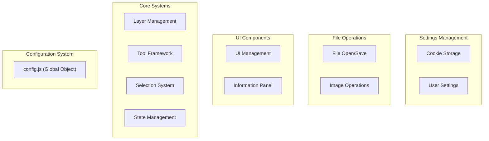
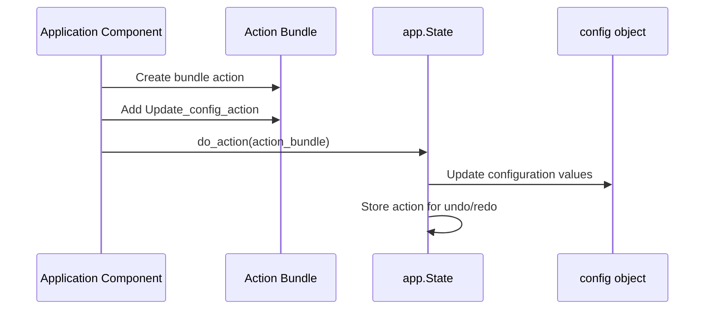
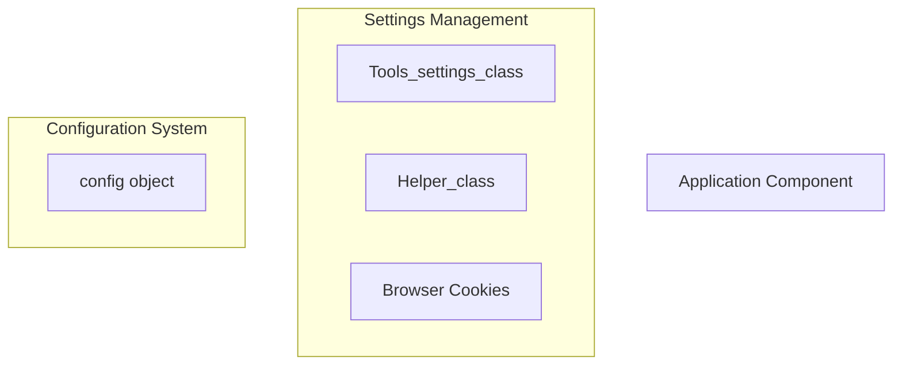
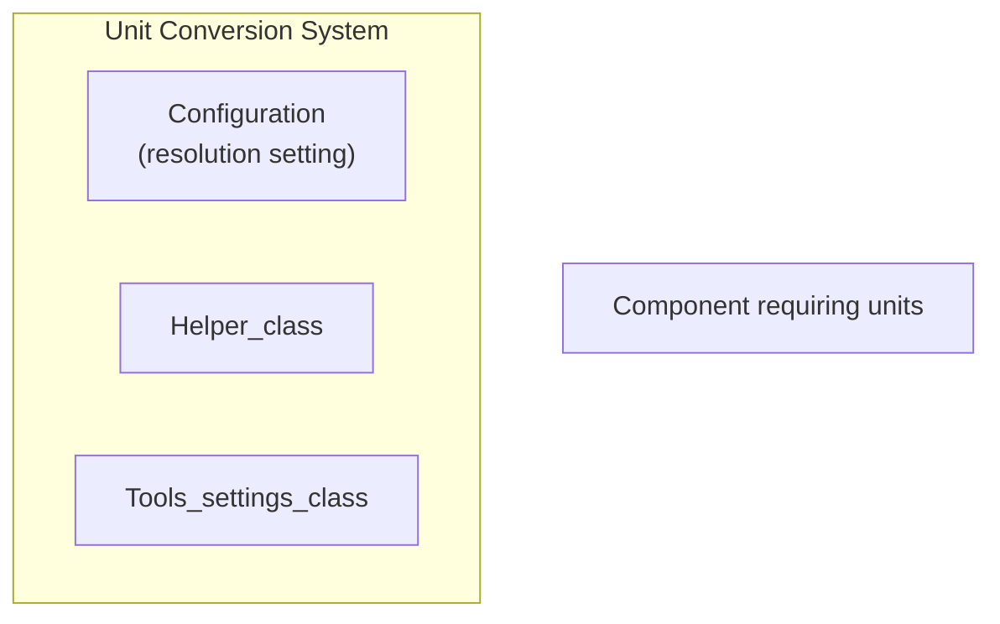

# Configuration System

> **Relevant source files**
> * [images/test-collection.json](https://github.com/viliusle/miniPaint/blob/6d0b95e5/images/test-collection.json)
> * [src/js/config.js](https://github.com/viliusle/miniPaint/blob/6d0b95e5/src/js/config.js)
> * [src/js/core/gui/gui-information.js](https://github.com/viliusle/miniPaint/blob/6d0b95e5/src/js/core/gui/gui-information.js)
> * [src/js/libs/helpers.js](https://github.com/viliusle/miniPaint/blob/6d0b95e5/src/js/libs/helpers.js)
> * [src/js/modules/file/new.js](https://github.com/viliusle/miniPaint/blob/6d0b95e5/src/js/modules/file/new.js)
> * [src/js/modules/image/information.js](https://github.com/viliusle/miniPaint/blob/6d0b95e5/src/js/modules/image/information.js)
> * [src/js/modules/image/size.js](https://github.com/viliusle/miniPaint/blob/6d0b95e5/src/js/modules/image/size.js)
> * [src/js/modules/image/translate.js](https://github.com/viliusle/miniPaint/blob/6d0b95e5/src/js/modules/image/translate.js)
> * [src/js/modules/tools/settings.js](https://github.com/viliusle/miniPaint/blob/6d0b95e5/src/js/modules/tools/settings.js)
> * [src/js/tools/shapes/bezier_curve.js](https://github.com/viliusle/miniPaint/blob/6d0b95e5/src/js/tools/shapes/bezier_curve.js)
> * [src/js/tools/shapes/polygon.js](https://github.com/viliusle/miniPaint/blob/6d0b95e5/src/js/tools/shapes/polygon.js)

The Configuration System in miniPaint provides centralized state management through a global configuration object. This system stores and manages application settings, canvas properties, tool parameters, and runtime state. It serves as the shared data store that connects the various components of the application.

For information about user settings persistence, see [Settings Module](/viliusle/miniPaint/5.4-settings).

## Overview

The miniPaint Configuration System centers around a single global `config` object defined in `config.js`. This object stores all application state and settings, enabling different components to share data without direct coupling.



Sources: [src/js/config.js](https://github.com/viliusle/miniPaint/blob/6d0b95e5/src/js/config.js)

 [src/js/modules/tools/settings.js](https://github.com/viliusle/miniPaint/blob/6d0b95e5/src/js/modules/tools/settings.js)

 [src/js/libs/helpers.js](https://github.com/viliusle/miniPaint/blob/6d0b95e5/src/js/libs/helpers.js)

## Configuration Object Structure

The global configuration object contains several categories of data that serve different purposes:

```sql
#mermaid-onqsf81fbic{font-family:ui-sans-serif,-apple-system,system-ui,Segoe UI,Helvetica;font-size:16px;fill:#333;}@keyframes edge-animation-frame{from{stroke-dashoffset:0;}}@keyframes dash{to{stroke-dashoffset:0;}}#mermaid-onqsf81fbic .edge-animation-slow{stroke-dasharray:9,5!important;stroke-dashoffset:900;animation:dash 50s linear infinite;stroke-linecap:round;}#mermaid-onqsf81fbic .edge-animation-fast{stroke-dasharray:9,5!important;stroke-dashoffset:900;animation:dash 20s linear infinite;stroke-linecap:round;}#mermaid-onqsf81fbic .error-icon{fill:#dddddd;}#mermaid-onqsf81fbic .error-text{fill:#222222;stroke:#222222;}#mermaid-onqsf81fbic .edge-thickness-normal{stroke-width:1px;}#mermaid-onqsf81fbic .edge-thickness-thick{stroke-width:3.5px;}#mermaid-onqsf81fbic .edge-pattern-solid{stroke-dasharray:0;}#mermaid-onqsf81fbic .edge-thickness-invisible{stroke-width:0;fill:none;}#mermaid-onqsf81fbic .edge-pattern-dashed{stroke-dasharray:3;}#mermaid-onqsf81fbic .edge-pattern-dotted{stroke-dasharray:2;}#mermaid-onqsf81fbic .marker{fill:#999;stroke:#999;}#mermaid-onqsf81fbic .marker.cross{stroke:#999;}#mermaid-onqsf81fbic svg{font-family:ui-sans-serif,-apple-system,system-ui,Segoe UI,Helvetica;font-size:16px;}#mermaid-onqsf81fbic p{margin:0;}#mermaid-onqsf81fbic g.classGroup text{fill:#dddddd;stroke:none;font-family:ui-sans-serif,-apple-system,system-ui,Segoe UI,Helvetica;font-size:10px;}#mermaid-onqsf81fbic g.classGroup text .title{font-weight:bolder;}#mermaid-onqsf81fbic .cluster-label text{fill:#444;}#mermaid-onqsf81fbic .cluster-label span{color:#444;}#mermaid-onqsf81fbic .cluster-label span p{background-color:transparent;}#mermaid-onqsf81fbic .cluster rect{fill:#f8f8f8;stroke:#dddddd;stroke-width:1px;}#mermaid-onqsf81fbic .cluster text{fill:#444;}#mermaid-onqsf81fbic .cluster span{color:#444;}#mermaid-onqsf81fbic .nodeLabel,#mermaid-onqsf81fbic .edgeLabel{color:#333333;}#mermaid-onqsf81fbic .noteLabel .nodeLabel,#mermaid-onqsf81fbic .noteLabel .edgeLabel{color:#333;}#mermaid-onqsf81fbic .edgeLabel .label rect{fill:#ffffff;}#mermaid-onqsf81fbic .label text{fill:#333333;}#mermaid-onqsf81fbic .labelBkg{background:#ffffff;}#mermaid-onqsf81fbic .edgeLabel .label span{background:#ffffff;}#mermaid-onqsf81fbic .classTitle{font-weight:bolder;}#mermaid-onqsf81fbic .node rect,#mermaid-onqsf81fbic .node circle,#mermaid-onqsf81fbic .node ellipse,#mermaid-onqsf81fbic .node polygon,#mermaid-onqsf81fbic .node path{fill:#ffffff;stroke:#dddddd;stroke-width:1;}#mermaid-onqsf81fbic .divider{stroke:#dddddd;stroke-width:1;}#mermaid-onqsf81fbic g.clickable{cursor:pointer;}#mermaid-onqsf81fbic g.classGroup rect{fill:#ffffff;stroke:#dddddd;}#mermaid-onqsf81fbic g.classGroup line{stroke:#dddddd;stroke-width:1;}#mermaid-onqsf81fbic .classLabel .box{stroke:none;stroke-width:0;fill:#ffffff;opacity:0.5;}#mermaid-onqsf81fbic .classLabel .label{fill:#dddddd;font-size:10px;}#mermaid-onqsf81fbic .relation{stroke:#999;stroke-width:1;fill:none;}#mermaid-onqsf81fbic .dashed-line{stroke-dasharray:3;}#mermaid-onqsf81fbic .dotted-line{stroke-dasharray:1 2;}#mermaid-onqsf81fbic [id$="-compositionStart"],#mermaid-onqsf81fbic .composition{fill:#999!important;stroke:#999!important;stroke-width:1;}#mermaid-onqsf81fbic [id$="-compositionEnd"],#mermaid-onqsf81fbic .composition{fill:#999!important;stroke:#999!important;stroke-width:1;}#mermaid-onqsf81fbic [id$="-dependencyStart"],#mermaid-onqsf81fbic .dependency{fill:#999!important;stroke:#999!important;stroke-width:1;}#mermaid-onqsf81fbic [id$="-dependencyEnd"],#mermaid-onqsf81fbic .dependency{fill:#999!important;stroke:#999!important;stroke-width:1;}#mermaid-onqsf81fbic [id$="-extensionStart"],#mermaid-onqsf81fbic .extension{fill:transparent!important;stroke:#999!important;stroke-width:1;}#mermaid-onqsf81fbic [id$="-extensionEnd"],#mermaid-onqsf81fbic .extension{fill:transparent!important;stroke:#999!important;stroke-width:1;}#mermaid-onqsf81fbic [id$="-aggregationStart"],#mermaid-onqsf81fbic .aggregation{fill:transparent!important;stroke:#999!important;stroke-width:1;}#mermaid-onqsf81fbic [id$="-aggregationEnd"],#mermaid-onqsf81fbic .aggregation{fill:transparent!important;stroke:#999!important;stroke-width:1;}#mermaid-onqsf81fbic [id$="-lollipopStart"],#mermaid-onqsf81fbic .lollipop{fill:#ffffff!important;stroke:#999!important;stroke-width:1;}#mermaid-onqsf81fbic [id$="-lollipopEnd"],#mermaid-onqsf81fbic .lollipop{fill:#ffffff!important;stroke:#999!important;stroke-width:1;}#mermaid-onqsf81fbic .edgeTerminals{font-size:11px;line-height:initial;}#mermaid-onqsf81fbic .classTitleText{text-anchor:middle;font-size:18px;fill:#333;}#mermaid-onqsf81fbic .edgeLabel[data-look="neo"]{background-color:#ffffff;text-align:center;}#mermaid-onqsf81fbic .edgeLabel[data-look="neo"] p{background-color:#ffffff;}#mermaid-onqsf81fbic .edgeLabel[data-look="neo"] rect{opacity:0.5;background-color:#ffffff;fill:#ffffff;}#mermaid-onqsf81fbic .label-icon{display:inline-block;height:1em;overflow:visible;vertical-align:-0.125em;}#mermaid-onqsf81fbic .node .label-icon path{fill:currentColor;stroke:revert;stroke-width:revert;}#mermaid-onqsf81fbic .node .neo-node{stroke:#dddddd;}#mermaid-onqsf81fbic [data-look="neo"].node rect,#mermaid-onqsf81fbic [data-look="neo"].cluster rect,#mermaid-onqsf81fbic [data-look="neo"].node polygon{stroke:url(#mermaid-onqsf81fbic-gradient);filter:drop-shadow( 1px 2px 2px rgba(185,185,185,1));}#mermaid-onqsf81fbic [data-look="neo"].node path{stroke:url(#mermaid-onqsf81fbic-gradient);stroke-width:1px;}#mermaid-onqsf81fbic [data-look="neo"].node .outer-path{filter:drop-shadow( 1px 2px 2px rgba(185,185,185,1));}#mermaid-onqsf81fbic [data-look="neo"].node .neo-line path{stroke:#dddddd;filter:none;}#mermaid-onqsf81fbic [data-look="neo"].node circle{stroke:url(#mermaid-onqsf81fbic-gradient);filter:drop-shadow( 1px 2px 2px rgba(185,185,185,1));}#mermaid-onqsf81fbic [data-look="neo"].node circle .state-start{fill:#000000;}#mermaid-onqsf81fbic [data-look="neo"].icon-shape .icon{fill:url(#mermaid-onqsf81fbic-gradient);filter:drop-shadow( 1px 2px 2px rgba(185,185,185,1));}#mermaid-onqsf81fbic [data-look="neo"].icon-shape .icon-neo path{stroke:url(#mermaid-onqsf81fbic-gradient);filter:drop-shadow( 1px 2px 2px rgba(185,185,185,1));}#mermaid-onqsf81fbic :root{--mermaid-font-family:"trebuchet ms",verdana,arial,sans-serif;}config+VisualSettings+CanvasDimensions+StateVariables+LayerManagement+ToolConfiguration+UserPreferences+ExternalServicesVisualSettings+TRANSPARENCY: boolean+TRANSPARENCY_TYPE: string+COLOR: string+ALPHA: number+themes: string[]CanvasDimensions+WIDTH: number+HEIGHT: number+visible_width: number+visible_height: number+ZOOM: numberStateVariables+need_render: boolean+need_render_changed_params: boolean+mouse: object+mouse_lock: anyLayerManagement+layers: Layer[]+layer: LayerToolConfiguration+TOOLS: Tool[]+TOOL: ToolUserPreferences+LANG: string+SNAP: boolean+guides_enabled: boolean+ruler_active: booleanExternalServices+pixabay_key: string+google_webfonts_key: string
```

Sources: [src/js/config.js](https://github.com/viliusle/miniPaint/blob/6d0b95e5/src/js/config.js)

## Configuration Default Values

The configuration object is initialized with default values that establish the initial state of the application. Some key default values include:

| Category | Property | Default Value | Description |
| --- | --- | --- | --- |
| Visual Settings | TRANSPARENCY | false | Whether transparency is enabled |
| Visual Settings | TRANSPARENCY_TYPE | 'squares' | Type of transparency pattern |
| Visual Settings | COLOR | '#008000' | Default color |
| Canvas | WIDTH | null | Canvas width in pixels |
| Canvas | HEIGHT | null | Canvas height in pixels |
| Canvas | ZOOM | 1 | Initial zoom level |
| User Preferences | LANG | 'en' | Language setting |
| User Preferences | SNAP | true | Whether snap to grid is enabled |
| State | layers | [] | Array to store all layers |
| State | need_render | false | Flag to trigger re-rendering |

Sources: [src/js/config.js L3-L32](https://github.com/viliusle/miniPaint/blob/6d0b95e5/src/js/config.js#L3-L32)

## Tool Configuration

The configuration system stores detailed definitions for all available tools, including their parameters and attributes. Each tool configuration includes:

* Name and title
* Default parameters
* Event handlers (on_activate, on_leave, etc.)
* Visibility settings

```sql
config.TOOLS = [  {    name: 'select',    title: 'Select object tool',    attributes: {      auto_select: true,    },  },  // More tools defined...];
```

This allows for consistent tool behavior and parameter management throughout the application.

Sources: [src/js/config.js L82-L508](https://github.com/viliusle/miniPaint/blob/6d0b95e5/src/js/config.js#L82-L508)

## Accessing and Modifying Configuration

### Direct Access

Throughout the codebase, components directly access the configuration object to read values:

```javascript
// Reading configuration valuesvar width = config.WIDTH;var currentLayer = config.layer;var isSnapEnabled = config.SNAP;
```

### State Management Integration

For configuration changes that should support undo/redo functionality, the State Management system is used:



Sources: [src/js/modules/file/new.js L97-L118](https://github.com/viliusle/miniPaint/blob/6d0b95e5/src/js/modules/file/new.js#L97-L118)

 [src/js/modules/image/size.js L98-L106](https://github.com/viliusle/miniPaint/blob/6d0b95e5/src/js/modules/image/size.js#L98-L106)

## Settings Persistence

The configuration system works with the Settings module to persist user preferences between sessions:



The `Tools_settings_class` provides methods to save and retrieve settings:

```javascript
// Get a setting with fallback to defaultsvar theme = this.Tools_settings.get_setting('theme'); // Save a setting (persists to cookies)this.Tools_settings.save_setting('theme', params.theme); // Update config with new settingconfig.TRANSPARENCY = this.get_setting('transparency');
```

Sources: [src/js/modules/tools/settings.js L67-L94](https://github.com/viliusle/miniPaint/blob/6d0b95e5/src/js/modules/tools/settings.js#L67-L94)

 [src/js/modules/tools/settings.js L102-L166](https://github.com/viliusle/miniPaint/blob/6d0b95e5/src/js/modules/tools/settings.js#L102-L166)

 [src/js/libs/helpers.js L71-L101](https://github.com/viliusle/miniPaint/blob/6d0b95e5/src/js/libs/helpers.js#L71-L101)

## Unit Conversion System

The configuration system includes functionality for converting between different unit systems:



The Helper class provides methods for converting between pixels and user-defined units:

* `get_user_unit(data, type, resolution)` - Converts pixels to user units
* `get_internal_unit(data, type, resolution)` - Converts user units to pixels

Supported unit types include:

* pixels
* inches
* centimeters
* millimeters

Sources: [src/js/libs/helpers.js L672-L714](https://github.com/viliusle/miniPaint/blob/6d0b95e5/src/js/libs/helpers.js#L672-L714)

 [src/js/modules/image/size.js L32-L34](https://github.com/viliusle/miniPaint/blob/6d0b95e5/src/js/modules/image/size.js#L32-L34)

 [src/js/modules/image/size.js L94-L95](https://github.com/viliusle/miniPaint/blob/6d0b95e5/src/js/modules/image/size.js#L94-L95)

## Configuration System Uses

### Layer Management

The configuration system stores the array of all layers (`config.layers`) and the currently selected layer (`config.layer`). Changes to layers are often applied through the State Management system.

### Canvas Dimensions

Canvas dimensions are stored in `config.WIDTH` and `config.HEIGHT`. These values are accessed throughout the application for rendering, tool operations, and information display.

### User Interface

The configuration provides values for the UI to display, such as:

* Canvas dimensions and zoom level
* Current tool parameters
* Layer properties
* Mouse coordinates

### Tool State

The currently active tool is referenced by `config.TOOL`, which points to one of the tool definitions in the `config.TOOLS` array. This provides a consistent way to access the current tool's parameters.

Sources: [src/js/core/gui/gui-information.js L84-L85](https://github.com/viliusle/miniPaint/blob/6d0b95e5/src/js/core/gui/gui-information.js#L84-L85)

 [src/js/modules/image/information.js L47-L48](https://github.com/viliusle/miniPaint/blob/6d0b95e5/src/js/modules/image/information.js#L47-L48)

 [src/js/tools/shapes/bezier_curve.js L91-L110](https://github.com/viliusle/miniPaint/blob/6d0b95e5/src/js/tools/shapes/bezier_curve.js#L91-L110)

## Best Practices

When working with the configuration system, keep these guidelines in mind:

1. **State Changes**: For changes that should support undo/redo, use the State Management system rather than directly modifying the configuration.
2. **Settings Persistence**: Use the `Tools_settings_class` methods to save and retrieve user settings.
3. **Unit Conversion**: Always use the Helper class methods for unit conversions to ensure consistency.
4. **Rendering Updates**: Set `config.need_render = true` when changes require the canvas to be redrawn.

Sources: [src/js/modules/tools/settings.js L83-L93](https://github.com/viliusle/miniPaint/blob/6d0b95e5/src/js/modules/tools/settings.js#L83-L93)

 [src/js/modules/image/size.js L134-L136](https://github.com/viliusle/miniPaint/blob/6d0b95e5/src/js/modules/image/size.js#L134-L136)

 [src/js/tools/shapes/bezier_curve.js L431](https://github.com/viliusle/miniPaint/blob/6d0b95e5/src/js/tools/shapes/bezier_curve.js#L431-L431)