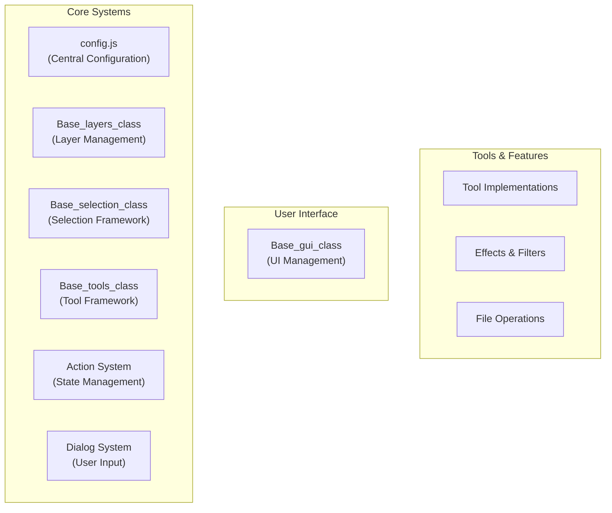
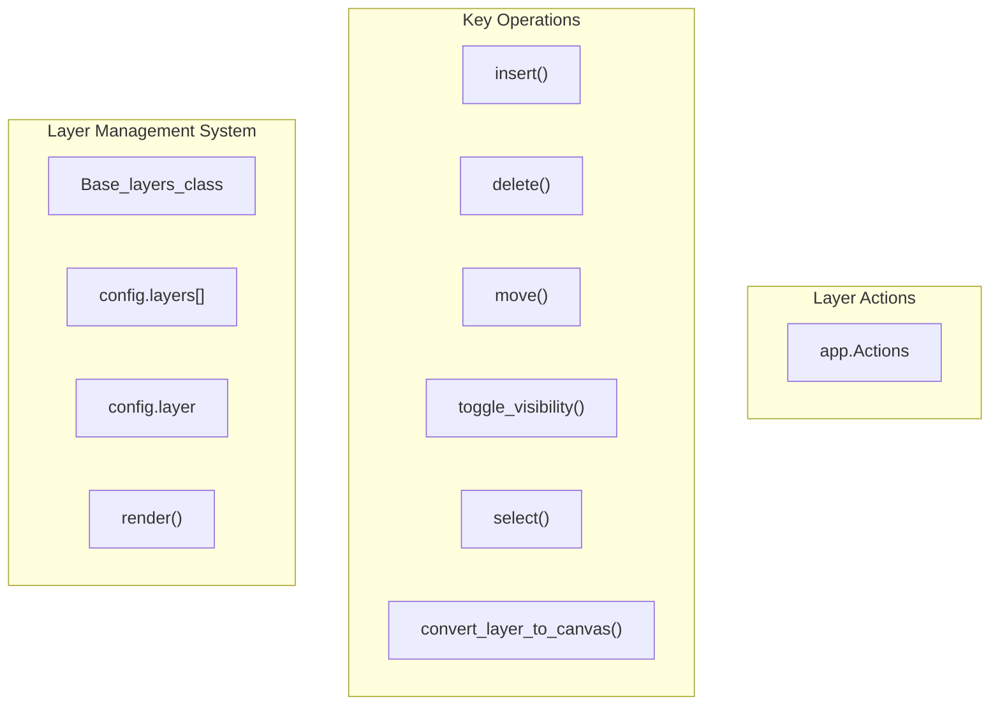
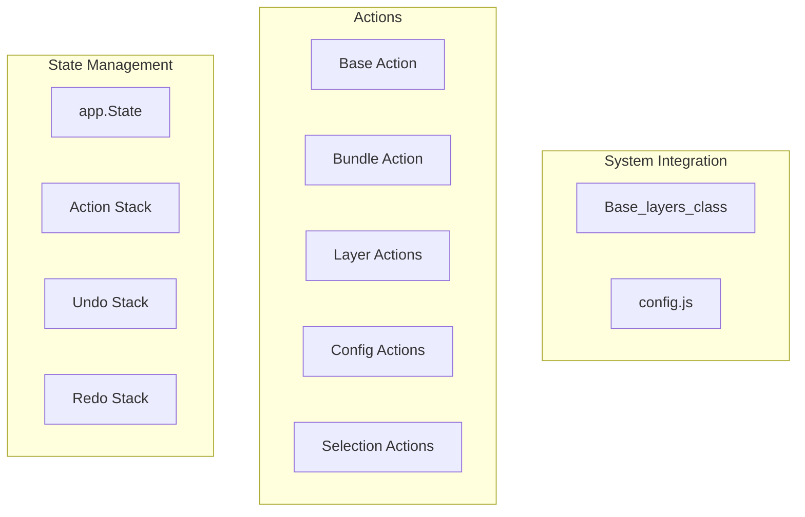
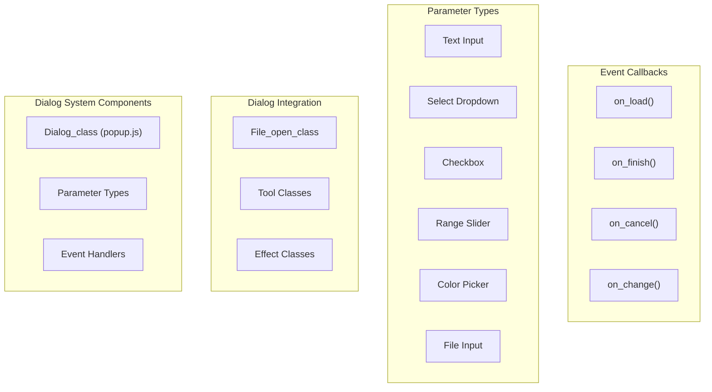
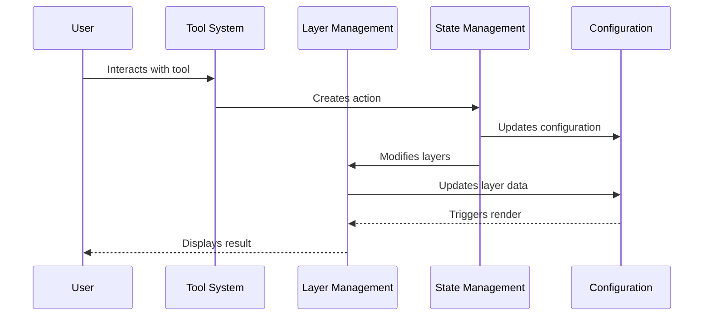

# Core Systems

> **Relevant source files**
> * [images/test-collection.json](https://github.com/viliusle/miniPaint/blob/6d0b95e5/images/test-collection.json)
> * [src/js/config-menu.js](https://github.com/viliusle/miniPaint/blob/6d0b95e5/src/js/config-menu.js)
> * [src/js/config.js](https://github.com/viliusle/miniPaint/blob/6d0b95e5/src/js/config.js)
> * [src/js/core/base-layers.js](https://github.com/viliusle/miniPaint/blob/6d0b95e5/src/js/core/base-layers.js)
> * [src/js/core/base-selection.js](https://github.com/viliusle/miniPaint/blob/6d0b95e5/src/js/core/base-selection.js)
> * [src/js/core/base-tools.js](https://github.com/viliusle/miniPaint/blob/6d0b95e5/src/js/core/base-tools.js)
> * [src/js/core/gui/gui-preview.js](https://github.com/viliusle/miniPaint/blob/6d0b95e5/src/js/core/gui/gui-preview.js)
> * [src/js/modules/file/open.js](https://github.com/viliusle/miniPaint/blob/6d0b95e5/src/js/modules/file/open.js)
> * [src/js/tools/animation.js](https://github.com/viliusle/miniPaint/blob/6d0b95e5/src/js/tools/animation.js)
> * [src/js/tools/crop.js](https://github.com/viliusle/miniPaint/blob/6d0b95e5/src/js/tools/crop.js)
> * [src/js/tools/select.js](https://github.com/viliusle/miniPaint/blob/6d0b95e5/src/js/tools/select.js)
> * [src/js/tools/selection.js](https://github.com/viliusle/miniPaint/blob/6d0b95e5/src/js/tools/selection.js)
> * [src/js/tools/shapes/bezier_curve.js](https://github.com/viliusle/miniPaint/blob/6d0b95e5/src/js/tools/shapes/bezier_curve.js)
> * [src/js/tools/shapes/polygon.js](https://github.com/viliusle/miniPaint/blob/6d0b95e5/src/js/tools/shapes/polygon.js)

The Core Systems of miniPaint form the foundational architecture that powers the web-based image editor. This page outlines the essential systems that provide the underlying functionality for the application's features. These systems include the central configuration manager, layer management, selection framework, tool system, state management, and dialog system.

For information about the User Interface built on top of these core systems, see [User Interface](/viliusle/miniPaint/3-user-interface). For details about specific tools and their implementation, see [Tools](/viliusle/miniPaint/4-tools).

## System Architecture Overview

The miniPaint core systems are designed with a modular architecture that separates concerns while maintaining clear communication paths between components.



Sources: [src/js/config.js](https://github.com/viliusle/miniPaint/blob/6d0b95e5/src/js/config.js)

 [src/js/core/base-layers.js](https://github.com/viliusle/miniPaint/blob/6d0b95e5/src/js/core/base-layers.js)

 [src/js/core/base-selection.js](https://github.com/viliusle/miniPaint/blob/6d0b95e5/src/js/core/base-selection.js)

 [src/js/core/base-tools.js](https://github.com/viliusle/miniPaint/blob/6d0b95e5/src/js/core/base-tools.js)

## Configuration System

The configuration system acts as the central state container for the entire application. It stores global settings, application state, and the array of layers that make up the image being edited.

### Key Components of the Configuration System

```sql
#mermaid-quqcxovgmch{font-family:ui-sans-serif,-apple-system,system-ui,Segoe UI,Helvetica;font-size:16px;fill:#333;}@keyframes edge-animation-frame{from{stroke-dashoffset:0;}}@keyframes dash{to{stroke-dashoffset:0;}}#mermaid-quqcxovgmch .edge-animation-slow{stroke-dasharray:9,5!important;stroke-dashoffset:900;animation:dash 50s linear infinite;stroke-linecap:round;}#mermaid-quqcxovgmch .edge-animation-fast{stroke-dasharray:9,5!important;stroke-dashoffset:900;animation:dash 20s linear infinite;stroke-linecap:round;}#mermaid-quqcxovgmch .error-icon{fill:#dddddd;}#mermaid-quqcxovgmch .error-text{fill:#222222;stroke:#222222;}#mermaid-quqcxovgmch .edge-thickness-normal{stroke-width:1px;}#mermaid-quqcxovgmch .edge-thickness-thick{stroke-width:3.5px;}#mermaid-quqcxovgmch .edge-pattern-solid{stroke-dasharray:0;}#mermaid-quqcxovgmch .edge-thickness-invisible{stroke-width:0;fill:none;}#mermaid-quqcxovgmch .edge-pattern-dashed{stroke-dasharray:3;}#mermaid-quqcxovgmch .edge-pattern-dotted{stroke-dasharray:2;}#mermaid-quqcxovgmch .marker{fill:#999;stroke:#999;}#mermaid-quqcxovgmch .marker.cross{stroke:#999;}#mermaid-quqcxovgmch svg{font-family:ui-sans-serif,-apple-system,system-ui,Segoe UI,Helvetica;font-size:16px;}#mermaid-quqcxovgmch p{margin:0;}#mermaid-quqcxovgmch g.classGroup text{fill:#dddddd;stroke:none;font-family:ui-sans-serif,-apple-system,system-ui,Segoe UI,Helvetica;font-size:10px;}#mermaid-quqcxovgmch g.classGroup text .title{font-weight:bolder;}#mermaid-quqcxovgmch .cluster-label text{fill:#444;}#mermaid-quqcxovgmch .cluster-label span{color:#444;}#mermaid-quqcxovgmch .cluster-label span p{background-color:transparent;}#mermaid-quqcxovgmch .cluster rect{fill:#f8f8f8;stroke:#dddddd;stroke-width:1px;}#mermaid-quqcxovgmch .cluster text{fill:#444;}#mermaid-quqcxovgmch .cluster span{color:#444;}#mermaid-quqcxovgmch .nodeLabel,#mermaid-quqcxovgmch .edgeLabel{color:#333333;}#mermaid-quqcxovgmch .noteLabel .nodeLabel,#mermaid-quqcxovgmch .noteLabel .edgeLabel{color:#333;}#mermaid-quqcxovgmch .edgeLabel .label rect{fill:#ffffff;}#mermaid-quqcxovgmch .label text{fill:#333333;}#mermaid-quqcxovgmch .labelBkg{background:#ffffff;}#mermaid-quqcxovgmch .edgeLabel .label span{background:#ffffff;}#mermaid-quqcxovgmch .classTitle{font-weight:bolder;}#mermaid-quqcxovgmch .node rect,#mermaid-quqcxovgmch .node circle,#mermaid-quqcxovgmch .node ellipse,#mermaid-quqcxovgmch .node polygon,#mermaid-quqcxovgmch .node path{fill:#ffffff;stroke:#dddddd;stroke-width:1;}#mermaid-quqcxovgmch .divider{stroke:#dddddd;stroke-width:1;}#mermaid-quqcxovgmch g.clickable{cursor:pointer;}#mermaid-quqcxovgmch g.classGroup rect{fill:#ffffff;stroke:#dddddd;}#mermaid-quqcxovgmch g.classGroup line{stroke:#dddddd;stroke-width:1;}#mermaid-quqcxovgmch .classLabel .box{stroke:none;stroke-width:0;fill:#ffffff;opacity:0.5;}#mermaid-quqcxovgmch .classLabel .label{fill:#dddddd;font-size:10px;}#mermaid-quqcxovgmch .relation{stroke:#999;stroke-width:1;fill:none;}#mermaid-quqcxovgmch .dashed-line{stroke-dasharray:3;}#mermaid-quqcxovgmch .dotted-line{stroke-dasharray:1 2;}#mermaid-quqcxovgmch [id$="-compositionStart"],#mermaid-quqcxovgmch .composition{fill:#999!important;stroke:#999!important;stroke-width:1;}#mermaid-quqcxovgmch [id$="-compositionEnd"],#mermaid-quqcxovgmch .composition{fill:#999!important;stroke:#999!important;stroke-width:1;}#mermaid-quqcxovgmch [id$="-dependencyStart"],#mermaid-quqcxovgmch .dependency{fill:#999!important;stroke:#999!important;stroke-width:1;}#mermaid-quqcxovgmch [id$="-dependencyEnd"],#mermaid-quqcxovgmch .dependency{fill:#999!important;stroke:#999!important;stroke-width:1;}#mermaid-quqcxovgmch [id$="-extensionStart"],#mermaid-quqcxovgmch .extension{fill:transparent!important;stroke:#999!important;stroke-width:1;}#mermaid-quqcxovgmch [id$="-extensionEnd"],#mermaid-quqcxovgmch .extension{fill:transparent!important;stroke:#999!important;stroke-width:1;}#mermaid-quqcxovgmch [id$="-aggregationStart"],#mermaid-quqcxovgmch .aggregation{fill:transparent!important;stroke:#999!important;stroke-width:1;}#mermaid-quqcxovgmch [id$="-aggregationEnd"],#mermaid-quqcxovgmch .aggregation{fill:transparent!important;stroke:#999!important;stroke-width:1;}#mermaid-quqcxovgmch [id$="-lollipopStart"],#mermaid-quqcxovgmch .lollipop{fill:#ffffff!important;stroke:#999!important;stroke-width:1;}#mermaid-quqcxovgmch [id$="-lollipopEnd"],#mermaid-quqcxovgmch .lollipop{fill:#ffffff!important;stroke:#999!important;stroke-width:1;}#mermaid-quqcxovgmch .edgeTerminals{font-size:11px;line-height:initial;}#mermaid-quqcxovgmch .classTitleText{text-anchor:middle;font-size:18px;fill:#333;}#mermaid-quqcxovgmch .edgeLabel[data-look="neo"]{background-color:#ffffff;text-align:center;}#mermaid-quqcxovgmch .edgeLabel[data-look="neo"] p{background-color:#ffffff;}#mermaid-quqcxovgmch .edgeLabel[data-look="neo"] rect{opacity:0.5;background-color:#ffffff;fill:#ffffff;}#mermaid-quqcxovgmch .label-icon{display:inline-block;height:1em;overflow:visible;vertical-align:-0.125em;}#mermaid-quqcxovgmch .node .label-icon path{fill:currentColor;stroke:revert;stroke-width:revert;}#mermaid-quqcxovgmch .node .neo-node{stroke:#dddddd;}#mermaid-quqcxovgmch [data-look="neo"].node rect,#mermaid-quqcxovgmch [data-look="neo"].cluster rect,#mermaid-quqcxovgmch [data-look="neo"].node polygon{stroke:url(#mermaid-quqcxovgmch-gradient);filter:drop-shadow( 1px 2px 2px rgba(185,185,185,1));}#mermaid-quqcxovgmch [data-look="neo"].node path{stroke:url(#mermaid-quqcxovgmch-gradient);stroke-width:1px;}#mermaid-quqcxovgmch [data-look="neo"].node .outer-path{filter:drop-shadow( 1px 2px 2px rgba(185,185,185,1));}#mermaid-quqcxovgmch [data-look="neo"].node .neo-line path{stroke:#dddddd;filter:none;}#mermaid-quqcxovgmch [data-look="neo"].node circle{stroke:url(#mermaid-quqcxovgmch-gradient);filter:drop-shadow( 1px 2px 2px rgba(185,185,185,1));}#mermaid-quqcxovgmch [data-look="neo"].node circle .state-start{fill:#000000;}#mermaid-quqcxovgmch [data-look="neo"].icon-shape .icon{fill:url(#mermaid-quqcxovgmch-gradient);filter:drop-shadow( 1px 2px 2px rgba(185,185,185,1));}#mermaid-quqcxovgmch [data-look="neo"].icon-shape .icon-neo path{stroke:url(#mermaid-quqcxovgmch-gradient);filter:drop-shadow( 1px 2px 2px rgba(185,185,185,1));}#mermaid-quqcxovgmch :root{--mermaid-font-family:"trebuchet ms",verdana,arial,sans-serif;}0..*1config+Boolean TRANSPARENCY+String TRANSPARENCY_TYPE+String LANG+Number WIDTH+Number HEIGHT+Number ZOOM+Boolean SNAP+Array layers+Object layer+Boolean need_render+Object mouse+Array guides+Object TOOLLayer+int id+String name+String type+Number x+Number y+Number width+Number height+Boolean visible+Number opacity+Array filters+Function render_function«Current selected layer»ActiveLayer
```

The configuration object (`config.js`) is imported throughout the application and serves as the central truth for:

* Canvas dimensions (`WIDTH`, `HEIGHT`)
* Current zoom level (`ZOOM`)
* List of layers (`layers`)
* Currently active layer (`layer`)
* Currently selected tool (`TOOL`)
* Mouse information (`mouse`)
* Rendering states (`need_render`)
* Application settings (transparency, snap, etc.)

The configuration system doesn't use setters/getters - components directly modify the configuration properties, which allows for simple integration but requires careful management to maintain consistency.

Sources: [src/js/config.js L1-L513](https://github.com/viliusle/miniPaint/blob/6d0b95e5/src/js/config.js#L1-L513)

## Layer Management

The Layer Management system is responsible for organizing, rendering, and manipulating the layers that make up an image. Each layer represents a content element (image, shape, text, etc.) with its own properties and can be independently edited.

### Layer Structure

Each layer in miniPaint is represented as an object with the following key properties:

```sql
#mermaid-4hc8d4gavae{font-family:ui-sans-serif,-apple-system,system-ui,Segoe UI,Helvetica;font-size:16px;fill:#333;}@keyframes edge-animation-frame{from{stroke-dashoffset:0;}}@keyframes dash{to{stroke-dashoffset:0;}}#mermaid-4hc8d4gavae .edge-animation-slow{stroke-dasharray:9,5!important;stroke-dashoffset:900;animation:dash 50s linear infinite;stroke-linecap:round;}#mermaid-4hc8d4gavae .edge-animation-fast{stroke-dasharray:9,5!important;stroke-dashoffset:900;animation:dash 20s linear infinite;stroke-linecap:round;}#mermaid-4hc8d4gavae .error-icon{fill:#dddddd;}#mermaid-4hc8d4gavae .error-text{fill:#222222;stroke:#222222;}#mermaid-4hc8d4gavae .edge-thickness-normal{stroke-width:1px;}#mermaid-4hc8d4gavae .edge-thickness-thick{stroke-width:3.5px;}#mermaid-4hc8d4gavae .edge-pattern-solid{stroke-dasharray:0;}#mermaid-4hc8d4gavae .edge-thickness-invisible{stroke-width:0;fill:none;}#mermaid-4hc8d4gavae .edge-pattern-dashed{stroke-dasharray:3;}#mermaid-4hc8d4gavae .edge-pattern-dotted{stroke-dasharray:2;}#mermaid-4hc8d4gavae .marker{fill:#999;stroke:#999;}#mermaid-4hc8d4gavae .marker.cross{stroke:#999;}#mermaid-4hc8d4gavae svg{font-family:ui-sans-serif,-apple-system,system-ui,Segoe UI,Helvetica;font-size:16px;}#mermaid-4hc8d4gavae p{margin:0;}#mermaid-4hc8d4gavae g.classGroup text{fill:#dddddd;stroke:none;font-family:ui-sans-serif,-apple-system,system-ui,Segoe UI,Helvetica;font-size:10px;}#mermaid-4hc8d4gavae g.classGroup text .title{font-weight:bolder;}#mermaid-4hc8d4gavae .cluster-label text{fill:#444;}#mermaid-4hc8d4gavae .cluster-label span{color:#444;}#mermaid-4hc8d4gavae .cluster-label span p{background-color:transparent;}#mermaid-4hc8d4gavae .cluster rect{fill:#f8f8f8;stroke:#dddddd;stroke-width:1px;}#mermaid-4hc8d4gavae .cluster text{fill:#444;}#mermaid-4hc8d4gavae .cluster span{color:#444;}#mermaid-4hc8d4gavae .nodeLabel,#mermaid-4hc8d4gavae .edgeLabel{color:#333333;}#mermaid-4hc8d4gavae .noteLabel .nodeLabel,#mermaid-4hc8d4gavae .noteLabel .edgeLabel{color:#333;}#mermaid-4hc8d4gavae .edgeLabel .label rect{fill:#ffffff;}#mermaid-4hc8d4gavae .label text{fill:#333333;}#mermaid-4hc8d4gavae .labelBkg{background:#ffffff;}#mermaid-4hc8d4gavae .edgeLabel .label span{background:#ffffff;}#mermaid-4hc8d4gavae .classTitle{font-weight:bolder;}#mermaid-4hc8d4gavae .node rect,#mermaid-4hc8d4gavae .node circle,#mermaid-4hc8d4gavae .node ellipse,#mermaid-4hc8d4gavae .node polygon,#mermaid-4hc8d4gavae .node path{fill:#ffffff;stroke:#dddddd;stroke-width:1;}#mermaid-4hc8d4gavae .divider{stroke:#dddddd;stroke-width:1;}#mermaid-4hc8d4gavae g.clickable{cursor:pointer;}#mermaid-4hc8d4gavae g.classGroup rect{fill:#ffffff;stroke:#dddddd;}#mermaid-4hc8d4gavae g.classGroup line{stroke:#dddddd;stroke-width:1;}#mermaid-4hc8d4gavae .classLabel .box{stroke:none;stroke-width:0;fill:#ffffff;opacity:0.5;}#mermaid-4hc8d4gavae .classLabel .label{fill:#dddddd;font-size:10px;}#mermaid-4hc8d4gavae .relation{stroke:#999;stroke-width:1;fill:none;}#mermaid-4hc8d4gavae .dashed-line{stroke-dasharray:3;}#mermaid-4hc8d4gavae .dotted-line{stroke-dasharray:1 2;}#mermaid-4hc8d4gavae [id$="-compositionStart"],#mermaid-4hc8d4gavae .composition{fill:#999!important;stroke:#999!important;stroke-width:1;}#mermaid-4hc8d4gavae [id$="-compositionEnd"],#mermaid-4hc8d4gavae .composition{fill:#999!important;stroke:#999!important;stroke-width:1;}#mermaid-4hc8d4gavae [id$="-dependencyStart"],#mermaid-4hc8d4gavae .dependency{fill:#999!important;stroke:#999!important;stroke-width:1;}#mermaid-4hc8d4gavae [id$="-dependencyEnd"],#mermaid-4hc8d4gavae .dependency{fill:#999!important;stroke:#999!important;stroke-width:1;}#mermaid-4hc8d4gavae [id$="-extensionStart"],#mermaid-4hc8d4gavae .extension{fill:transparent!important;stroke:#999!important;stroke-width:1;}#mermaid-4hc8d4gavae [id$="-extensionEnd"],#mermaid-4hc8d4gavae .extension{fill:transparent!important;stroke:#999!important;stroke-width:1;}#mermaid-4hc8d4gavae [id$="-aggregationStart"],#mermaid-4hc8d4gavae .aggregation{fill:transparent!important;stroke:#999!important;stroke-width:1;}#mermaid-4hc8d4gavae [id$="-aggregationEnd"],#mermaid-4hc8d4gavae .aggregation{fill:transparent!important;stroke:#999!important;stroke-width:1;}#mermaid-4hc8d4gavae [id$="-lollipopStart"],#mermaid-4hc8d4gavae .lollipop{fill:#ffffff!important;stroke:#999!important;stroke-width:1;}#mermaid-4hc8d4gavae [id$="-lollipopEnd"],#mermaid-4hc8d4gavae .lollipop{fill:#ffffff!important;stroke:#999!important;stroke-width:1;}#mermaid-4hc8d4gavae .edgeTerminals{font-size:11px;line-height:initial;}#mermaid-4hc8d4gavae .classTitleText{text-anchor:middle;font-size:18px;fill:#333;}#mermaid-4hc8d4gavae .edgeLabel[data-look="neo"]{background-color:#ffffff;text-align:center;}#mermaid-4hc8d4gavae .edgeLabel[data-look="neo"] p{background-color:#ffffff;}#mermaid-4hc8d4gavae .edgeLabel[data-look="neo"] rect{opacity:0.5;background-color:#ffffff;fill:#ffffff;}#mermaid-4hc8d4gavae .label-icon{display:inline-block;height:1em;overflow:visible;vertical-align:-0.125em;}#mermaid-4hc8d4gavae .node .label-icon path{fill:currentColor;stroke:revert;stroke-width:revert;}#mermaid-4hc8d4gavae .node .neo-node{stroke:#dddddd;}#mermaid-4hc8d4gavae [data-look="neo"].node rect,#mermaid-4hc8d4gavae [data-look="neo"].cluster rect,#mermaid-4hc8d4gavae [data-look="neo"].node polygon{stroke:url(#mermaid-4hc8d4gavae-gradient);filter:drop-shadow( 1px 2px 2px rgba(185,185,185,1));}#mermaid-4hc8d4gavae [data-look="neo"].node path{stroke:url(#mermaid-4hc8d4gavae-gradient);stroke-width:1px;}#mermaid-4hc8d4gavae [data-look="neo"].node .outer-path{filter:drop-shadow( 1px 2px 2px rgba(185,185,185,1));}#mermaid-4hc8d4gavae [data-look="neo"].node .neo-line path{stroke:#dddddd;filter:none;}#mermaid-4hc8d4gavae [data-look="neo"].node circle{stroke:url(#mermaid-4hc8d4gavae-gradient);filter:drop-shadow( 1px 2px 2px rgba(185,185,185,1));}#mermaid-4hc8d4gavae [data-look="neo"].node circle .state-start{fill:#000000;}#mermaid-4hc8d4gavae [data-look="neo"].icon-shape .icon{fill:url(#mermaid-4hc8d4gavae-gradient);filter:drop-shadow( 1px 2px 2px rgba(185,185,185,1));}#mermaid-4hc8d4gavae [data-look="neo"].icon-shape .icon-neo path{stroke:url(#mermaid-4hc8d4gavae-gradient);filter:drop-shadow( 1px 2px 2px rgba(185,185,185,1));}#mermaid-4hc8d4gavae :root{--mermaid-font-family:"trebuchet ms",verdana,arial,sans-serif;}Layer+int id+int parent_id+String name+String type+Object link+Number x+Number y+Number width+Number height+Number width_original+Number height_original+Boolean visible+Boolean is_vector+Number opacity+Number order+String composition+Number rotate+Object data+Object params+String color+Array filters+Array render_function
```

### Layer Management System Architecture



The `Base_layers_class` is a singleton class that provides methods to manipulate layers. Key functionalities include:

* **Layer Creation**: Adding new layers via `insert()` method
* **Layer Rendering**: The `render()` method processes each layer according to its type and properties
* **Layer Selection**: Activating a specific layer with the `select()` method
* **Layer Management**: Methods for deleting, hiding, moving, and manipulating layers
* **Canvas Interaction**: Converting layers to canvas for saving or exporting

The rendering process follows this sequence:

1. Prepare canvas (`pre_render()`)
2. Get sorted layers by order (`get_sorted_layers()`)
3. Apply zoom view transformations
4. Render each layer through `render_objects()`
5. Add overlay elements like grid and guides
6. Complete render (`after_render()`)

The actual rendering of individual layers occurs in the `render_object()` method, which handles different layer types and applies filters.

Sources: [src/js/core/base-layers.js L45-L884](https://github.com/viliusle/miniPaint/blob/6d0b95e5/src/js/core/base-layers.js#L45-L884)

## Selection System

The Selection System provides functionality for selecting, manipulating, and transforming elements on the canvas. It handles user interactions for selecting objects and supports operations like resizing, moving, and rotating selections.

### Selection Framework Components

```sql
#mermaid-ujd9gwqq1g{font-family:ui-sans-serif,-apple-system,system-ui,Segoe UI,Helvetica;font-size:16px;fill:#333;}@keyframes edge-animation-frame{from{stroke-dashoffset:0;}}@keyframes dash{to{stroke-dashoffset:0;}}#mermaid-ujd9gwqq1g .edge-animation-slow{stroke-dasharray:9,5!important;stroke-dashoffset:900;animation:dash 50s linear infinite;stroke-linecap:round;}#mermaid-ujd9gwqq1g .edge-animation-fast{stroke-dasharray:9,5!important;stroke-dashoffset:900;animation:dash 20s linear infinite;stroke-linecap:round;}#mermaid-ujd9gwqq1g .error-icon{fill:#dddddd;}#mermaid-ujd9gwqq1g .error-text{fill:#222222;stroke:#222222;}#mermaid-ujd9gwqq1g .edge-thickness-normal{stroke-width:1px;}#mermaid-ujd9gwqq1g .edge-thickness-thick{stroke-width:3.5px;}#mermaid-ujd9gwqq1g .edge-pattern-solid{stroke-dasharray:0;}#mermaid-ujd9gwqq1g .edge-thickness-invisible{stroke-width:0;fill:none;}#mermaid-ujd9gwqq1g .edge-pattern-dashed{stroke-dasharray:3;}#mermaid-ujd9gwqq1g .edge-pattern-dotted{stroke-dasharray:2;}#mermaid-ujd9gwqq1g .marker{fill:#999;stroke:#999;}#mermaid-ujd9gwqq1g .marker.cross{stroke:#999;}#mermaid-ujd9gwqq1g svg{font-family:ui-sans-serif,-apple-system,system-ui,Segoe UI,Helvetica;font-size:16px;}#mermaid-ujd9gwqq1g p{margin:0;}#mermaid-ujd9gwqq1g g.classGroup text{fill:#dddddd;stroke:none;font-family:ui-sans-serif,-apple-system,system-ui,Segoe UI,Helvetica;font-size:10px;}#mermaid-ujd9gwqq1g g.classGroup text .title{font-weight:bolder;}#mermaid-ujd9gwqq1g .cluster-label text{fill:#444;}#mermaid-ujd9gwqq1g .cluster-label span{color:#444;}#mermaid-ujd9gwqq1g .cluster-label span p{background-color:transparent;}#mermaid-ujd9gwqq1g .cluster rect{fill:#f8f8f8;stroke:#dddddd;stroke-width:1px;}#mermaid-ujd9gwqq1g .cluster text{fill:#444;}#mermaid-ujd9gwqq1g .cluster span{color:#444;}#mermaid-ujd9gwqq1g .nodeLabel,#mermaid-ujd9gwqq1g .edgeLabel{color:#333333;}#mermaid-ujd9gwqq1g .noteLabel .nodeLabel,#mermaid-ujd9gwqq1g .noteLabel .edgeLabel{color:#333;}#mermaid-ujd9gwqq1g .edgeLabel .label rect{fill:#ffffff;}#mermaid-ujd9gwqq1g .label text{fill:#333333;}#mermaid-ujd9gwqq1g .labelBkg{background:#ffffff;}#mermaid-ujd9gwqq1g .edgeLabel .label span{background:#ffffff;}#mermaid-ujd9gwqq1g .classTitle{font-weight:bolder;}#mermaid-ujd9gwqq1g .node rect,#mermaid-ujd9gwqq1g .node circle,#mermaid-ujd9gwqq1g .node ellipse,#mermaid-ujd9gwqq1g .node polygon,#mermaid-ujd9gwqq1g .node path{fill:#ffffff;stroke:#dddddd;stroke-width:1;}#mermaid-ujd9gwqq1g .divider{stroke:#dddddd;stroke-width:1;}#mermaid-ujd9gwqq1g g.clickable{cursor:pointer;}#mermaid-ujd9gwqq1g g.classGroup rect{fill:#ffffff;stroke:#dddddd;}#mermaid-ujd9gwqq1g g.classGroup line{stroke:#dddddd;stroke-width:1;}#mermaid-ujd9gwqq1g .classLabel .box{stroke:none;stroke-width:0;fill:#ffffff;opacity:0.5;}#mermaid-ujd9gwqq1g .classLabel .label{fill:#dddddd;font-size:10px;}#mermaid-ujd9gwqq1g .relation{stroke:#999;stroke-width:1;fill:none;}#mermaid-ujd9gwqq1g .dashed-line{stroke-dasharray:3;}#mermaid-ujd9gwqq1g .dotted-line{stroke-dasharray:1 2;}#mermaid-ujd9gwqq1g [id$="-compositionStart"],#mermaid-ujd9gwqq1g .composition{fill:#999!important;stroke:#999!important;stroke-width:1;}#mermaid-ujd9gwqq1g [id$="-compositionEnd"],#mermaid-ujd9gwqq1g .composition{fill:#999!important;stroke:#999!important;stroke-width:1;}#mermaid-ujd9gwqq1g [id$="-dependencyStart"],#mermaid-ujd9gwqq1g .dependency{fill:#999!important;stroke:#999!important;stroke-width:1;}#mermaid-ujd9gwqq1g [id$="-dependencyEnd"],#mermaid-ujd9gwqq1g .dependency{fill:#999!important;stroke:#999!important;stroke-width:1;}#mermaid-ujd9gwqq1g [id$="-extensionStart"],#mermaid-ujd9gwqq1g .extension{fill:transparent!important;stroke:#999!important;stroke-width:1;}#mermaid-ujd9gwqq1g [id$="-extensionEnd"],#mermaid-ujd9gwqq1g .extension{fill:transparent!important;stroke:#999!important;stroke-width:1;}#mermaid-ujd9gwqq1g [id$="-aggregationStart"],#mermaid-ujd9gwqq1g .aggregation{fill:transparent!important;stroke:#999!important;stroke-width:1;}#mermaid-ujd9gwqq1g [id$="-aggregationEnd"],#mermaid-ujd9gwqq1g .aggregation{fill:transparent!important;stroke:#999!important;stroke-width:1;}#mermaid-ujd9gwqq1g [id$="-lollipopStart"],#mermaid-ujd9gwqq1g .lollipop{fill:#ffffff!important;stroke:#999!important;stroke-width:1;}#mermaid-ujd9gwqq1g [id$="-lollipopEnd"],#mermaid-ujd9gwqq1g .lollipop{fill:#ffffff!important;stroke:#999!important;stroke-width:1;}#mermaid-ujd9gwqq1g .edgeTerminals{font-size:11px;line-height:initial;}#mermaid-ujd9gwqq1g .classTitleText{text-anchor:middle;font-size:18px;fill:#333;}#mermaid-ujd9gwqq1g .edgeLabel[data-look="neo"]{background-color:#ffffff;text-align:center;}#mermaid-ujd9gwqq1g .edgeLabel[data-look="neo"] p{background-color:#ffffff;}#mermaid-ujd9gwqq1g .edgeLabel[data-look="neo"] rect{opacity:0.5;background-color:#ffffff;fill:#ffffff;}#mermaid-ujd9gwqq1g .label-icon{display:inline-block;height:1em;overflow:visible;vertical-align:-0.125em;}#mermaid-ujd9gwqq1g .node .label-icon path{fill:currentColor;stroke:revert;stroke-width:revert;}#mermaid-ujd9gwqq1g .node .neo-node{stroke:#dddddd;}#mermaid-ujd9gwqq1g [data-look="neo"].node rect,#mermaid-ujd9gwqq1g [data-look="neo"].cluster rect,#mermaid-ujd9gwqq1g [data-look="neo"].node polygon{stroke:url(#mermaid-ujd9gwqq1g-gradient);filter:drop-shadow( 1px 2px 2px rgba(185,185,185,1));}#mermaid-ujd9gwqq1g [data-look="neo"].node path{stroke:url(#mermaid-ujd9gwqq1g-gradient);stroke-width:1px;}#mermaid-ujd9gwqq1g [data-look="neo"].node .outer-path{filter:drop-shadow( 1px 2px 2px rgba(185,185,185,1));}#mermaid-ujd9gwqq1g [data-look="neo"].node .neo-line path{stroke:#dddddd;filter:none;}#mermaid-ujd9gwqq1g [data-look="neo"].node circle{stroke:url(#mermaid-ujd9gwqq1g-gradient);filter:drop-shadow( 1px 2px 2px rgba(185,185,185,1));}#mermaid-ujd9gwqq1g [data-look="neo"].node circle .state-start{fill:#000000;}#mermaid-ujd9gwqq1g [data-look="neo"].icon-shape .icon{fill:url(#mermaid-ujd9gwqq1g-gradient);filter:drop-shadow( 1px 2px 2px rgba(185,185,185,1));}#mermaid-ujd9gwqq1g [data-look="neo"].icon-shape .icon-neo path{stroke:url(#mermaid-ujd9gwqq1g-gradient);filter:drop-shadow( 1px 2px 2px rgba(185,185,185,1));}#mermaid-ujd9gwqq1g :root{--mermaid-font-family:"trebuchet ms",verdana,arial,sans-serif;}managesusesBase_selection_class-Object settings-Function data_function-Boolean is_drag-Object mouse_lock-Object click_details+constructor(ctx, settings, key)+set_selection(x, y, width, height)+reset_selection()+get_selection()+draw_selection()-selected_object_actions(e)SelectionData+Number x+Number y+Number width+Number height«Enumeration»SelectionTypesDRAG_TYPE_TOPDRAG_TYPE_BOTTOMDRAG_TYPE_LEFTDRAG_TYPE_RIGHT
```

The Selection System is primarily implemented through the `Base_selection_class` which:

1. Manages selection coordinates and dimensions
2. Renders selection indicators (handles, borders, etc.)
3. Processes mouse events for manipulating selections
4. Supports different selection modes through configuration

Key features include:

* **Visual Indicators**: Drawing borders, resize handles, and rotation controls
* **Interactive Controls**: Handling mouse events for resizing and moving
* **Custom Settings**: Configurable behavior based on the type of selection
* **Rotation Support**: Ability to rotate selected elements

The selection system interacts with the active tool and layer through the configuration object, adapting its behavior based on what's being selected.

Sources: [src/js/core/base-selection.js L21-L558](https://github.com/viliusle/miniPaint/blob/6d0b95e5/src/js/core/base-selection.js#L21-L558)

 [src/js/tools/select.js L9-L578](https://github.com/viliusle/miniPaint/blob/6d0b95e5/src/js/tools/select.js#L9-L578)

 [src/js/tools/crop.js L10-L307](https://github.com/viliusle/miniPaint/blob/6d0b95e5/src/js/tools/crop.js#L10-L307)

 [src/js/tools/selection.js L12-L309](https://github.com/viliusle/miniPaint/blob/6d0b95e5/src/js/tools/selection.js#L12-L309)

## Tool Framework

The Tool Framework provides a standardized base for all tools in miniPaint. It creates a consistent structure for tools to handle mouse events, render their effects, and interact with the application state.

### Tool System Architecture

```sql
#mermaid-4fo5my4pzhs{font-family:ui-sans-serif,-apple-system,system-ui,Segoe UI,Helvetica;font-size:16px;fill:#333;}@keyframes edge-animation-frame{from{stroke-dashoffset:0;}}@keyframes dash{to{stroke-dashoffset:0;}}#mermaid-4fo5my4pzhs .edge-animation-slow{stroke-dasharray:9,5!important;stroke-dashoffset:900;animation:dash 50s linear infinite;stroke-linecap:round;}#mermaid-4fo5my4pzhs .edge-animation-fast{stroke-dasharray:9,5!important;stroke-dashoffset:900;animation:dash 20s linear infinite;stroke-linecap:round;}#mermaid-4fo5my4pzhs .error-icon{fill:#dddddd;}#mermaid-4fo5my4pzhs .error-text{fill:#222222;stroke:#222222;}#mermaid-4fo5my4pzhs .edge-thickness-normal{stroke-width:1px;}#mermaid-4fo5my4pzhs .edge-thickness-thick{stroke-width:3.5px;}#mermaid-4fo5my4pzhs .edge-pattern-solid{stroke-dasharray:0;}#mermaid-4fo5my4pzhs .edge-thickness-invisible{stroke-width:0;fill:none;}#mermaid-4fo5my4pzhs .edge-pattern-dashed{stroke-dasharray:3;}#mermaid-4fo5my4pzhs .edge-pattern-dotted{stroke-dasharray:2;}#mermaid-4fo5my4pzhs .marker{fill:#999;stroke:#999;}#mermaid-4fo5my4pzhs .marker.cross{stroke:#999;}#mermaid-4fo5my4pzhs svg{font-family:ui-sans-serif,-apple-system,system-ui,Segoe UI,Helvetica;font-size:16px;}#mermaid-4fo5my4pzhs p{margin:0;}#mermaid-4fo5my4pzhs g.classGroup text{fill:#dddddd;stroke:none;font-family:ui-sans-serif,-apple-system,system-ui,Segoe UI,Helvetica;font-size:10px;}#mermaid-4fo5my4pzhs g.classGroup text .title{font-weight:bolder;}#mermaid-4fo5my4pzhs .cluster-label text{fill:#444;}#mermaid-4fo5my4pzhs .cluster-label span{color:#444;}#mermaid-4fo5my4pzhs .cluster-label span p{background-color:transparent;}#mermaid-4fo5my4pzhs .cluster rect{fill:#f8f8f8;stroke:#dddddd;stroke-width:1px;}#mermaid-4fo5my4pzhs .cluster text{fill:#444;}#mermaid-4fo5my4pzhs .cluster span{color:#444;}#mermaid-4fo5my4pzhs .nodeLabel,#mermaid-4fo5my4pzhs .edgeLabel{color:#333333;}#mermaid-4fo5my4pzhs .noteLabel .nodeLabel,#mermaid-4fo5my4pzhs .noteLabel .edgeLabel{color:#333;}#mermaid-4fo5my4pzhs .edgeLabel .label rect{fill:#ffffff;}#mermaid-4fo5my4pzhs .label text{fill:#333333;}#mermaid-4fo5my4pzhs .labelBkg{background:#ffffff;}#mermaid-4fo5my4pzhs .edgeLabel .label span{background:#ffffff;}#mermaid-4fo5my4pzhs .classTitle{font-weight:bolder;}#mermaid-4fo5my4pzhs .node rect,#mermaid-4fo5my4pzhs .node circle,#mermaid-4fo5my4pzhs .node ellipse,#mermaid-4fo5my4pzhs .node polygon,#mermaid-4fo5my4pzhs .node path{fill:#ffffff;stroke:#dddddd;stroke-width:1;}#mermaid-4fo5my4pzhs .divider{stroke:#dddddd;stroke-width:1;}#mermaid-4fo5my4pzhs g.clickable{cursor:pointer;}#mermaid-4fo5my4pzhs g.classGroup rect{fill:#ffffff;stroke:#dddddd;}#mermaid-4fo5my4pzhs g.classGroup line{stroke:#dddddd;stroke-width:1;}#mermaid-4fo5my4pzhs .classLabel .box{stroke:none;stroke-width:0;fill:#ffffff;opacity:0.5;}#mermaid-4fo5my4pzhs .classLabel .label{fill:#dddddd;font-size:10px;}#mermaid-4fo5my4pzhs .relation{stroke:#999;stroke-width:1;fill:none;}#mermaid-4fo5my4pzhs .dashed-line{stroke-dasharray:3;}#mermaid-4fo5my4pzhs .dotted-line{stroke-dasharray:1 2;}#mermaid-4fo5my4pzhs [id$="-compositionStart"],#mermaid-4fo5my4pzhs .composition{fill:#999!important;stroke:#999!important;stroke-width:1;}#mermaid-4fo5my4pzhs [id$="-compositionEnd"],#mermaid-4fo5my4pzhs .composition{fill:#999!important;stroke:#999!important;stroke-width:1;}#mermaid-4fo5my4pzhs [id$="-dependencyStart"],#mermaid-4fo5my4pzhs .dependency{fill:#999!important;stroke:#999!important;stroke-width:1;}#mermaid-4fo5my4pzhs [id$="-dependencyEnd"],#mermaid-4fo5my4pzhs .dependency{fill:#999!important;stroke:#999!important;stroke-width:1;}#mermaid-4fo5my4pzhs [id$="-extensionStart"],#mermaid-4fo5my4pzhs .extension{fill:transparent!important;stroke:#999!important;stroke-width:1;}#mermaid-4fo5my4pzhs [id$="-extensionEnd"],#mermaid-4fo5my4pzhs .extension{fill:transparent!important;stroke:#999!important;stroke-width:1;}#mermaid-4fo5my4pzhs [id$="-aggregationStart"],#mermaid-4fo5my4pzhs .aggregation{fill:transparent!important;stroke:#999!important;stroke-width:1;}#mermaid-4fo5my4pzhs [id$="-aggregationEnd"],#mermaid-4fo5my4pzhs .aggregation{fill:transparent!important;stroke:#999!important;stroke-width:1;}#mermaid-4fo5my4pzhs [id$="-lollipopStart"],#mermaid-4fo5my4pzhs .lollipop{fill:#ffffff!important;stroke:#999!important;stroke-width:1;}#mermaid-4fo5my4pzhs [id$="-lollipopEnd"],#mermaid-4fo5my4pzhs .lollipop{fill:#ffffff!important;stroke:#999!important;stroke-width:1;}#mermaid-4fo5my4pzhs .edgeTerminals{font-size:11px;line-height:initial;}#mermaid-4fo5my4pzhs .classTitleText{text-anchor:middle;font-size:18px;fill:#333;}#mermaid-4fo5my4pzhs .edgeLabel[data-look="neo"]{background-color:#ffffff;text-align:center;}#mermaid-4fo5my4pzhs .edgeLabel[data-look="neo"] p{background-color:#ffffff;}#mermaid-4fo5my4pzhs .edgeLabel[data-look="neo"] rect{opacity:0.5;background-color:#ffffff;fill:#ffffff;}#mermaid-4fo5my4pzhs .label-icon{display:inline-block;height:1em;overflow:visible;vertical-align:-0.125em;}#mermaid-4fo5my4pzhs .node .label-icon path{fill:currentColor;stroke:revert;stroke-width:revert;}#mermaid-4fo5my4pzhs .node .neo-node{stroke:#dddddd;}#mermaid-4fo5my4pzhs [data-look="neo"].node rect,#mermaid-4fo5my4pzhs [data-look="neo"].cluster rect,#mermaid-4fo5my4pzhs [data-look="neo"].node polygon{stroke:url(#mermaid-4fo5my4pzhs-gradient);filter:drop-shadow( 1px 2px 2px rgba(185,185,185,1));}#mermaid-4fo5my4pzhs [data-look="neo"].node path{stroke:url(#mermaid-4fo5my4pzhs-gradient);stroke-width:1px;}#mermaid-4fo5my4pzhs [data-look="neo"].node .outer-path{filter:drop-shadow( 1px 2px 2px rgba(185,185,185,1));}#mermaid-4fo5my4pzhs [data-look="neo"].node .neo-line path{stroke:#dddddd;filter:none;}#mermaid-4fo5my4pzhs [data-look="neo"].node circle{stroke:url(#mermaid-4fo5my4pzhs-gradient);filter:drop-shadow( 1px 2px 2px rgba(185,185,185,1));}#mermaid-4fo5my4pzhs [data-look="neo"].node circle .state-start{fill:#000000;}#mermaid-4fo5my4pzhs [data-look="neo"].icon-shape .icon{fill:url(#mermaid-4fo5my4pzhs-gradient);filter:drop-shadow( 1px 2px 2px rgba(185,185,185,1));}#mermaid-4fo5my4pzhs [data-look="neo"].icon-shape .icon-neo path{stroke:url(#mermaid-4fo5my4pzhs-gradient);filter:drop-shadow( 1px 2px 2px rgba(185,185,185,1));}#mermaid-4fo5my4pzhs :root{--mermaid-font-family:"trebuchet ms",verdana,arial,sans-serif;}Base_tools_class+Base_layers Base_layers+Base_gui Base_gui+Helper Helper+Boolean is_drag+Array mouse_last_click_pos+Array mouse_click_pos+Number speed_average+constructor(save_mouse)+dragStart(event)+dragMove(event)+dragEnd(event)+events()+prepare()+set_mouse_info(event)+get_mouse_info(event)+getParams()«Interface»Tool+String name+load()+mousedown(event)+mousemove(event)+mouseup(event)+render(ctx, layer)DrawingTool+mousemove(event)+render(ctx, layer)SelectionTool+selected_object_actions(event)+render(ctx, layer)ShapeTool+shape_mousedown(event)+shape_mousemove(event)+render(ctx, layer)EffectTool+apply(ctx, layer)+render(ctx, layer)
```

The `Base_tools_class` provides:

1. **Event Management**: Standard methods for handling mouse and touch events
2. **Mouse Tracking**: Keeping track of mouse positions and state
3. **Parameter Access**: Methods to retrieve tool parameters
4. **Helper Functions**: Utilities for drawing and manipulating the canvas

Tools extend this base class and implement specific behaviors for different editing functions. The system follows these key patterns:

* **Common Interface**: All tools share the same structure and event methods
* **Event Delegation**: Base class handles event listening and delegates to specific tools
* **Parameter Inheritance**: Tools inherit parameter management from the base class
* **State Management**: Tools work with the global configuration and can trigger state changes

The tool framework is tightly integrated with:

* Configuration system to access tool settings
* Layer management to modify and create layers
* Selection system for tools that require selection handling

Sources: [src/js/core/base-tools.js L15-L392](https://github.com/viliusle/miniPaint/blob/6d0b95e5/src/js/core/base-tools.js#L15-L392)

 [src/js/tools/shapes/bezier_curve.js L7-L672](https://github.com/viliusle/miniPaint/blob/6d0b95e5/src/js/tools/shapes/bezier_curve.js#L7-L672)

 [src/js/tools/shapes/polygon.js L7-L368](https://github.com/viliusle/miniPaint/blob/6d0b95e5/src/js/tools/shapes/polygon.js#L7-L368)

## State Management

miniPaint uses an action-based state management system that enables operations like undo/redo. This system encapsulates changes to the application state into discrete actions that can be executed and reversed.

### Action System Architecture



Key components of the State Management system:

1. **Action Interface**: Actions implement a standard interface with `do()` and `undo()` methods
2. **Action State**: The system maintains stacks for undo and redo operations
3. **Bundle Actions**: Multiple actions can be grouped into bundle actions for atomic operations
4. **Integration Points**: Core systems use the action system to make state changes

Examples of actions in the codebase:

* Layer management: `Insert_layer_action`, `Delete_layer_action`, `Update_layer_action`
* Selection: `Set_selection_action`, `Reset_selection_action`
* Configuration: `Update_config_action`

The action system allows for:

* History tracking
* Undoing/redoing operations
* Composite operations that modify multiple aspects of the state
* Predictable state changes throughout the application

The integration can be seen throughout the codebase, with methods like `Base_layers.insert()` and `Base_layers.delete()` using actions to modify the application state.

Sources: [src/js/core/base-layers.js L486-L541](https://github.com/viliusle/miniPaint/blob/6d0b95e5/src/js/core/base-layers.js#L486-L541)

 [src/js/core/base-layers.js L574-L595](https://github.com/viliusle/miniPaint/blob/6d0b95e5/src/js/core/base-layers.js#L574-L595)

 [src/js/tools/crop.js L163-L296](https://github.com/viliusle/miniPaint/blob/6d0b95e5/src/js/tools/crop.js#L163-L296)

## Dialog System

The Dialog System provides a framework for creating modal interfaces for user input and configuration. It handles everything from simple prompts to complex configuration dialogs.

### Dialog System Overview



The Dialog System provides:

1. **Modal Interfaces**: Creating popup dialogs for user input
2. **Parameterized Inputs**: Supporting various input types (text, select, checkbox, etc.)
3. **Event Callbacks**: Allowing custom handling for dialog events (load, finish, cancel)
4. **Dynamic Content**: Supporting custom HTML content in dialogs

The dialog system is used throughout the application for:

* File operations (open, save, import)
* Tool configuration
* Effect parameter adjustment
* Application settings

Examples in the codebase include:

* The webcam capture dialog in `open.js`
* Data URL import dialog
* Tool configuration dialogs

The dialog system integrates with the rest of the application by allowing components to define parameter specifications and callback functions to handle user input.

Sources: [src/js/modules/file/open.js L116-L173](https://github.com/viliusle/miniPaint/blob/6d0b95e5/src/js/modules/file/open.js#L116-L173)

 [src/js/modules/file/open.js L201-L211](https://github.com/viliusle/miniPaint/blob/6d0b95e5/src/js/modules/file/open.js#L201-L211)

## Interaction Between Core Systems

The core systems interact in specific ways to create the complete functionality of miniPaint:



Key interactions:

1. **Tool System → State Management**: Tools create actions that represent user intent
2. **State Management → Configuration**: Actions update the application state in the configuration
3. **Layer Management ↔ Configuration**: Layers are stored in the configuration and rendered based on it
4. **Selection System ↔ Tool System**: Selection tool works with the selection framework
5. **Dialog System → All Systems**: Dialogs can trigger changes in any system through callback functions

These interactions create a cohesive system where:

* User actions are translated into state changes
* State changes are tracked for undo/redo
* The visual representation updates in response to state changes
* Complex operations are broken down into simpler, composable parts

Sources: [src/js/core/base-layers.js L486-L541](https://github.com/viliusle/miniPaint/blob/6d0b95e5/src/js/core/base-layers.js#L486-L541)

 [src/js/tools/select.js L153-L259](https://github.com/viliusle/miniPaint/blob/6d0b95e5/src/js/tools/select.js#L153-L259)

 [src/js/tools/crop.js L163-L296](https://github.com/viliusle/miniPaint/blob/6d0b95e5/src/js/tools/crop.js#L163-L296)

## Summary

The Core Systems of miniPaint provide a robust foundation for the application's functionality:

1. **Configuration System**: Central state container that connects different components
2. **Layer Management**: Handles layer operations and rendering
3. **Selection System**: Provides selection and transformation capabilities
4. **Tool Framework**: Standardizes tool behavior and event handling
5. **State Management**: Enables undoable operations through an action system
6. **Dialog System**: Provides interfaces for user input and configuration

Together, these systems create a modular, maintainable architecture that separates concerns while allowing the components to work together effectively.

Sources: [src/js/config.js](https://github.com/viliusle/miniPaint/blob/6d0b95e5/src/js/config.js)

 [src/js/core/base-layers.js](https://github.com/viliusle/miniPaint/blob/6d0b95e5/src/js/core/base-layers.js)

 [src/js/core/base-selection.js](https://github.com/viliusle/miniPaint/blob/6d0b95e5/src/js/core/base-selection.js)

 [src/js/core/base-tools.js](https://github.com/viliusle/miniPaint/blob/6d0b95e5/src/js/core/base-tools.js)