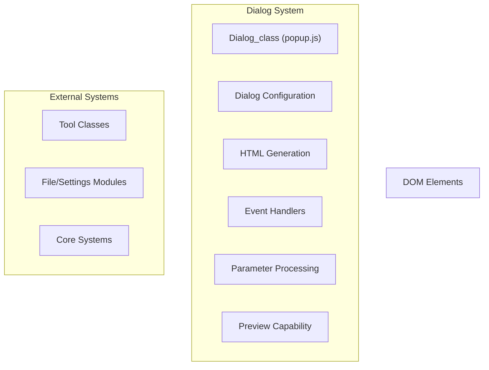
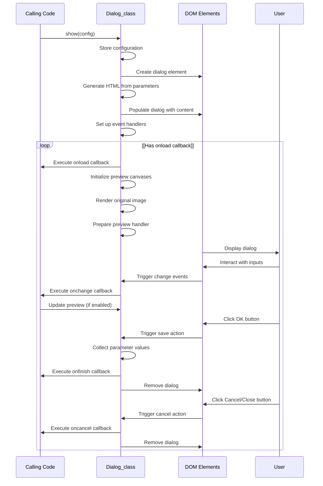
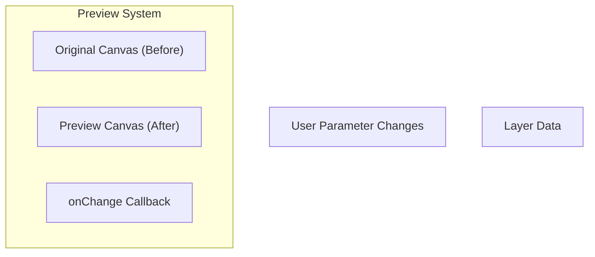
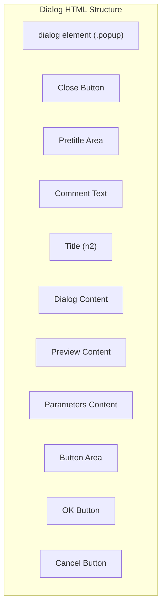

# Dialog System

> **Relevant source files**
> * [src/css/popup.css](https://github.com/viliusle/miniPaint/blob/6d0b95e5/src/css/popup.css)
> * [src/css/reset.css](https://github.com/viliusle/miniPaint/blob/6d0b95e5/src/css/reset.css)
> * [src/js/libs/popup.js](https://github.com/viliusle/miniPaint/blob/6d0b95e5/src/js/libs/popup.js)

The Dialog System in miniPaint provides a flexible modal interface for user input, configuration, and feedback. This centralized system allows tools and modules to create customizable popup dialogs with various input types, preview capabilities, and consistent styling.

## Purpose and Scope

This document covers the implementation and usage of the Dialog System, which handles all popup dialogs in miniPaint. The system manages dialog rendering, parameter input, event handling, and communication with the rest of the application. For information about specific tools that use dialogs, see [Tool Framework](/viliusle/miniPaint/2.4-tool-framework) and [Tools](/viliusle/miniPaint/4-tools).

## System Overview

The Dialog System is implemented as a standalone class (`Dialog_class`) in the popup.js file. It provides a centralized way to create and manage modal dialogs throughout the application.



Sources: [src/js/libs/popup.js L60-L674](https://github.com/viliusle/miniPaint/blob/6d0b95e5/src/js/libs/popup.js#L60-L674)

## Dialog Implementation

The Dialog System is built around the `Dialog_class` which manages the entire dialog lifecycle from creation to destruction. When initialized, it creates a global instance accessible as `window.POP`.

### Core Components

```sql
#mermaid-4meqtbgochq{font-family:ui-sans-serif,-apple-system,system-ui,Segoe UI,Helvetica;font-size:16px;fill:#333;}@keyframes edge-animation-frame{from{stroke-dashoffset:0;}}@keyframes dash{to{stroke-dashoffset:0;}}#mermaid-4meqtbgochq .edge-animation-slow{stroke-dasharray:9,5!important;stroke-dashoffset:900;animation:dash 50s linear infinite;stroke-linecap:round;}#mermaid-4meqtbgochq .edge-animation-fast{stroke-dasharray:9,5!important;stroke-dashoffset:900;animation:dash 20s linear infinite;stroke-linecap:round;}#mermaid-4meqtbgochq .error-icon{fill:#dddddd;}#mermaid-4meqtbgochq .error-text{fill:#222222;stroke:#222222;}#mermaid-4meqtbgochq .edge-thickness-normal{stroke-width:1px;}#mermaid-4meqtbgochq .edge-thickness-thick{stroke-width:3.5px;}#mermaid-4meqtbgochq .edge-pattern-solid{stroke-dasharray:0;}#mermaid-4meqtbgochq .edge-thickness-invisible{stroke-width:0;fill:none;}#mermaid-4meqtbgochq .edge-pattern-dashed{stroke-dasharray:3;}#mermaid-4meqtbgochq .edge-pattern-dotted{stroke-dasharray:2;}#mermaid-4meqtbgochq .marker{fill:#999;stroke:#999;}#mermaid-4meqtbgochq .marker.cross{stroke:#999;}#mermaid-4meqtbgochq svg{font-family:ui-sans-serif,-apple-system,system-ui,Segoe UI,Helvetica;font-size:16px;}#mermaid-4meqtbgochq p{margin:0;}#mermaid-4meqtbgochq g.classGroup text{fill:#dddddd;stroke:none;font-family:ui-sans-serif,-apple-system,system-ui,Segoe UI,Helvetica;font-size:10px;}#mermaid-4meqtbgochq g.classGroup text .title{font-weight:bolder;}#mermaid-4meqtbgochq .cluster-label text{fill:#444;}#mermaid-4meqtbgochq .cluster-label span{color:#444;}#mermaid-4meqtbgochq .cluster-label span p{background-color:transparent;}#mermaid-4meqtbgochq .cluster rect{fill:#f8f8f8;stroke:#dddddd;stroke-width:1px;}#mermaid-4meqtbgochq .cluster text{fill:#444;}#mermaid-4meqtbgochq .cluster span{color:#444;}#mermaid-4meqtbgochq .nodeLabel,#mermaid-4meqtbgochq .edgeLabel{color:#333333;}#mermaid-4meqtbgochq .noteLabel .nodeLabel,#mermaid-4meqtbgochq .noteLabel .edgeLabel{color:#333;}#mermaid-4meqtbgochq .edgeLabel .label rect{fill:#ffffff;}#mermaid-4meqtbgochq .label text{fill:#333333;}#mermaid-4meqtbgochq .labelBkg{background:#ffffff;}#mermaid-4meqtbgochq .edgeLabel .label span{background:#ffffff;}#mermaid-4meqtbgochq .classTitle{font-weight:bolder;}#mermaid-4meqtbgochq .node rect,#mermaid-4meqtbgochq .node circle,#mermaid-4meqtbgochq .node ellipse,#mermaid-4meqtbgochq .node polygon,#mermaid-4meqtbgochq .node path{fill:#ffffff;stroke:#dddddd;stroke-width:1;}#mermaid-4meqtbgochq .divider{stroke:#dddddd;stroke-width:1;}#mermaid-4meqtbgochq g.clickable{cursor:pointer;}#mermaid-4meqtbgochq g.classGroup rect{fill:#ffffff;stroke:#dddddd;}#mermaid-4meqtbgochq g.classGroup line{stroke:#dddddd;stroke-width:1;}#mermaid-4meqtbgochq .classLabel .box{stroke:none;stroke-width:0;fill:#ffffff;opacity:0.5;}#mermaid-4meqtbgochq .classLabel .label{fill:#dddddd;font-size:10px;}#mermaid-4meqtbgochq .relation{stroke:#999;stroke-width:1;fill:none;}#mermaid-4meqtbgochq .dashed-line{stroke-dasharray:3;}#mermaid-4meqtbgochq .dotted-line{stroke-dasharray:1 2;}#mermaid-4meqtbgochq [id$="-compositionStart"],#mermaid-4meqtbgochq .composition{fill:#999!important;stroke:#999!important;stroke-width:1;}#mermaid-4meqtbgochq [id$="-compositionEnd"],#mermaid-4meqtbgochq .composition{fill:#999!important;stroke:#999!important;stroke-width:1;}#mermaid-4meqtbgochq [id$="-dependencyStart"],#mermaid-4meqtbgochq .dependency{fill:#999!important;stroke:#999!important;stroke-width:1;}#mermaid-4meqtbgochq [id$="-dependencyEnd"],#mermaid-4meqtbgochq .dependency{fill:#999!important;stroke:#999!important;stroke-width:1;}#mermaid-4meqtbgochq [id$="-extensionStart"],#mermaid-4meqtbgochq .extension{fill:transparent!important;stroke:#999!important;stroke-width:1;}#mermaid-4meqtbgochq [id$="-extensionEnd"],#mermaid-4meqtbgochq .extension{fill:transparent!important;stroke:#999!important;stroke-width:1;}#mermaid-4meqtbgochq [id$="-aggregationStart"],#mermaid-4meqtbgochq .aggregation{fill:transparent!important;stroke:#999!important;stroke-width:1;}#mermaid-4meqtbgochq [id$="-aggregationEnd"],#mermaid-4meqtbgochq .aggregation{fill:transparent!important;stroke:#999!important;stroke-width:1;}#mermaid-4meqtbgochq [id$="-lollipopStart"],#mermaid-4meqtbgochq .lollipop{fill:#ffffff!important;stroke:#999!important;stroke-width:1;}#mermaid-4meqtbgochq [id$="-lollipopEnd"],#mermaid-4meqtbgochq .lollipop{fill:#ffffff!important;stroke:#999!important;stroke-width:1;}#mermaid-4meqtbgochq .edgeTerminals{font-size:11px;line-height:initial;}#mermaid-4meqtbgochq .classTitleText{text-anchor:middle;font-size:18px;fill:#333;}#mermaid-4meqtbgochq .edgeLabel[data-look="neo"]{background-color:#ffffff;text-align:center;}#mermaid-4meqtbgochq .edgeLabel[data-look="neo"] p{background-color:#ffffff;}#mermaid-4meqtbgochq .edgeLabel[data-look="neo"] rect{opacity:0.5;background-color:#ffffff;fill:#ffffff;}#mermaid-4meqtbgochq .label-icon{display:inline-block;height:1em;overflow:visible;vertical-align:-0.125em;}#mermaid-4meqtbgochq .node .label-icon path{fill:currentColor;stroke:revert;stroke-width:revert;}#mermaid-4meqtbgochq .node .neo-node{stroke:#dddddd;}#mermaid-4meqtbgochq [data-look="neo"].node rect,#mermaid-4meqtbgochq [data-look="neo"].cluster rect,#mermaid-4meqtbgochq [data-look="neo"].node polygon{stroke:url(#mermaid-4meqtbgochq-gradient);filter:drop-shadow( 1px 2px 2px rgba(185,185,185,1));}#mermaid-4meqtbgochq [data-look="neo"].node path{stroke:url(#mermaid-4meqtbgochq-gradient);stroke-width:1px;}#mermaid-4meqtbgochq [data-look="neo"].node .outer-path{filter:drop-shadow( 1px 2px 2px rgba(185,185,185,1));}#mermaid-4meqtbgochq [data-look="neo"].node .neo-line path{stroke:#dddddd;filter:none;}#mermaid-4meqtbgochq [data-look="neo"].node circle{stroke:url(#mermaid-4meqtbgochq-gradient);filter:drop-shadow( 1px 2px 2px rgba(185,185,185,1));}#mermaid-4meqtbgochq [data-look="neo"].node circle .state-start{fill:#000000;}#mermaid-4meqtbgochq [data-look="neo"].icon-shape .icon{fill:url(#mermaid-4meqtbgochq-gradient);filter:drop-shadow( 1px 2px 2px rgba(185,185,185,1));}#mermaid-4meqtbgochq [data-look="neo"].icon-shape .icon-neo path{stroke:url(#mermaid-4meqtbgochq-gradient);filter:drop-shadow( 1px 2px 2px rgba(185,185,185,1));}#mermaid-4meqtbgochq :root{--mermaid-font-family:"trebuchet ms",verdana,arial,sans-serif;}usescontainsDialog_class+el: HTMLElement+parameters: Array+onfinish: Function+oncancel: Function+onchange: Function+onload: Function+preview: Boolean+show(config)+hide(success)+get_params()+generateParamsHtml()+preview_handler()DialogConfig+title: String+params: Array+preview: Boolean+on_finish: Function+on_cancel: Function+on_change: Function+on_load: Function+className: String+comment: StringParameterObject+name: String+title: String+type: String+value: Any+values: Array+range: Array+step: Number+placeholder: String+html: String+function: Function
```

Sources: [src/js/libs/popup.js L61-L92](https://github.com/viliusle/miniPaint/blob/6d0b95e5/src/js/libs/popup.js#L61-L92)

 [src/js/libs/popup.js L97-L117](https://github.com/viliusle/miniPaint/blob/6d0b95e5/src/js/libs/popup.js#L97-L117)

### Dialog Creation Process

When a dialog is requested by any part of the application, it follows this sequence:



Sources: [src/js/libs/popup.js L99-L127](https://github.com/viliusle/miniPaint/blob/6d0b95e5/src/js/libs/popup.js#L99-L127)

 [src/js/libs/popup.js L345-L469](https://github.com/viliusle/miniPaint/blob/6d0b95e5/src/js/libs/popup.js#L345-L469)

## Dialog Configuration

The dialog configuration is a JavaScript object that defines how the dialog will look and behave:

```javascript
var settings = {    title: 'Dialog Title',    comment: 'Optional comment',    preview: true,   // Enable preview    className: '',   // Optional CSS class    params: [        {name: "param1", title: "Parameter #1:", value: "111"},        {name: "param2", title: "Parameter #2:", value: "222"},    ],    on_load: function(params){...},    on_change: function(params, canvas_preview, w, h){...},    on_finish: function(params){...},    on_cancel: function(params){...},};
```

Sources: [src/js/libs/popup.js L11-L25](https://github.com/viliusle/miniPaint/blob/6d0b95e5/src/js/libs/popup.js#L11-L25)

## Parameter Types

The dialog system supports various parameter types for different input needs:

| Parameter Type | Definition Example | Description |
| --- | --- | --- |
| Text input | `{name: "text_param", title: "Text:", value: "default"}` | Standard text input field |
| Number | `{name: "num_param", title: "Number:", value: 100}` | Numeric input field |
| Checkbox | `{name: "bool_param", title: "Enable:", value: true}` | Boolean toggle |
| Range | `{name: "range_param", title: "Amount:", value: 50, range: [0, 100], step: 1}` | Slider control with min/max values |
| Color | `{name: "color_param", title: "Color:", value: "#ff0000", type: "color"}` | Color picker |
| Select | `{name: "select_param", title: "Choose:", value: "option1", values: ["option1", "option2"]}` | Dropdown selection |
| Radio | `{name: "radio_param", title: "Mode:", value: "mode1", values: ["mode1", "mode2"]}` | Radio button group |
| Textarea | `{name: "text_area", title: "Comments:", value: "", type: "textarea"}` | Multi-line text area |
| HTML | `{html: "<b>Custom HTML content</b>"}` | Custom HTML content |
| Function | `{function: function() { return "<div>Dynamic content</div>"; }}` | Dynamic content via function |

Sources: [src/js/libs/popup.js L27-L39](https://github.com/viliusle/miniPaint/blob/6d0b95e5/src/js/libs/popup.js#L27-L39)

 [src/js/libs/popup.js L472-L622](https://github.com/viliusle/miniPaint/blob/6d0b95e5/src/js/libs/popup.js#L472-L622)

## Preview Functionality

The dialog system includes a powerful preview capability that allows tools to show users the effect of their parameter settings in real-time:



When preview is enabled:

1. The original image is shown on the left preview canvas
2. A copy is shown on the right preview canvas
3. When parameters change, the `on_change` callback is invoked
4. The callback can modify the right canvas to show the effect of current parameters

Sources: [src/js/libs/popup.js L358-L465](https://github.com/viliusle/miniPaint/blob/6d0b95e5/src/js/libs/popup.js#L358-L465)

 [src/js/libs/popup.js L234-L260](https://github.com/viliusle/miniPaint/blob/6d0b95e5/src/js/libs/popup.js#L234-L260)

## Dialog HTML Structure

The dialog's DOM structure follows this template:



Sources: [src/js/libs/popup.js L46-L59](https://github.com/viliusle/miniPaint/blob/6d0b95e5/src/js/libs/popup.js#L46-L59)

 [src/css/popup.css L8-L27](https://github.com/viliusle/miniPaint/blob/6d0b95e5/src/css/popup.css#L8-L27)

## Event Handling

The dialog system implements several key event handlers:

1. **Keyboard Events**: Escape key closes the dialog
2. **Mouse Events**: Enables dragging the dialog by its title bar
3. **Window Events**: Resets position on window resize
4. **Input Events**: Handles parameter changes and triggers callbacks

Dialog events are carefully managed to prevent memory leaks by storing and removing all event listeners when the dialog is closed.

Sources: [src/js/libs/popup.js L167-L231](https://github.com/viliusle/miniPaint/blob/6d0b95e5/src/js/libs/popup.js#L167-L231)

 [src/js/libs/popup.js L405-L432](https://github.com/viliusle/miniPaint/blob/6d0b95e5/src/js/libs/popup.js#L405-L432)

## Parameter Processing

When a dialog is submitted, the `get_params()` method collects all parameter values from the DOM and returns them to the caller:

```mermaid
flowchart TD

mermaid-xn4parjp58m-flowchart-GetParams["get_params() Method"]
mermaid-xn4parjp58m-flowchart-CollectInputs["Collect Input Values"]
mermaid-xn4parjp58m-flowchart-CollectSelects["Collect Select Values"]
mermaid-xn4parjp58m-flowchart-CollectTextareas["Collect Textarea Values"]
mermaid-xn4parjp58m-flowchart-BuildResponse["Build Response Object"]
mermaid-xn4parjp58m-flowchart-ReturnValues["Return Parameter Values"]
```



The system handles various input types differently to ensure proper type conversion (numbers, booleans, etc.).

Sources: [src/js/libs/popup.js L289-L339](https://github.com/viliusle/miniPaint/blob/6d0b95e5/src/js/libs/popup.js#L289-L339)

## Styling and Theming

The dialog system has dedicated CSS styles in `popup.css` that control its appearance. These styles integrate with the theme system to maintain consistency across the application.

Key styling features include:

* Responsive layout for different screen sizes
* Consistent input field styling
* Draggable dialog windows
* Proper scrolling for content exceeding the viewport

Sources: [src/css/popup.css L1-L271](https://github.com/viliusle/miniPaint/blob/6d0b95e5/src/css/popup.css#L1-L271)

 [src/css/reset.css L1-L230](https://github.com/viliusle/miniPaint/blob/6d0b95e5/src/css/reset.css#L1-L230)

## Usage Example

To use the dialog system, create a configuration object and call the `show()` method:

```javascript
// Create a dialog configurationvar config = {    title: 'Adjust Brightness',    preview: true,    params: [        {name: "brightness", title: "Brightness:", value: 0, range: [-100, 100]}    ],    on_change: function(params, preview_ctx, width, height) {        // Update preview with current brightness setting        // ...    },    on_finish: function(params) {        // Apply brightness to the actual image        // ...    }}; // Show the dialogPOP.show(config);
```

The dialog system is a crucial part of miniPaint's user interface, providing a consistent way for users to interact with tools and configure settings throughout the application.

Sources: [src/js/libs/popup.js L1-L40](https://github.com/viliusle/miniPaint/blob/6d0b95e5/src/js/libs/popup.js#L1-L40)