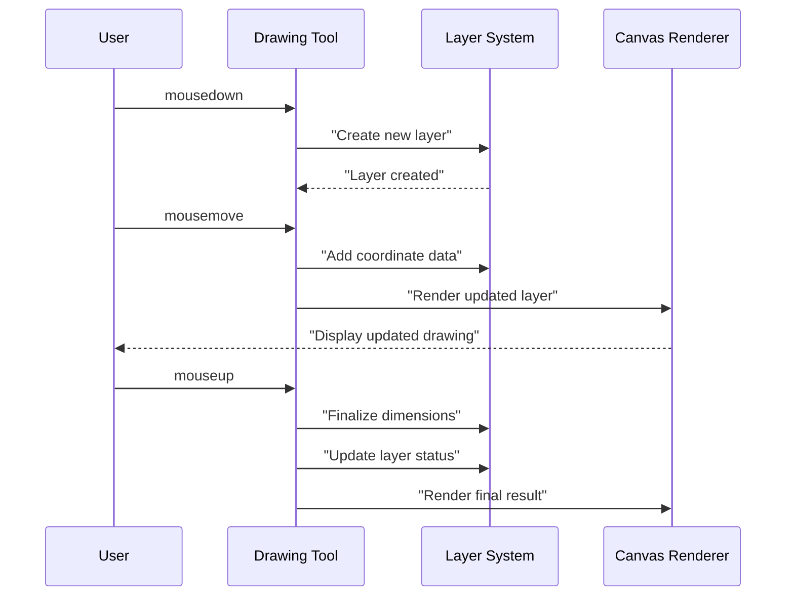
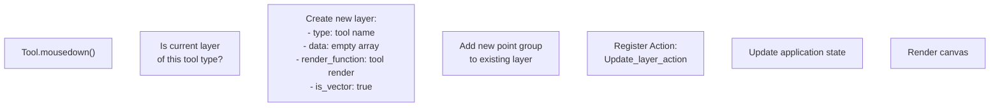

# Drawing Tools

> **Relevant source files**
> * [src/js/tools/brush.js](https://github.com/viliusle/miniPaint/blob/6d0b95e5/src/js/tools/brush.js)
> * [src/js/tools/gradient.js](https://github.com/viliusle/miniPaint/blob/6d0b95e5/src/js/tools/gradient.js)
> * [src/js/tools/pencil.js](https://github.com/viliusle/miniPaint/blob/6d0b95e5/src/js/tools/pencil.js)

## Purpose and Scope

This document covers the implementation and functionality of drawing tools in miniPaint. Drawing tools allow users to create freeform content on the canvas. This page focuses on brush, pencil, and gradient tools which form the foundation of content creation in the application. For information about shape-based drawing tools, see [Shape Tools](/viliusle/miniPaint/4.3-shape-tools). For selection tools, see [Selection Tools](/viliusle/miniPaint/4.2-selection-tools).

## Overview

Drawing tools in miniPaint allow users to create vector-based content through mouse or touch interactions. Each drawing tool inherits from the base tool class and implements specific rendering methods to achieve different drawing effects and appearances.

```sql
#mermaid-1tu8b0tk7o9{font-family:ui-sans-serif,-apple-system,system-ui,Segoe UI,Helvetica;font-size:16px;fill:#333;}@keyframes edge-animation-frame{from{stroke-dashoffset:0;}}@keyframes dash{to{stroke-dashoffset:0;}}#mermaid-1tu8b0tk7o9 .edge-animation-slow{stroke-dasharray:9,5!important;stroke-dashoffset:900;animation:dash 50s linear infinite;stroke-linecap:round;}#mermaid-1tu8b0tk7o9 .edge-animation-fast{stroke-dasharray:9,5!important;stroke-dashoffset:900;animation:dash 20s linear infinite;stroke-linecap:round;}#mermaid-1tu8b0tk7o9 .error-icon{fill:#dddddd;}#mermaid-1tu8b0tk7o9 .error-text{fill:#222222;stroke:#222222;}#mermaid-1tu8b0tk7o9 .edge-thickness-normal{stroke-width:1px;}#mermaid-1tu8b0tk7o9 .edge-thickness-thick{stroke-width:3.5px;}#mermaid-1tu8b0tk7o9 .edge-pattern-solid{stroke-dasharray:0;}#mermaid-1tu8b0tk7o9 .edge-thickness-invisible{stroke-width:0;fill:none;}#mermaid-1tu8b0tk7o9 .edge-pattern-dashed{stroke-dasharray:3;}#mermaid-1tu8b0tk7o9 .edge-pattern-dotted{stroke-dasharray:2;}#mermaid-1tu8b0tk7o9 .marker{fill:#999;stroke:#999;}#mermaid-1tu8b0tk7o9 .marker.cross{stroke:#999;}#mermaid-1tu8b0tk7o9 svg{font-family:ui-sans-serif,-apple-system,system-ui,Segoe UI,Helvetica;font-size:16px;}#mermaid-1tu8b0tk7o9 p{margin:0;}#mermaid-1tu8b0tk7o9 g.classGroup text{fill:#dddddd;stroke:none;font-family:ui-sans-serif,-apple-system,system-ui,Segoe UI,Helvetica;font-size:10px;}#mermaid-1tu8b0tk7o9 g.classGroup text .title{font-weight:bolder;}#mermaid-1tu8b0tk7o9 .cluster-label text{fill:#444;}#mermaid-1tu8b0tk7o9 .cluster-label span{color:#444;}#mermaid-1tu8b0tk7o9 .cluster-label span p{background-color:transparent;}#mermaid-1tu8b0tk7o9 .cluster rect{fill:#f8f8f8;stroke:#dddddd;stroke-width:1px;}#mermaid-1tu8b0tk7o9 .cluster text{fill:#444;}#mermaid-1tu8b0tk7o9 .cluster span{color:#444;}#mermaid-1tu8b0tk7o9 .nodeLabel,#mermaid-1tu8b0tk7o9 .edgeLabel{color:#333333;}#mermaid-1tu8b0tk7o9 .noteLabel .nodeLabel,#mermaid-1tu8b0tk7o9 .noteLabel .edgeLabel{color:#333;}#mermaid-1tu8b0tk7o9 .edgeLabel .label rect{fill:#ffffff;}#mermaid-1tu8b0tk7o9 .label text{fill:#333333;}#mermaid-1tu8b0tk7o9 .labelBkg{background:#ffffff;}#mermaid-1tu8b0tk7o9 .edgeLabel .label span{background:#ffffff;}#mermaid-1tu8b0tk7o9 .classTitle{font-weight:bolder;}#mermaid-1tu8b0tk7o9 .node rect,#mermaid-1tu8b0tk7o9 .node circle,#mermaid-1tu8b0tk7o9 .node ellipse,#mermaid-1tu8b0tk7o9 .node polygon,#mermaid-1tu8b0tk7o9 .node path{fill:#ffffff;stroke:#dddddd;stroke-width:1;}#mermaid-1tu8b0tk7o9 .divider{stroke:#dddddd;stroke-width:1;}#mermaid-1tu8b0tk7o9 g.clickable{cursor:pointer;}#mermaid-1tu8b0tk7o9 g.classGroup rect{fill:#ffffff;stroke:#dddddd;}#mermaid-1tu8b0tk7o9 g.classGroup line{stroke:#dddddd;stroke-width:1;}#mermaid-1tu8b0tk7o9 .classLabel .box{stroke:none;stroke-width:0;fill:#ffffff;opacity:0.5;}#mermaid-1tu8b0tk7o9 .classLabel .label{fill:#dddddd;font-size:10px;}#mermaid-1tu8b0tk7o9 .relation{stroke:#999;stroke-width:1;fill:none;}#mermaid-1tu8b0tk7o9 .dashed-line{stroke-dasharray:3;}#mermaid-1tu8b0tk7o9 .dotted-line{stroke-dasharray:1 2;}#mermaid-1tu8b0tk7o9 [id$="-compositionStart"],#mermaid-1tu8b0tk7o9 .composition{fill:#999!important;stroke:#999!important;stroke-width:1;}#mermaid-1tu8b0tk7o9 [id$="-compositionEnd"],#mermaid-1tu8b0tk7o9 .composition{fill:#999!important;stroke:#999!important;stroke-width:1;}#mermaid-1tu8b0tk7o9 [id$="-dependencyStart"],#mermaid-1tu8b0tk7o9 .dependency{fill:#999!important;stroke:#999!important;stroke-width:1;}#mermaid-1tu8b0tk7o9 [id$="-dependencyEnd"],#mermaid-1tu8b0tk7o9 .dependency{fill:#999!important;stroke:#999!important;stroke-width:1;}#mermaid-1tu8b0tk7o9 [id$="-extensionStart"],#mermaid-1tu8b0tk7o9 .extension{fill:transparent!important;stroke:#999!important;stroke-width:1;}#mermaid-1tu8b0tk7o9 [id$="-extensionEnd"],#mermaid-1tu8b0tk7o9 .extension{fill:transparent!important;stroke:#999!important;stroke-width:1;}#mermaid-1tu8b0tk7o9 [id$="-aggregationStart"],#mermaid-1tu8b0tk7o9 .aggregation{fill:transparent!important;stroke:#999!important;stroke-width:1;}#mermaid-1tu8b0tk7o9 [id$="-aggregationEnd"],#mermaid-1tu8b0tk7o9 .aggregation{fill:transparent!important;stroke:#999!important;stroke-width:1;}#mermaid-1tu8b0tk7o9 [id$="-lollipopStart"],#mermaid-1tu8b0tk7o9 .lollipop{fill:#ffffff!important;stroke:#999!important;stroke-width:1;}#mermaid-1tu8b0tk7o9 [id$="-lollipopEnd"],#mermaid-1tu8b0tk7o9 .lollipop{fill:#ffffff!important;stroke:#999!important;stroke-width:1;}#mermaid-1tu8b0tk7o9 .edgeTerminals{font-size:11px;line-height:initial;}#mermaid-1tu8b0tk7o9 .classTitleText{text-anchor:middle;font-size:18px;fill:#333;}#mermaid-1tu8b0tk7o9 .edgeLabel[data-look="neo"]{background-color:#ffffff;text-align:center;}#mermaid-1tu8b0tk7o9 .edgeLabel[data-look="neo"] p{background-color:#ffffff;}#mermaid-1tu8b0tk7o9 .edgeLabel[data-look="neo"] rect{opacity:0.5;background-color:#ffffff;fill:#ffffff;}#mermaid-1tu8b0tk7o9 .label-icon{display:inline-block;height:1em;overflow:visible;vertical-align:-0.125em;}#mermaid-1tu8b0tk7o9 .node .label-icon path{fill:currentColor;stroke:revert;stroke-width:revert;}#mermaid-1tu8b0tk7o9 .node .neo-node{stroke:#dddddd;}#mermaid-1tu8b0tk7o9 [data-look="neo"].node rect,#mermaid-1tu8b0tk7o9 [data-look="neo"].cluster rect,#mermaid-1tu8b0tk7o9 [data-look="neo"].node polygon{stroke:url(#mermaid-1tu8b0tk7o9-gradient);filter:drop-shadow( 1px 2px 2px rgba(185,185,185,1));}#mermaid-1tu8b0tk7o9 [data-look="neo"].node path{stroke:url(#mermaid-1tu8b0tk7o9-gradient);stroke-width:1px;}#mermaid-1tu8b0tk7o9 [data-look="neo"].node .outer-path{filter:drop-shadow( 1px 2px 2px rgba(185,185,185,1));}#mermaid-1tu8b0tk7o9 [data-look="neo"].node .neo-line path{stroke:#dddddd;filter:none;}#mermaid-1tu8b0tk7o9 [data-look="neo"].node circle{stroke:url(#mermaid-1tu8b0tk7o9-gradient);filter:drop-shadow( 1px 2px 2px rgba(185,185,185,1));}#mermaid-1tu8b0tk7o9 [data-look="neo"].node circle .state-start{fill:#000000;}#mermaid-1tu8b0tk7o9 [data-look="neo"].icon-shape .icon{fill:url(#mermaid-1tu8b0tk7o9-gradient);filter:drop-shadow( 1px 2px 2px rgba(185,185,185,1));}#mermaid-1tu8b0tk7o9 [data-look="neo"].icon-shape .icon-neo path{stroke:url(#mermaid-1tu8b0tk7o9-gradient);filter:drop-shadow( 1px 2px 2px rgba(185,185,185,1));}#mermaid-1tu8b0tk7o9 :root{--mermaid-font-family:"trebuchet ms",verdana,arial,sans-serif;}Base_tools_class+load()+mousedown()+mousemove()+mouseup()+render()+getParams()Brush_class+name: "brush"+pressure_supported+render_stabilized()+check_dimensions()Pencil_class+name: "pencil"+render_aliased()+draw_simple_line()Gradient_class+name: "gradient"+linear/radial modes
```

Sources: [src/js/tools/brush.js L6-L12](https://github.com/viliusle/miniPaint/blob/6d0b95e5/src/js/tools/brush.js#L6-L12)

 [src/js/tools/pencil.js L6-L12](https://github.com/viliusle/miniPaint/blob/6d0b95e5/src/js/tools/pencil.js#L6-L12)

 [src/js/tools/gradient.js L7-L16](https://github.com/viliusle/miniPaint/blob/6d0b95e5/src/js/tools/gradient.js#L7-L16)

## Common Architecture

Drawing tools follow a consistent pattern for handling user interactions and rendering content:

1. **Event Registration**: Tools register mouse, touch, and pointer event handlers in their `load()` method
2. **Action Methods**: Implement `mousedown`, `mousemove`, and `mouseup` methods to handle drawing interactions
3. **Layer Creation**: Create a dedicated vector layer when drawing begins
4. **Data Storage**: Store drawing data as coordinate arrays with size information
5. **Rendering**: Implement custom `render()` methods for drawing to the canvas



Sources: [src/js/tools/brush.js L22-L61](https://github.com/viliusle/miniPaint/blob/6d0b95e5/src/js/tools/brush.js#L22-L61)

 [src/js/tools/pencil.js L18-L30](https://github.com/viliusle/miniPaint/blob/6d0b95e5/src/js/tools/pencil.js#L18-L30)

 [src/js/tools/gradient.js L18-L20](https://github.com/viliusle/miniPaint/blob/6d0b95e5/src/js/tools/gradient.js#L18-L20)

## Brush Tool

The brush tool provides smooth, pressure-sensitive drawing with anti-aliased edges. It creates vector-based content stored as coordinate points.

### Implementation

The brush tool is implemented in the `Brush_class` which extends `Base_tools_class`. Key aspects include:

* **Pressure Sensitivity**: Detects and responds to pen pressure on compatible devices
* **Speed-based Size**: Adjusts line width based on drawing speed when pressure isn't available
* **Vector Storage**: Stores drawing data as coordinate points with size information
* **Stabilized Rendering**: Uses curve smoothing algorithms for natural-looking lines

### Input Handling

The brush tool handles multiple input methods:

1. **Pointer Events**: Primary method for pressure-sensitive input (pen/stylus)
2. **Mouse Events**: Standard drawing without pressure
3. **Touch Events**: Mobile device support with multi-touch capabilities

```mermaid
flowchart TD

mermaid-kudspgqehr-flowchart-Start["Brush Tool Activated"]
mermaid-kudspgqehr-flowchart-InputDetection["Input Type?"]
mermaid-kudspgqehr-flowchart-PressureCheck["Support<br>Pressure?"]
mermaid-kudspgqehr-flowchart-MouseHandler["Handle as<br>standard input"]
mermaid-kudspgqehr-flowchart-TouchHandler["Handle as<br>touch input"]
mermaid-kudspgqehr-flowchart-PressureAware["Use pressure values<br>for line width"]
mermaid-kudspgqehr-flowchart-SpeedBased["Use speed-based<br>line width"]
mermaid-kudspgqehr-flowchart-CreateStroke["Create brush stroke"]
mermaid-kudspgqehr-flowchart-RenderChoice["Pressure<br>enabled?"]
mermaid-kudspgqehr-flowchart-StandardRender["Render<br>pressure-variable<br>lines"]
mermaid-kudspgqehr-flowchart-StabilizedRender["Render<br>stabilized<br>smooth lines"]
mermaid-kudspgqehr-flowchart-Complete["Complete<br>Brush Stroke"]
```



Sources: [src/js/tools/brush.js L22-L73](https://github.com/viliusle/miniPaint/blob/6d0b95e5/src/js/tools/brush.js#L22-L73)

 [src/js/tools/brush.js L83-L195](https://github.com/viliusle/miniPaint/blob/6d0b95e5/src/js/tools/brush.js#L83-L195)

### Data Format

Brush data is stored in a nested array structure:

* Outer array: Contains groups of points (each group represents a continuous stroke)
* Inner arrays: Individual points as [x, y, size] where size can vary with pressure

### Rendering Process

Two rendering methods are available:

1. **Pressure-variable rendering**: Draws lines with varying thickness based on stored size data
2. **Stabilized rendering**: Applies smoothing algorithm for natural curves

The stabilized rendering method uses a multi-pass smoothing algorithm that:

1. Calculates midpoints between consecutive points
2. Recursively smooths the resulting point set
3. Renders using quadratic curve commands

Sources: [src/js/tools/brush.js L339-L411](https://github.com/viliusle/miniPaint/blob/6d0b95e5/src/js/tools/brush.js#L339-L411)

 [src/js/tools/brush.js L421-L489](https://github.com/viliusle/miniPaint/blob/6d0b95e5/src/js/tools/brush.js#L421-L489)

## Pencil Tool

The pencil tool creates aliased (non-anti-aliased) lines for pixel-precise drawing. It produces sharp, blocky lines compared to the brush's smooth strokes.

### Implementation

The pencil tool is implemented in the `Pencil_class` which extends `Base_tools_class`. Key aspects include:

* **Aliased Rendering**: Creates sharp, pixel-perfect lines without anti-aliasing
* **Simple Line Algorithm**: Draws lines pixel-by-pixel rather than using canvas stroke operations
* **Optional Pressure**: Supports pressure sensitivity but maintains pixel-precise rendering

### Data Format

Pencil data is stored in a flat array of points, with null values indicating breaks between strokes:

* Each point is stored as [x, y, size]
* A null entry indicates lifting the pencil (starting a new stroke)

### Rendering Process

The pencil uses a custom line drawing algorithm:

1. For each line segment, calculates the pixel path between endpoints
2. Renders each pixel as a small rectangle
3. Maintains sharp edges by avoiding anti-aliasing

```mermaid
flowchart TD

mermaid-okstjhab2s-flowchart-Start["Pencil Render Start"]
mermaid-okstjhab2s-flowchart-DataCheck["Has drawing<br>data?"]
mermaid-okstjhab2s-flowchart-End["End - Nothing to render"]
mermaid-okstjhab2s-flowchart-PrepareContext["Set drawing context<br>(color, transform)"]
mermaid-okstjhab2s-flowchart-LoopPoints["Loop through<br>all points"]
mermaid-okstjhab2s-flowchart-PointCheck["Point type?"]
mermaid-okstjhab2s-flowchart-NewStroke["Begin new stroke"]
mermaid-okstjhab2s-flowchart-CheckPrevious["Previous<br>point exists?"]
mermaid-okstjhab2s-flowchart-DrawPoint["Draw single point<br>as small rectangle"]
mermaid-okstjhab2s-flowchart-DrawLine["Draw aliased line<br>using draw_simple_line()"]
mermaid-okstjhab2s-flowchart-RestoreContext["Restore context"]
```



Sources: [src/js/tools/pencil.js L159-L233](https://github.com/viliusle/miniPaint/blob/6d0b95e5/src/js/tools/pencil.js#L159-L233)

 [src/js/tools/pencil.js L245-L257](https://github.com/viliusle/miniPaint/blob/6d0b95e5/src/js/tools/pencil.js#L245-L257)

## Gradient Tool

The gradient tool creates gradient fills, either linear or radial, defining the color transition based on the drag operation.

### Implementation

The gradient tool is implemented in the `Gradient_class` which extends `Base_tools_class`. Key aspects include:

* **Two Modes**: Supports both linear and radial gradient types
* **Two-Color System**: Creates gradients between two selected colors
* **Alpha Support**: Supports transparency in the gradient
* **Drag-to-Define**: Uses mouse drag to define gradient size, direction, and radius

### Creation Process

1. Initial click sets the gradient's starting point
2. Dragging defines the gradient's size and direction
3. For radial gradients, drag defines the radius from center

### Rendering Process

The gradient tool uses the Canvas API's gradient functions:

* `createLinearGradient()` for linear gradients
* `createRadialGradient()` for radial gradients

The rendering process handles:

1. Color conversion to RGBA format
2. Alpha channel application
3. Gradient stop positioning
4. Canvas filling

Sources: [src/js/tools/gradient.js L22-L125](https://github.com/viliusle/miniPaint/blob/6d0b95e5/src/js/tools/gradient.js#L22-L125)

 [src/js/tools/gradient.js L127-L181](https://github.com/viliusle/miniPaint/blob/6d0b95e5/src/js/tools/gradient.js#L127-L181)

## Layer Management

Drawing tools interact with the layer system to create and update content. Each tool:

1. Creates a dedicated vector layer when drawing begins
2. Updates layer data during the drawing operation
3. Adjusts layer dimensions based on drawing bounds when complete
4. Manages layer properties like position and dimensions

### Layer Creation

When drawing starts, tools create a new layer with specific properties:



Sources: [src/js/tools/brush.js L197-L236](https://github.com/viliusle/miniPaint/blob/6d0b95e5/src/js/tools/brush.js#L197-L236)

 [src/js/tools/pencil.js L57-L101](https://github.com/viliusle/miniPaint/blob/6d0b95e5/src/js/tools/pencil.js#L57-L101)

 [src/js/tools/gradient.js L22-L56](https://github.com/viliusle/miniPaint/blob/6d0b95e5/src/js/tools/gradient.js#L22-L56)

### Dimension Calculation

After drawing is complete, tools recalculate the layer dimensions to optimize storage and rendering:

1. Find the minimum and maximum x/y coordinates used in the drawing
2. Update layer position (x, y) based on minimum values
3. Update layer dimensions (width, height) based on coordinate range
4. Adjust coordinate data to be relative to the new layer position

This ensures that layers only occupy the space they need on the canvas.

Sources: [src/js/tools/brush.js L516-L566](https://github.com/viliusle/miniPaint/blob/6d0b95e5/src/js/tools/brush.js#L516-L566)

 [src/js/tools/pencil.js L262-L302](https://github.com/viliusle/miniPaint/blob/6d0b95e5/src/js/tools/pencil.js#L262-L302)

## Summary

Drawing tools form the foundation of content creation in miniPaint. The tools follow a consistent architecture while implementing specialized rendering techniques to achieve different artistic effects. By working with the layer system and state management, drawing tools provide a vector-based drawing experience that supports undo/redo and maintains high-quality output.

* **Brush**: Smooth, anti-aliased strokes with pressure sensitivity and curve smoothing
* **Pencil**: Aliased, pixel-perfect lines for precise drawing
* **Gradient**: Linear and radial color transitions

All drawing tools are implemented as JavaScript classes that extend the base tool class and work within the application's layer-based architecture and state management system.