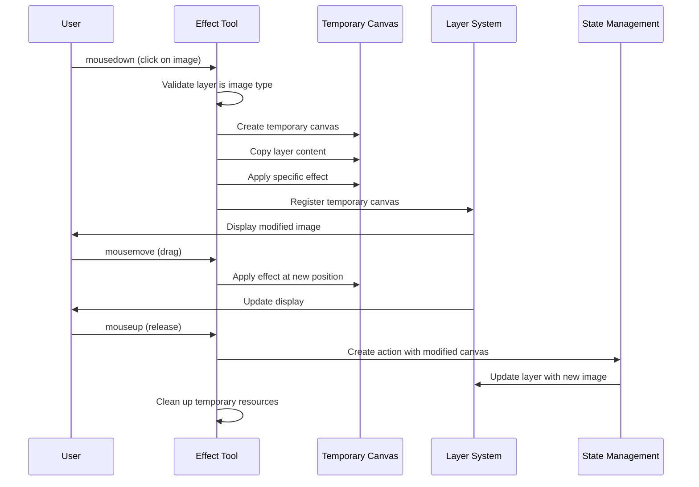

# Effect Tools

> **Relevant source files**
> * [images/icons/magic_erase.svg](https://github.com/viliusle/miniPaint/blob/6d0b95e5/images/icons/magic_erase.svg)
> * [src/js/modules/effects/abstract/css.js](https://github.com/viliusle/miniPaint/blob/6d0b95e5/src/js/modules/effects/abstract/css.js)
> * [src/js/modules/effects/common/blur.js](https://github.com/viliusle/miniPaint/blob/6d0b95e5/src/js/modules/effects/common/blur.js)
> * [src/js/modules/effects/common/brightness.js](https://github.com/viliusle/miniPaint/blob/6d0b95e5/src/js/modules/effects/common/brightness.js)
> * [src/js/modules/effects/common/contrast.js](https://github.com/viliusle/miniPaint/blob/6d0b95e5/src/js/modules/effects/common/contrast.js)
> * [src/js/modules/effects/common/grayscale.js](https://github.com/viliusle/miniPaint/blob/6d0b95e5/src/js/modules/effects/common/grayscale.js)
> * [src/js/modules/effects/common/hue-rotate.js](https://github.com/viliusle/miniPaint/blob/6d0b95e5/src/js/modules/effects/common/hue-rotate.js)
> * [src/js/modules/effects/common/invert.js](https://github.com/viliusle/miniPaint/blob/6d0b95e5/src/js/modules/effects/common/invert.js)
> * [src/js/modules/effects/common/saturate.js](https://github.com/viliusle/miniPaint/blob/6d0b95e5/src/js/modules/effects/common/saturate.js)
> * [src/js/modules/effects/common/sepia.js](https://github.com/viliusle/miniPaint/blob/6d0b95e5/src/js/modules/effects/common/sepia.js)
> * [src/js/modules/effects/common/shadow.js](https://github.com/viliusle/miniPaint/blob/6d0b95e5/src/js/modules/effects/common/shadow.js)
> * [src/js/tools/blur.js](https://github.com/viliusle/miniPaint/blob/6d0b95e5/src/js/tools/blur.js)
> * [src/js/tools/bulge_pinch.js](https://github.com/viliusle/miniPaint/blob/6d0b95e5/src/js/tools/bulge_pinch.js)
> * [src/js/tools/clone.js](https://github.com/viliusle/miniPaint/blob/6d0b95e5/src/js/tools/clone.js)
> * [src/js/tools/desaturate.js](https://github.com/viliusle/miniPaint/blob/6d0b95e5/src/js/tools/desaturate.js)
> * [src/js/tools/erase.js](https://github.com/viliusle/miniPaint/blob/6d0b95e5/src/js/tools/erase.js)
> * [src/js/tools/fill.js](https://github.com/viliusle/miniPaint/blob/6d0b95e5/src/js/tools/fill.js)
> * [src/js/tools/magic_erase.js](https://github.com/viliusle/miniPaint/blob/6d0b95e5/src/js/tools/magic_erase.js)
> * [src/js/tools/sharpen.js](https://github.com/viliusle/miniPaint/blob/6d0b95e5/src/js/tools/sharpen.js)

## Purpose and Scope

This document covers the effect tools available in miniPaint and how they modify images. Effect tools allow users to apply various effects to specific areas of an image by clicking and dragging. This is distinct from layer-wide effects and filters covered in [Effects & Filters](/viliusle/miniPaint/5.2-effects-and-filters), which apply to entire layers.

## Overview of Effect Tools

Effect tools in miniPaint are specialized tools that modify the appearance of images by applying visual transformations to specific areas. These tools work directly on the pixel data of raster layers and require the targeted layer to be an image type layer.

```sql
#mermaid-j9lvy0h501a{font-family:ui-sans-serif,-apple-system,system-ui,Segoe UI,Helvetica;font-size:16px;fill:#333;}@keyframes edge-animation-frame{from{stroke-dashoffset:0;}}@keyframes dash{to{stroke-dashoffset:0;}}#mermaid-j9lvy0h501a .edge-animation-slow{stroke-dasharray:9,5!important;stroke-dashoffset:900;animation:dash 50s linear infinite;stroke-linecap:round;}#mermaid-j9lvy0h501a .edge-animation-fast{stroke-dasharray:9,5!important;stroke-dashoffset:900;animation:dash 20s linear infinite;stroke-linecap:round;}#mermaid-j9lvy0h501a .error-icon{fill:#dddddd;}#mermaid-j9lvy0h501a .error-text{fill:#222222;stroke:#222222;}#mermaid-j9lvy0h501a .edge-thickness-normal{stroke-width:1px;}#mermaid-j9lvy0h501a .edge-thickness-thick{stroke-width:3.5px;}#mermaid-j9lvy0h501a .edge-pattern-solid{stroke-dasharray:0;}#mermaid-j9lvy0h501a .edge-thickness-invisible{stroke-width:0;fill:none;}#mermaid-j9lvy0h501a .edge-pattern-dashed{stroke-dasharray:3;}#mermaid-j9lvy0h501a .edge-pattern-dotted{stroke-dasharray:2;}#mermaid-j9lvy0h501a .marker{fill:#999;stroke:#999;}#mermaid-j9lvy0h501a .marker.cross{stroke:#999;}#mermaid-j9lvy0h501a svg{font-family:ui-sans-serif,-apple-system,system-ui,Segoe UI,Helvetica;font-size:16px;}#mermaid-j9lvy0h501a p{margin:0;}#mermaid-j9lvy0h501a g.classGroup text{fill:#dddddd;stroke:none;font-family:ui-sans-serif,-apple-system,system-ui,Segoe UI,Helvetica;font-size:10px;}#mermaid-j9lvy0h501a g.classGroup text .title{font-weight:bolder;}#mermaid-j9lvy0h501a .cluster-label text{fill:#444;}#mermaid-j9lvy0h501a .cluster-label span{color:#444;}#mermaid-j9lvy0h501a .cluster-label span p{background-color:transparent;}#mermaid-j9lvy0h501a .cluster rect{fill:#f8f8f8;stroke:#dddddd;stroke-width:1px;}#mermaid-j9lvy0h501a .cluster text{fill:#444;}#mermaid-j9lvy0h501a .cluster span{color:#444;}#mermaid-j9lvy0h501a .nodeLabel,#mermaid-j9lvy0h501a .edgeLabel{color:#333333;}#mermaid-j9lvy0h501a .noteLabel .nodeLabel,#mermaid-j9lvy0h501a .noteLabel .edgeLabel{color:#333;}#mermaid-j9lvy0h501a .edgeLabel .label rect{fill:#ffffff;}#mermaid-j9lvy0h501a .label text{fill:#333333;}#mermaid-j9lvy0h501a .labelBkg{background:#ffffff;}#mermaid-j9lvy0h501a .edgeLabel .label span{background:#ffffff;}#mermaid-j9lvy0h501a .classTitle{font-weight:bolder;}#mermaid-j9lvy0h501a .node rect,#mermaid-j9lvy0h501a .node circle,#mermaid-j9lvy0h501a .node ellipse,#mermaid-j9lvy0h501a .node polygon,#mermaid-j9lvy0h501a .node path{fill:#ffffff;stroke:#dddddd;stroke-width:1;}#mermaid-j9lvy0h501a .divider{stroke:#dddddd;stroke-width:1;}#mermaid-j9lvy0h501a g.clickable{cursor:pointer;}#mermaid-j9lvy0h501a g.classGroup rect{fill:#ffffff;stroke:#dddddd;}#mermaid-j9lvy0h501a g.classGroup line{stroke:#dddddd;stroke-width:1;}#mermaid-j9lvy0h501a .classLabel .box{stroke:none;stroke-width:0;fill:#ffffff;opacity:0.5;}#mermaid-j9lvy0h501a .classLabel .label{fill:#dddddd;font-size:10px;}#mermaid-j9lvy0h501a .relation{stroke:#999;stroke-width:1;fill:none;}#mermaid-j9lvy0h501a .dashed-line{stroke-dasharray:3;}#mermaid-j9lvy0h501a .dotted-line{stroke-dasharray:1 2;}#mermaid-j9lvy0h501a [id$="-compositionStart"],#mermaid-j9lvy0h501a .composition{fill:#999!important;stroke:#999!important;stroke-width:1;}#mermaid-j9lvy0h501a [id$="-compositionEnd"],#mermaid-j9lvy0h501a .composition{fill:#999!important;stroke:#999!important;stroke-width:1;}#mermaid-j9lvy0h501a [id$="-dependencyStart"],#mermaid-j9lvy0h501a .dependency{fill:#999!important;stroke:#999!important;stroke-width:1;}#mermaid-j9lvy0h501a [id$="-dependencyEnd"],#mermaid-j9lvy0h501a .dependency{fill:#999!important;stroke:#999!important;stroke-width:1;}#mermaid-j9lvy0h501a [id$="-extensionStart"],#mermaid-j9lvy0h501a .extension{fill:transparent!important;stroke:#999!important;stroke-width:1;}#mermaid-j9lvy0h501a [id$="-extensionEnd"],#mermaid-j9lvy0h501a .extension{fill:transparent!important;stroke:#999!important;stroke-width:1;}#mermaid-j9lvy0h501a [id$="-aggregationStart"],#mermaid-j9lvy0h501a .aggregation{fill:transparent!important;stroke:#999!important;stroke-width:1;}#mermaid-j9lvy0h501a [id$="-aggregationEnd"],#mermaid-j9lvy0h501a .aggregation{fill:transparent!important;stroke:#999!important;stroke-width:1;}#mermaid-j9lvy0h501a [id$="-lollipopStart"],#mermaid-j9lvy0h501a .lollipop{fill:#ffffff!important;stroke:#999!important;stroke-width:1;}#mermaid-j9lvy0h501a [id$="-lollipopEnd"],#mermaid-j9lvy0h501a .lollipop{fill:#ffffff!important;stroke:#999!important;stroke-width:1;}#mermaid-j9lvy0h501a .edgeTerminals{font-size:11px;line-height:initial;}#mermaid-j9lvy0h501a .classTitleText{text-anchor:middle;font-size:18px;fill:#333;}#mermaid-j9lvy0h501a .edgeLabel[data-look="neo"]{background-color:#ffffff;text-align:center;}#mermaid-j9lvy0h501a .edgeLabel[data-look="neo"] p{background-color:#ffffff;}#mermaid-j9lvy0h501a .edgeLabel[data-look="neo"] rect{opacity:0.5;background-color:#ffffff;fill:#ffffff;}#mermaid-j9lvy0h501a .label-icon{display:inline-block;height:1em;overflow:visible;vertical-align:-0.125em;}#mermaid-j9lvy0h501a .node .label-icon path{fill:currentColor;stroke:revert;stroke-width:revert;}#mermaid-j9lvy0h501a .node .neo-node{stroke:#dddddd;}#mermaid-j9lvy0h501a [data-look="neo"].node rect,#mermaid-j9lvy0h501a [data-look="neo"].cluster rect,#mermaid-j9lvy0h501a [data-look="neo"].node polygon{stroke:url(#mermaid-j9lvy0h501a-gradient);filter:drop-shadow( 1px 2px 2px rgba(185,185,185,1));}#mermaid-j9lvy0h501a [data-look="neo"].node path{stroke:url(#mermaid-j9lvy0h501a-gradient);stroke-width:1px;}#mermaid-j9lvy0h501a [data-look="neo"].node .outer-path{filter:drop-shadow( 1px 2px 2px rgba(185,185,185,1));}#mermaid-j9lvy0h501a [data-look="neo"].node .neo-line path{stroke:#dddddd;filter:none;}#mermaid-j9lvy0h501a [data-look="neo"].node circle{stroke:url(#mermaid-j9lvy0h501a-gradient);filter:drop-shadow( 1px 2px 2px rgba(185,185,185,1));}#mermaid-j9lvy0h501a [data-look="neo"].node circle .state-start{fill:#000000;}#mermaid-j9lvy0h501a [data-look="neo"].icon-shape .icon{fill:url(#mermaid-j9lvy0h501a-gradient);filter:drop-shadow( 1px 2px 2px rgba(185,185,185,1));}#mermaid-j9lvy0h501a [data-look="neo"].icon-shape .icon-neo path{stroke:url(#mermaid-j9lvy0h501a-gradient);filter:drop-shadow( 1px 2px 2px rgba(185,185,185,1));}#mermaid-j9lvy0h501a :root{--mermaid-font-family:"trebuchet ms",verdana,arial,sans-serif;}Base_tools_class+load()+mousedown()+mousemove()+mouseup()Blur_class+tmpCanvas+started+blur_general()Sharpen_class+tmpCanvas+started+sharpen_general()Desaturate_class+tmpCanvas+started+desaturate_general()Clone_class+clone_coords+tmpCanvas+clone_general()BulgePinch_class+fx_filter+tmpCanvas+bulgePinch_general()Magic_erase_class+working+magic_erase_general()Erase_class+tmpCanvas+started+erase_general()Fill_class+working+fill_general()
```

Sources: [src/js/tools/blur.js](https://github.com/viliusle/miniPaint/blob/6d0b95e5/src/js/tools/blur.js)

 [src/js/tools/sharpen.js](https://github.com/viliusle/miniPaint/blob/6d0b95e5/src/js/tools/sharpen.js)

 [src/js/tools/desaturate.js](https://github.com/viliusle/miniPaint/blob/6d0b95e5/src/js/tools/desaturate.js)

 [src/js/tools/clone.js](https://github.com/viliusle/miniPaint/blob/6d0b95e5/src/js/tools/clone.js)

 [src/js/tools/bulge_pinch.js](https://github.com/viliusle/miniPaint/blob/6d0b95e5/src/js/tools/bulge_pinch.js)

 [src/js/tools/magic_erase.js](https://github.com/viliusle/miniPaint/blob/6d0b95e5/src/js/tools/magic_erase.js)

 [src/js/tools/erase.js](https://github.com/viliusle/miniPaint/blob/6d0b95e5/src/js/tools/erase.js)

 [src/js/tools/fill.js](https://github.com/viliusle/miniPaint/blob/6d0b95e5/src/js/tools/fill.js)

## Common Effect Tool Workflow

All effect tools in miniPaint follow a similar workflow pattern when applied to an image:



Sources: [src/js/tools/blur.js L37-L76](https://github.com/viliusle/miniPaint/blob/6d0b95e5/src/js/tools/blur.js#L37-L76)

 [src/js/tools/sharpen.js L37-L76](https://github.com/viliusle/miniPaint/blob/6d0b95e5/src/js/tools/sharpen.js#L37-L76)

 [src/js/tools/desaturate.js L37-L76](https://github.com/viliusle/miniPaint/blob/6d0b95e5/src/js/tools/desaturate.js#L37-L76)

## Available Effect Tools

### Blur Tool

The Blur tool applies a localized blurring effect to the image where the user clicks or drags.

**Key properties:**

* **Parameters**: Size (radius), Strength (blur intensity)
* **Implementation**: Uses the StackBlur algorithm from the ImageFilters library
* **Method**: Creates a circular area of effect and processes image data within that area

**Code example:**

```javascript
// Core blur implementationblur_general(type, mouse, size, strength) {    // Get coordinates relative to layer    var mouse_x = Math.round(mouse.x) - config.layer.x;    var mouse_y = Math.round(mouse.y) - config.layer.y;        // Adapt size to canvas dimensions    // Process the image data with blur algorithm    var imageData = ctx.getImageData(center_x, center_y, size_w, size_h);    var filtered = ImageFilters.StackBlur(imageData, strength);        // Apply the blurred data back to canvas with a circular mask    this.Helper.image_round(this.tmpCanvasCtx, mouse_x, mouse_y, size_w, size_h, filtered);}
```

Sources: [src/js/tools/blur.js L107-L137](https://github.com/viliusle/miniPaint/blob/6d0b95e5/src/js/tools/blur.js#L107-L137)

### Sharpen Tool

The Sharpen tool enhances the clarity and definition of the image by increasing contrast between adjacent pixels.

**Key properties:**

* **Parameters**: Size (radius)
* **Implementation**: Uses the Sharpen filter from ImageFilters library
* **Method**: Applies sharpening with a circular brush shape

**Implementation detail:**
The sharpening effect uses a lower intensity setting when the user is dragging (mousemove) compared to a simple click to prevent over-sharpening:

```
if (type == 'move') {    power = power / 10;}
```

Sources: [src/js/tools/sharpen.js L107-L137](https://github.com/viliusle/miniPaint/blob/6d0b95e5/src/js/tools/sharpen.js#L107-L137)

### Desaturate Tool

The Desaturate tool removes color from the image, creating grayscale areas where applied.

**Key properties:**

* **Parameters**: Size (radius), Anti-aliasing (smooths edges)
* **Implementation**: Uses the GrayScale filter from ImageFilters library
* **Method**: Converts colored pixels to grayscale values within a circular area

Sources: [src/js/tools/desaturate.js L108-L132](https://github.com/viliusle/miniPaint/blob/6d0b95e5/src/js/tools/desaturate.js#L108-L132)

### Clone Tool

The Clone tool copies pixels from one area of the image to another, allowing for duplication or repair of image regions.

**Key properties:**

* **Parameters**: Size (brush size), Anti-aliasing (edge smoothing), Source layer (current or previous)
* **Special interaction**: Requires setting a source point (using right-click or long press) before cloning
* **Implementation**: Copies pixel data from source to destination with optional anti-aliasing

**Workflow:**

1. User right-clicks (or long presses on touch devices) to set source point
2. User left-clicks and drags to clone from source to destination
3. The source point moves relative to the destination as the user drags

Sources: [src/js/tools/clone.js L275-L332](https://github.com/viliusle/miniPaint/blob/6d0b95e5/src/js/tools/clone.js#L275-L332)

### Bulge/Pinch Tool

The Bulge/Pinch tool creates distortion effects, either pushing pixels outward (bulge) or pulling them inward (pinch).

**Key properties:**

* **Parameters**: Radius, Power (intensity), Mode (bulge or pinch)
* **Implementation**: Uses WebGL-based effects from the glfx.js library
* **Method**: Applies a bulgePinch effect with either positive (bulge) or negative (pinch) power

Sources: [src/js/tools/bulge_pinch.js L84-L115](https://github.com/viliusle/miniPaint/blob/6d0b95e5/src/js/tools/bulge_pinch.js#L84-L115)

### Magic Erase Tool

The Magic Erase tool removes areas of similar color, similar to a "magic wand" selection followed by erasure.

**Key properties:**

* **Parameters**: Power (sensitivity to color variations), Anti-aliasing, Contiguous (whether to affect only connected pixels)
* **Implementation**: Uses a flood-fill algorithm to identify similar colors
* **Method**: Sets matching pixels to transparent

Sources: [src/js/tools/magic_erase.js L111-L211](https://github.com/viliusle/miniPaint/blob/6d0b95e5/src/js/tools/magic_erase.js#L111-L211)

### Erase Tool

The Erase tool removes pixels by setting them to transparent where the user clicks or drags.

**Key properties:**

* **Parameters**: Size, Shape (circle or rectangle), Strict (hard or soft edges for circle mode)
* **Implementation**: Uses globalCompositeOperation = 'destination-out' for transparency
* **Method**: Creates either a rectangular or circular eraser effect

Sources: [src/js/tools/erase.js L134-L203](https://github.com/viliusle/miniPaint/blob/6d0b95e5/src/js/tools/erase.js#L134-L203)

### Fill Tool

The Fill tool changes the color of an area with similar colors to a new color (similar to the "paint bucket" in other programs).

**Key properties:**

* **Parameters**: Power (color similarity threshold), Anti-aliasing, Contiguous
* **Implementation**: Uses a flood-fill algorithm or global color matching
* **Method**: Replaces colors in the target area with the current foreground color

Sources: [src/js/tools/fill.js L135-L227](https://github.com/viliusle/miniPaint/blob/6d0b95e5/src/js/tools/fill.js#L135-L227)

## Implementation Details

### Effect Tool Base Structure

All effect tools extend the `Base_tools_class` and share a common pattern:

```python
class Effect_tool_class extends Base_tools_class {    constructor(ctx) {        super();        this.Base_layers = new Base_layers_class();        this.ctx = ctx;        this.name = 'effect_name';        this.tmpCanvas = null;        this.tmpCanvasCtx = null;        this.started = false;    }        // Common methods    load() { /* Set up event listeners */ }    mousedown(e) { /* Start effect application */ }    mousemove(e) { /* Continue effect if dragging */ }    mouseup(e) { /* Finalize effect and save changes */ }        // Tool-specific implementation     effect_general() { /* Apply the specific effect */ }}
```

Sources: [src/js/tools/blur.js L9-L29](https://github.com/viliusle/miniPaint/blob/6d0b95e5/src/js/tools/blur.js#L9-L29)

 [src/js/tools/sharpen.js L9-L29](https://github.com/viliusle/miniPaint/blob/6d0b95e5/src/js/tools/sharpen.js#L9-L29)

 [src/js/tools/desaturate.js L9-L29](https://github.com/viliusle/miniPaint/blob/6d0b95e5/src/js/tools/desaturate.js#L9-L29)

### Temporary Canvas Pattern

Most effect tools use a temporary canvas to process changes before committing them to the layer:

1. **Creation**: Create a temporary canvas in the mousedown handler
2. **Processing**: Apply effects to this canvas during mousemove
3. **Commit**: Save the final state to the layer via the Actions system in mouseup
4. **Cleanup**: Release resources by nullifying the temporary canvas

This pattern provides immediate visual feedback while preventing permanent changes until the operation is complete.

```mermaid
flowchart TD

mermaid-43yaxfah99-flowchart-A["mousedown()"]
mermaid-43yaxfah99-flowchart-B["Create temporary canvas"]
mermaid-43yaxfah99-flowchart-C["Copy layer content to temporary canvas"]
mermaid-43yaxfah99-flowchart-D["Apply initial effect"]
mermaid-43yaxfah99-flowchart-E["Register canvas for rendering"]
mermaid-43yaxfah99-flowchart-F["mousemove()"]
mermaid-43yaxfah99-flowchart-G["Apply effect at new position"]
mermaid-43yaxfah99-flowchart-H["Update display"]
mermaid-43yaxfah99-flowchart-I["mouseup()"]
mermaid-43yaxfah99-flowchart-J["Create action with modified canvas"]
mermaid-43yaxfah99-flowchart-K["Update layer through State management"]
mermaid-43yaxfah99-flowchart-L["Clean up temporary canvas"]
```



Sources: [src/js/tools/blur.js L37-L105](https://github.com/viliusle/miniPaint/blob/6d0b95e5/src/js/tools/blur.js#L37-L105)

 [src/js/tools/clone.js L172-L273](https://github.com/viliusle/miniPaint/blob/6d0b95e5/src/js/tools/clone.js#L172-L273)

### Layer Validation

Effect tools include consistent validation to ensure they're used on appropriate layers:

```
if (config.layer.type != 'image') {    alertify.error('This layer must contain an image. Please convert it to raster to apply this tool.');    return;}if (config.layer.is_vector == true) {    alertify.error('Layer is vector, convert it to raster to apply this tool.');    return;}if (config.layer.rotate || 0 > 0) {    alertify.error('Erase on rotate object is disabled. Please rasterize first.');    return;}
```

Sources: [src/js/tools/blur.js L44-L51](https://github.com/viliusle/miniPaint/blob/6d0b95e5/src/js/tools/blur.js#L44-L51)

 [src/js/tools/clone.js L187-L202](https://github.com/viliusle/miniPaint/blob/6d0b95e5/src/js/tools/clone.js#L187-L202)

 [src/js/tools/magic_erase.js L58-L66](https://github.com/viliusle/miniPaint/blob/6d0b95e5/src/js/tools/magic_erase.js#L58-L66)

### State Management Integration

Effect tools use the action system to manage changes, enabling undo/redo functionality:

```
app.State.do_action(    new app.Actions.Bundle_action('effect_tool', 'Effect Tool', [        new app.Actions.Update_layer_image_action(this.tmpCanvas)    ]));
```

This pattern bundles the canvas update into a single named action that appears in the user's action history.

Sources: [src/js/tools/blur.js L94-L98](https://github.com/viliusle/miniPaint/blob/6d0b95e5/src/js/tools/blur.js#L94-L98)

 [src/js/tools/desaturate.js L95-L99](https://github.com/viliusle/miniPaint/blob/6d0b95e5/src/js/tools/desaturate.js#L95-L99)

 [src/js/tools/clone.js L262-L266](https://github.com/viliusle/miniPaint/blob/6d0b95e5/src/js/tools/clone.js#L262-L266)

## Layer Filters vs. Effect Tools

While effect tools apply localized changes to specific areas of an image, layer filters apply effects to entire layers non-destructively.

```sql
#mermaid-66pf41givzb{font-family:ui-sans-serif,-apple-system,system-ui,Segoe UI,Helvetica;font-size:16px;fill:#333;}@keyframes edge-animation-frame{from{stroke-dashoffset:0;}}@keyframes dash{to{stroke-dashoffset:0;}}#mermaid-66pf41givzb .edge-animation-slow{stroke-dasharray:9,5!important;stroke-dashoffset:900;animation:dash 50s linear infinite;stroke-linecap:round;}#mermaid-66pf41givzb .edge-animation-fast{stroke-dasharray:9,5!important;stroke-dashoffset:900;animation:dash 20s linear infinite;stroke-linecap:round;}#mermaid-66pf41givzb .error-icon{fill:#dddddd;}#mermaid-66pf41givzb .error-text{fill:#222222;stroke:#222222;}#mermaid-66pf41givzb .edge-thickness-normal{stroke-width:1px;}#mermaid-66pf41givzb .edge-thickness-thick{stroke-width:3.5px;}#mermaid-66pf41givzb .edge-pattern-solid{stroke-dasharray:0;}#mermaid-66pf41givzb .edge-thickness-invisible{stroke-width:0;fill:none;}#mermaid-66pf41givzb .edge-pattern-dashed{stroke-dasharray:3;}#mermaid-66pf41givzb .edge-pattern-dotted{stroke-dasharray:2;}#mermaid-66pf41givzb .marker{fill:#999;stroke:#999;}#mermaid-66pf41givzb .marker.cross{stroke:#999;}#mermaid-66pf41givzb svg{font-family:ui-sans-serif,-apple-system,system-ui,Segoe UI,Helvetica;font-size:16px;}#mermaid-66pf41givzb p{margin:0;}#mermaid-66pf41givzb g.classGroup text{fill:#dddddd;stroke:none;font-family:ui-sans-serif,-apple-system,system-ui,Segoe UI,Helvetica;font-size:10px;}#mermaid-66pf41givzb g.classGroup text .title{font-weight:bolder;}#mermaid-66pf41givzb .cluster-label text{fill:#444;}#mermaid-66pf41givzb .cluster-label span{color:#444;}#mermaid-66pf41givzb .cluster-label span p{background-color:transparent;}#mermaid-66pf41givzb .cluster rect{fill:#f8f8f8;stroke:#dddddd;stroke-width:1px;}#mermaid-66pf41givzb .cluster text{fill:#444;}#mermaid-66pf41givzb .cluster span{color:#444;}#mermaid-66pf41givzb .nodeLabel,#mermaid-66pf41givzb .edgeLabel{color:#333333;}#mermaid-66pf41givzb .noteLabel .nodeLabel,#mermaid-66pf41givzb .noteLabel .edgeLabel{color:#333;}#mermaid-66pf41givzb .edgeLabel .label rect{fill:#ffffff;}#mermaid-66pf41givzb .label text{fill:#333333;}#mermaid-66pf41givzb .labelBkg{background:#ffffff;}#mermaid-66pf41givzb .edgeLabel .label span{background:#ffffff;}#mermaid-66pf41givzb .classTitle{font-weight:bolder;}#mermaid-66pf41givzb .node rect,#mermaid-66pf41givzb .node circle,#mermaid-66pf41givzb .node ellipse,#mermaid-66pf41givzb .node polygon,#mermaid-66pf41givzb .node path{fill:#ffffff;stroke:#dddddd;stroke-width:1;}#mermaid-66pf41givzb .divider{stroke:#dddddd;stroke-width:1;}#mermaid-66pf41givzb g.clickable{cursor:pointer;}#mermaid-66pf41givzb g.classGroup rect{fill:#ffffff;stroke:#dddddd;}#mermaid-66pf41givzb g.classGroup line{stroke:#dddddd;stroke-width:1;}#mermaid-66pf41givzb .classLabel .box{stroke:none;stroke-width:0;fill:#ffffff;opacity:0.5;}#mermaid-66pf41givzb .classLabel .label{fill:#dddddd;font-size:10px;}#mermaid-66pf41givzb .relation{stroke:#999;stroke-width:1;fill:none;}#mermaid-66pf41givzb .dashed-line{stroke-dasharray:3;}#mermaid-66pf41givzb .dotted-line{stroke-dasharray:1 2;}#mermaid-66pf41givzb [id$="-compositionStart"],#mermaid-66pf41givzb .composition{fill:#999!important;stroke:#999!important;stroke-width:1;}#mermaid-66pf41givzb [id$="-compositionEnd"],#mermaid-66pf41givzb .composition{fill:#999!important;stroke:#999!important;stroke-width:1;}#mermaid-66pf41givzb [id$="-dependencyStart"],#mermaid-66pf41givzb .dependency{fill:#999!important;stroke:#999!important;stroke-width:1;}#mermaid-66pf41givzb [id$="-dependencyEnd"],#mermaid-66pf41givzb .dependency{fill:#999!important;stroke:#999!important;stroke-width:1;}#mermaid-66pf41givzb [id$="-extensionStart"],#mermaid-66pf41givzb .extension{fill:transparent!important;stroke:#999!important;stroke-width:1;}#mermaid-66pf41givzb [id$="-extensionEnd"],#mermaid-66pf41givzb .extension{fill:transparent!important;stroke:#999!important;stroke-width:1;}#mermaid-66pf41givzb [id$="-aggregationStart"],#mermaid-66pf41givzb .aggregation{fill:transparent!important;stroke:#999!important;stroke-width:1;}#mermaid-66pf41givzb [id$="-aggregationEnd"],#mermaid-66pf41givzb .aggregation{fill:transparent!important;stroke:#999!important;stroke-width:1;}#mermaid-66pf41givzb [id$="-lollipopStart"],#mermaid-66pf41givzb .lollipop{fill:#ffffff!important;stroke:#999!important;stroke-width:1;}#mermaid-66pf41givzb [id$="-lollipopEnd"],#mermaid-66pf41givzb .lollipop{fill:#ffffff!important;stroke:#999!important;stroke-width:1;}#mermaid-66pf41givzb .edgeTerminals{font-size:11px;line-height:initial;}#mermaid-66pf41givzb .classTitleText{text-anchor:middle;font-size:18px;fill:#333;}#mermaid-66pf41givzb .edgeLabel[data-look="neo"]{background-color:#ffffff;text-align:center;}#mermaid-66pf41givzb .edgeLabel[data-look="neo"] p{background-color:#ffffff;}#mermaid-66pf41givzb .edgeLabel[data-look="neo"] rect{opacity:0.5;background-color:#ffffff;fill:#ffffff;}#mermaid-66pf41givzb .label-icon{display:inline-block;height:1em;overflow:visible;vertical-align:-0.125em;}#mermaid-66pf41givzb .node .label-icon path{fill:currentColor;stroke:revert;stroke-width:revert;}#mermaid-66pf41givzb .node .neo-node{stroke:#dddddd;}#mermaid-66pf41givzb [data-look="neo"].node rect,#mermaid-66pf41givzb [data-look="neo"].cluster rect,#mermaid-66pf41givzb [data-look="neo"].node polygon{stroke:url(#mermaid-66pf41givzb-gradient);filter:drop-shadow( 1px 2px 2px rgba(185,185,185,1));}#mermaid-66pf41givzb [data-look="neo"].node path{stroke:url(#mermaid-66pf41givzb-gradient);stroke-width:1px;}#mermaid-66pf41givzb [data-look="neo"].node .outer-path{filter:drop-shadow( 1px 2px 2px rgba(185,185,185,1));}#mermaid-66pf41givzb [data-look="neo"].node .neo-line path{stroke:#dddddd;filter:none;}#mermaid-66pf41givzb [data-look="neo"].node circle{stroke:url(#mermaid-66pf41givzb-gradient);filter:drop-shadow( 1px 2px 2px rgba(185,185,185,1));}#mermaid-66pf41givzb [data-look="neo"].node circle .state-start{fill:#000000;}#mermaid-66pf41givzb [data-look="neo"].icon-shape .icon{fill:url(#mermaid-66pf41givzb-gradient);filter:drop-shadow( 1px 2px 2px rgba(185,185,185,1));}#mermaid-66pf41givzb [data-look="neo"].icon-shape .icon-neo path{stroke:url(#mermaid-66pf41givzb-gradient);filter:drop-shadow( 1px 2px 2px rgba(185,185,185,1));}#mermaid-66pf41givzb :root{--mermaid-font-family:"trebuchet ms",verdana,arial,sans-serif;}Effects_common_class+show_dialog()+save()+preview()+convert_value()Effects_blur_class+blur()+convert_value()+render_pre()+render_post()Effects_brightness_class+brightness()+convert_value()+render_pre()+render_post()Effects_contrast_class+contrast()+convert_value()+render_pre()+render_post()Effects_grayscale_classEffects_shadow_classEffects_saturate_classEffects_sepia_classEffects_invert_classEffects_hueRotate_class
```

Sources: [src/js/modules/effects/abstract/css.js](https://github.com/viliusle/miniPaint/blob/6d0b95e5/src/js/modules/effects/abstract/css.js)

 [src/js/modules/effects/common/blur.js](https://github.com/viliusle/miniPaint/blob/6d0b95e5/src/js/modules/effects/common/blur.js)

 [src/js/modules/effects/common/shadow.js](https://github.com/viliusle/miniPaint/blob/6d0b95e5/src/js/modules/effects/common/shadow.js)

### Key Differences:

| Feature | Effect Tools | Layer Filters |
| --- | --- | --- |
| Application | Applied to specific areas | Applied to entire layer |
| Persistence | Permanently modifies pixels | Non-destructive, can be removed |
| Interface | Direct canvas interaction | Dialog with parameters |
| Implementation | Uses canvas API directly | Uses CSS filters |
| Preview | Immediate feedback | Dialog preview |

Sources: [src/js/tools/blur.js](https://github.com/viliusle/miniPaint/blob/6d0b95e5/src/js/tools/blur.js)

 [src/js/modules/effects/common/blur.js](https://github.com/viliusle/miniPaint/blob/6d0b95e5/src/js/modules/effects/common/blur.js)

## Performance Considerations

Effect tools can be resource-intensive, especially on large images or with large brush sizes. The implementation includes several optimizations:

1. **Temporary Canvases**: Processing only occurs on a small section of the image
2. **Cleanup**: Resources are explicitly released after use
3. **Working Flags**: Prevent multiple simultaneous operations
4. **Adaptive Processing**: Some tools (like sharpen) reduce intensity during dragging operations

For tools like Magic Erase and Fill that can process large areas:

```javascript
// Prevent starting a new operation if one is already in progressif(this.working == true){    return;}this.working = true; // Process the effect// ... // Allow new operations after a brief delay to prevent crashes on touch devicesawait new Promise(r => setTimeout(r, 10));this.working = false;
```

Sources: [src/js/tools/fill.js L55-L132](https://github.com/viliusle/miniPaint/blob/6d0b95e5/src/js/tools/fill.js#L55-L132)

 [src/js/tools/magic_erase.js L54-L97](https://github.com/viliusle/miniPaint/blob/6d0b95e5/src/js/tools/magic_erase.js#L54-L97)

## Common Limitations

* Most effect tools cannot be applied to vector layers without rasterizing first
* Effects cannot be applied to rotated layers (must be rasterized)
* Certain effects (like Clone) have additional restrictions for resized layers
* Fill and Magic Erase tools prevent multiple simultaneous operations to avoid performance issues

Sources: [src/js/tools/clone.js L187-L217](https://github.com/viliusle/miniPaint/blob/6d0b95e5/src/js/tools/clone.js#L187-L217)

 [src/js/tools/fill.js L55-L71](https://github.com/viliusle/miniPaint/blob/6d0b95e5/src/js/tools/fill.js#L55-L71)