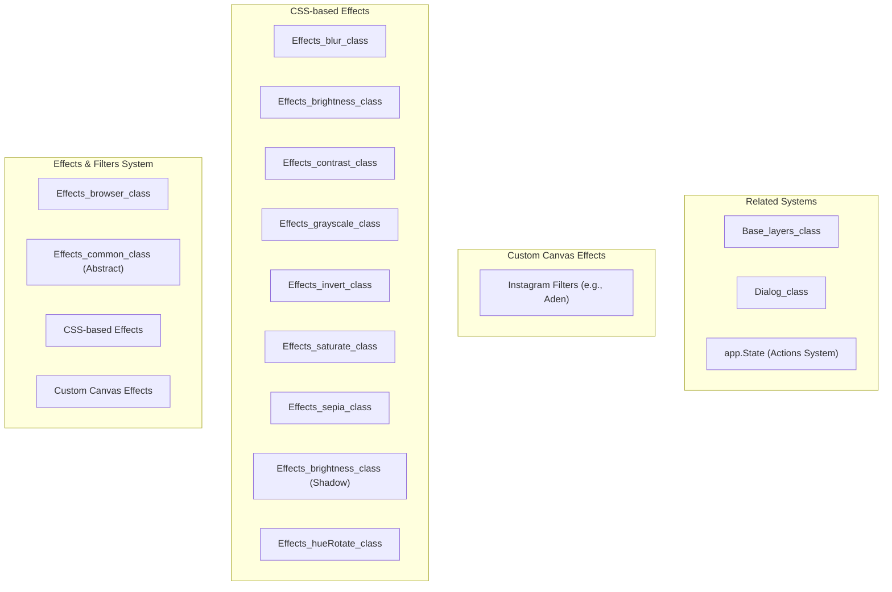
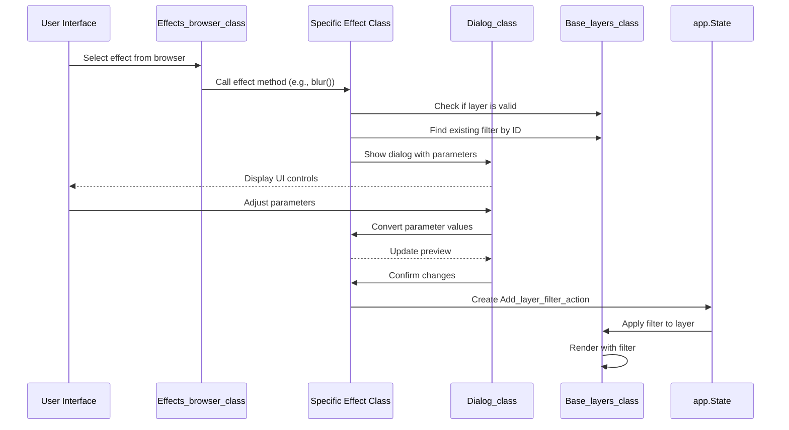
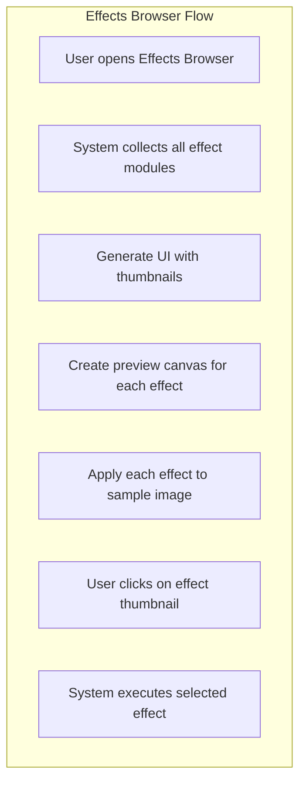
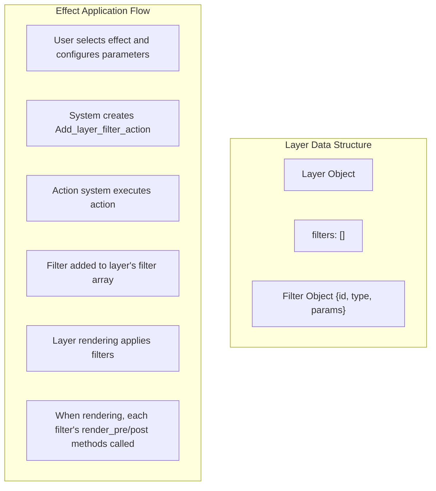

# Effects & Filters

> **Relevant source files**
> * [src/js/core/components/color-input.js](https://github.com/viliusle/miniPaint/blob/6d0b95e5/src/js/core/components/color-input.js)
> * [src/js/modules/effects/abstract/css.js](https://github.com/viliusle/miniPaint/blob/6d0b95e5/src/js/modules/effects/abstract/css.js)
> * [src/js/modules/effects/browser.js](https://github.com/viliusle/miniPaint/blob/6d0b95e5/src/js/modules/effects/browser.js)
> * [src/js/modules/effects/common/blur.js](https://github.com/viliusle/miniPaint/blob/6d0b95e5/src/js/modules/effects/common/blur.js)
> * [src/js/modules/effects/common/brightness.js](https://github.com/viliusle/miniPaint/blob/6d0b95e5/src/js/modules/effects/common/brightness.js)
> * [src/js/modules/effects/common/contrast.js](https://github.com/viliusle/miniPaint/blob/6d0b95e5/src/js/modules/effects/common/contrast.js)
> * [src/js/modules/effects/common/grayscale.js](https://github.com/viliusle/miniPaint/blob/6d0b95e5/src/js/modules/effects/common/grayscale.js)
> * [src/js/modules/effects/common/hue-rotate.js](https://github.com/viliusle/miniPaint/blob/6d0b95e5/src/js/modules/effects/common/hue-rotate.js)
> * [src/js/modules/effects/common/invert.js](https://github.com/viliusle/miniPaint/blob/6d0b95e5/src/js/modules/effects/common/invert.js)
> * [src/js/modules/effects/common/saturate.js](https://github.com/viliusle/miniPaint/blob/6d0b95e5/src/js/modules/effects/common/saturate.js)
> * [src/js/modules/effects/common/sepia.js](https://github.com/viliusle/miniPaint/blob/6d0b95e5/src/js/modules/effects/common/sepia.js)
> * [src/js/modules/effects/common/shadow.js](https://github.com/viliusle/miniPaint/blob/6d0b95e5/src/js/modules/effects/common/shadow.js)
> * [src/js/modules/effects/instagram/aden.js](https://github.com/viliusle/miniPaint/blob/6d0b95e5/src/js/modules/effects/instagram/aden.js)
> * [src/js/modules/image/histogram.js](https://github.com/viliusle/miniPaint/blob/6d0b95e5/src/js/modules/image/histogram.js)
> * [src/js/tools/shape.js](https://github.com/viliusle/miniPaint/blob/6d0b95e5/src/js/tools/shape.js)

This document provides a technical overview of the Effects & Filters system in miniPaint. It covers the architecture, implementation, and usage of the various image effects and filters available in the application. For information about image manipulation operations like resize, trim, or crop, see [Image Manipulation](/viliusle/miniPaint/5.3-image-manipulation).

## 1. Overview

The Effects & Filters system in miniPaint allows users to apply non-destructive visual modifications to image layers. These modifications use CSS filters and custom canvas operations to transform the appearance of images while preserving the original data.



Sources: [src/js/modules/effects/abstract/css.js](https://github.com/viliusle/miniPaint/blob/6d0b95e5/src/js/modules/effects/abstract/css.js)

 [src/js/modules/effects/browser.js](https://github.com/viliusle/miniPaint/blob/6d0b95e5/src/js/modules/effects/browser.js)

 [src/js/modules/effects/common/blur.js](https://github.com/viliusle/miniPaint/blob/6d0b95e5/src/js/modules/effects/common/blur.js)

 [src/js/modules/effects/instagram/aden.js](https://github.com/viliusle/miniPaint/blob/6d0b95e5/src/js/modules/effects/instagram/aden.js)

## 2. Architecture

### 2.1 Base Classes

The Effects & Filters system is built around two primary base classes:

1. **Effects_common_class**: An abstract base class that provides the foundation for CSS-based effects with standardized dialogs, value conversion, and rendering.
2. **Effects_browser_class**: Manages the user interface for browsing and selecting available effects, generating thumbnails and handling user interaction.

```sql
#mermaid-sssnw48kyin{font-family:ui-sans-serif,-apple-system,system-ui,Segoe UI,Helvetica;font-size:16px;fill:#333;}@keyframes edge-animation-frame{from{stroke-dashoffset:0;}}@keyframes dash{to{stroke-dashoffset:0;}}#mermaid-sssnw48kyin .edge-animation-slow{stroke-dasharray:9,5!important;stroke-dashoffset:900;animation:dash 50s linear infinite;stroke-linecap:round;}#mermaid-sssnw48kyin .edge-animation-fast{stroke-dasharray:9,5!important;stroke-dashoffset:900;animation:dash 20s linear infinite;stroke-linecap:round;}#mermaid-sssnw48kyin .error-icon{fill:#dddddd;}#mermaid-sssnw48kyin .error-text{fill:#222222;stroke:#222222;}#mermaid-sssnw48kyin .edge-thickness-normal{stroke-width:1px;}#mermaid-sssnw48kyin .edge-thickness-thick{stroke-width:3.5px;}#mermaid-sssnw48kyin .edge-pattern-solid{stroke-dasharray:0;}#mermaid-sssnw48kyin .edge-thickness-invisible{stroke-width:0;fill:none;}#mermaid-sssnw48kyin .edge-pattern-dashed{stroke-dasharray:3;}#mermaid-sssnw48kyin .edge-pattern-dotted{stroke-dasharray:2;}#mermaid-sssnw48kyin .marker{fill:#999;stroke:#999;}#mermaid-sssnw48kyin .marker.cross{stroke:#999;}#mermaid-sssnw48kyin svg{font-family:ui-sans-serif,-apple-system,system-ui,Segoe UI,Helvetica;font-size:16px;}#mermaid-sssnw48kyin p{margin:0;}#mermaid-sssnw48kyin g.classGroup text{fill:#dddddd;stroke:none;font-family:ui-sans-serif,-apple-system,system-ui,Segoe UI,Helvetica;font-size:10px;}#mermaid-sssnw48kyin g.classGroup text .title{font-weight:bolder;}#mermaid-sssnw48kyin .cluster-label text{fill:#444;}#mermaid-sssnw48kyin .cluster-label span{color:#444;}#mermaid-sssnw48kyin .cluster-label span p{background-color:transparent;}#mermaid-sssnw48kyin .cluster rect{fill:#f8f8f8;stroke:#dddddd;stroke-width:1px;}#mermaid-sssnw48kyin .cluster text{fill:#444;}#mermaid-sssnw48kyin .cluster span{color:#444;}#mermaid-sssnw48kyin .nodeLabel,#mermaid-sssnw48kyin .edgeLabel{color:#333333;}#mermaid-sssnw48kyin .noteLabel .nodeLabel,#mermaid-sssnw48kyin .noteLabel .edgeLabel{color:#333;}#mermaid-sssnw48kyin .edgeLabel .label rect{fill:#ffffff;}#mermaid-sssnw48kyin .label text{fill:#333333;}#mermaid-sssnw48kyin .labelBkg{background:#ffffff;}#mermaid-sssnw48kyin .edgeLabel .label span{background:#ffffff;}#mermaid-sssnw48kyin .classTitle{font-weight:bolder;}#mermaid-sssnw48kyin .node rect,#mermaid-sssnw48kyin .node circle,#mermaid-sssnw48kyin .node ellipse,#mermaid-sssnw48kyin .node polygon,#mermaid-sssnw48kyin .node path{fill:#ffffff;stroke:#dddddd;stroke-width:1;}#mermaid-sssnw48kyin .divider{stroke:#dddddd;stroke-width:1;}#mermaid-sssnw48kyin g.clickable{cursor:pointer;}#mermaid-sssnw48kyin g.classGroup rect{fill:#ffffff;stroke:#dddddd;}#mermaid-sssnw48kyin g.classGroup line{stroke:#dddddd;stroke-width:1;}#mermaid-sssnw48kyin .classLabel .box{stroke:none;stroke-width:0;fill:#ffffff;opacity:0.5;}#mermaid-sssnw48kyin .classLabel .label{fill:#dddddd;font-size:10px;}#mermaid-sssnw48kyin .relation{stroke:#999;stroke-width:1;fill:none;}#mermaid-sssnw48kyin .dashed-line{stroke-dasharray:3;}#mermaid-sssnw48kyin .dotted-line{stroke-dasharray:1 2;}#mermaid-sssnw48kyin [id$="-compositionStart"],#mermaid-sssnw48kyin .composition{fill:#999!important;stroke:#999!important;stroke-width:1;}#mermaid-sssnw48kyin [id$="-compositionEnd"],#mermaid-sssnw48kyin .composition{fill:#999!important;stroke:#999!important;stroke-width:1;}#mermaid-sssnw48kyin [id$="-dependencyStart"],#mermaid-sssnw48kyin .dependency{fill:#999!important;stroke:#999!important;stroke-width:1;}#mermaid-sssnw48kyin [id$="-dependencyEnd"],#mermaid-sssnw48kyin .dependency{fill:#999!important;stroke:#999!important;stroke-width:1;}#mermaid-sssnw48kyin [id$="-extensionStart"],#mermaid-sssnw48kyin .extension{fill:transparent!important;stroke:#999!important;stroke-width:1;}#mermaid-sssnw48kyin [id$="-extensionEnd"],#mermaid-sssnw48kyin .extension{fill:transparent!important;stroke:#999!important;stroke-width:1;}#mermaid-sssnw48kyin [id$="-aggregationStart"],#mermaid-sssnw48kyin .aggregation{fill:transparent!important;stroke:#999!important;stroke-width:1;}#mermaid-sssnw48kyin [id$="-aggregationEnd"],#mermaid-sssnw48kyin .aggregation{fill:transparent!important;stroke:#999!important;stroke-width:1;}#mermaid-sssnw48kyin [id$="-lollipopStart"],#mermaid-sssnw48kyin .lollipop{fill:#ffffff!important;stroke:#999!important;stroke-width:1;}#mermaid-sssnw48kyin [id$="-lollipopEnd"],#mermaid-sssnw48kyin .lollipop{fill:#ffffff!important;stroke:#999!important;stroke-width:1;}#mermaid-sssnw48kyin .edgeTerminals{font-size:11px;line-height:initial;}#mermaid-sssnw48kyin .classTitleText{text-anchor:middle;font-size:18px;fill:#333;}#mermaid-sssnw48kyin .edgeLabel[data-look="neo"]{background-color:#ffffff;text-align:center;}#mermaid-sssnw48kyin .edgeLabel[data-look="neo"] p{background-color:#ffffff;}#mermaid-sssnw48kyin .edgeLabel[data-look="neo"] rect{opacity:0.5;background-color:#ffffff;fill:#ffffff;}#mermaid-sssnw48kyin .label-icon{display:inline-block;height:1em;overflow:visible;vertical-align:-0.125em;}#mermaid-sssnw48kyin .node .label-icon path{fill:currentColor;stroke:revert;stroke-width:revert;}#mermaid-sssnw48kyin .node .neo-node{stroke:#dddddd;}#mermaid-sssnw48kyin [data-look="neo"].node rect,#mermaid-sssnw48kyin [data-look="neo"].cluster rect,#mermaid-sssnw48kyin [data-look="neo"].node polygon{stroke:url(#mermaid-sssnw48kyin-gradient);filter:drop-shadow( 1px 2px 2px rgba(185,185,185,1));}#mermaid-sssnw48kyin [data-look="neo"].node path{stroke:url(#mermaid-sssnw48kyin-gradient);stroke-width:1px;}#mermaid-sssnw48kyin [data-look="neo"].node .outer-path{filter:drop-shadow( 1px 2px 2px rgba(185,185,185,1));}#mermaid-sssnw48kyin [data-look="neo"].node .neo-line path{stroke:#dddddd;filter:none;}#mermaid-sssnw48kyin [data-look="neo"].node circle{stroke:url(#mermaid-sssnw48kyin-gradient);filter:drop-shadow( 1px 2px 2px rgba(185,185,185,1));}#mermaid-sssnw48kyin [data-look="neo"].node circle .state-start{fill:#000000;}#mermaid-sssnw48kyin [data-look="neo"].icon-shape .icon{fill:url(#mermaid-sssnw48kyin-gradient);filter:drop-shadow( 1px 2px 2px rgba(185,185,185,1));}#mermaid-sssnw48kyin [data-look="neo"].icon-shape .icon-neo path{stroke:url(#mermaid-sssnw48kyin-gradient);filter:drop-shadow( 1px 2px 2px rgba(185,185,185,1));}#mermaid-sssnw48kyin :root{--mermaid-font-family:"trebuchet ms",verdana,arial,sans-serif;}Effects_common_class+POP: Dialog_class+Base_layers: Base_layers_class+Helper: Helper_class+params: Object+show_dialog(type, params, filter_id)+save(params, type, filter_id)+preview(params, type)+convert_value(value, params)Effects_browser_class+POP: Dialog_class+preview_width: Number+preview_height: Number+browser()+get_effects_list()+get_filter_title(key)+get_function_from_path(path)Effects_specific_class+constructor()+effect_name(filter_id)+convert_value(value, params, type)+demo(canvas_id, canvas_thumb)+render_pre(ctx, data)+render_post(ctx, data)
```

Sources: [src/js/modules/effects/abstract/css.js](https://github.com/viliusle/miniPaint/blob/6d0b95e5/src/js/modules/effects/abstract/css.js)

 [src/js/modules/effects/browser.js](https://github.com/viliusle/miniPaint/blob/6d0b95e5/src/js/modules/effects/browser.js)

### 2.2 Effect Implementation Pattern

Most effects follow a consistent implementation pattern:



Sources: [src/js/modules/effects/abstract/css.js L16-L48](https://github.com/viliusle/miniPaint/blob/6d0b95e5/src/js/modules/effects/abstract/css.js#L16-L48)

 [src/js/modules/effects/common/blur.js L15-L27](https://github.com/viliusle/miniPaint/blob/6d0b95e5/src/js/modules/effects/common/blur.js#L15-L27)

## 3. Available Effects and Filters

The miniPaint application provides two main categories of effects:

1. **CSS-based effects**: Implemented using CSS filter properties applied to canvas rendering
2. **Custom canvas effects**: Implemented by direct pixel manipulation or custom rendering

### 3.1 CSS-based Effects

| Effect | Class | Parameter Range | Default Value | Description |
| --- | --- | --- | --- | --- |
| Blur | Effects_blur_class | 0-50 | 5 | Applies a gaussian blur to the image |
| Brightness | Effects_brightness_class | -100-100 | 50 | Adjusts the brightness of the image |
| Contrast | Effects_contrast_class | -100-100 | 40 | Adjusts the contrast of the image |
| Grayscale | Effects_grayscale_class | 0-100 | 100 | Converts the image to grayscale |
| Hue Rotate | Effects_hueRotate_class | 0-360 | 90 | Rotates the hue values of the image |
| Invert | Effects_invert_class | 0-100 | 100 | Inverts the colors of the image |
| Saturate | Effects_saturate_class | -100-100 | -50 | Adjusts the color saturation of the image |
| Sepia | Effects_sepia_class | 0-100 | 60 | Applies a sepia tone to the image |
| Shadow | Effects_brightness_class | Various | X:10, Y:10, Radius:5 | Adds a drop shadow to the image |

Sources: [src/js/modules/effects/common/blur.js](https://github.com/viliusle/miniPaint/blob/6d0b95e5/src/js/modules/effects/common/blur.js)

 [src/js/modules/effects/common/brightness.js](https://github.com/viliusle/miniPaint/blob/6d0b95e5/src/js/modules/effects/common/brightness.js)

 [src/js/modules/effects/common/contrast.js](https://github.com/viliusle/miniPaint/blob/6d0b95e5/src/js/modules/effects/common/contrast.js)

 [src/js/modules/effects/common/grayscale.js](https://github.com/viliusle/miniPaint/blob/6d0b95e5/src/js/modules/effects/common/grayscale.js)

 [src/js/modules/effects/common/hue-rotate.js](https://github.com/viliusle/miniPaint/blob/6d0b95e5/src/js/modules/effects/common/hue-rotate.js)

 [src/js/modules/effects/common/invert.js](https://github.com/viliusle/miniPaint/blob/6d0b95e5/src/js/modules/effects/common/invert.js)

 [src/js/modules/effects/common/saturate.js](https://github.com/viliusle/miniPaint/blob/6d0b95e5/src/js/modules/effects/common/saturate.js)

 [src/js/modules/effects/common/sepia.js](https://github.com/viliusle/miniPaint/blob/6d0b95e5/src/js/modules/effects/common/sepia.js)

 [src/js/modules/effects/common/shadow.js](https://github.com/viliusle/miniPaint/blob/6d0b95e5/src/js/modules/effects/common/shadow.js)

### 3.2 Instagram-style Filters

The system also includes Instagram-style filters (like "Aden") that apply complex combinations of effects to create specific looks. These use custom canvas operations rather than CSS filters.

Example implementation (Aden filter):

```javascript
// The Aden filter applies a reddish tone and adjusts contrast, saturation and brightnesschange(canvas, width, height) {    // Create gradient overlay    var canvas2 = document.createElement('canvas');    var ctx2 = canvas2.getContext("2d");    canvas2.width = width;    canvas2.height = height;    var gradient = ctx2.createLinearGradient(0, 0, width, height);    gradient.addColorStop(0, "rgba(66, 10, 14, 0.2)");    gradient.addColorStop(1, "rgba(66, 10, 14, 0.2)");    ctx2.fillStyle = gradient;    ctx2.fillRect(0, 0, width, height);     // Apply darken blend mode    ctx2.globalCompositeOperation = "darken";    ctx2.drawImage(canvas, 0, 0);    ctx2.globalCompositeOperation = "source-over";     // Apply additional CSS filters    ctx2.filter = 'hue-rotate(-20deg) contrast(0.9) saturate(0.85) brightness(1.2)';    ctx2.drawImage(canvas2, 0, 0);    ctx2.filter = 'none';     return canvas2;}
```

Sources: [src/js/modules/effects/instagram/aden.js L35-L59](https://github.com/viliusle/miniPaint/blob/6d0b95e5/src/js/modules/effects/instagram/aden.js#L35-L59)

## 4. Effects Browser

The Effects Browser provides a user interface for browsing and selecting available effects. It dynamically generates thumbnails with previews of all effects.



The browser implementation performs these key functions:

1. Collects all effects modules from the application
2. Creates a thumbnail grid UI
3. Generates preview canvases with the effect applied to a sample image
4. Handles click events to execute the selected effect

Sources: [src/js/modules/effects/browser.js L16-L89](https://github.com/viliusle/miniPaint/blob/6d0b95e5/src/js/modules/effects/browser.js#L16-L89)

 [src/js/modules/effects/browser.js L92-L137](https://github.com/viliusle/miniPaint/blob/6d0b95e5/src/js/modules/effects/browser.js#L92-L137)

## 5. Implementation Details

### 5.1 Effect Dialog System

When an effect is selected, a dialog is shown to allow parameter configuration. The dialog includes:

1. Controls for adjusting effect parameters (sliders, color pickers, etc.)
2. A real-time preview of the effect with current parameters
3. Confirmation/cancel buttons

The dialog implementation is handled by the `show_dialog` method in the base class:

```javascript
show_dialog(type, params, filter_id) {    var _this = this;    var title = this.Helper.ucfirst(type);    // ...    var settings = {        title: title,        preview: true,        preview_padding: preview_padding,        effects: true,        params: params,        on_change: function (params, canvas_preview, w, h) {            _this.params = params;            canvas_preview.filter = _this.preview(params, type);            canvas_preview.drawImage(this.layer_active_small, /* ... */);        },        on_finish: function (params) {            _this.params = params;            _this.save(params, type, filter_id);        },    };    // ...    this.POP.show(settings);}
```

Sources: [src/js/modules/effects/abstract/css.js L16-L48](https://github.com/viliusle/miniPaint/blob/6d0b95e5/src/js/modules/effects/abstract/css.js#L16-L48)

### 5.2 Parameter Conversion

Effects often need to convert parameter values between different contexts (UI, preview, final rendering). This is handled by the `convert_value` method which each effect overrides according to its needs.

Example from blur effect:

```javascript
convert_value(value, params, type) {    //adapt size to real canvas dimensions    if (type == 'preview') {        var diff = (this.POP.width_mini / this.POP.height_mini) / (config.WIDTH / config.HEIGHT);        value = value * diff;    }    return value + 'px';}
```

Sources: [src/js/modules/effects/common/blur.js L29-L39](https://github.com/viliusle/miniPaint/blob/6d0b95e5/src/js/modules/effects/common/blur.js#L29-L39)

 [src/js/modules/effects/abstract/css.js L65-L67](https://github.com/viliusle/miniPaint/blob/6d0b95e5/src/js/modules/effects/abstract/css.js#L65-L67)

### 5.3 Rendering Implementation

Effects are applied during rendering using the CSS filter property on the canvas context. Each effect implements:

1. `render_pre`: Sets up the filter before drawing
2. `render_post`: Cleans up after drawing

Example implementation:

```javascript
render_pre(ctx, data) {    var value = this.convert_value(data.params.value, data.params, 'save');    var filter = 'blur(' + value + ')';     if(ctx.filter == 'none')        ctx.filter = filter;    else        ctx.filter += ' ' + filter;} render_post(ctx, data){    ctx.filter = 'none';}
```

Sources: [src/js/modules/effects/common/blur.js L52-L64](https://github.com/viliusle/miniPaint/blob/6d0b95e5/src/js/modules/effects/common/blur.js#L52-L64)

 [src/js/modules/effects/common/contrast.js L52-L65](https://github.com/viliusle/miniPaint/blob/6d0b95e5/src/js/modules/effects/common/contrast.js#L52-L65)

## 6. Integration with Layer System

Effects are integrated with the layer system as non-destructive filters. This means that:

1. Filters are stored as metadata with the layer
2. Original image data is preserved
3. Filters can be adjusted or removed at any time
4. Multiple filters can be combined on a single layer



The integration with the action system enables undo/redo functionality for filter application and modification.

Sources: [src/js/modules/effects/abstract/css.js L50-L54](https://github.com/viliusle/miniPaint/blob/6d0b95e5/src/js/modules/effects/abstract/css.js#L50-L54)

 [src/js/modules/effects/common/blur.js L15-L27](https://github.com/viliusle/miniPaint/blob/6d0b95e5/src/js/modules/effects/common/blur.js#L15-L27)

## 7. Adding New Effects

New effects can be added to the system by:

1. Creating a new class that extends `Effects_common_class`
2. Implementing the required methods (effect function, conversion, demo, render_pre/post)
3. Registering the effect with the application

The Effects Browser automatically discovers and includes all effect modules by searching for modules with "effects" in their path (excluding abstract/browser modules).

Sources: [src/js/modules/effects/browser.js L92-L115](https://github.com/viliusle/miniPaint/blob/6d0b95e5/src/js/modules/effects/browser.js#L92-L115)