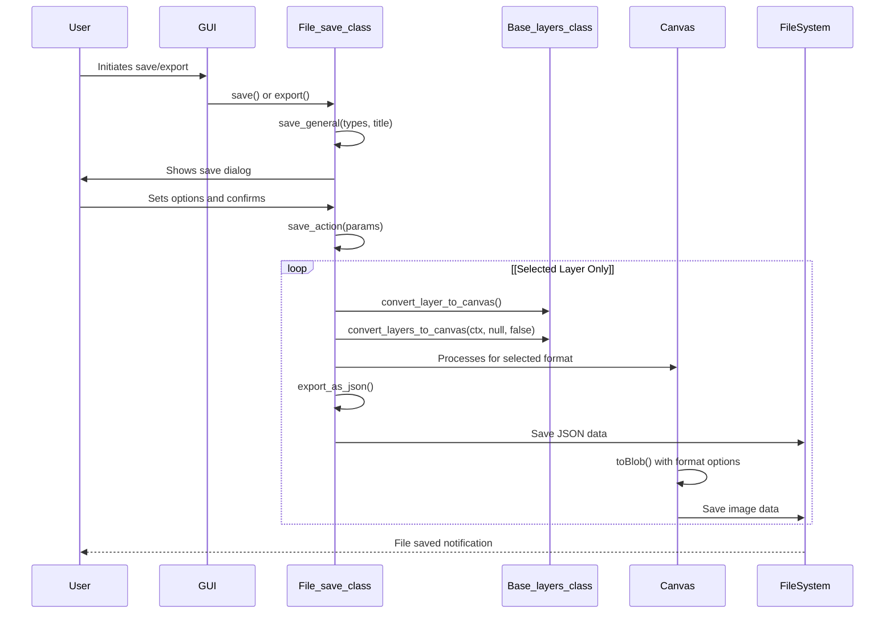
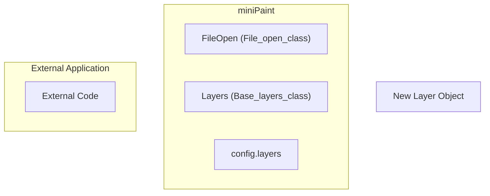

# File Operations

> **Relevant source files**
> * [README.md](https://github.com/viliusle/miniPaint/blob/6d0b95e5/README.md?plain=1)
> * [examples/add-edit-imgData.html](https://github.com/viliusle/miniPaint/blob/6d0b95e5/examples/add-edit-imgData.html)
> * [examples/open-edit-save.html](https://github.com/viliusle/miniPaint/blob/6d0b95e5/examples/open-edit-save.html)
> * [examples/zoom.html](https://github.com/viliusle/miniPaint/blob/6d0b95e5/examples/zoom.html)
> * [src/js/core/base-search.js](https://github.com/viliusle/miniPaint/blob/6d0b95e5/src/js/core/base-search.js)
> * [src/js/main.js](https://github.com/viliusle/miniPaint/blob/6d0b95e5/src/js/main.js)
> * [src/js/modules/file/save.js](https://github.com/viliusle/miniPaint/blob/6d0b95e5/src/js/modules/file/save.js)
> * [src/js/modules/help/shortcuts.js](https://github.com/viliusle/miniPaint/blob/6d0b95e5/src/js/modules/help/shortcuts.js)
> * [src/js/modules/tools/search.js](https://github.com/viliusle/miniPaint/blob/6d0b95e5/src/js/modules/tools/search.js)

This document details the file operations system in miniPaint, covering how users can import, export, and save their work in various formats. The system provides functionality for opening images from different sources and saving projects in multiple formats, including those that preserve layer information.

## Overview

The file operations in miniPaint are managed by two primary classes: `File_open_class` and `File_save_class`. These classes handle importing and exporting images respectively, supporting various file formats and options.

### System Architecture

```

```

Sources: [src/js/modules/file/save.js L15-L736](https://github.com/viliusle/miniPaint/blob/6d0b95e5/src/js/modules/file/save.js#L15-L736)

 [src/js/main.js L33-L35](https://github.com/viliusle/miniPaint/blob/6d0b95e5/src/js/main.js#L33-L35)

 [src/js/main.js L39-L42](https://github.com/viliusle/miniPaint/blob/6d0b95e5/src/js/main.js#L39-L42)

## File Formats

miniPaint supports various file formats for both importing and exporting, as defined in the `SAVE_TYPES` configuration:

| Format | Description | Preserves Layers | Usage |
| --- | --- | --- | --- |
| PNG | Portable Network Graphics | No | Default format, supports transparency |
| JPG | JPEG Format | No | Good for photos, no transparency |
| JSON | Full layers data | Yes | Complete project with all layers and properties |
| WEBP | Weppy File Format | No | Modern format with good compression |
| GIF | Graphics Interchange Format | No | Supports animation |
| BMP | Windows Bitmap | No | Uncompressed format |
| TIFF | Tag Image File Format | No | Professional format |

Sources: [src/js/modules/file/save.js L37-L47](https://github.com/viliusle/miniPaint/blob/6d0b95e5/src/js/modules/file/save.js#L37-L47)

## Keyboard Shortcuts

miniPaint provides keyboard shortcuts for quick access to file operations:

| Shortcut | Operation |
| --- | --- |
| S | Export (save as flattened image) |
| Shift+S | Save (preserves layers) |
| O | Open file |
| F9 | Quick Save |
| F10 | Quick Load |

Sources: [src/js/modules/help/shortcuts.js L15-L36](https://github.com/viliusle/miniPaint/blob/6d0b95e5/src/js/modules/help/shortcuts.js#L15-L36)

 [src/js/modules/file/save.js L51-L69](https://github.com/viliusle/miniPaint/blob/6d0b95e5/src/js/modules/file/save.js#L51-L69)

## Save Operations

### Save vs. Export

miniPaint distinguishes between two types of save operations:

1. **Save** (Shift+S): Non-destructive save that preserves all layer data, available only in JSON format
2. **Export** (S): Saves the visible image in various image formats, flattening all layers

```mermaid
flowchart TD

mermaid-4tiictcco9j-flowchart-Start["File Save Request"]
mermaid-4tiictcco9j-flowchart-Decision["Save or Export?"]
mermaid-4tiictcco9j-flowchart-SaveJSON["Save as JSON<br>(Preserves layers)"]
mermaid-4tiictcco9j-flowchart-ExportImage["Export as Image<br>(Flattens layers)"]
mermaid-4tiictcco9j-flowchart-ShowDialog["Show Save Dialog<br>(JSON only)"]
mermaid-4tiictcco9j-flowchart-ShowDialog2["Show Export Dialog<br>(All image formats)"]
mermaid-4tiictcco9j-flowchart-SerializeData["Serialize Layer Data"]
mermaid-4tiictcco9j-flowchart-SaveFile["Save JSON File"]
mermaid-4tiictcco9j-flowchart-FormatChoice["Select Format"]
mermaid-4tiictcco9j-flowchart-RenderCanvas["Render Layers to Canvas"]
mermaid-4tiictcco9j-flowchart-ConvertFormat["Convert to Selected Format"]
mermaid-4tiictcco9j-flowchart-SaveFile2["Save Image File"]
```



Sources: [src/js/modules/file/save.js L73-L94](https://github.com/viliusle/miniPaint/blob/6d0b95e5/src/js/modules/file/save.js#L73-L94)

 [src/js/modules/file/save.js L436-L626](https://github.com/viliusle/miniPaint/blob/6d0b95e5/src/js/modules/file/save.js#L436-L626)

### Save Dialog Options

When saving or exporting, the dialog provides several options:

1. **File name**: Name for the saved file
2. **Save as type**: Format selection (PNG, JPG, JSON, etc.)
3. **Quality**: For formats that support quality settings (JPG, WEBP)
4. **File size**: Estimated size of the output file
5. **Resolution**: Image resolution settings
6. **Show file size**: Option to calculate and display file size
7. **Save layers**: Options for how to handle layers: * All: Save all layers as one flattened image * Selected: Save only the current layer * Separated: Save each layer as a separate file * Separated (original types): Save each layer in its original format
8. **Gif delay**: Frame delay for animated GIFs

Sources: [src/js/modules/file/save.js L96-L201](https://github.com/viliusle/miniPaint/blob/6d0b95e5/src/js/modules/file/save.js#L96-L201)

### Save Process Flow



Sources: [src/js/modules/file/save.js L96-L201](https://github.com/viliusle/miniPaint/blob/6d0b95e5/src/js/modules/file/save.js#L96-L201)

 [src/js/modules/file/save.js L436-L626](https://github.com/viliusle/miniPaint/blob/6d0b95e5/src/js/modules/file/save.js#L436-L626)

## JSON Format Structure

When saving in JSON format, miniPaint preserves the complete project state, including all layers and their properties. The structure includes:

1. **info**: Basic project information * width, height: Canvas dimensions * about: Information about the file format * date: Creation date * version: miniPaint version * layer_active: Currently active layer ID * guides: Guide positions
2. **user_fonts**: Any custom fonts used
3. **layers**: Array of layer objects with properties * All layer properties except private ones (prefixed with underscore) * Position, size, opacity, blend mode, etc.
4. **data**: Image data for image-type layers * ID: Layer ID * data: Base64-encoded image data

Sources: [src/js/modules/file/save.js L652-L720](https://github.com/viliusle/miniPaint/blob/6d0b95e5/src/js/modules/file/save.js#L652-L720)

## File Opening Operations

While the full implementation of `File_open_class` isn't provided in the sources, we can infer its functionality from usage examples and references.

The file opening system supports:

* Loading from local files
* Loading from URLs
* Loading from data URLs
* Drag and drop operations
* Clipboard paste operations

### Programmatic File Opening

The API allows for programmatic file operations:



Sources: [examples/open-edit-save.html L29-L47](https://github.com/viliusle/miniPaint/blob/6d0b95e5/examples/open-edit-save.html#L29-L47)

 [examples/open-edit-save.html L49-L60](https://github.com/viliusle/miniPaint/blob/6d0b95e5/examples/open-edit-save.html#L49-L60)

## Implementation Details

### Format Support Detection

The system checks browser support for different formats before attempting to use them:

```javascript
check_format_support(canvas, data_header, show_error) {    var data = canvas.toDataURL(data_header);    var actualType = data.replace(/^data:([^;]*).*/, '$1');        if (data_header != actualType && data_header != "text/plain") {        if (show_error == undefined || show_error == true) {            //error - no support            alertify.error('Your browser does not support this format.');        }        return false;    }    return true;}
```

Sources: [src/js/modules/file/save.js L635-L647](https://github.com/viliusle/miniPaint/blob/6d0b95e5/src/js/modules/file/save.js#L635-L647)

### Background Handling

When saving to formats without transparency support (like JPG), the system automatically adds a white background:

```
if (type != 'JSON' && (type == 'JPG' || config.TRANSPARENCY == false)) {    //add white background    ctx.globalCompositeOperation = 'destination-over';    this.fillCanvasBackground(ctx, '#ffffff');    ctx.globalCompositeOperation = 'source-over';}
```

Sources: [src/js/modules/file/save.js L496-L501](https://github.com/viliusle/miniPaint/blob/6d0b95e5/src/js/modules/file/save.js#L496-L501)

### GIF Animation Support

For GIF animation, each visible layer is rendered as a separate frame:

```javascript
//add framesfor (var i = 0; i < config.layers.length; i++) {    if (config.layers[i].visible == false)        continue;            ctx.clearRect(0, 0, config.WIDTH, config.HEIGHT);    if (config.TRANSPARENCY == false) {        this.fillCanvasBackground(ctx, '#ffffff');    }    this.Base_layers.convert_layers_to_canvas(ctx, config.layers[i].id, false);        gif.addFrame(ctx, {copy: true, delay: delay});}
```

Sources: [src/js/modules/file/save.js L609-L625](https://github.com/viliusle/miniPaint/blob/6d0b95e5/src/js/modules/file/save.js#L609-L625)

## Programmatic Usage Examples

The miniPaint codebase includes examples demonstrating how to use the file operations APIs programmatically:

### Opening an Image

```javascript
function open_image(image) {    // Get image from element    if(image == undefined)        image = document.getElementById('testImage');    if(typeof image == 'string'){        image = document.getElementById(image);    }        // Access Layers API    var Layers = document.getElementById('myFrame').contentWindow.Layers;    var name = image.src.replace(/^.*[\\\/]/, '');        // Create layer object    var new_layer = {        name: name,        type: 'image',        data: image,        width: image.naturalWidth || image.width,        height: image.naturalHeight || image.height,        width_original: image.naturalWidth || image.width,        height_original: image.naturalHeight || image.height,    };        // Insert the layer    Layers.insert(new_layer);}
```

Sources: [examples/open-edit-save.html L29-L47](https://github.com/viliusle/miniPaint/blob/6d0b95e5/examples/open-edit-save.html#L29-L47)

### Saving as JSON

```javascript
function save_json() {    var miniPaint = document.getElementById('myFrame').contentWindow;    var miniPaint_FileSave = miniPaint.FileSave;        var data_json = miniPaint_FileSave.export_as_json();        document.getElementById('testJson').value = data_json;}
```

Sources: [examples/open-edit-save.html L86-L93](https://github.com/viliusle/miniPaint/blob/6d0b95e5/examples/open-edit-save.html#L86-L93)

### Saving as Image

```javascript
function save_image() {    var Layers = document.getElementById('myFrame').contentWindow.Layers;    var tempCanvas = document.createElement("canvas");    var tempCtx = tempCanvas.getContext("2d");    var dim = Layers.get_dimensions();    tempCanvas.width = dim.width;    tempCanvas.height = dim.height;    Layers.convert_layers_to_canvas(tempCtx);        tempCanvas.toBlob(function (blob) {        // Process the blob data        console.log(blob);    }, 'image/png');}
```

Sources: [examples/open-edit-save.html L62-L84](https://github.com/viliusle/miniPaint/blob/6d0b95e5/examples/open-edit-save.html#L62-L84)

## Summary

The File Operations system in miniPaint provides a comprehensive set of tools for managing file input and output. It supports multiple file formats with different capabilities, preserves layer data when needed, and offers both interactive and programmatic interfaces for working with files.

The system is designed to be flexible, handling different user requirements from basic image export to complete project serialization. It also accounts for browser compatibility issues and provides appropriate fallbacks.