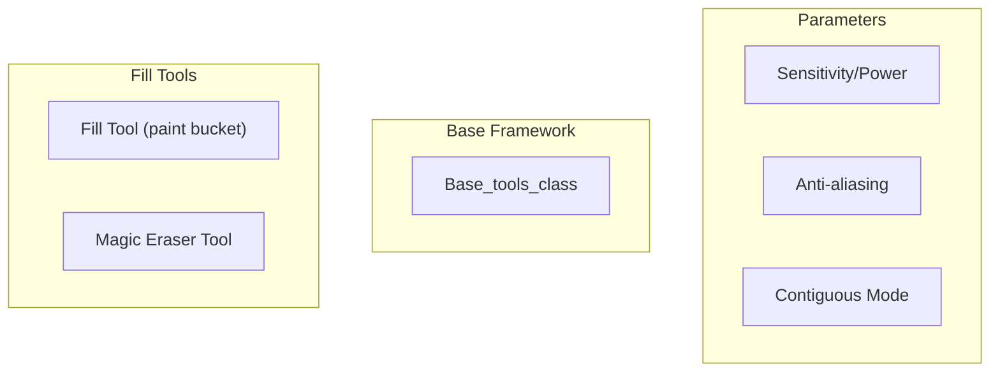
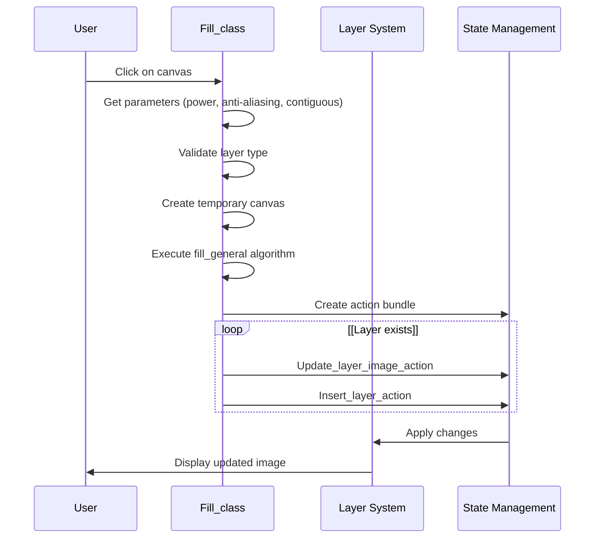
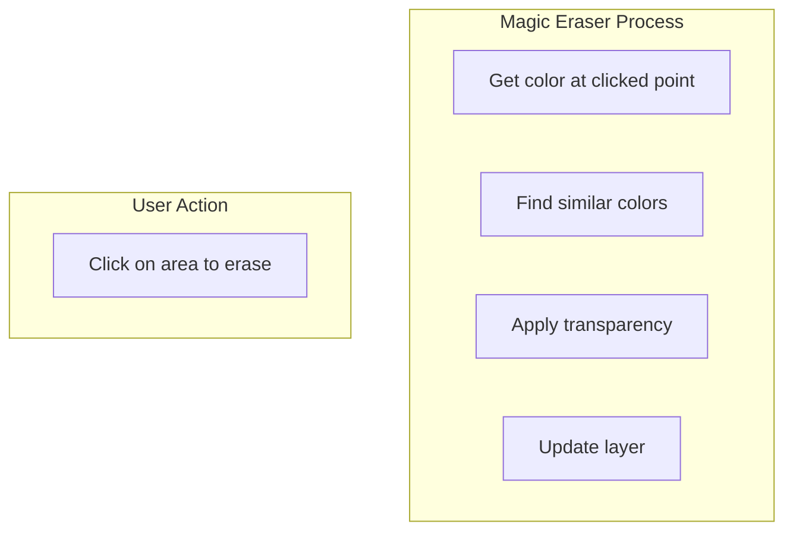
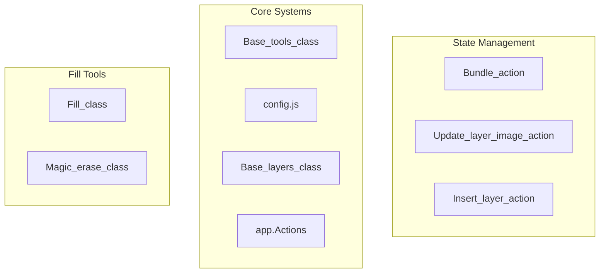

# Fill Tools

> **Relevant source files**
> * [images/icons/magic_erase.svg](https://github.com/viliusle/miniPaint/blob/6d0b95e5/images/icons/magic_erase.svg)
> * [src/js/tools/blur.js](https://github.com/viliusle/miniPaint/blob/6d0b95e5/src/js/tools/blur.js)
> * [src/js/tools/bulge_pinch.js](https://github.com/viliusle/miniPaint/blob/6d0b95e5/src/js/tools/bulge_pinch.js)
> * [src/js/tools/clone.js](https://github.com/viliusle/miniPaint/blob/6d0b95e5/src/js/tools/clone.js)
> * [src/js/tools/desaturate.js](https://github.com/viliusle/miniPaint/blob/6d0b95e5/src/js/tools/desaturate.js)
> * [src/js/tools/erase.js](https://github.com/viliusle/miniPaint/blob/6d0b95e5/src/js/tools/erase.js)
> * [src/js/tools/fill.js](https://github.com/viliusle/miniPaint/blob/6d0b95e5/src/js/tools/fill.js)
> * [src/js/tools/magic_erase.js](https://github.com/viliusle/miniPaint/blob/6d0b95e5/src/js/tools/magic_erase.js)
> * [src/js/tools/sharpen.js](https://github.com/viliusle/miniPaint/blob/6d0b95e5/src/js/tools/sharpen.js)

Fill tools in miniPaint enable users to apply colors or erasing effects to areas of an image based on color similarity. These tools include the standard Fill tool (also known as "paint bucket") and the Magic Eraser tool. For information about shape tools with fill capabilities, see [Shape Tools](/viliusle/miniPaint/4.3-shape-tools).

## Overview

Fill tools work by analyzing the color values of pixels at a selected point and then applying changes to adjacent or similar pixels throughout the image. They allow for quick coloring of large areas or selective removal of specific color regions from an image.

Sources: [src/js/tools/fill.js L1-L231](https://github.com/viliusle/miniPaint/blob/6d0b95e5/src/js/tools/fill.js#L1-L231)

 [src/js/tools/magic_erase.js L1-L214](https://github.com/viliusle/miniPaint/blob/6d0b95e5/src/js/tools/magic_erase.js#L1-L214)

## Fill Tool

### Functionality and Usage

The Fill tool (paint bucket) allows you to fill connected regions with the currently selected color. It works by analyzing the pixel colors at the clicked position and extending the fill to neighboring pixels with similar colors.

Key characteristics:

* Fills areas based on color similarity
* Can operate in contiguous (connected) or non-contiguous modes
* Supports anti-aliasing for smoother edges
* Adjustable sensitivity for controlling the color matching tolerance

When used on a blank canvas, it creates a new image layer with the fill color. When used on an existing image layer, it modifies that layer directly.

Sources: [src/js/tools/fill.js L8-L133](https://github.com/viliusle/miniPaint/blob/6d0b95e5/src/js/tools/fill.js#L8-L133)

### Parameters

The Fill tool provides several adjustable parameters to control its behavior:

| Parameter | Description | Default | Effect |
| --- | --- | --- | --- |
| Power | Controls the sensitivity of color matching (0-100) | 40 | Higher values match a wider range of colors |
| Anti-aliasing | Enables smoother edges at the fill boundaries | On | Reduces jagged edges in the filled area |
| Contiguous | Determines whether to fill only connected regions | On | When off, fills all matching pixels across the entire image |

These parameters can be adjusted in the tool options panel when the Fill tool is active.

Sources: [src/js/tools/fill.js L53-L104](https://github.com/viliusle/miniPaint/blob/6d0b95e5/src/js/tools/fill.js#L53-L104)

### Implementation Details

The Fill tool is implemented in the `Fill_class` which extends the `Base_tools_class`. The main functionality is contained in two key methods:

1. `fill()` - Handles the initial setup and validation
2. `fill_general()` - Performs the actual fill algorithm

#### Fill Algorithm

The fill algorithm works in two modes:

**Contiguous Mode (Default)**: Uses a flood-fill algorithm that starts at the clicked point and expands outward through neighboring pixels with similar colors.

```mermaid
flowchart TD

mermaid-9pgevwnj9hs-flowchart-Start["Start at clicked pixel"]
mermaid-9pgevwnj9hs-flowchart-CheckStack["Check if stack is empty"]
mermaid-9pgevwnj9hs-flowchart-PopPoint["Pop point from stack"]
mermaid-9pgevwnj9hs-flowchart-CheckNeighbors["Check 4 adjacent neighbors"]
mermaid-9pgevwnj9hs-flowchart-CompareColor["Compare color to original"]
mermaid-9pgevwnj9hs-flowchart-FillPixel["Fill pixel with new color"]
mermaid-9pgevwnj9hs-flowchart-AddToStack["Add neighbor to stack"]
mermaid-9pgevwnj9hs-flowchart-End["End process"]
```

**Non-Contiguous Mode**: Scans the entire image and changes all pixels that match the color similarity criteria, regardless of their position.

When anti-aliasing is enabled, a blur filter is applied to the edges of the filled area to create smoother transitions.

Sources: [src/js/tools/fill.js L135-L228](https://github.com/viliusle/miniPaint/blob/6d0b95e5/src/js/tools/fill.js#L135-L228)

## Magic Eraser Tool

The Magic Eraser tool works similarly to the Fill tool but instead of filling an area with color, it makes the matched pixels transparent. This is useful for quickly removing backgrounds or specific color regions from an image.

Key differences from the standard Fill tool:

* Creates transparency instead of filling with color
* Uses "destination-out" composite operation to erase pixels
* Particularly useful for removing backgrounds or specific colors

The Magic Eraser works on the same principles as the Fill tool but uses different composite operations to achieve the erasing effect.

Sources: [src/js/tools/magic_erase.js L1-L214](https://github.com/viliusle/miniPaint/blob/6d0b95e5/src/js/tools/magic_erase.js#L1-L214)

## Common Constraints and Limitations

Both Fill tools share some common limitations:

1. **Layer Type Restrictions**: * Only works on raster image layers * Cannot be used on vector layers (must convert to raster first) * Cannot be used on rotated layers (must rasterize first)
2. **Alpha Constraints**: * For the Fill tool, the alpha value of the selected color cannot be zero
3. **Performance Considerations**: * Large images may cause performance issues when using these tools with low sensitivity * Contiguous mode is typically faster than non-contiguous mode for large areas

When a tool cannot be used due to these constraints, an error message is displayed using the alertify system.

Sources: [src/js/tools/fill.js L54-L71](https://github.com/viliusle/miniPaint/blob/6d0b95e5/src/js/tools/fill.js#L54-L71)

 [src/js/tools/magic_erase.js L51-L65](https://github.com/viliusle/miniPaint/blob/6d0b95e5/src/js/tools/magic_erase.js#L51-L65)

## Integration with Core Systems

The Fill tools integrate with several core systems in miniPaint:

### Layer System Integration

Fill tools interact with the layer system to:

* Retrieve the target canvas for modification
* Create new layers when filling on empty areas
* Update existing layers through the state management system

Sources: [src/js/tools/fill.js L106-L128](https://github.com/viliusle/miniPaint/blob/6d0b95e5/src/js/tools/fill.js#L106-L128)

 [src/js/tools/magic_erase.js L89-L97](https://github.com/viliusle/miniPaint/blob/6d0b95e5/src/js/tools/magic_erase.js#L89-L97)

### State Management

Both Fill tools use the state management system to enable undo/redo functionality:

1. Changes are bundled into action groups (e.g., "Fill Tool" or "Magic Eraser Tool")
2. These actions update or create layer images
3. The state system records these actions, allowing users to undo fill operations

This approach ensures that all fill operations can be undone and redone consistently within the application's state management framework.

Sources: [src/js/tools/fill.js L106-L128](https://github.com/viliusle/miniPaint/blob/6d0b95e5/src/js/tools/fill.js#L106-L128)

 [src/js/tools/magic_erase.js L89-L97](https://github.com/viliusle/miniPaint/blob/6d0b95e5/src/js/tools/magic_erase.js#L89-L97)

## Technical Implementation Comparison

Here's a comparison of the technical implementation details between the Fill and Magic Eraser tools:

| Feature | Fill Tool | Magic Eraser Tool |
| --- | --- | --- |
| Base Class | `Fill_class` | `Magic_erase_class` |
| Core Method | `fill_general()` | `magic_erase_general()` |
| Color Comparison | Uses RGB+A similarity | Uses RGB+A similarity |
| Output | Applies selected color | Applies transparency |
| Canvas Composition | Standard drawing | "destination-out" with optional blur |
| New Layer Creation | Yes, when no layer exists | No, requires existing layer |
| Asynchronous Processing | Yes, with timeout to prevent UI freezing | Yes, with timeout to prevent UI freezing |

The similarity in implementation makes sense as both tools perform area-based operations using color similarity as the selection criterion.

Sources: [src/js/tools/fill.js L135-L228](https://github.com/viliusle/miniPaint/blob/6d0b95e5/src/js/tools/fill.js#L135-L228)

 [src/js/tools/magic_erase.js L111-L211](https://github.com/viliusle/miniPaint/blob/6d0b95e5/src/js/tools/magic_erase.js#L111-L211)

## Best Practices

For optimal results with Fill tools:

1. **Adjust Sensitivity**: Start with default sensitivity and adjust as needed: * Lower sensitivity for precise selections in images with similar colors * Higher sensitivity for broader selections in high-contrast images
2. **Choose Mode Appropriately**: * Use contiguous mode (default) to fill specific areas * Use non-contiguous mode to replace all instances of a color throughout the image
3. **Anti-aliasing**: * Enable for natural-looking results with smooth edges * Disable for pixel-perfect filling without blurred edges
4. **Layer Preparation**: * Convert vector layers to raster before attempting to use fill tools * Ensure rotated layers are rasterized to avoid errors

Following these practices will help you achieve the desired results while avoiding common errors and limitations.