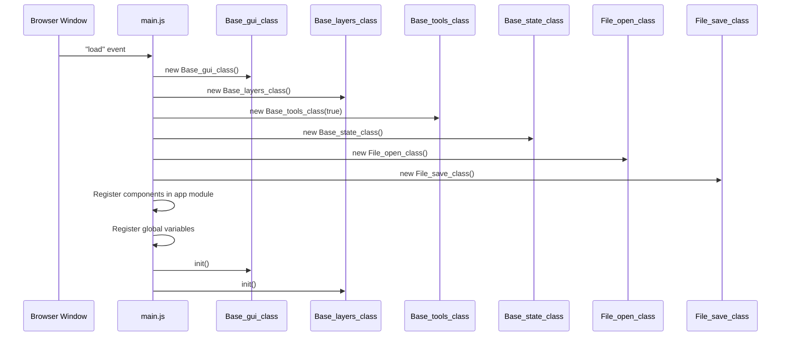
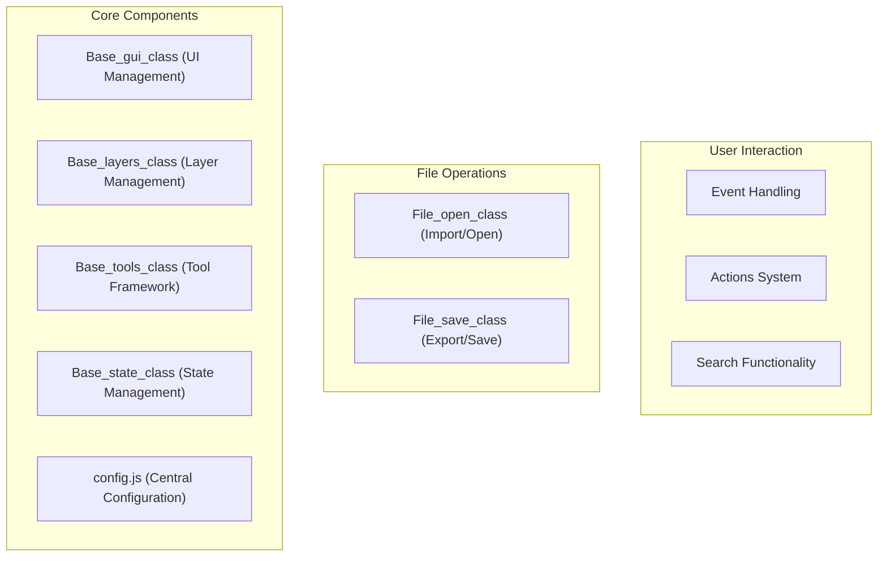
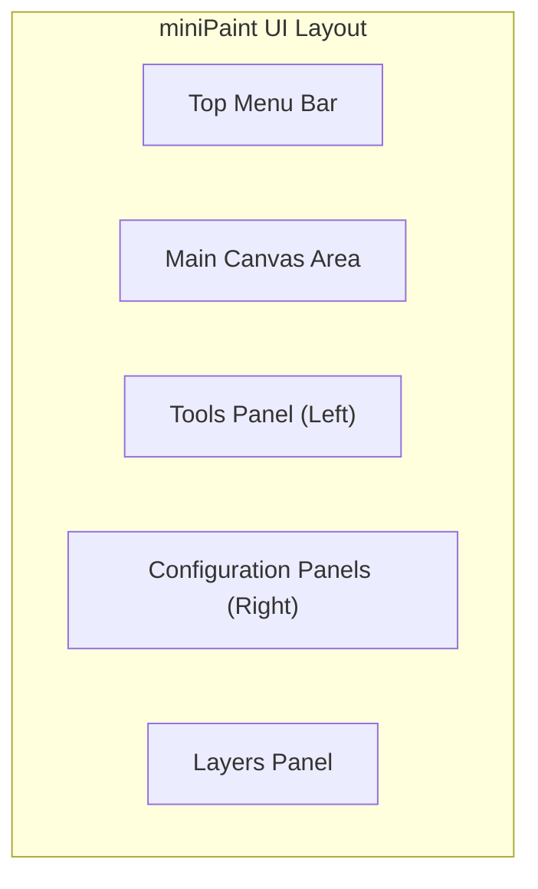
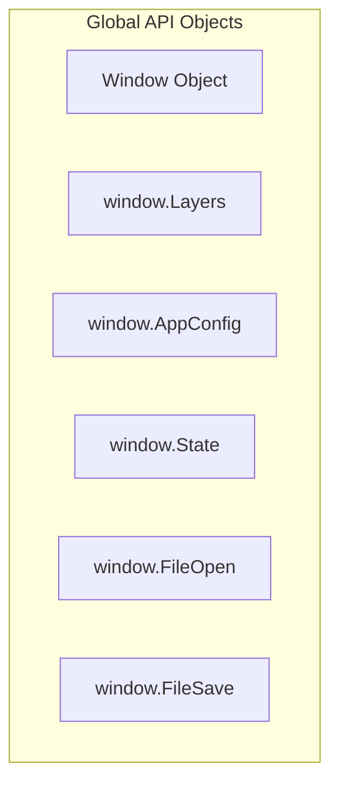

# Getting Started

> **Relevant source files**
> * [.gitignore](https://github.com/viliusle/miniPaint/blob/6d0b95e5/.gitignore)
> * [README.md](https://github.com/viliusle/miniPaint/blob/6d0b95e5/README.md?plain=1)
> * [dist/bundle.js](https://github.com/viliusle/miniPaint/blob/6d0b95e5/dist/bundle.js)
> * [dist/bundle.js.LICENSE.txt](https://github.com/viliusle/miniPaint/blob/6d0b95e5/dist/bundle.js.LICENSE.txt)
> * [dist/bundle.js.map](https://github.com/viliusle/miniPaint/blob/6d0b95e5/dist/bundle.js.map)
> * [examples/add-edit-imgData.html](https://github.com/viliusle/miniPaint/blob/6d0b95e5/examples/add-edit-imgData.html)
> * [examples/open-edit-save.html](https://github.com/viliusle/miniPaint/blob/6d0b95e5/examples/open-edit-save.html)
> * [examples/zoom.html](https://github.com/viliusle/miniPaint/blob/6d0b95e5/examples/zoom.html)
> * [package-lock.json](https://github.com/viliusle/miniPaint/blob/6d0b95e5/package-lock.json)
> * [package.json](https://github.com/viliusle/miniPaint/blob/6d0b95e5/package.json)
> * [src/js/core/base-search.js](https://github.com/viliusle/miniPaint/blob/6d0b95e5/src/js/core/base-search.js)
> * [src/js/main.js](https://github.com/viliusle/miniPaint/blob/6d0b95e5/src/js/main.js)
> * [src/js/modules/file/save.js](https://github.com/viliusle/miniPaint/blob/6d0b95e5/src/js/modules/file/save.js)
> * [src/js/modules/help/shortcuts.js](https://github.com/viliusle/miniPaint/blob/6d0b95e5/src/js/modules/help/shortcuts.js)
> * [src/js/modules/image/palette.js](https://github.com/viliusle/miniPaint/blob/6d0b95e5/src/js/modules/image/palette.js)
> * [src/js/modules/tools/search.js](https://github.com/viliusle/miniPaint/blob/6d0b95e5/src/js/modules/tools/search.js)
> * [src/js/tools/pick_color.js](https://github.com/viliusle/miniPaint/blob/6d0b95e5/src/js/tools/pick_color.js)
> * [webpack.config.js](https://github.com/viliusle/miniPaint/blob/6d0b95e5/webpack.config.js)

This guide covers how to set up, run, and start using miniPaint, both as an end-user and as a developer. miniPaint is a feature-rich web-based image editor that runs directly in your browser without requiring installation. For detailed information about the overall architecture, see [Architecture](/viliusle/miniPaint/1.1-architecture).

## Quick Start for Users

miniPaint can be used immediately in your browser without installation by visiting the official hosted version.

### Online Access

1. Go to [https://viliusle.github.io/miniPaint/](https://viliusle.github.io/miniPaint/) in any modern browser
2. Start editing images right away by: * Creating a new image (File → New) * Opening an existing image (File → Open) * Pasting from clipboard (Ctrl+V) * Drag and drop an image file onto the browser window

### Browser Support

miniPaint works on all modern browsers:

| Browser | Support |
| --- | --- |
| Chrome | ✓ |
| Firefox | ✓ |
| Opera | ✓ |
| Edge | ✓ |
| Safari | ✓ |
| Yandex | ✓ |

Sources: [README.md L16-L22](https://github.com/viliusle/miniPaint/blob/6d0b95e5/README.md?plain=1#L16-L22)

## Development Environment Setup

If you want to run miniPaint locally for development or customization, follow these steps:

### Prerequisites

* Node.js and npm installed on your system
* Git for cloning the repository

### Setup Process

1. Clone the repository: ``` git clone https://github.com/viliusle/miniPaint.git ```
2. Navigate to the project directory: ``` cd miniPaint ```
3. Install dependencies: ``` npm install ```
4. Run the development server: ``` npm run server ```
5. Open your browser and go to the address provided by the development server (typically [http://localhost:8080](http://localhost:8080))

Sources: [package.json L13-L16](https://github.com/viliusle/miniPaint/blob/6d0b95e5/package.json#L13-L16)

 [webpack.config.js L1-L56](https://github.com/viliusle/miniPaint/blob/6d0b95e5/webpack.config.js#L1-L56)

### Project Scripts

miniPaint provides several npm scripts for different development tasks:

| Script | Description |
| --- | --- |
| `npm run server` | Starts the development server with hot reload capability |
| `npm run dev` | Builds the project in development mode |
| `npm run build` | Builds the project for production |

Sources: [package.json L13-L16](https://github.com/viliusle/miniPaint/blob/6d0b95e5/package.json#L13-L16)

## Application Initialization Flow

When miniPaint loads, the following initialization process occurs:



Sources: [src/js/main.js L27-L57](https://github.com/viliusle/miniPaint/blob/6d0b95e5/src/js/main.js#L27-L57)

## Core Components Overview

miniPaint is built around several key components that work together:



Sources: [src/js/main.js L15-L26](https://github.com/viliusle/miniPaint/blob/6d0b95e5/src/js/main.js#L15-L26)

 [src/js/main.js L38-L45](https://github.com/viliusle/miniPaint/blob/6d0b95e5/src/js/main.js#L38-L45)

## Basic Usage

Once miniPaint is running, you can start using its features through the intuitive user interface.

### User Interface Overview

The miniPaint interface consists of several key areas:



### Common Operations

#### Opening an Image

1. Use File → Open from the menu
2. Press Ctrl+O keyboard shortcut
3. Drag and drop an image into the browser window

#### Saving an Image

1. Use File → Save as or Export
2. Press Ctrl+S for Export or Shift+S for Save
3. Choose file format and options in the save dialog

Sources: [src/js/modules/file/save.js L51-L69](https://github.com/viliusle/miniPaint/blob/6d0b95e5/src/js/modules/file/save.js#L51-L69)

 [src/js/modules/help/shortcuts.js L9-L40](https://github.com/viliusle/miniPaint/blob/6d0b95e5/src/js/modules/help/shortcuts.js#L9-L40)

#### Working with Layers

Layers allow you to work on different elements of your image separately:

1. Create a new layer with the "+" button in the Layers panel
2. Toggle layer visibility with the eye icon
3. Reorder layers by dragging
4. Merge layers with the merge option

#### Using Tools

Tools are selected from the left toolbar:

1. Click on a tool to activate it
2. Configure tool parameters in the right panel
3. Use your mouse on the canvas to apply the tool

## Keyboard Shortcuts

miniPaint provides many helpful keyboard shortcuts for quick access to features:

| Key | Function |
| --- | --- |
| F | Auto Adjust Colors |
| F3 / ⌘+F | Search |
| Ctrl+C | Copy to Clipboard |
| D | Duplicate |
| S | Export |
| G | Grid on/off |
| I | Information |
| N | New layer |
| O | Open |
| Ctrl+V | Paste |
| F10 | Quick Load |
| F9 | Quick Save |
| R | Resize |
| L | Rotate left |
| U | Ruler |
| Shift+S | Save As |
| Ctrl+A | Select All |
| H | Shapes |
| T | Trim |
| Ctrl+Z | Undo |
| Scroll up | Zoom in |
| Scroll down | Zoom out |

Sources: [src/js/modules/help/shortcuts.js L9-L40](https://github.com/viliusle/miniPaint/blob/6d0b95e5/src/js/modules/help/shortcuts.js#L9-L40)

## Embedding miniPaint

miniPaint can be embedded in other web pages using an iframe:

```xml
<iframe style="width:100%; height:1000px;" id="miniPaint"   src="https://viliusle.github.io/miniPaint/" allow="camera"></iframe>
```

Sources: [README.md L40-L43](https://github.com/viliusle/miniPaint/blob/6d0b95e5/README.md?plain=1#L40-L43)

## Programmatic Usage

For developers wanting to interact with miniPaint programmatically, the application exposes several global objects:



These global objects allow you to:

* Manipulate layers
* Access configuration
* Manage application state
* Open and save files

Example for programmatically opening an image:

```javascript
// Assuming you have an image elementvar image = document.getElementById('myImage');var Layers = window.Layers; var new_layer = {    name: 'My Image',    type: 'image',    data: image,    width: image.naturalWidth,    height: image.naturalHeight}; Layers.insert(new_layer);
```

Sources: [src/js/main.js L47-L52](https://github.com/viliusle/miniPaint/blob/6d0b95e5/src/js/main.js#L47-L52)

 [examples/open-edit-save.html L23-L127](https://github.com/viliusle/miniPaint/blob/6d0b95e5/examples/open-edit-save.html#L23-L127)

## Next Steps

After getting started with miniPaint, you may want to explore:

* [Layer Management](/viliusle/miniPaint/2.1-layer-management) - Learn more about working with layers
* [Tool Framework](/viliusle/miniPaint/2.4-tool-framework) - Understand the different tools available
* [File Operations](/viliusle/miniPaint/5.1-file-operations) - Details on opening and saving files
* [API Usage](/viliusle/miniPaint/6.2-api-usage) - Advanced usage with the miniPaint API