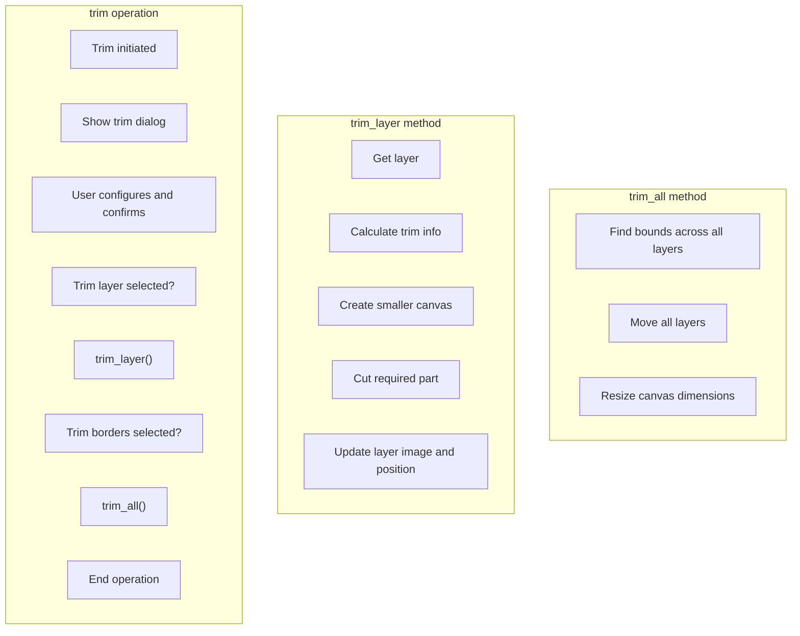
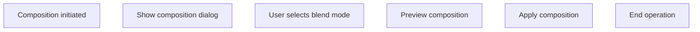
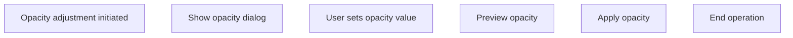
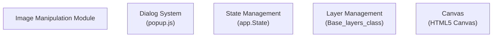

```mermaid
flowchart TD

mermaid-bwc51nrgvii-flowchart-RotateStart["Rotation initiated"]
mermaid-bwc51nrgvii-flowchart-ShowDialog["Show rotation dialog"]
mermaid-bwc51nrgvii-flowchart-UserSets["User sets angle"]
mermaid-bwc51nrgvii-flowchart-UserConfirms["User confirms"]
mermaid-bwc51nrgvii-flowchart-ApplyRotate["Apply rotation"]
mermaid-bwc51nrgvii-flowchart-CheckSize["Check if resize needed"]
mermaid-bwc51nrgvii-flowchart-ResizeCanvas["Resize canvas"]
mermaid-bwc51nrgvii-flowchart-End["End operation"]
```

```mermaid
flowchart TD

mermaid-z6a8s3cn9gd-flowchart-ColorStart["Color correction initiated"]
mermaid-z6a8s3cn9gd-flowchart-ShowDialog["Show correction dialog"]
mermaid-z6a8s3cn9gd-flowchart-UserAdjusts["User adjusts parameters"]
mermaid-z6a8s3cn9gd-flowchart-Preview["Preview changes"]
mermaid-z6a8s3cn9gd-flowchart-ApplyChanges["Apply changes"]
mermaid-z6a8s3cn9gd-flowchart-DestructiveChanges["Apply destructive changes"]
mermaid-z6a8s3cn9gd-flowchart-NonDestructive["Add non-destructive filters"]
mermaid-z6a8s3cn9gd-flowchart-End["End operation"]
```

```mermaid
flowchart TD

mermaid-qnpb1hg2fx-flowchart-FillStart["Content fill initiated"]
mermaid-qnpb1hg2fx-flowchart-ShowDialog["Show fill dialog"]
mermaid-qnpb1hg2fx-flowchart-UserSelects["User selects fill mode"]
mermaid-qnpb1hg2fx-flowchart-Preview["Preview fill"]
mermaid-qnpb1hg2fx-flowchart-ApplyFill["Apply fill"]
mermaid-qnpb1hg2fx-flowchart-GenerateBackground["Generate background"]
mermaid-qnpb1hg2fx-flowchart-PlaceOriginal["Place original image"]
mermaid-qnpb1hg2fx-flowchart-End["End operation"]
```

# Image Manipulation

> **Relevant source files**
> * [src/js/modules/image/color_corrections.js](https://github.com/viliusle/miniPaint/blob/6d0b95e5/src/js/modules/image/color_corrections.js)
> * [src/js/modules/image/decrease_colors.js](https://github.com/viliusle/miniPaint/blob/6d0b95e5/src/js/modules/image/decrease_colors.js)
> * [src/js/modules/image/opacity.js](https://github.com/viliusle/miniPaint/blob/6d0b95e5/src/js/modules/image/opacity.js)
> * [src/js/modules/image/rotate.js](https://github.com/viliusle/miniPaint/blob/6d0b95e5/src/js/modules/image/rotate.js)
> * [src/js/modules/image/trim.js](https://github.com/viliusle/miniPaint/blob/6d0b95e5/src/js/modules/image/trim.js)
> * [src/js/modules/layer/composition.js](https://github.com/viliusle/miniPaint/blob/6d0b95e5/src/js/modules/layer/composition.js)
> * [src/js/modules/tools/content_fill.js](https://github.com/viliusle/miniPaint/blob/6d0b95e5/src/js/modules/tools/content_fill.js)
> * [src/js/modules/tools/restore_alpha.js](https://github.com/viliusle/miniPaint/blob/6d0b95e5/src/js/modules/tools/restore_alpha.js)

## Purpose and Scope

This document covers the image manipulation tools and modules in miniPaint that allow users to modify, adjust, and transform images. These include operations like trimming, rotating, color correction, opacity adjustment, and more. For information about filters and effects, see [Effects & Filters](/viliusle/miniPaint/5.2-effects-and-filters).

## Overview

The image manipulation features in miniPaint operate primarily on image layers, modifying visual appearance or structural properties like dimensions and positioning. These operations are implemented as standalone modules that follow a consistent pattern of user interaction, preview generation, and state management.

```

```

Sources: [src/js/modules/image/trim.js](https://github.com/viliusle/miniPaint/blob/6d0b95e5/src/js/modules/image/trim.js)

 [src/js/modules/image/rotate.js](https://github.com/viliusle/miniPaint/blob/6d0b95e5/src/js/modules/image/rotate.js)

 [src/js/modules/image/color_corrections.js](https://github.com/viliusle/miniPaint/blob/6d0b95e5/src/js/modules/image/color_corrections.js)

## Common Implementation Pattern

Image manipulation modules in miniPaint follow a consistent implementation pattern:

```mermaid
flowchart TD

mermaid-tupsf9heyva-flowchart-UserInitiates["User initiates manipulation"]
mermaid-tupsf9heyva-flowchart-ShowDialog["Show dialog with parameters"]
mermaid-tupsf9heyva-flowchart-Preview["Generate preview with current parameters"]
mermaid-tupsf9heyva-flowchart-UserAdjusts["User adjusts parameters"]
mermaid-tupsf9heyva-flowchart-PrepareActions["Prepare action bundle"]
mermaid-tupsf9heyva-flowchart-ApplyChanges["Apply changes through State.do_action"]
mermaid-tupsf9heyva-flowchart-UpdateUI["Update UI to reflect changes"]
mermaid-tupsf9heyva-flowchart-Revert["Revert to original state"]
```



Sources: [src/js/modules/image/trim.js L42-L76](https://github.com/viliusle/miniPaint/blob/6d0b95e5/src/js/modules/image/trim.js#L42-L76)

 [src/js/modules/image/rotate.js L42-L72](https://github.com/viliusle/miniPaint/blob/6d0b95e5/src/js/modules/image/rotate.js#L42-L72)

 [src/js/modules/image/color_corrections.js L18-L60](https://github.com/viliusle/miniPaint/blob/6d0b95e5/src/js/modules/image/color_corrections.js#L18-L60)

## Image Trimming

The trim feature removes empty (transparent or white) areas from images. It can be applied to the current layer or the entire canvas.

### Implementation



### Key Features:

* **Trim layer:** Removes empty space from the current layer only
* **Trim borders:** Removes empty space from the entire canvas and repositions all layers
* **Power:** Controls sensitivity for what's considered "empty"
* **Remove white:** Determines if white color is treated as empty

### Code Structure:

* `trim()`: Shows dialog and processes user input
* `trim_layer()`: Trims a single layer
* `trim_all()`: Trims the entire canvas
* `get_trim_info()`: Analyzes an image for trimming information

Sources: [src/js/modules/image/trim.js L42-L302](https://github.com/viliusle/miniPaint/blob/6d0b95e5/src/js/modules/image/trim.js#L42-L302)

## Image Rotation

The rotation feature allows rotating images by arbitrary angles or in 90-degree increments.

### Implementation



### Key Features:

* **Custom angle:** Set any angle between 0-360 degrees
* **Right angle presets:** Quick selection of common angles (0°, 90°, 180°, 270°)
* **Keyboard shortcuts:** 'L' key rotates left by 90 degrees
* **Automatic canvas resizing:** Expands canvas if needed to fit rotated content

### Code Structure:

* `rotate()`: Shows dialog for custom rotation
* `rotate_handler()`: Applies the rotation and manages preview
* `left()`: Rotates 90° counterclockwise
* `right()`: Rotates 90° clockwise
* `check_sizes()`: Ensures canvas is large enough after rotation

Sources: [src/js/modules/image/rotate.js L42-L177](https://github.com/viliusle/miniPaint/blob/6d0b95e5/src/js/modules/image/rotate.js#L42-L177)

## Color Corrections

The color correction tools allow adjusting various color properties of an image.

### Implementation



### Key Features:

* **Brightness/Contrast:** Adjust image brightness and contrast
* **Saturation/Hue:** Modify color intensity and hue
* **Luminance:** Adjust image luminance
* **RGB Channels:** Fine-tune individual color channels
* **Non-destructive filters:** Applies some changes as layer filters (when possible)

### Code Structure:

* `color_corrections()`: Shows dialog with color adjustment controls
* `save_changes()`: Applies changes and adds non-destructive filters
* `do_corrections()`: Performs the actual color adjustments on image data

Sources: [src/js/modules/image/color_corrections.js L18-L130](https://github.com/viliusle/miniPaint/blob/6d0b95e5/src/js/modules/image/color_corrections.js#L18-L130)

## Layer Composition (Blend Modes)

The composition feature controls how a layer blends with layers beneath it.

### Implementation



### Key Features:

* **Standard blend modes:** normal, multiply, screen, overlay, etc.
* **Advanced blend modes:** color-burn, color-dodge, difference, exclusion, etc.
* **Live preview:** See blend mode effects before applying
* **Native canvas modes:** Uses HTML5 Canvas compositing operations

### Code Structure:

* `composition()`: Shows dialog with blend mode options and handles preview/application

Sources: [src/js/modules/layer/composition.js L13-L83](https://github.com/viliusle/miniPaint/blob/6d0b95e5/src/js/modules/layer/composition.js#L13-L83)

## Opacity Adjustment

The opacity tool controls layer transparency.

### Implementation



### Key Features:

* **Alpha range:** Set opacity from 0% (transparent) to 100% (opaque)
* **Live preview:** See opacity changes in real-time
* **Direct layer property:** Modifies the layer's opacity property

### Code Structure:

* `opacity()`: Shows dialog with opacity slider
* `opacity_handler()`: Applies the opacity change to the layer

Sources: [src/js/modules/image/opacity.js L11-L53](https://github.com/viliusle/miniPaint/blob/6d0b95e5/src/js/modules/image/opacity.js#L11-L53)

## Content Fill

Content Fill extends image content to fill the entire canvas, useful for creating backgrounds or filling empty areas.

### Implementation



### Key Features:

* **Multiple fill modes:** * *Expand edges:* Stretches edge pixels outward * *Cloned edges:* Tiles edge content * *Resized as background:* Resizes original as background
* **Blur control:** Adjustable blur for smooth transitions
* **Image positioning:** Maintains original image position

### Code Structure:

* `content_fill()`: Shows dialog with fill options
* `apply_affect()`: Applies the fill effect
* `change()`: Delegates to appropriate fill method based on mode
* Mode-specific methods: * `add_edge_background()` * `add_resized_background()` * `add_cloned_background()`

Sources: [src/js/modules/tools/content_fill.js L17-L262](https://github.com/viliusle/miniPaint/blob/6d0b95e5/src/js/modules/tools/content_fill.js#L17-L262)

## Additional Manipulation Tools

### Restore Alpha

Increases the transparency values in an image, useful for recovering partially transparent areas.

Key features:

* Level parameter controls intensity of alpha restoration
* Preview functionality to see results before applying

Sources: [src/js/modules/tools/restore_alpha.js L14-L68](https://github.com/viliusle/miniPaint/blob/6d0b95e5/src/js/modules/tools/restore_alpha.js#L14-L68)

### Decrease Colors

Reduces the number of colors in an image for stylistic effects or optimization.

Key features:

* Color count control (1-256 colors)
* Optional grayscale conversion
* Intelligent color selection that preserves important colors

Sources: [src/js/modules/image/decrease_colors.js L18-L170](https://github.com/viliusle/miniPaint/blob/6d0b95e5/src/js/modules/image/decrease_colors.js#L18-L170)

## Integration with Core Systems

Image manipulation operations integrate with several core miniPaint systems:



### Key Integration Points:

#### Dialog System

All manipulation tools use `Dialog_class` from `popup.js` to create user interfaces for parameter adjustment.

Example pattern:

```javascript
var settings = {    title: 'Operation Name',    preview: true,    params: [/* parameter definitions */],    on_change: function(params, canvas_preview, w, h) {        // Preview code    },    on_finish: function(params) {        // Apply changes    }};this.Dialog.show(settings);
```

#### State Management

Changes are applied through the action system for proper undo/redo support:

```
app.State.do_action(    new app.Actions.Bundle_action('operation_name', 'Operation Description', [        // Individual actions    ]));
```

#### Layer System

Image manipulation interacts with the layer system to:

* Get layer data (`Base_layers.get_layer()`)
* Convert layers to canvas for processing (`Base_layers.convert_layer_to_canvas()`)
* Update layer properties and images

Sources: [src/js/modules/image/trim.js L55-L71](https://github.com/viliusle/miniPaint/blob/6d0b95e5/src/js/modules/image/trim.js#L55-L71)

 [src/js/modules/image/rotate.js L86-L94](https://github.com/viliusle/miniPaint/blob/6d0b95e5/src/js/modules/image/rotate.js#L86-L94)

 [src/js/modules/image/color_corrections.js L74-L107](https://github.com/viliusle/miniPaint/blob/6d0b95e5/src/js/modules/image/color_corrections.js#L74-L107)

## Common Image Processing Pattern

Most image manipulation modules process images following this pattern:

1. **Get canvas from layer:** ```javascript var canvas = this.Base_layers.convert_layer_to_canvas(null, true);var ctx = canvas.getContext("2d"); ```
2. **Get image data for manipulation:** ```javascript var img = ctx.getImageData(0, 0, canvas.width, canvas.height); ```
3. **Process data:** ```javascript // Manipulate imgData.data pixelsvar processedData = someProcessingFunction(img, params); ```
4. **Apply changes:** ``` ctx.putImageData(processedData, 0, 0); ```
5. **Update layer:** ``` app.State.do_action(    new app.Actions.Update_layer_image_action(canvas)); ```

Sources: [src/js/modules/image/color_corrections.js L62-L76](https://github.com/viliusle/miniPaint/blob/6d0b95e5/src/js/modules/image/color_corrections.js#L62-L76)

 [src/js/modules/tools/restore_alpha.js L40-L53](https://github.com/viliusle/miniPaint/blob/6d0b95e5/src/js/modules/tools/restore_alpha.js#L40-L53)

 [src/js/modules/image/decrease_colors.js L45-L58](https://github.com/viliusle/miniPaint/blob/6d0b95e5/src/js/modules/image/decrease_colors.js#L45-L58)