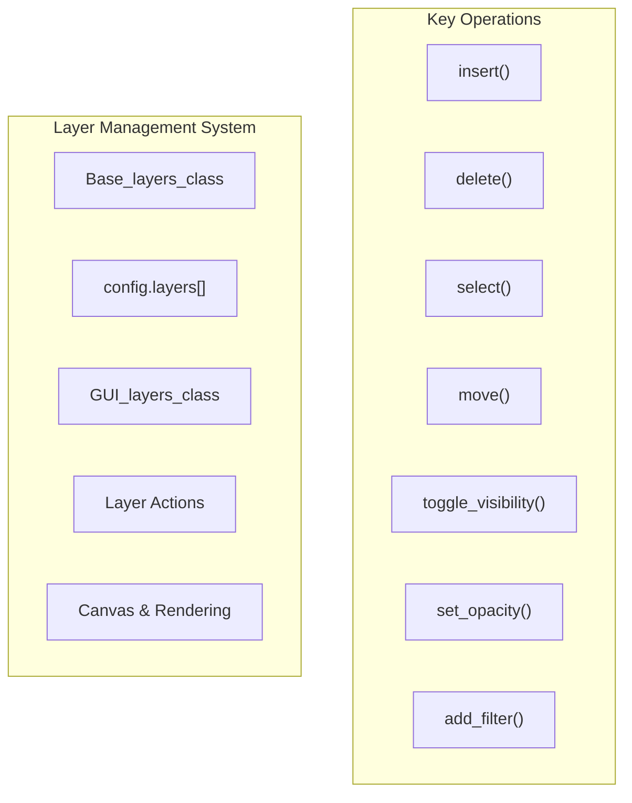
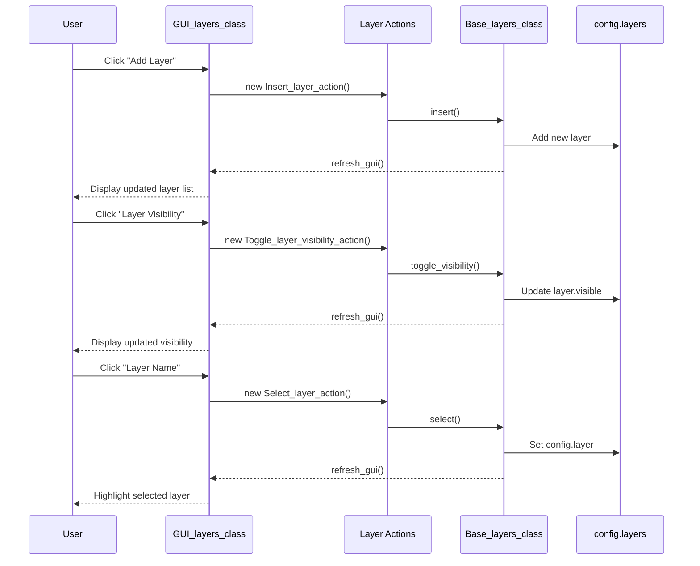

# Layer Management

> **Relevant source files**
> * [images/icons/arrow-down.svg](https://github.com/viliusle/miniPaint/blob/6d0b95e5/images/icons/arrow-down.svg)
> * [src/js/actions/add-layer-filter.js](https://github.com/viliusle/miniPaint/blob/6d0b95e5/src/js/actions/add-layer-filter.js)
> * [src/js/actions/refresh-layers-gui.js](https://github.com/viliusle/miniPaint/blob/6d0b95e5/src/js/actions/refresh-layers-gui.js)
> * [src/js/config-menu.js](https://github.com/viliusle/miniPaint/blob/6d0b95e5/src/js/config-menu.js)
> * [src/js/core/base-layers.js](https://github.com/viliusle/miniPaint/blob/6d0b95e5/src/js/core/base-layers.js)
> * [src/js/core/gui/gui-layers.js](https://github.com/viliusle/miniPaint/blob/6d0b95e5/src/js/core/gui/gui-layers.js)
> * [src/js/core/gui/gui-preview.js](https://github.com/viliusle/miniPaint/blob/6d0b95e5/src/js/core/gui/gui-preview.js)
> * [src/js/modules/file/open.js](https://github.com/viliusle/miniPaint/blob/6d0b95e5/src/js/modules/file/open.js)
> * [src/js/modules/layer/rename.js](https://github.com/viliusle/miniPaint/blob/6d0b95e5/src/js/modules/layer/rename.js)
> * [src/js/modules/layer/visibility.js](https://github.com/viliusle/miniPaint/blob/6d0b95e5/src/js/modules/layer/visibility.js)
> * [src/js/modules/tools/keypoints.js](https://github.com/viliusle/miniPaint/blob/6d0b95e5/src/js/modules/tools/keypoints.js)
> * [src/js/modules/tools/sprites.js](https://github.com/viliusle/miniPaint/blob/6d0b95e5/src/js/modules/tools/sprites.js)

## Overview

Layer Management is the core system that handles the creation, manipulation, rendering, and organization of layers in miniPaint. Layers are the fundamental building blocks that allow non-destructive editing by stacking multiple image elements. This document explains how layers are structured, managed, and rendered in the miniPaint application.

For information on the user interface for layers, see [Layers Panel](/viliusle/miniPaint/3.4-layers-panel). For details on layer filters and effects, see [Effects & Filters](/viliusle/miniPaint/5.2-effects-and-filters).

Sources: [src/js/core/base-layers.js L18-L44](https://github.com/viliusle/miniPaint/blob/6d0b95e5/src/js/core/base-layers.js#L18-L44)

## Layer Data Structure

In miniPaint, each layer is represented as an object with multiple properties that define its appearance, behavior, and rendering characteristics.

```sql
#mermaid-13cno1geo0ja{font-family:ui-sans-serif,-apple-system,system-ui,Segoe UI,Helvetica;font-size:16px;fill:#333;}@keyframes edge-animation-frame{from{stroke-dashoffset:0;}}@keyframes dash{to{stroke-dashoffset:0;}}#mermaid-13cno1geo0ja .edge-animation-slow{stroke-dasharray:9,5!important;stroke-dashoffset:900;animation:dash 50s linear infinite;stroke-linecap:round;}#mermaid-13cno1geo0ja .edge-animation-fast{stroke-dasharray:9,5!important;stroke-dashoffset:900;animation:dash 20s linear infinite;stroke-linecap:round;}#mermaid-13cno1geo0ja .error-icon{fill:#dddddd;}#mermaid-13cno1geo0ja .error-text{fill:#222222;stroke:#222222;}#mermaid-13cno1geo0ja .edge-thickness-normal{stroke-width:1px;}#mermaid-13cno1geo0ja .edge-thickness-thick{stroke-width:3.5px;}#mermaid-13cno1geo0ja .edge-pattern-solid{stroke-dasharray:0;}#mermaid-13cno1geo0ja .edge-thickness-invisible{stroke-width:0;fill:none;}#mermaid-13cno1geo0ja .edge-pattern-dashed{stroke-dasharray:3;}#mermaid-13cno1geo0ja .edge-pattern-dotted{stroke-dasharray:2;}#mermaid-13cno1geo0ja .marker{fill:#999;stroke:#999;}#mermaid-13cno1geo0ja .marker.cross{stroke:#999;}#mermaid-13cno1geo0ja svg{font-family:ui-sans-serif,-apple-system,system-ui,Segoe UI,Helvetica;font-size:16px;}#mermaid-13cno1geo0ja p{margin:0;}#mermaid-13cno1geo0ja g.classGroup text{fill:#dddddd;stroke:none;font-family:ui-sans-serif,-apple-system,system-ui,Segoe UI,Helvetica;font-size:10px;}#mermaid-13cno1geo0ja g.classGroup text .title{font-weight:bolder;}#mermaid-13cno1geo0ja .cluster-label text{fill:#444;}#mermaid-13cno1geo0ja .cluster-label span{color:#444;}#mermaid-13cno1geo0ja .cluster-label span p{background-color:transparent;}#mermaid-13cno1geo0ja .cluster rect{fill:#f8f8f8;stroke:#dddddd;stroke-width:1px;}#mermaid-13cno1geo0ja .cluster text{fill:#444;}#mermaid-13cno1geo0ja .cluster span{color:#444;}#mermaid-13cno1geo0ja .nodeLabel,#mermaid-13cno1geo0ja .edgeLabel{color:#333333;}#mermaid-13cno1geo0ja .noteLabel .nodeLabel,#mermaid-13cno1geo0ja .noteLabel .edgeLabel{color:#333;}#mermaid-13cno1geo0ja .edgeLabel .label rect{fill:#ffffff;}#mermaid-13cno1geo0ja .label text{fill:#333333;}#mermaid-13cno1geo0ja .labelBkg{background:#ffffff;}#mermaid-13cno1geo0ja .edgeLabel .label span{background:#ffffff;}#mermaid-13cno1geo0ja .classTitle{font-weight:bolder;}#mermaid-13cno1geo0ja .node rect,#mermaid-13cno1geo0ja .node circle,#mermaid-13cno1geo0ja .node ellipse,#mermaid-13cno1geo0ja .node polygon,#mermaid-13cno1geo0ja .node path{fill:#ffffff;stroke:#dddddd;stroke-width:1;}#mermaid-13cno1geo0ja .divider{stroke:#dddddd;stroke-width:1;}#mermaid-13cno1geo0ja g.clickable{cursor:pointer;}#mermaid-13cno1geo0ja g.classGroup rect{fill:#ffffff;stroke:#dddddd;}#mermaid-13cno1geo0ja g.classGroup line{stroke:#dddddd;stroke-width:1;}#mermaid-13cno1geo0ja .classLabel .box{stroke:none;stroke-width:0;fill:#ffffff;opacity:0.5;}#mermaid-13cno1geo0ja .classLabel .label{fill:#dddddd;font-size:10px;}#mermaid-13cno1geo0ja .relation{stroke:#999;stroke-width:1;fill:none;}#mermaid-13cno1geo0ja .dashed-line{stroke-dasharray:3;}#mermaid-13cno1geo0ja .dotted-line{stroke-dasharray:1 2;}#mermaid-13cno1geo0ja [id$="-compositionStart"],#mermaid-13cno1geo0ja .composition{fill:#999!important;stroke:#999!important;stroke-width:1;}#mermaid-13cno1geo0ja [id$="-compositionEnd"],#mermaid-13cno1geo0ja .composition{fill:#999!important;stroke:#999!important;stroke-width:1;}#mermaid-13cno1geo0ja [id$="-dependencyStart"],#mermaid-13cno1geo0ja .dependency{fill:#999!important;stroke:#999!important;stroke-width:1;}#mermaid-13cno1geo0ja [id$="-dependencyEnd"],#mermaid-13cno1geo0ja .dependency{fill:#999!important;stroke:#999!important;stroke-width:1;}#mermaid-13cno1geo0ja [id$="-extensionStart"],#mermaid-13cno1geo0ja .extension{fill:transparent!important;stroke:#999!important;stroke-width:1;}#mermaid-13cno1geo0ja [id$="-extensionEnd"],#mermaid-13cno1geo0ja .extension{fill:transparent!important;stroke:#999!important;stroke-width:1;}#mermaid-13cno1geo0ja [id$="-aggregationStart"],#mermaid-13cno1geo0ja .aggregation{fill:transparent!important;stroke:#999!important;stroke-width:1;}#mermaid-13cno1geo0ja [id$="-aggregationEnd"],#mermaid-13cno1geo0ja .aggregation{fill:transparent!important;stroke:#999!important;stroke-width:1;}#mermaid-13cno1geo0ja [id$="-lollipopStart"],#mermaid-13cno1geo0ja .lollipop{fill:#ffffff!important;stroke:#999!important;stroke-width:1;}#mermaid-13cno1geo0ja [id$="-lollipopEnd"],#mermaid-13cno1geo0ja .lollipop{fill:#ffffff!important;stroke:#999!important;stroke-width:1;}#mermaid-13cno1geo0ja .edgeTerminals{font-size:11px;line-height:initial;}#mermaid-13cno1geo0ja .classTitleText{text-anchor:middle;font-size:18px;fill:#333;}#mermaid-13cno1geo0ja .edgeLabel[data-look="neo"]{background-color:#ffffff;text-align:center;}#mermaid-13cno1geo0ja .edgeLabel[data-look="neo"] p{background-color:#ffffff;}#mermaid-13cno1geo0ja .edgeLabel[data-look="neo"] rect{opacity:0.5;background-color:#ffffff;fill:#ffffff;}#mermaid-13cno1geo0ja .label-icon{display:inline-block;height:1em;overflow:visible;vertical-align:-0.125em;}#mermaid-13cno1geo0ja .node .label-icon path{fill:currentColor;stroke:revert;stroke-width:revert;}#mermaid-13cno1geo0ja .node .neo-node{stroke:#dddddd;}#mermaid-13cno1geo0ja [data-look="neo"].node rect,#mermaid-13cno1geo0ja [data-look="neo"].cluster rect,#mermaid-13cno1geo0ja [data-look="neo"].node polygon{stroke:url(#mermaid-13cno1geo0ja-gradient);filter:drop-shadow( 1px 2px 2px rgba(185,185,185,1));}#mermaid-13cno1geo0ja [data-look="neo"].node path{stroke:url(#mermaid-13cno1geo0ja-gradient);stroke-width:1px;}#mermaid-13cno1geo0ja [data-look="neo"].node .outer-path{filter:drop-shadow( 1px 2px 2px rgba(185,185,185,1));}#mermaid-13cno1geo0ja [data-look="neo"].node .neo-line path{stroke:#dddddd;filter:none;}#mermaid-13cno1geo0ja [data-look="neo"].node circle{stroke:url(#mermaid-13cno1geo0ja-gradient);filter:drop-shadow( 1px 2px 2px rgba(185,185,185,1));}#mermaid-13cno1geo0ja [data-look="neo"].node circle .state-start{fill:#000000;}#mermaid-13cno1geo0ja [data-look="neo"].icon-shape .icon{fill:url(#mermaid-13cno1geo0ja-gradient);filter:drop-shadow( 1px 2px 2px rgba(185,185,185,1));}#mermaid-13cno1geo0ja [data-look="neo"].icon-shape .icon-neo path{stroke:url(#mermaid-13cno1geo0ja-gradient);filter:drop-shadow( 1px 2px 2px rgba(185,185,185,1));}#mermaid-13cno1geo0ja :root{--mermaid-font-family:"trebuchet ms",verdana,arial,sans-serif;}Layer+id: int+name: string+type: string+x: int+y: int+width: int+height: int+width_original: int+height_original: int+visible: bool+is_vector: bool+order: int+composition: string+data: various+params: object+filters: array+render_function: array+opacity: int(0-100)+rotate: int(0-359)
```

### Key Layer Properties

| Property | Type | Description |
| --- | --- | --- |
| id | int | Unique identifier for the layer |
| name | string | Display name of the layer |
| type | string | Type of layer (e.g., 'image', 'text', 'rectangle') |
| x, y | int | Position coordinates |
| width, height | int | Current dimensions |
| width_original, height_original | int | Original dimensions (before transformations) |
| visible | bool | Layer visibility state |
| opacity | int | Transparency level (0-100) |
| order | int | Stacking order (higher values appear on top) |
| composition | string | Blend mode (e.g., 'source-over', 'source-atop') |
| filters | array | Applied effects and filters |
| render_function | array | References to rendering function [class, method] |

Sources: [src/js/core/base-layers.js L18-L44](https://github.com/viliusle/miniPaint/blob/6d0b95e5/src/js/core/base-layers.js#L18-L44)

## Layer Management System Architecture

The layer management system is built around the `Base_layers_class`, which provides the core functionality for manipulating layers. This class interacts with the configuration system, GUI components, and rendering pipeline.



Sources: [src/js/core/base-layers.js L45-L882](https://github.com/viliusle/miniPaint/blob/6d0b95e5/src/js/core/base-layers.js#L45-L882)

 [src/js/core/gui/gui-layers.js L16-L198](https://github.com/viliusle/miniPaint/blob/6d0b95e5/src/js/core/gui/gui-layers.js#L16-L198)

## Layer Storage and Management

### Layer Storage

All layers are stored in the `config.layers` array. The currently selected layer is referenced in `config.layer`. Layers are assigned unique IDs via the `auto_increment` property in the `Base_layers_class`.

```
// Example of the layers array structureconfig.layers = [    {        id: 1,        name: "Background",        type: "image",        visible: true,        opacity: 100,        order: 0,        // other properties...    },    {        id: 2,        name: "Text Layer",        type: "text",        visible: true,        opacity: 80,        order: 1,        // other properties...    }]; // Currently selected layerconfig.layer = config.layers[1];
```

Sources: [src/js/core/base-layers.js L519-L530](https://github.com/viliusle/miniPaint/blob/6d0b95e5/src/js/core/base-layers.js#L519-L530)

 [src/js/core/base-layers.js L574-L576](https://github.com/viliusle/miniPaint/blob/6d0b95e5/src/js/core/base-layers.js#L574-L576)

### Core Layer Operations

The `Base_layers_class` provides the following essential methods for layer management:

| Method | Purpose |
| --- | --- |
| `insert(settings)` | Creates a new layer with the specified settings |
| `delete(id, force)` | Removes a layer by ID |
| `reset_layers(auto_insert)` | Removes all layers |
| `select(id)` | Makes a layer active |
| `toggle_visibility(id)` | Toggles a layer's visibility |
| `set_opacity(id, value)` | Changes a layer's opacity |
| `move(id, direction)` | Moves a layer up or down in the stack |
| `get_layer(id)` | Retrieves a layer by its ID |
| `get_sorted_layers()` | Returns layers sorted by their order property |
| `add_filter(id, name, params)` | Adds a filter to a layer |
| `delete_filter(id, filter_id)` | Removes a filter from a layer |

Sources: [src/js/core/base-layers.js L488-L493](https://github.com/viliusle/miniPaint/blob/6d0b95e5/src/js/core/base-layers.js#L488-L493)

 [src/js/core/base-layers.js L538-L540](https://github.com/viliusle/miniPaint/blob/6d0b95e5/src/js/core/base-layers.js#L538-L540)

 [src/js/core/base-layers.js L574-L576](https://github.com/viliusle/miniPaint/blob/6d0b95e5/src/js/core/base-layers.js#L574-L576)

 [src/js/core/base-layers.js L555-L560](https://github.com/viliusle/miniPaint/blob/6d0b95e5/src/js/core/base-layers.js#L555-L560)

 [src/js/core/base-layers.js L584-L595](https://github.com/viliusle/miniPaint/blob/6d0b95e5/src/js/core/base-layers.js#L584-L595)

 [src/js/core/base-layers.js L612-L616](https://github.com/viliusle/miniPaint/blob/6d0b95e5/src/js/core/base-layers.js#L612-L616)

 [src/js/core/base-layers.js L621-L626](https://github.com/viliusle/miniPaint/blob/6d0b95e5/src/js/core/base-layers.js#L621-L626)

 [src/js/core/base-layers.js L715-L719](https://github.com/viliusle/miniPaint/blob/6d0b95e5/src/js/core/base-layers.js#L715-L719)

 [src/js/core/base-layers.js L727-L731](https://github.com/viliusle/miniPaint/blob/6d0b95e5/src/js/core/base-layers.js#L727-L731)

## Layer Rendering System

### Rendering Pipeline

The rendering system in miniPaint processes layers from bottom to top, applying transformations, filters, and composition modes.

```mermaid
flowchart TD

mermaid-b9whcuqrl25-flowchart-Start["render()"]
mermaid-b9whcuqrl25-flowchart-PreRender["pre_render()"]
mermaid-b9whcuqrl25-flowchart-SortLayers["get_sorted_layers()"]
mermaid-b9whcuqrl25-flowchart-RenderLoop["For each layer"]
mermaid-b9whcuqrl25-flowchart-CheckVisible["Is layer visible?"]
mermaid-b9whcuqrl25-flowchart-NextLayer["Next layer"]
mermaid-b9whcuqrl25-flowchart-PreRenderObject["pre_render_object()"]
mermaid-b9whcuqrl25-flowchart-RenderObject["render_object()"]
mermaid-b9whcuqrl25-flowchart-AfterRenderObject["after_render_object()"]
mermaid-b9whcuqrl25-flowchart-CheckMore["More layers?"]
mermaid-b9whcuqrl25-flowchart-AfterRender["after_render()"]
mermaid-b9whcuqrl25-flowchart-DrawImage["Draw image or custom render"]
```



### The Rendering Process

1. **Initialization**: The `render()` method is called when the canvas needs updating
2. **Pre-rendering**: The `pre_render()` method prepares the canvas
3. **Layer Sorting**: Layers are sorted by their `order` property
4. **Layer Processing**: * For each visible layer: * `pre_render_object()` applies pre-rendering filters * `render_object()` draws the layer content * `after_render_object()` applies post-rendering filters
5. **Compositing**: Layers are composited according to their `composition` property
6. **Preview Rendering**: A miniature preview is rendered for the navigation panel

Sources: [src/js/core/base-layers.js L127-L214](https://github.com/viliusle/miniPaint/blob/6d0b95e5/src/js/core/base-layers.js#L127-L214)

 [src/js/core/base-layers.js L278-L342](https://github.com/viliusle/miniPaint/blob/6d0b95e5/src/js/core/base-layers.js#L278-L342)

 [src/js/core/base-layers.js L370-L411](https://github.com/viliusle/miniPaint/blob/6d0b95e5/src/js/core/base-layers.js#L370-L411)

 [src/js/core/base-layers.js L418-L480](https://github.com/viliusle/miniPaint/blob/6d0b95e5/src/js/core/base-layers.js#L418-L480)

### Layer Composition

The `composition` property of a layer determines how it blends with layers below it. The most commonly used composition modes are:

| Composition Mode | Effect |
| --- | --- |
| source-over | Default blending - new layer on top |
| source-atop | Only shows where content overlaps with layer below (clipping mask) |
| multiply | Multiplies colors for darker result |
| screen | Multiplies inverse colors for lighter result |
| overlay | Combination of multiply and screen |
| lighten | Takes the lightest color value between layers |
| darken | Takes the darkest color value between layers |

The composition mode is applied during rendering, and particularly for the "source-atop" mode, miniPaint uses a special rendering approach that isolates the effect in a temporary canvas.

Sources: [src/js/core/base-layers.js L298-L334](https://github.com/viliusle/miniPaint/blob/6d0b95e5/src/js/core/base-layers.js#L298-L334)

## Layer Filters System

Layers can have multiple filters applied, which modify their appearance. Filters are stored in the `filters` array within each layer.

### Filter Structure

Each filter is an object with the following properties:

```
{    id: 123456789, // Unique identifier    name: "blur",  // Filter name    params: {      // Filter parameters        amount: 5,        // other filter-specific parameters    }}
```

### Filter Processing

Filters are processed in two stages:

1. **Pre-rendering**: Some filters (like shadow) are applied before the layer content is drawn
2. **Post-rendering**: Most filters are applied after the layer content is drawn

The `pre_render_object()` and `after_render_object()` methods handle filter application by finding the appropriate filter module and calling its render methods.

Sources: [src/js/core/base-layers.js L418-L480](https://github.com/viliusle/miniPaint/blob/6d0b95e5/src/js/core/base-layers.js#L418-L480)

 [src/js/actions/add-layer-filter.js L5-L67](https://github.com/viliusle/miniPaint/blob/6d0b95e5/src/js/actions/add-layer-filter.js#L5-L67)

## Layer User Interface

The `GUI_layers_class` handles the display and interaction with layers in the user interface.



### Layer Panel Components

The layer panel in the UI consists of:

1. **Layer List**: Shows all layers with their names and visibility states
2. **Layer Controls**: Buttons for adding, duplicating, and converting layers
3. **Layer Navigation**: Buttons for moving layers up and down
4. **Layer Context Actions**: Buttons for showing/hiding, deleting, and accessing layer properties

Sources: [src/js/core/gui/gui-layers.js L16-L198](https://github.com/viliusle/miniPaint/blob/6d0b95e5/src/js/core/gui/gui-layers.js#L16-L198)

 [src/js/core/gui/gui-layers.js L135-L197](https://github.com/viliusle/miniPaint/blob/6d0b95e5/src/js/core/gui/gui-layers.js#L135-L197)

## Integration with State Management

Layer operations are implemented as actions that integrate with miniPaint's state management system, enabling undo/redo functionality.

### Layer Actions

When a layer operation is performed, an action is created and dispatched through the `app.State.do_action()` method. Examples of layer actions include:

* `Insert_layer_action`: Creates a new layer
* `Delete_layer_action`: Removes a layer
* `Select_layer_action`: Selects a layer
* `Toggle_layer_visibility_action`: Toggles layer visibility
* `Update_layer_action`: Updates layer properties
* `Reorder_layer_action`: Changes layer position
* `Add_layer_filter_action`: Adds a filter to a layer

This action-based approach ensures that all layer operations are recorded in the history stack and can be undone/redone.

Sources: [src/js/core/base-layers.js L488-L493](https://github.com/viliusle/miniPaint/blob/6d0b95e5/src/js/core/base-layers.js#L488-L493)

 [src/js/core/base-layers.js L538-L540](https://github.com/viliusle/miniPaint/blob/6d0b95e5/src/js/core/base-layers.js#L538-L540)

 [src/js/core/base-layers.js L574-L576](https://github.com/viliusle/miniPaint/blob/6d0b95e5/src/js/core/base-layers.js#L574-L576)

 [src/js/actions/add-layer-filter.js L5-L67](https://github.com/viliusle/miniPaint/blob/6d0b95e5/src/js/actions/add-layer-filter.js#L5-L67)

 [src/js/actions/refresh-layers-gui.js L5-L29](https://github.com/viliusle/miniPaint/blob/6d0b95e5/src/js/actions/refresh-layers-gui.js#L5-L29)

## Layer Preview System

The layer preview system provides a miniature view of the entire canvas, which is especially useful when working with zoomed or large images.

### Preview Rendering

1. The `render_preview()` method creates a scaled-down version of the canvas
2. The `render_preview_active_zone()` method highlights the currently visible portion
3. The preview is updated whenever the main canvas is rendered

The preview system uses the same rendering pipeline as the main canvas but scales the output to fit the preview area.

Sources: [src/js/core/base-layers.js L344-L361](https://github.com/viliusle/miniPaint/blob/6d0b95e5/src/js/core/base-layers.js#L344-L361)

 [src/js/core/gui/gui-preview.js L164-L210](https://github.com/viliusle/miniPaint/blob/6d0b95e5/src/js/core/gui/gui-preview.js#L164-L210)

## Summary

The Layer Management system in miniPaint provides a flexible and powerful way to organize and manipulate image elements. It consists of:

1. A structured data model for representing layers
2. Core operations for manipulating layers
3. A rendering pipeline for displaying layers on the canvas
4. A filter system for applying effects to layers
5. UI components for interacting with layers
6. Integration with the state management system for undo/redo functionality

Understanding this system is essential for working with and extending the layer functionality in miniPaint.

Sources: [src/js/core/base-layers.js L45-L882](https://github.com/viliusle/miniPaint/blob/6d0b95e5/src/js/core/base-layers.js#L45-L882)