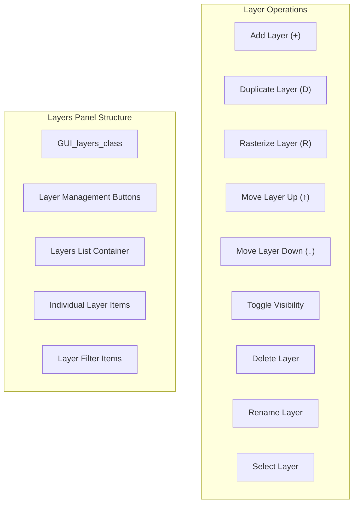
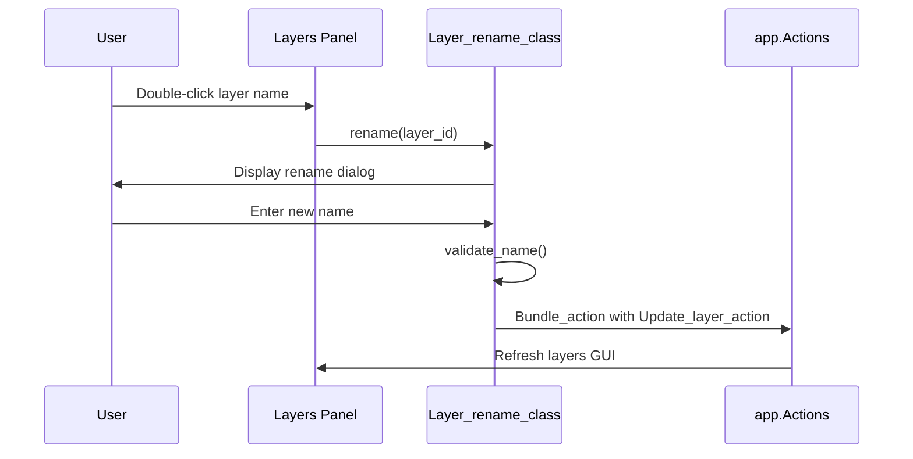

# Layers Panel

> **Relevant source files**
> * [images/icons/arrow-down.svg](https://github.com/viliusle/miniPaint/blob/6d0b95e5/images/icons/arrow-down.svg)
> * [src/js/actions/add-layer-filter.js](https://github.com/viliusle/miniPaint/blob/6d0b95e5/src/js/actions/add-layer-filter.js)
> * [src/js/actions/refresh-layers-gui.js](https://github.com/viliusle/miniPaint/blob/6d0b95e5/src/js/actions/refresh-layers-gui.js)
> * [src/js/core/gui/gui-layers.js](https://github.com/viliusle/miniPaint/blob/6d0b95e5/src/js/core/gui/gui-layers.js)
> * [src/js/modules/layer/rename.js](https://github.com/viliusle/miniPaint/blob/6d0b95e5/src/js/modules/layer/rename.js)
> * [src/js/modules/layer/visibility.js](https://github.com/viliusle/miniPaint/blob/6d0b95e5/src/js/modules/layer/visibility.js)
> * [src/js/modules/tools/keypoints.js](https://github.com/viliusle/miniPaint/blob/6d0b95e5/src/js/modules/tools/keypoints.js)
> * [src/js/modules/tools/sprites.js](https://github.com/viliusle/miniPaint/blob/6d0b95e5/src/js/modules/tools/sprites.js)

The Layers Panel is a core component of the miniPaint user interface that enables users to manage and organize layers within their image editing projects. This document describes the implementation, structure, and functionality of the Layers Panel, which is primarily controlled by the `GUI_layers_class`. For information about the underlying layer data management, see [Layer Management](/viliusle/miniPaint/2.1-layer-management).

## Overview

The Layers Panel provides visual representation and controls for all layers in the current document, allowing users to:

* Add, duplicate, delete, and reorder layers
* Toggle layer visibility
* Rename layers
* Convert layers to raster format
* View and manage layer filters
* Select the active layer for editing



Sources: [src/js/core/gui/gui-layers.js L16-L25](https://github.com/viliusle/miniPaint/blob/6d0b95e5/src/js/core/gui/gui-layers.js#L16-L25)

 [src/js/core/gui/gui-layers.js L30-L40](https://github.com/viliusle/miniPaint/blob/6d0b95e5/src/js/core/gui/gui-layers.js#L30-L40)

## Implementation

The Layers Panel is implemented by the `GUI_layers_class` which is responsible for rendering the UI components and handling user interactions with layers.

```sql
#mermaid-s9o9dnbapbe{font-family:ui-sans-serif,-apple-system,system-ui,Segoe UI,Helvetica;font-size:16px;fill:#333;}@keyframes edge-animation-frame{from{stroke-dashoffset:0;}}@keyframes dash{to{stroke-dashoffset:0;}}#mermaid-s9o9dnbapbe .edge-animation-slow{stroke-dasharray:9,5!important;stroke-dashoffset:900;animation:dash 50s linear infinite;stroke-linecap:round;}#mermaid-s9o9dnbapbe .edge-animation-fast{stroke-dasharray:9,5!important;stroke-dashoffset:900;animation:dash 20s linear infinite;stroke-linecap:round;}#mermaid-s9o9dnbapbe .error-icon{fill:#dddddd;}#mermaid-s9o9dnbapbe .error-text{fill:#222222;stroke:#222222;}#mermaid-s9o9dnbapbe .edge-thickness-normal{stroke-width:1px;}#mermaid-s9o9dnbapbe .edge-thickness-thick{stroke-width:3.5px;}#mermaid-s9o9dnbapbe .edge-pattern-solid{stroke-dasharray:0;}#mermaid-s9o9dnbapbe .edge-thickness-invisible{stroke-width:0;fill:none;}#mermaid-s9o9dnbapbe .edge-pattern-dashed{stroke-dasharray:3;}#mermaid-s9o9dnbapbe .edge-pattern-dotted{stroke-dasharray:2;}#mermaid-s9o9dnbapbe .marker{fill:#999;stroke:#999;}#mermaid-s9o9dnbapbe .marker.cross{stroke:#999;}#mermaid-s9o9dnbapbe svg{font-family:ui-sans-serif,-apple-system,system-ui,Segoe UI,Helvetica;font-size:16px;}#mermaid-s9o9dnbapbe p{margin:0;}#mermaid-s9o9dnbapbe g.classGroup text{fill:#dddddd;stroke:none;font-family:ui-sans-serif,-apple-system,system-ui,Segoe UI,Helvetica;font-size:10px;}#mermaid-s9o9dnbapbe g.classGroup text .title{font-weight:bolder;}#mermaid-s9o9dnbapbe .cluster-label text{fill:#444;}#mermaid-s9o9dnbapbe .cluster-label span{color:#444;}#mermaid-s9o9dnbapbe .cluster-label span p{background-color:transparent;}#mermaid-s9o9dnbapbe .cluster rect{fill:#f8f8f8;stroke:#dddddd;stroke-width:1px;}#mermaid-s9o9dnbapbe .cluster text{fill:#444;}#mermaid-s9o9dnbapbe .cluster span{color:#444;}#mermaid-s9o9dnbapbe .nodeLabel,#mermaid-s9o9dnbapbe .edgeLabel{color:#333333;}#mermaid-s9o9dnbapbe .noteLabel .nodeLabel,#mermaid-s9o9dnbapbe .noteLabel .edgeLabel{color:#333;}#mermaid-s9o9dnbapbe .edgeLabel .label rect{fill:#ffffff;}#mermaid-s9o9dnbapbe .label text{fill:#333333;}#mermaid-s9o9dnbapbe .labelBkg{background:#ffffff;}#mermaid-s9o9dnbapbe .edgeLabel .label span{background:#ffffff;}#mermaid-s9o9dnbapbe .classTitle{font-weight:bolder;}#mermaid-s9o9dnbapbe .node rect,#mermaid-s9o9dnbapbe .node circle,#mermaid-s9o9dnbapbe .node ellipse,#mermaid-s9o9dnbapbe .node polygon,#mermaid-s9o9dnbapbe .node path{fill:#ffffff;stroke:#dddddd;stroke-width:1;}#mermaid-s9o9dnbapbe .divider{stroke:#dddddd;stroke-width:1;}#mermaid-s9o9dnbapbe g.clickable{cursor:pointer;}#mermaid-s9o9dnbapbe g.classGroup rect{fill:#ffffff;stroke:#dddddd;}#mermaid-s9o9dnbapbe g.classGroup line{stroke:#dddddd;stroke-width:1;}#mermaid-s9o9dnbapbe .classLabel .box{stroke:none;stroke-width:0;fill:#ffffff;opacity:0.5;}#mermaid-s9o9dnbapbe .classLabel .label{fill:#dddddd;font-size:10px;}#mermaid-s9o9dnbapbe .relation{stroke:#999;stroke-width:1;fill:none;}#mermaid-s9o9dnbapbe .dashed-line{stroke-dasharray:3;}#mermaid-s9o9dnbapbe .dotted-line{stroke-dasharray:1 2;}#mermaid-s9o9dnbapbe [id$="-compositionStart"],#mermaid-s9o9dnbapbe .composition{fill:#999!important;stroke:#999!important;stroke-width:1;}#mermaid-s9o9dnbapbe [id$="-compositionEnd"],#mermaid-s9o9dnbapbe .composition{fill:#999!important;stroke:#999!important;stroke-width:1;}#mermaid-s9o9dnbapbe [id$="-dependencyStart"],#mermaid-s9o9dnbapbe .dependency{fill:#999!important;stroke:#999!important;stroke-width:1;}#mermaid-s9o9dnbapbe [id$="-dependencyEnd"],#mermaid-s9o9dnbapbe .dependency{fill:#999!important;stroke:#999!important;stroke-width:1;}#mermaid-s9o9dnbapbe [id$="-extensionStart"],#mermaid-s9o9dnbapbe .extension{fill:transparent!important;stroke:#999!important;stroke-width:1;}#mermaid-s9o9dnbapbe [id$="-extensionEnd"],#mermaid-s9o9dnbapbe .extension{fill:transparent!important;stroke:#999!important;stroke-width:1;}#mermaid-s9o9dnbapbe [id$="-aggregationStart"],#mermaid-s9o9dnbapbe .aggregation{fill:transparent!important;stroke:#999!important;stroke-width:1;}#mermaid-s9o9dnbapbe [id$="-aggregationEnd"],#mermaid-s9o9dnbapbe .aggregation{fill:transparent!important;stroke:#999!important;stroke-width:1;}#mermaid-s9o9dnbapbe [id$="-lollipopStart"],#mermaid-s9o9dnbapbe .lollipop{fill:#ffffff!important;stroke:#999!important;stroke-width:1;}#mermaid-s9o9dnbapbe [id$="-lollipopEnd"],#mermaid-s9o9dnbapbe .lollipop{fill:#ffffff!important;stroke:#999!important;stroke-width:1;}#mermaid-s9o9dnbapbe .edgeTerminals{font-size:11px;line-height:initial;}#mermaid-s9o9dnbapbe .classTitleText{text-anchor:middle;font-size:18px;fill:#333;}#mermaid-s9o9dnbapbe .edgeLabel[data-look="neo"]{background-color:#ffffff;text-align:center;}#mermaid-s9o9dnbapbe .edgeLabel[data-look="neo"] p{background-color:#ffffff;}#mermaid-s9o9dnbapbe .edgeLabel[data-look="neo"] rect{opacity:0.5;background-color:#ffffff;fill:#ffffff;}#mermaid-s9o9dnbapbe .label-icon{display:inline-block;height:1em;overflow:visible;vertical-align:-0.125em;}#mermaid-s9o9dnbapbe .node .label-icon path{fill:currentColor;stroke:revert;stroke-width:revert;}#mermaid-s9o9dnbapbe .node .neo-node{stroke:#dddddd;}#mermaid-s9o9dnbapbe [data-look="neo"].node rect,#mermaid-s9o9dnbapbe [data-look="neo"].cluster rect,#mermaid-s9o9dnbapbe [data-look="neo"].node polygon{stroke:url(#mermaid-s9o9dnbapbe-gradient);filter:drop-shadow( 1px 2px 2px rgba(185,185,185,1));}#mermaid-s9o9dnbapbe [data-look="neo"].node path{stroke:url(#mermaid-s9o9dnbapbe-gradient);stroke-width:1px;}#mermaid-s9o9dnbapbe [data-look="neo"].node .outer-path{filter:drop-shadow( 1px 2px 2px rgba(185,185,185,1));}#mermaid-s9o9dnbapbe [data-look="neo"].node .neo-line path{stroke:#dddddd;filter:none;}#mermaid-s9o9dnbapbe [data-look="neo"].node circle{stroke:url(#mermaid-s9o9dnbapbe-gradient);filter:drop-shadow( 1px 2px 2px rgba(185,185,185,1));}#mermaid-s9o9dnbapbe [data-look="neo"].node circle .state-start{fill:#000000;}#mermaid-s9o9dnbapbe [data-look="neo"].icon-shape .icon{fill:url(#mermaid-s9o9dnbapbe-gradient);filter:drop-shadow( 1px 2px 2px rgba(185,185,185,1));}#mermaid-s9o9dnbapbe [data-look="neo"].icon-shape .icon-neo path{stroke:url(#mermaid-s9o9dnbapbe-gradient);filter:drop-shadow( 1px 2px 2px rgba(185,185,185,1));}#mermaid-s9o9dnbapbe :root{--mermaid-font-family:"trebuchet ms",verdana,arial,sans-serif;}usesusesusesusesdispatchesGUI_layers_class+Base_layers+Helper+Layer_rename+Effects_browser+Layer_duplicate+Layer_raster+Tools_translate+render_main_layers()+set_events()+render_layers()Base_layers_class+layer operationsLayer_rename_class+rename()Layer_duplicate_class+duplicate()Layer_raster_class+raster()app.Actions+Insert_layer_action+Delete_layer_action+Toggle_layer_visibility_action+Reorder_layer_action+Select_layer_action
```

Sources: [src/js/core/gui/gui-layers.js L30-L40](https://github.com/viliusle/miniPaint/blob/6d0b95e5/src/js/core/gui/gui-layers.js#L30-L40)

 [src/js/core/gui/gui-layers.js L51-L129](https://github.com/viliusle/miniPaint/blob/6d0b95e5/src/js/core/gui/gui-layers.js#L51-L129)

## Panel Structure

The Layers Panel consists of the following key components:

1. **Layer Management Buttons**: * Add Layer (`+`) * Duplicate Layer (`D`) * Convert to Raster (`R`) * Move Layer Up (↑) * Move Layer Down (↓)
2. **Layers List Container**: * Displays all layers in the document * Layers are sorted by their order, with higher order values displayed at the top * The currently selected layer is highlighted * Each layer item shows: * Visibility toggle button * Delete button * Layer name * Layers with source-atop composition mode display an arrow-down icon
3. **Filters Section**: * Displayed under a layer when it has filters applied * Shows the name of each filter * Provides a delete button for each filter

### HTML Template

The basic structure of the Layers Panel is defined by a template in the `GUI_layers_class`:

```sql
<button type="button" class="layer_add trn" id="insert_layer" title="Insert new layer">+</button>
<button type="button" class="layer_duplicate trn" id="layer_duplicate" title="Duplicate layer">D</button>
<button type="button" class="layer_raster trn" id="layer_raster" title="Convert layer to raster">R</button>

<button type="button" class="layers_arrow trn" title="Move layer down" id="layer_down">↓</button>
<button type="button" class="layers_arrow trn" title="Move layer up" id="layer_up">↑</button>

<div class="layers_list" id="layers"></div>
```

Sources: [src/js/core/gui/gui-layers.js L16-L25](https://github.com/viliusle/miniPaint/blob/6d0b95e5/src/js/core/gui/gui-layers.js#L16-L25)

 [src/js/core/gui/gui-layers.js L134-L196](https://github.com/viliusle/miniPaint/blob/6d0b95e5/src/js/core/gui/gui-layers.js#L134-L196)

## Layer Operations

The Layers Panel supports several operations on layers, which are implemented through event handlers and actions.

### Adding a Layer

When the "+" button is clicked, a new layer is created via the `Insert_layer_action`:

```
app.State.do_action(    new app.Actions.Insert_layer_action());
```

Sources: [src/js/core/gui/gui-layers.js L56-L60](https://github.com/viliusle/miniPaint/blob/6d0b95e5/src/js/core/gui/gui-layers.js#L56-L60)

### Duplicating a Layer

When the "D" button is clicked, the selected layer is duplicated using the `Layer_duplicate_class`:

```
_this.Layer_duplicate.duplicate();
```

Sources: [src/js/core/gui/gui-layers.js L62-L65](https://github.com/viliusle/miniPaint/blob/6d0b95e5/src/js/core/gui/gui-layers.js#L62-L65)

### Converting to Raster

When the "R" button is clicked, the selected layer is converted to a raster layer using the `Layer_raster_class`:

```
_this.Layer_raster.raster();
```

Sources: [src/js/core/gui/gui-layers.js L66-L69](https://github.com/viliusle/miniPaint/blob/6d0b95e5/src/js/core/gui/gui-layers.js#L66-L69)

### Moving Layers

The "↑" and "↓" buttons allow reordering layers with the `Reorder_layer_action`:

```
// Move layer upapp.State.do_action(    new app.Actions.Reorder_layer_action(config.layer.id, 1)); // Move layer downapp.State.do_action(    new app.Actions.Reorder_layer_action(config.layer.id, -1));
```

Sources: [src/js/core/gui/gui-layers.js L70-L81](https://github.com/viliusle/miniPaint/blob/6d0b95e5/src/js/core/gui/gui-layers.js#L70-L81)

### Toggling Visibility

Clicking the visibility icon toggles the layer's visibility using the `Toggle_layer_visibility_action`:

```
app.State.do_action(    new app.Actions.Toggle_layer_visibility_action(target.dataset.id));
```

Sources: [src/js/core/gui/gui-layers.js L82-L87](https://github.com/viliusle/miniPaint/blob/6d0b95e5/src/js/core/gui/gui-layers.js#L82-L87)

 [src/js/modules/layer/visibility.js L11-L15](https://github.com/viliusle/miniPaint/blob/6d0b95e5/src/js/modules/layer/visibility.js#L11-L15)

### Deleting a Layer

Clicking the delete button removes the layer using the `Delete_layer_action`:

```
app.State.do_action(    new app.Actions.Delete_layer_action(target.dataset.id));
```

Sources: [src/js/core/gui/gui-layers.js L88-L93](https://github.com/viliusle/miniPaint/blob/6d0b95e5/src/js/core/gui/gui-layers.js#L88-L93)

### Selecting a Layer

Clicking a layer name selects it as the active layer using the `Select_layer_action`:

```
app.State.do_action(    new app.Actions.Select_layer_action(target.dataset.id));
```

Sources: [src/js/core/gui/gui-layers.js L94-L101](https://github.com/viliusle/miniPaint/blob/6d0b95e5/src/js/core/gui/gui-layers.js#L94-L101)

### Renaming a Layer

Double-clicking a layer name allows renaming it using the `Layer_rename_class`:

```
_this.Layer_rename.rename(target.dataset.id);
```

The rename dialog is triggered with validation to ensure the name doesn't contain special characters:



Sources: [src/js/core/gui/gui-layers.js L122-L128](https://github.com/viliusle/miniPaint/blob/6d0b95e5/src/js/core/gui/gui-layers.js#L122-L128)

 [src/js/modules/layer/rename.js L8-L53](https://github.com/viliusle/miniPaint/blob/6d0b95e5/src/js/modules/layer/rename.js#L8-L53)

## Layer Filters

Filters applied to layers are displayed in a collapsible section below each layer. The Layers Panel allows:

1. **Viewing Filters**: Each filter is shown with its name
2. **Editing Filters**: Clicking a filter name opens the filter editing dialog
3. **Deleting Filters**: Clicking the delete button removes the filter

### Filter Display

Filters are rendered below their corresponding layer in the layers list:

```sql
<div class="filters">    <div class="filter">        <span class="delete" id="delete_filter" data-pid="LAYER_ID" data-id="FILTER_ID" title="delete"></span>        <span class="layer_name" id="filter_name" data-pid="LAYER_ID" data-id="FILTER_ID" data-filter="FILTER_NAME">FILTER_TITLE</span>        <div class="clear"></div>    </div></div>
```

### Deleting Filters

When the delete button for a filter is clicked, the filter is removed using the `Delete_layer_filter_action`:

```
app.State.do_action(    new app.Actions.Delete_layer_filter_action(target.dataset.pid, target.dataset.id));
```

Sources: [src/js/core/gui/gui-layers.js L102-L107](https://github.com/viliusle/miniPaint/blob/6d0b95e5/src/js/core/gui/gui-layers.js#L102-L107)

 [src/js/core/gui/gui-layers.js L174-L187](https://github.com/viliusle/miniPaint/blob/6d0b95e5/src/js/core/gui/gui-layers.js#L174-L187)

### Editing Filters

Clicking a filter name opens the filter's editing dialog:

```javascript
var effects = _this.Effects_browser.get_effects_list();var key = target.dataset.filter.toLowerCase();for (var i in effects) {    if(effects[i].title.toLowerCase() == key){        _this.Base_layers.select(target.dataset.pid);        var function_name = _this.Effects_browser.get_function_from_path(key);        effects[i].object<FileRef file-url="https://github.com/viliusle/miniPaint/blob/6d0b95e5/function_name" undefined  file-path="function_name">Hii</FileRef>;    }}
```

Sources: [src/js/core/gui/gui-layers.js L108-L119](https://github.com/viliusle/miniPaint/blob/6d0b95e5/src/js/core/gui/gui-layers.js#L108-L119)

## Rendering Layers in the Panel

The `render_layers()` method is responsible for generating the HTML content for the layers list. It:

1. Retrieves all layers from `config.layers` and sorts them by order
2. Clears the existing layers list
3. Iterates through each layer, generating HTML for: * Layer item with visibility toggle, delete button, and name * Any filters applied to the layer
4. Updates the DOM with the generated HTML
5. Applies translations if necessary

```mermaid
flowchart TD

mermaid-o3km6irvgz-flowchart-A["render_layers()"]
mermaid-o3km6irvgz-flowchart-B["Sort layers by order"]
mermaid-o3km6irvgz-flowchart-C["Clear existing layers list"]
mermaid-o3km6irvgz-flowchart-D["For each layer"]
mermaid-o3km6irvgz-flowchart-E["Generate layer HTML"]
mermaid-o3km6irvgz-flowchart-F["Check if layer has filters"]
mermaid-o3km6irvgz-flowchart-G["Generate filters HTML"]
mermaid-o3km6irvgz-flowchart-H["Continue to next layer"]
mermaid-o3km6irvgz-flowchart-I["Update DOM"]
mermaid-o3km6irvgz-flowchart-J["Apply translations if needed"]
```



The generated HTML for each layer has special styling for the currently selected layer and for layers with different composition modes.

Sources: [src/js/core/gui/gui-layers.js L134-L196](https://github.com/viliusle/miniPaint/blob/6d0b95e5/src/js/core/gui/gui-layers.js#L134-L196)

## Integration with Action System

The Layers Panel relies heavily on miniPaint's action system for operations that modify layers. Most operations are implemented as actions that:

1. Are dispatched through `app.State.do_action()`
2. Support undo/redo functionality
3. Trigger GUI updates when completed

Key actions used by the Layers Panel include:

* `Insert_layer_action`
* `Delete_layer_action`
* `Select_layer_action`
* `Reorder_layer_action`
* `Toggle_layer_visibility_action`
* `Delete_layer_filter_action`
* `Update_layer_action`
* `Refresh_layers_gui_action`

These actions ensure that all layer modifications are recorded in the undo history and that the UI is properly updated to reflect changes.

Sources: [src/js/core/gui/gui-layers.js L51-L119](https://github.com/viliusle/miniPaint/blob/6d0b95e5/src/js/core/gui/gui-layers.js#L51-L119)

 [src/js/actions/refresh-layers-gui.js L5-L29](https://github.com/viliusle/miniPaint/blob/6d0b95e5/src/js/actions/refresh-layers-gui.js#L5-L29)

## Tables

### Layer Panel Button Reference

| Button | ID | Function | Description |
| --- | --- | --- | --- |
| + | insert_layer | Add new layer | Creates a new blank layer |
| D | layer_duplicate | Duplicate layer | Creates a copy of the selected layer |
| R | layer_raster | Convert to raster | Converts vector or text layers to raster |
| ↑ | layer_up | Move layer up | Increases the layer's order value |
| ↓ | layer_down | Move layer down | Decreases the layer's order value |

Sources: [src/js/core/gui/gui-layers.js L16-L24](https://github.com/viliusle/miniPaint/blob/6d0b95e5/src/js/core/gui/gui-layers.js#L16-L24)

### Layer Item Components

| Element | Purpose | User Interaction |
| --- | --- | --- |
| Visibility button | Shows/hides layer | Click to toggle |
| Delete button | Removes layer | Click to delete |
| Layer name | Identifies layer | Click to select, double-click to rename |
| Filters list | Shows applied filters | Click filter to edit, click X to delete |

Sources: [src/js/core/gui/gui-layers.js L156-L187](https://github.com/viliusle/miniPaint/blob/6d0b95e5/src/js/core/gui/gui-layers.js#L156-L187)

## Layer Panel Initialization

The Layers Panel is initialized by the `render_main_layers()` method, which:

1. Inserts the HTML template into the DOM
2. Translates the UI if necessary
3. Renders the layers list
4. Sets up event handlers

This method is called by the main GUI initialization process when miniPaint starts or when the UI needs to be refreshed.

Sources: [src/js/core/gui/gui-layers.js L42-L49](https://github.com/viliusle/miniPaint/blob/6d0b95e5/src/js/core/gui/gui-layers.js#L42-L49)