# Layout

> **Relevant source files**
> * [index.html](https://github.com/viliusle/miniPaint/blob/6d0b95e5/index.html)
> * [manifest-disabled.json](https://github.com/viliusle/miniPaint/blob/6d0b95e5/manifest-disabled.json)
> * [src/css/layout.css](https://github.com/viliusle/miniPaint/blob/6d0b95e5/src/css/layout.css)
> * [src/js/core/base-gui.js](https://github.com/viliusle/miniPaint/blob/6d0b95e5/src/js/core/base-gui.js)

## Purpose and Scope

This document describes the overall UI layout system of miniPaint, explaining how the application interface is structured, organized, and rendered. It covers the grid-based layout, responsive design implementation, and how various UI components are positioned and interact with each other. For information about specific UI components like menus or tools panels, see [Menu System](/viliusle/miniPaint/3.2-menu-system) and [Tools Panel](/viliusle/miniPaint/3.3-tools-panel).

## Overall Layout Structure

miniPaint uses a CSS grid-based layout system to organize its interface into distinct functional areas. The application UI is divided into several main regions: a top menu bar, a submenu area, left sidebar (tools), main canvas area, and right sidebar (layers, colors, etc.).

### Main Layout Grid

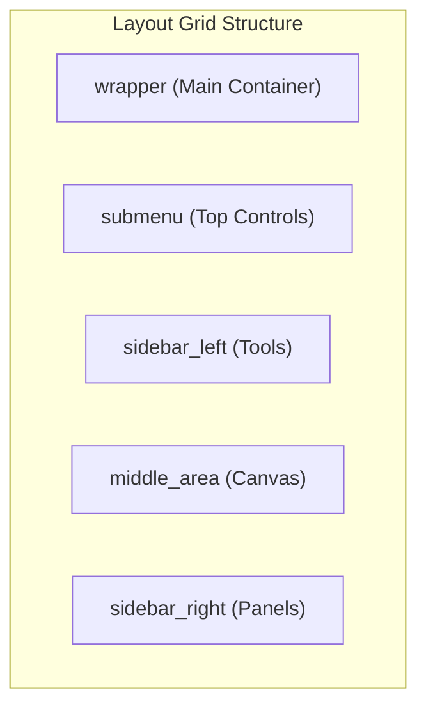

Sources: [index.html L33-L92](https://github.com/viliusle/miniPaint/blob/6d0b95e5/index.html#L33-L92)

 [src/css/layout.css L1-L20](https://github.com/viliusle/miniPaint/blob/6d0b95e5/src/css/layout.css#L1-L20)

The layout is defined as a CSS grid with the following template areas:

* `submenu`: Spans across the top, containing logo and tool attributes
* `sidebar_left`: Left side, containing tool buttons
* `main`: Middle area, containing the canvas
* `sidebar_right`: Right side, containing layers, colors, and information panels

### HTML Structure

The basic HTML structure that implements this layout is:

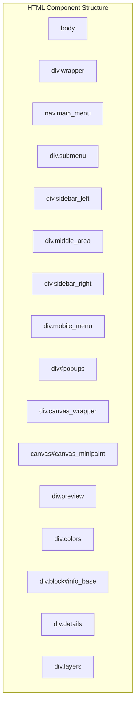

Sources: [index.html L32-L103](https://github.com/viliusle/miniPaint/blob/6d0b95e5/index.html#L32-L103)

## Component Details

### Left Sidebar (Tools)

The left sidebar contains tool buttons arranged in a vertical panel. Each tool is represented by an icon button with a specific class that determines its appearance.

Key characteristics:

* Fixed width (40px by default)
* Scrollable when tools exceed the available height
* Each tool is 30x25px with specific icon styling

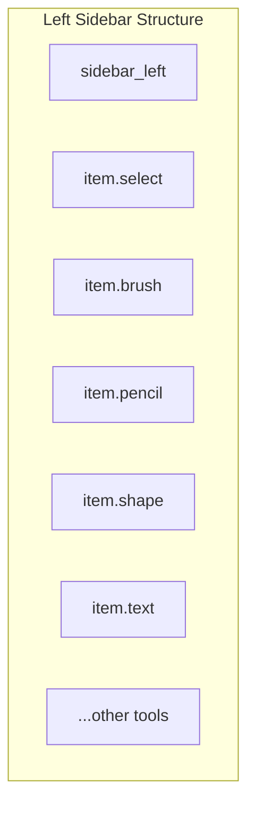

Sources: [src/css/layout.css L252-L329](https://github.com/viliusle/miniPaint/blob/6d0b95e5/src/css/layout.css#L252-L329)

 [index.html L45](https://github.com/viliusle/miniPaint/blob/6d0b95e5/index.html#L45-L45)

### Right Sidebar (Panels)

The right sidebar contains multiple expandable panels for various functions:

* Preview panel: Shows a thumbnail of the entire canvas
* Colors panel: For color selection
* Information panel: Displays image statistics
* Layer details panel: Shows details of the selected layer
* Layers panel: For managing layers

Each panel can be expanded or collapsed using a toggle header.

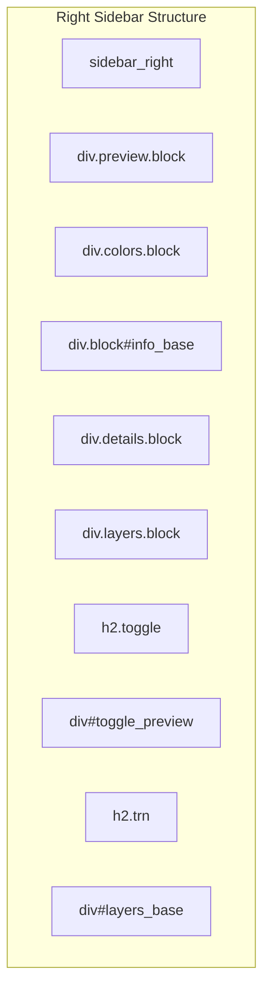

Sources: [index.html L66-L91](https://github.com/viliusle/miniPaint/blob/6d0b95e5/index.html#L66-L91)

 [src/css/layout.css L333-L348](https://github.com/viliusle/miniPaint/blob/6d0b95e5/src/css/layout.css#L333-L348)

### Canvas Area

The central canvas area contains:

* Rulers (optional)
* Main canvas wrapper
* Transparent grid background
* The actual canvas element

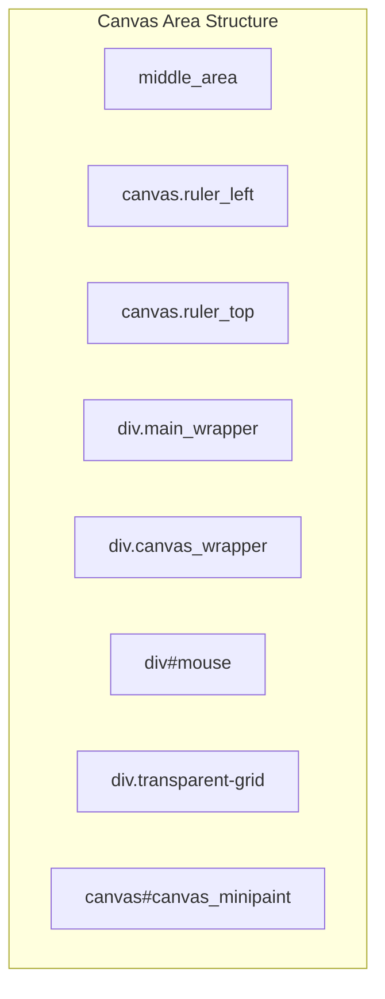

Sources: [index.html L48-L64](https://github.com/viliusle/miniPaint/blob/6d0b95e5/index.html#L48-L64)

 [src/css/layout.css L613-L735](https://github.com/viliusle/miniPaint/blob/6d0b95e5/src/css/layout.css#L613-L735)

## Responsive Design Implementation

miniPaint implements responsive design to adapt to different screen sizes, particularly focusing on mobile devices.

### Desktop vs Mobile Layout

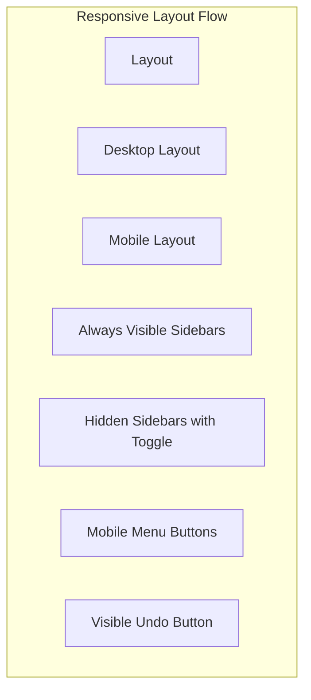

Sources: [src/css/layout.css L193-L197](https://github.com/viliusle/miniPaint/blob/6d0b95e5/src/css/layout.css#L193-L197)

 [src/css/layout.css L582-L610](https://github.com/viliusle/miniPaint/blob/6d0b95e5/src/css/layout.css#L582-L610)

Key responsive features include:

1. Sidebars become hidden off-screen on mobile devices (width ≤ 700px)
2. Toggle buttons appear to show/hide sidebars
3. Canvas area adjusts to available space
4. Undo button becomes visible on smaller screens

### Media Queries

The layout uses several media queries to adapt to different screen sizes:

1. Mobile devices (max-width: 700px): * Moves sidebars off-screen * Adds slide-out behavior * Shows mobile menu buttons
2. Smaller height screens (max-height: 690px): * Adjusts left sidebar width to 75px
3. Very small screens (max-height: 450px): * Further adjusts left sidebar width to 88px

Sources: [src/css/layout.css L582-L610](https://github.com/viliusle/miniPaint/blob/6d0b95e5/src/css/layout.css#L582-L610)

 [src/css/layout.css L731-L745](https://github.com/viliusle/miniPaint/blob/6d0b95e5/src/css/layout.css#L731-L745)

## Canvas Sizing and Positioning

The canvas element is dynamically sized based on:

1. The actual document dimensions (WIDTH and HEIGHT in config)
2. The current zoom level
3. The available viewport size

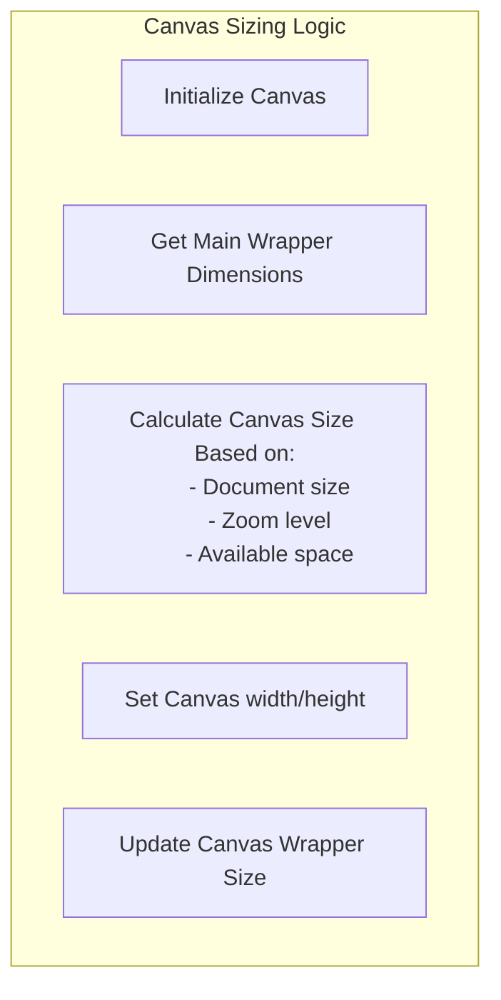

Sources: [src/js/core/base-gui.js L239-L270](https://github.com/viliusle/miniPaint/blob/6d0b95e5/src/js/core/base-gui.js#L239-L270)

The `prepare_canvas()` method in Base_gui_class handles this sizing logic, ensuring that:

1. The canvas doesn't exceed the available viewport
2. The proper scaling is applied based on zoom
3. The wrapper dimensions match the canvas size

## Panel Toggling System

miniPaint implements a panel toggling system that allows users to show/hide panels in the interface.

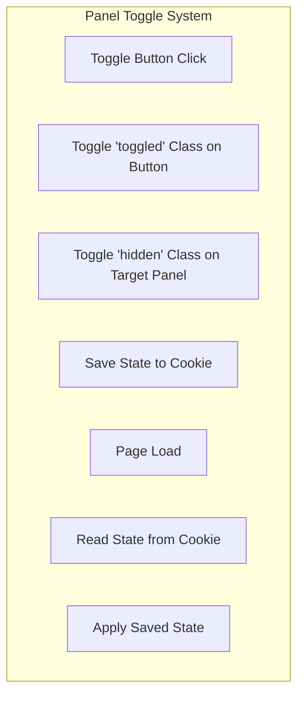

Sources: [src/js/core/base-gui.js L187-L201](https://github.com/viliusle/miniPaint/blob/6d0b95e5/src/js/core/base-gui.js#L187-L201)

 [src/js/core/base-gui.js L272-L284](https://github.com/viliusle/miniPaint/blob/6d0b95e5/src/js/core/base-gui.js#L272-L284)

Key features:

* Toggle buttons are identified by class `.toggle`
* Target panel ID is specified in `data-target` attribute
* Panel state (expanded/collapsed) is saved in cookies
* States are restored when the application loads

## Mobile Menu System

On mobile devices, the sidebars are hidden by default and can be toggled with dedicated buttons.

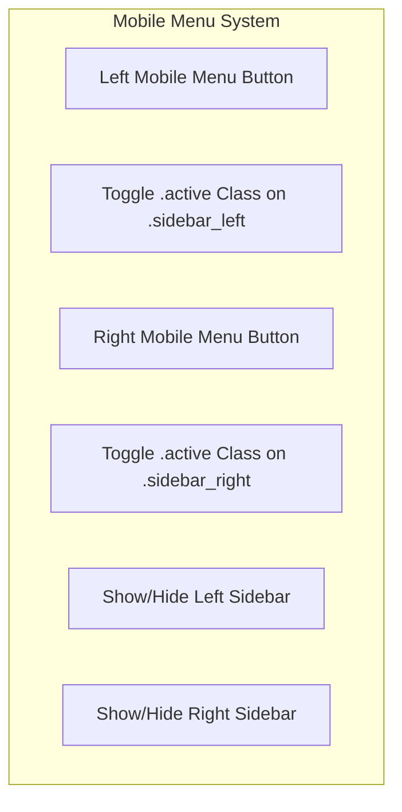

Sources: [src/js/core/base-gui.js L203-L208](https://github.com/viliusle/miniPaint/blob/6d0b95e5/src/js/core/base-gui.js#L203-L208)

 [index.html L93-L100](https://github.com/viliusle/miniPaint/blob/6d0b95e5/index.html#L93-L100)

 [src/css/layout.css L582-L610](https://github.com/viliusle/miniPaint/blob/6d0b95e5/src/css/layout.css#L582-L610)

## Layout Initialization Process

When the application starts, the layout is initialized through the following process:

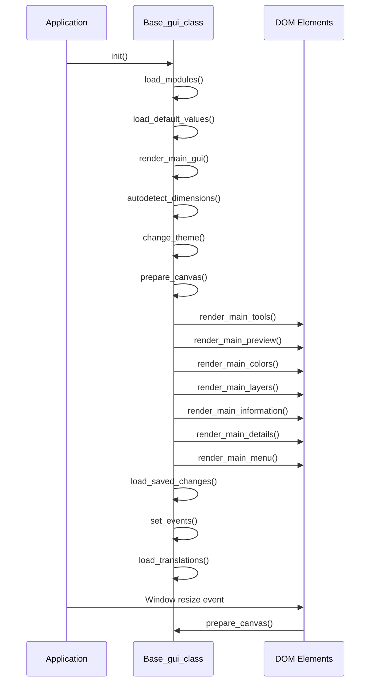

Sources: [src/js/core/base-gui.js L72-L152](https://github.com/viliusle/miniPaint/blob/6d0b95e5/src/js/core/base-gui.js#L72-L152)

 [src/js/core/base-gui.js L209-L214](https://github.com/viliusle/miniPaint/blob/6d0b95e5/src/js/core/base-gui.js#L209-L214)

## Theme Support

The layout supports multiple themes with a class-based theming system. The theme affects colors and styles throughout the interface.

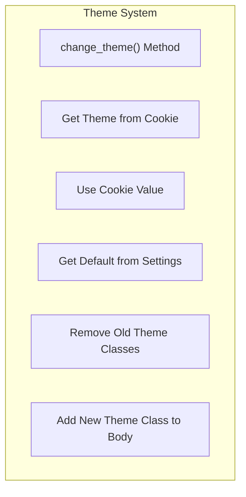

Sources: [src/js/core/base-gui.js L474-L490](https://github.com/viliusle/miniPaint/blob/6d0b95e5/src/js/core/base-gui.js#L474-L490)

Themes are applied by adding a class to the `body` element, which then cascades to affect all themed elements through CSS variables.

## Conclusion

miniPaint's layout system is designed to be responsive, flexible, and user-friendly across different device sizes. The grid-based structure provides a clear separation of components while maintaining a cohesive interface. The toggle system allows users to customize their workspace by showing only the panels they need.

The responsive design ensures that the application remains usable on mobile devices through an adaptive layout that changes based on the available screen space. The central canvas area dynamically adjusts to make the most of the available space while maintaining the proper aspect ratio and scaling based on zoom level.

By understanding this layout system, developers can effectively modify, extend, or debug the miniPaint interface while maintaining its responsive and user-friendly design.