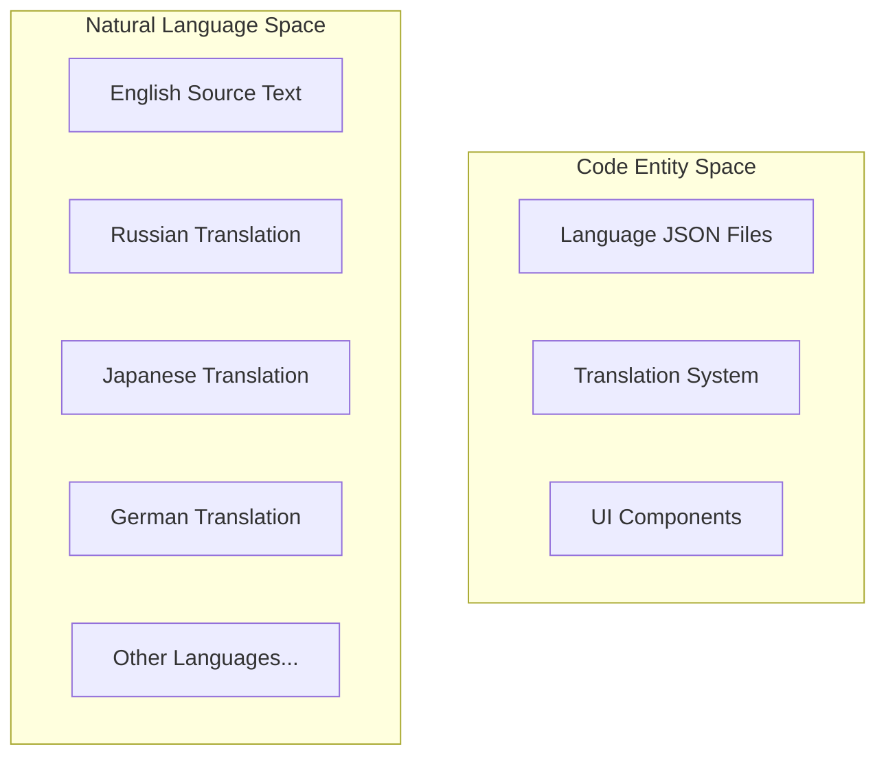
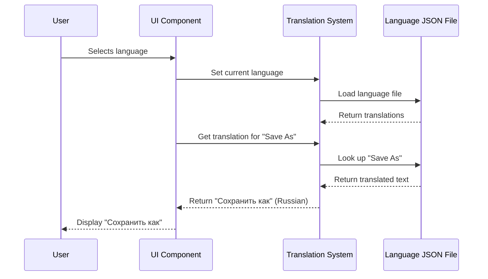

# Localization

> **Relevant source files**
> * [src/js/languages/ar.json](https://github.com/viliusle/miniPaint/blob/6d0b95e5/src/js/languages/ar.json)
> * [src/js/languages/de.json](https://github.com/viliusle/miniPaint/blob/6d0b95e5/src/js/languages/de.json)
> * [src/js/languages/el.json](https://github.com/viliusle/miniPaint/blob/6d0b95e5/src/js/languages/el.json)
> * [src/js/languages/empty.json](https://github.com/viliusle/miniPaint/blob/6d0b95e5/src/js/languages/empty.json)
> * [src/js/languages/es.json](https://github.com/viliusle/miniPaint/blob/6d0b95e5/src/js/languages/es.json)
> * [src/js/languages/fr.json](https://github.com/viliusle/miniPaint/blob/6d0b95e5/src/js/languages/fr.json)
> * [src/js/languages/it.json](https://github.com/viliusle/miniPaint/blob/6d0b95e5/src/js/languages/it.json)
> * [src/js/languages/ja.json](https://github.com/viliusle/miniPaint/blob/6d0b95e5/src/js/languages/ja.json)
> * [src/js/languages/ko.json](https://github.com/viliusle/miniPaint/blob/6d0b95e5/src/js/languages/ko.json)
> * [src/js/languages/lt.json](https://github.com/viliusle/miniPaint/blob/6d0b95e5/src/js/languages/lt.json)
> * [src/js/languages/pt.json](https://github.com/viliusle/miniPaint/blob/6d0b95e5/src/js/languages/pt.json)
> * [src/js/languages/ru.json](https://github.com/viliusle/miniPaint/blob/6d0b95e5/src/js/languages/ru.json)
> * [src/js/languages/tr.json](https://github.com/viliusle/miniPaint/blob/6d0b95e5/src/js/languages/tr.json)

The Localization system in miniPaint enables the application interface to be translated into multiple languages, making it accessible to a global audience. This document explains how localization works in miniPaint, how to add new languages, and how to maintain translations.

## System Overview

miniPaint implements localization through a simple yet effective system using JSON files that map English source text to translated text in various languages. Each supported language has its own JSON file in the languages directory.



Here's how the translation process works when a user interacts with the application:



Sources: [src/js/languages/ru.json](https://github.com/viliusle/miniPaint/blob/6d0b95e5/src/js/languages/ru.json)

 [src/js/languages/empty.json](https://github.com/viliusle/miniPaint/blob/6d0b95e5/src/js/languages/empty.json)

## Language Files Structure

Each language has its own JSON file in the `src/js/languages/` directory. The filename corresponds to the language code (e.g., `ru.json` for Russian, `ja.json` for Japanese).

The structure of each language file is a simple key-value mapping:

```json
{    "English text": "Translated text",    "Another English text": "Another translated text"}
```

For example, in the Russian language file [src/js/languages/ru.json L2-L5](https://github.com/viliusle/miniPaint/blob/6d0b95e5/src/js/languages/ru.json#L2-L5)

 you would find:

```json
{    "A problem occurred while removing undo history. It": "Ошибка при удалении истории отмен. Это",    "About": "О проекте",    "Active": "Активный",    "Aden": "Aden"}
```

The keys are the original English text strings used in the application, and the values are the translated strings in the target language. When text needs to be displayed in the UI, the system looks up the English text in the appropriate language file and uses the translated text if available.

Sources: [src/js/languages/ru.json](https://github.com/viliusle/miniPaint/blob/6d0b95e5/src/js/languages/ru.json)

 [src/js/languages/ja.json](https://github.com/viliusle/miniPaint/blob/6d0b95e5/src/js/languages/ja.json)

 [src/js/languages/pt.json](https://github.com/viliusle/miniPaint/blob/6d0b95e5/src/js/languages/pt.json)

 [src/js/languages/de.json](https://github.com/viliusle/miniPaint/blob/6d0b95e5/src/js/languages/de.json)

## Adding a New Language

To add a new language to miniPaint:

1. Create a copy of `empty.json` in the `src/js/languages/` directory
2. Rename it according to the language code (e.g., `fr.json` for French)
3. Translate each value in the file, keeping the keys unchanged

The `empty.json` file [src/js/languages/empty.json L1-L5](https://github.com/viliusle/miniPaint/blob/6d0b95e5/src/js/languages/empty.json#L1-L5)

 serves as a template with all the English keys but empty values:

```json
{    "A problem occurred while removing undo history. It": "",    "About": "",    "Active": "",    "Aden": ""}
```

Note that the language files are quite comprehensive, with over 500 entries. Translating all entries would be a significant effort, but you can start with the most common UI elements and gradually add more translations.

Sources: [src/js/languages/empty.json](https://github.com/viliusle/miniPaint/blob/6d0b95e5/src/js/languages/empty.json)

## Currently Supported Languages

miniPaint currently supports the following languages:

| Language | File |
| --- | --- |
| English (Default) | (Built-in) |
| Russian | ru.json |
| Japanese | ja.json |
| Portuguese | pt.json |
| German | de.json |
| Greek | el.json |
| Arabic | ar.json |
| Spanish | es.json |
| Turkish | tr.json |
| Lithuanian | lt.json |
| Korean | ko.json |
| French | fr.json |

Sources: [src/js/languages/ru.json](https://github.com/viliusle/miniPaint/blob/6d0b95e5/src/js/languages/ru.json)

 [src/js/languages/ja.json](https://github.com/viliusle/miniPaint/blob/6d0b95e5/src/js/languages/ja.json)

 [src/js/languages/pt.json](https://github.com/viliusle/miniPaint/blob/6d0b95e5/src/js/languages/pt.json)

 [src/js/languages/de.json](https://github.com/viliusle/miniPaint/blob/6d0b95e5/src/js/languages/de.json)

 [src/js/languages/el.json](https://github.com/viliusle/miniPaint/blob/6d0b95e5/src/js/languages/el.json)

 [src/js/languages/ar.json](https://github.com/viliusle/miniPaint/blob/6d0b95e5/src/js/languages/ar.json)

 [src/js/languages/es.json](https://github.com/viliusle/miniPaint/blob/6d0b95e5/src/js/languages/es.json)

 [src/js/languages/tr.json](https://github.com/viliusle/miniPaint/blob/6d0b95e5/src/js/languages/tr.json)

 [src/js/languages/lt.json](https://github.com/viliusle/miniPaint/blob/6d0b95e5/src/js/languages/lt.json)

 [src/js/languages/ko.json](https://github.com/viliusle/miniPaint/blob/6d0b95e5/src/js/languages/ko.json)

 [src/js/languages/fr.json](https://github.com/viliusle/miniPaint/blob/6d0b95e5/src/js/languages/fr.json)

## Maintaining Translations

When adding new features or text to the application:

1. Add the English text to your code as usual
2. Add the same English text as a key to all language JSON files
3. Provide translations for the new text in each language file

If a translation is not available for a specific text (i.e., the value is empty or the key doesn't exist in the current language file), the system will fall back to using the English text. This ensures that the application remains usable even if translations are incomplete.

## Fallback Mechanism and Error Handling

The localization system includes a fallback mechanism to handle missing translations. If a translation is not found in the current language file, the original English text is used instead. This can be seen in the error message [src/js/languages/ru.json L450](https://github.com/viliusle/miniPaint/blob/6d0b95e5/src/js/languages/ru.json#L450-L450)

:

```
"Translate error, can not find dictionary:": "Ошибка перевода, не удалось найти словарь:"
```

This message suggests that the system logs an error when it cannot find a dictionary (language file) for the selected language.

Sources: [src/js/languages/ru.json L450](https://github.com/viliusle/miniPaint/blob/6d0b95e5/src/js/languages/ru.json#L450-L450)

## Best Practices

1. **Use consistent terminology**: Ensure that the same concepts use the same terms throughout the application
2. **Avoid concatenation**: Don't build sentences by concatenating strings, as word order can differ between languages
3. **Test with different languages**: Verify that the UI works properly with languages that might have longer text or different character sets
4. **Consider text expansion**: Translated text can be up to 30% longer than English, so design your UI with flexibility
5. **Keep translations up to date**: When adding new features, update all language files at the same time

By following these guidelines, you can ensure that miniPaint provides a consistent and high-quality experience for users of all languages.

Sources: [src/js/languages/ru.json](https://github.com/viliusle/miniPaint/blob/6d0b95e5/src/js/languages/ru.json)

 [src/js/languages/ja.json](https://github.com/viliusle/miniPaint/blob/6d0b95e5/src/js/languages/ja.json)

 [src/js/languages/pt.json](https://github.com/viliusle/miniPaint/blob/6d0b95e5/src/js/languages/pt.json)

 [src/js/languages/de.json](https://github.com/viliusle/miniPaint/blob/6d0b95e5/src/js/languages/de.json)

 [src/js/languages/el.json](https://github.com/viliusle/miniPaint/blob/6d0b95e5/src/js/languages/el.json)