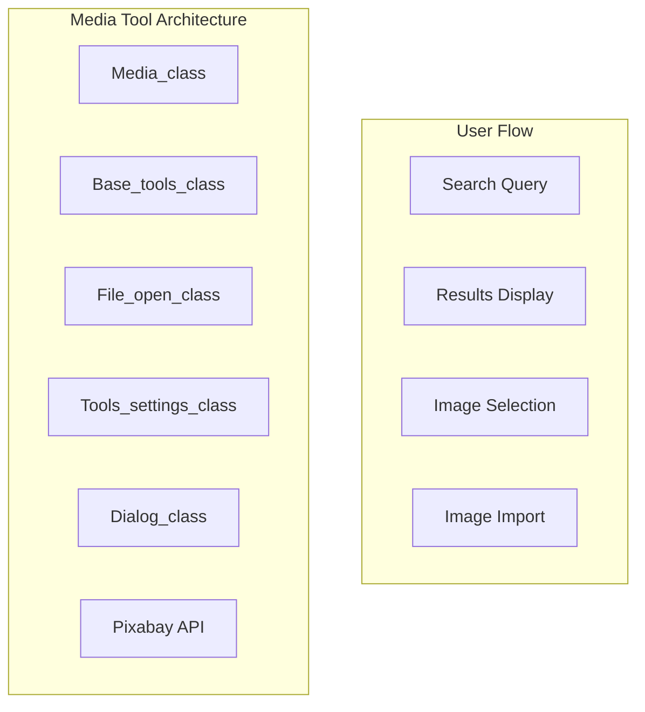
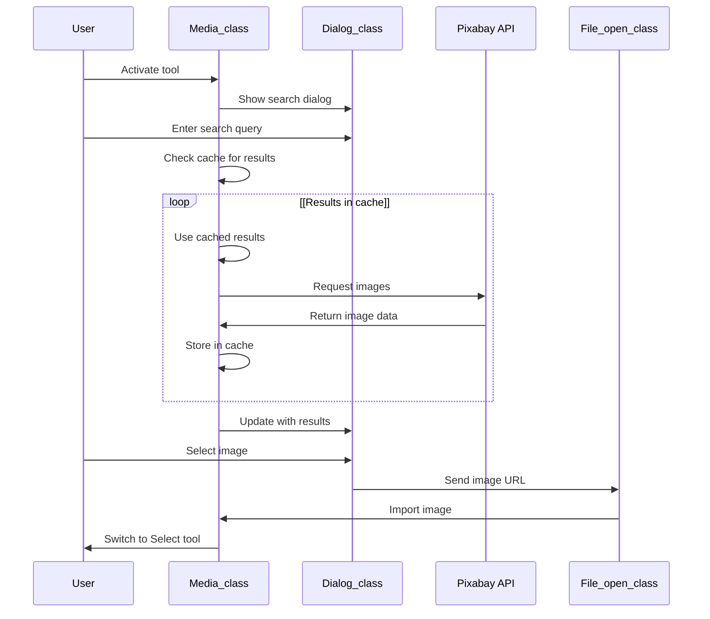

# Media Tool

> **Relevant source files**
> * [src/js/modules/image/resize.js](https://github.com/viliusle/miniPaint/blob/6d0b95e5/src/js/modules/image/resize.js)
> * [src/js/tools/media.js](https://github.com/viliusle/miniPaint/blob/6d0b95e5/src/js/tools/media.js)

## Purpose and Scope

The Media Tool in miniPaint provides functionality for searching and importing images from the Pixabay image service directly into the editor. It allows users to find relevant images using keyword searches and import them as new layers, providing a streamlined workflow for adding external media to projects.

This document covers the implementation, behavior, and usage of the Media Tool. For information about importing files from your local system, see [File Operations](/viliusle/miniPaint/5.1-file-operations).

## Architecture Overview

The Media Tool integrates with several core components of miniPaint to provide its functionality.



Sources: [src/js/tools/media.js L9-L164](https://github.com/viliusle/miniPaint/blob/6d0b95e5/src/js/tools/media.js#L9-L164)

## Implementation Details

### Class Structure

The Media Tool is implemented as `Media_class` which extends `Base_tools_class`, following the standard pattern for tools in miniPaint.

```sql
#mermaid-9j7e6vpl4ge{font-family:ui-sans-serif,-apple-system,system-ui,Segoe UI,Helvetica;font-size:16px;fill:#333;}@keyframes edge-animation-frame{from{stroke-dashoffset:0;}}@keyframes dash{to{stroke-dashoffset:0;}}#mermaid-9j7e6vpl4ge .edge-animation-slow{stroke-dasharray:9,5!important;stroke-dashoffset:900;animation:dash 50s linear infinite;stroke-linecap:round;}#mermaid-9j7e6vpl4ge .edge-animation-fast{stroke-dasharray:9,5!important;stroke-dashoffset:900;animation:dash 20s linear infinite;stroke-linecap:round;}#mermaid-9j7e6vpl4ge .error-icon{fill:#dddddd;}#mermaid-9j7e6vpl4ge .error-text{fill:#222222;stroke:#222222;}#mermaid-9j7e6vpl4ge .edge-thickness-normal{stroke-width:1px;}#mermaid-9j7e6vpl4ge .edge-thickness-thick{stroke-width:3.5px;}#mermaid-9j7e6vpl4ge .edge-pattern-solid{stroke-dasharray:0;}#mermaid-9j7e6vpl4ge .edge-thickness-invisible{stroke-width:0;fill:none;}#mermaid-9j7e6vpl4ge .edge-pattern-dashed{stroke-dasharray:3;}#mermaid-9j7e6vpl4ge .edge-pattern-dotted{stroke-dasharray:2;}#mermaid-9j7e6vpl4ge .marker{fill:#999;stroke:#999;}#mermaid-9j7e6vpl4ge .marker.cross{stroke:#999;}#mermaid-9j7e6vpl4ge svg{font-family:ui-sans-serif,-apple-system,system-ui,Segoe UI,Helvetica;font-size:16px;}#mermaid-9j7e6vpl4ge p{margin:0;}#mermaid-9j7e6vpl4ge g.classGroup text{fill:#dddddd;stroke:none;font-family:ui-sans-serif,-apple-system,system-ui,Segoe UI,Helvetica;font-size:10px;}#mermaid-9j7e6vpl4ge g.classGroup text .title{font-weight:bolder;}#mermaid-9j7e6vpl4ge .cluster-label text{fill:#444;}#mermaid-9j7e6vpl4ge .cluster-label span{color:#444;}#mermaid-9j7e6vpl4ge .cluster-label span p{background-color:transparent;}#mermaid-9j7e6vpl4ge .cluster rect{fill:#f8f8f8;stroke:#dddddd;stroke-width:1px;}#mermaid-9j7e6vpl4ge .cluster text{fill:#444;}#mermaid-9j7e6vpl4ge .cluster span{color:#444;}#mermaid-9j7e6vpl4ge .nodeLabel,#mermaid-9j7e6vpl4ge .edgeLabel{color:#333333;}#mermaid-9j7e6vpl4ge .noteLabel .nodeLabel,#mermaid-9j7e6vpl4ge .noteLabel .edgeLabel{color:#333;}#mermaid-9j7e6vpl4ge .edgeLabel .label rect{fill:#ffffff;}#mermaid-9j7e6vpl4ge .label text{fill:#333333;}#mermaid-9j7e6vpl4ge .labelBkg{background:#ffffff;}#mermaid-9j7e6vpl4ge .edgeLabel .label span{background:#ffffff;}#mermaid-9j7e6vpl4ge .classTitle{font-weight:bolder;}#mermaid-9j7e6vpl4ge .node rect,#mermaid-9j7e6vpl4ge .node circle,#mermaid-9j7e6vpl4ge .node ellipse,#mermaid-9j7e6vpl4ge .node polygon,#mermaid-9j7e6vpl4ge .node path{fill:#ffffff;stroke:#dddddd;stroke-width:1;}#mermaid-9j7e6vpl4ge .divider{stroke:#dddddd;stroke-width:1;}#mermaid-9j7e6vpl4ge g.clickable{cursor:pointer;}#mermaid-9j7e6vpl4ge g.classGroup rect{fill:#ffffff;stroke:#dddddd;}#mermaid-9j7e6vpl4ge g.classGroup line{stroke:#dddddd;stroke-width:1;}#mermaid-9j7e6vpl4ge .classLabel .box{stroke:none;stroke-width:0;fill:#ffffff;opacity:0.5;}#mermaid-9j7e6vpl4ge .classLabel .label{fill:#dddddd;font-size:10px;}#mermaid-9j7e6vpl4ge .relation{stroke:#999;stroke-width:1;fill:none;}#mermaid-9j7e6vpl4ge .dashed-line{stroke-dasharray:3;}#mermaid-9j7e6vpl4ge .dotted-line{stroke-dasharray:1 2;}#mermaid-9j7e6vpl4ge [id$="-compositionStart"],#mermaid-9j7e6vpl4ge .composition{fill:#999!important;stroke:#999!important;stroke-width:1;}#mermaid-9j7e6vpl4ge [id$="-compositionEnd"],#mermaid-9j7e6vpl4ge .composition{fill:#999!important;stroke:#999!important;stroke-width:1;}#mermaid-9j7e6vpl4ge [id$="-dependencyStart"],#mermaid-9j7e6vpl4ge .dependency{fill:#999!important;stroke:#999!important;stroke-width:1;}#mermaid-9j7e6vpl4ge [id$="-dependencyEnd"],#mermaid-9j7e6vpl4ge .dependency{fill:#999!important;stroke:#999!important;stroke-width:1;}#mermaid-9j7e6vpl4ge [id$="-extensionStart"],#mermaid-9j7e6vpl4ge .extension{fill:transparent!important;stroke:#999!important;stroke-width:1;}#mermaid-9j7e6vpl4ge [id$="-extensionEnd"],#mermaid-9j7e6vpl4ge .extension{fill:transparent!important;stroke:#999!important;stroke-width:1;}#mermaid-9j7e6vpl4ge [id$="-aggregationStart"],#mermaid-9j7e6vpl4ge .aggregation{fill:transparent!important;stroke:#999!important;stroke-width:1;}#mermaid-9j7e6vpl4ge [id$="-aggregationEnd"],#mermaid-9j7e6vpl4ge .aggregation{fill:transparent!important;stroke:#999!important;stroke-width:1;}#mermaid-9j7e6vpl4ge [id$="-lollipopStart"],#mermaid-9j7e6vpl4ge .lollipop{fill:#ffffff!important;stroke:#999!important;stroke-width:1;}#mermaid-9j7e6vpl4ge [id$="-lollipopEnd"],#mermaid-9j7e6vpl4ge .lollipop{fill:#ffffff!important;stroke:#999!important;stroke-width:1;}#mermaid-9j7e6vpl4ge .edgeTerminals{font-size:11px;line-height:initial;}#mermaid-9j7e6vpl4ge .classTitleText{text-anchor:middle;font-size:18px;fill:#333;}#mermaid-9j7e6vpl4ge .edgeLabel[data-look="neo"]{background-color:#ffffff;text-align:center;}#mermaid-9j7e6vpl4ge .edgeLabel[data-look="neo"] p{background-color:#ffffff;}#mermaid-9j7e6vpl4ge .edgeLabel[data-look="neo"] rect{opacity:0.5;background-color:#ffffff;fill:#ffffff;}#mermaid-9j7e6vpl4ge .label-icon{display:inline-block;height:1em;overflow:visible;vertical-align:-0.125em;}#mermaid-9j7e6vpl4ge .node .label-icon path{fill:currentColor;stroke:revert;stroke-width:revert;}#mermaid-9j7e6vpl4ge .node .neo-node{stroke:#dddddd;}#mermaid-9j7e6vpl4ge [data-look="neo"].node rect,#mermaid-9j7e6vpl4ge [data-look="neo"].cluster rect,#mermaid-9j7e6vpl4ge [data-look="neo"].node polygon{stroke:url(#mermaid-9j7e6vpl4ge-gradient);filter:drop-shadow( 1px 2px 2px rgba(185,185,185,1));}#mermaid-9j7e6vpl4ge [data-look="neo"].node path{stroke:url(#mermaid-9j7e6vpl4ge-gradient);stroke-width:1px;}#mermaid-9j7e6vpl4ge [data-look="neo"].node .outer-path{filter:drop-shadow( 1px 2px 2px rgba(185,185,185,1));}#mermaid-9j7e6vpl4ge [data-look="neo"].node .neo-line path{stroke:#dddddd;filter:none;}#mermaid-9j7e6vpl4ge [data-look="neo"].node circle{stroke:url(#mermaid-9j7e6vpl4ge-gradient);filter:drop-shadow( 1px 2px 2px rgba(185,185,185,1));}#mermaid-9j7e6vpl4ge [data-look="neo"].node circle .state-start{fill:#000000;}#mermaid-9j7e6vpl4ge [data-look="neo"].icon-shape .icon{fill:url(#mermaid-9j7e6vpl4ge-gradient);filter:drop-shadow( 1px 2px 2px rgba(185,185,185,1));}#mermaid-9j7e6vpl4ge [data-look="neo"].icon-shape .icon-neo path{stroke:url(#mermaid-9j7e6vpl4ge-gradient);filter:drop-shadow( 1px 2px 2px rgba(185,185,185,1));}#mermaid-9j7e6vpl4ge :root{--mermaid-font-family:"trebuchet ms",verdana,arial,sans-serif;}Base_tools_class+load()+render()+on_activate()Media_class-File_open: File_open_class-Tools_settings: Tools_settings_class-POP: Dialog_class-name: String-cache: Array-page: Number-per_page: Number+load()+render()+on_activate()+search(query, data, pages)
```

Sources: [src/js/tools/media.js L9-L32](https://github.com/viliusle/miniPaint/blob/6d0b95e5/src/js/tools/media.js#L9-L32)

### Key Components

The Media Tool relies on several components:

1. **File_open_class**: Handles importing images from URLs
2. **Tools_settings_class**: Provides access to user settings like safe search
3. **Dialog_class**: Used to create the search dialog interface
4. **alertify**: Used for showing error messages

During initialization, the Media Tool sets up the following properties:

| Property | Type | Purpose |
| --- | --- | --- |
| `name` | String | Identifies the tool as 'media' |
| `cache` | Array | Stores previous search results to avoid redundant API calls |
| `page` | Number | Tracks the current page of search results |
| `per_page` | Number | Defines how many results to show per page (50) |

Sources: [src/js/tools/media.js L11-L19](https://github.com/viliusle/miniPaint/blob/6d0b95e5/src/js/tools/media.js#L11-L19)

### Workflow and User Interaction

When activated, the Media Tool automatically launches a search dialog:

1. The `on_activate()` method triggers the `search()` method
2. The search dialog is displayed using Dialog_class
3. When a search query is submitted: * The tool constructs a URL to query the Pixabay API * It checks the cache first to avoid unnecessary API calls * Results are fetched and displayed in a grid layout
4. When a user clicks on an image: * The image URL is passed to the File_open_class * The image is imported into the editor * The tool is automatically switched to the Select tool

Sources: [src/js/tools/media.js L30-L161](https://github.com/viliusle/miniPaint/blob/6d0b95e5/src/js/tools/media.js#L30-L161)

### Search Dialog Implementation

The search dialog is created using the Dialog_class and includes:

1. A search input field
2. A results grid displaying image thumbnails
3. Pagination controls for navigating through results



Sources: [src/js/tools/media.js L41-L161](https://github.com/viliusle/miniPaint/blob/6d0b95e5/src/js/tools/media.js#L41-L161)

### Search Results Caching

The Media Tool implements a simple caching mechanism to improve performance:

1. Each API URL (including query parameters) serves as a cache key
2. When a search is performed, the tool first checks if the results are already in the cache
3. If found, the cached results are used instead of making a new API request
4. If not found, the API request is made and results are stored in the cache

This approach reduces API calls and improves response time for repeated searches.

Sources: [src/js/tools/media.js L125-L155](https://github.com/viliusle/miniPaint/blob/6d0b95e5/src/js/tools/media.js#L125-L155)

### Pagination Implementation

The Media Tool includes pagination to navigate through large result sets:

1. Results are limited to 50 per page (defined by the `per_page` property)
2. The current page is tracked in the `page` property
3. Pagination controls are rendered below the search results
4. The tool shows up to 10 page buttons at a time
5. Previous/Next buttons allow for easy navigation

When a user clicks a page button, the tool updates the `page` property and resubmits the search query.

Sources: [src/js/tools/media.js L63-L74](https://github.com/viliusle/miniPaint/blob/6d0b95e5/src/js/tools/media.js#L63-L74)

 [src/js/tools/media.js L106-L113](https://github.com/viliusle/miniPaint/blob/6d0b95e5/src/js/tools/media.js#L106-L113)

### Error Handling

The Media Tool handles several error scenarios:

1. When no results are found, an error message is displayed: "Your search did not match any images."
2. If there's an error connecting to the Pixabay API, an error message is shown: "Error connecting to service."

Sources: [src/js/tools/media.js L133-L134](https://github.com/viliusle/miniPaint/blob/6d0b95e5/src/js/tools/media.js#L133-L134)

 [src/js/tools/media.js L145-L154](https://github.com/viliusle/miniPaint/blob/6d0b95e5/src/js/tools/media.js#L145-L154)

## Configuration Options

The Media Tool uses the following configuration options:

1. **Pixabay API Key**: Stored in `config.pixabay_key` (note: the key is reversed in the code for obfuscation)
2. **Safe Search**: Retrieved from user settings using `Tools_settings.get_setting('safe_search')`

These configuration options affect how the tool interacts with the Pixabay API.

Sources: [src/js/tools/media.js L46-L49](https://github.com/viliusle/miniPaint/blob/6d0b95e5/src/js/tools/media.js#L46-L49)

 [src/js/tools/media.js L119-L123](https://github.com/viliusle/miniPaint/blob/6d0b95e5/src/js/tools/media.js#L119-L123)

## Usage Notes

* The Media Tool is designed for quickly finding and importing images from Pixabay
* Results are subject to Pixabay's terms of service and licensing
* Safe search can be enabled/disabled in the settings
* The tool automatically caches previous search results to improve performance
* After selecting an image, the tool automatically switches to the Select tool for convenience