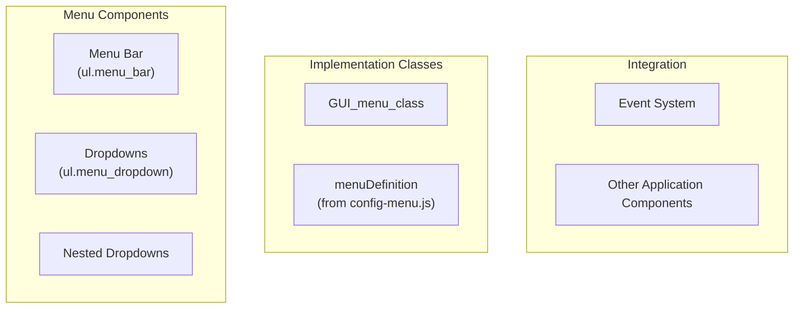
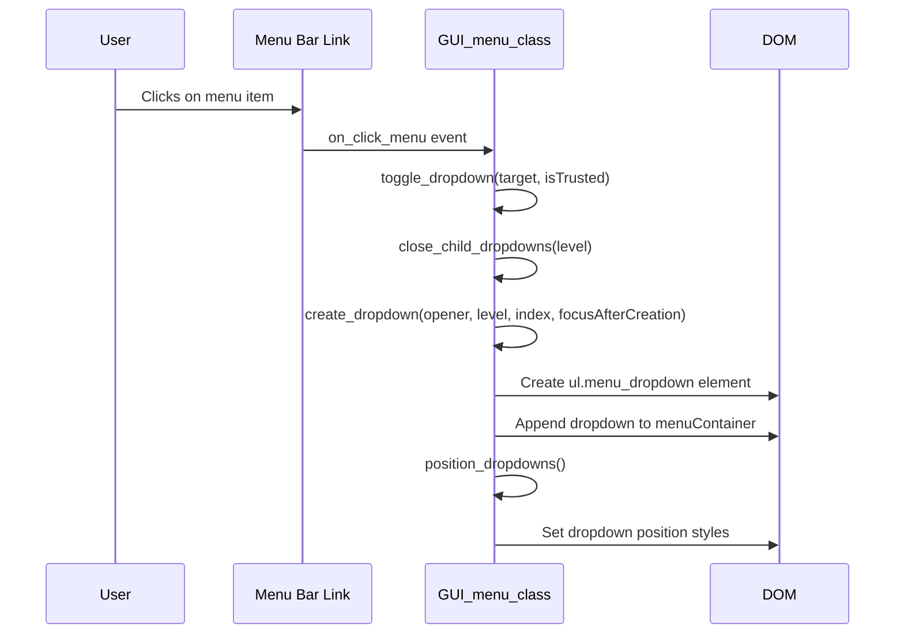
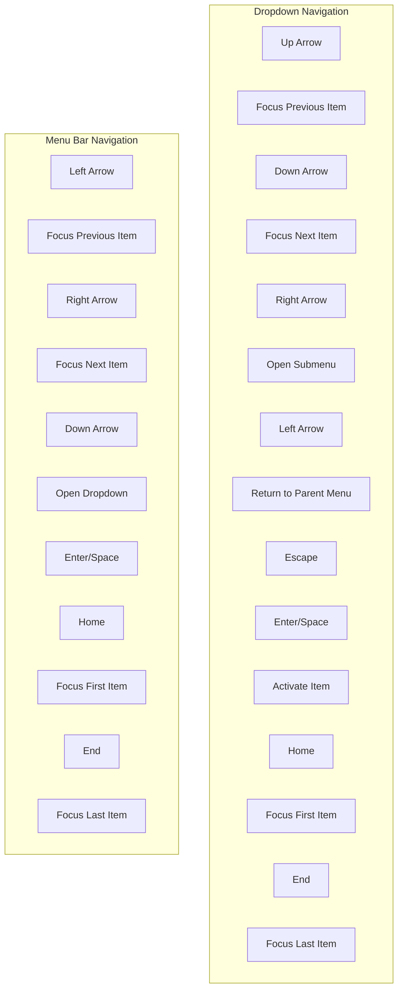
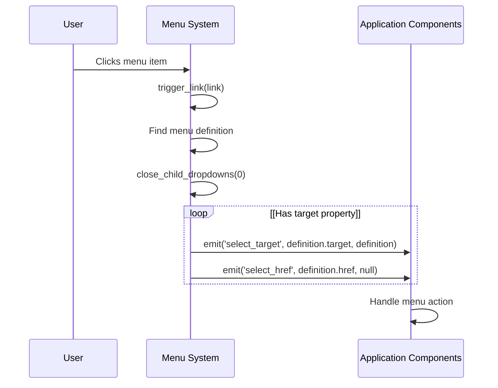
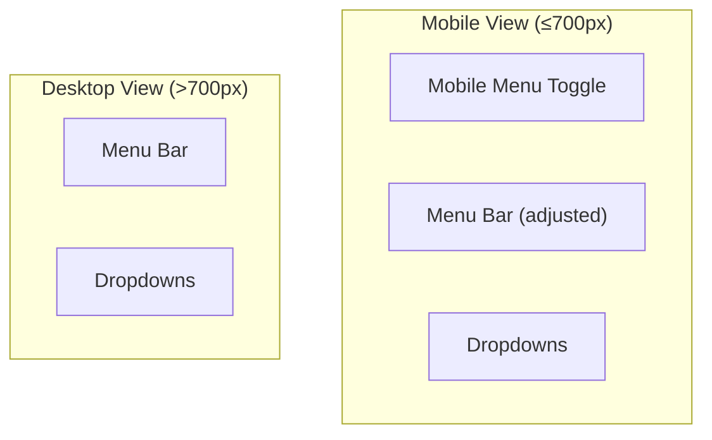

# Menu System

> **Relevant source files**
> * [src/css/menu.css](https://github.com/viliusle/miniPaint/blob/6d0b95e5/src/css/menu.css)
> * [src/css/print.css](https://github.com/viliusle/miniPaint/blob/6d0b95e5/src/css/print.css)
> * [src/js/core/gui/gui-menu.js](https://github.com/viliusle/miniPaint/blob/6d0b95e5/src/js/core/gui/gui-menu.js)

The Menu System in miniPaint provides the main interface for users to access application features and functionality. This document explains the design, implementation, and interaction patterns of the menu system. For information about the general UI layout, see [Layout](/viliusle/miniPaint/3.1-layout).

## Overview

The menu system consists of a horizontal menu bar at the top of the application with dropdown menus that can contain nested submenus. It supports mouse and keyboard navigation, focusing on accessibility and responsive design.



Sources: [src/js/core/gui/gui-menu.js L12-L20](https://github.com/viliusle/miniPaint/blob/6d0b95e5/src/js/core/gui/gui-menu.js#L12-L20)

## Architecture

The menu system is implemented through the `GUI_menu_class`, which generates and manages the menu components. The class renders the menu bar at initialization and dynamically creates dropdown menus when users interact with menu items.

### Key Components

1. **Menu Definition**: Structured data in `config-menu.js` defining the entire menu hierarchy
2. **Menu Bar**: Static top-level horizontal navigation
3. **Dropdowns**: Dynamically created when menu items are clicked
4. **Event System**: Custom event subscription mechanism to integrate with other application components

```

```

Sources: [src/js/core/gui/gui-menu.js L13-L416](https://github.com/viliusle/miniPaint/blob/6d0b95e5/src/js/core/gui/gui-menu.js#L13-L416)

## Menu Rendering Process

### Menu Bar Initialization

When the application starts, the `render_main()` method generates the top-level menu bar by:

1. Getting the menu container element
2. Generating HTML for each top-level menu item using `generate_menu_bar_item_template()`
3. Setting up event listeners for user interactions
4. Applying translations if necessary

The menu bar HTML structure follows this pattern:

```xml
<ul class="menu_bar" role="menubar" tabindex="0">  <li>    <a id="main_menu_0_0" role="menuitem" tabindex="-1" aria-haspopup="true"        aria-expanded="false" href="javascript:void(0)" data-level="0" data-index="0">      <span class="name trn">File</span>    </a>  </li>  <!-- Additional menu items --></ul>
```

Sources: [src/js/core/gui/gui-menu.js L26-L54](https://github.com/viliusle/miniPaint/blob/6d0b95e5/src/js/core/gui/gui-menu.js#L26-L54)

 [src/js/core/gui/gui-menu.js L74-L81](https://github.com/viliusle/miniPaint/blob/6d0b95e5/src/js/core/gui/gui-menu.js#L74-L81)

### Dropdown Creation

Dropdowns are created dynamically when users click on menu items with children. The process involves:

1. Finding the appropriate children in the menu definition
2. Creating a new `<ul>` element with proper attributes
3. Generating HTML for each child menu item
4. Appending the dropdown to the DOM
5. Positioning the dropdown correctly



Sources: [src/js/core/gui/gui-menu.js L250-L270](https://github.com/viliusle/miniPaint/blob/6d0b95e5/src/js/core/gui/gui-menu.js#L250-L270)

 [src/js/core/gui/gui-menu.js L321-L361](https://github.com/viliusle/miniPaint/blob/6d0b95e5/src/js/core/gui/gui-menu.js#L321-L361)

## Interaction Handling

The menu system handles various interactions to ensure usability across devices and input methods:

### Mouse and Touch Interactions

* Clicking a menu item toggles its dropdown
* Clicking outside the menu closes all dropdowns
* Clicking an action item triggers its associated functionality

### Keyboard Navigation

The system supports comprehensive keyboard navigation:

* **Arrow keys**: Navigate between menu items
* **Enter/Space**: Activate the selected item
* **Escape**: Close the current dropdown
* **Tab**: Move focus to the next interactive element
* **Home/End**: Jump to first/last item in current menu



Sources: [src/js/core/gui/gui-menu.js L134-L248](https://github.com/viliusle/miniPaint/blob/6d0b95e5/src/js/core/gui/gui-menu.js#L134-L248)

## Dropdown Positioning

The `position_dropdowns()` method handles complex positioning logic to ensure dropdowns appear in the correct location:

1. For top-level dropdowns: * Position below the parent menu item * Ensure the dropdown remains within the viewport width
2. For nested dropdowns (submenus): * Position to the right of the parent item by default * If insufficient space on the right, position to the left * If insufficient space on either side, find best available position * Adjust vertical position to fit within viewport

This ensures menus are always visible and accessible regardless of their position in the menu hierarchy.

Sources: [src/js/core/gui/gui-menu.js L363-L414](https://github.com/viliusle/miniPaint/blob/6d0b95e5/src/js/core/gui/gui-menu.js#L363-L414)

## Menu Styling

The menu styling is defined in `menu.css` and includes:

1. **Variables**: CSS custom properties for colors and appearance
2. **Menu Bar**: Horizontal navigation styling
3. **Dropdowns**: Styling for dropdown menus
4. **Responsive Design**: Media queries for adapting to smaller screens

Key style components include:

* Background colors and hover states
* Typography and spacing
* Borders and dividers
* Dropdown shadows and positioning
* Responsive breakpoints for mobile adaptation

Sources: [src/css/menu.css L1-L202](https://github.com/viliusle/miniPaint/blob/6d0b95e5/src/css/menu.css#L1-L202)

## Integration with Application

The menu system integrates with the rest of the application through an event subscription mechanism. The `on()` and `emit()` methods allow other components to listen for and respond to menu interactions.

When a menu item is clicked, the system:

1. Identifies the corresponding menu definition
2. Closes all open dropdowns
3. Emits appropriate events with the selected item's data



Sources: [src/js/core/gui/gui-menu.js L57-L72](https://github.com/viliusle/miniPaint/blob/6d0b95e5/src/js/core/gui/gui-menu.js#L57-L72)

 [src/js/core/gui/gui-menu.js L286-L308](https://github.com/viliusle/miniPaint/blob/6d0b95e5/src/js/core/gui/gui-menu.js#L286-L308)

## Mobile Support

The menu system adapts for mobile devices with:

1. A mobile-specific toggle menu that appears at small screen sizes
2. Adjusted sizing and positioning for touch interaction
3. Media queries that trigger the mobile layout at 700px width



Sources: [src/css/menu.css L161-L197](https://github.com/viliusle/miniPaint/blob/6d0b95e5/src/css/menu.css#L161-L197)

## Accessibility Features

The menu system implements several accessibility features:

1. **ARIA Attributes**: * `role="menubar"` and `role="menu"` for structural roles * `aria-haspopup="true"` for items with dropdowns * `aria-expanded="false|true"` for dropdown state * `aria-labelledby` to associate dropdowns with their parent items
2. **Keyboard Navigation**: Comprehensive keyboard support as described in the Interaction Handling section
3. **Screen Reader Support**: * `sr_only` class for content visible only to screen readers * Proper focus management for assistive technologies

Sources: [src/css/menu.css L11-L20](https://github.com/viliusle/miniPaint/blob/6d0b95e5/src/css/menu.css#L11-L20)

 [src/js/core/gui/gui-menu.js L29-L36](https://github.com/viliusle/miniPaint/blob/6d0b95e5/src/js/core/gui/gui-menu.js#L29-L36)

 [src/js/core/gui/gui-menu.js L333-L336](https://github.com/viliusle/miniPaint/blob/6d0b95e5/src/js/core/gui/gui-menu.js#L333-L336)

## Print Mode Handling

When printing, the menu system is hidden to ensure only the canvas content is printed. The print-specific CSS in `print.css` removes the menu from the printed output.

Sources: [src/css/print.css L12-L17](https://github.com/viliusle/miniPaint/blob/6d0b95e5/src/css/print.css#L12-L17)