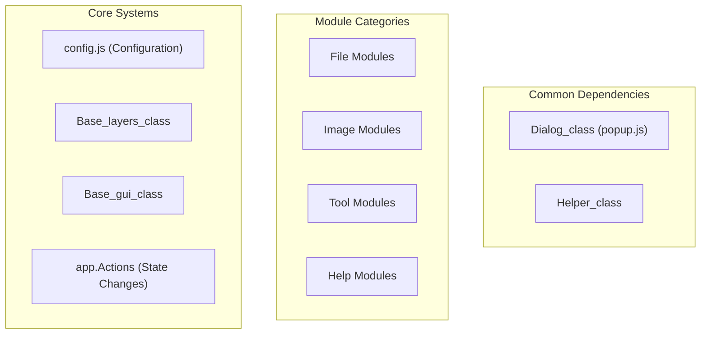
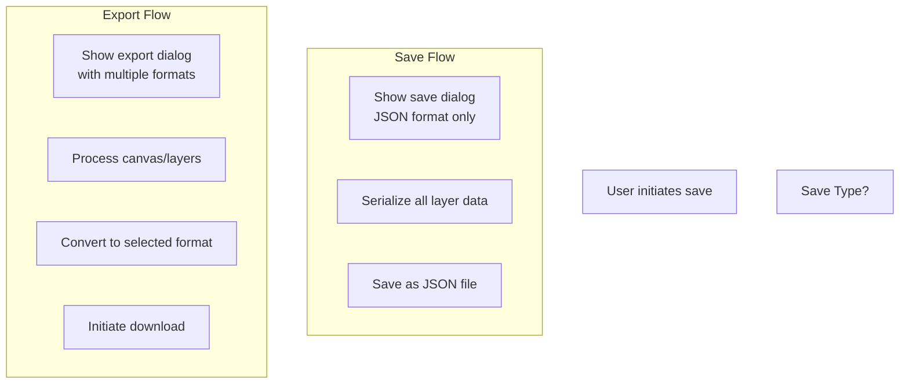
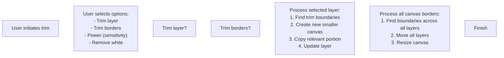
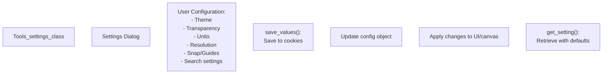
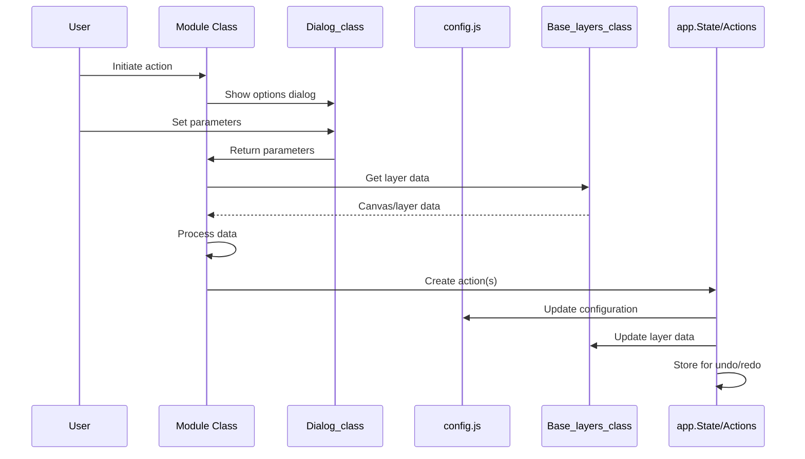

# Modules

> **Relevant source files**
> * [README.md](https://github.com/viliusle/miniPaint/blob/6d0b95e5/README.md?plain=1)
> * [src/js/core/base-search.js](https://github.com/viliusle/miniPaint/blob/6d0b95e5/src/js/core/base-search.js)
> * [src/js/core/gui/gui-information.js](https://github.com/viliusle/miniPaint/blob/6d0b95e5/src/js/core/gui/gui-information.js)
> * [src/js/libs/helpers.js](https://github.com/viliusle/miniPaint/blob/6d0b95e5/src/js/libs/helpers.js)
> * [src/js/modules/file/new.js](https://github.com/viliusle/miniPaint/blob/6d0b95e5/src/js/modules/file/new.js)
> * [src/js/modules/file/save.js](https://github.com/viliusle/miniPaint/blob/6d0b95e5/src/js/modules/file/save.js)
> * [src/js/modules/help/shortcuts.js](https://github.com/viliusle/miniPaint/blob/6d0b95e5/src/js/modules/help/shortcuts.js)
> * [src/js/modules/image/color_corrections.js](https://github.com/viliusle/miniPaint/blob/6d0b95e5/src/js/modules/image/color_corrections.js)
> * [src/js/modules/image/decrease_colors.js](https://github.com/viliusle/miniPaint/blob/6d0b95e5/src/js/modules/image/decrease_colors.js)
> * [src/js/modules/image/information.js](https://github.com/viliusle/miniPaint/blob/6d0b95e5/src/js/modules/image/information.js)
> * [src/js/modules/image/size.js](https://github.com/viliusle/miniPaint/blob/6d0b95e5/src/js/modules/image/size.js)
> * [src/js/modules/image/translate.js](https://github.com/viliusle/miniPaint/blob/6d0b95e5/src/js/modules/image/translate.js)
> * [src/js/modules/image/trim.js](https://github.com/viliusle/miniPaint/blob/6d0b95e5/src/js/modules/image/trim.js)
> * [src/js/modules/tools/content_fill.js](https://github.com/viliusle/miniPaint/blob/6d0b95e5/src/js/modules/tools/content_fill.js)
> * [src/js/modules/tools/restore_alpha.js](https://github.com/viliusle/miniPaint/blob/6d0b95e5/src/js/modules/tools/restore_alpha.js)
> * [src/js/modules/tools/search.js](https://github.com/viliusle/miniPaint/blob/6d0b95e5/src/js/modules/tools/search.js)
> * [src/js/modules/tools/settings.js](https://github.com/viliusle/miniPaint/blob/6d0b95e5/src/js/modules/tools/settings.js)

## Purpose and Scope

This document provides a comprehensive overview of the modules system in miniPaint. Modules are specialized components that extend the application's core functionality with specific features like file operations, image manipulation tools, and utility functions. Each module is designed to be self-contained while integrating with the core systems of miniPaint.

For information about the core systems that modules build upon, see [Core Systems](/viliusle/miniPaint/2-core-systems).

## Module Architecture

Modules in miniPaint are organized in a directory structure that reflects their purpose and functionality domains:

```markdown
src/js/modules/
├── file/           # File operations (open, save, new)
├── image/          # Image manipulation (size, trim, color corrections)
├── tools/          # Tool implementations and settings
└── help/           # Help and documentation features
```

Many modules follow the singleton pattern to ensure only one instance exists at any time:

```
constructor() {    //singleton    if (instance) {        return instance;    }    instance = this;        // Initialize...}
```

### Module Integration Diagram



Sources: [src/js/modules/file/save.js L15-L33](https://github.com/viliusle/miniPaint/blob/6d0b95e5/src/js/modules/file/save.js#L15-L33)

 [src/js/modules/image/trim.js L11-L33](https://github.com/viliusle/miniPaint/blob/6d0b95e5/src/js/modules/image/trim.js#L11-L33)

 [src/js/modules/tools/settings.js L6-L18](https://github.com/viliusle/miniPaint/blob/6d0b95e5/src/js/modules/tools/settings.js#L6-L18)

## File Modules

File modules handle loading, saving, creating, and exporting files in miniPaint.

### File Save Module

The `File_save_class` provides functionality to export the canvas in various formats:



The `File_save_class` supports these formats:

* PNG (default)
* JPG/JPEG
* JSON (full layers data)
* WEBP
* GIF (animated)
* BMP
* TIFF

Key features include:

* Quality settings for JPG/WEBP
* Transparency control
* Layer selection options (all, selected, separated)
* Frame delay control for animated GIFs

Sources: [src/js/modules/file/save.js L36-L47](https://github.com/viliusle/miniPaint/blob/6d0b95e5/src/js/modules/file/save.js#L36-L47)

 [src/js/modules/file/save.js L493-L625](https://github.com/viliusle/miniPaint/blob/6d0b95e5/src/js/modules/file/save.js#L493-L625)

### File New Module

The `File_new_class` creates new canvases with user-defined parameters:

* Creates blank canvases with specified dimensions
* Supports various unit formats (pixels, inches, centimeters, millimeters)
* Offers predefined resolution templates
* Controls transparency settings

Sources: [src/js/modules/file/new.js L24-L68](https://github.com/viliusle/miniPaint/blob/6d0b95e5/src/js/modules/file/new.js#L24-L68)

 [src/js/modules/file/new.js L70-L133](https://github.com/viliusle/miniPaint/blob/6d0b95e5/src/js/modules/file/new.js#L70-L133)

## Image Modules

Image modules provide functionality for manipulating the canvas and images.

### Image Size Module

The `Image_size_class` changes canvas dimensions with these capabilities:

* Resizing the canvas to specific dimensions
* Support for different unit systems
* Options to maintain proportion when resizing
* Automatic repositioning of layers during resize

Sources: [src/js/modules/image/size.js L18-L49](https://github.com/viliusle/miniPaint/blob/6d0b95e5/src/js/modules/image/size.js#L18-L49)

 [src/js/modules/image/size.js L51-L138](https://github.com/viliusle/miniPaint/blob/6d0b95e5/src/js/modules/image/size.js#L51-L138)

### Image Trim Module

The `Image_trim_class` removes empty space around image content:



This module can:

* Trim a single layer
* Trim the entire canvas (affecting all layers)
* Adjust sensitivity for determining empty space
* Handle both transparent and white space trimming

Sources: [src/js/modules/image/trim.js L42-L76](https://github.com/viliusle/miniPaint/blob/6d0b95e5/src/js/modules/image/trim.js#L42-L76)

 [src/js/modules/image/trim.js L86-L123](https://github.com/viliusle/miniPaint/blob/6d0b95e5/src/js/modules/image/trim.js#L86-L123)

 [src/js/modules/image/trim.js L132-L192](https://github.com/viliusle/miniPaint/blob/6d0b95e5/src/js/modules/image/trim.js#L132-L192)

### Other Image Modules

Other important image modules include:

* **Image Color Corrections** (`Image_colorCorrections_class`): Adjusts brightness, contrast, saturation, hue, and RGB channels
* **Image Information** (`Image_information_class`): Displays metadata about the current image, including dimensions, color count, and EXIF data
* **Image Translate** (`Image_translate_class`): Moves layers to specific coordinates
* **Image Decrease Colors** (`Image_decreaseColors_class`): Reduces the color palette of an image

Sources: [src/js/modules/image/color_corrections.js L18-L60](https://github.com/viliusle/miniPaint/blob/6d0b95e5/src/js/modules/image/color_corrections.js#L18-L60)

 [src/js/modules/image/information.js L39-L94](https://github.com/viliusle/miniPaint/blob/6d0b95e5/src/js/modules/image/information.js#L39-L94)

 [src/js/modules/image/translate.js L15-L44](https://github.com/viliusle/miniPaint/blob/6d0b95e5/src/js/modules/image/translate.js#L15-L44)

 [src/js/modules/image/decrease_colors.js L18-L44](https://github.com/viliusle/miniPaint/blob/6d0b95e5/src/js/modules/image/decrease_colors.js#L18-L44)

## Tool Modules

Tool modules implement specific editing functionality and settings.

### Tools Settings Module

The `Tools_settings_class` manages application-wide settings:



This module:

* Stores settings in browser cookies for persistence
* Provides defaults for new users
* Updates the application configuration immediately when settings change
* Handles theme switching and UI unit display

Sources: [src/js/modules/tools/settings.js L21-L64](https://github.com/viliusle/miniPaint/blob/6d0b95e5/src/js/modules/tools/settings.js#L21-L64)

 [src/js/modules/tools/settings.js L67-L94](https://github.com/viliusle/miniPaint/blob/6d0b95e5/src/js/modules/tools/settings.js#L67-L94)

 [src/js/modules/tools/settings.js L114-L167](https://github.com/viliusle/miniPaint/blob/6d0b95e5/src/js/modules/tools/settings.js#L114-L167)

### Content Fill Module

The `Tools_contentFill_class` fills empty canvas areas surrounding an image:

* Expands edges by extending border pixels
* Creates cloned edge patterns
* Resizes the image to fill the background
* Applies blur effects to the filled areas

Sources: [src/js/modules/tools/content_fill.js L17-L58](https://github.com/viliusle/miniPaint/blob/6d0b95e5/src/js/modules/tools/content_fill.js#L17-L58)

 [src/js/modules/tools/content_fill.js L61-L82](https://github.com/viliusle/miniPaint/blob/6d0b95e5/src/js/modules/tools/content_fill.js#L61-L82)

 [src/js/modules/tools/content_fill.js L84-L262](https://github.com/viliusle/miniPaint/blob/6d0b95e5/src/js/modules/tools/content_fill.js#L84-L262)

### Other Tool Modules

* **Restore Alpha** (`Tools_restoreAlpha_class`): Restores or enhances transparency in images
* **Search** (`Tools_search_class`): Provides search functionality for tools and features

Sources: [src/js/modules/tools/restore_alpha.js L14-L68](https://github.com/viliusle/miniPaint/blob/6d0b95e5/src/js/modules/tools/restore_alpha.js#L14-L68)

 [src/js/modules/tools/search.js L7-L12](https://github.com/viliusle/miniPaint/blob/6d0b95e5/src/js/modules/tools/search.js#L7-L12)

## Help Modules

### Shortcuts Module

The `Help_shortcuts_class` displays keyboard shortcuts available in the application:

* Shows all available keyboard shortcuts in a dialog
* Provides a quick reference for users
* Organized by function rather than key

Sources: [src/js/modules/help/shortcuts.js L9-L41](https://github.com/viliusle/miniPaint/blob/6d0b95e5/src/js/modules/help/shortcuts.js#L9-L41)

## Module Integration with Core Systems

Modules integrate with miniPaint's core systems through a consistent pattern:



Key integration points:

1. **Configuration**: Most modules read from and write to the central configuration
2. **Layer System**: Image modules use the layer system to access and modify image data
3. **Dialog System**: Modules use the `Dialog_class` to present options and get user input
4. **State Management**: Modules create actions processed by the state system for undo/redo functionality
5. **Helper Utilities**: Common utilities like `Helper_class` provide support functions

Sources: [src/js/modules/image/trim.js L61-L72](https://github.com/viliusle/miniPaint/blob/6d0b95e5/src/js/modules/image/trim.js#L61-L72)

 [src/js/modules/file/save.js L96-L201](https://github.com/viliusle/miniPaint/blob/6d0b95e5/src/js/modules/file/save.js#L96-L201)

 [src/js/libs/helpers.js L71-L82](https://github.com/viliusle/miniPaint/blob/6d0b95e5/src/js/libs/helpers.js#L71-L82)

## Common Module Patterns

Most modules follow these common patterns:

1. **Initialization**: Import dependencies, create a class, and possibly implement singleton pattern
2. **Dialog-Based Interface**: Present options through dialogs using the `Dialog_class`
3. **Preview Capability**: When applicable, show live previews of changes before applying them
4. **Action Creation**: Use the action system to implement changes in an undo-friendly way
5. **Event Binding**: Many modules bind to keyboard shortcuts for quick access

A typical module implementation flow:

1. User triggers the module (menu or keyboard)
2. Module displays options dialog
3. User sets parameters
4. Module processes the request
5. Module dispatches actions to modify the state
6. State system applies changes and records for undo/redo

Sources: [src/js/modules/file/save.js L51-L69](https://github.com/viliusle/miniPaint/blob/6d0b95e5/src/js/modules/file/save.js#L51-L69)

 [src/js/modules/image/trim.js L28-L40](https://github.com/viliusle/miniPaint/blob/6d0b95e5/src/js/modules/image/trim.js#L28-L40)

 [src/js/core/base-search.js L26-L41](https://github.com/viliusle/miniPaint/blob/6d0b95e5/src/js/core/base-search.js#L26-L41)