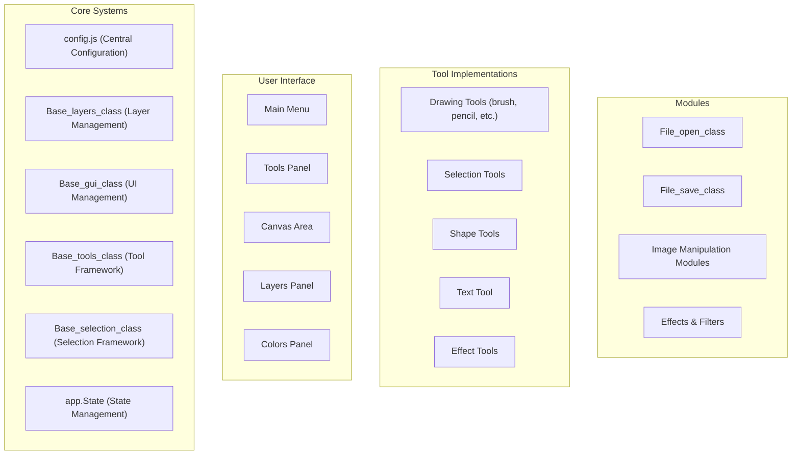
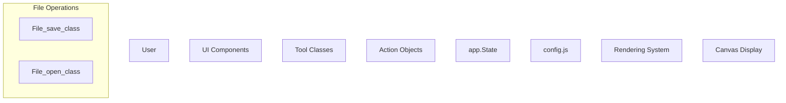
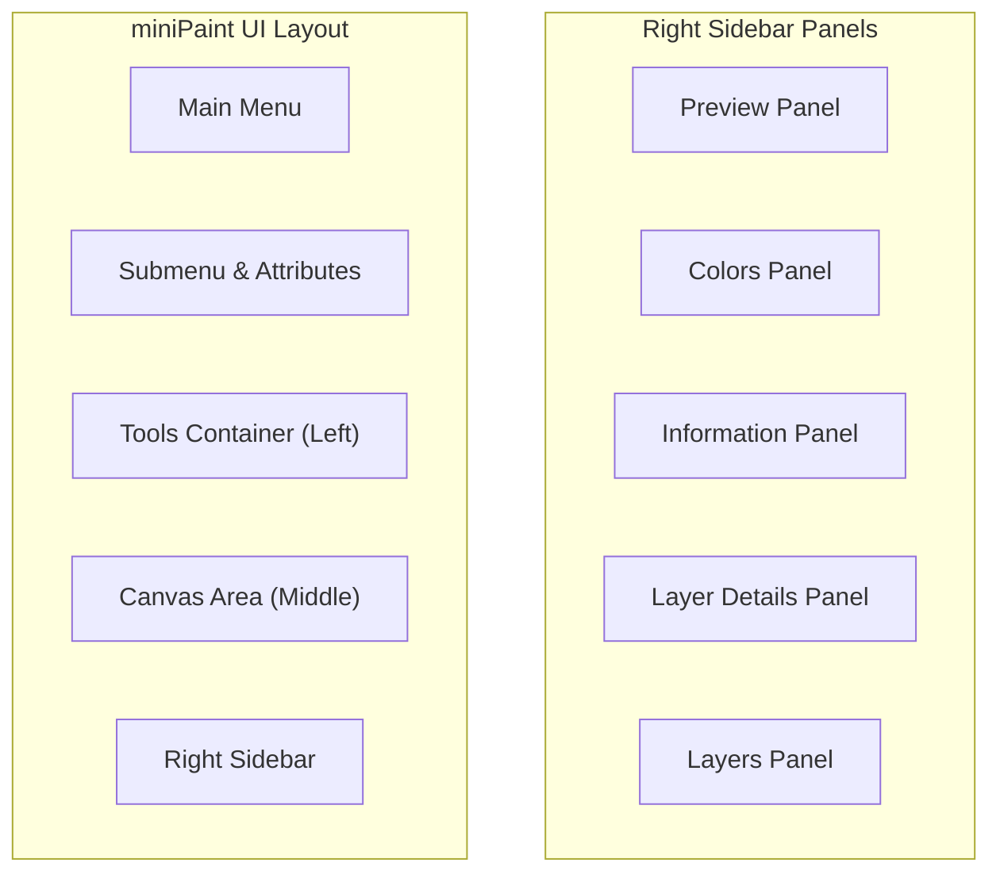

# Overview

> **Relevant source files**
> * [README.md](https://github.com/viliusle/miniPaint/blob/6d0b95e5/README.md?plain=1)
> * [dist/bundle.js](https://github.com/viliusle/miniPaint/blob/6d0b95e5/dist/bundle.js)
> * [dist/bundle.js.LICENSE.txt](https://github.com/viliusle/miniPaint/blob/6d0b95e5/dist/bundle.js.LICENSE.txt)
> * [dist/bundle.js.map](https://github.com/viliusle/miniPaint/blob/6d0b95e5/dist/bundle.js.map)
> * [index.html](https://github.com/viliusle/miniPaint/blob/6d0b95e5/index.html)
> * [package-lock.json](https://github.com/viliusle/miniPaint/blob/6d0b95e5/package-lock.json)
> * [package.json](https://github.com/viliusle/miniPaint/blob/6d0b95e5/package.json)
> * [src/js/core/base-search.js](https://github.com/viliusle/miniPaint/blob/6d0b95e5/src/js/core/base-search.js)
> * [src/js/modules/file/save.js](https://github.com/viliusle/miniPaint/blob/6d0b95e5/src/js/modules/file/save.js)
> * [src/js/modules/help/shortcuts.js](https://github.com/viliusle/miniPaint/blob/6d0b95e5/src/js/modules/help/shortcuts.js)
> * [src/js/modules/image/palette.js](https://github.com/viliusle/miniPaint/blob/6d0b95e5/src/js/modules/image/palette.js)
> * [src/js/modules/tools/search.js](https://github.com/viliusle/miniPaint/blob/6d0b95e5/src/js/modules/tools/search.js)
> * [src/js/tools/pick_color.js](https://github.com/viliusle/miniPaint/blob/6d0b95e5/src/js/tools/pick_color.js)
> * [webpack.config.js](https://github.com/viliusle/miniPaint/blob/6d0b95e5/webpack.config.js)

miniPaint is a web-based image editor that allows users to create and edit images directly in the browser without requiring downloads, installations, or server-side processing. It provides comprehensive image editing functionality through a layer-based approach similar to professional desktop applications.

## Purpose and Scope

This document provides an introduction to the miniPaint system, its architecture, and core components. It serves as a foundation for understanding how the application works and how its various systems interact. For detailed information about specific components, please refer to their respective documentation pages in this wiki.

For information about setting up and running miniPaint, see [Getting Started](/viliusle/miniPaint/1.2-getting-started).

Sources: [package.json L1-L51](https://github.com/viliusle/miniPaint/blob/6d0b95e5/package.json#L1-L51)

 [README.md L1-L60](https://github.com/viliusle/miniPaint/blob/6d0b95e5/README.md?plain=1#L1-L60)

 [index.html L1-L104](https://github.com/viliusle/miniPaint/blob/6d0b95e5/index.html#L1-L104)

## Key Features

miniPaint offers a rich set of features that make it a versatile online image editor:

* **File Operations**: Open images from various sources (files, URLs, clipboard) and save in multiple formats (PNG, JPG, BMP, WEBP, GIF, TIFF, JSON)
* **Layer Management**: Support for multiple layers with visibility control, opacity settings, and blend modes
* **Extensive Tool Set**: Drawing tools, selection tools, shape tools, text tools, and effect tools
* **Image Manipulation**: Resize, crop, rotate, flip, and apply color adjustments
* **Effects and Filters**: Various filters like blur, sharpen, grayscale, and more
* **Client-Side Processing**: All operations remain in the browser with no server-side requirements

Sources: [README.md L24-L38](https://github.com/viliusle/miniPaint/blob/6d0b95e5/README.md?plain=1#L24-L38)

## System Architecture

miniPaint follows a modular architecture with clear separation of concerns. At its core is a central configuration object that connects different components and manages the application state.

### High-Level Architecture Diagram



Sources: [src/js/app.js](https://github.com/viliusle/miniPaint/blob/6d0b95e5/src/js/app.js)

 [src/js/config.js](https://github.com/viliusle/miniPaint/blob/6d0b95e5/src/js/config.js)

 [src/js/modules/file/save.js L1-L736](https://github.com/viliusle/miniPaint/blob/6d0b95e5/src/js/modules/file/save.js#L1-L736)

## Core Components

### Central Configuration (config.js)

The `config.js` file serves as the central state container for the application. It stores:

* Canvas dimensions and settings
* Active tools and their parameters
* Layer data and the currently selected layer
* Color and transparency settings
* Application preferences

All components access and modify this shared configuration object, making it the single source of truth for the application state.

### Layer System

The layer system is managed by `Base_layers_class` and provides functionality for:

* Creating, updating, and deleting layers
* Changing layer properties (visibility, opacity, position)
* Converting layers to canvas for rendering
* Layer operations like merging and flattening

Each layer is represented as an object with properties like type, name, opacity, and data specific to its type (image, text, etc.).

### Tool Framework

The tool system is built around `Base_tools_class`, which provides common functionality for all tools:

```sql
#mermaid-a2htztuw8g9{font-family:ui-sans-serif,-apple-system,system-ui,Segoe UI,Helvetica;font-size:16px;fill:#333;}@keyframes edge-animation-frame{from{stroke-dashoffset:0;}}@keyframes dash{to{stroke-dashoffset:0;}}#mermaid-a2htztuw8g9 .edge-animation-slow{stroke-dasharray:9,5!important;stroke-dashoffset:900;animation:dash 50s linear infinite;stroke-linecap:round;}#mermaid-a2htztuw8g9 .edge-animation-fast{stroke-dasharray:9,5!important;stroke-dashoffset:900;animation:dash 20s linear infinite;stroke-linecap:round;}#mermaid-a2htztuw8g9 .error-icon{fill:#dddddd;}#mermaid-a2htztuw8g9 .error-text{fill:#222222;stroke:#222222;}#mermaid-a2htztuw8g9 .edge-thickness-normal{stroke-width:1px;}#mermaid-a2htztuw8g9 .edge-thickness-thick{stroke-width:3.5px;}#mermaid-a2htztuw8g9 .edge-pattern-solid{stroke-dasharray:0;}#mermaid-a2htztuw8g9 .edge-thickness-invisible{stroke-width:0;fill:none;}#mermaid-a2htztuw8g9 .edge-pattern-dashed{stroke-dasharray:3;}#mermaid-a2htztuw8g9 .edge-pattern-dotted{stroke-dasharray:2;}#mermaid-a2htztuw8g9 .marker{fill:#999;stroke:#999;}#mermaid-a2htztuw8g9 .marker.cross{stroke:#999;}#mermaid-a2htztuw8g9 svg{font-family:ui-sans-serif,-apple-system,system-ui,Segoe UI,Helvetica;font-size:16px;}#mermaid-a2htztuw8g9 p{margin:0;}#mermaid-a2htztuw8g9 g.classGroup text{fill:#dddddd;stroke:none;font-family:ui-sans-serif,-apple-system,system-ui,Segoe UI,Helvetica;font-size:10px;}#mermaid-a2htztuw8g9 g.classGroup text .title{font-weight:bolder;}#mermaid-a2htztuw8g9 .cluster-label text{fill:#444;}#mermaid-a2htztuw8g9 .cluster-label span{color:#444;}#mermaid-a2htztuw8g9 .cluster-label span p{background-color:transparent;}#mermaid-a2htztuw8g9 .cluster rect{fill:#f8f8f8;stroke:#dddddd;stroke-width:1px;}#mermaid-a2htztuw8g9 .cluster text{fill:#444;}#mermaid-a2htztuw8g9 .cluster span{color:#444;}#mermaid-a2htztuw8g9 .nodeLabel,#mermaid-a2htztuw8g9 .edgeLabel{color:#333333;}#mermaid-a2htztuw8g9 .noteLabel .nodeLabel,#mermaid-a2htztuw8g9 .noteLabel .edgeLabel{color:#333;}#mermaid-a2htztuw8g9 .edgeLabel .label rect{fill:#ffffff;}#mermaid-a2htztuw8g9 .label text{fill:#333333;}#mermaid-a2htztuw8g9 .labelBkg{background:#ffffff;}#mermaid-a2htztuw8g9 .edgeLabel .label span{background:#ffffff;}#mermaid-a2htztuw8g9 .classTitle{font-weight:bolder;}#mermaid-a2htztuw8g9 .node rect,#mermaid-a2htztuw8g9 .node circle,#mermaid-a2htztuw8g9 .node ellipse,#mermaid-a2htztuw8g9 .node polygon,#mermaid-a2htztuw8g9 .node path{fill:#ffffff;stroke:#dddddd;stroke-width:1;}#mermaid-a2htztuw8g9 .divider{stroke:#dddddd;stroke-width:1;}#mermaid-a2htztuw8g9 g.clickable{cursor:pointer;}#mermaid-a2htztuw8g9 g.classGroup rect{fill:#ffffff;stroke:#dddddd;}#mermaid-a2htztuw8g9 g.classGroup line{stroke:#dddddd;stroke-width:1;}#mermaid-a2htztuw8g9 .classLabel .box{stroke:none;stroke-width:0;fill:#ffffff;opacity:0.5;}#mermaid-a2htztuw8g9 .classLabel .label{fill:#dddddd;font-size:10px;}#mermaid-a2htztuw8g9 .relation{stroke:#999;stroke-width:1;fill:none;}#mermaid-a2htztuw8g9 .dashed-line{stroke-dasharray:3;}#mermaid-a2htztuw8g9 .dotted-line{stroke-dasharray:1 2;}#mermaid-a2htztuw8g9 [id$="-compositionStart"],#mermaid-a2htztuw8g9 .composition{fill:#999!important;stroke:#999!important;stroke-width:1;}#mermaid-a2htztuw8g9 [id$="-compositionEnd"],#mermaid-a2htztuw8g9 .composition{fill:#999!important;stroke:#999!important;stroke-width:1;}#mermaid-a2htztuw8g9 [id$="-dependencyStart"],#mermaid-a2htztuw8g9 .dependency{fill:#999!important;stroke:#999!important;stroke-width:1;}#mermaid-a2htztuw8g9 [id$="-dependencyEnd"],#mermaid-a2htztuw8g9 .dependency{fill:#999!important;stroke:#999!important;stroke-width:1;}#mermaid-a2htztuw8g9 [id$="-extensionStart"],#mermaid-a2htztuw8g9 .extension{fill:transparent!important;stroke:#999!important;stroke-width:1;}#mermaid-a2htztuw8g9 [id$="-extensionEnd"],#mermaid-a2htztuw8g9 .extension{fill:transparent!important;stroke:#999!important;stroke-width:1;}#mermaid-a2htztuw8g9 [id$="-aggregationStart"],#mermaid-a2htztuw8g9 .aggregation{fill:transparent!important;stroke:#999!important;stroke-width:1;}#mermaid-a2htztuw8g9 [id$="-aggregationEnd"],#mermaid-a2htztuw8g9 .aggregation{fill:transparent!important;stroke:#999!important;stroke-width:1;}#mermaid-a2htztuw8g9 [id$="-lollipopStart"],#mermaid-a2htztuw8g9 .lollipop{fill:#ffffff!important;stroke:#999!important;stroke-width:1;}#mermaid-a2htztuw8g9 [id$="-lollipopEnd"],#mermaid-a2htztuw8g9 .lollipop{fill:#ffffff!important;stroke:#999!important;stroke-width:1;}#mermaid-a2htztuw8g9 .edgeTerminals{font-size:11px;line-height:initial;}#mermaid-a2htztuw8g9 .classTitleText{text-anchor:middle;font-size:18px;fill:#333;}#mermaid-a2htztuw8g9 .edgeLabel[data-look="neo"]{background-color:#ffffff;text-align:center;}#mermaid-a2htztuw8g9 .edgeLabel[data-look="neo"] p{background-color:#ffffff;}#mermaid-a2htztuw8g9 .edgeLabel[data-look="neo"] rect{opacity:0.5;background-color:#ffffff;fill:#ffffff;}#mermaid-a2htztuw8g9 .label-icon{display:inline-block;height:1em;overflow:visible;vertical-align:-0.125em;}#mermaid-a2htztuw8g9 .node .label-icon path{fill:currentColor;stroke:revert;stroke-width:revert;}#mermaid-a2htztuw8g9 .node .neo-node{stroke:#dddddd;}#mermaid-a2htztuw8g9 [data-look="neo"].node rect,#mermaid-a2htztuw8g9 [data-look="neo"].cluster rect,#mermaid-a2htztuw8g9 [data-look="neo"].node polygon{stroke:url(#mermaid-a2htztuw8g9-gradient);filter:drop-shadow( 1px 2px 2px rgba(185,185,185,1));}#mermaid-a2htztuw8g9 [data-look="neo"].node path{stroke:url(#mermaid-a2htztuw8g9-gradient);stroke-width:1px;}#mermaid-a2htztuw8g9 [data-look="neo"].node .outer-path{filter:drop-shadow( 1px 2px 2px rgba(185,185,185,1));}#mermaid-a2htztuw8g9 [data-look="neo"].node .neo-line path{stroke:#dddddd;filter:none;}#mermaid-a2htztuw8g9 [data-look="neo"].node circle{stroke:url(#mermaid-a2htztuw8g9-gradient);filter:drop-shadow( 1px 2px 2px rgba(185,185,185,1));}#mermaid-a2htztuw8g9 [data-look="neo"].node circle .state-start{fill:#000000;}#mermaid-a2htztuw8g9 [data-look="neo"].icon-shape .icon{fill:url(#mermaid-a2htztuw8g9-gradient);filter:drop-shadow( 1px 2px 2px rgba(185,185,185,1));}#mermaid-a2htztuw8g9 [data-look="neo"].icon-shape .icon-neo path{stroke:url(#mermaid-a2htztuw8g9-gradient);filter:drop-shadow( 1px 2px 2px rgba(185,185,185,1));}#mermaid-a2htztuw8g9 :root{--mermaid-font-family:"trebuchet ms",verdana,arial,sans-serif;}Base_tools_class+load()+mousedown()+mousemove()+mouseup()+render()Drawing_toolsSelection_toolsText_classShape_toolsBrush_classPencil_classPick_color_classSelect_tool_classMagic_wand_classRectangle_classCircle_class
```

Each tool implements specific methods for handling mouse events and rendering, while inheriting common behavior from the base class.

Sources: [src/js/tools/pick_color.js L1-L112](https://github.com/viliusle/miniPaint/blob/6d0b95e5/src/js/tools/pick_color.js#L1-L112)

### File Operations

File operations are handled by dedicated classes:

* `File_open_class`: Manages importing files from various sources
* `File_save_class`: Handles exporting to different file formats

The system supports multiple file formats, including PNG, JPG, BMP, WEBP, GIF, TIFF, and a JSON format that preserves layer information for future editing.

Sources: [src/js/modules/file/save.js L15-L736](https://github.com/viliusle/miniPaint/blob/6d0b95e5/src/js/modules/file/save.js#L15-L736)

## Data Flow

The following diagram illustrates how data flows through the miniPaint application:



When a user interacts with the UI, it triggers tool actions, which create action objects. These actions modify the application state through the central configuration. Changes to the configuration trigger re-rendering of the canvas. File operations read from and write to the configuration.

Sources: [src/js/modules/file/save.js L71-L201](https://github.com/viliusle/miniPaint/blob/6d0b95e5/src/js/modules/file/save.js#L71-L201)

 [src/js/core/base-search.js L1-L167](https://github.com/viliusle/miniPaint/blob/6d0b95e5/src/js/core/base-search.js#L1-L167)

## User Interface

The miniPaint interface is divided into several main sections:

1. **Main Menu**: Contains file operations, edit functions, and other commands
2. **Left Sidebar**: Houses the tool selection panel
3. **Canvas Area**: The main editing area where images are displayed and manipulated
4. **Right Sidebar**: Contains panels for: * Preview of the entire image * Color selection * Layer management * Information and property controls

The UI is responsive and adapts to different screen sizes, with a mobile view that toggles panels as needed.



Sources: [index.html L33-L92](https://github.com/viliusle/miniPaint/blob/6d0b95e5/index.html#L33-L92)

## Keyboard Shortcuts

miniPaint provides numerous keyboard shortcuts to enhance productivity:

| Shortcut | Function |
| --- | --- |
| S | Export image |
| Shift + S | Save as (JSON format with layers) |
| Ctrl + C | Copy to clipboard |
| Ctrl + V | Paste from clipboard |
| Ctrl + Z | Undo |
| F | Auto adjust colors |
| H | Shape tools |
| T | Trim image |
| G | Toggle grid |
| R | Resize |

Sources: [src/js/modules/help/shortcuts.js L1-L45](https://github.com/viliusle/miniPaint/blob/6d0b95e5/src/js/modules/help/shortcuts.js#L1-L45)

## Technical Implementation

miniPaint is built with modern web technologies:

* **HTML5 Canvas**: Used for rendering and image manipulation
* **JavaScript (ES6+)**: Implements the application logic
* **CSS**: Handles styling and layout
* **Webpack**: Bundles the application for deployment

The application has minimal external dependencies and uses modular architecture for maintainability and extensibility.

Sources: [package.json L36-L49](https://github.com/viliusle/miniPaint/blob/6d0b95e5/package.json#L36-L49)

 [webpack.config.js L1-L56](https://github.com/viliusle/miniPaint/blob/6d0b95e5/webpack.config.js#L1-L56)

## Getting Started

For information on setting up and using miniPaint, see [Getting Started](/viliusle/miniPaint/1.2-getting-started). For details on specific systems, refer to [Core Systems](/viliusle/miniPaint/2-core-systems).