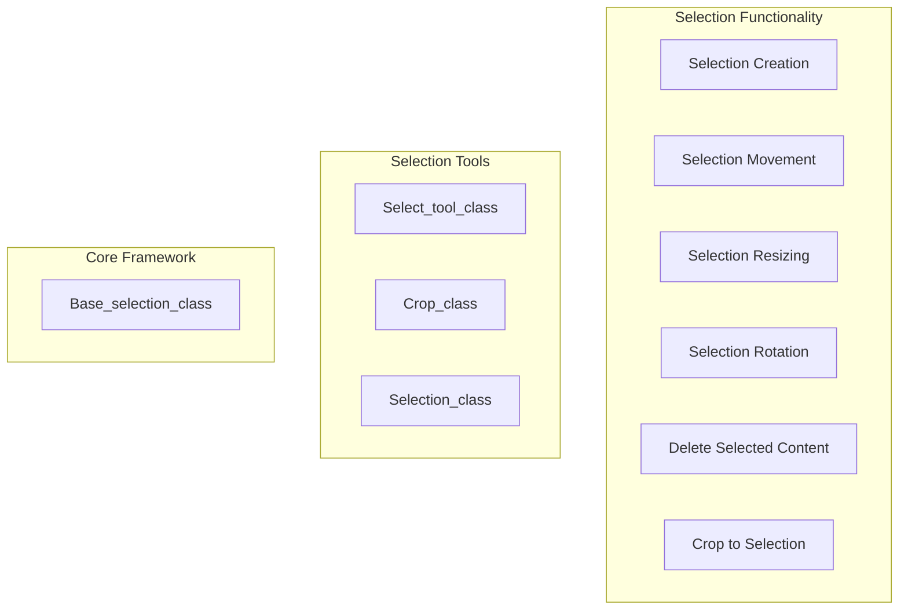
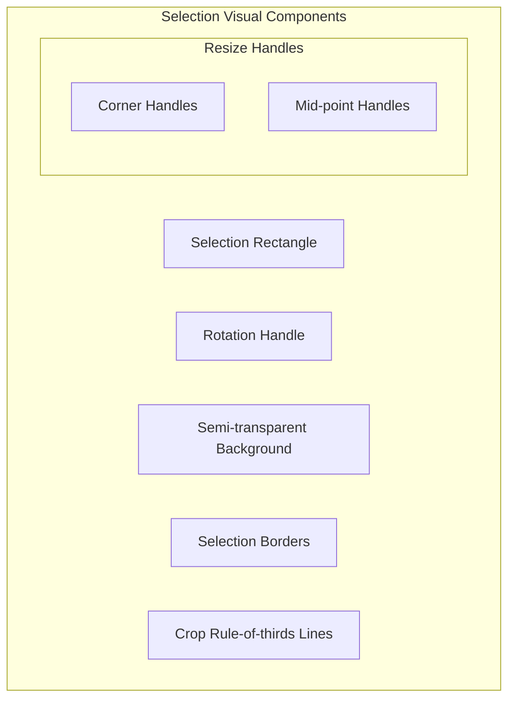
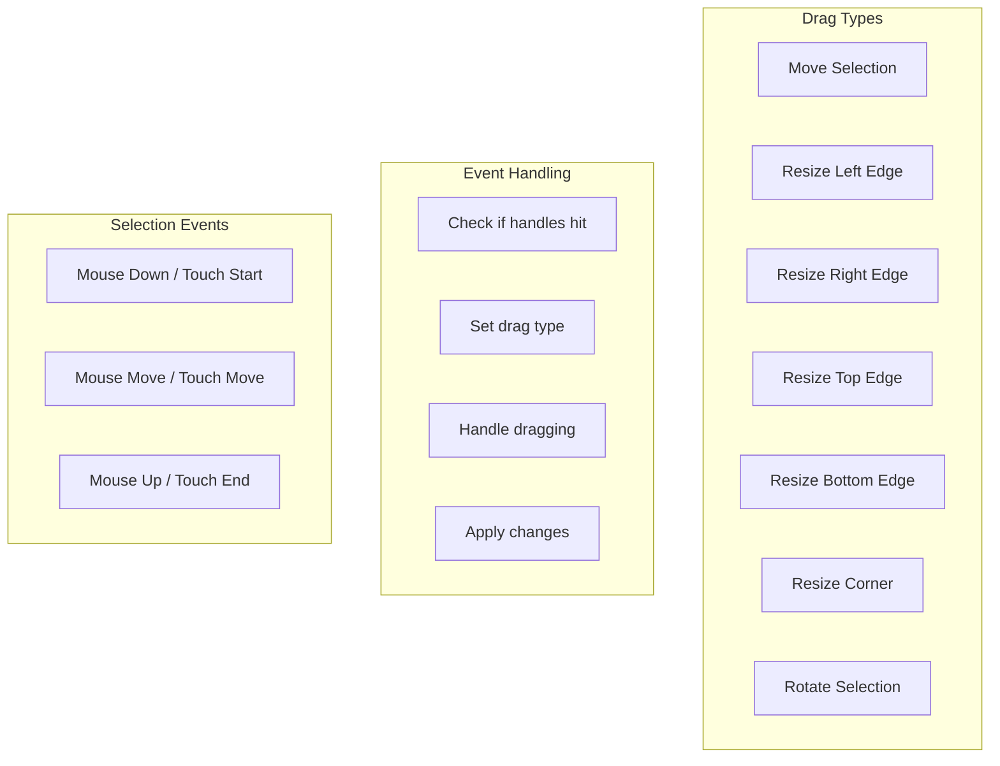
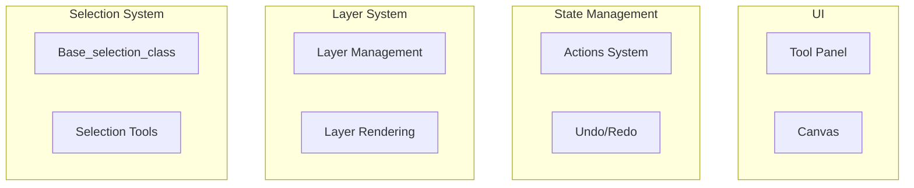

# Selection System

> **Relevant source files**
> * [src/js/core/base-selection.js](https://github.com/viliusle/miniPaint/blob/6d0b95e5/src/js/core/base-selection.js)
> * [src/js/tools/animation.js](https://github.com/viliusle/miniPaint/blob/6d0b95e5/src/js/tools/animation.js)
> * [src/js/tools/crop.js](https://github.com/viliusle/miniPaint/blob/6d0b95e5/src/js/tools/crop.js)
> * [src/js/tools/select.js](https://github.com/viliusle/miniPaint/blob/6d0b95e5/src/js/tools/select.js)
> * [src/js/tools/selection.js](https://github.com/viliusle/miniPaint/blob/6d0b95e5/src/js/tools/selection.js)

The Selection System in miniPaint provides functionality for creating, manipulating, and operating on rectangular selections. This system enables users to select layers, crop canvas, and perform operations on specific parts of image layers. For information about specific selection tools that use this system, see [Selection Tools](/viliusle/miniPaint/4.2-selection-tools).

## 1. Overview

The Selection System is built around a central `Base_selection_class` that provides the core functionality for drawing and manipulating rectangular selections. This class is used by various tools to implement selection-related features, each with their own specific behaviors.



Sources: [src/js/core/base-selection.js L21-L556](https://github.com/viliusle/miniPaint/blob/6d0b95e5/src/js/core/base-selection.js#L21-L556)

 [src/js/tools/select.js L9-L38](https://github.com/viliusle/miniPaint/blob/6d0b95e5/src/js/tools/select.js#L9-L38)

 [src/js/tools/crop.js L10-L38](https://github.com/viliusle/miniPaint/blob/6d0b95e5/src/js/tools/crop.js#L10-L38)

 [src/js/tools/selection.js L12-L52](https://github.com/viliusle/miniPaint/blob/6d0b95e5/src/js/tools/selection.js#L12-L52)

## 2. Base Selection Framework

The `Base_selection_class` provides the core functionality for all selection operations. It is implemented as a singleton to ensure a consistent selection state across all tools.

### 2.1 Selection Configuration

When initializing the selection framework, tools can configure the selection behavior using the following options:

| Option | Description |
| --- | --- |
| `enable_background` | Enables semi-transparent background in the selection area |
| `enable_borders` | Enables borders around the selection |
| `enable_controls` | Enables resize handles around the selection |
| `enable_rotation` | Enables rotation handle for the selection |
| `enable_move` | Enables moving the selection |
| `keep_ratio` | Maintains aspect ratio during resizing |
| `data_function` | Function that returns the current selection data |

Sources: [src/js/core/base-selection.js L23-L46](https://github.com/viliusle/miniPaint/blob/6d0b95e5/src/js/core/base-selection.js#L23-L46)

 [src/js/tools/select.js L26-L37](https://github.com/viliusle/miniPaint/blob/6d0b95e5/src/js/tools/select.js#L26-L37)

 [src/js/tools/crop.js L26-L36](https://github.com/viliusle/miniPaint/blob/6d0b95e5/src/js/tools/crop.js#L26-L36)

 [src/js/tools/selection.js L40-L51](https://github.com/viliusle/miniPaint/blob/6d0b95e5/src/js/tools/selection.js#L40-L51)

### 2.2 Selection Data Structure

The selection is represented by a simple data structure with the following properties:

```
{    x: number,       // X coordinate of top-left corner    y: number,       // Y coordinate of top-left corner    width: number,   // Width of selection    height: number,  // Height of selection    rotate: number   // Rotation angle (if applicable)}
```

Sources: [src/js/core/base-selection.js L99-L110](https://github.com/viliusle/miniPaint/blob/6d0b95e5/src/js/core/base-selection.js#L99-L110)

 [src/js/core/base-selection.js L113-L121](https://github.com/viliusle/miniPaint/blob/6d0b95e5/src/js/core/base-selection.js#L113-L121)

## 3. Visual Components of Selection

The Selection System includes several visual components that make selections interactive and intuitive.



### 3.1 Selection Rectangle

The main component is the selection rectangle, which defines the selected area. The rectangle can be drawn, moved, resized, and (in some cases) rotated.

### 3.2 Selection Handles

Selections include interactive handles for resizing:

* Corner handles: For resizing width and height simultaneously
* Mid-point handles: For resizing only width or only height

These handles are drawn when `enable_controls` is set to true.

### 3.3 Rotation Handle

When `enable_rotation` is true, a rotation handle is drawn near the top right corner of the selection. This allows users to rotate the selection.

### 3.4 Additional Visual Elements

* Semi-transparent background: Highlights the selected area when `enable_background` is true
* Borders: Draws borders around the selection when `enable_borders` is true
* Crop lines: For the crop tool, optional rule-of-thirds guidelines are displayed

Sources: [src/js/core/base-selection.js L159-L357](https://github.com/viliusle/miniPaint/blob/6d0b95e5/src/js/core/base-selection.js#L159-L357)

 [src/js/core/base-selection.js L304-L330](https://github.com/viliusle/miniPaint/blob/6d0b95e5/src/js/core/base-selection.js#L304-L330)

 [src/js/core/base-selection.js L336-L353](https://github.com/viliusle/miniPaint/blob/6d0b95e5/src/js/core/base-selection.js#L336-L353)

 [src/js/core/base-selection.js L206-L222](https://github.com/viliusle/miniPaint/blob/6d0b95e5/src/js/core/base-selection.js#L206-L222)

 [src/js/core/base-selection.js L225-L257](https://github.com/viliusle/miniPaint/blob/6d0b95e5/src/js/core/base-selection.js#L225-L257)

## 4. Event Handling and Interaction

The Selection System implements a comprehensive event handling mechanism to manage user interactions with selections.



### 4.1 Event Registration

The `Base_selection_class` registers event listeners for mouse and touch events to handle selection operations:

* Mouse/touch down: Start selection operations
* Mouse/touch move: Handle dragging, resizing, or rotating
* Mouse/touch up: Complete operations and apply changes

Sources: [src/js/core/base-selection.js L61-L96](https://github.com/viliusle/miniPaint/blob/6d0b95e5/src/js/core/base-selection.js#L61-L96)

### 4.2 Drag Type Detection

When a user interacts with a selection, the system determines the type of operation based on where the user clicked:

* Clicking on a handle: Initiates resizing operation
* Clicking on the rotation handle: Initiates rotation operation
* Clicking inside the selection: Initiates move operation
* Clicking outside: Starts a new selection (depending on the tool)

Sources: [src/js/core/base-selection.js L359-L554](https://github.com/viliusle/miniPaint/blob/6d0b95e5/src/js/core/base-selection.js#L359-L554)

 [src/js/core/base-selection.js L515-L551](https://github.com/viliusle/miniPaint/blob/6d0b95e5/src/js/core/base-selection.js#L515-L551)

### 4.3 Drag Operations

During dragging operations, the system updates the selection based on the drag type:

* Resizing: Updates width and height
* Moving: Updates x and y coordinates
* Rotating: Updates rotation angle

Key features during drag operations:

* Aspect ratio preservation (optional)
* Edge case handling for negative dimensions
* Visual feedback through cursor changes

Sources: [src/js/core/base-selection.js L408-L507](https://github.com/viliusle/miniPaint/blob/6d0b95e5/src/js/core/base-selection.js#L408-L507)

 [src/js/core/base-selection.js L434-L446](https://github.com/viliusle/miniPaint/blob/6d0b95e5/src/js/core/base-selection.js#L434-L446)

 [src/js/core/base-selection.js L450-L507](https://github.com/viliusle/miniPaint/blob/6d0b95e5/src/js/core/base-selection.js#L450-L507)

## 5. Selection Tools

The Selection System is used by several tools that provide specialized selection functionality.

### 5.1 Layer Selection Tool (Select Tool)

The `Select_tool_class` implements the main selection tool for selecting and manipulating layers:

* Select layers by clicking on them
* Move layers by dragging
* Resize layers via handles
* Rotate layers using the rotation handle
* Keyboard shortcut support for precise movements

This tool also implements a snapping system to help align layers accurately.

Sources: [src/js/tools/select.js L9-L39](https://github.com/viliusle/miniPaint/blob/6d0b95e5/src/js/tools/select.js#L9-L39)

 [src/js/tools/select.js L153-L216](https://github.com/viliusle/miniPaint/blob/6d0b95e5/src/js/tools/select.js#L153-L216)

 [src/js/tools/select.js L327-L504](https://github.com/viliusle/miniPaint/blob/6d0b95e5/src/js/tools/select.js#L327-L504)

### 5.2 Crop Tool

The `Crop_class` uses the Selection System to implement canvas cropping:

* Create a selection to define the crop area
* Optional aspect ratio constraints
* Rule-of-thirds grid display
* Applies cropping to all layers

Sources: [src/js/tools/crop.js L10-L38](https://github.com/viliusle/miniPaint/blob/6d0b95e5/src/js/tools/crop.js#L10-L38)

 [src/js/tools/crop.js L176-L295](https://github.com/viliusle/miniPaint/blob/6d0b95e5/src/js/tools/crop.js#L176-L295)

### 5.3 Image Selection Tool

The `Selection_class` implements selection within image layers:

* Select parts of an image
* Delete selected content
* Select all functionality
* Only works on raster image layers

Sources: [src/js/tools/selection.js L12-L52](https://github.com/viliusle/miniPaint/blob/6d0b95e5/src/js/tools/selection.js#L12-L52)

 [src/js/tools/selection.js L124-L233](https://github.com/viliusle/miniPaint/blob/6d0b95e5/src/js/tools/selection.js#L124-L233)

 [src/js/tools/selection.js L274-L312](https://github.com/viliusle/miniPaint/blob/6d0b95e5/src/js/tools/selection.js#L274-L312)

 [src/js/tools/selection.js L235-L253](https://github.com/viliusle/miniPaint/blob/6d0b95e5/src/js/tools/selection.js#L235-L253)

## 6. Advanced Features

### 6.1 State Management

The Selection System integrates with miniPaint's state management system to support:

* Undo/redo for selection operations
* Consistent selection state across tool changes
* Saving and restoring selection state

Sources: [src/js/tools/select.js L227-L259](https://github.com/viliusle/miniPaint/blob/6d0b95e5/src/js/tools/select.js#L227-L259)

 [src/js/tools/crop.js L164-L166](https://github.com/viliusle/miniPaint/blob/6d0b95e5/src/js/tools/crop.js#L164-L166)

 [src/js/tools/selection.js L229-L232](https://github.com/viliusle/miniPaint/blob/6d0b95e5/src/js/tools/selection.js#L229-L232)

### 6.2 Keyboard Interaction

The Selection System supports keyboard shortcuts for:

* Moving selected layers with arrow keys
* Deleting selections with Delete key
* Select all with Ctrl+A
* Canceling selections with Escape key

Sources: [src/js/tools/select.js L66-L116](https://github.com/viliusle/miniPaint/blob/6d0b95e5/src/js/tools/select.js#L66-L116)

 [src/js/tools/selection.js L80-L100](https://github.com/viliusle/miniPaint/blob/6d0b95e5/src/js/tools/selection.js#L80-L100)

### 6.3 Snapping System

The layer selection tool implements a snapping system that helps align layers:

* Snaps to other layer edges and centers
* Displays snap guidelines
* Can be disabled by holding Shift

Sources: [src/js/tools/select.js L327-L505](https://github.com/viliusle/miniPaint/blob/6d0b95e5/src/js/tools/select.js#L327-L505)

## 7. Integration with Other Systems

The Selection System interacts with several other systems in miniPaint:



The Selection System coordinates with:

* Layer System: For selecting, modifying, and applying operations to layers
* State Management: For tracking selection changes and supporting undo/redo
* UI System: For displaying selection tools and handling user interaction

Sources: [src/js/tools/select.js L13-L14](https://github.com/viliusle/miniPaint/blob/6d0b95e5/src/js/tools/select.js#L13-L14)

 [src/js/tools/crop.js L13-L17](https://github.com/viliusle/miniPaint/blob/6d0b95e5/src/js/tools/crop.js#L13-L17)

 [src/js/tools/selection.js L25-L27](https://github.com/viliusle/miniPaint/blob/6d0b95e5/src/js/tools/selection.js#L25-L27)