# Selection Tools

> **Relevant source files**
> * [src/js/core/base-selection.js](https://github.com/viliusle/miniPaint/blob/6d0b95e5/src/js/core/base-selection.js)
> * [src/js/tools/animation.js](https://github.com/viliusle/miniPaint/blob/6d0b95e5/src/js/tools/animation.js)
> * [src/js/tools/crop.js](https://github.com/viliusle/miniPaint/blob/6d0b95e5/src/js/tools/crop.js)
> * [src/js/tools/select.js](https://github.com/viliusle/miniPaint/blob/6d0b95e5/src/js/tools/select.js)
> * [src/js/tools/selection.js](https://github.com/viliusle/miniPaint/blob/6d0b95e5/src/js/tools/selection.js)

Selection tools in miniPaint enable users to select, move, resize, and modify areas of an image or specific layers. These tools form a critical part of the image editing workflow, allowing for precise manipulation of content. This page documents the various selection tools available in miniPaint, their implementation, and how they interact with the broader system.

For information about the underlying selection system architecture, see [Selection System](/viliusle/miniPaint/2.3-selection-system).

## Selection Tools Overview

miniPaint provides three main selection-related tools, each with distinct purposes:

1. **Select Tool** - For selecting and manipulating existing layers
2. **Crop Tool** - For cropping the entire canvas
3. **Selection Tool** - For selecting specific areas within an image layer

These tools are built on a shared foundation provided by the `Base_selection_class`, which handles common selection operations like rendering selection rectangles, detecting user interactions, and managing selection states.

```sql
#mermaid-njmhdk8nyam{font-family:ui-sans-serif,-apple-system,system-ui,Segoe UI,Helvetica;font-size:16px;fill:#333;}@keyframes edge-animation-frame{from{stroke-dashoffset:0;}}@keyframes dash{to{stroke-dashoffset:0;}}#mermaid-njmhdk8nyam .edge-animation-slow{stroke-dasharray:9,5!important;stroke-dashoffset:900;animation:dash 50s linear infinite;stroke-linecap:round;}#mermaid-njmhdk8nyam .edge-animation-fast{stroke-dasharray:9,5!important;stroke-dashoffset:900;animation:dash 20s linear infinite;stroke-linecap:round;}#mermaid-njmhdk8nyam .error-icon{fill:#dddddd;}#mermaid-njmhdk8nyam .error-text{fill:#222222;stroke:#222222;}#mermaid-njmhdk8nyam .edge-thickness-normal{stroke-width:1px;}#mermaid-njmhdk8nyam .edge-thickness-thick{stroke-width:3.5px;}#mermaid-njmhdk8nyam .edge-pattern-solid{stroke-dasharray:0;}#mermaid-njmhdk8nyam .edge-thickness-invisible{stroke-width:0;fill:none;}#mermaid-njmhdk8nyam .edge-pattern-dashed{stroke-dasharray:3;}#mermaid-njmhdk8nyam .edge-pattern-dotted{stroke-dasharray:2;}#mermaid-njmhdk8nyam .marker{fill:#999;stroke:#999;}#mermaid-njmhdk8nyam .marker.cross{stroke:#999;}#mermaid-njmhdk8nyam svg{font-family:ui-sans-serif,-apple-system,system-ui,Segoe UI,Helvetica;font-size:16px;}#mermaid-njmhdk8nyam p{margin:0;}#mermaid-njmhdk8nyam g.classGroup text{fill:#dddddd;stroke:none;font-family:ui-sans-serif,-apple-system,system-ui,Segoe UI,Helvetica;font-size:10px;}#mermaid-njmhdk8nyam g.classGroup text .title{font-weight:bolder;}#mermaid-njmhdk8nyam .cluster-label text{fill:#444;}#mermaid-njmhdk8nyam .cluster-label span{color:#444;}#mermaid-njmhdk8nyam .cluster-label span p{background-color:transparent;}#mermaid-njmhdk8nyam .cluster rect{fill:#f8f8f8;stroke:#dddddd;stroke-width:1px;}#mermaid-njmhdk8nyam .cluster text{fill:#444;}#mermaid-njmhdk8nyam .cluster span{color:#444;}#mermaid-njmhdk8nyam .nodeLabel,#mermaid-njmhdk8nyam .edgeLabel{color:#333333;}#mermaid-njmhdk8nyam .noteLabel .nodeLabel,#mermaid-njmhdk8nyam .noteLabel .edgeLabel{color:#333;}#mermaid-njmhdk8nyam .edgeLabel .label rect{fill:#ffffff;}#mermaid-njmhdk8nyam .label text{fill:#333333;}#mermaid-njmhdk8nyam .labelBkg{background:#ffffff;}#mermaid-njmhdk8nyam .edgeLabel .label span{background:#ffffff;}#mermaid-njmhdk8nyam .classTitle{font-weight:bolder;}#mermaid-njmhdk8nyam .node rect,#mermaid-njmhdk8nyam .node circle,#mermaid-njmhdk8nyam .node ellipse,#mermaid-njmhdk8nyam .node polygon,#mermaid-njmhdk8nyam .node path{fill:#ffffff;stroke:#dddddd;stroke-width:1;}#mermaid-njmhdk8nyam .divider{stroke:#dddddd;stroke-width:1;}#mermaid-njmhdk8nyam g.clickable{cursor:pointer;}#mermaid-njmhdk8nyam g.classGroup rect{fill:#ffffff;stroke:#dddddd;}#mermaid-njmhdk8nyam g.classGroup line{stroke:#dddddd;stroke-width:1;}#mermaid-njmhdk8nyam .classLabel .box{stroke:none;stroke-width:0;fill:#ffffff;opacity:0.5;}#mermaid-njmhdk8nyam .classLabel .label{fill:#dddddd;font-size:10px;}#mermaid-njmhdk8nyam .relation{stroke:#999;stroke-width:1;fill:none;}#mermaid-njmhdk8nyam .dashed-line{stroke-dasharray:3;}#mermaid-njmhdk8nyam .dotted-line{stroke-dasharray:1 2;}#mermaid-njmhdk8nyam [id$="-compositionStart"],#mermaid-njmhdk8nyam .composition{fill:#999!important;stroke:#999!important;stroke-width:1;}#mermaid-njmhdk8nyam [id$="-compositionEnd"],#mermaid-njmhdk8nyam .composition{fill:#999!important;stroke:#999!important;stroke-width:1;}#mermaid-njmhdk8nyam [id$="-dependencyStart"],#mermaid-njmhdk8nyam .dependency{fill:#999!important;stroke:#999!important;stroke-width:1;}#mermaid-njmhdk8nyam [id$="-dependencyEnd"],#mermaid-njmhdk8nyam .dependency{fill:#999!important;stroke:#999!important;stroke-width:1;}#mermaid-njmhdk8nyam [id$="-extensionStart"],#mermaid-njmhdk8nyam .extension{fill:transparent!important;stroke:#999!important;stroke-width:1;}#mermaid-njmhdk8nyam [id$="-extensionEnd"],#mermaid-njmhdk8nyam .extension{fill:transparent!important;stroke:#999!important;stroke-width:1;}#mermaid-njmhdk8nyam [id$="-aggregationStart"],#mermaid-njmhdk8nyam .aggregation{fill:transparent!important;stroke:#999!important;stroke-width:1;}#mermaid-njmhdk8nyam [id$="-aggregationEnd"],#mermaid-njmhdk8nyam .aggregation{fill:transparent!important;stroke:#999!important;stroke-width:1;}#mermaid-njmhdk8nyam [id$="-lollipopStart"],#mermaid-njmhdk8nyam .lollipop{fill:#ffffff!important;stroke:#999!important;stroke-width:1;}#mermaid-njmhdk8nyam [id$="-lollipopEnd"],#mermaid-njmhdk8nyam .lollipop{fill:#ffffff!important;stroke:#999!important;stroke-width:1;}#mermaid-njmhdk8nyam .edgeTerminals{font-size:11px;line-height:initial;}#mermaid-njmhdk8nyam .classTitleText{text-anchor:middle;font-size:18px;fill:#333;}#mermaid-njmhdk8nyam .edgeLabel[data-look="neo"]{background-color:#ffffff;text-align:center;}#mermaid-njmhdk8nyam .edgeLabel[data-look="neo"] p{background-color:#ffffff;}#mermaid-njmhdk8nyam .edgeLabel[data-look="neo"] rect{opacity:0.5;background-color:#ffffff;fill:#ffffff;}#mermaid-njmhdk8nyam .label-icon{display:inline-block;height:1em;overflow:visible;vertical-align:-0.125em;}#mermaid-njmhdk8nyam .node .label-icon path{fill:currentColor;stroke:revert;stroke-width:revert;}#mermaid-njmhdk8nyam .node .neo-node{stroke:#dddddd;}#mermaid-njmhdk8nyam [data-look="neo"].node rect,#mermaid-njmhdk8nyam [data-look="neo"].cluster rect,#mermaid-njmhdk8nyam [data-look="neo"].node polygon{stroke:url(#mermaid-njmhdk8nyam-gradient);filter:drop-shadow( 1px 2px 2px rgba(185,185,185,1));}#mermaid-njmhdk8nyam [data-look="neo"].node path{stroke:url(#mermaid-njmhdk8nyam-gradient);stroke-width:1px;}#mermaid-njmhdk8nyam [data-look="neo"].node .outer-path{filter:drop-shadow( 1px 2px 2px rgba(185,185,185,1));}#mermaid-njmhdk8nyam [data-look="neo"].node .neo-line path{stroke:#dddddd;filter:none;}#mermaid-njmhdk8nyam [data-look="neo"].node circle{stroke:url(#mermaid-njmhdk8nyam-gradient);filter:drop-shadow( 1px 2px 2px rgba(185,185,185,1));}#mermaid-njmhdk8nyam [data-look="neo"].node circle .state-start{fill:#000000;}#mermaid-njmhdk8nyam [data-look="neo"].icon-shape .icon{fill:url(#mermaid-njmhdk8nyam-gradient);filter:drop-shadow( 1px 2px 2px rgba(185,185,185,1));}#mermaid-njmhdk8nyam [data-look="neo"].icon-shape .icon-neo path{stroke:url(#mermaid-njmhdk8nyam-gradient);filter:drop-shadow( 1px 2px 2px rgba(185,185,185,1));}#mermaid-njmhdk8nyam :root{--mermaid-font-family:"trebuchet ms",verdana,arial,sans-serif;}Base_selection_class+draw_selection()+set_selection()+reset_selection()+get_selection()+selected_object_actions()Select_tool_class+auto_select_object()+move()+calc_snap()Crop_class+on_params_update()Selection_class+delete_selection()+select_all()+init_tmp_canvas()Base_tools_class+load()+mousedown()+mousemove()+mouseup()+on_params_update()
```

Sources: [src/js/core/base-selection.js](https://github.com/viliusle/miniPaint/blob/6d0b95e5/src/js/core/base-selection.js)

 [src/js/tools/select.js](https://github.com/viliusle/miniPaint/blob/6d0b95e5/src/js/tools/select.js)

 [src/js/tools/crop.js](https://github.com/viliusle/miniPaint/blob/6d0b95e5/src/js/tools/crop.js)

 [src/js/tools/selection.js](https://github.com/viliusle/miniPaint/blob/6d0b95e5/src/js/tools/selection.js)

## Core Selection Framework

The core selection framework is implemented in `Base_selection_class` and provides the foundation for all selection tools. This class handles:

1. Rendering selection rectangles with resize/rotate handles
2. Processing mouse/touch interactions for selections
3. Managing selection transformations (resize, move, rotate)
4. Handling coordinate calculations for selections

```mermaid
flowchart TD

mermaid-0iut29zd5vui-flowchart-User["User Interaction"]
mermaid-0iut29zd5vui-flowchart-Events["Mouse/Touch Events"]
mermaid-0iut29zd5vui-flowchart-ActionType["Determine Action Type"]
mermaid-0iut29zd5vui-flowchart-MoveAction["Process Move"]
mermaid-0iut29zd5vui-flowchart-ResizeAction["Process Resize"]
mermaid-0iut29zd5vui-flowchart-RotateAction["Process Rotate"]
mermaid-0iut29zd5vui-flowchart-UpdateCoords["Update Coordinates"]
mermaid-0iut29zd5vui-flowchart-UpdateDimensions["Update Dimensions"]
mermaid-0iut29zd5vui-flowchart-UpdateAngle["Update Angle"]
mermaid-0iut29zd5vui-flowchart-RenderSelection["Render Selection"]
mermaid-0iut29zd5vui-flowchart-ConfigUpdate["Update Config"]
mermaid-0iut29zd5vui-flowchart-MainRender["Trigger Main Render"]
```



Sources: [src/js/core/base-selection.js L21-L357](https://github.com/viliusle/miniPaint/blob/6d0b95e5/src/js/core/base-selection.js#L21-L357)

The selection rendering system draws handles for selection manipulation, with different types of handles based on the selection:

* Corner handles for resizing width and height simultaneously
* Edge handles for resizing only width or height
* Rotation handle for rotating the selection

The `Base_selection_class` uses a coordinate system with:

* `x, y` - Top-left corner of selection
* `width, height` - Dimensions of selection
* `rotate` - Rotation angle in degrees (if applicable)

### Selection Rendering

The `draw_selection()` method renders the selection rectangle with handles. The rendering includes:

* Selection background (optional, semi-transparent)
* Selection borders (optional)
* Resize handles (corners and edges)
* Rotation handle (if enabled)
* Crop guidelines (if enabled)

The appearance of the selection adapts based on the current zoom level and handles edge cases like selections that extend beyond the canvas edges.

Sources: [src/js/core/base-selection.js L162-L357](https://github.com/viliusle/miniPaint/blob/6d0b95e5/src/js/core/base-selection.js#L162-L357)

### Selection User Interaction

User interactions with selections follow this sequence:

1. **Mouse/Touch Down** - Initiates selection or starts manipulation
2. **Mouse/Touch Move** - Updates selection dimensions or position
3. **Mouse/Touch Up** - Finalizes the operation

The `selected_object_actions()` method determines which part of the selection the user is interacting with (e.g., resize handle, rotation handle, or interior) and processes the corresponding action.

Sources: [src/js/core/base-selection.js L359-L554](https://github.com/viliusle/miniPaint/blob/6d0b95e5/src/js/core/base-selection.js#L359-L554)

## Select Tool

The Select tool (`Select_tool_class`) allows users to select, move, resize, and rotate existing layers. This is the primary tool for manipulating layers in miniPaint.

### Key Features

1. **Layer Selection** - Automatically selects the layer under the cursor
2. **Movement** - Moves selected layers with mouse or keyboard arrows
3. **Resizing** - Resizes layers via handles
4. **Rotation** - Rotates layers via the rotation handle
5. **Snap Alignment** - Snaps layers to guides, edges, or other layers

```mermaid
flowchart TD

mermaid-6c4shylx9f8-flowchart-MouseDown["Mouse Down"]
mermaid-6c4shylx9f8-flowchart-IsOnLayer["Is on layer?"]
mermaid-6c4shylx9f8-flowchart-StartMoving["Start Moving Layer"]
mermaid-6c4shylx9f8-flowchart-CheckHandle["On handle?"]
mermaid-6c4shylx9f8-flowchart-DetermineHandleType["Determine Handle Type"]
mermaid-6c4shylx9f8-flowchart-StartResizing["Start Resizing"]
mermaid-6c4shylx9f8-flowchart-StartRotating["Start Rotating"]
mermaid-6c4shylx9f8-flowchart-AutoSelect["Auto-select Object"]
mermaid-6c4shylx9f8-flowchart-MouseMove["Mouse Move"]
mermaid-6c4shylx9f8-flowchart-IsMoving["Is moving?"]
mermaid-6c4shylx9f8-flowchart-MoveLayer["Move Layer"]
mermaid-6c4shylx9f8-flowchart-IsResizing["Is resizing?"]
mermaid-6c4shylx9f8-flowchart-ResizeLayer["Resize Layer"]
mermaid-6c4shylx9f8-flowchart-IsRotating["Is rotating?"]
mermaid-6c4shylx9f8-flowchart-RotateLayer["Rotate Layer"]
mermaid-6c4shylx9f8-flowchart-SnapCalculation["Calculate Snap Position"]
mermaid-6c4shylx9f8-flowchart-ApplySnap["Apply Snap if Needed"]
mermaid-6c4shylx9f8-flowchart-MouseUp["Mouse Up"]
mermaid-6c4shylx9f8-flowchart-FinalizeAction["Finalize Action"]
mermaid-6c4shylx9f8-flowchart-CreateUndoAction["Create Undo Action"]
```



Sources: [src/js/tools/select.js L9-L152](https://github.com/viliusle/miniPaint/blob/6d0b95e5/src/js/tools/select.js#L9-L152)

 [src/js/tools/select.js L153-L216](https://github.com/viliusle/miniPaint/blob/6d0b95e5/src/js/tools/select.js#L153-L216)

 [src/js/tools/select.js L217-L292](https://github.com/viliusle/miniPaint/blob/6d0b95e5/src/js/tools/select.js#L217-L292)

### Select Tool Operation

The Select tool operates in three main modes:

1. **Moving** - When dragging from inside the selection
2. **Resizing** - When dragging a resize handle
3. **Rotating** - When dragging the rotation handle

When moving a layer, the tool implements snapping functionality to help align layers with each other or with the canvas boundaries.

The Select tool also supports keyboard shortcuts:

* Arrow keys to move the selection
* Shift+Arrow for fine movement
* Ctrl+Arrow for larger movement
* Delete key to delete the selected layer

Sources: [src/js/tools/select.js L40-L118](https://github.com/viliusle/miniPaint/blob/6d0b95e5/src/js/tools/select.js#L40-L118)

## Crop Tool

The Crop tool (`Crop_class`) allows users to crop the entire canvas. This affects all layers in the project.

### Key Features

1. **Visual Selection** - Draw a crop rectangle on the canvas
2. **Aspect Ratio Control** - Hold Ctrl/Cmd to maintain the current canvas aspect ratio
3. **Guidelines** - Visual guidelines dividing the selection into thirds

```mermaid
flowchart TD

mermaid-79f356zdltc-flowchart-MouseDown["Mouse Down"]
mermaid-79f356zdltc-flowchart-StartCrop["Start New Crop Selection"]
mermaid-79f356zdltc-flowchart-MouseMove["Mouse Move"]
mermaid-79f356zdltc-flowchart-UpdateCropDimensions["Update Crop Dimensions"]
mermaid-79f356zdltc-flowchart-CheckCtrl["Ctrl/Cmd pressed?"]
mermaid-79f356zdltc-flowchart-MaintainRatio["Maintain Canvas Ratio"]
mermaid-79f356zdltc-flowchart-FreeResize["Free Resize"]
mermaid-79f356zdltc-flowchart-MouseUp["Mouse Up"]
mermaid-79f356zdltc-flowchart-ValidateCrop["Valid crop size?"]
mermaid-79f356zdltc-flowchart-ResetSelection["Reset Selection"]
mermaid-79f356zdltc-flowchart-SaveCropCoords["Save Crop Coordinates"]
mermaid-79f356zdltc-flowchart-ApplyCrop["Apply Crop Button"]
mermaid-79f356zdltc-flowchart-ProcessCrop["Process Crop Action"]
mermaid-79f356zdltc-flowchart-AdjustLayers["Adjust All Layer Positions"]
mermaid-79f356zdltc-flowchart-ResizeCanvas["Resize Canvas"]
```



Sources: [src/js/tools/crop.js L10-L168](https://github.com/viliusle/miniPaint/blob/6d0b95e5/src/js/tools/crop.js#L10-L168)

### Crop Process

When the crop is applied (through the parameters panel), the tool:

1. Verifies the selection is valid
2. Checks that no layers are rotated (rotated layers cannot be cropped)
3. Crops each layer by adjusting its position and dimensions
4. For image layers, it creates a new canvas with only the visible portion
5. Resizes the canvas to match the crop dimensions
6. Resets the selection

The crop operation is implemented as a bundle of actions to enable undo/redo functionality.

Sources: [src/js/tools/crop.js L169-L296](https://github.com/viliusle/miniPaint/blob/6d0b95e5/src/js/tools/crop.js#L169-L296)

## Selection Tool

The Selection tool (`Selection_class`) allows users to select specific areas within an image layer. This is different from the Select tool, which selects entire layers.

### Key Features

1. **Area Selection** - Select rectangular areas within an image layer
2. **Delete Selection** - Delete the selected area
3. **Select All** - Select the entire image layer
4. **Clipboard Operations** - (Note: while the framework exists, clipboard operations appear to be limited)

```mermaid
flowchart TD

mermaid-3k74hcbaosk-flowchart-MouseDown["Mouse Down"]
mermaid-3k74hcbaosk-flowchart-CheckExisting["Has selection?"]
mermaid-3k74hcbaosk-flowchart-InitMovement["Initialize Movement (not fully implemented)"]
mermaid-3k74hcbaosk-flowchart-StartNewSelection["Start New Selection"]
mermaid-3k74hcbaosk-flowchart-MouseMove["Mouse Move"]
mermaid-3k74hcbaosk-flowchart-UpdateSelection["Update Selection Dimensions"]
mermaid-3k74hcbaosk-flowchart-MouseUp["Mouse Up"]
mermaid-3k74hcbaosk-flowchart-ValidateSize["Valid size?"]
mermaid-3k74hcbaosk-flowchart-ClearSelection["Clear Selection"]
mermaid-3k74hcbaosk-flowchart-FinalizeSelection["Finalize Selection"]
mermaid-3k74hcbaosk-flowchart-KeyboardEvents["Keyboard Events"]
mermaid-3k74hcbaosk-flowchart-KeyDetect["Key pressed?"]
mermaid-3k74hcbaosk-flowchart-SelectAll["Select All"]
mermaid-3k74hcbaosk-flowchart-DeleteContent["Delete Selection Content"]
```



Sources: [src/js/tools/selection.js L12-L53](https://github.com/viliusle/miniPaint/blob/6d0b95e5/src/js/tools/selection.js#L12-L53)

 [src/js/tools/selection.js L124-L233](https://github.com/viliusle/miniPaint/blob/6d0b95e5/src/js/tools/selection.js#L124-L233)

### Selection Operations

The Selection tool operates on image layers only and utilizes a temporary canvas to manipulate the selected area. Key operations include:

1. **Creating a selection** - Drawing a rectangular selection area
2. **Deleting a selection** - Removing the content in the selected area
3. **Select All** - Selecting the entire layer

The tool maintains a temporary canvas (`tmpCanvas`) for operations that modify the layer content.

Sources: [src/js/tools/selection.js L254-L336](https://github.com/viliusle/miniPaint/blob/6d0b95e5/src/js/tools/selection.js#L254-L336)

## Technical Details

### Selection Data Structure

Selections are stored with the following properties:

| Property | Description |
| --- | --- |
| x | Left position of the selection |
| y | Top position of the selection |
| width | Width of the selection |
| height | Height of the selection |
| rotate | Rotation angle (if applicable) |

Sources: [src/js/core/base-selection.js L99-L123](https://github.com/viliusle/miniPaint/blob/6d0b95e5/src/js/core/base-selection.js#L99-L123)

### Selection Configuration

Each selection tool configures the `Base_selection_class` with specific settings:

| Setting | Description |
| --- | --- |
| enable_background | Whether to show a semi-transparent background |
| enable_borders | Whether to show selection borders |
| enable_controls | Whether to show resize handles |
| enable_rotation | Whether to allow rotation |
| enable_move | Whether to allow movement |
| keep_ratio | Whether to maintain aspect ratio when resizing |
| data_function | Function that returns the selection data |

Sources: [src/js/tools/select.js L26-L37](https://github.com/viliusle/miniPaint/blob/6d0b95e5/src/js/tools/select.js#L26-L37)

 [src/js/tools/crop.js L26-L36](https://github.com/viliusle/miniPaint/blob/6d0b95e5/src/js/tools/crop.js#L26-L36)

 [src/js/tools/selection.js L40-L51](https://github.com/viliusle/miniPaint/blob/6d0b95e5/src/js/tools/selection.js#L40-L51)

### Drag Type Constants

The selection system uses bitmask constants to identify which handle is being dragged:

```
DRAG_TYPE_TOP = 1
DRAG_TYPE_BOTTOM = 2
DRAG_TYPE_LEFT = 4
DRAG_TYPE_RIGHT = 8
```

These can be combined to represent corner handles, e.g., `DRAG_TYPE_TOP | DRAG_TYPE_LEFT` for the top-left corner.

Sources: [src/js/core/base-selection.js L13-L16](https://github.com/viliusle/miniPaint/blob/6d0b95e5/src/js/core/base-selection.js#L13-L16)

## Integration with Other Systems

Selection tools integrate with several other systems in miniPaint:

1. **Layer System** - Selection tools operate on and manipulate layers
2. **State Management** - Selection operations create actions for undo/redo
3. **Rendering System** - Selections trigger re-rendering of the canvas
4. **Event System** - Selection tools process mouse, touch, and keyboard events

Selection tools use the action system for operations that should be undoable, such as moving layers, resizing layers, or cropping the canvas.

Sources: [src/js/tools/select.js L238-L259](https://github.com/viliusle/miniPaint/blob/6d0b95e5/src/js/tools/select.js#L238-L259)

 [src/js/tools/crop.js L164-L295](https://github.com/viliusle/miniPaint/blob/6d0b95e5/src/js/tools/crop.js#L164-L295)