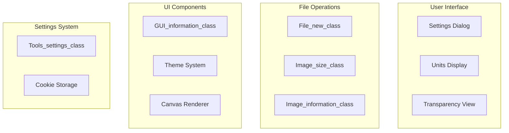

# Settings

> **Relevant source files**
> * [src/js/core/gui/gui-information.js](https://github.com/viliusle/miniPaint/blob/6d0b95e5/src/js/core/gui/gui-information.js)
> * [src/js/libs/helpers.js](https://github.com/viliusle/miniPaint/blob/6d0b95e5/src/js/libs/helpers.js)
> * [src/js/modules/file/new.js](https://github.com/viliusle/miniPaint/blob/6d0b95e5/src/js/modules/file/new.js)
> * [src/js/modules/image/information.js](https://github.com/viliusle/miniPaint/blob/6d0b95e5/src/js/modules/image/information.js)
> * [src/js/modules/image/size.js](https://github.com/viliusle/miniPaint/blob/6d0b95e5/src/js/modules/image/size.js)
> * [src/js/modules/image/translate.js](https://github.com/viliusle/miniPaint/blob/6d0b95e5/src/js/modules/image/translate.js)
> * [src/js/modules/tools/settings.js](https://github.com/viliusle/miniPaint/blob/6d0b95e5/src/js/modules/tools/settings.js)

This page documents the Settings system in miniPaint, which provides user-configurable options that affect the application's behavior, appearance, and default values. The Settings system manages preferences like transparency, units, guides, themes, and resolution, storing them persistently between sessions using cookies.

## Overview

The Settings system is implemented through the `Tools_settings_class`, which provides methods for retrieving, saving, and displaying settings. This central system is used throughout the application whenever components need to access user preferences.

### Settings Dialog

Users can access settings by clicking on the "Settings" option in the File menu. This displays a dialog that allows configuring various application preferences:


```

```

Sources: [src/js/modules/tools/settings.js L6-L171](https://github.com/viliusle/miniPaint/blob/6d0b95e5/src/js/modules/tools/settings.js#L6-L171)

## Available Settings

The Settings system manages the following user preferences:

| Setting | Description | Default Value |
| --- | --- | --- |
| transparency | Enables transparency in the canvas | false |
| transparency_type | Type of transparency background (squares, green, grey) | 'squares' |
| theme | Application theme | First theme in config.themes |
| default_units | Measurement units (pixels, inches, centimeters, millimetres) | 'pixels' |
| resolution | Document resolution in DPI (72, 150, 300, 600) | 72 |
| snap | Enables snapping to grid/guides | true |
| guides | Enables guides | true |
| safe_search | Enables safe search for media tool | true |
| exit_confirm | Prompts confirmation before exiting with unsaved changes | true |
| thick_guides | Uses thicker guides | false |
| enable_autoresize | Automatically resizes the canvas | Defined in config |

Sources: [src/js/modules/tools/settings.js L37-L52](https://github.com/viliusle/miniPaint/blob/6d0b95e5/src/js/modules/tools/settings.js#L37-L52)

 [src/js/modules/tools/settings.js L121-L133](https://github.com/viliusle/miniPaint/blob/6d0b95e5/src/js/modules/tools/settings.js#L121-L133)

## Settings Storage and Retrieval

The Settings system uses cookies for persistent storage. Settings are retrieved when needed and saved when modified.

```mermaid
flowchart TD

mermaid-eqx3sytmsfp-flowchart-A["User changes settings"]
mermaid-eqx3sytmsfp-flowchart-B["settings() dialog"]
mermaid-eqx3sytmsfp-flowchart-C["save_values() method"]
mermaid-eqx3sytmsfp-flowchart-D["save_setting() for each value"]
mermaid-eqx3sytmsfp-flowchart-E["Helper.setCookie()"]
mermaid-eqx3sytmsfp-flowchart-F["Save to browser cookies"]
mermaid-eqx3sytmsfp-flowchart-G["Component needs setting"]
mermaid-eqx3sytmsfp-flowchart-H["get_setting() method"]
mermaid-eqx3sytmsfp-flowchart-I["Helper.getCookie()"]
mermaid-eqx3sytmsfp-flowchart-J["Return value or use default"]
```



Sources: [src/js/modules/tools/settings.js L102-L167](https://github.com/viliusle/miniPaint/blob/6d0b95e5/src/js/modules/tools/settings.js#L102-L167)

 [src/js/libs/helpers.js L71-L124](https://github.com/viliusle/miniPaint/blob/6d0b95e5/src/js/libs/helpers.js#L71-L124)

### Setting Retrieval

When a component needs a setting, it calls `get_setting()`, which:

1. Checks for the setting in cookies
2. If not found, returns the default value
3. Handles special cases (e.g., safe search restrictions, theme detection)
4. Converts numeric values (0/1) to booleans

### Setting Storage

When settings are saved:

1. Boolean values are converted to 0/1
2. Values are stored in cookies
3. Relevant config properties are updated
4. UI components are notified to update

## Unit Conversion System

A key feature of the Settings system is handling unit conversions between different measurement systems.

```mermaid
flowchart TD

mermaid-160oyzwlt9m-flowchart-A["get_user_unit()"]
mermaid-160oyzwlt9m-flowchart-B["Which unit?"]
mermaid-160oyzwlt9m-flowchart-C["Return pixel value"]
mermaid-160oyzwlt9m-flowchart-D["Divide by resolution"]
mermaid-160oyzwlt9m-flowchart-E["Divide by resolution × 2.54"]
mermaid-160oyzwlt9m-flowchart-F["Divide by resolution × 25.4"]
mermaid-160oyzwlt9m-flowchart-G["get_internal_unit()"]
mermaid-160oyzwlt9m-flowchart-H["Which unit?"]
mermaid-160oyzwlt9m-flowchart-I["Return pixel value"]
mermaid-160oyzwlt9m-flowchart-J["Multiply by resolution"]
mermaid-160oyzwlt9m-flowchart-K["Multiply by resolution / 2.54"]
mermaid-160oyzwlt9m-flowchart-L["Multiply by resolution / 25.4"]
```



Sources: [src/js/libs/helpers.js L672-L714](https://github.com/viliusle/miniPaint/blob/6d0b95e5/src/js/libs/helpers.js#L672-L714)

The `default_units_config` defines the mapping between unit names and their abbreviations:

```
{    pixels: 'px',    inches: '"',    centimeters: 'cm',    millimetres: 'mm',}
```

Sources: [src/js/modules/tools/settings.js L13-L18](https://github.com/viliusle/miniPaint/blob/6d0b95e5/src/js/modules/tools/settings.js#L13-L18)

## Integration with Other Systems

The Settings system integrates with multiple components throughout miniPaint.



Sources: [src/js/modules/image/size.js L14-L67](https://github.com/viliusle/miniPaint/blob/6d0b95e5/src/js/modules/image/size.js#L14-L67)

 [src/js/modules/file/new.js L21-L76](https://github.com/viliusle/miniPaint/blob/6d0b95e5/src/js/modules/file/new.js#L21-L76)

 [src/js/core/gui/gui-information.js L31-L101](https://github.com/viliusle/miniPaint/blob/6d0b95e5/src/js/core/gui/gui-information.js#L31-L101)

### Usage Examples

#### Information Panel

The `GUI_information_class` uses settings to display canvas dimensions in the user's preferred units:

```javascript
// Convert dimensions to user unitsvar width = this.Helper.get_user_unit(config.WIDTH, this.units, this.resolution);var height = this.Helper.get_user_unit(config.HEIGHT, this.units, this.resolution); // Display with appropriate unit abbreviationdocument.getElementById('mouse_info_size').innerHTML = width + ' x ' + height;
```

Sources: [src/js/core/gui/gui-information.js L79-L87](https://github.com/viliusle/miniPaint/blob/6d0b95e5/src/js/core/gui/gui-information.js#L79-L87)

#### New File Dialog

The `File_new_class` uses settings for default transparency and units when creating new files:

```javascript
// Get transparency settingvar transparency_cookie = this.Helper.getCookie('transparency');if (transparency_cookie === null) {    //default    transparency_cookie = false;} // Convert units for displaywidth = this.Helper.get_user_unit(width, units, resolution);height = this.Helper.get_user_unit(height, units, resolution);
```

Sources: [src/js/modules/file/new.js L38-L52](https://github.com/viliusle/miniPaint/blob/6d0b95e5/src/js/modules/file/new.js#L38-L52)

#### Image Resizing

The `Image_size_class` uses settings for units and resolution when resizing the canvas:

```javascript
// Get settingsvar units = this.Tools_settings.get_setting('default_units');var resolution = this.Tools_settings.get_setting('resolution');var enable_autoresize = this.Tools_settings.get_setting('enable_autoresize'); // Convert dimensions for displayvar width = this.Helper.get_user_unit(config.WIDTH, units, resolution);var height = this.Helper.get_user_unit(config.HEIGHT, units, resolution);
```

Sources: [src/js/modules/image/size.js L21-L34](https://github.com/viliusle/miniPaint/blob/6d0b95e5/src/js/modules/image/size.js#L21-L34)

## Technical Implementation

### Save Setting Method

The `save_setting()` method handles storing settings:

```
save_setting(key, value) {    // Convert boolean to numbers    if(value === true){        value = 1;    }    if(value === false){        value = 0;    }     this.Helper.setCookie(key, value);}
```

Sources: [src/js/modules/tools/settings.js L102-L112](https://github.com/viliusle/miniPaint/blob/6d0b95e5/src/js/modules/tools/settings.js#L102-L112)

### Get Setting Method

The `get_setting()` method retrieves settings with fallbacks to defaults:

```javascript
get_setting(key) {    var default_values = {        'theme': null,        'transparency': false,        'snap': true,        'guides': true,        // ... other defaults    };     var value = this.Helper.getCookie(key);    if(value == null && default_values[key] != undefined){        // Use default value        value = default_values[key];    }        // Handle special cases and convert values    // ...        return value;}
```

Sources: [src/js/modules/tools/settings.js L120-L167](https://github.com/viliusle/miniPaint/blob/6d0b95e5/src/js/modules/tools/settings.js#L120-L167)

## Summary

The Settings system in miniPaint provides a centralized mechanism for managing user preferences. It handles the storage, retrieval, and application of settings throughout the application, ensuring a consistent experience. The system is particularly important for unit conversions, allowing users to work in their preferred measurement system while maintaining internal consistency in pixel values.