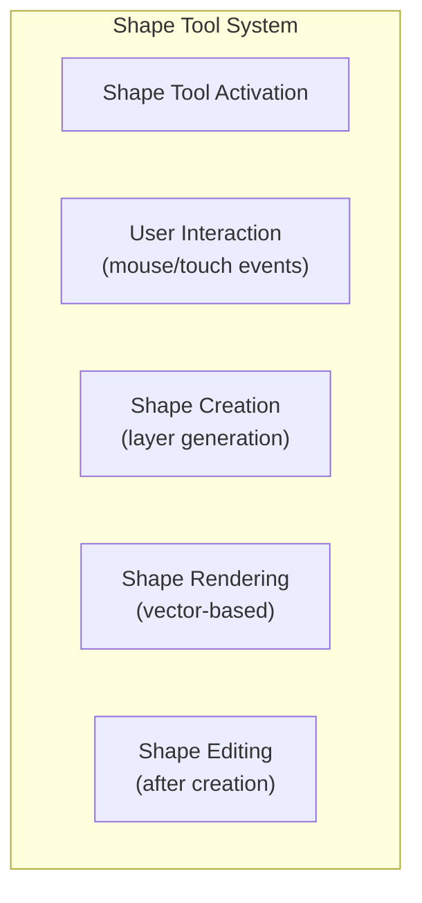
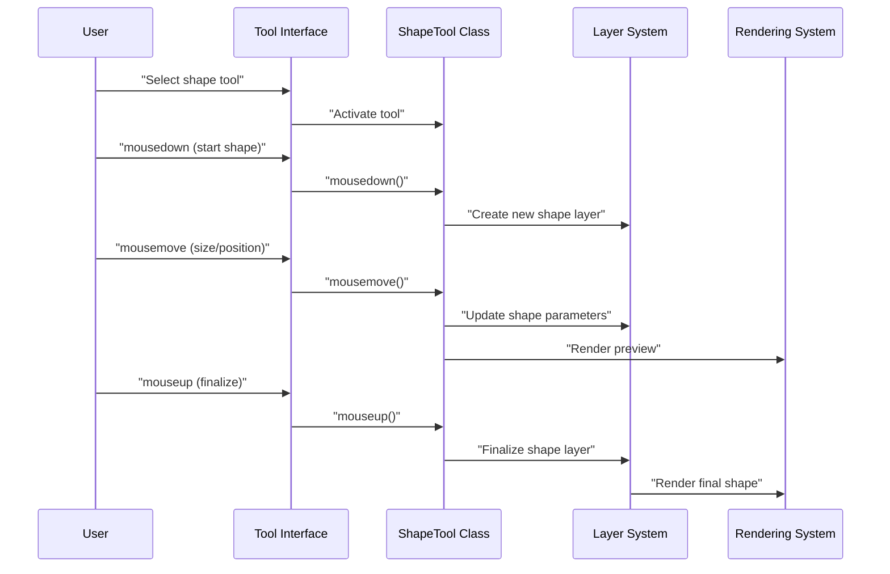
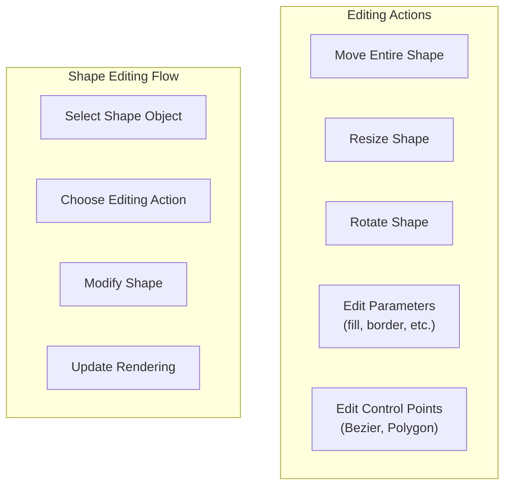

# Shape Tools

> **Relevant source files**
> * [images/test-collection.json](https://github.com/viliusle/miniPaint/blob/6d0b95e5/images/test-collection.json)
> * [src/js/config.js](https://github.com/viliusle/miniPaint/blob/6d0b95e5/src/js/config.js)
> * [src/js/tools/shapes/bezier_curve.js](https://github.com/viliusle/miniPaint/blob/6d0b95e5/src/js/tools/shapes/bezier_curve.js)
> * [src/js/tools/shapes/hexagon.js](https://github.com/viliusle/miniPaint/blob/6d0b95e5/src/js/tools/shapes/hexagon.js)
> * [src/js/tools/shapes/pentagon.js](https://github.com/viliusle/miniPaint/blob/6d0b95e5/src/js/tools/shapes/pentagon.js)
> * [src/js/tools/shapes/plus.js](https://github.com/viliusle/miniPaint/blob/6d0b95e5/src/js/tools/shapes/plus.js)
> * [src/js/tools/shapes/polygon.js](https://github.com/viliusle/miniPaint/blob/6d0b95e5/src/js/tools/shapes/polygon.js)
> * [src/js/tools/shapes/star.js](https://github.com/viliusle/miniPaint/blob/6d0b95e5/src/js/tools/shapes/star.js)

This document describes the shape tools system in miniPaint, which provides various vector-based drawing capabilities. The shape tools allow users to create geometric shapes, curves, and complex figures that can be styled, resized, and manipulated after creation. For information about drawing tools like brush and pencil, see [Drawing Tools](/viliusle/miniPaint/4.1-drawing-tools). For selection tools, see [Selection Tools](/viliusle/miniPaint/4.2-selection-tools).

## Overview

Shape tools in miniPaint include a wide variety of geometric forms from basic shapes like rectangles and circles to more complex shapes like stars, polygons, and Bezier curves. All shape tools inherit from the base tool framework and follow a common implementation pattern while providing shape-specific rendering and interaction behavior.



Sources: [src/js/config.js L142-L147](https://github.com/viliusle/miniPaint/blob/6d0b95e5/src/js/config.js#L142-L147)

 [src/js/tools/shapes/bezier_curve.js L7-L25](https://github.com/viliusle/miniPaint/blob/6d0b95e5/src/js/tools/shapes/bezier_curve.js#L7-L25)

 [src/js/tools/shapes/polygon.js L7-L25](https://github.com/viliusle/miniPaint/blob/6d0b95e5/src/js/tools/shapes/polygon.js#L7-L25)

## Shape Tool Architecture

The shape tools system is built on a class hierarchy where all shape tools extend the `Base_tools_class`. This provides common functionality like event handling, parameter management, and integration with the layer system.

```sql
#mermaid-bw0yvegvd9s{font-family:ui-sans-serif,-apple-system,system-ui,Segoe UI,Helvetica;font-size:16px;fill:#333;}@keyframes edge-animation-frame{from{stroke-dashoffset:0;}}@keyframes dash{to{stroke-dashoffset:0;}}#mermaid-bw0yvegvd9s .edge-animation-slow{stroke-dasharray:9,5!important;stroke-dashoffset:900;animation:dash 50s linear infinite;stroke-linecap:round;}#mermaid-bw0yvegvd9s .edge-animation-fast{stroke-dasharray:9,5!important;stroke-dashoffset:900;animation:dash 20s linear infinite;stroke-linecap:round;}#mermaid-bw0yvegvd9s .error-icon{fill:#dddddd;}#mermaid-bw0yvegvd9s .error-text{fill:#222222;stroke:#222222;}#mermaid-bw0yvegvd9s .edge-thickness-normal{stroke-width:1px;}#mermaid-bw0yvegvd9s .edge-thickness-thick{stroke-width:3.5px;}#mermaid-bw0yvegvd9s .edge-pattern-solid{stroke-dasharray:0;}#mermaid-bw0yvegvd9s .edge-thickness-invisible{stroke-width:0;fill:none;}#mermaid-bw0yvegvd9s .edge-pattern-dashed{stroke-dasharray:3;}#mermaid-bw0yvegvd9s .edge-pattern-dotted{stroke-dasharray:2;}#mermaid-bw0yvegvd9s .marker{fill:#999;stroke:#999;}#mermaid-bw0yvegvd9s .marker.cross{stroke:#999;}#mermaid-bw0yvegvd9s svg{font-family:ui-sans-serif,-apple-system,system-ui,Segoe UI,Helvetica;font-size:16px;}#mermaid-bw0yvegvd9s p{margin:0;}#mermaid-bw0yvegvd9s g.classGroup text{fill:#dddddd;stroke:none;font-family:ui-sans-serif,-apple-system,system-ui,Segoe UI,Helvetica;font-size:10px;}#mermaid-bw0yvegvd9s g.classGroup text .title{font-weight:bolder;}#mermaid-bw0yvegvd9s .cluster-label text{fill:#444;}#mermaid-bw0yvegvd9s .cluster-label span{color:#444;}#mermaid-bw0yvegvd9s .cluster-label span p{background-color:transparent;}#mermaid-bw0yvegvd9s .cluster rect{fill:#f8f8f8;stroke:#dddddd;stroke-width:1px;}#mermaid-bw0yvegvd9s .cluster text{fill:#444;}#mermaid-bw0yvegvd9s .cluster span{color:#444;}#mermaid-bw0yvegvd9s .nodeLabel,#mermaid-bw0yvegvd9s .edgeLabel{color:#333333;}#mermaid-bw0yvegvd9s .noteLabel .nodeLabel,#mermaid-bw0yvegvd9s .noteLabel .edgeLabel{color:#333;}#mermaid-bw0yvegvd9s .edgeLabel .label rect{fill:#ffffff;}#mermaid-bw0yvegvd9s .label text{fill:#333333;}#mermaid-bw0yvegvd9s .labelBkg{background:#ffffff;}#mermaid-bw0yvegvd9s .edgeLabel .label span{background:#ffffff;}#mermaid-bw0yvegvd9s .classTitle{font-weight:bolder;}#mermaid-bw0yvegvd9s .node rect,#mermaid-bw0yvegvd9s .node circle,#mermaid-bw0yvegvd9s .node ellipse,#mermaid-bw0yvegvd9s .node polygon,#mermaid-bw0yvegvd9s .node path{fill:#ffffff;stroke:#dddddd;stroke-width:1;}#mermaid-bw0yvegvd9s .divider{stroke:#dddddd;stroke-width:1;}#mermaid-bw0yvegvd9s g.clickable{cursor:pointer;}#mermaid-bw0yvegvd9s g.classGroup rect{fill:#ffffff;stroke:#dddddd;}#mermaid-bw0yvegvd9s g.classGroup line{stroke:#dddddd;stroke-width:1;}#mermaid-bw0yvegvd9s .classLabel .box{stroke:none;stroke-width:0;fill:#ffffff;opacity:0.5;}#mermaid-bw0yvegvd9s .classLabel .label{fill:#dddddd;font-size:10px;}#mermaid-bw0yvegvd9s .relation{stroke:#999;stroke-width:1;fill:none;}#mermaid-bw0yvegvd9s .dashed-line{stroke-dasharray:3;}#mermaid-bw0yvegvd9s .dotted-line{stroke-dasharray:1 2;}#mermaid-bw0yvegvd9s [id$="-compositionStart"],#mermaid-bw0yvegvd9s .composition{fill:#999!important;stroke:#999!important;stroke-width:1;}#mermaid-bw0yvegvd9s [id$="-compositionEnd"],#mermaid-bw0yvegvd9s .composition{fill:#999!important;stroke:#999!important;stroke-width:1;}#mermaid-bw0yvegvd9s [id$="-dependencyStart"],#mermaid-bw0yvegvd9s .dependency{fill:#999!important;stroke:#999!important;stroke-width:1;}#mermaid-bw0yvegvd9s [id$="-dependencyEnd"],#mermaid-bw0yvegvd9s .dependency{fill:#999!important;stroke:#999!important;stroke-width:1;}#mermaid-bw0yvegvd9s [id$="-extensionStart"],#mermaid-bw0yvegvd9s .extension{fill:transparent!important;stroke:#999!important;stroke-width:1;}#mermaid-bw0yvegvd9s [id$="-extensionEnd"],#mermaid-bw0yvegvd9s .extension{fill:transparent!important;stroke:#999!important;stroke-width:1;}#mermaid-bw0yvegvd9s [id$="-aggregationStart"],#mermaid-bw0yvegvd9s .aggregation{fill:transparent!important;stroke:#999!important;stroke-width:1;}#mermaid-bw0yvegvd9s [id$="-aggregationEnd"],#mermaid-bw0yvegvd9s .aggregation{fill:transparent!important;stroke:#999!important;stroke-width:1;}#mermaid-bw0yvegvd9s [id$="-lollipopStart"],#mermaid-bw0yvegvd9s .lollipop{fill:#ffffff!important;stroke:#999!important;stroke-width:1;}#mermaid-bw0yvegvd9s [id$="-lollipopEnd"],#mermaid-bw0yvegvd9s .lollipop{fill:#ffffff!important;stroke:#999!important;stroke-width:1;}#mermaid-bw0yvegvd9s .edgeTerminals{font-size:11px;line-height:initial;}#mermaid-bw0yvegvd9s .classTitleText{text-anchor:middle;font-size:18px;fill:#333;}#mermaid-bw0yvegvd9s .edgeLabel[data-look="neo"]{background-color:#ffffff;text-align:center;}#mermaid-bw0yvegvd9s .edgeLabel[data-look="neo"] p{background-color:#ffffff;}#mermaid-bw0yvegvd9s .edgeLabel[data-look="neo"] rect{opacity:0.5;background-color:#ffffff;fill:#ffffff;}#mermaid-bw0yvegvd9s .label-icon{display:inline-block;height:1em;overflow:visible;vertical-align:-0.125em;}#mermaid-bw0yvegvd9s .node .label-icon path{fill:currentColor;stroke:revert;stroke-width:revert;}#mermaid-bw0yvegvd9s .node .neo-node{stroke:#dddddd;}#mermaid-bw0yvegvd9s [data-look="neo"].node rect,#mermaid-bw0yvegvd9s [data-look="neo"].cluster rect,#mermaid-bw0yvegvd9s [data-look="neo"].node polygon{stroke:url(#mermaid-bw0yvegvd9s-gradient);filter:drop-shadow( 1px 2px 2px rgba(185,185,185,1));}#mermaid-bw0yvegvd9s [data-look="neo"].node path{stroke:url(#mermaid-bw0yvegvd9s-gradient);stroke-width:1px;}#mermaid-bw0yvegvd9s [data-look="neo"].node .outer-path{filter:drop-shadow( 1px 2px 2px rgba(185,185,185,1));}#mermaid-bw0yvegvd9s [data-look="neo"].node .neo-line path{stroke:#dddddd;filter:none;}#mermaid-bw0yvegvd9s [data-look="neo"].node circle{stroke:url(#mermaid-bw0yvegvd9s-gradient);filter:drop-shadow( 1px 2px 2px rgba(185,185,185,1));}#mermaid-bw0yvegvd9s [data-look="neo"].node circle .state-start{fill:#000000;}#mermaid-bw0yvegvd9s [data-look="neo"].icon-shape .icon{fill:url(#mermaid-bw0yvegvd9s-gradient);filter:drop-shadow( 1px 2px 2px rgba(185,185,185,1));}#mermaid-bw0yvegvd9s [data-look="neo"].icon-shape .icon-neo path{stroke:url(#mermaid-bw0yvegvd9s-gradient);filter:drop-shadow( 1px 2px 2px rgba(185,185,185,1));}#mermaid-bw0yvegvd9s :root{--mermaid-font-family:"trebuchet ms",verdana,arial,sans-serif;}Base_tools_class+load()+mousedown()+mousemove()+mouseup()+render()Shape_tools+shape_mousedown()+shape_mousemove()+shape_mouseup()+draw_shape()BasicShapesComplexShapesSpecializedShapesRectangle_classEllipse_classTriangle_classPolygon_class+mousedown()+mousemove()+mouseup()+draw_polygon()Bezier_Curve_class+mousedown()+mousemove()+mouseup()+draw_bezier()Star_classHeart_classCog_classHuman_class
```

Sources: [src/js/tools/shapes/bezier_curve.js L7-L40](https://github.com/viliusle/miniPaint/blob/6d0b95e5/src/js/tools/shapes/bezier_curve.js#L7-L40)

 [src/js/tools/shapes/polygon.js L7-L63](https://github.com/viliusle/miniPaint/blob/6d0b95e5/src/js/tools/shapes/polygon.js#L7-L63)

 [src/js/tools/shapes/star.js L6-L25](https://github.com/viliusle/miniPaint/blob/6d0b95e5/src/js/tools/shapes/star.js#L6-L25)

 [src/js/tools/shapes/hexagon.js L6-L27](https://github.com/viliusle/miniPaint/blob/6d0b95e5/src/js/tools/shapes/hexagon.js#L6-L27)

## Shape Tool Types

miniPaint includes a wide variety of shapes that can be categorized into several groups:

### Basic Shapes

* Rectangle (with optional rounded corners)
* Ellipse (circle when constrained)
* Triangle
* Line
* Arrow

### Geometric Shapes

* Right Triangle
* Rhombus
* Parallelogram
* Trapezoid
* Pentagon
* Hexagon
* Star

### Complex Shapes

* Bezier Curve
* Polygon (freeform)

### Specialized Shapes

* Heart
* Cylinder
* Human
* Tear
* Cog
* Moon
* Callout
* Plus Sign

Each shape is registered in the configuration system with its default parameters and rendering functions.

Sources: [src/js/config.js L151-L379](https://github.com/viliusle/miniPaint/blob/6d0b95e5/src/js/config.js#L151-L379)

## Shape Creation Process

Creating a shape in miniPaint follows a consistent process regardless of the specific shape type:



The implementation details of this process include:

1. **Tool Selection**: User selects a shape tool from the tools panel
2. **Initial Point**: User clicks to establish the starting point (mousedown event)
3. **Sizing/Positioning**: User drags to set the size and position (mousemove events)
4. **Finalization**: User releases the mouse button to complete the shape (mouseup event)
5. **Layer Creation**: A new vector layer is created with the shape data and parameters

For some shapes like the Polygon and Bezier Curve, the creation process involves multiple clicks to define points.

Sources: [src/js/tools/shapes/bezier_curve.js L67-L227](https://github.com/viliusle/miniPaint/blob/6d0b95e5/src/js/tools/shapes/bezier_curve.js#L67-L227)

 [src/js/tools/shapes/polygon.js L65-L178](https://github.com/viliusle/miniPaint/blob/6d0b95e5/src/js/tools/shapes/polygon.js#L65-L178)

## Shape Parameters and Styling

Shapes in miniPaint can be customized with various parameters:

| Parameter | Description | Applicable Shapes |
| --- | --- | --- |
| `border` | Toggle for shape outline | All shapes |
| `border_size` | Thickness of outline | All shapes |
| `border_color` | Color of outline | All shapes |
| `fill` | Toggle for shape fill | All shapes |
| `fill_color` | Color of fill | All shapes |
| `radius` | Corner radius | Rectangle |
| `square` | Force square aspect | Rectangle |
| `circle` | Force circle aspect | Ellipse |
| `corners` | Number of corners | Star |
| `inner_radius` | Inner radius % | Star |
| `size` | Line thickness | Line, Arrow, Bezier |

These parameters are defined in the configuration and can be adjusted through the tool options interface.

Sources: [src/js/config.js L165-L379](https://github.com/viliusle/miniPaint/blob/6d0b95e5/src/js/config.js#L165-L379)

## Implementation Details

### Shape Tool Base Functionality

All shape tools inherit from `Base_tools_class` and implement several key methods:

* `load()`: Initializes the tool and sets up event listeners
* `mousedown()`: Handles the initial click to start creating a shape
* `mousemove()`: Updates the shape during dragging
* `mouseup()`: Finalizes the shape when the user releases the mouse
* `render()`: Draws the shape with the current parameters
* `demo()`: Creates a preview of the shape for the tools panel

Additionally, shape tools implement:

* `draw_shape()` or similar shape-specific rendering methods
* `render_overlay()`: Draws selection handles and editing UI
* `selected_object_actions()`: Handles interactions with existing shapes

Sources: [src/js/tools/shapes/bezier_curve.js L27-L478](https://github.com/viliusle/miniPaint/blob/6d0b95e5/src/js/tools/shapes/bezier_curve.js#L27-L478)

 [src/js/tools/shapes/polygon.js L27-L365](https://github.com/viliusle/miniPaint/blob/6d0b95e5/src/js/tools/shapes/polygon.js#L27-L365)

### Creating Shape Layers

When a shape is created, it's stored as a layer with the following properties:

* `type`: The shape type (rectangle, ellipse, etc.)
* `data`: Shape-specific coordinates and dimensions
* `params`: Style parameters (fill, border, colors, etc.)
* `render_function`: Reference to the rendering function
* `is_vector`: Set to true (indicating vector data)
* `x`, `y`, `width`, `height`: Position and dimensions
* `rotate`: Rotation angle (if applicable)

For example, a Bezier curve layer stores control points in its data structure:

```
{  type: 'bezier_curve',  data: {    start: {x: x1, y: y1},    cp1: {x: x2, y: y2},    cp2: {x: x3, y: y3},    end: {x: x4, y: y4}  },  params: {...},  // other properties}
```

Sources: [src/js/tools/shapes/bezier_curve.js L94-L118](https://github.com/viliusle/miniPaint/blob/6d0b95e5/src/js/tools/shapes/bezier_curve.js#L94-L118)

 [src/js/tools/shapes/polygon.js L90-L113](https://github.com/viliusle/miniPaint/blob/6d0b95e5/src/js/tools/shapes/polygon.js#L90-L113)

### Shape Coordinates and Rendering

Different shapes use different coordinate systems to define their geometry:

* **Simple shapes** (Rectangle, Ellipse): Use x, y, width, height
* **Polygon**: Stores an array of point coordinates
* **Bezier curve**: Stores start, end, and control points
* **Predefined shapes** (Star, Hexagon): Use mathematical formulas to generate coordinates

For example, the Hexagon class uses predefined coordinates in a 100x100 coordinate space that are scaled to the actual shape dimensions:

```
this.coords = [  [75, 6.698729810778069],  [100, 50],  [75, 93.30127018922192],  [24.99999999999999, 93.30127018922192],  [0, 50.00000000000001],  [24.99999999999998, 6.698729810778076],  [75, 6.698729810778069],  [75, 6.698729810778069],];
```

The Star class dynamically generates its coordinates based on parameters:

```
generate_coords(spikes, innerRadius) {  // Mathematical calculation of star points  // ...}
```

Sources: [src/js/tools/shapes/star.js L40-L79](https://github.com/viliusle/miniPaint/blob/6d0b95e5/src/js/tools/shapes/star.js#L40-L79)

 [src/js/tools/shapes/hexagon.js L16-L25](https://github.com/viliusle/miniPaint/blob/6d0b95e5/src/js/tools/shapes/hexagon.js#L16-L25)

## Editing Shape Objects

After creation, shapes can be edited in the following ways:

1. **Selection**: Using the select tool to choose a shape
2. **Moving**: Dragging the shape to a new position
3. **Resizing**: Using corner handles to change dimensions
4. **Rotating**: Using rotation handle
5. **Parameter Editing**: Changing fill, border, etc. in the properties panel
6. **Point Editing** (for Bezier, Polygon): Manipulating individual control points

For shapes like Bezier curves and polygons, individual control points can be selected and moved:



Sources: [src/js/tools/shapes/bezier_curve.js L329-L478](https://github.com/viliusle/miniPaint/blob/6d0b95e5/src/js/tools/shapes/bezier_curve.js#L329-L478)

 [src/js/tools/shapes/polygon.js L275-L365](https://github.com/viliusle/miniPaint/blob/6d0b95e5/src/js/tools/shapes/polygon.js#L275-L365)

## Shape Tool Integration with Core Systems

Shape tools integrate with several core systems in miniPaint:

1. **Layer System**: Shapes are stored as layers with specific properties
2. **Action System**: Shape operations use the Action system for undo/redo
3. **Rendering System**: Shapes are rendered using canvas drawing operations
4. **GUI System**: Tool parameters are displayed in the options panel
5. **Selection System**: Shapes can be selected and manipulated

When a shape is created or edited, it triggers actions that update the application state:

```
app.State.do_action(  new app.Actions.Bundle_action('new_bezier_layer', 'New Bezier Layer', [    new app.Actions.Insert_layer_action(this.layer)  ]));
```

Sources: [src/js/tools/shapes/bezier_curve.js L114-L118](https://github.com/viliusle/miniPaint/blob/6d0b95e5/src/js/tools/shapes/bezier_curve.js#L114-L118)

 [src/js/tools/shapes/polygon.js L107-L111](https://github.com/viliusle/miniPaint/blob/6d0b95e5/src/js/tools/shapes/polygon.js#L107-L111)

## Conclusion

The Shape Tools system in miniPaint provides a comprehensive set of vector shape creation and editing capabilities. Each shape tool extends the base tool framework while implementing shape-specific behavior. The system integrates with the layer, action, and rendering systems to provide a flexible and powerful shape creation experience.