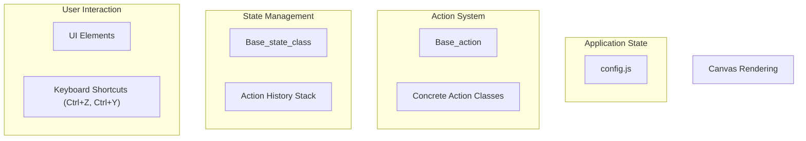
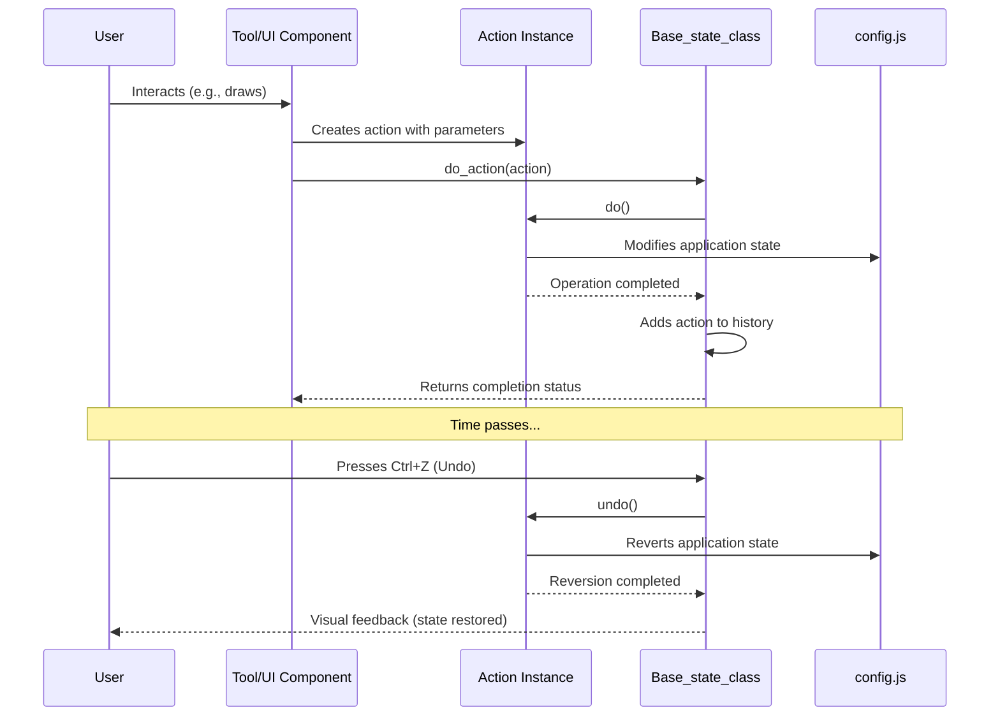
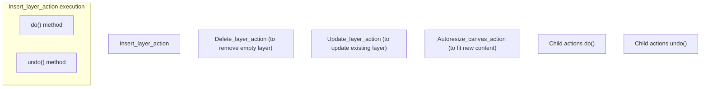

# State Management

> **Relevant source files**
> * [src/js/actions/autoresize-canvas.js](https://github.com/viliusle/miniPaint/blob/6d0b95e5/src/js/actions/autoresize-canvas.js)
> * [src/js/actions/index.js](https://github.com/viliusle/miniPaint/blob/6d0b95e5/src/js/actions/index.js)
> * [src/js/actions/init-canvas-zoom.js](https://github.com/viliusle/miniPaint/blob/6d0b95e5/src/js/actions/init-canvas-zoom.js)
> * [src/js/actions/insert-layer.js](https://github.com/viliusle/miniPaint/blob/6d0b95e5/src/js/actions/insert-layer.js)
> * [src/js/actions/prepare-canvas.js](https://github.com/viliusle/miniPaint/blob/6d0b95e5/src/js/actions/prepare-canvas.js)
> * [src/js/actions/reset-selection.js](https://github.com/viliusle/miniPaint/blob/6d0b95e5/src/js/actions/reset-selection.js)
> * [src/js/actions/select-layer.js](https://github.com/viliusle/miniPaint/blob/6d0b95e5/src/js/actions/select-layer.js)
> * [src/js/actions/select-next-layer.js](https://github.com/viliusle/miniPaint/blob/6d0b95e5/src/js/actions/select-next-layer.js)
> * [src/js/actions/select-previous-layer.js](https://github.com/viliusle/miniPaint/blob/6d0b95e5/src/js/actions/select-previous-layer.js)
> * [src/js/actions/set-selection.js](https://github.com/viliusle/miniPaint/blob/6d0b95e5/src/js/actions/set-selection.js)
> * [src/js/actions/stop-animation.js](https://github.com/viliusle/miniPaint/blob/6d0b95e5/src/js/actions/stop-animation.js)
> * [src/js/actions/toggle-layer-visibility.js](https://github.com/viliusle/miniPaint/blob/6d0b95e5/src/js/actions/toggle-layer-visibility.js)
> * [src/js/actions/update-layer.js](https://github.com/viliusle/miniPaint/blob/6d0b95e5/src/js/actions/update-layer.js)
> * [src/js/core/base-state.js](https://github.com/viliusle/miniPaint/blob/6d0b95e5/src/js/core/base-state.js)

## Purpose and Scope

The State Management system in miniPaint provides an action-based architecture that enables operations like undo/redo throughout the application. This page explains how the state management system works, the structure of actions, and how to use them to make application changes that can be undone and redone.

For information about the configuration system that holds the application state, see [Configuration System](/viliusle/miniPaint/2.2-configuration-system).

## Overview

miniPaint uses an action-based state management approach where all meaningful state changes are performed through action objects. These actions know how to perform a change (`do()`) and how to reverse it (`undo()`). The state management system tracks these actions in a history stack, enabling undo/redo functionality.

### State Management Architecture



Sources: [src/js/core/base-state.js L1-L222](https://github.com/viliusle/miniPaint/blob/6d0b95e5/src/js/core/base-state.js#L1-L222)

## The Base State Class

The central component of the state management system is the `Base_state_class`, which is implemented as a singleton class that handles:

1. Tracking action history
2. Executing actions (do)
3. Undoing actions
4. Redoing actions
5. Managing memory usage

### Key State Manager Methods

| Method | Purpose |
| --- | --- |
| `do_action(action, options)` | Performs an action and adds it to history |
| `undo_action()` | Undoes the most recent action in history |
| `redo_action()` | Redoes a previously undone action |
| `free(memory_size, database_size)` | Frees action history to reclaim memory |

The state manager listens for keyboard shortcuts (Ctrl+Z and Ctrl+Y) to trigger undo and redo operations.

```javascript
// Keyboard event handling in Base_state_classdocument.addEventListener('keydown', (event) => {    const key = (event.key || '').toLowerCase();    if (this.Helper.is_input(event.target))        return;     if (key == "z" && (event.ctrlKey == true || event.metaKey)) {        // Undo        this.undo();        event.preventDefault();    }    if (key == "y" && (event.ctrlKey == true || event.metaKey)) {        // Redo        this.redo();        event.preventDefault();    }}, false);
```

Sources: [src/js/core/base-state.js L41-L57](https://github.com/viliusle/miniPaint/blob/6d0b95e5/src/js/core/base-state.js#L41-L57)

 [src/js/core/base-state.js L60-L118](https://github.com/viliusle/miniPaint/blob/6d0b95e5/src/js/core/base-state.js#L60-L118)

 [src/js/core/base-state.js L138-L145](https://github.com/viliusle/miniPaint/blob/6d0b95e5/src/js/core/base-state.js#L138-L145)

 [src/js/core/base-state.js L127-L136](https://github.com/viliusle/miniPaint/blob/6d0b95e5/src/js/core/base-state.js#L127-L136)

## Action System

The action system consists of a base action class and many specialized action implementations. Each action class is responsible for a specific type of state change and knows how to perform and reverse that change.

### Action Class Hierarchy

```sql
#mermaid-4thzw64mc75{font-family:ui-sans-serif,-apple-system,system-ui,Segoe UI,Helvetica;font-size:16px;fill:#333;}@keyframes edge-animation-frame{from{stroke-dashoffset:0;}}@keyframes dash{to{stroke-dashoffset:0;}}#mermaid-4thzw64mc75 .edge-animation-slow{stroke-dasharray:9,5!important;stroke-dashoffset:900;animation:dash 50s linear infinite;stroke-linecap:round;}#mermaid-4thzw64mc75 .edge-animation-fast{stroke-dasharray:9,5!important;stroke-dashoffset:900;animation:dash 20s linear infinite;stroke-linecap:round;}#mermaid-4thzw64mc75 .error-icon{fill:#dddddd;}#mermaid-4thzw64mc75 .error-text{fill:#222222;stroke:#222222;}#mermaid-4thzw64mc75 .edge-thickness-normal{stroke-width:1px;}#mermaid-4thzw64mc75 .edge-thickness-thick{stroke-width:3.5px;}#mermaid-4thzw64mc75 .edge-pattern-solid{stroke-dasharray:0;}#mermaid-4thzw64mc75 .edge-thickness-invisible{stroke-width:0;fill:none;}#mermaid-4thzw64mc75 .edge-pattern-dashed{stroke-dasharray:3;}#mermaid-4thzw64mc75 .edge-pattern-dotted{stroke-dasharray:2;}#mermaid-4thzw64mc75 .marker{fill:#999;stroke:#999;}#mermaid-4thzw64mc75 .marker.cross{stroke:#999;}#mermaid-4thzw64mc75 svg{font-family:ui-sans-serif,-apple-system,system-ui,Segoe UI,Helvetica;font-size:16px;}#mermaid-4thzw64mc75 p{margin:0;}#mermaid-4thzw64mc75 g.classGroup text{fill:#dddddd;stroke:none;font-family:ui-sans-serif,-apple-system,system-ui,Segoe UI,Helvetica;font-size:10px;}#mermaid-4thzw64mc75 g.classGroup text .title{font-weight:bolder;}#mermaid-4thzw64mc75 .cluster-label text{fill:#444;}#mermaid-4thzw64mc75 .cluster-label span{color:#444;}#mermaid-4thzw64mc75 .cluster-label span p{background-color:transparent;}#mermaid-4thzw64mc75 .cluster rect{fill:#f8f8f8;stroke:#dddddd;stroke-width:1px;}#mermaid-4thzw64mc75 .cluster text{fill:#444;}#mermaid-4thzw64mc75 .cluster span{color:#444;}#mermaid-4thzw64mc75 .nodeLabel,#mermaid-4thzw64mc75 .edgeLabel{color:#333333;}#mermaid-4thzw64mc75 .noteLabel .nodeLabel,#mermaid-4thzw64mc75 .noteLabel .edgeLabel{color:#333;}#mermaid-4thzw64mc75 .edgeLabel .label rect{fill:#ffffff;}#mermaid-4thzw64mc75 .label text{fill:#333333;}#mermaid-4thzw64mc75 .labelBkg{background:#ffffff;}#mermaid-4thzw64mc75 .edgeLabel .label span{background:#ffffff;}#mermaid-4thzw64mc75 .classTitle{font-weight:bolder;}#mermaid-4thzw64mc75 .node rect,#mermaid-4thzw64mc75 .node circle,#mermaid-4thzw64mc75 .node ellipse,#mermaid-4thzw64mc75 .node polygon,#mermaid-4thzw64mc75 .node path{fill:#ffffff;stroke:#dddddd;stroke-width:1;}#mermaid-4thzw64mc75 .divider{stroke:#dddddd;stroke-width:1;}#mermaid-4thzw64mc75 g.clickable{cursor:pointer;}#mermaid-4thzw64mc75 g.classGroup rect{fill:#ffffff;stroke:#dddddd;}#mermaid-4thzw64mc75 g.classGroup line{stroke:#dddddd;stroke-width:1;}#mermaid-4thzw64mc75 .classLabel .box{stroke:none;stroke-width:0;fill:#ffffff;opacity:0.5;}#mermaid-4thzw64mc75 .classLabel .label{fill:#dddddd;font-size:10px;}#mermaid-4thzw64mc75 .relation{stroke:#999;stroke-width:1;fill:none;}#mermaid-4thzw64mc75 .dashed-line{stroke-dasharray:3;}#mermaid-4thzw64mc75 .dotted-line{stroke-dasharray:1 2;}#mermaid-4thzw64mc75 [id$="-compositionStart"],#mermaid-4thzw64mc75 .composition{fill:#999!important;stroke:#999!important;stroke-width:1;}#mermaid-4thzw64mc75 [id$="-compositionEnd"],#mermaid-4thzw64mc75 .composition{fill:#999!important;stroke:#999!important;stroke-width:1;}#mermaid-4thzw64mc75 [id$="-dependencyStart"],#mermaid-4thzw64mc75 .dependency{fill:#999!important;stroke:#999!important;stroke-width:1;}#mermaid-4thzw64mc75 [id$="-dependencyEnd"],#mermaid-4thzw64mc75 .dependency{fill:#999!important;stroke:#999!important;stroke-width:1;}#mermaid-4thzw64mc75 [id$="-extensionStart"],#mermaid-4thzw64mc75 .extension{fill:transparent!important;stroke:#999!important;stroke-width:1;}#mermaid-4thzw64mc75 [id$="-extensionEnd"],#mermaid-4thzw64mc75 .extension{fill:transparent!important;stroke:#999!important;stroke-width:1;}#mermaid-4thzw64mc75 [id$="-aggregationStart"],#mermaid-4thzw64mc75 .aggregation{fill:transparent!important;stroke:#999!important;stroke-width:1;}#mermaid-4thzw64mc75 [id$="-aggregationEnd"],#mermaid-4thzw64mc75 .aggregation{fill:transparent!important;stroke:#999!important;stroke-width:1;}#mermaid-4thzw64mc75 [id$="-lollipopStart"],#mermaid-4thzw64mc75 .lollipop{fill:#ffffff!important;stroke:#999!important;stroke-width:1;}#mermaid-4thzw64mc75 [id$="-lollipopEnd"],#mermaid-4thzw64mc75 .lollipop{fill:#ffffff!important;stroke:#999!important;stroke-width:1;}#mermaid-4thzw64mc75 .edgeTerminals{font-size:11px;line-height:initial;}#mermaid-4thzw64mc75 .classTitleText{text-anchor:middle;font-size:18px;fill:#333;}#mermaid-4thzw64mc75 .edgeLabel[data-look="neo"]{background-color:#ffffff;text-align:center;}#mermaid-4thzw64mc75 .edgeLabel[data-look="neo"] p{background-color:#ffffff;}#mermaid-4thzw64mc75 .edgeLabel[data-look="neo"] rect{opacity:0.5;background-color:#ffffff;fill:#ffffff;}#mermaid-4thzw64mc75 .label-icon{display:inline-block;height:1em;overflow:visible;vertical-align:-0.125em;}#mermaid-4thzw64mc75 .node .label-icon path{fill:currentColor;stroke:revert;stroke-width:revert;}#mermaid-4thzw64mc75 .node .neo-node{stroke:#dddddd;}#mermaid-4thzw64mc75 [data-look="neo"].node rect,#mermaid-4thzw64mc75 [data-look="neo"].cluster rect,#mermaid-4thzw64mc75 [data-look="neo"].node polygon{stroke:url(#mermaid-4thzw64mc75-gradient);filter:drop-shadow( 1px 2px 2px rgba(185,185,185,1));}#mermaid-4thzw64mc75 [data-look="neo"].node path{stroke:url(#mermaid-4thzw64mc75-gradient);stroke-width:1px;}#mermaid-4thzw64mc75 [data-look="neo"].node .outer-path{filter:drop-shadow( 1px 2px 2px rgba(185,185,185,1));}#mermaid-4thzw64mc75 [data-look="neo"].node .neo-line path{stroke:#dddddd;filter:none;}#mermaid-4thzw64mc75 [data-look="neo"].node circle{stroke:url(#mermaid-4thzw64mc75-gradient);filter:drop-shadow( 1px 2px 2px rgba(185,185,185,1));}#mermaid-4thzw64mc75 [data-look="neo"].node circle .state-start{fill:#000000;}#mermaid-4thzw64mc75 [data-look="neo"].icon-shape .icon{fill:url(#mermaid-4thzw64mc75-gradient);filter:drop-shadow( 1px 2px 2px rgba(185,185,185,1));}#mermaid-4thzw64mc75 [data-look="neo"].icon-shape .icon-neo path{stroke:url(#mermaid-4thzw64mc75-gradient);filter:drop-shadow( 1px 2px 2px rgba(185,185,185,1));}#mermaid-4thzw64mc75 :root{--mermaid-font-family:"trebuchet ms",verdana,arial,sans-serif;}Base_action+action_id: string+action_description: string+do()+undo()+free()Insert_layer_action+settings: object+previous_auto_increment: number+do()+undo()+free()Update_layer_action+layer_id: number+settings: object+old_settings: object+do()+undo()+free()Delete_layer_actionSet_selection_actionReset_selection_actionBundle_action+actions: array+do()+undo()+free()
```

Sources: [src/js/actions/index.js L1-L26](https://github.com/viliusle/miniPaint/blob/6d0b95e5/src/js/actions/index.js#L1-L26)

 [src/js/actions/insert-layer.js L6-L214](https://github.com/viliusle/miniPaint/blob/6d0b95e5/src/js/actions/insert-layer.js#L6-L214)

 [src/js/actions/update-layer.js L5-L67](https://github.com/viliusle/miniPaint/blob/6d0b95e5/src/js/actions/update-layer.js#L5-L67)

## Action Lifecycle

Every action in miniPaint follows a standard lifecycle from creation to execution:



Sources: [src/js/core/base-state.js L60-L118](https://github.com/viliusle/miniPaint/blob/6d0b95e5/src/js/core/base-state.js#L60-L118)

 [src/js/core/base-state.js L138-L145](https://github.com/viliusle/miniPaint/blob/6d0b95e5/src/js/core/base-state.js#L138-L145)

### Executing Actions

Actions are performed using the `do_action()` method of the state manager:

```javascript
// Example usage of do_actionasync function exampleFunction() {    const action = new app.Actions.Insert_layer_action({        name: 'New Layer',        type: 'image'    });        const result = await app.State.do_action(action);    if (result.status === 'aborted') {        console.log('Action was aborted:', result.reason);    }}
```

The `do_action()` method:

1. Calls the action's `do()` method
2. Removes any redo actions if this is a new action (not a redo)
3. Adds the action to history
4. Manages memory if needed

Sources: [src/js/core/base-state.js L60-L118](https://github.com/viliusle/miniPaint/blob/6d0b95e5/src/js/core/base-state.js#L60-L118)

## Creating Actions

Each action in miniPaint must implement three key methods:

| Method | Purpose |
| --- | --- |
| `do()` | Performs the action and records state for undo |
| `undo()` | Reverses the action using previously recorded state |
| `free()` | Cleans up resources when action is no longer needed in history |

Actions should always call their parent method using `super.do()` or `super.undo()` at the beginning of their implementation.

### Example Action Implementation

The following is a simplified view of the `Update_layer_action`:

```javascript
export class Update_layer_action extends Base_action {    constructor(layer_id, settings) {        super('update_layer', 'Update Layer');        this.layer_id = layer_id;        this.settings = settings;        this.reference_layer = null;        this.old_settings = {};    }     async do() {        super.do();        this.reference_layer = app.Layers.get_layer(this.layer_id);        // Store old values for undo        for (let i in this.settings) {            if (i == 'id' || i == 'order') continue;            this.old_settings[i] = this.reference_layer[i];            // Apply new values            this.reference_layer[i] = this.settings[i];        }        config.need_render = true;    }     async undo() {        super.undo();        // Restore old values        for (let i in this.old_settings) {            this.reference_layer[i] = this.old_settings[i];        }        this.old_settings = {};        config.need_render = true;    }     free() {        this.settings = null;        this.old_settings = null;        this.reference_layer = null;    }}
```

Sources: [src/js/actions/update-layer.js L5-L67](https://github.com/viliusle/miniPaint/blob/6d0b95e5/src/js/actions/update-layer.js#L5-L67)

## Action Composition

Actions can compose other actions, which is a powerful pattern in miniPaint. For example, the `Insert_layer_action` might trigger an `Autoresize_canvas_action` and other related actions.

### Composite Actions Example

The `Insert_layer_action` demonstrates action composition:



In this pattern, the parent action:

1. Creates child actions during its `do()` method
2. Stores references to these child actions
3. Calls their `undo()` methods in its own `undo()` method
4. Frees them in its `free()` method

Sources: [src/js/actions/insert-layer.js L82-L83](https://github.com/viliusle/miniPaint/blob/6d0b95e5/src/js/actions/insert-layer.js#L82-L83)

 [src/js/actions/insert-layer.js L139-L140](https://github.com/viliusle/miniPaint/blob/6d0b95e5/src/js/actions/insert-layer.js#L139-L140)

 [src/js/actions/insert-layer.js L163-L168](https://github.com/viliusle/miniPaint/blob/6d0b95e5/src/js/actions/insert-layer.js#L163-L168)

 [src/js/actions/insert-layer.js L178-L194](https://github.com/viliusle/miniPaint/blob/6d0b95e5/src/js/actions/insert-layer.js#L178-L194)

## Memory Management

The state management system includes automatic memory management to prevent excessive memory usage:

1. Maximum history size is limited (default: 50 actions)
2. Oldest actions are freed when the limit is reached
3. Actions with large memory footprints are freed when memory pressure is high
4. The `free()` method in actions releases resources

```
// Memory monitoring in do_actionif (window.performance && window.performance.memory) {    if (window.performance.memory.usedJSHeapSize > window.performance.memory.jsHeapSizeLimit * 0.8) {        this.free(window.performance.memory.jsHeapSizeLimit * 0.2);    }}
```

Sources: [src/js/core/base-state.js L107-L112](https://github.com/viliusle/miniPaint/blob/6d0b95e5/src/js/core/base-state.js#L107-L112)

 [src/js/core/base-state.js L155-L197](https://github.com/viliusle/miniPaint/blob/6d0b95e5/src/js/core/base-state.js#L155-L197)

## Best Practices

When working with the miniPaint state management system, follow these best practices:

1. **Use actions for all state changes**: Any change that should be undoable should be implemented as an action.
2. **Store only what's needed for undo**: Only store the minimum state required to undo an action.
3. **Implement proper cleanup**: Always implement the `free()` method to release resources.
4. **Handle action failures gracefully**: Actions might throw errors if they shouldn't run (e.g., trying to delete a non-existent layer).
5. **Use action composition**: Split complex operations into multiple smaller actions when appropriate.
6. **Consider memory usage**: Be aware of actions that store large amounts of data.
7. **Chain related actions**: Use the `options.merge_with_history` parameter of `do_action()` to merge related actions.

Sources: [src/js/core/base-state.js L60-L118](https://github.com/viliusle/miniPaint/blob/6d0b95e5/src/js/core/base-state.js#L60-L118)

 [src/js/actions/insert-layer.js L6-L214](https://github.com/viliusle/miniPaint/blob/6d0b95e5/src/js/actions/insert-layer.js#L6-L214)

 [src/js/actions/update-layer.js L5-L67](https://github.com/viliusle/miniPaint/blob/6d0b95e5/src/js/actions/update-layer.js#L5-L67)

## Conclusion

The state management system in miniPaint provides a robust foundation for implementing undoable operations. By using the action-based architecture, developers can create complex interactions while maintaining a reliable undo/redo functionality. The system's memory management features ensure that the application remains responsive even during extended editing sessions.