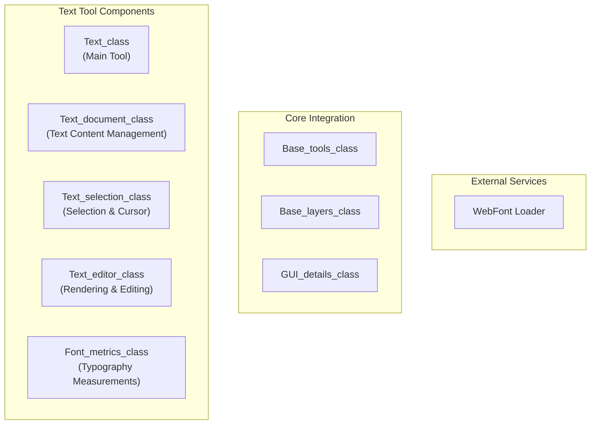

# Text Tool

> **Relevant source files**
> * [src/js/core/components/number-input.js](https://github.com/viliusle/miniPaint/blob/6d0b95e5/src/js/core/components/number-input.js)
> * [src/js/core/gui/gui-details.js](https://github.com/viliusle/miniPaint/blob/6d0b95e5/src/js/core/gui/gui-details.js)
> * [src/js/tools/text.js](https://github.com/viliusle/miniPaint/blob/6d0b95e5/src/js/tools/text.js)

The Text Tool in miniPaint enables users to add and edit text directly on their images. This document covers the implementation details of the Text Tool system, including its architecture, text editing capabilities, and integration with the miniPaint application.

## Overview

The Text Tool provides a full-featured text editing experience with formatting options, selection capabilities, and cursor navigation. The implementation handles both the visual presentation of text and the underlying data management, with support for advanced typography features like kerning and wrapping.



Sources: [src/js/tools/text.js L1-L1046](https://github.com/viliusle/miniPaint/blob/6d0b95e5/src/js/tools/text.js#L1-L1046)

 [src/js/core/gui/gui-details.js L1-L50](https://github.com/viliusle/miniPaint/blob/6d0b95e5/src/js/core/gui/gui-details.js#L1-L50)

## Text Data Model

### Document Structure

Text content in miniPaint is organized as a hierarchical structure:

1. A text document contains multiple **lines**
2. Each line contains multiple **spans**
3. Each span contains **text** and **meta** (formatting information)

```sql
#mermaid-c7sl1clq8sf{font-family:ui-sans-serif,-apple-system,system-ui,Segoe UI,Helvetica;font-size:16px;fill:#333;}@keyframes edge-animation-frame{from{stroke-dashoffset:0;}}@keyframes dash{to{stroke-dashoffset:0;}}#mermaid-c7sl1clq8sf .edge-animation-slow{stroke-dasharray:9,5!important;stroke-dashoffset:900;animation:dash 50s linear infinite;stroke-linecap:round;}#mermaid-c7sl1clq8sf .edge-animation-fast{stroke-dasharray:9,5!important;stroke-dashoffset:900;animation:dash 20s linear infinite;stroke-linecap:round;}#mermaid-c7sl1clq8sf .error-icon{fill:#dddddd;}#mermaid-c7sl1clq8sf .error-text{fill:#222222;stroke:#222222;}#mermaid-c7sl1clq8sf .edge-thickness-normal{stroke-width:1px;}#mermaid-c7sl1clq8sf .edge-thickness-thick{stroke-width:3.5px;}#mermaid-c7sl1clq8sf .edge-pattern-solid{stroke-dasharray:0;}#mermaid-c7sl1clq8sf .edge-thickness-invisible{stroke-width:0;fill:none;}#mermaid-c7sl1clq8sf .edge-pattern-dashed{stroke-dasharray:3;}#mermaid-c7sl1clq8sf .edge-pattern-dotted{stroke-dasharray:2;}#mermaid-c7sl1clq8sf .marker{fill:#999;stroke:#999;}#mermaid-c7sl1clq8sf .marker.cross{stroke:#999;}#mermaid-c7sl1clq8sf svg{font-family:ui-sans-serif,-apple-system,system-ui,Segoe UI,Helvetica;font-size:16px;}#mermaid-c7sl1clq8sf p{margin:0;}#mermaid-c7sl1clq8sf g.classGroup text{fill:#dddddd;stroke:none;font-family:ui-sans-serif,-apple-system,system-ui,Segoe UI,Helvetica;font-size:10px;}#mermaid-c7sl1clq8sf g.classGroup text .title{font-weight:bolder;}#mermaid-c7sl1clq8sf .cluster-label text{fill:#444;}#mermaid-c7sl1clq8sf .cluster-label span{color:#444;}#mermaid-c7sl1clq8sf .cluster-label span p{background-color:transparent;}#mermaid-c7sl1clq8sf .cluster rect{fill:#f8f8f8;stroke:#dddddd;stroke-width:1px;}#mermaid-c7sl1clq8sf .cluster text{fill:#444;}#mermaid-c7sl1clq8sf .cluster span{color:#444;}#mermaid-c7sl1clq8sf .nodeLabel,#mermaid-c7sl1clq8sf .edgeLabel{color:#333333;}#mermaid-c7sl1clq8sf .noteLabel .nodeLabel,#mermaid-c7sl1clq8sf .noteLabel .edgeLabel{color:#333;}#mermaid-c7sl1clq8sf .edgeLabel .label rect{fill:#ffffff;}#mermaid-c7sl1clq8sf .label text{fill:#333333;}#mermaid-c7sl1clq8sf .labelBkg{background:#ffffff;}#mermaid-c7sl1clq8sf .edgeLabel .label span{background:#ffffff;}#mermaid-c7sl1clq8sf .classTitle{font-weight:bolder;}#mermaid-c7sl1clq8sf .node rect,#mermaid-c7sl1clq8sf .node circle,#mermaid-c7sl1clq8sf .node ellipse,#mermaid-c7sl1clq8sf .node polygon,#mermaid-c7sl1clq8sf .node path{fill:#ffffff;stroke:#dddddd;stroke-width:1;}#mermaid-c7sl1clq8sf .divider{stroke:#dddddd;stroke-width:1;}#mermaid-c7sl1clq8sf g.clickable{cursor:pointer;}#mermaid-c7sl1clq8sf g.classGroup rect{fill:#ffffff;stroke:#dddddd;}#mermaid-c7sl1clq8sf g.classGroup line{stroke:#dddddd;stroke-width:1;}#mermaid-c7sl1clq8sf .classLabel .box{stroke:none;stroke-width:0;fill:#ffffff;opacity:0.5;}#mermaid-c7sl1clq8sf .classLabel .label{fill:#dddddd;font-size:10px;}#mermaid-c7sl1clq8sf .relation{stroke:#999;stroke-width:1;fill:none;}#mermaid-c7sl1clq8sf .dashed-line{stroke-dasharray:3;}#mermaid-c7sl1clq8sf .dotted-line{stroke-dasharray:1 2;}#mermaid-c7sl1clq8sf [id$="-compositionStart"],#mermaid-c7sl1clq8sf .composition{fill:#999!important;stroke:#999!important;stroke-width:1;}#mermaid-c7sl1clq8sf [id$="-compositionEnd"],#mermaid-c7sl1clq8sf .composition{fill:#999!important;stroke:#999!important;stroke-width:1;}#mermaid-c7sl1clq8sf [id$="-dependencyStart"],#mermaid-c7sl1clq8sf .dependency{fill:#999!important;stroke:#999!important;stroke-width:1;}#mermaid-c7sl1clq8sf [id$="-dependencyEnd"],#mermaid-c7sl1clq8sf .dependency{fill:#999!important;stroke:#999!important;stroke-width:1;}#mermaid-c7sl1clq8sf [id$="-extensionStart"],#mermaid-c7sl1clq8sf .extension{fill:transparent!important;stroke:#999!important;stroke-width:1;}#mermaid-c7sl1clq8sf [id$="-extensionEnd"],#mermaid-c7sl1clq8sf .extension{fill:transparent!important;stroke:#999!important;stroke-width:1;}#mermaid-c7sl1clq8sf [id$="-aggregationStart"],#mermaid-c7sl1clq8sf .aggregation{fill:transparent!important;stroke:#999!important;stroke-width:1;}#mermaid-c7sl1clq8sf [id$="-aggregationEnd"],#mermaid-c7sl1clq8sf .aggregation{fill:transparent!important;stroke:#999!important;stroke-width:1;}#mermaid-c7sl1clq8sf [id$="-lollipopStart"],#mermaid-c7sl1clq8sf .lollipop{fill:#ffffff!important;stroke:#999!important;stroke-width:1;}#mermaid-c7sl1clq8sf [id$="-lollipopEnd"],#mermaid-c7sl1clq8sf .lollipop{fill:#ffffff!important;stroke:#999!important;stroke-width:1;}#mermaid-c7sl1clq8sf .edgeTerminals{font-size:11px;line-height:initial;}#mermaid-c7sl1clq8sf .classTitleText{text-anchor:middle;font-size:18px;fill:#333;}#mermaid-c7sl1clq8sf .edgeLabel[data-look="neo"]{background-color:#ffffff;text-align:center;}#mermaid-c7sl1clq8sf .edgeLabel[data-look="neo"] p{background-color:#ffffff;}#mermaid-c7sl1clq8sf .edgeLabel[data-look="neo"] rect{opacity:0.5;background-color:#ffffff;fill:#ffffff;}#mermaid-c7sl1clq8sf .label-icon{display:inline-block;height:1em;overflow:visible;vertical-align:-0.125em;}#mermaid-c7sl1clq8sf .node .label-icon path{fill:currentColor;stroke:revert;stroke-width:revert;}#mermaid-c7sl1clq8sf .node .neo-node{stroke:#dddddd;}#mermaid-c7sl1clq8sf [data-look="neo"].node rect,#mermaid-c7sl1clq8sf [data-look="neo"].cluster rect,#mermaid-c7sl1clq8sf [data-look="neo"].node polygon{stroke:url(#mermaid-c7sl1clq8sf-gradient);filter:drop-shadow( 1px 2px 2px rgba(185,185,185,1));}#mermaid-c7sl1clq8sf [data-look="neo"].node path{stroke:url(#mermaid-c7sl1clq8sf-gradient);stroke-width:1px;}#mermaid-c7sl1clq8sf [data-look="neo"].node .outer-path{filter:drop-shadow( 1px 2px 2px rgba(185,185,185,1));}#mermaid-c7sl1clq8sf [data-look="neo"].node .neo-line path{stroke:#dddddd;filter:none;}#mermaid-c7sl1clq8sf [data-look="neo"].node circle{stroke:url(#mermaid-c7sl1clq8sf-gradient);filter:drop-shadow( 1px 2px 2px rgba(185,185,185,1));}#mermaid-c7sl1clq8sf [data-look="neo"].node circle .state-start{fill:#000000;}#mermaid-c7sl1clq8sf [data-look="neo"].icon-shape .icon{fill:url(#mermaid-c7sl1clq8sf-gradient);filter:drop-shadow( 1px 2px 2px rgba(185,185,185,1));}#mermaid-c7sl1clq8sf [data-look="neo"].icon-shape .icon-neo path{stroke:url(#mermaid-c7sl1clq8sf-gradient);filter:drop-shadow( 1px 2px 2px rgba(185,185,185,1));}#mermaid-c7sl1clq8sf :root{--mermaid-font-family:"trebuchet ms",verdana,arial,sans-serif;}111manymany1TextDocumentlines: arrayon_change: functionget_line_count()get_line_text(lineNumber)insert_text(text, line, character)delete_range(startLine, startCharacter, endLine, endCharacter)get_meta_range(startLine, startCharacter, endLine, endCharacter)set_meta_range(startLine, startCharacter, endLine, endCharacter, meta)Linespans: arraySpantext: stringmeta: objectMetasize: numberfamily: stringkerning: numberleading: numberbold: booleanitalic: booleanunderline: booleanstrikethrough: booleanfill_color: stringstroke_size: numberstroke_color: string
```

Sources: [src/js/tools/text.js L194-L813](https://github.com/viliusle/miniPaint/blob/6d0b95e5/src/js/tools/text.js#L194-L813)

### Text Formatting Defaults

The text tool uses sensible defaults for formatting when no specific values are provided. These defaults are defined to ensure consistent behavior and reduce storage requirements:

```
Default Font Size: 40px
Default Font Family: Arial
Default Text Color: #008800
Default Stroke Size: 0
Default Stroke Color: #000000
```

Sources: [src/js/tools/text.js L24-L36](https://github.com/viliusle/miniPaint/blob/6d0b95e5/src/js/tools/text.js#L24-L36)

## Selection and Cursor System

The text tool implements a sophisticated selection and cursor system to enable natural text editing.

### Selection Model

The selection is represented by a start and end position, where each position is defined by a line and character offset. The selection also tracks which side (start or end) is the active side for keyboard navigation and extension.

```

```

Sources: [src/js/tools/text.js L819-L1141](https://github.com/viliusle/miniPaint/blob/6d0b95e5/src/js/tools/text.js#L819-L1141)

### Cursor Navigation

The selection system provides comprehensive navigation capabilities:

* Character-by-character movement
* Word-by-word movement
* Line-by-line movement
* Start/end of line movement
* Selection extension
* Cursor blinking visualization

These features allow users to navigate and select text using familiar keyboard shortcuts and mouse operations that mimic standard text editors.

Sources: [src/js/tools/text.js L1051-L1140](https://github.com/viliusle/miniPaint/blob/6d0b95e5/src/js/tools/text.js#L1051-L1140)

## Text Rendering Process

Rendering text involves a multi-step process to calculate layout, handle wrapping, and apply formatting:


Sources: [src/js/tools/text.js L1408-L1638](https://github.com/viliusle/miniPaint/blob/6d0b95e5/src/js/tools/text.js#L1408-L1638)

 [src/js/tools/text.js L1640-L1821](https://github.com/viliusle/miniPaint/blob/6d0b95e5/src/js/tools/text.js#L1640-L1821)

### Text Placement Calculation

The `calculate_text_placement` method is responsible for determining how text should be positioned within the layer boundary. This includes:

1. Calculating text wrapping based on boundary constraints
2. Determining character positions for alignment and selection
3. Calculating line heights and baselines for proper text rendering
4. Preparing the layout for various text directions (though only left-to-right is fully implemented)

This complex calculation ensures text is correctly positioned according to user-defined constraints and styling.

Sources: [src/js/tools/text.js L1408-L1638](https://github.com/viliusle/miniPaint/blob/6d0b95e5/src/js/tools/text.js#L1408-L1638)

## Font Management

### Font Loading System

The text tool implements a font loading system that:

1. Checks if a font is already loaded
2. Loads fonts using the WebFont loader if needed
3. Handles load success and failure events
4. Provides a callback mechanism for rendering updates after font loading

```
load_font_family({ family, variants }, successCallback)
```

Sources: [src/js/tools/text.js L52-L84](https://github.com/viliusle/miniPaint/blob/6d0b95e5/src/js/tools/text.js#L52-L84)

### Font Metrics Calculation

The `Font_metrics_class` provides precise measurements of fonts:

```sql
#mermaid-pozhxt3mkrd{font-family:ui-sans-serif,-apple-system,system-ui,Segoe UI,Helvetica;font-size:16px;fill:#333;}@keyframes edge-animation-frame{from{stroke-dashoffset:0;}}@keyframes dash{to{stroke-dashoffset:0;}}#mermaid-pozhxt3mkrd .edge-animation-slow{stroke-dasharray:9,5!important;stroke-dashoffset:900;animation:dash 50s linear infinite;stroke-linecap:round;}#mermaid-pozhxt3mkrd .edge-animation-fast{stroke-dasharray:9,5!important;stroke-dashoffset:900;animation:dash 20s linear infinite;stroke-linecap:round;}#mermaid-pozhxt3mkrd .error-icon{fill:#dddddd;}#mermaid-pozhxt3mkrd .error-text{fill:#222222;stroke:#222222;}#mermaid-pozhxt3mkrd .edge-thickness-normal{stroke-width:1px;}#mermaid-pozhxt3mkrd .edge-thickness-thick{stroke-width:3.5px;}#mermaid-pozhxt3mkrd .edge-pattern-solid{stroke-dasharray:0;}#mermaid-pozhxt3mkrd .edge-thickness-invisible{stroke-width:0;fill:none;}#mermaid-pozhxt3mkrd .edge-pattern-dashed{stroke-dasharray:3;}#mermaid-pozhxt3mkrd .edge-pattern-dotted{stroke-dasharray:2;}#mermaid-pozhxt3mkrd .marker{fill:#999;stroke:#999;}#mermaid-pozhxt3mkrd .marker.cross{stroke:#999;}#mermaid-pozhxt3mkrd svg{font-family:ui-sans-serif,-apple-system,system-ui,Segoe UI,Helvetica;font-size:16px;}#mermaid-pozhxt3mkrd p{margin:0;}#mermaid-pozhxt3mkrd g.classGroup text{fill:#dddddd;stroke:none;font-family:ui-sans-serif,-apple-system,system-ui,Segoe UI,Helvetica;font-size:10px;}#mermaid-pozhxt3mkrd g.classGroup text .title{font-weight:bolder;}#mermaid-pozhxt3mkrd .cluster-label text{fill:#444;}#mermaid-pozhxt3mkrd .cluster-label span{color:#444;}#mermaid-pozhxt3mkrd .cluster-label span p{background-color:transparent;}#mermaid-pozhxt3mkrd .cluster rect{fill:#f8f8f8;stroke:#dddddd;stroke-width:1px;}#mermaid-pozhxt3mkrd .cluster text{fill:#444;}#mermaid-pozhxt3mkrd .cluster span{color:#444;}#mermaid-pozhxt3mkrd .nodeLabel,#mermaid-pozhxt3mkrd .edgeLabel{color:#333333;}#mermaid-pozhxt3mkrd .noteLabel .nodeLabel,#mermaid-pozhxt3mkrd .noteLabel .edgeLabel{color:#333;}#mermaid-pozhxt3mkrd .edgeLabel .label rect{fill:#ffffff;}#mermaid-pozhxt3mkrd .label text{fill:#333333;}#mermaid-pozhxt3mkrd .labelBkg{background:#ffffff;}#mermaid-pozhxt3mkrd .edgeLabel .label span{background:#ffffff;}#mermaid-pozhxt3mkrd .classTitle{font-weight:bolder;}#mermaid-pozhxt3mkrd .node rect,#mermaid-pozhxt3mkrd .node circle,#mermaid-pozhxt3mkrd .node ellipse,#mermaid-pozhxt3mkrd .node polygon,#mermaid-pozhxt3mkrd .node path{fill:#ffffff;stroke:#dddddd;stroke-width:1;}#mermaid-pozhxt3mkrd .divider{stroke:#dddddd;stroke-width:1;}#mermaid-pozhxt3mkrd g.clickable{cursor:pointer;}#mermaid-pozhxt3mkrd g.classGroup rect{fill:#ffffff;stroke:#dddddd;}#mermaid-pozhxt3mkrd g.classGroup line{stroke:#dddddd;stroke-width:1;}#mermaid-pozhxt3mkrd .classLabel .box{stroke:none;stroke-width:0;fill:#ffffff;opacity:0.5;}#mermaid-pozhxt3mkrd .classLabel .label{fill:#dddddd;font-size:10px;}#mermaid-pozhxt3mkrd .relation{stroke:#999;stroke-width:1;fill:none;}#mermaid-pozhxt3mkrd .dashed-line{stroke-dasharray:3;}#mermaid-pozhxt3mkrd .dotted-line{stroke-dasharray:1 2;}#mermaid-pozhxt3mkrd [id$="-compositionStart"],#mermaid-pozhxt3mkrd .composition{fill:#999!important;stroke:#999!important;stroke-width:1;}#mermaid-pozhxt3mkrd [id$="-compositionEnd"],#mermaid-pozhxt3mkrd .composition{fill:#999!important;stroke:#999!important;stroke-width:1;}#mermaid-pozhxt3mkrd [id$="-dependencyStart"],#mermaid-pozhxt3mkrd .dependency{fill:#999!important;stroke:#999!important;stroke-width:1;}#mermaid-pozhxt3mkrd [id$="-dependencyEnd"],#mermaid-pozhxt3mkrd .dependency{fill:#999!important;stroke:#999!important;stroke-width:1;}#mermaid-pozhxt3mkrd [id$="-extensionStart"],#mermaid-pozhxt3mkrd .extension{fill:transparent!important;stroke:#999!important;stroke-width:1;}#mermaid-pozhxt3mkrd [id$="-extensionEnd"],#mermaid-pozhxt3mkrd .extension{fill:transparent!important;stroke:#999!important;stroke-width:1;}#mermaid-pozhxt3mkrd [id$="-aggregationStart"],#mermaid-pozhxt3mkrd .aggregation{fill:transparent!important;stroke:#999!important;stroke-width:1;}#mermaid-pozhxt3mkrd [id$="-aggregationEnd"],#mermaid-pozhxt3mkrd .aggregation{fill:transparent!important;stroke:#999!important;stroke-width:1;}#mermaid-pozhxt3mkrd [id$="-lollipopStart"],#mermaid-pozhxt3mkrd .lollipop{fill:#ffffff!important;stroke:#999!important;stroke-width:1;}#mermaid-pozhxt3mkrd [id$="-lollipopEnd"],#mermaid-pozhxt3mkrd .lollipop{fill:#ffffff!important;stroke:#999!important;stroke-width:1;}#mermaid-pozhxt3mkrd .edgeTerminals{font-size:11px;line-height:initial;}#mermaid-pozhxt3mkrd .classTitleText{text-anchor:middle;font-size:18px;fill:#333;}#mermaid-pozhxt3mkrd .edgeLabel[data-look="neo"]{background-color:#ffffff;text-align:center;}#mermaid-pozhxt3mkrd .edgeLabel[data-look="neo"] p{background-color:#ffffff;}#mermaid-pozhxt3mkrd .edgeLabel[data-look="neo"] rect{opacity:0.5;background-color:#ffffff;fill:#ffffff;}#mermaid-pozhxt3mkrd .label-icon{display:inline-block;height:1em;overflow:visible;vertical-align:-0.125em;}#mermaid-pozhxt3mkrd .node .label-icon path{fill:currentColor;stroke:revert;stroke-width:revert;}#mermaid-pozhxt3mkrd .node .neo-node{stroke:#dddddd;}#mermaid-pozhxt3mkrd [data-look="neo"].node rect,#mermaid-pozhxt3mkrd [data-look="neo"].cluster rect,#mermaid-pozhxt3mkrd [data-look="neo"].node polygon{stroke:url(#mermaid-pozhxt3mkrd-gradient);filter:drop-shadow( 1px 2px 2px rgba(185,185,185,1));}#mermaid-pozhxt3mkrd [data-look="neo"].node path{stroke:url(#mermaid-pozhxt3mkrd-gradient);stroke-width:1px;}#mermaid-pozhxt3mkrd [data-look="neo"].node .outer-path{filter:drop-shadow( 1px 2px 2px rgba(185,185,185,1));}#mermaid-pozhxt3mkrd [data-look="neo"].node .neo-line path{stroke:#dddddd;filter:none;}#mermaid-pozhxt3mkrd [data-look="neo"].node circle{stroke:url(#mermaid-pozhxt3mkrd-gradient);filter:drop-shadow( 1px 2px 2px rgba(185,185,185,1));}#mermaid-pozhxt3mkrd [data-look="neo"].node circle .state-start{fill:#000000;}#mermaid-pozhxt3mkrd [data-look="neo"].icon-shape .icon{fill:url(#mermaid-pozhxt3mkrd-gradient);filter:drop-shadow( 1px 2px 2px rgba(185,185,185,1));}#mermaid-pozhxt3mkrd [data-look="neo"].icon-shape .icon-neo path{stroke:url(#mermaid-pozhxt3mkrd-gradient);filter:drop-shadow( 1px 2px 2px rgba(185,185,185,1));}#mermaid-pozhxt3mkrd :root{--mermaid-font-family:"trebuchet ms",verdana,arial,sans-serif;}Font_metrics_classfamily: stringsize: numberwidth: numberheight: numberbaseline: numberkerningMap: Mapcalculate_letter_bounds(letter, baseline)get_kerning_offset(letters, flags)
```

This class uses DOM measurement techniques to:

1. Calculate the width and height of characters
2. Determine baseline positioning
3. Calculate kerning between character pairs
4. Measure the bounds of specific letters

Sources: [src/js/tools/text.js L94-L189](https://github.com/viliusle/miniPaint/blob/6d0b95e5/src/js/tools/text.js#L94-L189)

## Text Editing Functionality

### Text Input Handling

The text editor responds to various input methods:

1. **Keyboard Input**: Character insertion, deletion, formatting commands
2. **Clipboard Operations**: Copy, cut, paste
3. **Mouse Selection**: Click and drag to select text
4. **IME Support**: Input Method Editor for international text entry

Sources: [src/js/tools/text.js L1280-L1316](https://github.com/viliusle/miniPaint/blob/6d0b95e5/src/js/tools/text.js#L1280-L1316)

### Text Manipulation

Key text manipulation operations include:

* **Insertion**: Adding text at the current cursor position
* **Deletion**: Removing text with backspace/delete
* **Selection Management**: Creating, extending, and clearing selections
* **Formatting Application**: Applying styling to selected text ranges

Sources: [src/js/tools/text.js L382-L461](https://github.com/viliusle/miniPaint/blob/6d0b95e5/src/js/tools/text.js#L382-L461)

 [src/js/tools/text.js L593-L630](https://github.com/viliusle/miniPaint/blob/6d0b95e5/src/js/tools/text.js#L593-L630)

## UI Integration

### Text Tool Parameters

The text tool exposes several parameters in the UI that control its behavior:

| Parameter | Description | Options |
| --- | --- | --- |
| Boundary | Controls how text container resizes | Box (fixed), Dynamic (grows with content) |
| Kerning | Character spacing adjustment | None, Metrics (font-based) |
| Wrap At | Text wrapping behavior | Word + Letter, Word only |
| H. Align | Horizontal text alignment | Left, Center, Right |

Sources: [src/js/core/gui/gui-details.js L51-L111](https://github.com/viliusle/miniPaint/blob/6d0b95e5/src/js/core/gui/gui-details.js#L51-L111)

### Text Editing Dialog

Text content can be edited through a dedicated dialog activated by clicking the "Edit text..." button in the layer details panel:

```javascript
document.getElementById('detail_param_text').addEventListener('click', function (e) {
    document.querySelector('#tools_container #text').click();
    document.getElementById('text_tool_keyboard_input').focus();
    config.need_render = true;
});
```

Sources: [src/js/core/gui/gui-details.js L532-L537](https://github.com/viliusle/miniPaint/blob/6d0b95e5/src/js/core/gui/gui-details.js#L532-L537)

## Text Layer Integration

### Layer Data Structure

Text layers store their content as a structured JSON object:

```css
{
  "type": "text",
  "data": [
    [
      {
        "text": "Sample text",
        "meta": {
          "size": 40,
          "family": "Arial",
          "bold": false,
          "italic": false,
          "fill_color": "#008800"
        }
      }
    ]
  ],
  "params": {
    "boundary": "box",
    "kerning": "metrics",
    "wrap": "letter",
    "halign": "left"
  }
}
```

This structure allows for:

1. Efficient storage of text content
2. Preservation of formatting information
3. Support for multiple text spans with different styling
4. Configuration of text layout parameters

Sources: [src/js/tools/text.js L1194-L1195](https://github.com/viliusle/miniPaint/blob/6d0b95e5/src/js/tools/text.js#L1194-L1195)

### Layer Rendering

The text editor maintains a connection to its associated layer, updating the layer data whenever the text content changes:

```javascript
this.document.on_change = () => {    this.layer.data = this.document.lines;};
```

Sources: [src/js/tools/text.js L1192-L1196](https://github.com/viliusle/miniPaint/blob/6d0b95e5/src/js/tools/text.js#L1192-L1196)

## Implementation Details

### Text Editing Performance Optimizations

The text tool includes several optimizations to maintain performance:

1. **Lazy Calculation**: Text layout is only recalculated when necessary
2. **Span Merging**: Adjacent spans with identical formatting are merged
3. **Font Caching**: Font metrics are cached for reuse
4. **Selection Rendering**: Only the affected lines are re-rendered during selection

Sources: [src/js/tools/text.js L1640-L1643](https://github.com/viliusle/miniPaint/blob/6d0b95e5/src/js/tools/text.js#L1640-L1643)

 [src/js/tools/text.js L788-L811](https://github.com/viliusle/miniPaint/blob/6d0b95e5/src/js/tools/text.js#L788-L811)

### Known Limitations

As noted in code comments, there are some planned features not yet fully implemented:

```
/**
 * TODO
 * - Add leading, superscript, subscript
 * - Implement text direction (right to left, top to bottom, etc.); currently partial implementation
 * - Allow search & add google fonts
 * - Undo history
 */
```

Sources: [src/js/tools/text.js L13-L19](https://github.com/viliusle/miniPaint/blob/6d0b95e5/src/js/tools/text.js#L13-L19)

## Summary

The Text Tool in miniPaint is a sophisticated text editing system that provides a rich set of features for adding and editing text in images. It handles the complexities of text layout, formatting, selection, and user interaction while integrating seamlessly with miniPaint's layer system. The implementation balances features with performance through careful optimization and a well-designed object architecture.