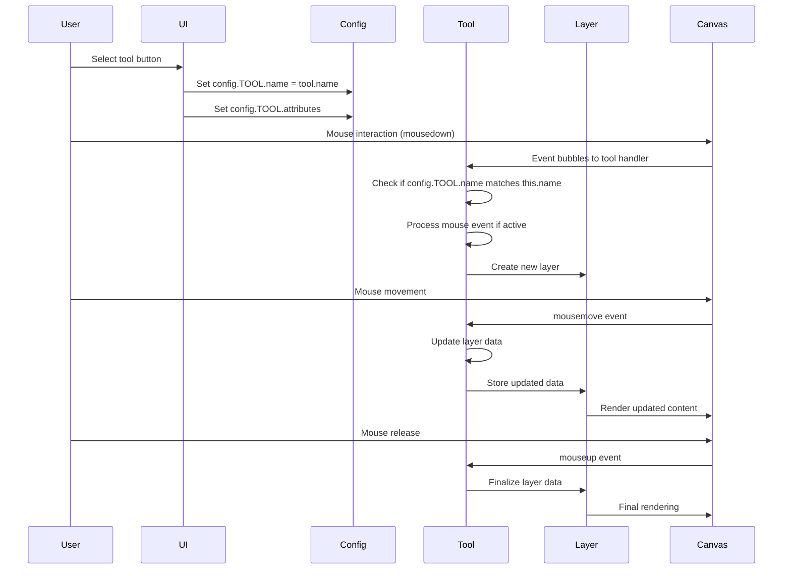
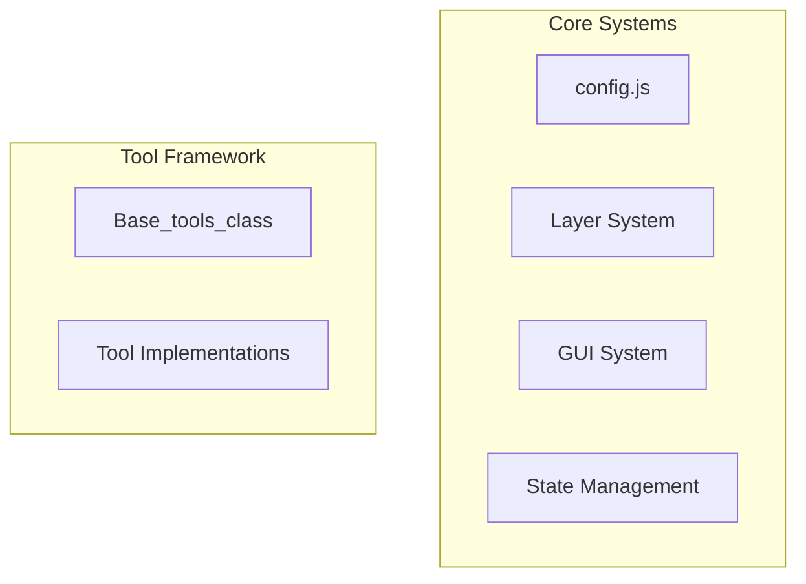

# Tool Framework

> **Relevant source files**
> * [src/js/core/base-tools.js](https://github.com/viliusle/miniPaint/blob/6d0b95e5/src/js/core/base-tools.js)
> * [src/js/tools/brush.js](https://github.com/viliusle/miniPaint/blob/6d0b95e5/src/js/tools/brush.js)
> * [src/js/tools/gradient.js](https://github.com/viliusle/miniPaint/blob/6d0b95e5/src/js/tools/gradient.js)
> * [src/js/tools/pencil.js](https://github.com/viliusle/miniPaint/blob/6d0b95e5/src/js/tools/pencil.js)

The Tool Framework provides the foundation for all drawing and editing tools in miniPaint. It defines a common interface and behavior patterns for user interactions, parameter handling, and rendering. This document covers the architecture of the tool system, how specific tools extend the base class, and the interactions between tools and other system components.

For information about specific tool implementations, see [Tools](/viliusle/miniPaint/4-tools). For details on the Selection System which works alongside tools, see [Selection System](/viliusle/miniPaint/2.3-selection-system).

## Core Architecture

The Tool Framework is built around the `Base_tools_class`, which serves as the parent class that all specific tool implementations inherit from. This base class provides common functionality like mouse tracking, event handling, and parameter access that are shared across all tools.

```sql
#mermaid-uxn9sulz0gq{font-family:ui-sans-serif,-apple-system,system-ui,Segoe UI,Helvetica;font-size:16px;fill:#333;}@keyframes edge-animation-frame{from{stroke-dashoffset:0;}}@keyframes dash{to{stroke-dashoffset:0;}}#mermaid-uxn9sulz0gq .edge-animation-slow{stroke-dasharray:9,5!important;stroke-dashoffset:900;animation:dash 50s linear infinite;stroke-linecap:round;}#mermaid-uxn9sulz0gq .edge-animation-fast{stroke-dasharray:9,5!important;stroke-dashoffset:900;animation:dash 20s linear infinite;stroke-linecap:round;}#mermaid-uxn9sulz0gq .error-icon{fill:#dddddd;}#mermaid-uxn9sulz0gq .error-text{fill:#222222;stroke:#222222;}#mermaid-uxn9sulz0gq .edge-thickness-normal{stroke-width:1px;}#mermaid-uxn9sulz0gq .edge-thickness-thick{stroke-width:3.5px;}#mermaid-uxn9sulz0gq .edge-pattern-solid{stroke-dasharray:0;}#mermaid-uxn9sulz0gq .edge-thickness-invisible{stroke-width:0;fill:none;}#mermaid-uxn9sulz0gq .edge-pattern-dashed{stroke-dasharray:3;}#mermaid-uxn9sulz0gq .edge-pattern-dotted{stroke-dasharray:2;}#mermaid-uxn9sulz0gq .marker{fill:#999;stroke:#999;}#mermaid-uxn9sulz0gq .marker.cross{stroke:#999;}#mermaid-uxn9sulz0gq svg{font-family:ui-sans-serif,-apple-system,system-ui,Segoe UI,Helvetica;font-size:16px;}#mermaid-uxn9sulz0gq p{margin:0;}#mermaid-uxn9sulz0gq g.classGroup text{fill:#dddddd;stroke:none;font-family:ui-sans-serif,-apple-system,system-ui,Segoe UI,Helvetica;font-size:10px;}#mermaid-uxn9sulz0gq g.classGroup text .title{font-weight:bolder;}#mermaid-uxn9sulz0gq .cluster-label text{fill:#444;}#mermaid-uxn9sulz0gq .cluster-label span{color:#444;}#mermaid-uxn9sulz0gq .cluster-label span p{background-color:transparent;}#mermaid-uxn9sulz0gq .cluster rect{fill:#f8f8f8;stroke:#dddddd;stroke-width:1px;}#mermaid-uxn9sulz0gq .cluster text{fill:#444;}#mermaid-uxn9sulz0gq .cluster span{color:#444;}#mermaid-uxn9sulz0gq .nodeLabel,#mermaid-uxn9sulz0gq .edgeLabel{color:#333333;}#mermaid-uxn9sulz0gq .noteLabel .nodeLabel,#mermaid-uxn9sulz0gq .noteLabel .edgeLabel{color:#333;}#mermaid-uxn9sulz0gq .edgeLabel .label rect{fill:#ffffff;}#mermaid-uxn9sulz0gq .label text{fill:#333333;}#mermaid-uxn9sulz0gq .labelBkg{background:#ffffff;}#mermaid-uxn9sulz0gq .edgeLabel .label span{background:#ffffff;}#mermaid-uxn9sulz0gq .classTitle{font-weight:bolder;}#mermaid-uxn9sulz0gq .node rect,#mermaid-uxn9sulz0gq .node circle,#mermaid-uxn9sulz0gq .node ellipse,#mermaid-uxn9sulz0gq .node polygon,#mermaid-uxn9sulz0gq .node path{fill:#ffffff;stroke:#dddddd;stroke-width:1;}#mermaid-uxn9sulz0gq .divider{stroke:#dddddd;stroke-width:1;}#mermaid-uxn9sulz0gq g.clickable{cursor:pointer;}#mermaid-uxn9sulz0gq g.classGroup rect{fill:#ffffff;stroke:#dddddd;}#mermaid-uxn9sulz0gq g.classGroup line{stroke:#dddddd;stroke-width:1;}#mermaid-uxn9sulz0gq .classLabel .box{stroke:none;stroke-width:0;fill:#ffffff;opacity:0.5;}#mermaid-uxn9sulz0gq .classLabel .label{fill:#dddddd;font-size:10px;}#mermaid-uxn9sulz0gq .relation{stroke:#999;stroke-width:1;fill:none;}#mermaid-uxn9sulz0gq .dashed-line{stroke-dasharray:3;}#mermaid-uxn9sulz0gq .dotted-line{stroke-dasharray:1 2;}#mermaid-uxn9sulz0gq [id$="-compositionStart"],#mermaid-uxn9sulz0gq .composition{fill:#999!important;stroke:#999!important;stroke-width:1;}#mermaid-uxn9sulz0gq [id$="-compositionEnd"],#mermaid-uxn9sulz0gq .composition{fill:#999!important;stroke:#999!important;stroke-width:1;}#mermaid-uxn9sulz0gq [id$="-dependencyStart"],#mermaid-uxn9sulz0gq .dependency{fill:#999!important;stroke:#999!important;stroke-width:1;}#mermaid-uxn9sulz0gq [id$="-dependencyEnd"],#mermaid-uxn9sulz0gq .dependency{fill:#999!important;stroke:#999!important;stroke-width:1;}#mermaid-uxn9sulz0gq [id$="-extensionStart"],#mermaid-uxn9sulz0gq .extension{fill:transparent!important;stroke:#999!important;stroke-width:1;}#mermaid-uxn9sulz0gq [id$="-extensionEnd"],#mermaid-uxn9sulz0gq .extension{fill:transparent!important;stroke:#999!important;stroke-width:1;}#mermaid-uxn9sulz0gq [id$="-aggregationStart"],#mermaid-uxn9sulz0gq .aggregation{fill:transparent!important;stroke:#999!important;stroke-width:1;}#mermaid-uxn9sulz0gq [id$="-aggregationEnd"],#mermaid-uxn9sulz0gq .aggregation{fill:transparent!important;stroke:#999!important;stroke-width:1;}#mermaid-uxn9sulz0gq [id$="-lollipopStart"],#mermaid-uxn9sulz0gq .lollipop{fill:#ffffff!important;stroke:#999!important;stroke-width:1;}#mermaid-uxn9sulz0gq [id$="-lollipopEnd"],#mermaid-uxn9sulz0gq .lollipop{fill:#ffffff!important;stroke:#999!important;stroke-width:1;}#mermaid-uxn9sulz0gq .edgeTerminals{font-size:11px;line-height:initial;}#mermaid-uxn9sulz0gq .classTitleText{text-anchor:middle;font-size:18px;fill:#333;}#mermaid-uxn9sulz0gq .edgeLabel[data-look="neo"]{background-color:#ffffff;text-align:center;}#mermaid-uxn9sulz0gq .edgeLabel[data-look="neo"] p{background-color:#ffffff;}#mermaid-uxn9sulz0gq .edgeLabel[data-look="neo"] rect{opacity:0.5;background-color:#ffffff;fill:#ffffff;}#mermaid-uxn9sulz0gq .label-icon{display:inline-block;height:1em;overflow:visible;vertical-align:-0.125em;}#mermaid-uxn9sulz0gq .node .label-icon path{fill:currentColor;stroke:revert;stroke-width:revert;}#mermaid-uxn9sulz0gq .node .neo-node{stroke:#dddddd;}#mermaid-uxn9sulz0gq [data-look="neo"].node rect,#mermaid-uxn9sulz0gq [data-look="neo"].cluster rect,#mermaid-uxn9sulz0gq [data-look="neo"].node polygon{stroke:url(#mermaid-uxn9sulz0gq-gradient);filter:drop-shadow( 1px 2px 2px rgba(185,185,185,1));}#mermaid-uxn9sulz0gq [data-look="neo"].node path{stroke:url(#mermaid-uxn9sulz0gq-gradient);stroke-width:1px;}#mermaid-uxn9sulz0gq [data-look="neo"].node .outer-path{filter:drop-shadow( 1px 2px 2px rgba(185,185,185,1));}#mermaid-uxn9sulz0gq [data-look="neo"].node .neo-line path{stroke:#dddddd;filter:none;}#mermaid-uxn9sulz0gq [data-look="neo"].node circle{stroke:url(#mermaid-uxn9sulz0gq-gradient);filter:drop-shadow( 1px 2px 2px rgba(185,185,185,1));}#mermaid-uxn9sulz0gq [data-look="neo"].node circle .state-start{fill:#000000;}#mermaid-uxn9sulz0gq [data-look="neo"].icon-shape .icon{fill:url(#mermaid-uxn9sulz0gq-gradient);filter:drop-shadow( 1px 2px 2px rgba(185,185,185,1));}#mermaid-uxn9sulz0gq [data-look="neo"].icon-shape .icon-neo path{stroke:url(#mermaid-uxn9sulz0gq-gradient);filter:drop-shadow( 1px 2px 2px rgba(185,185,185,1));}#mermaid-uxn9sulz0gq :root{--mermaid-font-family:"trebuchet ms",verdana,arial,sans-serif;}Base_tools_class+is_drag: boolean+mouse_click_pos: array+dragStart(event)+dragMove(event)+dragEnd(event)+events()+get_mouse_info(event)+getParams()Drawing_toolsSelection_toolsShape_toolsEffect_toolsBrush_class+name: "brush"+load()+mousedown_action(e)+mousemove_action(e)+render(ctx, layer)Pencil_class+name: "pencil"+load()+mousedown(e)+mousemove(e)+render(ctx, layer)Gradient_classRectangle_classCircle_classSelect_classCrop_classBlur_classSharpen_class
```

Sources: [src/js/core/base-tools.js L15-L734](https://github.com/viliusle/miniPaint/blob/6d0b95e5/src/js/core/base-tools.js#L15-L734)

 [src/js/tools/brush.js L6-L570](https://github.com/viliusle/miniPaint/blob/6d0b95e5/src/js/tools/brush.js#L6-L570)

 [src/js/tools/pencil.js L6-L306](https://github.com/viliusle/miniPaint/blob/6d0b95e5/src/js/tools/pencil.js#L6-L306)

## Base Tool Class

The `Base_tools_class` defined in `base-tools.js` provides the foundation for all tools. It handles common functionality such as:

1. Mouse tracking and event management
2. Parameter access and management
3. Cursor and shape rendering helpers
4. Coordinate transformations and snapping

### Key Functions and Properties

| Member | Type | Purpose |
| --- | --- | --- |
| `constructor(save_mouse)` | Method | Initializes the tool and sets up mouse tracking if `save_mouse` is true |
| `dragStart/Move/End(event)` | Methods | Handle drag operations lifecycle |
| `events()` | Method | Sets up mouse and touch event listeners |
| `get_mouse_info(event)` | Method | Returns the current mouse information |
| `getParams()` | Method | Retrieves tool-specific parameters from `config.TOOL.attributes` |
| `show_mouse_cursor(x, y, size, type)` | Method | Displays a custom cursor for the tool |
| `is_drag` | Property | Boolean indicating if a drag operation is in progress |
| `mouse_click_pos` | Property | Array storing the coordinates of the current mouse click |
| `mouse_valid` | Property | Boolean indicating if the mouse position is valid |

Sources: [src/js/core/base-tools.js L17-L38](https://github.com/viliusle/miniPaint/blob/6d0b95e5/src/js/core/base-tools.js#L17-L38)

 [src/js/core/base-tools.js L39-L68](https://github.com/viliusle/miniPaint/blob/6d0b95e5/src/js/core/base-tools.js#L39-L68)

 [src/js/core/base-tools.js L70-L111](https://github.com/viliusle/miniPaint/blob/6d0b95e5/src/js/core/base-tools.js#L70-L111)

 [src/js/core/base-tools.js L199-L205](https://github.com/viliusle/miniPaint/blob/6d0b95e5/src/js/core/base-tools.js#L199-L205)

 [src/js/core/base-tools.js L282-L298](https://github.com/viliusle/miniPaint/blob/6d0b95e5/src/js/core/base-tools.js#L282-L298)

### Event Handling System

The `Base_tools_class` implements a comprehensive event handling system for both mouse and touch interactions:

```mermaid
flowchart TD

mermaid-hu3srh9hn3e-flowchart-EventSource["DOM Events (mouse/touch)"]
mermaid-hu3srh9hn3e-flowchart-EventListener["Tool event listeners"]
mermaid-hu3srh9hn3e-flowchart-Validation["Validate event (is_drag, click_valid)"]
mermaid-hu3srh9hn3e-flowchart-MouseInfo["Update mouse info in config"]
mermaid-hu3srh9hn3e-flowchart-ToolHandlers["Tool-specific handlers<br>(mousedown, mousemove, mouseup)"]
mermaid-hu3srh9hn3e-flowchart-LayerActions["Layer creation/updating"]
mermaid-hu3srh9hn3e-flowchart-StateManagement["State management (undo/redo)"]
mermaid-hu3srh9hn3e-flowchart-Rendering["Canvas rendering"]
```



The base class provides two methods for event binding:

1. **Default events system** - Through the `events()` method which sets up basic mouse and touch event listeners
2. **Specialized binding** - Through the `default_events()` method which delegates to tool-specific handlers

Sources: [src/js/core/base-tools.js L70-L111](https://github.com/viliusle/miniPaint/blob/6d0b95e5/src/js/core/base-tools.js#L70-L111)

 [src/js/core/base-tools.js L349-L372](https://github.com/viliusle/miniPaint/blob/6d0b95e5/src/js/core/base-tools.js#L349-L372)

## Tool Implementation Pattern

Tool implementations extend `Base_tools_class` and follow a consistent pattern with these key methods:

### 1. Initialization

```
constructor(ctx) {    super();    this.name = 'tool_name';  // Unique identifier for the tool    this.layer = {};          // Will hold layer data} load() {    // Set up event listeners - either custom or default    this.default_events();}
```

### 2. Event Handlers

Most tools implement three key methods to handle user interactions:

```
mousedown(e) {    // Handle mouse button down    // Usually creates a new layer if needed} mousemove(e) {    // Handle mouse movement    // Updates layer data} mouseup(e) {    // Handle mouse button release    // Finalizes the operation}
```

### 3. Rendering

All tools must implement a render method to draw their output:

```
render(ctx, layer) {    // Draw the tool's output based on layer data}
```

Sources: [src/js/tools/brush.js L8-L20](https://github.com/viliusle/miniPaint/blob/6d0b95e5/src/js/tools/brush.js#L8-L20)

 [src/js/tools/brush.js L22-L62](https://github.com/viliusle/miniPaint/blob/6d0b95e5/src/js/tools/brush.js#L22-L62)

 [src/js/tools/brush.js L197-L337](https://github.com/viliusle/miniPaint/blob/6d0b95e5/src/js/tools/brush.js#L197-L337)

 [src/js/tools/brush.js L339-L411](https://github.com/viliusle/miniPaint/blob/6d0b95e5/src/js/tools/brush.js#L339-L411)

## Layer Integration

Tools interact closely with the layer system. The typical pattern for layer management in tools is:

1. **Layer Creation**: In the `mousedown` handler, create a new layer if needed:

```
this.layer = {    type: this.name,    data: [],    params: this.clone(this.getParams()),    status: 'draft',    render_function: [this.name, 'render'],    is_vector: true,    // Additional properties...};app.State.do_action(    new app.Actions.Bundle_action('new_tool_layer', 'New Tool Layer', [        new app.Actions.Insert_layer_action(this.layer)    ]));
```

1. **Layer Updating**: In the `mousemove` handler, update the layer data:

```
// Add new data pointsconfig.layer.data.push([x, y, size]);// Trigger renderingthis.Base_layers.render();
```

1. **Layer Finalization**: In the `mouseup` handler, finalize the layer:

```
// Adjust layer dimensionsapp.State.do_action(    new app.Actions.Update_layer_action(config.layer.id, {        // Updated properties        status: null // Remove draft status    }));
```

Sources: [src/js/tools/brush.js L204-L236](https://github.com/viliusle/miniPaint/blob/6d0b95e5/src/js/tools/brush.js#L204-L236)

 [src/js/tools/brush.js L283-L323](https://github.com/viliusle/miniPaint/blob/6d0b95e5/src/js/tools/brush.js#L283-L323)

 [src/js/tools/brush.js L326-L336](https://github.com/viliusle/miniPaint/blob/6d0b95e5/src/js/tools/brush.js#L326-L336)

 [src/js/tools/pencil.js L65-L102](https://github.com/viliusle/miniPaint/blob/6d0b95e5/src/js/tools/pencil.js#L65-L102)

## Tool Activation Flow

The following diagram illustrates how a tool becomes active and processes user interactions:



Sources: [src/js/core/base-tools.js L374-L391](https://github.com/viliusle/miniPaint/blob/6d0b95e5/src/js/core/base-tools.js#L374-L391)

 [src/js/tools/brush.js L83-L96](https://github.com/viliusle/miniPaint/blob/6d0b95e5/src/js/tools/brush.js#L83-L96)

 [src/js/tools/brush.js L120-L137](https://github.com/viliusle/miniPaint/blob/6d0b95e5/src/js/tools/brush.js#L120-L137)

## Example Tool Implementations

Let's examine two tool implementations to understand the pattern in practice:

### Brush Tool

The Brush tool (`brush.js`) is a typical drawing tool:

1. **Initialization**: * Sets name to `'brush'` * Tracks pressure for devices that support it
2. **Event Handling**: * Uses custom event listeners for pressure-sensitive devices * Maintains multiple touch points for multi-touch support
3. **Rendering**: * Provides two rendering modes: with and without stabilization * Handles different line widths based on pressure

Sources: [src/js/tools/brush.js L8-L20](https://github.com/viliusle/miniPaint/blob/6d0b95e5/src/js/tools/brush.js#L8-L20)

 [src/js/tools/brush.js L22-L62](https://github.com/viliusle/miniPaint/blob/6d0b95e5/src/js/tools/brush.js#L22-L62)

 [src/js/tools/brush.js L339-L489](https://github.com/viliusle/miniPaint/blob/6d0b95e5/src/js/tools/brush.js#L339-L489)

### Gradient Tool

The Gradient tool (`gradient.js`) creates gradient effects:

1. **Initialization**: * Uses default event system * Supports both linear and radial gradients
2. **Event Handling**: * Uses mouse drag to define gradient dimensions and direction * Handles different behavior for radial vs. linear modes
3. **Rendering**: * Creates either linear or radial gradients based on parameters * Applies color transitions between two selected colors

Sources: [src/js/tools/gradient.js L8-L17](https://github.com/viliusle/miniPaint/blob/6d0b95e5/src/js/tools/gradient.js#L8-L17)

 [src/js/tools/gradient.js L22-L182](https://github.com/viliusle/miniPaint/blob/6d0b95e5/src/js/tools/gradient.js#L22-L182)

## Integration with other Systems

The Tool Framework integrates with several other core systems in miniPaint:

1. **Layer System** (`Base_layers_class`): For creating and manipulating layers
2. **GUI System** (`Base_gui_class`): For UI interactions
3. **Helper System** (`Helper_class`): For utility functions
4. **Configuration System** (`config.js`): For storing global state
5. **State Management System** (`app.State`): For managing undo/redo operations



Sources: [src/js/core/base-tools.js L17-L20](https://github.com/viliusle/miniPaint/blob/6d0b95e5/src/js/core/base-tools.js#L17-L20)

 [src/js/tools/brush.js L9-L10](https://github.com/viliusle/miniPaint/blob/6d0b95e5/src/js/tools/brush.js#L9-L10)

## Implementing a New Tool

To create a new tool:

1. Create a new class that extends `Base_tools_class`
2. Implement core methods: `constructor`, `load`, `mousedown`, `mousemove`, `mouseup`, and `render`
3. Register the tool with the system

The most important considerations are:

* Define a unique `name` for your tool
* Set up appropriate event handling in `load()`
* Create and update layers consistently
* Implement rendering logic specific to your tool

## Common Helper Methods

The `Base_tools_class` offers several helper methods that simplify tool implementation:

| Method | Purpose |
| --- | --- |
| `get_params_hash()` | Creates a hash to detect parameter changes |
| `clone(object)` | Deep clones objects for history support |
| `draw_shape(ctx, ...)` | Utility for drawing vector shapes |
| `calc_snap_position(...)` | Implements position snapping logic |
| `get_snap_positions(...)` | Gets available snap positions |
| `adaptSize(value, type)` | Adjusts sizes based on layer scaling |

Sources: [src/js/core/base-tools.js L232-L239](https://github.com/viliusle/miniPaint/blob/6d0b95e5/src/js/core/base-tools.js#L232-L239)

 [src/js/core/base-tools.js L241-L243](https://github.com/viliusle/miniPaint/blob/6d0b95e5/src/js/core/base-tools.js#L241-L243)

 [src/js/core/base-tools.js L316-L347](https://github.com/viliusle/miniPaint/blob/6d0b95e5/src/js/core/base-tools.js#L316-L347)

 [src/js/core/base-tools.js L649-L731](https://github.com/viliusle/miniPaint/blob/6d0b95e5/src/js/core/base-tools.js#L649-L731)

## Summary

The Tool Framework in miniPaint provides a robust foundation for creating diverse drawing and editing tools through inheritance and consistent interfaces. The `Base_tools_class` handles common functionality while specific tool implementations focus on their unique behaviors and rendering logic. This architecture makes it straightforward to add new tools while maintaining consistent user interaction patterns across the application.

Sources: [src/js/core/base-tools.js L15-L734](https://github.com/viliusle/miniPaint/blob/6d0b95e5/src/js/core/base-tools.js#L15-L734)

 [src/js/tools/brush.js L6-L570](https://github.com/viliusle/miniPaint/blob/6d0b95e5/src/js/tools/brush.js#L6-L570)

 [src/js/tools/pencil.js L6-L306](https://github.com/viliusle/miniPaint/blob/6d0b95e5/src/js/tools/pencil.js#L6-L306)

 [src/js/tools/gradient.js L7-L184](https://github.com/viliusle/miniPaint/blob/6d0b95e5/src/js/tools/gradient.js#L7-L184)