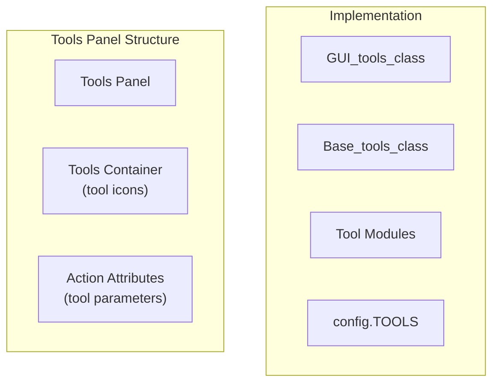
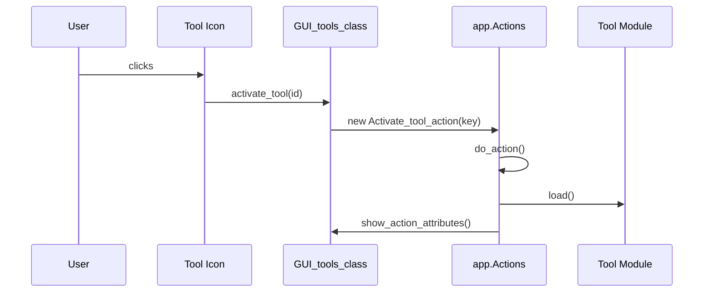
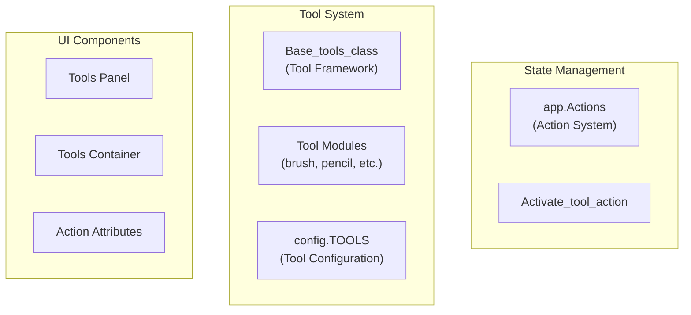

# Tools Panel

> **Relevant source files**
> * [src/css/component.css](https://github.com/viliusle/miniPaint/blob/6d0b95e5/src/css/component.css)
> * [src/js/core/gui/gui-colors.js](https://github.com/viliusle/miniPaint/blob/6d0b95e5/src/js/core/gui/gui-colors.js)
> * [src/js/core/gui/gui-tools.js](https://github.com/viliusle/miniPaint/blob/6d0b95e5/src/js/core/gui/gui-tools.js)

The Tools Panel is a core user interface component in miniPaint that provides access to all drawing, selection, and manipulation tools available in the application. Located in the left sidebar of the interface, it allows users to select tools and configure their specific attributes.

For information about how individual tools are implemented, see [Tool Framework](/viliusle/miniPaint/2.4-tool-framework) and [Tools](/viliusle/miniPaint/4-tools).

## Overview

The Tools Panel consists of two main sections:

1. **Tools Container** - A vertical list of tool icons/buttons that users can select
2. **Action Attributes** - A dynamic section that displays parameters specific to the currently selected tool

The panel is implemented through the `GUI_tools_class` which handles tool loading, rendering, and activation.



Sources: [src/js/core/gui/gui-tools.js L16-L141](https://github.com/viliusle/miniPaint/blob/6d0b95e5/src/js/core/gui/gui-tools.js#L16-L141)

## Tools Container

The tools container renders a vertical list of tool icons defined in the configuration system. Each tool icon is represented as a DOM element with specific styling and event handlers.

### Tool Loading Process

Before rendering the tools panel, the system dynamically loads all tool modules from the tools directory:

```mermaid
flowchart TD

mermaid-ebcqxkleyl9-flowchart-LP["load_plugins()"]
mermaid-ebcqxkleyl9-flowchart-PC["Scan tools directory context"]
mermaid-ebcqxkleyl9-flowchart-IOT["Initialize each tool object"]
mermaid-ebcqxkleyl9-flowchart-STM["Store tool modules in tools_modules"]
mermaid-ebcqxkleyl9-flowchart-RT["render_tools()"]
mermaid-ebcqxkleyl9-flowchart-CTC["Create tool container elements"]
mermaid-ebcqxkleyl9-flowchart-AAT["Attach event listeners"]
mermaid-ebcqxkleyl9-flowchart-SAA["Show action attributes"]
```



Sources: [src/js/core/gui/gui-tools.js L36-L69](https://github.com/viliusle/miniPaint/blob/6d0b95e5/src/js/core/gui/gui-tools.js#L36-L69)

 [src/js/core/gui/gui-tools.js L77-L122](https://github.com/viliusle/miniPaint/blob/6d0b95e5/src/js/core/gui/gui-tools.js#L77-L122)

The tool loading process uses a Webpack context to dynamically import all JavaScript files from the tools directory. Each tool is initialized with the canvas context and stored in the `tools_modules` object with its name and metadata.

### Tool Selection and Activation

When a user clicks on a tool icon, the following sequence occurs:



Sources: [src/js/core/gui/gui-tools.js L124-L128](https://github.com/viliusle/miniPaint/blob/6d0b95e5/src/js/core/gui/gui-tools.js#L124-L128)

The `activate_tool()` method uses miniPaint's action system to create and execute a tool activation action. This ensures the tool activation is properly recorded in the application's state history (for undo/redo functionality).

## Action Attributes Section

The Action Attributes section displays tool-specific parameters that users can adjust. This dynamic section is rendered below the tools container and changes based on which tool is currently active.

### Attribute Types and Rendering

The system supports several types of tool attributes:

| Attribute Type | UI Component | Description |
| --- | --- | --- |
| Boolean | Toggle Button | On/off switch for features like "Anti-aliasing" |
| Boolean with Icon | Icon Button | Visual toggle button with custom icon |
| Number | Number Input | Numeric value with increment/decrement buttons |
| Select | Dropdown | Selection from predefined values |
| Color | Color Picker | Color selection control |

Sources: [src/js/core/gui/gui-tools.js L145-L375](https://github.com/viliusle/miniPaint/blob/6d0b95e5/src/js/core/gui/gui-tools.js#L145-L375)

### Attribute Rendering Process

```mermaid
flowchart TD

mermaid-uvixxjzbrwm-flowchart-SAA["show_action_attributes()"]
mermaid-uvixxjzbrwm-flowchart-GAD["Get active tool data"]
mermaid-uvixxjzbrwm-flowchart-CI["Clear attributes container"]
mermaid-uvixxjzbrwm-flowchart-LAA["Loop through tool attributes"]
mermaid-uvixxjzbrwm-flowchart-RBT["Render toggle/icon button"]
mermaid-uvixxjzbrwm-flowchart-RNI["Render number input"]
mermaid-uvixxjzbrwm-flowchart-RSD["Render select dropdown"]
mermaid-uvixxjzbrwm-flowchart-RCP["Render color picker"]
mermaid-uvixxjzbrwm-flowchart-AEL["Attach event listeners"]
mermaid-uvixxjzbrwm-flowchart-UTV["Update tool values on change"]
mermaid-uvixxjzbrwm-flowchart-COU["Call on_update if defined"]
```



Sources: [src/js/core/gui/gui-tools.js L145-L375](https://github.com/viliusle/miniPaint/blob/6d0b95e5/src/js/core/gui/gui-tools.js#L145-L375)

When rendering attributes, the system examines each attribute's type and creates appropriate UI elements. Event listeners are attached to handle value changes, which update the tool's configuration and may trigger an `on_update` callback if defined by the tool.

## Integration with Tool Framework

The Tools Panel closely integrates with miniPaint's tool framework:



Sources: [src/js/core/gui/gui-tools.js L16-L141](https://github.com/viliusle/miniPaint/blob/6d0b95e5/src/js/core/gui/gui-tools.js#L16-L141)

## Tool Configuration

Tools are defined in the configuration system under `config.TOOLS`. Each tool entry contains:

* `name`: Internal identifier for the tool
* `title` (optional): Display name (defaults to capitalized name)
* `attributes`: Object containing tool-specific parameters
* `on_update` (optional): Function name to call when attributes change

Example of how a tool's attributes appear in the configuration:

```yaml
{
    name: "brush",
    title: "Brush",
    attributes: {
        size: 4,
        radial: false,
        anti_aliasing: {
            value: true,
            icon: "anti-aliasing.svg"
        },
        fill: {
            value: "simple",
            values: ["simple", "radial", "pattern"]
        }
    },
    on_update: "on_params_update"
}
```

Sources: [src/js/core/gui/gui-tools.js L77-L139](https://github.com/viliusle/miniPaint/blob/6d0b95e5/src/js/core/gui/gui-tools.js#L77-L139)

 [src/js/core/gui/gui-tools.js L145-L375](https://github.com/viliusle/miniPaint/blob/6d0b95e5/src/js/core/gui/gui-tools.js#L145-L375)

## UI Component Styling

The Tools Panel uses several UI component styles defined in the component CSS file:

* `ui_button_group`: For grouping related buttons
* `ui_icon_button`: For tool icons with images
* `ui_toggle_button`: For boolean attribute toggles
* `ui_input_group`: For organizing related inputs
* `ui_number_input`: For numeric value inputs

These styles ensure a consistent look and feel throughout the application.

Sources: [src/css/component.css L1-L45](https://github.com/viliusle/miniPaint/blob/6d0b95e5/src/css/component.css#L1-L45)

 [src/css/component.css L233-L254](https://github.com/viliusle/miniPaint/blob/6d0b95e5/src/css/component.css#L233-L254)

 [src/css/component.css L671-L695](https://github.com/viliusle/miniPaint/blob/6d0b95e5/src/css/component.css#L671-L695)

 [src/css/component.css L259-L349](https://github.com/viliusle/miniPaint/blob/6d0b95e5/src/css/component.css#L259-L349)

## State Persistence

The Tools Panel preserves the active tool selection between user sessions by saving the selected tool in cookies:

```javascript
var saved_tool = this.Helper.getCookie('active_tool');if (saved_tool != null) {    this.active_tool = saved_tool;}
```

When a tool is activated, it updates the cookie, ensuring the user's preference persists:

```
this.Helper.setCookie('active_tool', this.active_tool);
```

Sources: [src/js/core/gui/gui-tools.js L77-L122](https://github.com/viliusle/miniPaint/blob/6d0b95e5/src/js/core/gui/gui-tools.js#L77-L122)

## Summary

The Tools Panel is a fundamental UI component that bridges the user interface and the tool framework. It provides a visual way to select tools and configure their parameters, while maintaining state through the application's action system. Its dynamic nature allows it to adapt to different tools and present relevant controls for each one.