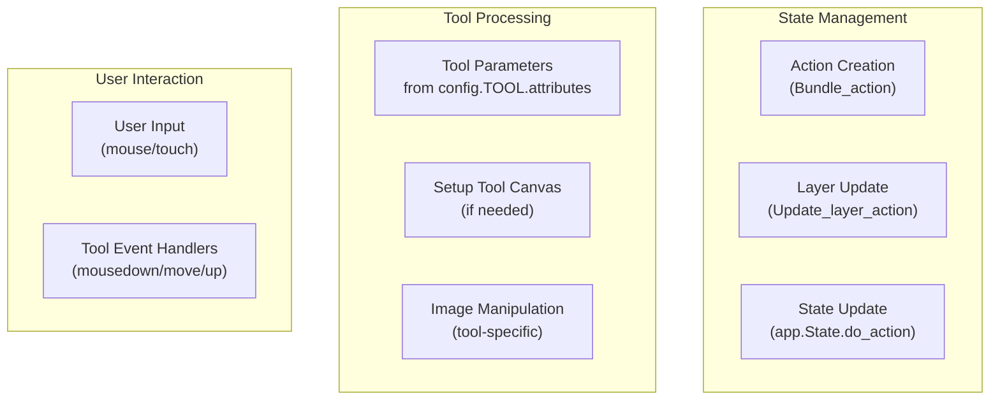
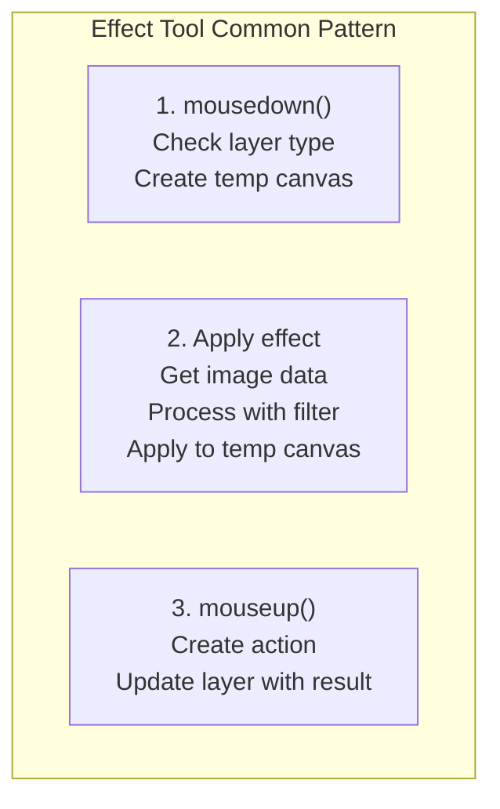

# Tools

> **Relevant source files**
> * [images/icons/magic_erase.svg](https://github.com/viliusle/miniPaint/blob/6d0b95e5/images/icons/magic_erase.svg)
> * [src/js/core/base-tools.js](https://github.com/viliusle/miniPaint/blob/6d0b95e5/src/js/core/base-tools.js)
> * [src/js/tools/blur.js](https://github.com/viliusle/miniPaint/blob/6d0b95e5/src/js/tools/blur.js)
> * [src/js/tools/brush.js](https://github.com/viliusle/miniPaint/blob/6d0b95e5/src/js/tools/brush.js)
> * [src/js/tools/bulge_pinch.js](https://github.com/viliusle/miniPaint/blob/6d0b95e5/src/js/tools/bulge_pinch.js)
> * [src/js/tools/clone.js](https://github.com/viliusle/miniPaint/blob/6d0b95e5/src/js/tools/clone.js)
> * [src/js/tools/desaturate.js](https://github.com/viliusle/miniPaint/blob/6d0b95e5/src/js/tools/desaturate.js)
> * [src/js/tools/erase.js](https://github.com/viliusle/miniPaint/blob/6d0b95e5/src/js/tools/erase.js)
> * [src/js/tools/fill.js](https://github.com/viliusle/miniPaint/blob/6d0b95e5/src/js/tools/fill.js)
> * [src/js/tools/gradient.js](https://github.com/viliusle/miniPaint/blob/6d0b95e5/src/js/tools/gradient.js)
> * [src/js/tools/magic_erase.js](https://github.com/viliusle/miniPaint/blob/6d0b95e5/src/js/tools/magic_erase.js)
> * [src/js/tools/pencil.js](https://github.com/viliusle/miniPaint/blob/6d0b95e5/src/js/tools/pencil.js)
> * [src/js/tools/sharpen.js](https://github.com/viliusle/miniPaint/blob/6d0b95e5/src/js/tools/sharpen.js)

This page documents the tool system in miniPaint, which is the core interactive component that allows users to manipulate images. The tool framework provides the foundation for all drawing, selection, and image manipulation functionality in the application. For information about the UI elements that display these tools, see [Tools Panel](/viliusle/miniPaint/3.3-tools-panel).

## Tool Framework Overview

miniPaint's tool system is built around a base class architecture that allows for easy extension and consistent behavior across all tools. Each tool inherits from a common base class and implements specific functionality for different image editing operations.

### Tool Class Hierarchy

```sql
#mermaid-cxi0r7zohrs{font-family:ui-sans-serif,-apple-system,system-ui,Segoe UI,Helvetica;font-size:16px;fill:#333;}@keyframes edge-animation-frame{from{stroke-dashoffset:0;}}@keyframes dash{to{stroke-dashoffset:0;}}#mermaid-cxi0r7zohrs .edge-animation-slow{stroke-dasharray:9,5!important;stroke-dashoffset:900;animation:dash 50s linear infinite;stroke-linecap:round;}#mermaid-cxi0r7zohrs .edge-animation-fast{stroke-dasharray:9,5!important;stroke-dashoffset:900;animation:dash 20s linear infinite;stroke-linecap:round;}#mermaid-cxi0r7zohrs .error-icon{fill:#dddddd;}#mermaid-cxi0r7zohrs .error-text{fill:#222222;stroke:#222222;}#mermaid-cxi0r7zohrs .edge-thickness-normal{stroke-width:1px;}#mermaid-cxi0r7zohrs .edge-thickness-thick{stroke-width:3.5px;}#mermaid-cxi0r7zohrs .edge-pattern-solid{stroke-dasharray:0;}#mermaid-cxi0r7zohrs .edge-thickness-invisible{stroke-width:0;fill:none;}#mermaid-cxi0r7zohrs .edge-pattern-dashed{stroke-dasharray:3;}#mermaid-cxi0r7zohrs .edge-pattern-dotted{stroke-dasharray:2;}#mermaid-cxi0r7zohrs .marker{fill:#999;stroke:#999;}#mermaid-cxi0r7zohrs .marker.cross{stroke:#999;}#mermaid-cxi0r7zohrs svg{font-family:ui-sans-serif,-apple-system,system-ui,Segoe UI,Helvetica;font-size:16px;}#mermaid-cxi0r7zohrs p{margin:0;}#mermaid-cxi0r7zohrs g.classGroup text{fill:#dddddd;stroke:none;font-family:ui-sans-serif,-apple-system,system-ui,Segoe UI,Helvetica;font-size:10px;}#mermaid-cxi0r7zohrs g.classGroup text .title{font-weight:bolder;}#mermaid-cxi0r7zohrs .cluster-label text{fill:#444;}#mermaid-cxi0r7zohrs .cluster-label span{color:#444;}#mermaid-cxi0r7zohrs .cluster-label span p{background-color:transparent;}#mermaid-cxi0r7zohrs .cluster rect{fill:#f8f8f8;stroke:#dddddd;stroke-width:1px;}#mermaid-cxi0r7zohrs .cluster text{fill:#444;}#mermaid-cxi0r7zohrs .cluster span{color:#444;}#mermaid-cxi0r7zohrs .nodeLabel,#mermaid-cxi0r7zohrs .edgeLabel{color:#333333;}#mermaid-cxi0r7zohrs .noteLabel .nodeLabel,#mermaid-cxi0r7zohrs .noteLabel .edgeLabel{color:#333;}#mermaid-cxi0r7zohrs .edgeLabel .label rect{fill:#ffffff;}#mermaid-cxi0r7zohrs .label text{fill:#333333;}#mermaid-cxi0r7zohrs .labelBkg{background:#ffffff;}#mermaid-cxi0r7zohrs .edgeLabel .label span{background:#ffffff;}#mermaid-cxi0r7zohrs .classTitle{font-weight:bolder;}#mermaid-cxi0r7zohrs .node rect,#mermaid-cxi0r7zohrs .node circle,#mermaid-cxi0r7zohrs .node ellipse,#mermaid-cxi0r7zohrs .node polygon,#mermaid-cxi0r7zohrs .node path{fill:#ffffff;stroke:#dddddd;stroke-width:1;}#mermaid-cxi0r7zohrs .divider{stroke:#dddddd;stroke-width:1;}#mermaid-cxi0r7zohrs g.clickable{cursor:pointer;}#mermaid-cxi0r7zohrs g.classGroup rect{fill:#ffffff;stroke:#dddddd;}#mermaid-cxi0r7zohrs g.classGroup line{stroke:#dddddd;stroke-width:1;}#mermaid-cxi0r7zohrs .classLabel .box{stroke:none;stroke-width:0;fill:#ffffff;opacity:0.5;}#mermaid-cxi0r7zohrs .classLabel .label{fill:#dddddd;font-size:10px;}#mermaid-cxi0r7zohrs .relation{stroke:#999;stroke-width:1;fill:none;}#mermaid-cxi0r7zohrs .dashed-line{stroke-dasharray:3;}#mermaid-cxi0r7zohrs .dotted-line{stroke-dasharray:1 2;}#mermaid-cxi0r7zohrs [id$="-compositionStart"],#mermaid-cxi0r7zohrs .composition{fill:#999!important;stroke:#999!important;stroke-width:1;}#mermaid-cxi0r7zohrs [id$="-compositionEnd"],#mermaid-cxi0r7zohrs .composition{fill:#999!important;stroke:#999!important;stroke-width:1;}#mermaid-cxi0r7zohrs [id$="-dependencyStart"],#mermaid-cxi0r7zohrs .dependency{fill:#999!important;stroke:#999!important;stroke-width:1;}#mermaid-cxi0r7zohrs [id$="-dependencyEnd"],#mermaid-cxi0r7zohrs .dependency{fill:#999!important;stroke:#999!important;stroke-width:1;}#mermaid-cxi0r7zohrs [id$="-extensionStart"],#mermaid-cxi0r7zohrs .extension{fill:transparent!important;stroke:#999!important;stroke-width:1;}#mermaid-cxi0r7zohrs [id$="-extensionEnd"],#mermaid-cxi0r7zohrs .extension{fill:transparent!important;stroke:#999!important;stroke-width:1;}#mermaid-cxi0r7zohrs [id$="-aggregationStart"],#mermaid-cxi0r7zohrs .aggregation{fill:transparent!important;stroke:#999!important;stroke-width:1;}#mermaid-cxi0r7zohrs [id$="-aggregationEnd"],#mermaid-cxi0r7zohrs .aggregation{fill:transparent!important;stroke:#999!important;stroke-width:1;}#mermaid-cxi0r7zohrs [id$="-lollipopStart"],#mermaid-cxi0r7zohrs .lollipop{fill:#ffffff!important;stroke:#999!important;stroke-width:1;}#mermaid-cxi0r7zohrs [id$="-lollipopEnd"],#mermaid-cxi0r7zohrs .lollipop{fill:#ffffff!important;stroke:#999!important;stroke-width:1;}#mermaid-cxi0r7zohrs .edgeTerminals{font-size:11px;line-height:initial;}#mermaid-cxi0r7zohrs .classTitleText{text-anchor:middle;font-size:18px;fill:#333;}#mermaid-cxi0r7zohrs .edgeLabel[data-look="neo"]{background-color:#ffffff;text-align:center;}#mermaid-cxi0r7zohrs .edgeLabel[data-look="neo"] p{background-color:#ffffff;}#mermaid-cxi0r7zohrs .edgeLabel[data-look="neo"] rect{opacity:0.5;background-color:#ffffff;fill:#ffffff;}#mermaid-cxi0r7zohrs .label-icon{display:inline-block;height:1em;overflow:visible;vertical-align:-0.125em;}#mermaid-cxi0r7zohrs .node .label-icon path{fill:currentColor;stroke:revert;stroke-width:revert;}#mermaid-cxi0r7zohrs .node .neo-node{stroke:#dddddd;}#mermaid-cxi0r7zohrs [data-look="neo"].node rect,#mermaid-cxi0r7zohrs [data-look="neo"].cluster rect,#mermaid-cxi0r7zohrs [data-look="neo"].node polygon{stroke:url(#mermaid-cxi0r7zohrs-gradient);filter:drop-shadow( 1px 2px 2px rgba(185,185,185,1));}#mermaid-cxi0r7zohrs [data-look="neo"].node path{stroke:url(#mermaid-cxi0r7zohrs-gradient);stroke-width:1px;}#mermaid-cxi0r7zohrs [data-look="neo"].node .outer-path{filter:drop-shadow( 1px 2px 2px rgba(185,185,185,1));}#mermaid-cxi0r7zohrs [data-look="neo"].node .neo-line path{stroke:#dddddd;filter:none;}#mermaid-cxi0r7zohrs [data-look="neo"].node circle{stroke:url(#mermaid-cxi0r7zohrs-gradient);filter:drop-shadow( 1px 2px 2px rgba(185,185,185,1));}#mermaid-cxi0r7zohrs [data-look="neo"].node circle .state-start{fill:#000000;}#mermaid-cxi0r7zohrs [data-look="neo"].icon-shape .icon{fill:url(#mermaid-cxi0r7zohrs-gradient);filter:drop-shadow( 1px 2px 2px rgba(185,185,185,1));}#mermaid-cxi0r7zohrs [data-look="neo"].icon-shape .icon-neo path{stroke:url(#mermaid-cxi0r7zohrs-gradient);filter:drop-shadow( 1px 2px 2px rgba(185,185,185,1));}#mermaid-cxi0r7zohrs :root{--mermaid-font-family:"trebuchet ms",verdana,arial,sans-serif;}Base_tools_class+load()+mousedown()+mousemove()+mouseup()+getParams()+get_mouse_info()+show_mouse_cursor()+default_events()Drawing_toolsFill_toolsEffect_toolsBrush_classPencil_classFill_classGradient_classBlur_classSharpen_classDesaturate_classClone_classBulgePinch_classErase_classMagic_erase_class
```

Sources: [src/js/core/base-tools.js](https://github.com/viliusle/miniPaint/blob/6d0b95e5/src/js/core/base-tools.js)

 [src/js/tools/brush.js](https://github.com/viliusle/miniPaint/blob/6d0b95e5/src/js/tools/brush.js)

 [src/js/tools/pencil.js](https://github.com/viliusle/miniPaint/blob/6d0b95e5/src/js/tools/pencil.js)

 [src/js/tools/fill.js](https://github.com/viliusle/miniPaint/blob/6d0b95e5/src/js/tools/fill.js)

 [src/js/tools/gradient.js](https://github.com/viliusle/miniPaint/blob/6d0b95e5/src/js/tools/gradient.js)

 [src/js/tools/erase.js](https://github.com/viliusle/miniPaint/blob/6d0b95e5/src/js/tools/erase.js)

 [src/js/tools/magic_erase.js](https://github.com/viliusle/miniPaint/blob/6d0b95e5/src/js/tools/magic_erase.js)

 [src/js/tools/blur.js](https://github.com/viliusle/miniPaint/blob/6d0b95e5/src/js/tools/blur.js)

 [src/js/tools/sharpen.js](https://github.com/viliusle/miniPaint/blob/6d0b95e5/src/js/tools/sharpen.js)

 [src/js/tools/desaturate.js](https://github.com/viliusle/miniPaint/blob/6d0b95e5/src/js/tools/desaturate.js)

 [src/js/tools/clone.js](https://github.com/viliusle/miniPaint/blob/6d0b95e5/src/js/tools/clone.js)

 [src/js/tools/bulge_pinch.js](https://github.com/viliusle/miniPaint/blob/6d0b95e5/src/js/tools/bulge_pinch.js)

The `Base_tools_class` provides common functionality that all tools inherit, including:

* Mouse and touch event handling
* Parameter management
* Layer interaction
* Mouse position tracking and cursor visualization

## Tool Operation Flow



Sources: [src/js/tools/brush.js L197-L280](https://github.com/viliusle/miniPaint/blob/6d0b95e5/src/js/tools/brush.js#L197-L280)

 [src/js/tools/pencil.js L103-L157](https://github.com/viliusle/miniPaint/blob/6d0b95e5/src/js/tools/pencil.js#L103-L157)

 [src/js/core/base-tools.js L375-L391](https://github.com/viliusle/miniPaint/blob/6d0b95e5/src/js/core/base-tools.js#L375-L391)

## Base Tool Class

The `Base_tools_class` provides the foundation for all tools in miniPaint. It handles common functionality such as:

1. **Event Management**: Registers and manages mouse and touch events
2. **Mouse Tracking**: Tracks mouse position, drag state, and click validity
3. **Parameter Handling**: Provides access to tool-specific parameters
4. **Cursor Visualization**: Shows the tool cursor with appropriate size and shape
5. **Snapping**: Implements object snapping functionality for shape tools

Key methods in `Base_tools_class`:

| Method | Purpose |
| --- | --- |
| `load()` | Called when tool is activated, sets up event listeners |
| `dragStart/dragMove/dragEnd` | Handle mouse/touch interactions |
| `getParams()` | Retrieves tool-specific parameters from global config |
| `get_mouse_info()` | Returns standardized mouse position and state information |
| `show_mouse_cursor()` | Displays custom cursor for tools |
| `default_events()` | Sets up standard mouse/touch event handlers |

Sources: [src/js/core/base-tools.js L15-L734](https://github.com/viliusle/miniPaint/blob/6d0b95e5/src/js/core/base-tools.js#L15-L734)

## Drawing Tools

Drawing tools create vector or rasterized content on layers. These tools track mouse movements to create strokes and shapes.

### Brush

The Brush tool creates smooth, anti-aliased strokes with support for pressure sensitivity (when using a pen tablet). It uses an action-based approach to create new layers or modify existing ones.

Key features:

* Pressure sensitivity support
* Smooth curve rendering
* Multiple stroke stabilization methods

Implementation details:

* Creates data structures containing arrays of coordinates and size values
* Renders smooth paths using quadratic curves
* Supports legacy data format conversion

Sources: [src/js/tools/brush.js L6-L570](https://github.com/viliusle/miniPaint/blob/6d0b95e5/src/js/tools/brush.js#L6-L570)

### Pencil

The Pencil tool creates aliased (pixelated) strokes without anti-aliasing, giving a sharp, traditional digital appearance. Like the Brush tool, it operates through the action system.

Key differences from Brush:

* Creates aliased (non-anti-aliased) strokes
* Simpler rendering logic
* Different visual appearance

Sources: [src/js/tools/pencil.js L6-L306](https://github.com/viliusle/miniPaint/blob/6d0b95e5/src/js/tools/pencil.js#L6-L306)

## Fill Tools

Fill tools apply colors or gradients to areas of the canvas.

### Fill Tool

The Fill tool (also known as "bucket fill") applies a color to connected pixels that match a specified color tolerance. It functions by:

1. Finding pixels similar to the clicked position
2. Applying a new color to those pixels
3. Supporting both contiguous (connected) and non-contiguous fill modes

Implementation details:

* Uses a flood-fill algorithm for contiguous mode
* Can apply global fill based on color similarity
* Supports transparency and anti-aliasing

Sources: [src/js/tools/fill.js L8-L231](https://github.com/viliusle/miniPaint/blob/6d0b95e5/src/js/tools/fill.js#L8-L231)

### Gradient Tool

The Gradient tool creates smooth color transitions. It supports:

* Linear gradients (from one point to another)
* Radial gradients (spreading outward from a center point)

Implementation details:

* Uses canvas gradient APIs
* Supports alpha/transparency in the gradient
* Handles both linear and radial rendering modes

Sources: [src/js/tools/gradient.js L7-L184](https://github.com/viliusle/miniPaint/blob/6d0b95e5/src/js/tools/gradient.js#L7-L184)

## Effect Tools

Effect tools apply image processing effects to existing content.



Sources: [src/js/tools/blur.js L37-L137](https://github.com/viliusle/miniPaint/blob/6d0b95e5/src/js/tools/blur.js#L37-L137)

 [src/js/tools/sharpen.js L37-L137](https://github.com/viliusle/miniPaint/blob/6d0b95e5/src/js/tools/sharpen.js#L37-L137)

 [src/js/tools/desaturate.js L37-L133](https://github.com/viliusle/miniPaint/blob/6d0b95e5/src/js/tools/desaturate.js#L37-L133)

### Blur, Sharpen, and Desaturate

These tools apply common image processing effects:

* **Blur**: Softens pixels using a StackBlur algorithm
* **Sharpen**: Enhances edges and details
* **Desaturate**: Removes color information (grayscale)

Implementation pattern:

1. Create a temporary canvas with the layer's image
2. Apply the effect to a circular region around the mouse
3. Update the layer through the action system

Sources: [src/js/tools/blur.js](https://github.com/viliusle/miniPaint/blob/6d0b95e5/src/js/tools/blur.js)

 [src/js/tools/sharpen.js](https://github.com/viliusle/miniPaint/blob/6d0b95e5/src/js/tools/sharpen.js)

 [src/js/tools/desaturate.js](https://github.com/viliusle/miniPaint/blob/6d0b95e5/src/js/tools/desaturate.js)

### Clone Tool

The Clone tool allows copying pixels from one area to another. Key features:

* Set source position via right-click or long press
* Clone from current or previous layer
* Apply with various sizes and anti-aliasing options

Implementation details:

* Stores source coordinates
* Creates temporary canvas for preview
* Copies pixel data from source to destination

Sources: [src/js/tools/clone.js L8-L336](https://github.com/viliusle/miniPaint/blob/6d0b95e5/src/js/tools/clone.js#L8-L336)

## Erase Tools

### Erase Tool

The Erase tool removes pixels from image layers by setting their alpha value to transparent. Features include:

* Circular or rectangular eraser shapes
* Size adjustment
* Anti-aliasing option

Implementation details:

* Uses destination-out composite operation
* Supports both circle and rectangle modes
* Creates a smooth erasing experience

Sources: [src/js/tools/erase.js L7-L207](https://github.com/viliusle/miniPaint/blob/6d0b95e5/src/js/tools/erase.js#L7-L207)

### Magic Erase Tool

The Magic Erase tool removes pixels based on color similarity, functioning like an inverse of the Fill tool. Features:

* Remove areas of similar color
* Adjustable tolerance
* Contiguous or non-contiguous modes

Implementation details:

* Uses a similar algorithm to the Fill tool
* Sets matching pixels to transparent
* Supports anti-aliasing at the edges

Sources: [src/js/tools/magic_erase.js L7-L214](https://github.com/viliusle/miniPaint/blob/6d0b95e5/src/js/tools/magic_erase.js#L7-L214)

 [images/icons/magic_erase.svg](https://github.com/viliusle/miniPaint/blob/6d0b95e5/images/icons/magic_erase.svg)

## Tool Integration with the Action System

Tools in miniPaint integrate with the application's action system to enable undo/redo functionality. The typical pattern is:

1. On mouse down: * Create a new layer or prepare to modify existing layer * Start tracking actions with a Bundle_action
2. During mouse move: * Update the working canvas/data * Render preview changes
3. On mouse up: * Finalize changes * Add to the action history * Enable undo/redo of the operation

Example from Brush tool:

```sql
- mousedown: Create new "brush_layer" or prepare existing layer
- mousemove: Add points to stroke data
- mouseup: Finalize layer dimensions and data
```

Sources: [src/js/tools/brush.js L197-L280](https://github.com/viliusle/miniPaint/blob/6d0b95e5/src/js/tools/brush.js#L197-L280)

 [src/js/tools/brush.js L555-L565](https://github.com/viliusle/miniPaint/blob/6d0b95e5/src/js/tools/brush.js#L555-L565)

## Tool Event Handling

Tools handle mouse and touch events through a consistent pattern:

```mermaid
flowchart TD

mermaid-oiqjlrsulv-flowchart-EventListener["Document Event Listeners<br>(mousedown/mousemove/mouseup<br>touchstart/touchmove/touchend)"]
mermaid-oiqjlrsulv-flowchart-ToolCheck["Check if tool is active<br>(config.TOOL.name == this.name)"]
mermaid-oiqjlrsulv-flowchart-ValidCheck["Check if click is valid<br>(mouse.click_valid)"]
mermaid-oiqjlrsulv-flowchart-LayerCheck["Check layer compatibility<br>(if needed)"]
mermaid-oiqjlrsulv-flowchart-ToolAction["Execute tool-specific action"]
mermaid-oiqjlrsulv-flowchart-EndProcess["End processing"]
mermaid-oiqjlrsulv-flowchart-ShowError["Show error message"]
```



Sources: [src/js/core/base-tools.js L70-L105](https://github.com/viliusle/miniPaint/blob/6d0b95e5/src/js/core/base-tools.js#L70-L105)

 [src/js/tools/brush.js L22-L61](https://github.com/viliusle/miniPaint/blob/6d0b95e5/src/js/tools/brush.js#L22-L61)

## Tool Parameters

Tool parameters are stored in `config.TOOL.attributes` and retrieved using the `getParams()` method. These parameters control the behavior of each tool and can be adjusted by the user through the UI.

Common parameters across tools include:

* `size`: Size of the tool effect (brush width, effect radius)
* `power`/`strength`: Intensity of the effect
* `anti_aliasing`: Whether to apply anti-aliasing

Tool-specific parameters:

* Brush: `pressure` (enable/disable pressure sensitivity)
* Fill: `contiguous` (fill only connected pixels or all matching pixels)
* Gradient: `radial` (use radial or linear gradient)

Sources: [src/js/core/base-tools.js L282-L298](https://github.com/viliusle/miniPaint/blob/6d0b95e5/src/js/core/base-tools.js#L282-L298)

## Extending the Tool System

To create a new tool in miniPaint, you should:

1. Create a new class that extends `Base_tools_class`
2. Implement required methods (`load`, `mousedown`, `mousemove`, `mouseup`)
3. Add a `render` method if the tool creates vector content
4. Register the tool's parameters in the configuration system
5. Add appropriate UI elements

The minimal structure for a new tool class:

```python
class New_Tool_class extends Base_tools_class {    constructor(ctx) {        super();        this.Base_layers = new Base_layers_class();        this.name = 'new_tool';    }        load() {        this.default_events();    }        mousedown(e) {        // Handle start of tool operation    }        mousemove(e) {        // Handle tool movement    }        mouseup(e) {        // Handle completion of tool operation    }}
```

Sources: [src/js/core/base-tools.js L15-L40](https://github.com/viliusle/miniPaint/blob/6d0b95e5/src/js/core/base-tools.js#L15-L40)

 [src/js/tools/brush.js L6-L20](https://github.com/viliusle/miniPaint/blob/6d0b95e5/src/js/tools/brush.js#L6-L20)